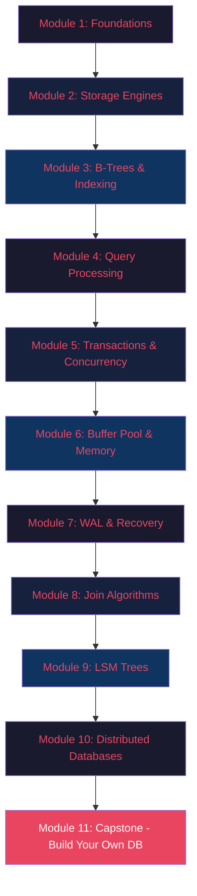
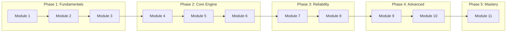

# Database Internals: From Scratch to Contributor

A comprehensive, hands-on course to understand database internals deeply enough to contribute to open-source database projects like PostgreSQL, SQLite, CockroachDB, TiDB, and more.

---

## Course Architecture

---

## Course Index

### Module 1: Foundations & Architecture
> *What is a database, really? Beyond the SQL interface.*

| File | Description |
|------|-------------|
| [teach.md](module-01-foundations/teach.md) | Core concepts: DBMS architecture, components, data models |
| [explanation.md](module-01-foundations/explanation.md) | Deep dive into database layered architecture |
| [implementation.md](module-01-foundations/implementation.md) | Walkthrough of real database source code structure |
| [questions.md](module-01-foundations/questions.md) | Quiz: Test your foundational knowledge |
| [project.md](module-01-foundations/project.md) | Project: Build a simple REPL + SQL parser |
| [links.md](module-01-foundations/links.md) | Resources: blogs, videos, papers |

---

### Module 2: Storage Engines & Disk I/O
> *How data actually lives on disk. Pages, files, and the OS.*

| File | Description |
|------|-------------|
| [teach.md](module-02-storage-engines/teach.md) | Storage hierarchy, page layout, heap files, slotted pages |
| [explanation.md](module-02-storage-engines/explanation.md) | Deep dive into page structure and file organization |
| [implementation.md](module-02-storage-engines/implementation.md) | Implementing a page manager and heap file |
| [questions.md](module-02-storage-engines/questions.md) | Quiz: Storage internals |
| [project.md](module-02-storage-engines/project.md) | Project: Build a page-based storage manager |
| [links.md](module-02-storage-engines/links.md) | Resources: storage engine design |

---

### Module 3: B-Trees & Indexing
> *The data structure that powers 90% of databases.*

| File | Description |
|------|-------------|
| [teach.md](module-03-btrees-indexing/teach.md) | B-Tree, B+Tree, hash indexes, skip lists |
| [explanation.md](module-03-btrees-indexing/explanation.md) | Deep dive into B+Tree operations and balancing |
| [implementation.md](module-03-btrees-indexing/implementation.md) | Building a disk-backed B+Tree from scratch |
| [questions.md](module-03-btrees-indexing/questions.md) | Quiz: Indexing internals |
| [project.md](module-03-btrees-indexing/project.md) | Project: Implement a persistent B+Tree index |
| [links.md](module-03-btrees-indexing/links.md) | Resources: indexing deep dives |

---

### Module 4: Query Processing & Optimization
> *From SQL string to execution plan. The brain of the database.*

| File | Description |
|------|-------------|
| [teach.md](module-04-query-processing/teach.md) | Parsing, binding, planning, optimization |
| [explanation.md](module-04-query-processing/explanation.md) | Deep dive into cost-based optimization & plan trees |
| [implementation.md](module-04-query-processing/implementation.md) | Building a query planner with rule-based optimization |
| [questions.md](module-04-query-processing/questions.md) | Quiz: Query processing internals |
| [project.md](module-04-query-processing/project.md) | Project: Build a SQL query planner |
| [links.md](module-04-query-processing/links.md) | Resources: query optimization |

---

### Module 5: Transactions & Concurrency Control
> *ACID guarantees. Locks, MVCC, isolation levels — the hard stuff.*

| File | Description |
|------|-------------|
| [teach.md](module-05-transactions-concurrency/teach.md) | ACID, isolation levels, 2PL, MVCC, deadlocks |
| [explanation.md](module-05-transactions-concurrency/explanation.md) | Deep dive into MVCC implementations |
| [implementation.md](module-05-transactions-concurrency/implementation.md) | Implementing a lock manager and MVCC |
| [questions.md](module-05-transactions-concurrency/questions.md) | Quiz: Transactions & concurrency |
| [project.md](module-05-transactions-concurrency/project.md) | Project: Add transaction support to your DB |
| [links.md](module-05-transactions-concurrency/links.md) | Resources: concurrency control |

---

### Module 6: Buffer Pool & Memory Management
> *The cache between disk and queries. Critical for performance.*

| File | Description |
|------|-------------|
| [teach.md](module-06-buffer-pool-memory/teach.md) | Buffer pool, page replacement policies, pin/unpin |
| [explanation.md](module-06-buffer-pool-memory/explanation.md) | Deep dive into LRU, Clock, LRU-K algorithms |
| [implementation.md](module-06-buffer-pool-memory/implementation.md) | Building a buffer pool manager |
| [questions.md](module-06-buffer-pool-memory/questions.md) | Quiz: Buffer management |
| [project.md](module-06-buffer-pool-memory/project.md) | Project: Implement a buffer pool with eviction |
| [links.md](module-06-buffer-pool-memory/links.md) | Resources: memory management |

---

### Module 7: Write-Ahead Logging & Crash Recovery
> *How databases survive power failures and crashes.*

| File | Description |
|------|-------------|
| [teach.md](module-07-wal-recovery/teach.md) | WAL protocol, ARIES, checkpointing, log structure |
| [explanation.md](module-07-wal-recovery/explanation.md) | Deep dive into ARIES recovery algorithm |
| [implementation.md](module-07-wal-recovery/implementation.md) | Implementing WAL and crash recovery |
| [questions.md](module-07-wal-recovery/questions.md) | Quiz: Recovery internals |
| [project.md](module-07-wal-recovery/project.md) | Project: Add WAL to your storage engine |
| [links.md](module-07-wal-recovery/links.md) | Resources: recovery systems |

---

### Module 8: Join Algorithms & Query Execution
> *Nested loops, hash joins, sort-merge joins — the execution engine.*

| File | Description |
|------|-------------|
| [teach.md](module-08-join-algorithms/teach.md) | Join algorithms, iterator model, vectorized execution |
| [explanation.md](module-08-join-algorithms/explanation.md) | Deep dive into execution engine architectures |
| [implementation.md](module-08-join-algorithms/implementation.md) | Implementing join operators |
| [questions.md](module-08-join-algorithms/questions.md) | Quiz: Join algorithms & execution |
| [project.md](module-08-join-algorithms/project.md) | Project: Build a query execution engine |
| [links.md](module-08-join-algorithms/links.md) | Resources: execution engines |

---

### Module 9: LSM Trees & Log-Structured Storage
> *The alternative to B-Trees. Powers RocksDB, LevelDB, Cassandra.*

| File | Description |
|------|-------------|
| [teach.md](module-09-lsm-trees/teach.md) | LSM-Tree architecture, memtable, SSTables, compaction |
| [explanation.md](module-09-lsm-trees/explanation.md) | Deep dive into compaction strategies & bloom filters |
| [implementation.md](module-09-lsm-trees/implementation.md) | Building an LSM-Tree storage engine |
| [questions.md](module-09-lsm-trees/questions.md) | Quiz: LSM internals |
| [project.md](module-09-lsm-trees/project.md) | Project: Build a key-value store with LSM-Tree |
| [links.md](module-09-lsm-trees/links.md) | Resources: LSM-Tree systems |

---

### Module 10: Distributed Databases & Consensus
> *Sharding, replication, Raft, Paxos — scaling beyond one machine.*

| File | Description |
|------|-------------|
| [teach.md](module-10-distributed-databases/teach.md) | CAP theorem, replication, sharding, consensus |
| [explanation.md](module-10-distributed-databases/explanation.md) | Deep dive into Raft consensus and distributed transactions |
| [implementation.md](module-10-distributed-databases/implementation.md) | Understanding distributed DB codebases |
| [questions.md](module-10-distributed-databases/questions.md) | Quiz: Distributed systems |
| [project.md](module-10-distributed-databases/project.md) | Project: Build a replicated key-value store |
| [links.md](module-10-distributed-databases/links.md) | Resources: distributed databases |

---

### Module 11: Capstone — Build Your Own Database
> *Put it all together. Build a working database from scratch.*

| File | Description |
|------|-------------|
| [teach.md](module-11-capstone-build-your-own-db/teach.md) | Architecture decisions for your database |
| [explanation.md](module-11-capstone-build-your-own-db/explanation.md) | Design patterns from real databases |
| [implementation.md](module-11-capstone-build-your-own-db/implementation.md) | Step-by-step implementation guide |
| [questions.md](module-11-capstone-build-your-own-db/questions.md) | Final assessment: comprehensive quiz |
| [project.md](module-11-capstone-build-your-own-db/project.md) | Capstone Project: Full database implementation |
| [links.md](module-11-capstone-build-your-own-db/links.md) | Resources: open-source DBs to contribute to |

---

## Learning Path

## How to Use This Course

1. **Follow the order** — Each module builds on the previous one
2. **For each module**, go through files in this order:
   - `teach.md` — Learn the concepts
   - `explanation.md` — Understand the deep internals
   - `implementation.md` — See how it's built in real databases
   - `project.md` — Build it yourself (most important!)
   - `questions.md` — Test your understanding
   - `links.md` — Go deeper with external resources
3. **Don't skip the projects** — Building is how you truly understand
4. **Read real source code** — The implementation files point you to real DB codebases

## Prerequisites

- Proficiency in at least one systems language (C, C++, Rust, or Go)
- Basic understanding of data structures (arrays, linked lists, hash tables, trees)
- Familiarity with operating system concepts (files, memory, processes)
- Command line comfort

## Recommended Languages for Projects

| Language | Why |
|----------|-----|
| **C** | PostgreSQL, SQLite are written in C. Closest to the metal. |
| **Rust** | Modern safety guarantees. Used in TiKV, sled, Databend. |
| **Go** | Used in CockroachDB, BoltDB, Badger. Great for distributed systems. |
| **C++** | Used in MySQL, RocksDB, DuckDB. Industry standard. |

---

> *"The best way to understand a database is to build one."* — Inspired by the CMU Database Group
