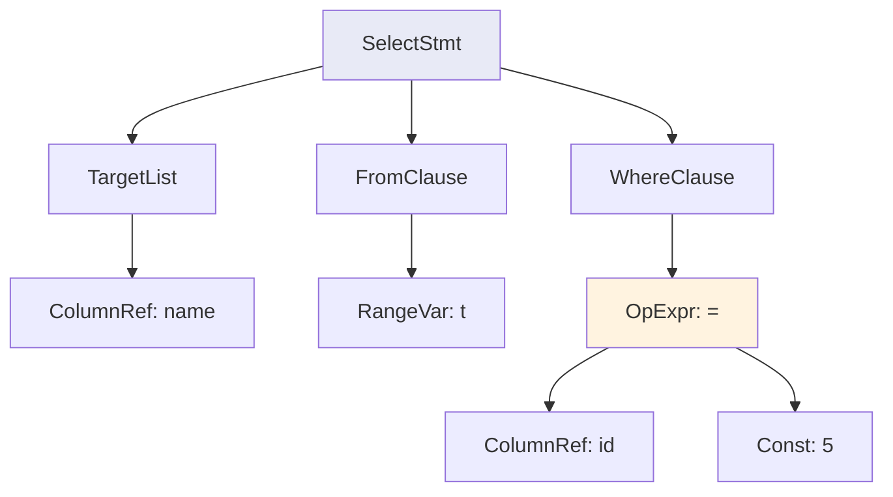
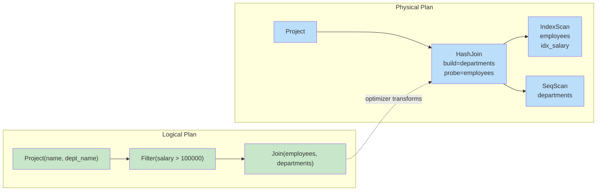
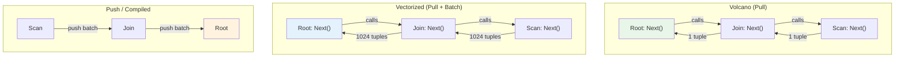
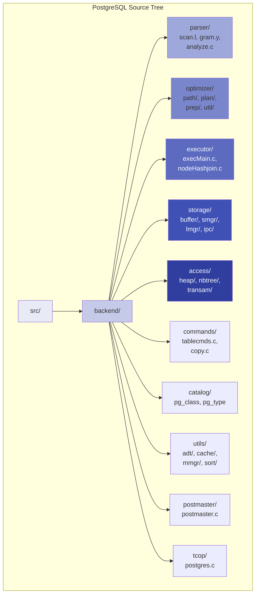
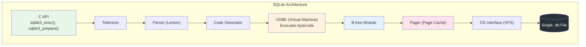
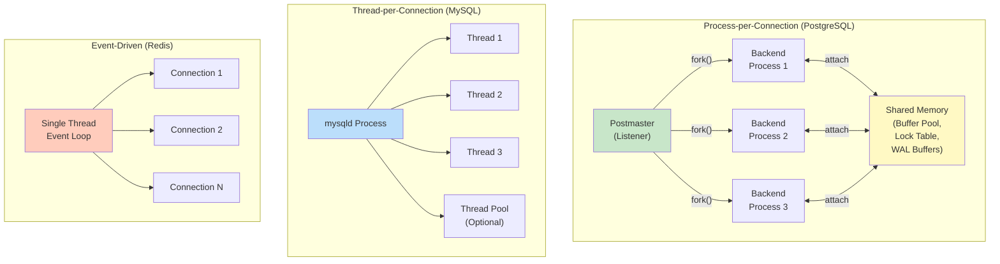
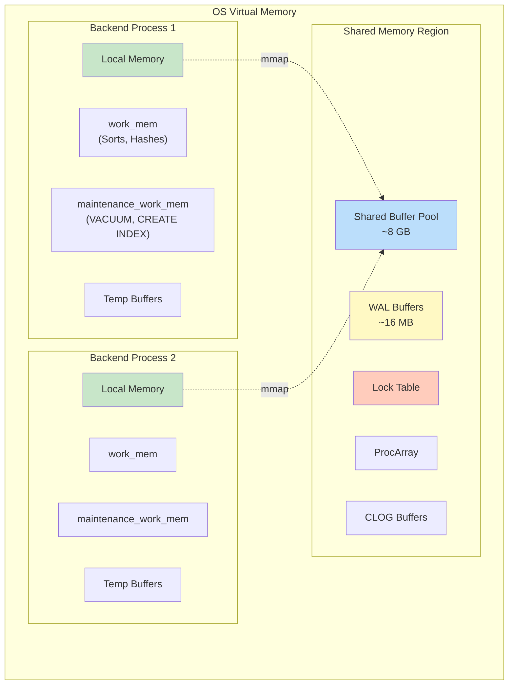
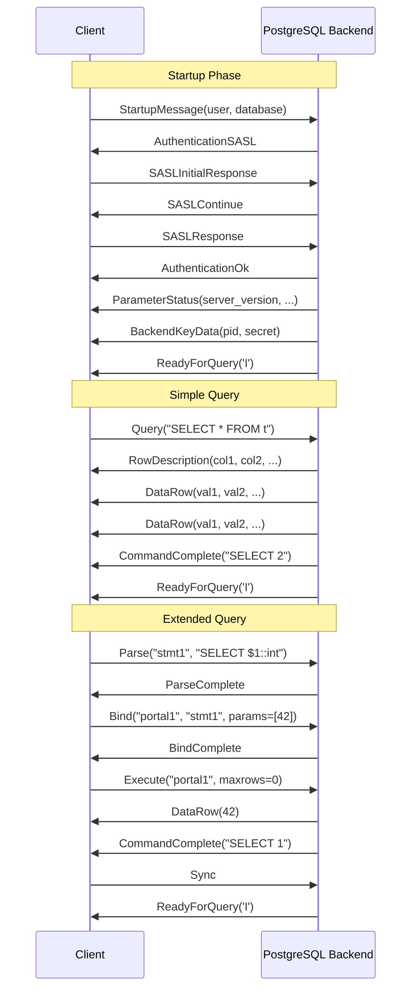
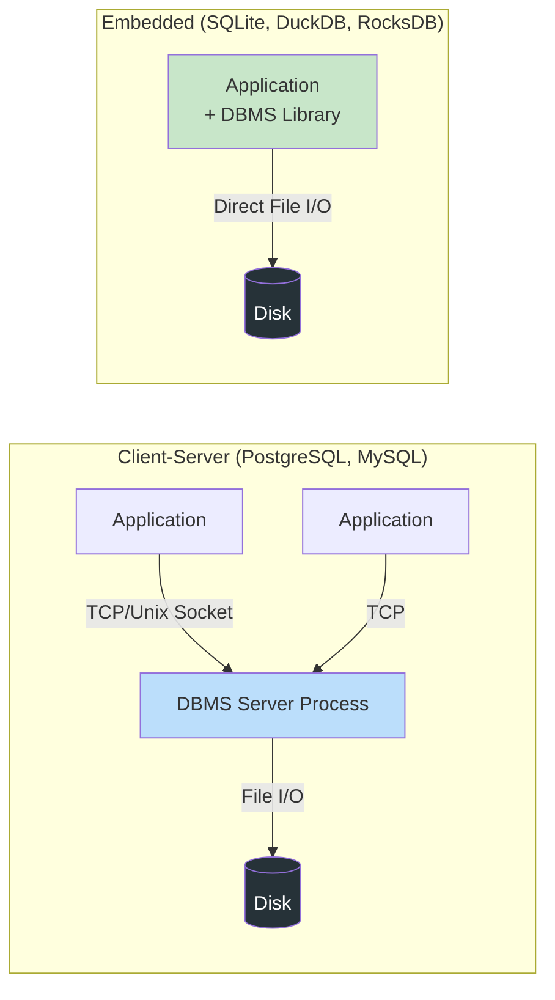

# Module 1: Foundations & Architecture -- Deep Dive Explanations

## 1. Detailed Breakdown of Each Architecture Layer

### 1.1 The Network / Protocol Layer

This is the outermost boundary of the DBMS. It handles:

- **Listening for connections** on a TCP socket (PostgreSQL: port 5432, MySQL: 3306).
- **Authentication**: password, SCRAM-SHA-256, Kerberos, certificate-based.
- **Session management**: allocating per-connection state (current database, user, transaction status).
- **Message framing**: parsing the wire protocol to extract SQL statements, bind parameters, and control messages.

PostgreSQL uses a custom binary protocol with message types like `Query` (simple query), `Parse`/`Bind`/`Execute` (extended query protocol), and `CopyData` (bulk loading). MySQL uses its own protocol; SQLite has no network layer at all -- it is an embedded, in-process library.

### 1.2 The Parser

The parser has two stages:

**Lexer (Tokenizer)**: Reads the raw SQL character stream and produces tokens. For example, `SELECT name FROM t WHERE id = 5` becomes:

```
[SELECT] [IDENTIFIER:"name"] [FROM] [IDENTIFIER:"t"] [WHERE] [IDENTIFIER:"id"] [EQUALS] [INTEGER:5]
```

**Grammar Parser**: A context-free grammar (typically expressed in Yacc/Bison format) consumes the token stream and builds an **Abstract Syntax Tree (AST)**. The AST is a tree representation of the query's syntactic structure:



At this point, the parser knows *nothing* about whether `t` is a real table or `name` is a real column. That is the analyzer's job.

### 1.3 The Analyzer / Binder (Semantic Analysis)

The analyzer transforms the raw AST into a **query tree** with resolved references. It performs:

1. **Name resolution**: Look up `t` in the catalog. Is it a table? A view? A CTE? Find its OID.
2. **Column binding**: Look up `name` in `t`'s column list. Assign the correct data type and column number.
3. **Type checking**: Verify that `id = 5` compares compatible types. Insert implicit casts if needed (e.g., comparing an `int4` column to an `int8` literal).
4. **Permission checking**: Does the current user have `SELECT` privilege on table `t`?
5. **View expansion**: If `t` is a view, inline its definition.

### 1.4 The Query Rewriter

Some systems (PostgreSQL has one, MySQL does not) include a **rewrite** phase between analysis and optimization. The rewriter applies transformation rules:

- Expand views into their underlying queries.
- Apply row-level security policies.
- Execute `INSTEAD OF` rules.

### 1.5 The Query Optimizer

The optimizer is typically the most complex component of a DBMS. It takes the analyzed query tree and produces a **physical plan** -- a tree of concrete operators with specific algorithms chosen.

#### Logical vs. Physical Plans



#### Key optimizer decisions:

| Decision | Options |
|----------|---------|
| Access method | Sequential scan, Index scan, Index-only scan, Bitmap scan |
| Join algorithm | Nested loop, Hash join, Merge join |
| Join order | Left-deep, right-deep, bushy trees |
| Aggregation strategy | Hash aggregation, Sort aggregation |
| Parallelism | Gather workers, parallel scan, parallel hash join |

#### Cost estimation

The optimizer assigns a **cost** to each plan node using:
- **Table statistics**: `pg_statistic` stores histograms, most-common values, distinct counts, and correlation.
- **Selectivity estimation**: What fraction of rows pass a filter? For `salary > 100000`, the optimizer uses the histogram on `salary` to estimate this.
- **I/O cost model**: Random page reads are more expensive than sequential reads. The ratio `random_page_cost / seq_page_cost` is configurable (default 4:1 in PostgreSQL for HDDs; often set to 1.1:1 for SSDs).

### 1.6 The Execution Engine

The execution engine takes the physical plan and actually processes the data.

#### Iterator (Volcano) Model

Each operator implements three methods:

```
Open()   -- Initialize state (open files, allocate memory)
Next()   -- Return the next tuple (or NULL if exhausted)
Close()  -- Release resources
```

The root operator calls `Next()` on its child, which calls `Next()` on *its* child, and so on. Tuples flow **upward**, one at a time (pull-based). This is simple and composable but suffers from high per-tuple overhead due to virtual function calls.

#### Vectorized Model

Instead of one tuple at a time, operators process **batches** (vectors) of tuples -- typically 1024 at a time. This amortizes function-call overhead and enables SIMD (Single Instruction, Multiple Data) CPU optimizations. Used by DuckDB, Vectorwise, ClickHouse.

#### Compiled / Push-Based Model

Instead of pulling tuples, the leaf operators **push** data up through the pipeline. The entire pipeline can be compiled into tight machine code using LLVM (as in HyPer, Umbra, or PostgreSQL's JIT compilation for expressions). This produces the best raw performance but is harder to implement.



### 1.7 The Buffer Pool Manager

The buffer pool sits between the execution engine and disk. Its job is to give the illusion that the entire database is in memory.

**Key operations**:
- `FetchPage(page_id)`: Return a pointer to the page in memory. If not cached, read it from disk and evict a victim if the pool is full.
- `UnpinPage(page_id, is_dirty)`: Indicate that the caller is done with the page. If `is_dirty`, mark it for eventual writeback.
- `FlushPage(page_id)`: Write the page to disk immediately.

**Replacement policies**:
- **LRU (Least Recently Used)**: Simple but vulnerable to sequential flooding (a full table scan evicts all useful pages).
- **Clock (Approximate LRU)**: Cheaper to implement -- uses a circular buffer with reference bits.
- **LRU-K**: Tracks the K-th most recent access. Less susceptible to flooding.
- **ARC (Adaptive Replacement Cache)**: Dynamically balances between recency and frequency. Used by ZFS and IBM DB2.

### 1.8 The Storage Engine

The storage engine manages how data is laid out on disk.

**Heap files**: Unordered collections of pages. Each page contains a header and an array of tuples. PostgreSQL pages are 8 KB.

**Indexes**: Ordered structures for fast lookups.
- **B+ tree**: The workhorse of OLTP databases. All values in leaf nodes; interior nodes store separator keys. O(log n) search.
- **Hash index**: O(1) point lookups, but no range scans.
- **GiST, GIN, BRIN**: Specialized indexes in PostgreSQL for full-text search, geometric data, and large sequential tables.

**Write-Ahead Log (WAL)**: Append-only file recording every change. This is the backbone of crash recovery and replication.

---

## 2. How PostgreSQL Organizes Its Code

PostgreSQL's source code lives in `src/` and is organized by subsystem.



### Key directories:

| Directory | Purpose |
|-----------|---------|
| `src/backend/tcop/postgres.c` | The "traffic cop" -- main query processing loop |
| `src/backend/parser/` | Lexer (`scan.l`) and grammar (`gram.y`), produces parse trees |
| `src/backend/optimizer/` | Cost-based query optimizer (join ordering, path selection) |
| `src/backend/executor/` | Volcano-model executor. One file per node type (`nodeSeqscan.c`, `nodeHashjoin.c`) |
| `src/backend/storage/buffer/` | Buffer pool manager (`bufmgr.c`) |
| `src/backend/storage/lmgr/` | Lock manager |
| `src/backend/access/heap/` | Heap access method (reading/writing table pages) |
| `src/backend/access/nbtree/` | B-tree index implementation |
| `src/backend/access/transam/` | Transaction manager and WAL (`xlog.c`, `xact.c`) |
| `src/backend/catalog/` | System catalog access routines |

### The query lifecycle in PostgreSQL code:

1. `postmaster.c` accepts a connection and forks a backend process.
2. `postgres.c` (`exec_simple_query`) receives the SQL string.
3. `pg_parse_query()` calls the flex/bison parser --> raw parse tree.
4. `pg_analyze_and_rewrite()` --> query tree with resolved names.
5. `pg_plan_queries()` calls the optimizer --> plan tree.
6. `ExecutorRun()` walks the plan tree using the iterator model.

---

## 3. How SQLite Organizes Differently

SQLite is radically different from PostgreSQL in architecture.

| Aspect | PostgreSQL | SQLite |
|--------|-----------|--------|
| Deployment | Client-server, separate process | Embedded library, linked into application |
| Concurrency | Multi-process, MVCC | Single-writer, file locks |
| Storage | Multiple files per table + WAL | Single file for entire database |
| Code size | ~1.3 million lines of C | ~150,000 lines of C (amalgamation) |
| SQL parser | Flex + Bison (LALR) | Lemon (LALR, custom tool) |
| Execution | Volcano iterator model | Bytecode virtual machine |

### SQLite's Virtual Machine (VDBE)

Instead of building a tree of operators, SQLite compiles queries into **bytecode** for its Virtual Database Engine (VDBE). Each bytecode instruction is a simple operation like `Column`, `Compare`, `ResultRow`, `Next`, `Goto`.

You can see the bytecode with `EXPLAIN`:

```sql
sqlite> EXPLAIN SELECT name FROM users WHERE age > 30;
addr  opcode         p1    p2    p3    p4             p5  comment
----  -------------  ----  ----  ----  -------------  --  -------
0     Init           0     9     0                    0   Start
1     OpenRead       0     2     0     3              0   root=2 iDb=0; users
2     Rewind         0     8     0                    0
3     Column         0     2     1                    0   r[1]=users.age
4     Le             2     7     1     BINARY-8       0   if r[1]<=r[2] goto 7
5     Column         0     1     3                    0   r[3]=users.name
6     ResultRow      3     1     0                    0   output=r[3]
7     Next           0     3     0                    1
8     Halt           0     0     0                    0
9     Integer        30    2     0                    0   r[2]=30
10    Goto           0     1     0                    0
```



SQLite does not have a separate optimizer module in the same sense as PostgreSQL. Query planning happens inside the code generator, which uses heuristics and limited cost-based reasoning (the "Next Generation Query Planner" or NGQP, introduced in SQLite 3.8.0).

---

## 4. Process Models

How does a DBMS handle multiple concurrent clients? There are three main models.

### 4.1 Process-per-Connection

Each client connection gets its own **OS process** (via `fork()`).

- **Used by**: PostgreSQL, Oracle (on Unix)
- **Pros**: Strong isolation (a crash in one backend does not affect others), simple programming model.
- **Cons**: High memory overhead per connection (~5-10 MB each in PostgreSQL), `fork()` is expensive, inter-process communication requires shared memory.

### 4.2 Thread-per-Connection

Each client connection gets its own **OS thread** within a single process.

- **Used by**: MySQL, SQL Server, DB2
- **Pros**: Lower memory overhead than processes, faster context switches, no shared memory needed (threads share address space).
- **Cons**: Bugs can crash the entire server, requires careful locking of shared data structures.

### 4.3 Event-Driven (Coroutine / Async I/O)

A small number of threads handle all connections using non-blocking I/O and an event loop.

- **Used by**: Redis, some parts of modern PostgreSQL (background workers), VoltDB
- **Pros**: Scales to thousands of connections with minimal overhead.
- **Cons**: Complex programming model (callback spaghetti or coroutines), hard to debug.



---

## 5. Shared Memory Architecture

In a process-per-connection model (like PostgreSQL), processes cannot directly access each other's memory. They communicate through **shared memory** -- a region of memory mapped into every backend process's address space.

PostgreSQL's shared memory contains:

| Component | Purpose | Typical Size |
|-----------|---------|-------------|
| **Shared Buffer Pool** | Cache of disk pages | 25% of RAM (configurable via `shared_buffers`) |
| **WAL Buffers** | Buffer for WAL records before flush | 16 MB default |
| **Lock Table** | Hash table of all current locks | Grows dynamically |
| **Proc Array** | Array of per-backend state (transaction ID, status) | Small |
| **CLOG Buffers** | Commit status of transactions | Small |
| **Stats Collector** | Accumulates table/index usage statistics | Moderate |



### Local (per-backend) memory

Each backend also has its own **local memory**:

- **work_mem** (default 4 MB): Used for in-memory sorts and hash tables during query execution. If the data exceeds this, PostgreSQL spills to disk (external sort, hash batch files).
- **maintenance_work_mem** (default 64 MB): Used for maintenance operations like `VACUUM` and `CREATE INDEX`.
- **temp_buffers** (default 8 MB): Cache for temporary table pages.

The interplay between shared and local memory is one of the most important aspects of PostgreSQL tuning.

---

## 6. Client-Server Protocol

### 6.1 PostgreSQL Wire Protocol

PostgreSQL's protocol is a binary, message-based protocol over TCP. Key message types:

**Startup flow**:
1. Client sends `StartupMessage` (protocol version, user, database).
2. Server responds with `AuthenticationOk` (or requests password/SCRAM).
3. Server sends `ParameterStatus` messages (server version, encoding, etc.) and `ReadyForQuery`.

**Simple Query Protocol**:
1. Client sends `Query` message containing the SQL string.
2. Server responds with `RowDescription` (column names/types), then `DataRow` messages (one per result row), then `CommandComplete`, then `ReadyForQuery`.

**Extended Query Protocol** (prepared statements):
1. `Parse` -- compile SQL into a prepared statement.
2. `Bind` -- bind parameter values, creating a portal.
3. `Describe` -- get column metadata.
4. `Execute` -- run the portal, with optional row limit.
5. `Sync` -- end of pipeline.



### 6.2 Why the Extended Protocol Matters

The extended protocol separates **planning** from **execution**. A prepared statement is planned once and executed many times with different parameters. This avoids repeated parsing and optimization overhead for frequent queries. It also protects against SQL injection, since parameter values are sent separately from the query text and are never interpreted as SQL.

---

## 7. Connection Pooling

Because each PostgreSQL connection requires a forked backend process (~5-10 MB of memory), applications that open hundreds or thousands of connections can exhaust server resources. **Connection poolers** solve this by maintaining a smaller pool of actual database connections and multiplexing application connections onto them.

Popular connection poolers:
- **PgBouncer**: Lightweight, single-threaded, supports transaction-level and statement-level pooling.
- **Pgpool-II**: Heavier, supports load balancing and replication in addition to pooling.
- **Built-in pooling** (application-side): Most application frameworks (e.g., HikariCP for Java, SQLAlchemy for Python) maintain their own connection pools.

### Pooling modes:

| Mode | Behavior | Limitations |
|------|----------|-------------|
| **Session** | One server connection per client session | Least savings, most compatible |
| **Transaction** | Server connection assigned per transaction, returned to pool between transactions | Cannot use session-level features (SET, prepared statements across transactions) |
| **Statement** | Server connection assigned per statement | Only works for autocommit, most aggressive sharing |

---

## 8. Comparison: Embedded vs. Client-Server Databases



| Feature | Client-Server | Embedded |
|---------|--------------|----------|
| Network overhead | Yes | None |
| Concurrent writers | Many (MVCC/locking) | Usually one |
| Administration | DBA needed | Zero-admin |
| Deployment | Install + configure server | Link a library |
| Use case | Web apps, enterprise | Mobile, desktop, edge, testing |

---

## 9. Summary

Understanding database architecture means understanding *layers* and *trade-offs*. PostgreSQL and SQLite make fundamentally different choices at every layer -- process model, execution model, storage format, concurrency -- yet both are successful because they are optimized for different use cases.

The key takeaways:

1. The layered architecture (parser --> optimizer --> executor --> storage) is universal across database systems, even if the boundaries shift.
2. The process model (process vs. thread vs. event-driven) has profound implications for concurrency, isolation, and performance.
3. Shared memory is the glue that holds a multi-process DBMS together.
4. The wire protocol is the contract between client libraries and the server -- understanding it helps debug performance and compatibility issues.
5. Connection pooling is not optional for production deployments of process-per-connection databases like PostgreSQL.
