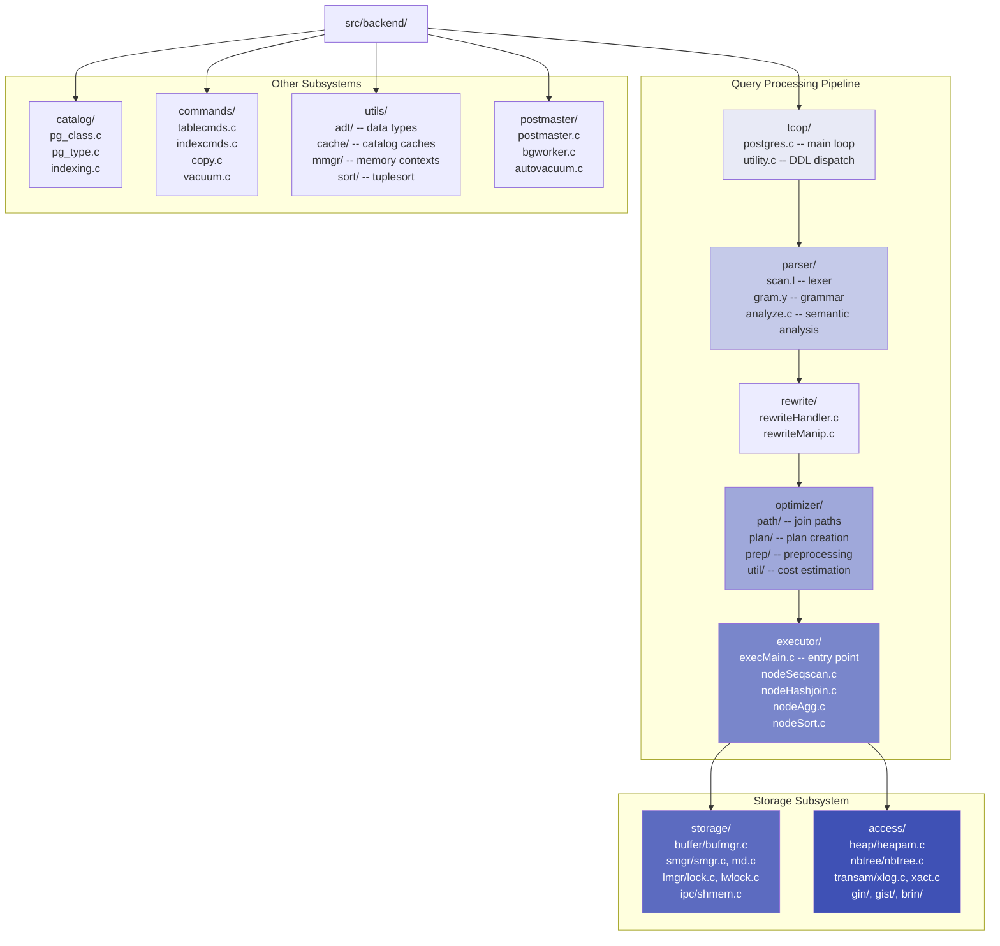
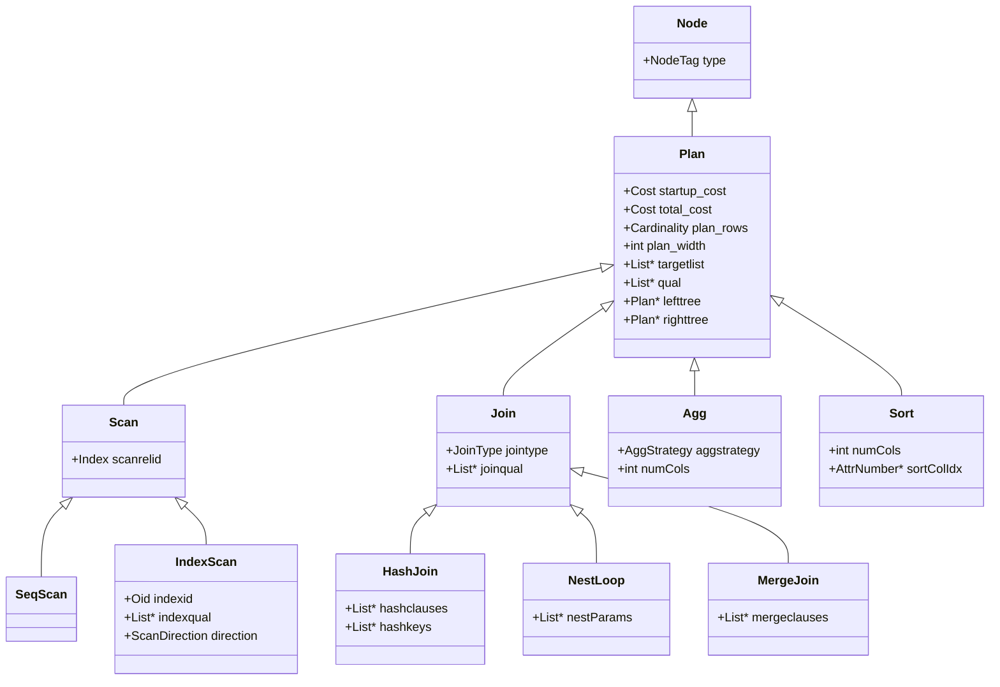
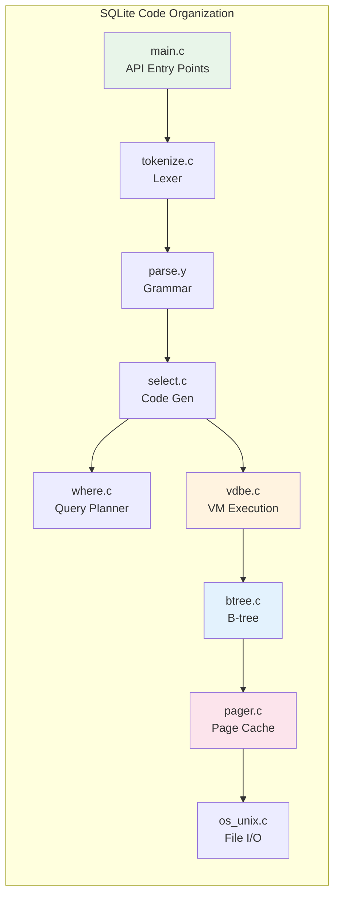
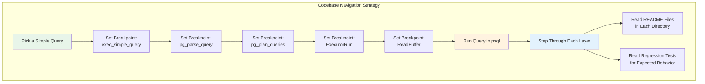

# Module 1: Foundations & Architecture -- Implementation Walkthrough

## 1. Tour of PostgreSQL Source Code

PostgreSQL is written in C (with some Perl and Python for build tooling). The full source tree has over 1.3 million lines of code. This walkthrough will help you navigate it.

### 1.1 Top-Level Directory Structure

```
postgresql/
├── src/
│   ├── backend/          # The server itself (95% of the interesting code)
│   ├── bin/              # Client utilities (psql, pg_dump, pg_ctl, initdb)
│   ├── common/           # Code shared between frontend and backend
│   ├── fe_utils/         # Frontend utility library
│   ├── include/          # All header files
│   ├── interfaces/       # libpq (client library)
│   ├── pl/               # Procedural languages (PL/pgSQL, PL/Python, PL/Perl)
│   ├── port/             # Platform-specific portability code
│   ├── test/             # Regression tests
│   └── timezone/         # Timezone data
├── contrib/              # Optional extension modules (pg_stat_statements, etc.)
├── doc/                  # Documentation (SGML/XML source)
├── configure             # Autotools configure script
└── Makefile              # Top-level Makefile
```

### 1.2 The `src/backend/` Directory in Detail

This is where the database engine lives.



---

## 2. Key Source Files to Study

### 2.1 The Main Loop: `src/backend/tcop/postgres.c`

This is the "traffic cop." Every SQL statement enters through this file. The key function is `exec_simple_query()`:

```c
/*
 * exec_simple_query
 *
 * Execute a "simple Query" protocol message.
 * (Simplified -- the real function is ~200 lines.)
 */
static void
exec_simple_query(const char *query_string)
{
    List       *parsetree_list;
    List       *querytree_list;
    List       *plantree_list;

    /* STEP 1: Parse -- raw SQL string to parse tree */
    parsetree_list = pg_parse_query(query_string);

    foreach(parsetree_item, parsetree_list)
    {
        RawStmt    *parsetree = lfirst_node(RawStmt, parsetree_item);

        /* STEP 2: Analyze & Rewrite -- parse tree to query tree */
        querytree_list = pg_analyze_and_rewrite(parsetree,
                                                 query_string,
                                                 NULL, 0, NULL);

        /* STEP 3: Plan -- query tree to plan tree */
        plantree_list = pg_plan_queries(querytree_list,
                                         query_string,
                                         CURSOR_OPT_PARALLEL_OK,
                                         NULL);

        /* STEP 4: Execute -- walk the plan tree */
        foreach(plan_item, plantree_list)
        {
            PlannedStmt *pstmt = lfirst_node(PlannedStmt, plan_item);

            CreatePortal(...);
            PortalRun(portal, FETCH_ALL, ...);
            /* Results sent to client via the destination receiver */
        }
    }
}
```

This single function shows the entire query pipeline in action.

### 2.2 The Parser: `src/backend/parser/gram.y`

PostgreSQL's grammar file is one of the largest Yacc grammars in existence (~15,000 lines). Here is a simplified excerpt showing how a SELECT statement is parsed:

```c
/* From gram.y (heavily simplified) */

SelectStmt:
    select_no_parens        %prec UMINUS
    | select_with_parens    %prec UMINUS
    ;

simple_select:
    SELECT opt_all_clause opt_target_list
    into_clause from_clause where_clause
    group_clause having_clause window_clause
    {
        SelectStmt *n = makeNode(SelectStmt);
        n->targetList = $3;
        n->intoClause = $4;
        n->fromClause = $5;
        n->whereClause = $6;
        n->groupClause = $7;
        n->havingClause = $8;
        n->windowClause = $9;
        $$ = (Node *) n;
    }
    ;
```

The parser action creates a `SelectStmt` node (a C struct) and fills in its fields from the grammar productions. This struct *is* the AST.

### 2.3 The Executor: `src/backend/executor/nodeHashjoin.c`

Each executor node type has its own file. Here is the iterator model in action for hash join (simplified):

```c
/*
 * ExecHashJoin -- main entry point for hash join execution
 * Implements the Volcano Next() interface.
 */
static TupleTableSlot *
ExecHashJoin(PlanState *pstate)
{
    HashJoinState *node = castNode(HashJoinState, pstate);

    for (;;)
    {
        switch (node->hj_JoinState)
        {
            case HJ_BUILD_HASHTABLE:
                /* Read all tuples from inner relation into hash table */
                hashtable = ExecHashTableCreate(node->hj_HashNode, ...);
                for (;;)
                {
                    slot = ExecProcNode(innerPlanState(node));  /* Next() on child */
                    if (TupIsNull(slot))
                        break;
                    ExecHashTableInsert(hashtable, slot, hashvalue);
                }
                node->hj_JoinState = HJ_NEED_NEW_OUTER;
                /* fall through */

            case HJ_NEED_NEW_OUTER:
                /* Get next tuple from outer relation */
                outerTupleSlot = ExecProcNode(outerPlanState(node));
                if (TupIsNull(outerTupleSlot))
                    return NULL;  /* Done -- no more outer tuples */

                /* Hash the outer tuple's join key */
                ExecHashGetHashValue(hashtable, outerTupleSlot, &hashvalue);
                ExecHashGetBucketAndBatch(hashtable, hashvalue, &bucket, &batch);
                node->hj_JoinState = HJ_SCAN_BUCKET;
                /* fall through */

            case HJ_SCAN_BUCKET:
                /* Scan the hash bucket for matches */
                while ((curtuple = ExecScanHashBucket(node, ...)) != NULL)
                {
                    if (ExecQualAndReset(joinqual, econtext))
                    {
                        /* Found a match! Return the joined tuple */
                        return ExecProject(node->js.ps.ps_ProjInfo);
                    }
                }
                node->hj_JoinState = HJ_NEED_NEW_OUTER;
                break;
        }
    }
}
```

Notice the state machine: each call to `ExecHashJoin()` either returns one joined tuple or returns NULL when done. This is the Volcano model in practice.

### 2.4 The Buffer Pool: `src/backend/storage/buffer/bufmgr.c`

The buffer manager's core function is `ReadBuffer_common()`:

```c
/*
 * ReadBuffer_common -- unified buffer read logic (simplified)
 */
static Buffer
ReadBuffer_common(Relation reln, BlockNumber blockNum, ...)
{
    BufferTag   newTag;         /* identifies the desired page */
    int         buf_id;
    bool        found;

    /* Create a tag for the desired page */
    INIT_BUFFERTAG(newTag, reln->rd_smgr->smgr_rlocator, blockNum);

    /* Look up the tag in the shared buffer mapping hash table */
    buf_id = BufTableLookup(&newTag, &newHash);

    if (buf_id >= 0)
    {
        /* Page is already in the buffer pool -- pin it and return */
        PinBuffer(buf_id);
        return BufferDescriptorGetBuffer(buf_id);
    }

    /* Page is NOT in the buffer pool -- we need to load it from disk */

    /* Find a victim buffer to evict (Clock sweep algorithm) */
    buf_id = StrategyGetBuffer(...);

    /* If the victim buffer is dirty, flush it to disk first */
    if (buf_is_dirty)
        FlushBuffer(buf_id, ...);

    /* Read the desired page from disk into the victim buffer */
    smgrread(reln->rd_smgr, blockNum, BufferGetPage(buf_id));

    /* Insert the new tag into the buffer mapping hash table */
    BufTableInsert(&newTag, buf_id);

    return BufferDescriptorGetBuffer(buf_id);
}
```

---

## 3. Key Data Structures

### 3.1 Node (the universal AST base type)

Every node in PostgreSQL's AST, plan tree, and executor state starts with:

```c
typedef struct Node
{
    NodeTag     type;   /* enum value identifying the node type */
} Node;
```

There are hundreds of node types: `T_SelectStmt`, `T_SeqScan`, `T_HashJoin`, `T_Const`, etc. Functions use `nodeTag(node)` to determine the concrete type and cast accordingly.

### 3.2 TupleDesc (schema of a row)

```c
typedef struct TupleDescData
{
    int         natts;          /* number of attributes (columns) */
    Oid         tdtypeid;       /* composite type OID */
    int32       tdtypmod;       /* type modifier */
    int         tdrefcount;     /* reference count */
    FormData_pg_attribute attrs[FLEXIBLE_ARRAY_MEMBER]; /* column definitions */
} TupleDescData;

typedef TupleDescData *TupleDesc;
```

Each `FormData_pg_attribute` contains the column name, type OID, type modifier (e.g., `varchar(255)` has typmod encoding the 255), and storage strategy (plain, toast, external).

### 3.3 HeapTupleHeaderData (on-disk row header)

```c
typedef struct HeapTupleHeaderData
{
    union {
        HeapTupleFields t_heap;   /* for regular tuples */
        DatumTupleFields t_datum; /* for in-memory tuples */
    } t_choice;

    ItemPointerData t_ctid;    /* current TID (or TID of newer version for updates) */
    uint16      t_infomask2;   /* # of attributes + flags */
    uint16      t_infomask;    /* various flags (has null, has varwidth, etc.) */
    uint8       t_hoff;        /* offset to actual data */
    /* NULL bitmap follows, then actual column data */
} HeapTupleHeaderData;
```

The `t_infomask` field is crucial for MVCC: it encodes whether the inserting/deleting transaction has committed or aborted.

### 3.4 Plan Nodes

```c
/* Base type for all plan nodes */
typedef struct Plan
{
    NodeTag     type;
    Cost        startup_cost;   /* cost before first tuple */
    Cost        total_cost;     /* total cost of plan */
    Cardinality plan_rows;      /* estimated number of result rows */
    int         plan_width;     /* estimated average row width in bytes */
    List       *targetlist;     /* output columns */
    List       *qual;           /* filter conditions */
    struct Plan *lefttree;      /* left child plan */
    struct Plan *righttree;     /* right child plan */
} Plan;

/* Hash Join node */
typedef struct HashJoin
{
    Join        join;           /* inherits from Join which inherits from Plan */
    List       *hashclauses;   /* join conditions for hashing */
    List       *hashoperators; /* hash operator OIDs */
    List       *hashcollations;
    List       *hashkeys;      /* expressions to hash */
} HashJoin;
```



---

## 4. Tour of SQLite Source Code

SQLite distributes as either a single **amalgamation** file (`sqlite3.c`, ~250,000 lines) or as separate source files. The separate files are:

```
sqlite/
├── src/
│   ├── main.c           # sqlite3_open(), sqlite3_close()
│   ├── tokenize.c       # SQL lexer
│   ├── parse.y          # Lemon grammar file
│   ├── select.c         # SELECT processing and code generation
│   ├── where.c          # WHERE clause optimization (NGQP)
│   ├── insert.c         # INSERT code generation
│   ├── update.c         # UPDATE code generation
│   ├── delete.c         # DELETE code generation
│   ├── expr.c           # Expression evaluation
│   ├── vdbe.c           # Virtual Machine execution engine
│   ├── vdbeapi.c        # VDBE public API (sqlite3_step, etc.)
│   ├── vdbeaux.c        # VDBE utilities
│   ├── btree.c          # B-tree implementation
│   ├── pager.c          # Page cache (buffer manager equivalent)
│   ├── os_unix.c        # Unix VFS implementation
│   ├── os_win.c         # Windows VFS implementation
│   ├── wal.c            # Write-Ahead Logging
│   ├── build.c          # DDL: CREATE TABLE, CREATE INDEX
│   ├── func.c           # Built-in SQL functions
│   └── ...
├── tool/
│   ├── lemon.c          # The Lemon parser generator
│   └── ...
└── test/                # TCL-based test suite (excellent coverage)
```



---

## 5. Building PostgreSQL from Source

### 5.1 Prerequisites (Ubuntu/Debian)

```bash
sudo apt-get update
sudo apt-get install -y \
    build-essential \
    libreadline-dev \
    zlib1g-dev \
    flex \
    bison \
    libxml2-dev \
    libssl-dev \
    libsystemd-dev \
    pkg-config
```

### 5.2 Clone and Build

```bash
# Clone the repository
git clone https://github.com/postgres/postgres.git
cd postgres

# Configure (debug build for source code exploration)
./configure \
    --prefix=$HOME/pg-install \
    --enable-debug \
    --enable-cassert \
    CFLAGS="-O0 -g3"

# Build (use -j for parallel compilation)
make -j$(nproc)

# Install to the prefix directory
make install

# Initialize a database cluster
export PATH=$HOME/pg-install/bin:$PATH
initdb -D $HOME/pg-data

# Start the server
pg_ctl -D $HOME/pg-data -l logfile start

# Connect
psql -d postgres
```

### 5.3 Build flags explained

| Flag | Purpose |
|------|---------|
| `--enable-debug` | Include debug symbols in the binary |
| `--enable-cassert` | Enable Assert() macro -- catches bugs but slows execution |
| `CFLAGS="-O0 -g3"` | Disable optimization (so the debugger can follow the code) and maximum debug info |
| `--prefix=...` | Install to a custom directory (avoids conflicts with system PostgreSQL) |

### 5.4 Debugging with GDB

```bash
# Find the backend process ID
psql -c "SELECT pg_backend_pid();"  -- returns e.g. 12345

# Attach GDB
gdb -p 12345

# Set a breakpoint in the executor
(gdb) break ExecSeqScan
(gdb) continue

# Now run a query in psql:
# psql> SELECT * FROM pg_class;
# GDB will stop at ExecSeqScan
```

### 5.5 Using EXPLAIN to understand the plan tree

```sql
EXPLAIN (ANALYZE, BUFFERS, FORMAT TEXT)
SELECT e.name, d.dept_name
FROM employees e
JOIN departments d ON e.dept_id = d.id
WHERE e.salary > 100000;
```

Output:
```
Hash Join  (cost=1.09..2.25 rows=4 width=64) (actual time=0.045..0.052 rows=3 loops=1)
  Hash Cond: (e.dept_id = d.id)
  Buffers: shared hit=4
  ->  Seq Scan on employees e  (cost=0.00..1.12 rows=4 width=40) (actual time=0.012..0.015 rows=4 loops=1)
        Filter: (salary > 100000)
        Rows Removed by Filter: 6
        Buffers: shared hit=1
  ->  Hash  (cost=1.05..1.05 rows=5 width=36) (actual time=0.010..0.010 rows=5 loops=1)
        Buckets: 1024  Batches: 1  Memory Usage: 9kB
        ->  Seq Scan on departments d  (cost=0.00..1.05 rows=5 width=36) (actual time=0.003..0.005 rows=5 loops=1)
              Buffers: shared hit=1
```

This shows the physical plan tree that the executor will walk.

---

## 6. Building SQLite from Source

SQLite is much simpler to build:

```bash
# Download the amalgamation
wget https://www.sqlite.org/2024/sqlite-amalgamation-3450000.zip
unzip sqlite-amalgamation-3450000.zip
cd sqlite-amalgamation-3450000

# Compile the CLI tool
gcc -o sqlite3 shell.c sqlite3.c \
    -lpthread -ldl -lm \
    -DSQLITE_ENABLE_EXPLAIN_COMMENTS \
    -DSQLITE_ENABLE_DBSTAT_VTAB \
    -DSQLITE_DEBUG

# Run it
./sqlite3 test.db
```

That is it. SQLite compiles from two C files (`sqlite3.c` and `shell.c`) into a single binary.

---

## 7. How to Navigate a Large Database Codebase

### 7.1 Strategy: Follow the Query

The single best strategy for understanding any database codebase is to **follow a query through the system**. Set breakpoints at each layer boundary and step through:

1. Start at the main loop (e.g., `exec_simple_query` in PostgreSQL).
2. Step into the parser -- see the AST being built.
3. Step into the analyzer -- see catalog lookups.
4. Step into the optimizer -- see plan candidates being generated and costed.
5. Step into the executor -- see tuples flowing through operators.
6. Step into the buffer manager -- see pages being fetched and pinned.

### 7.2 Strategy: Read the READMEs

PostgreSQL has `README` files in many subdirectories:
- `src/backend/optimizer/README` -- how the optimizer works (essential reading).
- `src/backend/access/heap/README.HOT` -- Heap Only Tuples optimization.
- `src/backend/storage/lmgr/README` -- lock manager design.
- `src/backend/access/transam/README` -- transaction manager and WAL.

### 7.3 Strategy: Use `ctags` or an IDE

```bash
# Generate ctags for the entire source tree
ctags -R src/

# Now you can jump to any function definition
# In vim: :tag ExecHashJoin
# In VS Code: install C/C++ extension and let it index
```

### 7.4 Strategy: Read the regression tests

PostgreSQL's `src/test/regress/sql/` directory contains SQL test files for every feature. These are excellent for understanding expected behavior:

```bash
ls src/test/regress/sql/
# aggregates.sql  join.sql  select.sql  transactions.sql  ...
```



---

## 8. PostgreSQL Page Layout

Understanding the on-disk page format is essential for storage-layer work.

```
+---------------------+
| PageHeaderData      |  24 bytes
|   pd_lsn            |  WAL position of last change
|   pd_checksum       |  page checksum
|   pd_lower           |  offset to start of free space
|   pd_upper           |  offset to end of free space
|   pd_special         |  offset to special space (index-specific)
+---------------------+
| ItemIdData[]        |  Array of (offset, length) pointers
| (line pointers)     |  to tuples -- grows downward
+---------------------+
|                     |
| Free Space          |
|                     |
+---------------------+
| Tuple Data          |  Actual row data -- grows upward
| (HeapTupleHeader    |  from bottom of page
|  + column values)   |
+---------------------+
| Special Space       |  Used by index pages (e.g., B-tree
|                     |  sibling pointers)
+---------------------+
```

The page is 8192 bytes (8 KB) by default. Tuples are stored from the bottom up; line pointers are stored from the top down. Free space is in the middle. When `pd_lower` meets `pd_upper`, the page is full.

This layout allows tuples to move within a page (e.g., during `VACUUM FULL` compaction) without changing their line pointer number, which is important because indexes store `(page_number, line_pointer_offset)` as the tuple identifier (TID).

---

## 9. Memory Contexts in PostgreSQL

PostgreSQL uses a custom memory allocator based on **memory contexts** (similar to regions or arenas). Each context is a named allocator that owns all memory allocated within it. When the context is destroyed, all its memory is freed at once.

```c
/* Create a memory context */
MemoryContext myctx = AllocSetContextCreate(
    CurrentMemoryContext,    /* parent context */
    "MyContext",             /* name (for debugging) */
    ALLOCSET_DEFAULT_SIZES   /* initial, min, max block sizes */
);

/* Allocate within the context */
MemoryContext old = MemoryContextSwitchTo(myctx);
char *buf = palloc(1024);   /* allocated in myctx */
MemoryContextSwitchTo(old);

/* Free everything in the context at once */
MemoryContextDelete(myctx); /* frees buf and everything else */
```

Key contexts in the system:
- **TopMemoryContext**: Lives for the entire backend process lifetime.
- **MessageContext**: Reset after each client message.
- **CacheMemoryContext**: Holds catalog cache entries.
- **PortalContext**: Per-query, destroyed when the query finishes.

This approach avoids memory leaks (the most common C programming bug) by tying allocations to well-defined lifetimes.

---

## 10. Summary

Navigating a large database codebase is a skill that requires patience and strategy. The key insights from this walkthrough:

1. **Follow the query path**: `postgres.c` -> `parser/` -> `optimizer/` -> `executor/` -> `storage/buffer/` -> `access/heap/`. This is the backbone of the system.

2. **PostgreSQL's architecture is reflected in its directory structure**: Each subsystem has its own directory with a clear boundary. The header files in `src/include/` mirror this organization.

3. **The node system is universal**: Everything is a `Node` with a `type` tag. Plan nodes, parse trees, executor state -- all use the same pattern. Master this and you can navigate any part of the code.

4. **Memory contexts prevent leaks**: Instead of `malloc`/`free` pairing, PostgreSQL uses region-based allocation. Understand contexts and you will understand the lifetime of every allocation.

5. **SQLite is the counter-example**: A single file, bytecode VM, no separate optimizer module. Studying both systems shows that there are many valid architectural choices.

6. **Build from source with debug flags**: This is the single most important step for learning. Without `-O0 -g3 --enable-cassert`, the debugger experience is frustrating.
