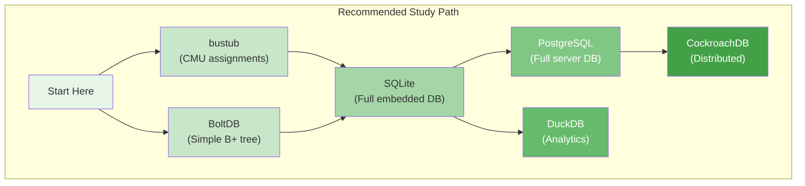
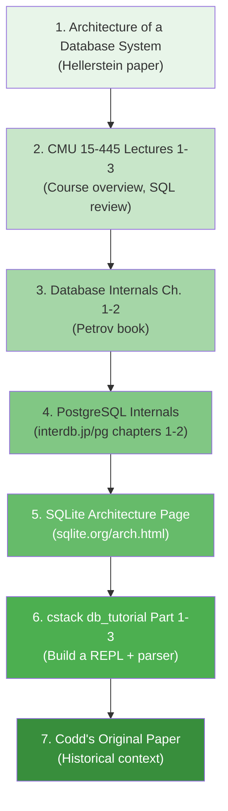

# Module 1: Foundations & Architecture -- External Resources

## 1. University Courses & Lectures

### CMU Database Group (Andy Pavlo)

Andy Pavlo's courses at Carnegie Mellon University are the gold standard for database internals education. All lectures are freely available on YouTube.

| Course | Description | Link |
|--------|-------------|------|
| **CMU 15-445/645: Database Systems** | Introduction to database internals: storage, indexing, query processing, concurrency control, recovery. The best starting point. | [YouTube Playlist (Fall 2023)](https://www.youtube.com/playlist?list=PLSE8ODhjZXjbj8BMuIrRcacnQh20hmY9g) |
| **CMU 15-721: Advanced Database Systems** | Covers modern OLAP systems, vectorized execution, query compilation, in-memory databases, and distributed query processing. | [YouTube Playlist (Spring 2023)](https://www.youtube.com/playlist?list=PLSE8ODhjZXjYzlLMbX3cR0sxWnRM7CLFn) |
| **CMU Intro to Database Systems (Fall 2024)** | Latest offering of 15-445 with updated content. | [CMU DB Course Website](https://15445.courses.cs.cmu.edu/) |

### Other University Resources

| Resource | Description |
|----------|-------------|
| **UC Berkeley CS186** | Joe Hellerstein's database course. Great alternative perspective. [YouTube](https://www.youtube.com/playlist?list=PLhMnuBfGeCDPtyC9kUf_hG_QwjYzZ0Am1) |
| **Stanford CS245: Principles of Data-Intensive Systems** | Covers storage engines, distributed systems, and modern data systems. [Course site](https://cs245.stanford.edu/) |
| **MIT 6.830/6.814: Database Systems** | More theoretical, with a strong focus on query optimization and transaction theory. |

---

## 2. Key Research Papers

These papers shaped the field of database systems. Reading them gives you insight into *why* databases are designed the way they are.

### Foundational Papers

| Paper | Year | Why It Matters |
|-------|------|---------------|
| **A Relational Model of Data for Large Shared Data Banks** -- E.F. Codd | 1970 | The paper that started it all. Introduced the relational model, relational algebra, and the concept of data independence. [PDF](https://www.seas.upenn.edu/~zives/03f/cis550/codd.pdf) |
| **System R: Relational Approach to Database Management** -- Astrahan et al. | 1976 | Describes IBM's System R prototype, which proved the relational model was practical. Introduced SQL and cost-based query optimization. [PDF](https://cs.stanford.edu/people/chr101/cs345/papers/system-r.pdf) |
| **The Design and Implementation of INGRES** -- Stonebraker et al. | 1976 | UC Berkeley's alternative to System R. Used the QUEL language. Led to PostgreSQL. [ACM DL](https://dl.acm.org/doi/10.1145/320473.320476) |
| **Access Path Selection in a Relational Database Management System** -- Selinger et al. | 1979 | The foundational paper on cost-based query optimization. Still relevant today. Every database optimizer descends from this work. [PDF](https://courses.cs.duke.edu/compsci516/cps216/spring03/papers/selinger-etal-1979.pdf) |

### Architecture Papers

| Paper | Year | Why It Matters |
|-------|------|---------------|
| **Architecture of a Database System** -- Hellerstein, Stonebraker, Hamilton | 2007 | The single best overview of database architecture. Covers process models, query processing, storage, transactions, and shared components. Essential reading for this module. [PDF](https://dsf.berkeley.edu/papers/fntdb07-architecture.pdf) |
| **ARIES: A Transaction Recovery Method** -- Mohan et al. | 1992 | The standard algorithm for crash recovery using WAL. Used (in some form) by PostgreSQL, MySQL/InnoDB, DB2, and SQL Server. [PDF](https://cs.stanford.edu/people/chr101/cs345/papers/aries.pdf) |
| **The Five-Minute Rule** -- Jim Gray & Gianfranco Putzolu | 1987 | Economic analysis of when to keep data in memory vs. on disk. Updated versions in 1997, 2007, 2017. [Original PDF](https://jimgray.azurewebsites.net/5_min_rule_sigmod.pdf) |

### Modern Systems Papers

| Paper | Year | Why It Matters |
|-------|------|---------------|
| **Bigtable: A Distributed Storage System for Structured Data** -- Chang et al. | 2006 | Google's wide-column store. Inspired HBase, Cassandra, and the NoSQL movement. [PDF](https://static.googleusercontent.com/media/research.google.com/en//archive/bigtable-osdi06.pdf) |
| **Dynamo: Amazon's Highly Available Key-Value Store** -- DeCandia et al. | 2007 | Amazon's key-value store. Introduced consistent hashing, vector clocks, and eventual consistency. Inspired DynamoDB, Riak, Cassandra. [PDF](https://www.allthingsdistributed.com/files/amazon-dynamo-sosp2007.pdf) |
| **Spanner: Google's Globally-Distributed Database** -- Corbett et al. | 2012 | First system to achieve global ACID transactions across data centers using TrueTime. Proved that distributed SQL was possible. [PDF](https://static.googleusercontent.com/media/research.google.com/en//archive/spanner-osdi2012.pdf) |
| **What Goes Around Comes Around** -- Stonebraker & Hellerstein | 2005 | A historical survey of data models from hierarchical through object-relational. Great context for understanding why the relational model won. [PDF](https://mitpress.mit.edu/9780262693141/readings-in-database-systems/) |

---

## 3. Books

### Essential Reading

| Book | Author(s) | Why Read It |
|------|-----------|-------------|
| **Database Internals: A Deep Dive into How Distributed Data Systems Work** | Alex Petrov (2019) | The best modern book on database internals. Covers storage engines (B-trees, LSM-trees), distributed systems (Paxos, Raft), and cluster management. Highly recommended as a companion to this course. |
| **Designing Data-Intensive Applications** | Martin Kleppmann (2017) | Broader than just databases: covers replication, partitioning, consistency, batch/stream processing. Essential for any backend engineer. |
| **Database System Concepts** (7th ed.) | Silberschatz, Korth, Sudarshan | The standard academic textbook. Comprehensive coverage of relational theory, SQL, transactions, and storage. Good reference. |

### Advanced / Reference

| Book | Author(s) | Why Read It |
|------|-----------|-------------|
| **Transaction Processing: Concepts and Techniques** | Jim Gray & Andreas Reuter (1993) | The definitive reference on transaction processing. Dense but authoritative. Covers ACID, locking, logging, recovery in exhaustive detail. |
| **The Art of PostgreSQL** | Dimitri Fontaine | Practical guide to using PostgreSQL effectively. Good for understanding what the optimizer does from the user's perspective. |
| **SQLite Documentation** | D. Richard Hipp | SQLite's documentation is some of the best technical writing in the industry. The [Architecture](https://www.sqlite.org/arch.html) and [How SQLite Works](https://www.sqlite.org/howitworks.html) pages are must-reads. |
| **PostgreSQL 14 Internals** | Egor Rogov | Deep dive into PostgreSQL's internal mechanisms: buffer cache, WAL, MVCC, vacuum, locks. Available as a free PDF from Postgres Professional. |

---

## 4. Blog Posts & Articles

### Database Architecture & Internals

| Article | Description |
|---------|-------------|
| [How Does a Database Work?](https://cstack.github.io/db_tutorial/) | Connor Stack's excellent tutorial on building a SQLite clone from scratch in C. Step-by-step, building each component. Highly aligned with the project in this module. |
| [Let's Build a Simple Database](https://cstack.github.io/db_tutorial/parts/part1.html) | Part 1 of the above series. Starts with a REPL, exactly like our project. |
| [Architecture of SQLite](https://www.sqlite.org/arch.html) | Official documentation explaining SQLite's layered architecture. Concise and clear. |
| [PostgreSQL Internals (Interdb)](https://www.interdb.jp/pg/) | Hironobu Suzuki's free online book covering PostgreSQL internals: process architecture, buffer manager, WAL, query processing. Excellent diagrams. |
| [How PostgreSQL Processes a Query](https://www.postgresql.org/docs/current/query-path.html) | Official PostgreSQL documentation on the query processing pipeline. |

### Storage Engines

| Article | Description |
|---------|-------------|
| [B-trees and Database Indexes](https://use-the-index-luke.com/) | Markus Winand's interactive guide to how indexes work. Essential for understanding the storage layer. |
| [The Log-Structured Merge-Tree (LSM-Tree)](https://www.cs.umb.edu/~poneil/lsmtree.pdf) | The original 1996 paper by O'Neil et al. that introduced LSM-trees. |
| [WiscKey: Separating Keys from Values](https://www.usenix.org/system/files/conference/fast16/fast16-papers-lu.pdf) | Influential paper on LSM-tree optimization used by Badger (Go) and other modern stores. |

### Query Processing

| Article | Description |
|---------|-------------|
| [How Query Engines Work](https://howqueryengineswork.com/) | Andy Grove's free online book about building a query engine from scratch. Covers parsing, logical/physical plans, and execution. Written with Apache Arrow examples. |
| [Volcano -- An Extensible and Parallel Query Evaluation System](https://paperhub.s3.amazonaws.com/dace52a42c07f7f8348b08dc2b186061.pdf) | Goetz Graefe's 1994 paper that defined the iterator model used by PostgreSQL and most OLTP databases. |

---

## 5. YouTube Videos & Talks

### Individual Talks

| Video | Speaker | Description |
|-------|---------|-------------|
| [How Does a Relational Database Work](https://www.youtube.com/watch?v=1Mdq2VPXbew) | Various | Animated explanation of query processing, B-trees, and the optimizer. Good introduction. |
| [The Internals of PostgreSQL](https://www.youtube.com/watch?v=OeKbL55OyL0) | Bruce Momjian | Core PostgreSQL developer walks through the architecture. |
| [SQLite: The Database at the Edge of the Network](https://www.youtube.com/watch?v=Jib2AmRb_rk) | D. Richard Hipp | SQLite's creator explains design decisions and architecture. |
| [CockroachDB: Architecture of a Geo-Distributed SQL Database](https://www.youtube.com/watch?v=OJySfiMKXLs) | Spencer Kimball | How CockroachDB implements distributed SQL. Good for understanding NewSQL. |
| [How Buffer Pool Works in PostgreSQL](https://www.youtube.com/watch?v=2jGEEsZJub4) | Hussein Nasser | Practical walkthrough of PostgreSQL's buffer pool with visualizations. |

### YouTube Channels

| Channel | Focus |
|---------|-------|
| [CMU Database Group](https://www.youtube.com/@CMUDatabaseGroup) | All CMU database lectures and seminar talks |
| [Hussein Nasser](https://www.youtube.com/@haboratory) | Database internals, networking, system design. Very accessible. |
| [Arpit Bhayani](https://www.youtube.com/@AsliEngineering) | Database internals, distributed systems. Focuses on how things work under the hood. |

---

## 6. Open Source Database Repos to Explore

Studying real code is the best way to understand database internals. Here are the most educational codebases:

### Recommended for Study

| Repository | Language | Why Study It |
|-----------|----------|-------------|
| [PostgreSQL](https://github.com/postgres/postgres) | C | The reference implementation for a full-featured RDBMS. Well-commented code. Start with `src/backend/tcop/postgres.c`. |
| [SQLite](https://sqlite.org/src/doc/trunk/README.md) | C | Beautifully engineered embedded database. Small enough to read entirely. Study the VDBE in `vdbe.c`. |
| [DuckDB](https://github.com/duckdb/duckdb) | C++ | Modern analytical database. Vectorized execution, column-oriented. Great for understanding OLAP architecture. |
| [CockroachDB](https://github.com/cockroachdb/cockroach) | Go | Distributed SQL database. Study the Raft consensus, distributed transactions, and range-based partitioning. |
| [BoltDB](https://github.com/etcd-io/bbolt) | Go | Extremely simple B+ tree key-value store (~5000 lines). Perfect for understanding B-trees and page management. |
| [ToyDB](https://github.com/erikgrinaker/toydb) | Rust | Educational distributed SQL database. Small enough to read entirely. Has Raft, MVCC, SQL parsing, and a query engine. |
| [bustub](https://github.com/cmu-db/bustub) | C++ | CMU's educational database system. Used in 15-445. Has assignments for buffer pool, B+ tree, query execution, and concurrency control. |
| [chidb](http://chi.cs.uchicago.edu/chidb/) | C | University of Chicago's educational database. Simpler than bustub. Implements B-trees and a basic SQL front-end. |
| [mini-lsm](https://github.com/skyzh/mini-lsm) | Rust | Educational LSM-tree storage engine. Great for understanding the storage layer of systems like RocksDB. |

### Production Databases Worth Browsing

| Repository | Language | Notes |
|-----------|----------|-------|
| [MySQL](https://github.com/mysql/mysql-server) | C/C++ | Larger and harder to navigate than PostgreSQL but worth comparing. Start with `sql/sql_parse.cc`. |
| [RocksDB](https://github.com/facebook/rocksdb) | C++ | Facebook's LSM-tree storage engine. The foundation of many NoSQL and NewSQL systems (CockroachDB, TiDB). |
| [Redis](https://github.com/redis/redis) | C | In-memory key-value store. Clean, readable code. Start with `server.c` and `t_string.c`. |
| [TiDB](https://github.com/pingcap/tidb) | Go | Distributed SQL database compatible with MySQL. Good for studying distributed query processing. |
| [ScyllaDB](https://github.com/scylladb/scylladb) | C++ | High-performance Cassandra-compatible database. Excellent for studying async I/O and shard-per-core architecture. |

---

## 7. Podcasts

| Podcast | Description |
|---------|-------------|
| [Dissecting the Database](https://www.buzzsprout.com/2103213) | Deep dives into database internals topics. |
| [The Changelog](https://changelog.com/podcast) | General open-source podcast. Episodes with database creators (e.g., Richard Hipp on SQLite). |
| [Software Engineering Daily](https://softwareengineeringdaily.com/) | Frequent episodes on databases, storage engines, and distributed systems. Search for episodes on CockroachDB, TiDB, DuckDB. |
| [Data Engineering Podcast](https://www.dataengineeringpodcast.com/) | Covers databases, data pipelines, and data infrastructure. |

---

## 8. Communities

| Community | Platform | Description |
|-----------|----------|-------------|
| [r/databasedevelopment](https://www.reddit.com/r/databasedevelopment/) | Reddit | Subreddit specifically for database engine development. Small but focused community. |
| [r/PostgreSQL](https://www.reddit.com/r/PostgreSQL/) | Reddit | Active PostgreSQL community. Good for practical questions. |
| [PostgreSQL Mailing Lists](https://www.postgresql.org/list/) | Email | The `pgsql-hackers` list is where PostgreSQL development happens. Reading it gives deep insight into design decisions. |
| [CMU Database Group Discord](https://discord.gg/YF7dMCg) | Discord | Active community around Andy Pavlo's courses and database research. |
| [DuckDB Discord](https://discord.gg/tcvwpjfnZx) | Discord | Active community around DuckDB development. |
| [Database Internals Book Club](https://github.com/ept/ddia-references) | GitHub | References from Martin Kleppmann's book, community maintained. |

---

## 9. Tools & Utilities

| Tool | Description |
|------|-------------|
| [pgcli](https://www.pgcli.com/) | PostgreSQL CLI with autocomplete and syntax highlighting. Better than `psql` for exploration. |
| [DBeaver](https://dbeaver.io/) | Universal database GUI client. Supports PostgreSQL, MySQL, SQLite, and dozens more. |
| [explain.dalibo.com](https://explain.dalibo.com/) | Visual PostgreSQL EXPLAIN plan analyzer. Paste your EXPLAIN output and get an interactive diagram. |
| [pg_stat_statements](https://www.postgresql.org/docs/current/pgstatstatements.html) | PostgreSQL extension that tracks query execution statistics. Essential for performance analysis. |
| [Valgrind](https://valgrind.org/) | Memory debugging tool. Useful when building your own database components in C. |
| [perf](https://perf.wiki.kernel.org/) | Linux performance profiling. Used to find hotspots in database code. |

---

## 10. Recommended Reading Order for This Module

If you are starting from zero, here is the recommended order:

Start with the "Architecture of a Database System" paper -- it provides the conceptual framework that makes everything else easier to understand. Then follow the CMU lectures for structured learning, and use the other resources to go deeper into areas that interest you.
