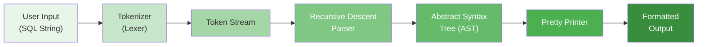
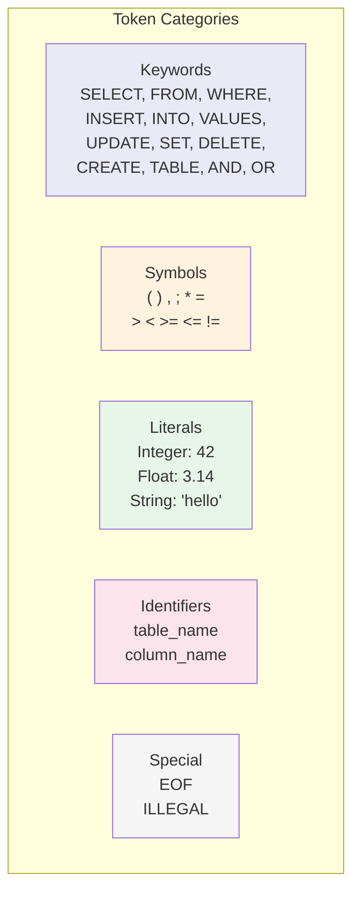
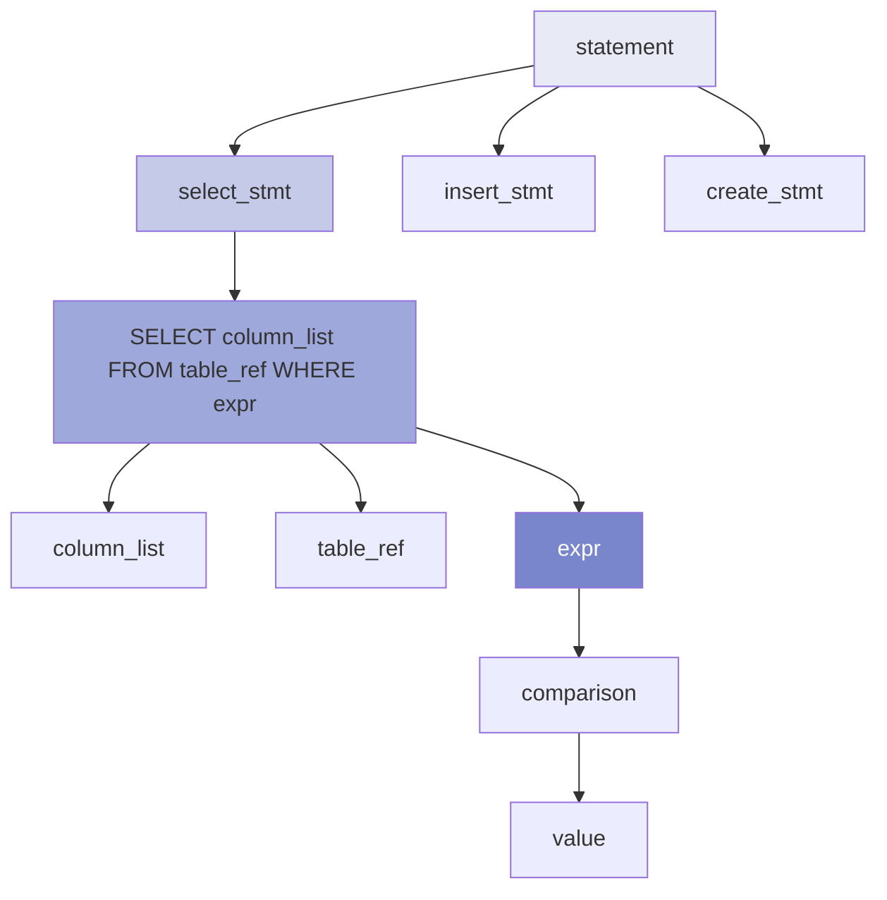
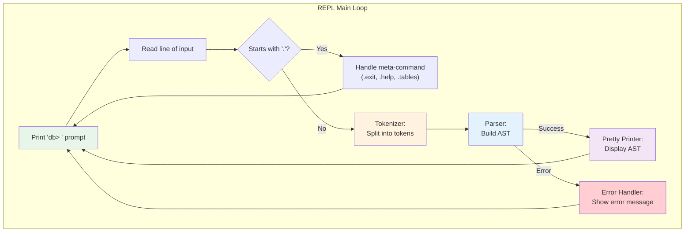

# Module 1: Foundations & Architecture -- Project: Build a Database REPL + SQL Parser

## Project Overview

In this project, you will build a **Read-Eval-Print Loop (REPL)** that accepts SQL statements, tokenizes them, parses them into an Abstract Syntax Tree (AST), and pretty-prints the parsed representation. This mirrors the first two layers of a real database engine (protocol + parser) and gives you hands-on experience with compiler-frontend techniques.

By the end, you will have a working program that can parse:
```
db> SELECT name, age FROM users WHERE age > 25 AND city = 'NYC';

Parsed AST:
  SelectStatement
    columns:
      - ColumnRef: name
      - ColumnRef: age
    from:
      - TableRef: users
    where:
      BinaryOp: AND
        left:
          BinaryOp: >
            left: ColumnRef(age)
            right: IntLiteral(25)
        right:
          BinaryOp: =
            left: ColumnRef(city)
            right: StringLiteral('NYC')
```

---

## Architecture



---

## Milestone 1: The REPL Shell

Build a basic interactive shell that reads a line of input, echoes it back, and loops.

### C Implementation

```c
/* repl.c -- A simple REPL shell */
#include <stdio.h>
#include <stdlib.h>
#include <string.h>
#include <stdbool.h>

#define MAX_INPUT_SIZE 4096

typedef struct {
    char *buffer;
    size_t buffer_length;
    ssize_t input_length;
} InputBuffer;

InputBuffer *new_input_buffer(void) {
    InputBuffer *buf = (InputBuffer *)malloc(sizeof(InputBuffer));
    buf->buffer = NULL;
    buf->buffer_length = 0;
    buf->input_length = 0;
    return buf;
}

void read_input(InputBuffer *buf) {
    ssize_t bytes_read = getline(&buf->buffer, &buf->buffer_length, stdin);
    if (bytes_read <= 0) {
        printf("Error reading input\n");
        exit(EXIT_FAILURE);
    }
    /* Remove trailing newline */
    buf->input_length = bytes_read - 1;
    buf->buffer[bytes_read - 1] = '\0';
}

void close_input_buffer(InputBuffer *buf) {
    free(buf->buffer);
    free(buf);
}

int main(int argc, char *argv[]) {
    InputBuffer *input = new_input_buffer();

    printf("SimpleDB v0.1 -- Module 1 Project\n");
    printf("Type .exit to quit.\n\n");

    while (true) {
        printf("db> ");
        read_input(input);

        /* Meta-commands start with '.' */
        if (input->buffer[0] == '.') {
            if (strcmp(input->buffer, ".exit") == 0) {
                close_input_buffer(input);
                printf("Goodbye.\n");
                exit(EXIT_SUCCESS);
            } else {
                printf("Unrecognized command: '%s'\n", input->buffer);
                continue;
            }
        }

        /* For now, just echo the input */
        printf("You entered: %s\n", input->buffer);
    }
}
```

### Rust Implementation

```rust
// main.rs -- A simple REPL shell
use std::io::{self, Write};

fn main() {
    println!("SimpleDB v0.1 -- Module 1 Project");
    println!("Type .exit to quit.\n");

    loop {
        print!("db> ");
        io::stdout().flush().unwrap();

        let mut input = String::new();
        match io::stdin().read_line(&mut input) {
            Ok(0) => break, // EOF
            Ok(_) => {}
            Err(e) => {
                eprintln!("Error reading input: {}", e);
                break;
            }
        }

        let input = input.trim();
        if input.is_empty() {
            continue;
        }

        // Meta-commands
        if input.starts_with('.') {
            match input {
                ".exit" => {
                    println!("Goodbye.");
                    break;
                }
                _ => {
                    println!("Unrecognized command: '{}'", input);
                    continue;
                }
            }
        }

        // For now, echo
        println!("You entered: {}", input);
    }
}
```

**Test it**:
```
$ gcc -o simpledb repl.c && ./simpledb
SimpleDB v0.1 -- Module 1 Project
Type .exit to quit.

db> hello world
You entered: hello world
db> .exit
Goodbye.
```

---

## Milestone 2: The Tokenizer (Lexer)

The tokenizer breaks the raw SQL string into a stream of **tokens**. Each token has a type and an optional value.

### Token Types



### C Implementation

```c
/* tokenizer.h */
#ifndef TOKENIZER_H
#define TOKENIZER_H

typedef enum {
    /* Keywords */
    TOKEN_SELECT,
    TOKEN_FROM,
    TOKEN_WHERE,
    TOKEN_INSERT,
    TOKEN_INTO,
    TOKEN_VALUES,
    TOKEN_UPDATE,
    TOKEN_SET,
    TOKEN_DELETE,
    TOKEN_CREATE,
    TOKEN_TABLE,
    TOKEN_AND,
    TOKEN_OR,
    TOKEN_NOT,
    TOKEN_AS,
    TOKEN_JOIN,
    TOKEN_ON,
    TOKEN_INT_TYPE,
    TOKEN_TEXT_TYPE,

    /* Literals */
    TOKEN_INTEGER,      /* 42 */
    TOKEN_FLOAT,        /* 3.14 */
    TOKEN_STRING,       /* 'hello' */

    /* Identifiers */
    TOKEN_IDENTIFIER,   /* column_name, table_name */

    /* Symbols */
    TOKEN_STAR,         /* * */
    TOKEN_COMMA,        /* , */
    TOKEN_SEMICOLON,    /* ; */
    TOKEN_LPAREN,       /* ( */
    TOKEN_RPAREN,       /* ) */
    TOKEN_EQUALS,       /* = */
    TOKEN_NOT_EQUALS,   /* != or <> */
    TOKEN_LESS,         /* < */
    TOKEN_GREATER,      /* > */
    TOKEN_LESS_EQ,      /* <= */
    TOKEN_GREATER_EQ,   /* >= */
    TOKEN_DOT,          /* . */

    /* Special */
    TOKEN_EOF,
    TOKEN_ILLEGAL,
} TokenType;

typedef struct {
    TokenType type;
    char *value;        /* The actual text of the token */
    int line;           /* Line number for error reporting */
    int col;            /* Column number for error reporting */
} Token;

typedef struct {
    const char *input;  /* The full SQL string */
    int pos;            /* Current position in input */
    int length;         /* Length of input */
    int line;
    int col;
} Tokenizer;

/* Initialize the tokenizer with an input string */
Tokenizer *tokenizer_new(const char *input);

/* Get the next token. Returns TOKEN_EOF when done. */
Token tokenizer_next(Tokenizer *t);

/* Free a tokenizer */
void tokenizer_free(Tokenizer *t);

/* Get human-readable name for a token type */
const char *token_type_name(TokenType type);

#endif
```

```c
/* tokenizer.c */
#include <stdio.h>
#include <stdlib.h>
#include <string.h>
#include <ctype.h>
#include "tokenizer.h"

/* Keyword lookup table */
typedef struct {
    const char *keyword;
    TokenType type;
} KeywordEntry;

static KeywordEntry keywords[] = {
    {"SELECT", TOKEN_SELECT},
    {"FROM", TOKEN_FROM},
    {"WHERE", TOKEN_WHERE},
    {"INSERT", TOKEN_INSERT},
    {"INTO", TOKEN_INTO},
    {"VALUES", TOKEN_VALUES},
    {"UPDATE", TOKEN_UPDATE},
    {"SET", TOKEN_SET},
    {"DELETE", TOKEN_DELETE},
    {"CREATE", TOKEN_CREATE},
    {"TABLE", TOKEN_TABLE},
    {"AND", TOKEN_AND},
    {"OR", TOKEN_OR},
    {"NOT", TOKEN_NOT},
    {"AS", TOKEN_AS},
    {"JOIN", TOKEN_JOIN},
    {"ON", TOKEN_ON},
    {"INT", TOKEN_INT_TYPE},
    {"TEXT", TOKEN_TEXT_TYPE},
    {NULL, TOKEN_ILLEGAL},
};

Tokenizer *tokenizer_new(const char *input) {
    Tokenizer *t = (Tokenizer *)malloc(sizeof(Tokenizer));
    t->input = input;
    t->pos = 0;
    t->length = strlen(input);
    t->line = 1;
    t->col = 1;
    return t;
}

static char peek(Tokenizer *t) {
    if (t->pos >= t->length) return '\0';
    return t->input[t->pos];
}

static char advance(Tokenizer *t) {
    char c = t->input[t->pos];
    t->pos++;
    t->col++;
    if (c == '\n') {
        t->line++;
        t->col = 1;
    }
    return c;
}

static void skip_whitespace(Tokenizer *t) {
    while (t->pos < t->length && isspace(peek(t))) {
        advance(t);
    }
}

static Token make_token(TokenType type, const char *value, int line, int col) {
    Token tok;
    tok.type = type;
    tok.value = strdup(value);
    tok.line = line;
    tok.col = col;
    return tok;
}

/* Check if an identifier is actually a keyword */
static TokenType lookup_keyword(const char *word) {
    /* Case-insensitive comparison */
    for (int i = 0; keywords[i].keyword != NULL; i++) {
        if (strcasecmp(word, keywords[i].keyword) == 0) {
            return keywords[i].type;
        }
    }
    return TOKEN_IDENTIFIER;
}

Token tokenizer_next(Tokenizer *t) {
    skip_whitespace(t);

    if (t->pos >= t->length) {
        return make_token(TOKEN_EOF, "", t->line, t->col);
    }

    int start_line = t->line;
    int start_col = t->col;
    char c = peek(t);

    /* Single-character symbols */
    switch (c) {
        case '*': advance(t); return make_token(TOKEN_STAR, "*", start_line, start_col);
        case ',': advance(t); return make_token(TOKEN_COMMA, ",", start_line, start_col);
        case ';': advance(t); return make_token(TOKEN_SEMICOLON, ";", start_line, start_col);
        case '(': advance(t); return make_token(TOKEN_LPAREN, "(", start_line, start_col);
        case ')': advance(t); return make_token(TOKEN_RPAREN, ")", start_line, start_col);
        case '.': advance(t); return make_token(TOKEN_DOT, ".", start_line, start_col);
        case '=': advance(t); return make_token(TOKEN_EQUALS, "=", start_line, start_col);
    }

    /* Multi-character operators */
    if (c == '<') {
        advance(t);
        if (peek(t) == '=') { advance(t); return make_token(TOKEN_LESS_EQ, "<=", start_line, start_col); }
        if (peek(t) == '>') { advance(t); return make_token(TOKEN_NOT_EQUALS, "<>", start_line, start_col); }
        return make_token(TOKEN_LESS, "<", start_line, start_col);
    }
    if (c == '>') {
        advance(t);
        if (peek(t) == '=') { advance(t); return make_token(TOKEN_GREATER_EQ, ">=", start_line, start_col); }
        return make_token(TOKEN_GREATER, ">", start_line, start_col);
    }
    if (c == '!' && t->pos + 1 < t->length && t->input[t->pos + 1] == '=') {
        advance(t); advance(t);
        return make_token(TOKEN_NOT_EQUALS, "!=", start_line, start_col);
    }

    /* String literals: 'hello world' */
    if (c == '\'') {
        advance(t);  /* consume opening quote */
        int start = t->pos;
        while (t->pos < t->length && peek(t) != '\'') {
            advance(t);
        }
        int len = t->pos - start;
        char *value = strndup(t->input + start, len);
        if (peek(t) == '\'') advance(t);  /* consume closing quote */
        Token tok = make_token(TOKEN_STRING, value, start_line, start_col);
        free(value);
        return tok;
    }

    /* Numbers: integers and floats */
    if (isdigit(c)) {
        int start = t->pos;
        while (t->pos < t->length && isdigit(peek(t))) advance(t);
        TokenType type = TOKEN_INTEGER;
        if (peek(t) == '.') {
            type = TOKEN_FLOAT;
            advance(t);
            while (t->pos < t->length && isdigit(peek(t))) advance(t);
        }
        int len = t->pos - start;
        char *value = strndup(t->input + start, len);
        Token tok = make_token(type, value, start_line, start_col);
        free(value);
        return tok;
    }

    /* Identifiers and keywords */
    if (isalpha(c) || c == '_') {
        int start = t->pos;
        while (t->pos < t->length && (isalnum(peek(t)) || peek(t) == '_')) {
            advance(t);
        }
        int len = t->pos - start;
        char *value = strndup(t->input + start, len);
        TokenType type = lookup_keyword(value);
        Token tok = make_token(type, value, start_line, start_col);
        free(value);
        return tok;
    }

    /* Unknown character */
    advance(t);
    char buf[2] = {c, '\0'};
    return make_token(TOKEN_ILLEGAL, buf, start_line, start_col);
}

void tokenizer_free(Tokenizer *t) {
    free(t);
}

const char *token_type_name(TokenType type) {
    switch (type) {
        case TOKEN_SELECT: return "SELECT";
        case TOKEN_FROM: return "FROM";
        case TOKEN_WHERE: return "WHERE";
        case TOKEN_INSERT: return "INSERT";
        case TOKEN_INTO: return "INTO";
        case TOKEN_VALUES: return "VALUES";
        case TOKEN_UPDATE: return "UPDATE";
        case TOKEN_SET: return "SET";
        case TOKEN_DELETE: return "DELETE";
        case TOKEN_CREATE: return "CREATE";
        case TOKEN_TABLE: return "TABLE";
        case TOKEN_AND: return "AND";
        case TOKEN_OR: return "OR";
        case TOKEN_NOT: return "NOT";
        case TOKEN_AS: return "AS";
        case TOKEN_JOIN: return "JOIN";
        case TOKEN_ON: return "ON";
        case TOKEN_INTEGER: return "INTEGER";
        case TOKEN_FLOAT: return "FLOAT";
        case TOKEN_STRING: return "STRING";
        case TOKEN_IDENTIFIER: return "IDENTIFIER";
        case TOKEN_STAR: return "STAR";
        case TOKEN_COMMA: return "COMMA";
        case TOKEN_SEMICOLON: return "SEMICOLON";
        case TOKEN_LPAREN: return "LPAREN";
        case TOKEN_RPAREN: return "RPAREN";
        case TOKEN_EQUALS: return "EQUALS";
        case TOKEN_NOT_EQUALS: return "NOT_EQUALS";
        case TOKEN_LESS: return "LESS";
        case TOKEN_GREATER: return "GREATER";
        case TOKEN_LESS_EQ: return "LESS_EQ";
        case TOKEN_GREATER_EQ: return "GREATER_EQ";
        case TOKEN_DOT: return "DOT";
        case TOKEN_EOF: return "EOF";
        case TOKEN_ILLEGAL: return "ILLEGAL";
        default: return "UNKNOWN";
    }
}
```

**Test the tokenizer**:
```c
/* test_tokenizer.c */
#include <stdio.h>
#include "tokenizer.h"

int main(void) {
    const char *sql = "SELECT name, age FROM users WHERE age > 25;";
    Tokenizer *t = tokenizer_new(sql);

    printf("Tokenizing: %s\n\n", sql);

    Token tok;
    do {
        tok = tokenizer_next(t);
        printf("%-12s  '%s'  (line %d, col %d)\n",
               token_type_name(tok.type), tok.value, tok.line, tok.col);
        free(tok.value);
    } while (tok.type != TOKEN_EOF);

    tokenizer_free(t);
    return 0;
}
```

Expected output:
```
Tokenizing: SELECT name, age FROM users WHERE age > 25;

SELECT        'SELECT'  (line 1, col 1)
IDENTIFIER    'name'  (line 1, col 8)
COMMA         ','  (line 1, col 12)
IDENTIFIER    'age'  (line 1, col 14)
FROM          'FROM'  (line 1, col 18)
IDENTIFIER    'users'  (line 1, col 23)
WHERE         'WHERE'  (line 1, col 29)
IDENTIFIER    'age'  (line 1, col 35)
GREATER       '>'  (line 1, col 39)
INTEGER       '25'  (line 1, col 41)
SEMICOLON     ';'  (line 1, col 43)
EOF           ''  (line 1, col 44)
```

---

## Milestone 3: The Parser (Recursive Descent)

Now we build a **recursive descent parser** that consumes the token stream and builds an AST.

### The Grammar (Simplified)

```
statement       := select_stmt | insert_stmt | create_stmt
select_stmt     := SELECT column_list FROM table_ref [WHERE expr]
column_list     := STAR | column_ref (COMMA column_ref)*
column_ref      := IDENTIFIER [DOT IDENTIFIER]
table_ref       := IDENTIFIER [AS IDENTIFIER]
expr            := comparison ((AND | OR) comparison)*
comparison      := value (EQUALS | NOT_EQUALS | LESS | GREATER | LESS_EQ | GREATER_EQ) value
value           := column_ref | INTEGER | FLOAT | STRING
insert_stmt     := INSERT INTO IDENTIFIER LPAREN column_list RPAREN VALUES LPAREN value_list RPAREN
value_list      := value (COMMA value)*
create_stmt     := CREATE TABLE IDENTIFIER LPAREN column_def_list RPAREN
column_def_list := column_def (COMMA column_def)*
column_def      := IDENTIFIER type_name
type_name       := INT_TYPE | TEXT_TYPE
```



### AST Node Definitions

```c
/* ast.h */
#ifndef AST_H
#define AST_H

typedef enum {
    NODE_SELECT,
    NODE_INSERT,
    NODE_CREATE_TABLE,
    NODE_COLUMN_REF,
    NODE_TABLE_REF,
    NODE_INT_LITERAL,
    NODE_FLOAT_LITERAL,
    NODE_STRING_LITERAL,
    NODE_BINARY_OP,
    NODE_COLUMN_DEF,
    NODE_STAR,
} NodeType;

typedef enum {
    OP_EQUALS,
    OP_NOT_EQUALS,
    OP_LESS,
    OP_GREATER,
    OP_LESS_EQ,
    OP_GREATER_EQ,
    OP_AND,
    OP_OR,
} BinaryOpType;

/* Forward declaration */
typedef struct ASTNode ASTNode;

/* A dynamically-sized list of AST nodes */
typedef struct {
    ASTNode **items;
    int count;
    int capacity;
} NodeList;

struct ASTNode {
    NodeType type;
    union {
        /* NODE_SELECT */
        struct {
            NodeList *columns;      /* list of ColumnRef or Star */
            NodeList *tables;       /* list of TableRef */
            ASTNode *where_clause;  /* expression or NULL */
        } select;

        /* NODE_INSERT */
        struct {
            char *table_name;
            NodeList *columns;
            NodeList *values;
        } insert;

        /* NODE_CREATE_TABLE */
        struct {
            char *table_name;
            NodeList *column_defs;
        } create_table;

        /* NODE_COLUMN_REF */
        struct {
            char *table_name;  /* may be NULL */
            char *column_name;
        } column_ref;

        /* NODE_TABLE_REF */
        struct {
            char *table_name;
            char *alias;  /* may be NULL */
        } table_ref;

        /* NODE_INT_LITERAL */
        struct {
            long value;
        } int_literal;

        /* NODE_FLOAT_LITERAL */
        struct {
            double value;
        } float_literal;

        /* NODE_STRING_LITERAL */
        struct {
            char *value;
        } string_literal;

        /* NODE_BINARY_OP */
        struct {
            BinaryOpType op;
            ASTNode *left;
            ASTNode *right;
        } binary_op;

        /* NODE_COLUMN_DEF */
        struct {
            char *column_name;
            char *type_name;
        } column_def;
    } data;
};

/* Constructor helpers */
ASTNode *ast_new_select(NodeList *columns, NodeList *tables, ASTNode *where_clause);
ASTNode *ast_new_column_ref(const char *table, const char *column);
ASTNode *ast_new_table_ref(const char *name, const char *alias);
ASTNode *ast_new_int_literal(long value);
ASTNode *ast_new_string_literal(const char *value);
ASTNode *ast_new_binary_op(BinaryOpType op, ASTNode *left, ASTNode *right);
ASTNode *ast_new_star(void);

/* NodeList helpers */
NodeList *nodelist_new(void);
void nodelist_append(NodeList *list, ASTNode *node);

/* Pretty printer */
void ast_print(ASTNode *node, int indent);

/* Free an AST tree */
void ast_free(ASTNode *node);

#endif
```

### Parser Implementation (Core)

```c
/* parser.c (key functions -- simplified) */
#include <stdio.h>
#include <stdlib.h>
#include <string.h>
#include "tokenizer.h"
#include "ast.h"

typedef struct {
    Tokenizer *tokenizer;
    Token current;
    Token previous;
} Parser;

Parser *parser_new(const char *input) {
    Parser *p = (Parser *)malloc(sizeof(Parser));
    p->tokenizer = tokenizer_new(input);
    p->current = tokenizer_next(p->tokenizer);
    return p;
}

static Token consume(Parser *p) {
    Token prev = p->current;
    p->previous = prev;
    p->current = tokenizer_next(p->tokenizer);
    return prev;
}

static bool check(Parser *p, TokenType type) {
    return p->current.type == type;
}

static Token expect(Parser *p, TokenType type) {
    if (p->current.type != type) {
        fprintf(stderr, "Parse error at line %d, col %d: expected %s, got %s ('%s')\n",
                p->current.line, p->current.col,
                token_type_name(type), token_type_name(p->current.type),
                p->current.value);
        exit(EXIT_FAILURE);
    }
    return consume(p);
}

/* Forward declarations */
static ASTNode *parse_expr(Parser *p);
static ASTNode *parse_value(Parser *p);

/* Parse a value (leaf of an expression) */
static ASTNode *parse_value(Parser *p) {
    if (check(p, TOKEN_INTEGER)) {
        Token tok = consume(p);
        long val = strtol(tok.value, NULL, 10);
        free(tok.value);
        return ast_new_int_literal(val);
    }
    if (check(p, TOKEN_STRING)) {
        Token tok = consume(p);
        ASTNode *node = ast_new_string_literal(tok.value);
        free(tok.value);
        return node;
    }
    if (check(p, TOKEN_IDENTIFIER)) {
        Token tok = consume(p);
        char *name = tok.value;
        /* Check for table.column notation */
        if (check(p, TOKEN_DOT)) {
            consume(p);  /* consume the dot */
            Token col_tok = expect(p, TOKEN_IDENTIFIER);
            ASTNode *node = ast_new_column_ref(name, col_tok.value);
            free(name);
            free(col_tok.value);
            return node;
        }
        ASTNode *node = ast_new_column_ref(NULL, name);
        free(name);
        return node;
    }
    fprintf(stderr, "Parse error: unexpected token '%s'\n", p->current.value);
    exit(EXIT_FAILURE);
}

/* Parse a comparison: value op value */
static ASTNode *parse_comparison(Parser *p) {
    ASTNode *left = parse_value(p);

    if (check(p, TOKEN_EQUALS) || check(p, TOKEN_NOT_EQUALS) ||
        check(p, TOKEN_LESS) || check(p, TOKEN_GREATER) ||
        check(p, TOKEN_LESS_EQ) || check(p, TOKEN_GREATER_EQ)) {

        Token op_tok = consume(p);
        BinaryOpType op;
        switch (op_tok.type) {
            case TOKEN_EQUALS:     op = OP_EQUALS; break;
            case TOKEN_NOT_EQUALS: op = OP_NOT_EQUALS; break;
            case TOKEN_LESS:       op = OP_LESS; break;
            case TOKEN_GREATER:    op = OP_GREATER; break;
            case TOKEN_LESS_EQ:    op = OP_LESS_EQ; break;
            case TOKEN_GREATER_EQ: op = OP_GREATER_EQ; break;
            default: op = OP_EQUALS; break;
        }
        free(op_tok.value);

        ASTNode *right = parse_value(p);
        return ast_new_binary_op(op, left, right);
    }

    return left;
}

/* Parse an expression: comparison ((AND|OR) comparison)* */
static ASTNode *parse_expr(Parser *p) {
    ASTNode *left = parse_comparison(p);

    while (check(p, TOKEN_AND) || check(p, TOKEN_OR)) {
        Token op_tok = consume(p);
        BinaryOpType op = (op_tok.type == TOKEN_AND) ? OP_AND : OP_OR;
        free(op_tok.value);

        ASTNode *right = parse_comparison(p);
        left = ast_new_binary_op(op, left, right);
    }

    return left;
}

/* Parse: SELECT column_list FROM table_ref [WHERE expr] */
static ASTNode *parse_select(Parser *p) {
    expect(p, TOKEN_SELECT);

    /* Parse column list */
    NodeList *columns = nodelist_new();
    if (check(p, TOKEN_STAR)) {
        consume(p);
        nodelist_append(columns, ast_new_star());
    } else {
        /* First column */
        ASTNode *col = parse_value(p);
        nodelist_append(columns, col);
        /* Additional columns */
        while (check(p, TOKEN_COMMA)) {
            consume(p);
            col = parse_value(p);
            nodelist_append(columns, col);
        }
    }

    /* FROM clause */
    expect(p, TOKEN_FROM);
    NodeList *tables = nodelist_new();
    Token table_tok = expect(p, TOKEN_IDENTIFIER);
    char *alias = NULL;
    if (check(p, TOKEN_AS)) {
        consume(p);
        Token alias_tok = expect(p, TOKEN_IDENTIFIER);
        alias = alias_tok.value;
    } else if (check(p, TOKEN_IDENTIFIER)) {
        /* Implicit alias: FROM users u */
        Token alias_tok = consume(p);
        alias = alias_tok.value;
    }
    nodelist_append(tables, ast_new_table_ref(table_tok.value, alias));
    free(table_tok.value);
    if (alias) free(alias);

    /* Optional WHERE clause */
    ASTNode *where_clause = NULL;
    if (check(p, TOKEN_WHERE)) {
        consume(p);
        where_clause = parse_expr(p);
    }

    /* Optional semicolon */
    if (check(p, TOKEN_SEMICOLON)) consume(p);

    return ast_new_select(columns, tables, where_clause);
}

/* Main parse function */
ASTNode *parse(const char *sql) {
    Parser *p = parser_new(sql);

    ASTNode *result = NULL;

    if (check(p, TOKEN_SELECT)) {
        result = parse_select(p);
    } else {
        fprintf(stderr, "Parse error: expected SELECT, INSERT, or CREATE\n");
        exit(EXIT_FAILURE);
    }

    /* Clean up */
    free(p->current.value);
    tokenizer_free(p->tokenizer);
    free(p);

    return result;
}
```

---

## Milestone 4: Pretty Printer

```c
/* printer.c */
#include <stdio.h>
#include "ast.h"

static void print_indent(int level) {
    for (int i = 0; i < level; i++) printf("  ");
}

static const char *op_to_string(BinaryOpType op) {
    switch (op) {
        case OP_EQUALS:     return "=";
        case OP_NOT_EQUALS: return "!=";
        case OP_LESS:       return "<";
        case OP_GREATER:    return ">";
        case OP_LESS_EQ:    return "<=";
        case OP_GREATER_EQ: return ">=";
        case OP_AND:        return "AND";
        case OP_OR:         return "OR";
        default:            return "?";
    }
}

void ast_print(ASTNode *node, int indent) {
    if (!node) return;

    print_indent(indent);

    switch (node->type) {
        case NODE_SELECT:
            printf("SelectStatement\n");
            print_indent(indent + 1);
            printf("columns:\n");
            for (int i = 0; i < node->data.select.columns->count; i++) {
                ast_print(node->data.select.columns->items[i], indent + 2);
            }
            print_indent(indent + 1);
            printf("from:\n");
            for (int i = 0; i < node->data.select.tables->count; i++) {
                ast_print(node->data.select.tables->items[i], indent + 2);
            }
            if (node->data.select.where_clause) {
                print_indent(indent + 1);
                printf("where:\n");
                ast_print(node->data.select.where_clause, indent + 2);
            }
            break;

        case NODE_COLUMN_REF:
            if (node->data.column_ref.table_name) {
                printf("ColumnRef: %s.%s\n",
                       node->data.column_ref.table_name,
                       node->data.column_ref.column_name);
            } else {
                printf("ColumnRef: %s\n", node->data.column_ref.column_name);
            }
            break;

        case NODE_TABLE_REF:
            if (node->data.table_ref.alias) {
                printf("TableRef: %s (alias: %s)\n",
                       node->data.table_ref.table_name,
                       node->data.table_ref.alias);
            } else {
                printf("TableRef: %s\n", node->data.table_ref.table_name);
            }
            break;

        case NODE_INT_LITERAL:
            printf("IntLiteral: %ld\n", node->data.int_literal.value);
            break;

        case NODE_STRING_LITERAL:
            printf("StringLiteral: '%s'\n", node->data.string_literal.value);
            break;

        case NODE_BINARY_OP:
            printf("BinaryOp: %s\n", op_to_string(node->data.binary_op.op));
            ast_print(node->data.binary_op.left, indent + 1);
            ast_print(node->data.binary_op.right, indent + 1);
            break;

        case NODE_STAR:
            printf("Star: *\n");
            break;

        default:
            printf("Unknown node type\n");
            break;
    }
}
```

---

## Milestone 5: Integration

Update `repl.c` to use the parser:

```c
/* In the main loop, replace the echo with: */
ASTNode *ast = parse(input->buffer);
if (ast) {
    printf("\nParsed AST:\n");
    ast_print(ast, 1);
    printf("\n");
    ast_free(ast);
}
```

### Complete Pipeline Diagram



### Build and Run

```bash
# Compile all files
gcc -Wall -Wextra -o simpledb \
    repl.c tokenizer.c parser.c ast.c printer.c \
    -g

# Run
./simpledb

db> SELECT name, age FROM users WHERE age > 25 AND city = 'NYC';

Parsed AST:
  SelectStatement
    columns:
      ColumnRef: name
      ColumnRef: age
    from:
      TableRef: users
    where:
      BinaryOp: AND
        BinaryOp: >
          ColumnRef: age
          IntLiteral: 25
        BinaryOp: =
          ColumnRef: city
          StringLiteral: 'NYC'
```

---

## Stretch Goals

Once you have the basic parser working, consider these extensions:

### Stretch Goal 1: INSERT and CREATE TABLE support
Add parsing for:
```sql
CREATE TABLE users (id INT, name TEXT, age INT);
INSERT INTO users (id, name, age) VALUES (1, 'Alice', 30);
```

### Stretch Goal 2: JOIN support
Extend the grammar to handle:
```sql
SELECT u.name, o.amount FROM users u JOIN orders o ON u.id = o.user_id;
```

### Stretch Goal 3: SQL Formatter
Instead of printing the AST, regenerate properly formatted SQL:
```sql
-- Input:
select NAME,age from USERS where AGE>25

-- Output:
SELECT
    name,
    age
FROM
    users
WHERE
    age > 25;
```

### Stretch Goal 4: Simple Catalog and Validation
Add an in-memory catalog and implement the Analyzer phase:
```
db> CREATE TABLE users (id INT, name TEXT);
Table 'users' created.

db> SELECT foo FROM users;
Error: column 'foo' does not exist in table 'users'.
```

### Stretch Goal 5: Expression Evaluation
For simple expressions without tables, evaluate them directly:
```
db> SELECT 2 + 3 * 4;
Result: 14
```

---

## File Organization

```
project/
├── Makefile
├── repl.c          # REPL main loop
├── tokenizer.h     # Token types and tokenizer interface
├── tokenizer.c     # Tokenizer implementation
├── ast.h           # AST node definitions
├── ast.c           # AST constructors and destructors
├── parser.h        # Parser interface
├── parser.c        # Recursive descent parser
├── printer.c       # AST pretty printer
└── tests/
    ├── test_tokenizer.c
    └── test_parser.c
```

### Makefile

```makefile
CC = gcc
CFLAGS = -Wall -Wextra -g -std=c11
SRCS = repl.c tokenizer.c parser.c ast.c printer.c
OBJS = $(SRCS:.c=.o)
TARGET = simpledb

$(TARGET): $(OBJS)
	$(CC) $(CFLAGS) -o $@ $^

%.o: %.c
	$(CC) $(CFLAGS) -c -o $@ $<

test_tokenizer: tests/test_tokenizer.c tokenizer.c
	$(CC) $(CFLAGS) -o $@ $^

test_parser: tests/test_parser.c tokenizer.c parser.c ast.c printer.c
	$(CC) $(CFLAGS) -o $@ $^

clean:
	rm -f $(OBJS) $(TARGET) test_tokenizer test_parser

.PHONY: clean
```

---

## Learning Outcomes

By completing this project you will have:

1. Understood how SQL text is transformed into structured data (AST) -- the same process that happens in PostgreSQL's `scan.l` and `gram.y`.
2. Implemented a tokenizer, gaining appreciation for lexical analysis.
3. Built a recursive descent parser -- the simplest and most readable parsing technique.
4. Designed AST data structures that mirror real database internals (compare your `SelectStmt` with PostgreSQL's `SelectStmt` in `src/include/nodes/parsenodes.h`).
5. Experienced the challenge of handling SQL's complex grammar (and gained empathy for the PostgreSQL parser's 15,000-line Yacc file).
