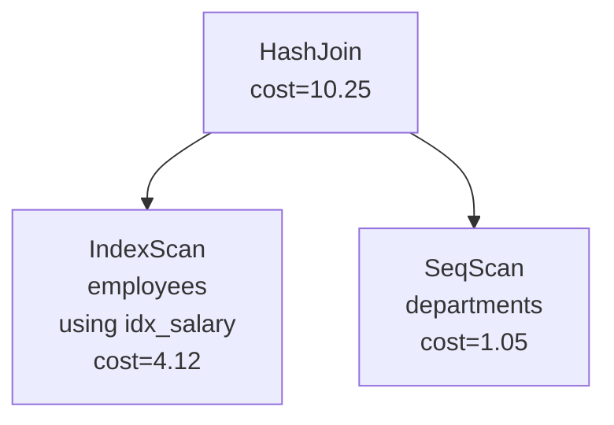
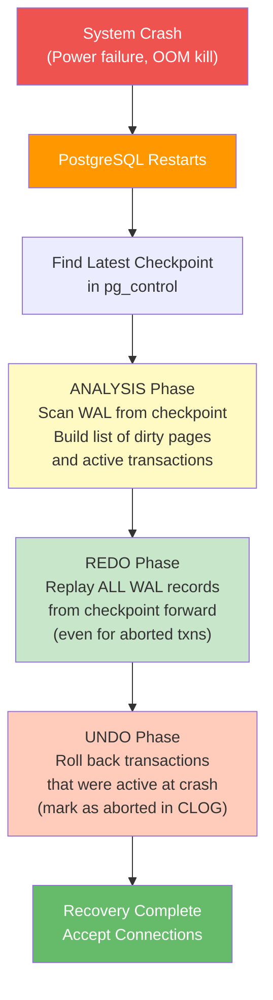

# Module 1: Foundations & Architecture -- Questions & Assessment

## Instructions

This assessment contains 25 questions of varying difficulty and format. Try to answer each question before revealing the solution. Questions are organized by topic and increase in difficulty within each section.

**Difficulty legend**: (B) = Basic, (I) = Intermediate, (A) = Advanced

---

## Section A: Database Fundamentals

### Question 1 (B) -- Multiple Choice

What is the primary difference between a *database* and a *DBMS*?

- (a) A database is stored on disk; a DBMS is stored in memory
- (b) A database is the data itself; a DBMS is the software system that manages it
- (c) A database can only store relational data; a DBMS can store any data
- (d) A DBMS is open-source; a database is proprietary

<details>
<summary>Answer</summary>

**(b)** A database is an organized collection of data. A DBMS (Database Management System) is the software that creates, manages, queries, and provides controlled access to one or more databases. PostgreSQL is a DBMS; the `employees` table within it is part of a database.

</details>

### Question 2 (B) -- True/False

True or False: Edgar F. Codd's relational model was first implemented in the INGRES project at UC Berkeley.

<details>
<summary>Answer</summary>

**True**, partially. INGRES (1973, UC Berkeley) was one of the first implementations of relational concepts, though it used the QUEL language rather than SQL. IBM's System R (1974) was the other landmark prototype and introduced SQL. Both independently implemented relational model concepts.

</details>

### Question 3 (I) -- Short Answer

Name three problems with the pre-relational (navigational) database model that the relational model was designed to solve.

<details>
<summary>Answer</summary>

1. **Physical data dependence**: Application code was tightly coupled to the physical storage structure. Changing how data was stored on disk required rewriting programs.

2. **Rigid navigation paths**: Queries had to follow predefined pointer chains (hierarchical or network links). Asking an ad-hoc question that was not anticipated by the schema designer was extremely difficult or impossible.

3. **Lack of declarative querying**: Programs had to specify *how* to access data (navigate parent-to-child links), not *what* data was needed. This made programs longer, harder to maintain, and impossible to optimize automatically.

</details>

### Question 4 (I) -- Multiple Choice

Which SQL standard first introduced **window functions** (OVER clause)?

- (a) SQL-92
- (b) SQL:1999
- (c) SQL:2003
- (d) SQL:2011

<details>
<summary>Answer</summary>

**(c) SQL:2003**. Window functions (also called analytic functions) such as `ROW_NUMBER()`, `RANK()`, `SUM() OVER (...)` were standardized in SQL:2003. They were available in some commercial databases earlier as proprietary extensions.

</details>

---

## Section B: Architecture & Layers

### Question 5 (B) -- Ordering

Place the following DBMS components in the correct order that a query passes through (from first to last):

1. Buffer Pool Manager
2. Parser
3. Execution Engine
4. Query Optimizer
5. Analyzer / Binder
6. Storage Engine

<details>
<summary>Answer</summary>

The correct order is:

**2 (Parser) -> 5 (Analyzer/Binder) -> 4 (Query Optimizer) -> 3 (Execution Engine) -> 1 (Buffer Pool Manager) -> 6 (Storage Engine)**


</details>

### Question 6 (B) -- Multiple Choice

What does the Parser produce as its output?

- (a) A physical query plan
- (b) An Abstract Syntax Tree (AST)
- (c) A set of result tuples
- (d) Optimized machine code

<details>
<summary>Answer</summary>

**(b) An Abstract Syntax Tree (AST)**. The parser performs lexical analysis (tokenization) and syntactic analysis (grammar checking) to produce a tree representation of the query's structure. At this stage, no validation of table or column names has been done -- that is the analyzer's job.

</details>

### Question 7 (I) -- Short Answer

Explain the difference between the **Analyzer** and the **Optimizer**. What does each component need from the **catalog**?

<details>
<summary>Answer</summary>

**Analyzer (Binder)**:
- Resolves names: looks up table names, column names, function names in the catalog.
- Performs type checking and inserts implicit casts.
- Checks permissions.
- Needs from catalog: table existence, column lists, data types, user permissions, view definitions.

**Optimizer**:
- Takes the validated, annotated query and produces an efficient physical execution plan.
- Considers different join orders, access methods (seq scan vs index scan), and join algorithms.
- Needs from catalog: table statistics (row counts, histograms, distinct counts, correlation), index definitions, constraint information (for constraint exclusion).

The key distinction is that the analyzer validates *correctness* while the optimizer determines *efficiency*.

</details>

### Question 8 (I) -- Diagram Question

Consider the following query plan diagram. Identify the join algorithm used and explain the execution order.



<details>
<summary>Answer</summary>

**Join algorithm**: Hash Join.

**Execution order**:
1. The **right child** (SeqScan on `departments`) is executed first to build the hash table. All rows from `departments` are read and inserted into an in-memory hash table, keyed on the join column.
2. The **left child** (IndexScan on `employees`) is then executed. For each row from `employees`, the join key is hashed and the hash table is probed for matching `departments` rows.
3. The HashJoin node combines matching pairs and passes them up.

In PostgreSQL's hash join implementation, the right child is the "inner" (build) side and the left child is the "outer" (probe) side. The optimizer typically chooses the smaller table as the build side.

</details>

### Question 9 (A) -- Short Answer

What is the difference between a **logical plan** and a **physical plan**? Give an example where the same logical plan could produce two different physical plans.

<details>
<summary>Answer</summary>

A **logical plan** specifies *what* operations to perform (Join, Filter, Project) without specifying *how* to implement them.

A **physical plan** specifies the concrete algorithm for each operation (HashJoin vs. MergeJoin vs. NestedLoopJoin, SeqScan vs. IndexScan).

**Example**: For the logical operation `Join(employees, departments ON dept_id = id)`:

- **Physical Plan A**: HashJoin with SeqScan on both tables. Good when both tables fit in memory and there is no useful index.
- **Physical Plan B**: NestedLoopJoin with IndexScan on `departments.id` for each row of `employees`. Good when `employees` is very small and `departments` has an index on `id`.

The optimizer's job is to evaluate the cost of each physical plan and choose the cheapest one.

</details>

---

## Section C: Storage & Buffer Management

### Question 10 (B) -- Multiple Choice

What is the default page size in PostgreSQL?

- (a) 4 KB
- (b) 8 KB
- (c) 16 KB
- (d) 64 KB

<details>
<summary>Answer</summary>

**(b) 8 KB (8192 bytes)**. This is a compile-time constant (`BLCKSZ`). It can be changed by recompiling PostgreSQL with `--with-blocksize=N`, but 8 KB is the default and the overwhelmingly common choice. SQLite uses 4 KB by default.

</details>

### Question 11 (I) -- Short Answer

Explain what happens in the buffer pool when the execution engine requests a page that is **not** in the buffer pool and the pool is **full**.

<details>
<summary>Answer</summary>

The buffer pool must perform **page replacement**:

1. **Select a victim**: The replacement policy (e.g., Clock sweep in PostgreSQL) identifies a buffer frame to evict. The victim must have a pin count of 0 (no active users).

2. **Check dirty flag**: If the victim frame's dirty flag is set (meaning the page was modified in memory but not yet written to disk), the buffer pool must **flush** it -- write the page to disk via the storage manager and `fsync`.

3. **Evict**: Remove the victim page's entry from the page table (hash map).

4. **Read**: Issue a disk read for the requested page into the now-free buffer frame.

5. **Update metadata**: Insert a new entry in the page table mapping the new page ID to this frame. Set pin count to 1, dirty flag to false.

6. **Return**: Return a pointer to the buffer frame to the executor.

</details>

### Question 12 (I) -- True/False

True or False: LRU (Least Recently Used) is always the best page replacement policy for a database buffer pool.

<details>
<summary>Answer</summary>

**False**. LRU is vulnerable to **sequential flooding**: a full table scan reads every page of a large table exactly once, evicting all frequently-used pages from the buffer pool. After the scan, the cache is filled with pages that will never be accessed again.

Better alternatives include:
- **LRU-K**: Tracks the K-th most recent access rather than just the most recent.
- **Clock**: An approximation of LRU that is cheaper to implement.
- **ARC (Adaptive Replacement Cache)**: Balances recency and frequency adaptively.

PostgreSQL uses a Clock sweep with a special "ring buffer" strategy for large sequential scans (the scan uses a small, fixed-size ring of buffer frames instead of the full pool).

</details>

### Question 13 (A) -- Short Answer

Explain the **Write-Ahead Logging (WAL)** protocol. Why must the log record be written to disk *before* the data page?

<details>
<summary>Answer</summary>

The WAL protocol states: **A modified data page must not be flushed to disk until all log records describing those modifications have been flushed to the WAL.**

This is critical for crash recovery:

1. If a data page is written to disk but the corresponding log record is not, and then the system crashes, the recovery manager has no record of the change. The data page is now in a state that cannot be verified or undone.

2. If the log record is written but the data page is not, recovery can **redo** the change by replaying the log record. This is safe because redo is idempotent (applying the same log record twice produces the same result, thanks to LSN checking).

The WAL protocol thus guarantees:
- **Durability**: Committed changes can always be recovered (redo).
- **Atomicity**: Uncommitted changes can always be rolled back (undo).

The log is written sequentially, which is much cheaper than random data page writes. This is why WAL improves performance: it converts random writes into sequential writes plus deferred random writes.

</details>

---

## Section D: Data Models

### Question 14 (B) -- Matching

Match each data model to its most appropriate use case:

| Data Model | Use Case |
|-----------|----------|
| 1. Relational | A. Social network friend graphs |
| 2. Document | B. Shopping cart / session data |
| 3. Key-Value | C. Banking transactions |
| 4. Graph | D. Content management with variable schemas |
| 5. Columnar | E. Business intelligence analytics |

<details>
<summary>Answer</summary>

- 1-C: **Relational -> Banking transactions** (ACID compliance, strong consistency, complex queries with joins)
- 2-D: **Document -> Content management** (flexible schema for different content types)
- 3-B: **Key-Value -> Shopping cart / sessions** (simple lookup by session ID, fast reads/writes)
- 4-A: **Graph -> Social network** (traversing relationships is the primary operation)
- 5-E: **Columnar -> Business analytics** (efficient aggregation over large datasets, compression)

</details>

### Question 15 (I) -- Short Answer

Explain why a columnar storage format is better than a row-oriented format for analytical (OLAP) queries, but worse for transactional (OLTP) queries.

<details>
<summary>Answer</summary>

**For OLAP (analytics)**:
- Queries typically access a few columns from many rows (e.g., `SELECT AVG(salary) FROM employees`).
- In columnar storage, each column is stored contiguously. Reading `salary` for 1 million rows requires reading only the salary column data -- perhaps 4 MB. In row storage, you would read entire rows (perhaps 200 bytes each = 200 MB) and discard everything except salary.
- Columns of the same type compress much better (run-length encoding, dictionary encoding, delta encoding).
- SIMD CPU instructions can process columns of uniform type very efficiently.

**For OLTP (transactions)**:
- Queries typically access all columns of a few rows (e.g., `SELECT * FROM employees WHERE id = 42`).
- In row storage, all columns of a row are contiguous -- a single page read gets everything.
- In columnar storage, fetching all columns of one row requires reading from N separate column files -- N seeks instead of one.
- Updates to a single row must modify N separate column files instead of one page.

</details>

---

## Section E: Process Model & System Architecture

### Question 16 (B) -- Multiple Choice

Which process model does PostgreSQL use?

- (a) Thread-per-connection
- (b) Process-per-connection
- (c) Event-driven with a single thread
- (d) Thread pool

<details>
<summary>Answer</summary>

**(b) Process-per-connection**. PostgreSQL forks a new backend process for each client connection. The postmaster process listens for connections and forks children. These backend processes communicate through shared memory (buffer pool, lock table, WAL buffers).

Note: As of PostgreSQL 17, there is active development on a thread-per-connection model as an optional mode, but process-per-connection remains the default.

</details>

### Question 17 (I) -- Short Answer

In PostgreSQL's process-per-connection model, how do backend processes share the buffer pool? What mechanisms prevent data corruption when two processes try to modify the same buffer page simultaneously?

<details>
<summary>Answer</summary>

**Sharing**: The buffer pool is allocated in a **POSIX shared memory** segment (created at server startup via `shmget` or `mmap`). Every backend process maps this segment into its own address space. They all see the same physical memory pages.

**Concurrency control** on buffer pages uses two mechanisms:

1. **Lightweight locks (LWLocks)**: Each buffer has an associated LWLock that can be held in shared (read) or exclusive (write) mode. A process must hold the buffer's LWLock in exclusive mode before modifying the page. Multiple readers can hold the shared lock concurrently.

2. **Buffer pin**: Before accessing a buffer, a process "pins" it (increments its pin count). The buffer replacement algorithm will never evict a pinned buffer. This prevents a page from being evicted while another process is reading or writing it.

Together, pins prevent eviction and LWLocks prevent concurrent modification.

</details>

### Question 18 (A) -- Short Answer

Compare and contrast the **Volcano (iterator) model** and the **vectorized execution model**. What is the primary performance bottleneck of the Volcano model, and how does vectorization address it?

<details>
<summary>Answer</summary>

**Volcano model**:
- Each operator implements `Next()` which returns one tuple at a time.
- The root calls `Next()` on its child, which calls `Next()` on its child, recursively.
- **Bottleneck**: Each `Next()` call is a virtual function call. Processing 1 million rows requires 1 million virtual function calls per operator in the pipeline. Virtual calls cause branch mispredictions and prevent CPU pipelining and SIMD optimizations.

**Vectorized model**:
- Each operator's `Next()` returns a **batch** (vector) of tuples, typically 1024.
- Processing 1 million rows requires only ~1000 `Next()` calls per operator.
- Within each batch, operations (filters, projections, hashing) are applied in tight loops over arrays of column values. These loops are SIMD-friendly and cache-friendly.

**Performance comparison**: On analytical queries, vectorized execution is typically 5-10x faster than Volcano due to reduced function-call overhead and better CPU utilization. DuckDB, Velox, and ClickHouse use vectorized execution. PostgreSQL uses the Volcano model but has JIT compilation (via LLVM) for expressions to partially address the overhead.

</details>

---

## Section F: Code Structure & Implementation

### Question 19 (I) -- Multiple Choice

In PostgreSQL's source code, which file contains the main query processing loop (the "traffic cop")?

- (a) `src/backend/postmaster/postmaster.c`
- (b) `src/backend/tcop/postgres.c`
- (c) `src/backend/executor/execMain.c`
- (d) `src/backend/parser/gram.y`

<details>
<summary>Answer</summary>

**(b) `src/backend/tcop/postgres.c`**. The function `exec_simple_query()` in this file orchestrates the entire query pipeline: parsing, analyzing, rewriting, planning, and executing. "tcop" stands for "traffic cop."

- `postmaster.c` handles connection acceptance and process forking.
- `execMain.c` is the executor entry point, called from the traffic cop.
- `gram.y` is the grammar file for the parser.

</details>

### Question 20 (I) -- Short Answer

How does SQLite's execution model differ from PostgreSQL's? What is the VDBE?

<details>
<summary>Answer</summary>

PostgreSQL uses the **Volcano iterator model**: the plan is a tree of operators, each implementing `Next()` to produce one tuple at a time.

SQLite uses a **bytecode virtual machine** called the **VDBE (Virtual Database Engine)**. Instead of building a tree of operators, SQLite's code generator compiles the SQL query into a sequence of bytecode instructions (opcodes like `OpenRead`, `Column`, `Compare`, `ResultRow`, `Next`, `Goto`).

The VDBE then executes these instructions in a loop, similar to how a CPU executes machine code or how the Java JVM executes Java bytecode.

You can view the bytecode with `EXPLAIN` (without `QUERY PLAN`):
```sql
EXPLAIN SELECT name FROM users WHERE age > 30;
```

This approach is simpler to implement than a full Volcano model and works well for SQLite's single-threaded, embedded use case. However, it is harder to add parallelism or vectorization.

</details>

### Question 21 (A) -- Short Answer

What is a **memory context** in PostgreSQL, and how does it differ from manual `malloc()`/`free()` memory management? What problem does it solve?

<details>
<summary>Answer</summary>

A **memory context** is a region-based memory allocator. All memory allocated within a context (`palloc()`) is tracked by that context. When the context is destroyed (`MemoryContextDelete()`), all allocations within it are freed at once -- no need to individually free each allocation.

Contexts are organized in a tree. Key contexts include:
- `TopMemoryContext` (lives for the entire backend lifetime)
- `MessageContext` (reset after each client message)
- `PortalContext` (per-query lifetime)
- Per-expression contexts (reset after each tuple evaluation)

**How it differs from malloc/free**:
- `malloc`/`free` requires matching every allocation with exactly one `free`. Missing a `free` causes a memory leak; double-free causes corruption.
- Memory contexts allow bulk deallocation tied to well-defined lifetimes (per-query, per-transaction, per-tuple). Individual `pfree()` calls are optional.

**Problem solved**: In a long-running server process like a PostgreSQL backend, memory leaks are catastrophic -- they cause the process to grow until the OOM killer terminates it. Memory contexts make leaks almost impossible: even if a programmer forgets to free individual allocations, they are reclaimed when the enclosing context is destroyed.

</details>

---

## Section G: Synthesis & Advanced

### Question 22 (A) -- Essay Question

Describe what happens at every layer of the DBMS when the following query is executed:

```sql
UPDATE employees SET salary = salary * 1.1 WHERE dept_id = 5;
```

Include the role of the lock manager, log manager, and buffer pool in your answer.

<details>
<summary>Answer</summary>

**1. Parser**: Tokenizes and parses the SQL into an `UpdateStmt` AST node with target table `employees`, SET clause `salary = salary * 1.1`, and WHERE clause `dept_id = 5`.

**2. Analyzer**: Resolves `employees` to a table OID, verifies `salary` and `dept_id` are valid columns, checks types (salary must be numeric for multiplication), checks UPDATE permission.

**3. Optimizer**: Generates a plan. Likely a `ModifyTable` node on top of either:
- SeqScan on `employees` with filter `dept_id = 5` (if no index), or
- IndexScan using an index on `dept_id` (if one exists).

**4. Executor (ModifyTable)**: For each qualifying tuple:

a. **Lock Manager**: Acquires a row-level exclusive lock on the tuple (using the tuple's TID as the lock identifier). If another transaction holds a conflicting lock, this transaction waits.

b. **Buffer Pool**: The page containing the tuple is pinned and locked (LWLock exclusive).

c. **Log Manager (WAL)**: Before modifying the tuple, a WAL record is written describing the old and new tuple values. The WAL record is appended to the WAL buffer. It will be flushed to disk at or before commit time.

d. **Heap modification**: In PostgreSQL's MVCC model, UPDATE does not modify the tuple in-place. Instead:
   - The old tuple is marked as "dead" (xmax is set to the current transaction ID).
   - A new tuple with the updated salary is inserted (possibly on the same page if there is room -- this is called a HOT update -- or on a different page).

e. **Index updates**: If the tuple moved to a new page, any indexes on `employees` must be updated to point to the new tuple location. (HOT updates avoid this if the indexed columns did not change.)

f. **Buffer Pool**: The modified page is unpinned with dirty=true. It will be written to disk eventually (at checkpoint or when the buffer is evicted).

**5. Commit**: When the transaction commits:
- A COMMIT WAL record is written and flushed to disk (`fsync`). This is the durability guarantee.
- Locks are released.
- The transaction's status is updated in the CLOG (commit log).

</details>

### Question 23 (A) -- Design Question

You are designing a new embedded database engine (like SQLite). Would you choose a B+ tree or an LSM-tree as your primary storage structure? Justify your answer considering the expected workload.

<details>
<summary>Answer</summary>

**For an embedded database (like SQLite), a B+ tree is the better choice.** Here is the reasoning:

**B+ tree advantages for embedded use**:
1. **Read-optimized**: Embedded databases (mobile apps, desktop apps, IoT) typically have read-heavy workloads. B+ trees offer O(log n) point lookups and efficient range scans.
2. **Simplicity**: A single B+ tree file is easier to manage than the multi-level structure of an LSM-tree (memtable + multiple sorted runs + compaction).
3. **Predictable latency**: B+ trees have consistent read performance. LSM-trees can have latency spikes during compaction.
4. **Space efficiency**: B+ trees do not have write amplification from compaction. Disk space on mobile devices is limited.
5. **Single-file storage**: SQLite's entire database is one file. B+ trees map naturally to this. LSM-trees typically need multiple files.

**LSM-tree would be better if**:
- The workload is write-heavy (e.g., a logging system).
- The system needs to sustain very high write throughput.
- Background compaction threads are available (not typical in single-threaded embedded systems).

SQLite uses a B+ tree, and this has been validated by its success on billions of devices.

</details>

### Question 24 (A) -- Debugging Scenario

You notice that a PostgreSQL query that usually takes 5 ms is suddenly taking 500 ms. The query is:

```sql
SELECT * FROM orders WHERE customer_id = 12345;
```

There is an index on `customer_id`. List three possible causes and how you would diagnose each.

<details>
<summary>Answer</summary>

**Cause 1: The optimizer is not using the index (plan regression)**
- **Diagnosis**: Run `EXPLAIN (ANALYZE, BUFFERS) SELECT * FROM orders WHERE customer_id = 12345;`. Check if it shows SeqScan instead of IndexScan.
- **Root cause**: Stale statistics. After a bulk data load, the table's statistics may indicate that `customer_id = 12345` matches a large fraction of rows, causing the optimizer to prefer a SeqScan.
- **Fix**: Run `ANALYZE orders;` to update statistics.

**Cause 2: The needed pages are not in the buffer pool (cold cache)**
- **Diagnosis**: Look at the `Buffers: shared hit=N read=M` line in EXPLAIN ANALYZE. If `read` is high (meaning pages came from disk, not cache), the buffer pool was cold.
- **Root cause**: A large sequential scan on another table may have evicted the index and heap pages from the buffer pool. Or the server was recently restarted.
- **Fix**: Increase `shared_buffers`, use `pg_prewarm` to load frequently-accessed tables into the buffer pool.

**Cause 3: Lock contention**
- **Diagnosis**: Check `pg_stat_activity` for other sessions with `wait_event_type = 'Lock'`. Check `pg_locks` for conflicting locks on the `orders` table.
- **Root cause**: A long-running transaction is holding a lock that blocks this query (e.g., an `ALTER TABLE` or an explicit `LOCK TABLE` from another session).
- **Fix**: Identify and resolve the blocking transaction.

**Bonus Cause 4: I/O saturation**
- **Diagnosis**: Check system-level metrics (`iostat`, `vmstat`). If the disk is saturated (100% utilization, high await times), all queries slow down.
- **Root cause**: Autovacuum running, a large COPY operation, or OS-level activity.

</details>

### Question 25 (A) -- System Design

Draw and describe the flow when a PostgreSQL server crashes mid-transaction and then restarts. What role do the WAL, checkpoint, and CLOG play in recovery?

<details>
<summary>Answer</summary>



**Detailed flow**:

1. **Crash**: The server stops abruptly. Some dirty pages in the buffer pool were not written to disk. Some transactions were in-progress.

2. **Restart**: The postmaster starts and checks `pg_control` for the last checkpoint location. A checkpoint is a point in time where all dirty pages were flushed to disk and a checkpoint WAL record was written.

3. **REDO (from checkpoint)**: Starting from the checkpoint's WAL position, PostgreSQL replays every WAL record forward. For each record, it checks whether the data page already contains the change (by comparing LSNs). If not, it applies the change. This brings all pages up to the state they were in just before the crash -- including changes made by uncommitted transactions.

4. **UNDO (abort uncommitted transactions)**: PostgreSQL checks the CLOG (commit log) for each transaction that was active at crash time. Transactions without a COMMIT record are marked as aborted in the CLOG. Their changes remain on disk but are invisible to future queries because MVCC visibility checks will see the transaction as aborted.

The key insight: PostgreSQL uses a **no-undo/redo** approach for most data (technically, MVCC means uncommitted changes do not overwrite old data, so there is nothing to undo -- just marking the transaction as aborted in the CLOG is sufficient). This is simpler than full ARIES, which requires both redo and undo.

</details>

---

## Scoring Guide

| Score | Level |
|-------|-------|
| 0-8 correct | **Beginner** -- Review the teach.md and explanation.md files |
| 9-15 correct | **Intermediate** -- Good foundation, focus on the areas you missed |
| 16-20 correct | **Advanced** -- Strong understanding, ready for Module 2 |
| 21-25 correct | **Expert** -- Excellent! You have deep knowledge of database internals |
