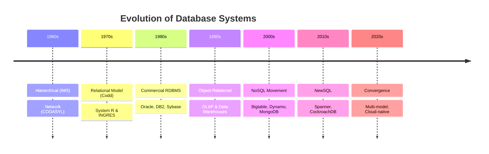
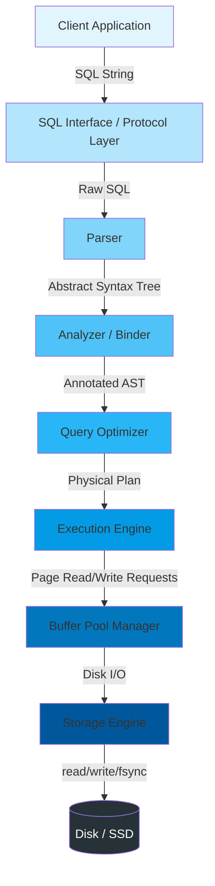
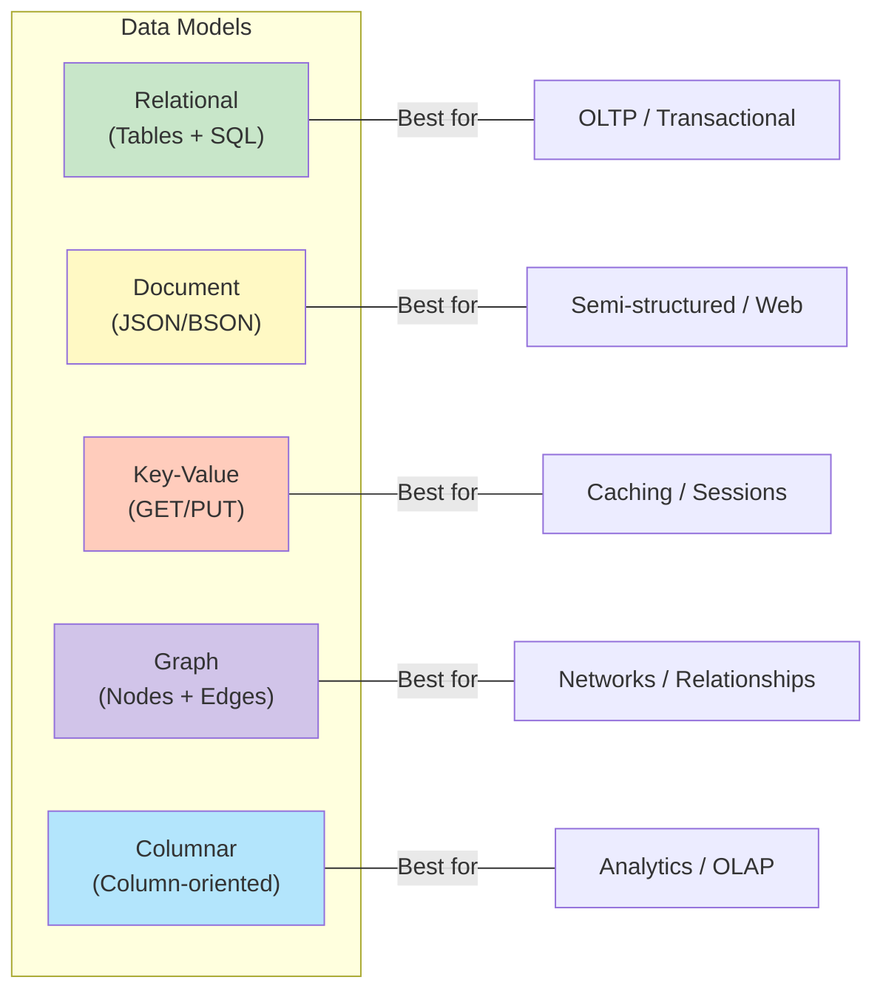
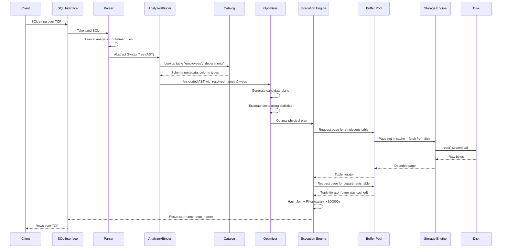
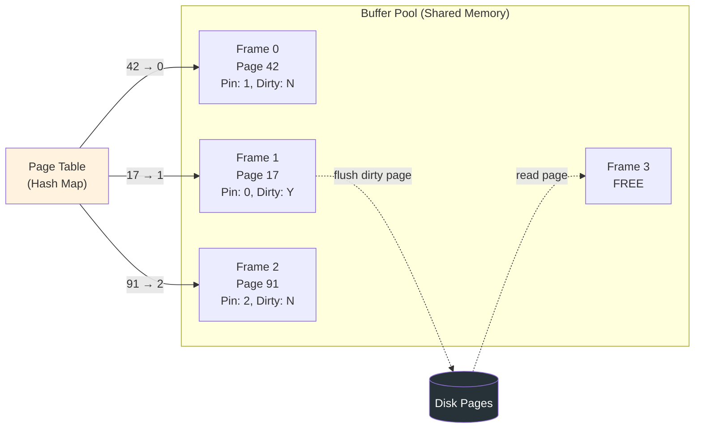
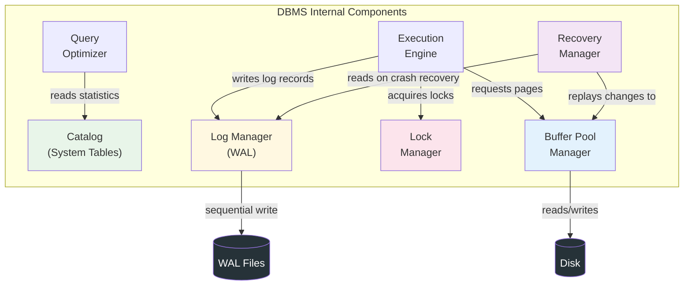
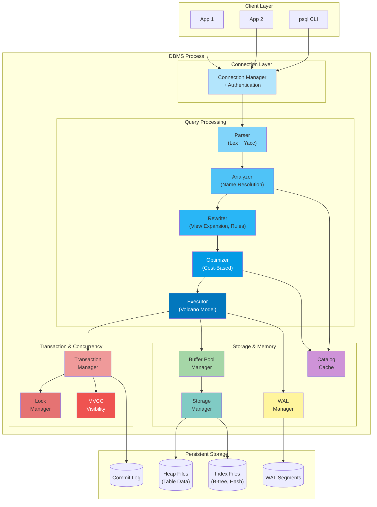

# Module 1: Foundations & Architecture -- Core Teaching Content

## 1. What Is a Database vs. a DBMS?

A **database** is an organized collection of structured data. A phone book, a spreadsheet of employee records, or a folder of JSON files can all be called databases in the loose sense.

A **Database Management System (DBMS)** is the *software* that creates, manages, and provides controlled access to one or more databases. It enforces rules, handles concurrency, recovers from crashes, and optimizes queries. When people say "PostgreSQL" or "MySQL," they are naming a DBMS, not a database.

| Aspect | Database | DBMS |
|--------|----------|------|
| Nature | Data itself | Software system |
| Example | The `employees` table | PostgreSQL 16 |
| Persistence | Stored on disk | Runs as a process |
| Intelligence | None -- passive bits | Query optimization, concurrency control, recovery |

### Why the distinction matters

If you delete every row from every table, you still have a DBMS running. If you uninstall PostgreSQL, the raw data files on disk are still a (now inaccessible) database. Understanding this separation is the first step toward understanding how the layers of a DBMS are designed.

---

## 2. A Brief History of Databases

### 2.1 The Pre-Relational Era (1960s--1970s)

Early systems used **hierarchical** (IBM IMS, 1966) and **network** (CODASYL) data models. Data was accessed through *navigational* pointer-chasing: a program literally walked links from parent records to child records. This was fast but extremely rigid -- changing the schema meant rewriting application code.

### 2.2 The Relational Revolution (1970--1990s)

Edgar F. Codd's 1970 paper *"A Relational Model of Data for Large Shared Data Banks"* proposed that data should be organized into **relations** (tables) and accessed through a declarative language. Two landmark prototypes followed:

- **System R** (IBM, 1974) -- introduced SQL and cost-based query optimization.
- **INGRES** (UC Berkeley, 1973) -- introduced QUEL and pioneered access-method research.

Commercial products exploded: Oracle (1979), IBM DB2 (1983), Sybase, Informix, and the open-source PostgreSQL (evolved from INGRES via Postgres).

### 2.3 The Object-Relational and OLAP Era (1990s--2000s)

SQL databases added object-relational features (user-defined types, inheritance). Separately, data warehousing drove column-oriented designs and OLAP cubes. The distinction between OLTP and OLAP workloads became critical.

### 2.4 The NoSQL Movement (2005--2015)

Web-scale companies hit limits of single-node relational systems. Google's Bigtable (2006) and Amazon's Dynamo (2007) papers inspired a wave of systems that traded SQL and ACID for horizontal scalability:

- **Key-value stores**: Redis, Riak, DynamoDB
- **Document stores**: MongoDB, CouchDB
- **Wide-column stores**: Cassandra, HBase
- **Graph databases**: Neo4j, JanusGraph

### 2.5 NewSQL and the Convergence (2012--present)

Systems like Google Spanner, CockroachDB, TiDB, and YugabyteDB proved you *can* have both SQL/ACID and horizontal scalability. The industry now recognizes that NoSQL vs SQL was a false dichotomy -- the real design axis is the set of trade-offs you choose.



---

## 3. DBMS Architecture: The Layered Model

Every serious DBMS can be understood as a stack of layers. Each layer has a clear responsibility and communicates with its neighbors through well-defined interfaces.



### Layer Responsibilities

| Layer | Input | Output | Key Concern |
|-------|-------|--------|-------------|
| SQL Interface | TCP packet | SQL string | Protocol parsing, authentication |
| Parser | SQL string | AST | Syntax checking |
| Analyzer / Binder | AST | Annotated AST | Name resolution, type checking via catalog |
| Optimizer | Annotated AST | Physical query plan | Cost estimation, join ordering, index selection |
| Execution Engine | Physical plan | Result tuples | Iterator model, vectorized execution |
| Buffer Pool Manager | Page requests | In-memory pages | Caching, replacement policy (LRU, Clock) |
| Storage Engine | Logical read/write | Physical I/O | Page layout, B-tree / LSM-tree, WAL |
| Disk | System calls | Bytes | Seek time, throughput, fsync guarantees |

---

## 4. Data Models

A **data model** defines how data is logically organized and what operations are available.

### 4.1 Relational Model

Data lives in **tables** (relations). Each table has a fixed schema of typed columns. Relationships are expressed through foreign keys. Queried with SQL.

**Strengths**: Strong consistency, powerful joins, mature optimizer technology.
**Weaknesses**: Rigid schema, impedance mismatch with object-oriented code.

### 4.2 Document Model

Data is stored as semi-structured **documents** (JSON, BSON). Each document can have a different structure. Collections group similar documents.

**Strengths**: Schema flexibility, natural mapping to application objects, good for hierarchical data.
**Weaknesses**: Weak join support, potential data duplication.

### 4.3 Key-Value Model

The simplest model: a dictionary mapping opaque keys to opaque values. The DBMS has no knowledge of the value's internal structure.

**Strengths**: Extremely fast lookups, easy to partition.
**Weaknesses**: No query language beyond GET/PUT/DELETE, no secondary indexes (usually).

### 4.4 Graph Model

Data is represented as **nodes** (entities) and **edges** (relationships). Two main flavors:
- **Property graph**: nodes and edges have key-value properties (Neo4j, Amazon Neptune).
- **RDF / Triple store**: subject-predicate-object triples (Apache Jena).

**Strengths**: Natural for highly connected data (social networks, fraud detection).
**Weaknesses**: Poor for aggregation-heavy analytics, fewer mature systems.

### 4.5 Columnar (Wide-Column) Model

Data is physically stored column-by-column rather than row-by-row. This is an *implementation strategy* more than a logical model, but it profoundly affects what queries are fast.

**Strengths**: Excellent compression, fast scans for analytics (OLAP).
**Weaknesses**: Expensive single-row updates, not ideal for OLTP.



---

## 5. ANSI SQL Standards Overview

SQL has been standardized by ANSI/ISO since 1986. Each revision added significant features:

| Standard | Year | Key Additions |
|----------|------|---------------|
| SQL-86 | 1986 | First standard, basic SELECT/INSERT/UPDATE/DELETE |
| SQL-89 | 1989 | Integrity constraints (CHECK, FOREIGN KEY) |
| SQL-92 | 1992 | JOIN syntax, CASE expressions, string functions, three compliance levels |
| SQL:1999 | 1999 | Common Table Expressions (WITH), triggers, procedural extensions (PSM), OLAP functions |
| SQL:2003 | 2003 | Window functions, XML support, MERGE statement, identity columns |
| SQL:2006 | 2006 | XML Query Language (XQuery) integration |
| SQL:2008 | 2008 | TRUNCATE, enhanced MERGE, INSTEAD OF triggers |
| SQL:2011 | 2011 | Temporal databases (period definitions, system-time versioning) |
| SQL:2016 | 2016 | JSON support, row pattern matching |
| SQL:2023 | 2023 | Property Graph Queries (SQL/PGQ), enhanced JSON |

No DBMS implements the full standard. PostgreSQL tracks the standard most faithfully among open-source systems. MySQL and SQLite have notable deviations.

---

## 6. How a Query Flows Through the System

Let us trace what happens when a client sends:

```sql
SELECT e.name, d.dept_name
FROM employees e
JOIN departments d ON e.dept_id = d.id
WHERE e.salary > 100000;
```



### Step-by-step breakdown

1. **Protocol Layer**: The client connects via TCP (PostgreSQL wire protocol, port 5432). The server authenticates, then reads the SQL string from the message.

2. **Parser (Lexer + Grammar)**: The SQL string is tokenized into keywords (`SELECT`, `FROM`, `JOIN`, `WHERE`), identifiers (`e`, `d`, `name`, `salary`), operators (`>`, `=`), and literals (`100000`). A grammar (usually yacc/bison-generated) checks syntax and produces an **Abstract Syntax Tree (AST)**.

3. **Analyzer / Binder**: The AST references names like `employees` and `salary`. The analyzer consults the **catalog** (a set of system tables describing all schemas, tables, columns, types, constraints, and indexes) to resolve these names. It verifies that `salary` is a numeric column, that `dept_id` and `id` are compatible types for the join, and annotates the AST with OIDs (object identifiers) and type information.

4. **Query Optimizer**: This is the brain of the DBMS. It considers many possible ways to execute the query:
   - Should it use a sequential scan or an index scan on `employees`?
   - Should the join be a nested-loop, hash join, or merge join?
   - In what order should the tables be joined?
   It uses **cost models** (estimating I/O, CPU, and memory costs) and **statistics** (histograms, distinct counts, table sizes) to pick the cheapest plan.

5. **Execution Engine**: The chosen physical plan is a tree of **operators**. In the classic *Volcano / iterator model*, each operator implements `Open()`, `Next()`, and `Close()`. The root operator pulls tuples up from its children.

6. **Buffer Pool Manager**: When the executor needs a page (say, page 42 of the `employees` heap file), it asks the buffer pool. If the page is already cached in shared memory, it returns immediately. Otherwise, the buffer pool evicts a victim page (using LRU, Clock, or a more advanced policy) and reads the needed page from disk.

7. **Storage Engine**: Translates logical page numbers into physical file offsets. Manages the on-disk format: heap files, B-tree indexes, WAL (Write-Ahead Log) records.

8. **Disk**: The actual `read()` and `write()` system calls. On an SSD, random reads take ~100 microseconds. On an HDD, a random seek takes ~10 milliseconds -- 100x slower.

---

## 7. Internal Components of a DBMS

Beyond the main query-processing pipeline, a DBMS contains several critical subsystems.

### 7.1 Catalog (System Tables)

The catalog stores **metadata**: table definitions, column types, indexes, constraints, users, permissions, and statistics. In PostgreSQL, the catalog lives in system tables like `pg_class`, `pg_attribute`, `pg_index`, and `pg_statistic`.

### 7.2 Buffer Pool Manager

The buffer pool is a region of shared memory divided into fixed-size **frames** (typically 8 KB in PostgreSQL, matching the disk page size). It maintains:

- A **page table** (hash map from page ID to frame index).
- A **pin count** for each frame (how many concurrent users need the page).
- A **dirty flag** (has the page been modified since it was read from disk?).



### 7.3 Lock Manager

The lock manager implements **concurrency control**. It maintains a lock table mapping database objects (tables, pages, tuples) to lock modes (shared, exclusive, intent-shared, intent-exclusive, etc.). When a transaction requests a lock that conflicts with an existing lock, it is placed in a **wait queue**. The lock manager also runs **deadlock detection** (typically by building a waits-for graph and checking for cycles).

### 7.4 Log Manager (WAL -- Write-Ahead Logging)

Before any change is applied to a data page, the DBMS writes a **log record** describing the change to the Write-Ahead Log. This guarantees **durability**: if the system crashes, the log can be replayed to reconstruct committed changes and undo uncommitted ones.

A log record typically contains:
- Transaction ID
- Log Sequence Number (LSN)
- Previous LSN for this transaction
- Type (INSERT, UPDATE, DELETE, COMMIT, ABORT)
- Before-image and after-image of the modified data

### 7.5 Recovery Manager

On startup after a crash, the recovery manager performs:

1. **Analysis phase**: Scan the log from the last checkpoint to determine which transactions were active and which pages might be dirty.
2. **Redo phase**: Replay all logged changes to bring pages up to date (even for aborted transactions).
3. **Undo phase**: Roll back all transactions that were active at the time of the crash.

This is the **ARIES** (Algorithm for Recovery and Isolation Exploiting Semantics) protocol, used by PostgreSQL, MySQL/InnoDB, DB2, and SQL Server.



---

## 8. Putting It All Together: The Big Picture



---

## 9. Key Terminology Glossary

| Term | Definition |
|------|-----------|
| **Tuple** | A single row in a relation |
| **Relation** | A table (in formal relational algebra) |
| **Schema** | The structure definition of a table (column names, types, constraints) |
| **Catalog** | System metadata describing all objects in the database |
| **Page** | Fixed-size block of data (typically 4 KB or 8 KB), the unit of I/O |
| **Buffer Pool** | In-memory cache of disk pages |
| **WAL** | Write-Ahead Log -- ensures durability by logging changes before applying them |
| **MVCC** | Multi-Version Concurrency Control -- allows readers and writers to not block each other |
| **B-tree** | Balanced tree data structure used for indexes; O(log n) search |
| **LSM-tree** | Log-Structured Merge Tree -- write-optimized alternative to B-trees |
| **ACID** | Atomicity, Consistency, Isolation, Durability -- the four transaction guarantees |
| **Cost model** | Mathematical model the optimizer uses to estimate the expense of a query plan |
| **Checkpoint** | A point-in-time snapshot that reduces recovery time by flushing dirty pages |
| **Heap file** | An unordered collection of pages storing table data |

---

## 10. Summary

A DBMS is a complex, layered software system. At its core, it transforms a declarative SQL statement into efficient physical operations on disk pages. The key insight is *separation of concerns*:

- The **parser** worries about syntax.
- The **optimizer** worries about efficiency.
- The **executor** worries about data flow.
- The **buffer pool** worries about caching.
- The **log manager** worries about durability.
- The **lock manager** worries about concurrency.

No single component understands the entire system, yet together they provide the illusion of a simple, reliable, concurrent data store. In the following files in this module, we will explore each of these layers in depth.
