# Module 2: Storage Engines & Disk I/O -- Deep Dive

## 1. How PostgreSQL Stores Data

PostgreSQL organizes data in a strict hierarchy. Understanding this hierarchy is essential for
diagnosing performance issues and reasoning about storage behavior.

### The PostgreSQL Storage Hierarchy

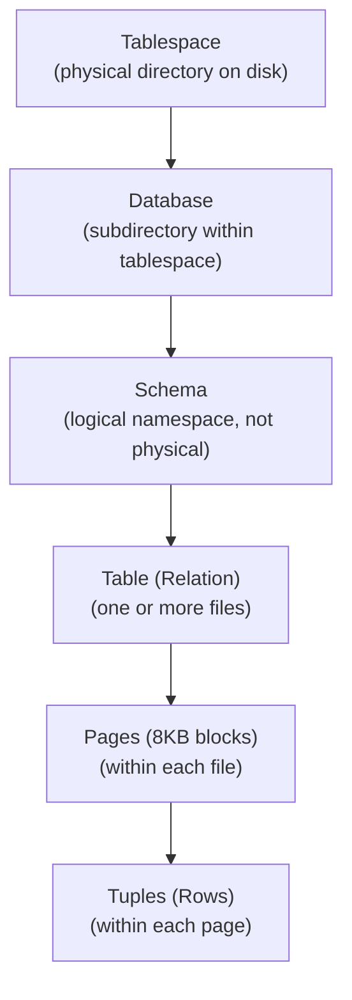

### Tablespaces

A tablespace maps to a directory on the filesystem. PostgreSQL has two default tablespaces:

- `pg_default` -- stores user data (maps to `$PGDATA/base/`)
- `pg_global` -- stores cluster-wide shared tables (maps to `$PGDATA/global/`)

You can create custom tablespaces pointing to other mount points (e.g., fast SSDs):

```sql
CREATE TABLESPACE fast_ssd LOCATION '/mnt/ssd/pg_data';
CREATE TABLE hot_data (...) TABLESPACE fast_ssd;
```

### Databases and OIDs

Each database gets a subdirectory under `$PGDATA/base/`, named by its **OID** (Object ID).
You can find the OID:

```sql
SELECT oid, datname FROM pg_database;
-- oid  | datname
-- 16384 | mydb
```

So `mydb`'s data lives in `$PGDATA/base/16384/`.

### Tables as Files

Each table (relation) is stored as one or more files. The file name is the table's
**relfilenode** (which may differ from its OID after operations like TRUNCATE or REINDEX):

```sql
SELECT relfilenode, relname FROM pg_class WHERE relname = 'users';
-- relfilenode | relname
-- 16400       | users
```

The table file: `$PGDATA/base/16384/16400`

If the file exceeds 1 GB, PostgreSQL splits it into **segments**:
- `16400` (first 1 GB)
- `16400.1` (next 1 GB)
- `16400.2` (next 1 GB)
- ...

Additional **fork files** exist alongside the main data file:
- `16400_fsm` -- Free Space Map
- `16400_vm` -- Visibility Map
- `16400_init` -- Initialization fork (for unlogged tables)

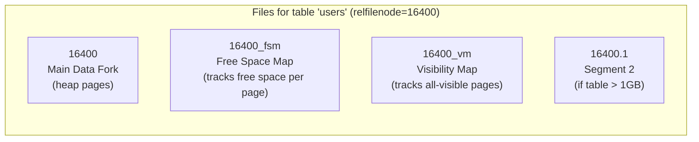

---

## 2. PostgreSQL Page Layout in Detail

Every PostgreSQL page is exactly **8192 bytes** (8 KB). The layout:

```
Offset  Size    Description
------  ------  -----------
0       24      PageHeaderData
24      4*N     ItemIdData array (line pointers)
...     ...     Free space
...     ...     Tuple data (grows from end)
8176    8       Special space (for index pages)
```

### PageHeaderData (24 bytes)

| Field           | Size   | Purpose |
|----------------|--------|---------|
| pd_lsn         | 8 bytes| LSN of last WAL record affecting this page |
| pd_checksum    | 2 bytes| Page checksum (if data checksums enabled) |
| pd_flags       | 2 bytes| Page flags (has free lines, is full, etc.) |
| pd_lower       | 2 bytes| Offset to start of free space |
| pd_upper       | 2 bytes| Offset to end of free space |
| pd_special     | 2 bytes| Offset to start of special space |
| pd_pagesize_version | 2 bytes| Page size and layout version |
| pd_prune_xid   | 4 bytes| Oldest unpruned XMAX on page |

### ItemIdData (Line Pointers)

Each ItemIdData is 4 bytes, containing:
- **lp_off** (15 bits): Byte offset to the tuple from the start of the page
- **lp_flags** (2 bits): Status (unused, normal, redirect, dead)
- **lp_len** (15 bits): Byte length of the tuple

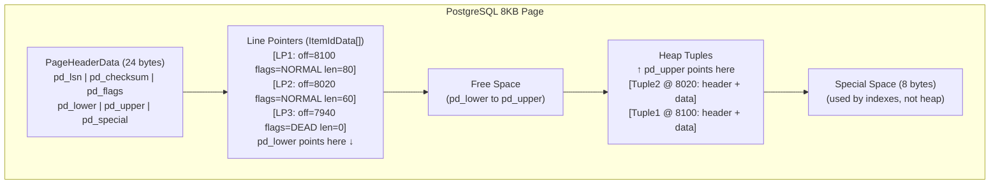

### HeapTupleHeaderData

Each tuple has its own header (23 bytes minimum):

| Field        | Size   | Purpose |
|-------------|--------|---------|
| t_xmin      | 4 bytes| Inserting transaction ID |
| t_xmax      | 4 bytes| Deleting/locking transaction ID |
| t_cid       | 4 bytes| Command ID within transaction |
| t_ctid      | 6 bytes| Current TID (page, offset) -- for HOT updates |
| t_infomask2 | 2 bytes| Number of attributes + flags |
| t_infomask  | 2 bytes| Various flag bits |
| t_hoff      | 1 byte | Offset to tuple data |

After the header comes the **null bitmap** (if any fields are nullable), followed by
the actual field data.

This header overhead (23+ bytes per row) is significant. A table with many narrow rows
(e.g., a join table with two integer columns) has more header than data.

---

## 3. System Catalogs: pg_class and pg_attribute

### pg_class

Every table, index, sequence, view, and other relation is registered in `pg_class`:

```sql
SELECT relname, relkind, relpages, reltuples, relfilenode
FROM pg_class
WHERE relname = 'users';
```

Key columns:
- `relkind`: 'r' (ordinary table), 'i' (index), 'S' (sequence), 'v' (view), 't' (TOAST table)
- `relpages`: Estimated number of disk pages
- `reltuples`: Estimated number of rows
- `relfilenode`: File name on disk

### pg_attribute

Every column of every relation is described in `pg_attribute`:

```sql
SELECT attname, atttypid, attlen, attnum, attnotnull
FROM pg_attribute
WHERE attrelid = 'users'::regclass AND attnum > 0;
```

Key columns:
- `attlen`: -1 means variable-length (uses varlena header), -2 means null-terminated C string
- `attalign`: 'c' (char, 1 byte), 's' (short, 2 bytes), 'i' (int, 4 bytes), 'd' (double, 8 bytes)
- `attstorage`: 'p' (plain), 'e' (external/TOAST), 'm' (main), 'x' (extended/compressed+TOAST)

---

## 4. TOAST: The Oversized-Attribute Storage Technique

PostgreSQL pages are 8 KB, and a single tuple cannot span multiple pages. So what happens
when a row contains a 1 MB text field?

**TOAST** solves this by:
1. Compressing the value (using pglz or lz4).
2. If still too large, storing chunks in a separate **TOAST table**.
3. Replacing the original value with a small **TOAST pointer** (18 bytes).

### When Does TOAST Kick In?

TOAST activates when a tuple would exceed approximately **2 KB** (the TOAST threshold,
roughly 1/4 of the page size). The strategy depends on the column's `attstorage` setting:

| Strategy | Code | Behavior |
|----------|------|----------|
| PLAIN    | p    | Never TOAST. Value must fit in page. |
| EXTENDED | x    | Try compression first, then out-of-line if still too big. |
| EXTERNAL | e    | Store out-of-line without compression. |
| MAIN     | m    | Try compression; out-of-line only as last resort. |

### TOAST Table Structure

Each TOASTable table gets a companion TOAST table (e.g., `pg_toast.pg_toast_16400`).
The TOAST table stores chunks:

```sql
-- TOAST table columns:
-- chunk_id   (OID)   -- which original value
-- chunk_seq  (int4)  -- sequence within the value
-- chunk_data (bytea) -- up to ~2000 bytes of data
```

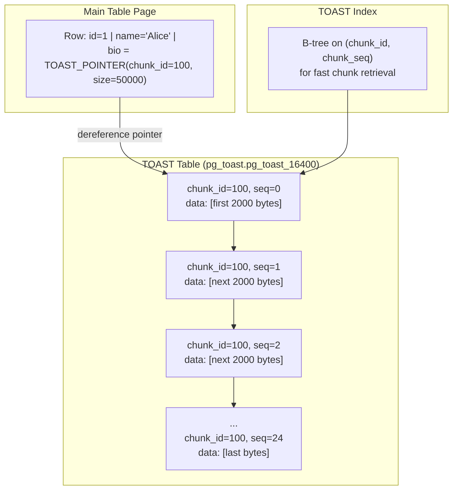

### TOAST Performance Implications

- **SELECT \***: Fetches TOAST data, which may require many additional I/Os.
- **SELECT id, name**: If `bio` is not selected, the TOAST data is never read.
- **Large column updates**: Updating a non-TOASTed column does NOT re-write TOAST data
  (TOAST values are referenced by pointer and are copy-on-write).

---

## 5. How SQLite's B-tree Pages Work

SQLite stores everything in a single file, organized as a collection of B-tree pages.
There are two types:

1. **Table B-trees** (clustered by rowid): leaf pages contain the actual row data.
2. **Index B-trees**: leaf pages contain index keys + rowids.

### SQLite Page Structure

```
+---------------------------+
| Page Header (8-12 bytes)  |
|  - Page type (leaf/inter) |
|  - First free block       |
|  - Number of cells        |
|  - Cell content offset    |
|  - Right-most pointer     |
+---------------------------+
| Cell Pointer Array        |
| [ptr1][ptr2][ptr3]...     |
+---------------------------+
| Unallocated Space         |
+---------------------------+
| Cell Content Area         |
| [cell3][cell2][cell1]     |
+---------------------------+
```

SQLite uses a similar slotted page approach. Cells (tuples) are stored in the content area
and referenced by a cell pointer array.

### Overflow Pages

If a single record is too large for one page, SQLite stores the beginning of the record on
the B-tree leaf page and the remainder on **overflow pages**. Overflow pages form a linked
list:

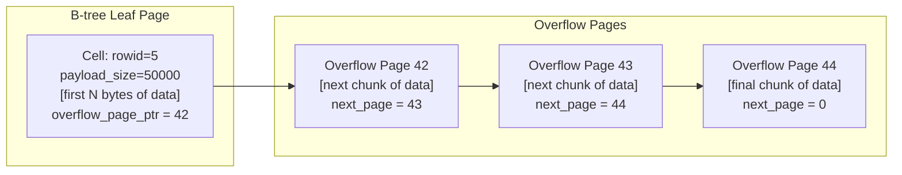

The threshold for overflow depends on the page size and the record size. For a 4 KB page,
if a record exceeds the usable page space minus overhead, it spills to overflow pages.

---

## 6. Free Space Management

### PostgreSQL's Free Space Map (FSM)

The FSM tracks how much free space each page has. It's stored in the `_fsm` fork file.

**Structure:** The FSM uses a **binary tree** stored across FSM pages. Each leaf node
represents a heap page and stores a 1-byte value representing free space in categories
(0 = 0 bytes, 255 = 8192 bytes, in 32-byte increments).

The tree structure allows fast lookup: "find me a page with at least X bytes free" runs
in O(log N) by traversing from root to leaf.

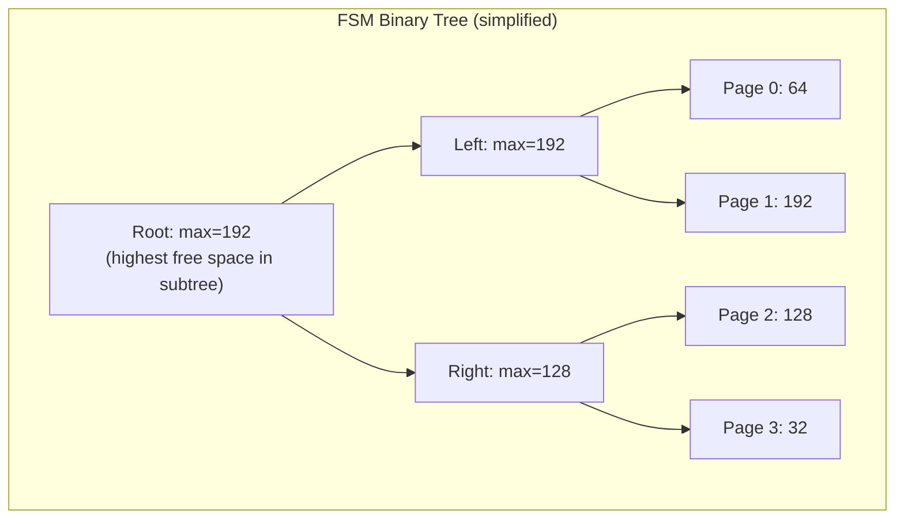

When inserting a tuple of 150 bytes (encoded as category ~5):
1. Start at root: max=192 >= 5. Proceed.
2. Left child has max=192. Go left.
3. Page 1 has 192 >= 5. Use page 1.
4. After insertion, update Page 1's free space and propagate up.

### Visibility Map (VM)

The visibility map tracks two bits per heap page:

- **All-visible bit**: Set when all tuples on the page are visible to all active transactions.
- **All-frozen bit**: Set when all tuples are frozen (no longer need transaction ID checks).

**Why it matters:**

1. **Index-only scans**: If the all-visible bit is set, PostgreSQL can answer queries from
   the index alone without fetching the heap page (since it knows all tuples are visible).
2. **VACUUM**: Can skip all-frozen pages entirely. Only needs to visit pages that might
   have dead tuples.

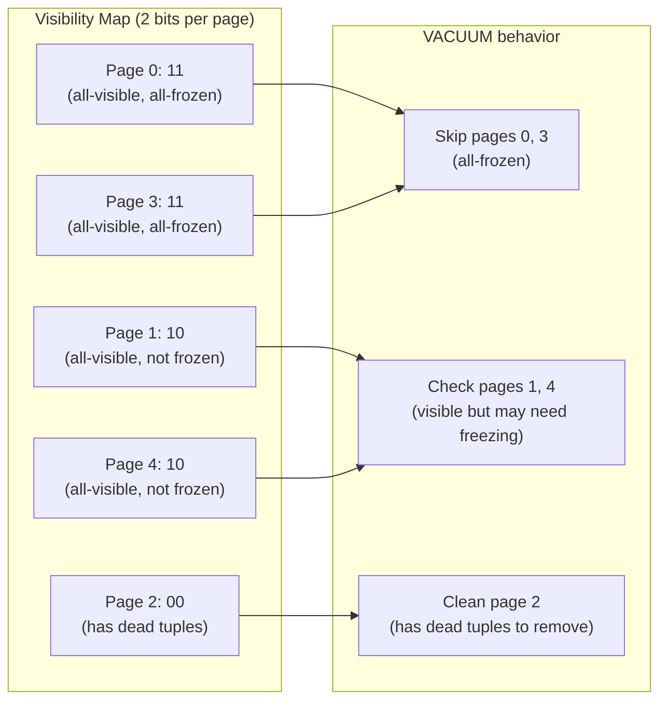

---

## 7. OS Page Cache and Database Buffer Pool

### Two Layers of Caching

Modern systems have two layers of page caching:

1. **Database Buffer Pool**: Managed by the database engine. Pages are read from disk into
   buffer pool frames. The database controls eviction (LRU, clock, etc.).
2. **OS Page Cache (kernel buffer cache)**: The OS kernel caches recently read file blocks
   in unused RAM. The database may not even know this cache exists.

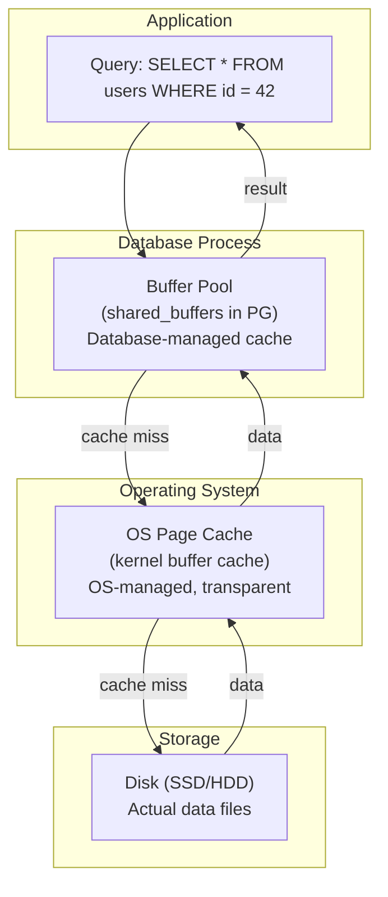

### The Double-Buffering Problem

With buffered I/O (the default), data gets cached in **both** the database buffer pool and
the OS page cache. This wastes memory:

```
User writes page to buffer pool (RAM copy 1)
  → write() syscall copies to OS page cache (RAM copy 2)
  → OS eventually flushes to disk
```

The same page occupies memory twice. For a database with a 4 GB buffer pool on a machine
with 16 GB RAM, the OS might cache the same 4 GB of pages, leaving only 8 GB for other uses.

### Direct I/O vs Buffered I/O

**Buffered I/O (default):**
- read()/write() go through the OS page cache.
- OS handles read-ahead, write-back, and page eviction.
- Simple to use but causes double-buffering.

**Direct I/O (O_DIRECT):**
- Bypasses the OS page cache entirely.
- Data goes directly between user-space buffers and disk.
- The database has full control over caching.
- Alignment constraints: buffers must be aligned to sector boundaries (usually 512 or 4096 bytes).

| Database   | Default I/O Mode | Notes |
|-----------|------------------|-------|
| PostgreSQL | Buffered         | O_DIRECT support added in PG 16 (experimental) |
| MySQL/InnoDB | Direct (O_DIRECT) | `innodb_flush_method = O_DIRECT` |
| Oracle     | Direct           | Has always preferred direct I/O |
| SQLite     | Buffered         | Relies on OS page cache |

**The debate:**
- PostgreSQL historically argued that the OS page cache provides useful second-level caching
  and read-ahead.
- InnoDB/Oracle argued that the database knows its access patterns better than the OS and
  should control all caching.
- Modern consensus: Direct I/O with a well-tuned buffer pool is generally better for large
  databases, but buffered I/O is simpler and works well for smaller workloads.

---

## 8. fsync and Durability Guarantees

### The Problem

When the database calls `write()`, the data may sit in:
1. The user-space buffer (before write returns -- rare with synchronous writes).
2. The OS page cache (after write returns, before disk flush).
3. The disk controller's volatile write cache.
4. The actual persistent storage media (platters/NAND cells).

A power failure at stage 2 or 3 means **data loss**. The write appeared to succeed
(write() returned OK) but the data never reached persistent storage.

### fsync

`fsync(fd)` forces the OS to flush all dirty pages for file descriptor `fd` to persistent
storage. It does NOT return until the data is safely on disk (or at least in the disk
controller's battery-backed write cache).

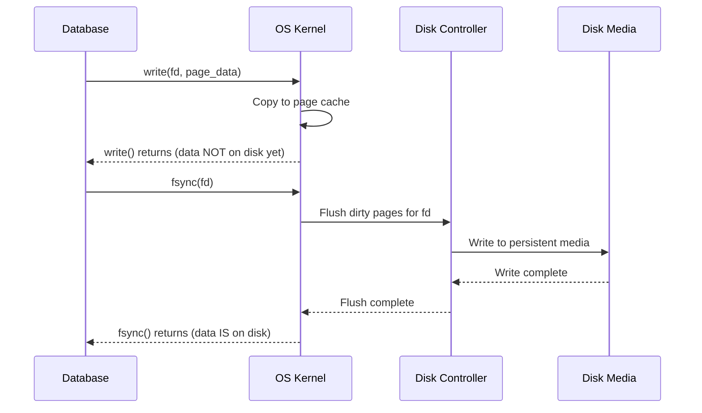

### Related System Calls

| Call | Behavior |
|------|----------|
| `fsync(fd)` | Flush data + metadata for fd to disk |
| `fdatasync(fd)` | Flush data for fd (skip metadata if unnecessary) |
| `sync_file_range()` | Flush a specific byte range (Linux-specific) |
| `msync()` | Flush mmap'd regions |
| `sync()` | Flush ALL dirty pages system-wide (not recommended) |

### The fsync Controversy (2018)

In 2018, PostgreSQL developers discovered that on Linux, if `fsync()` fails (returns EIO),
the OS marks the page as clean and **discards the dirty data**. A subsequent `fsync()` call
would succeed -- but the data was lost.

This meant PostgreSQL's error handling was wrong: it retried `fsync()` on failure, assuming
the dirty pages were still there. They weren't.

The fix: PostgreSQL now panics on `fsync()` failure, forcing a crash recovery from WAL.
This is the only safe behavior.

### Write Ordering and Barriers

Databases rely on writes happening in a specific order (e.g., WAL record before data page).
Modern disks and controllers may reorder writes for performance. `fsync()` acts as a
**barrier**: all writes issued before `fsync()` must reach disk before `fsync()` returns.

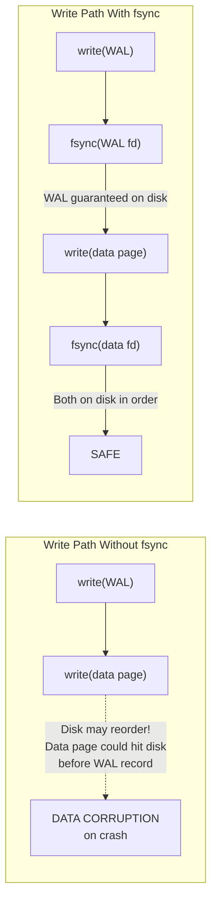

---

## 9. Putting It All Together: A Read Path Example

What happens when PostgreSQL executes `SELECT * FROM users WHERE id = 42` (assuming a
B-tree index on `id`)?

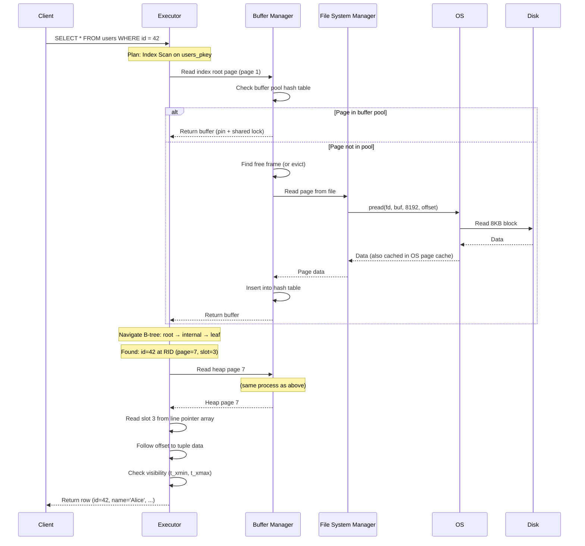

---

## 10. Key Takeaways

1. **PostgreSQL's storage hierarchy** (tablespace/database/table/page/tuple) maps directly
   to the filesystem (directories/files/8KB blocks/byte offsets).

2. **TOAST** is PostgreSQL's solution for large values: compress, then externalize to a
   separate TOAST table. It's transparent but has performance implications.

3. **The FSM and VM** are auxiliary data structures that prevent full table scans during
   INSERT (find free space) and VACUUM (skip clean pages).

4. **Double buffering** (database + OS page cache) wastes memory. Direct I/O avoids this
   but requires the database to handle all caching logic.

5. **fsync is non-negotiable** for durability. Without it, a power failure can lose committed
   data. The 2018 fsync bug in Linux showed how subtle durability issues can be.

6. **Every query is ultimately a sequence of page reads and writes.** Understanding the
   physical layout helps you predict and optimize performance.
