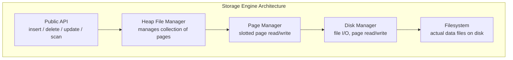
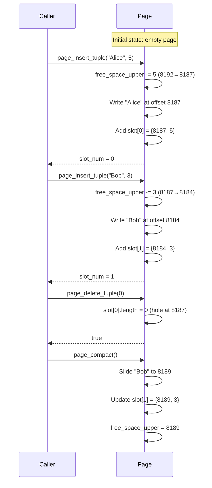
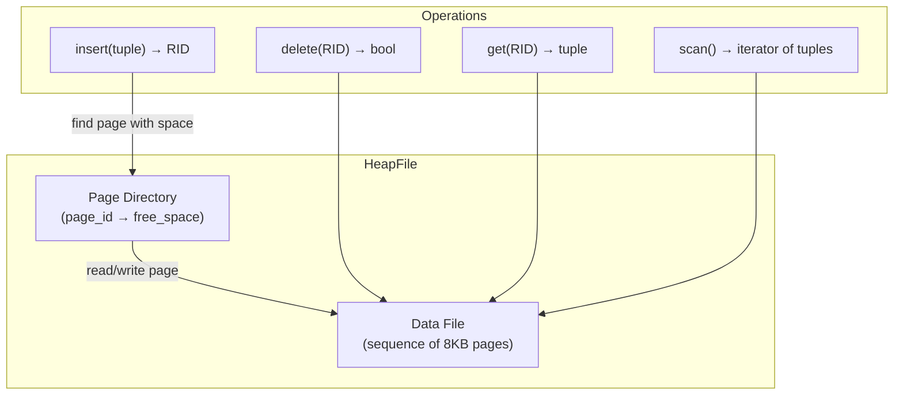
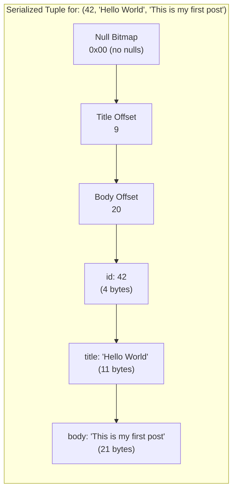
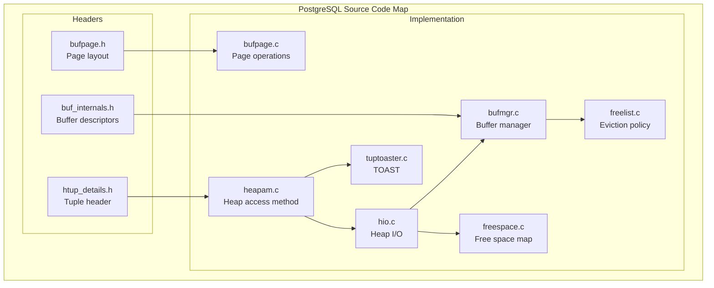
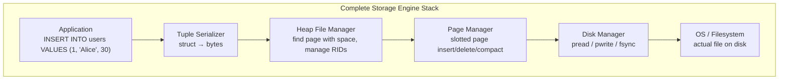

# Module 2: Storage Engines & Disk I/O -- Implementation Walkthrough

## 1. Overview

In this document we walk through implementing a simple page-based storage engine from
scratch. We cover the key data structures (Page, HeapFile, Tuple), serialization formats,
and show how they map to real database source code (PostgreSQL in particular).



---

## 2. Implementing a Page Struct

### Page Layout Design

Our page will use the classic slotted page architecture:

```
Offset 0                                              Offset PAGE_SIZE
+----------+------------------+-------------+---------+
| Header   | Slot Array       | Free Space  | Tuples  |
| (fixed)  | (grows right ->)  |             | (<- grows left) |
+----------+------------------+-------------+---------+
```

### C Implementation

```c
/* page.h */

#include <stdint.h>
#include <stdbool.h>

#define PAGE_SIZE       8192    /* 8 KB */
#define PAGE_HEADER_SIZE  24
#define SLOT_SIZE          4    /* 2 bytes offset + 2 bytes length */
#define INVALID_OFFSET     0

/* Page header: lives at the start of every page */
typedef struct PageHeader {
    uint32_t page_id;          /* unique page identifier */
    uint32_t lsn;              /* log sequence number for WAL */
    uint16_t num_slots;        /* number of entries in slot array */
    uint16_t free_space_lower; /* offset where slot array ends */
    uint16_t free_space_upper; /* offset where tuple data begins */
    uint16_t flags;            /* page flags: IS_LEAF, IS_DIRTY, etc. */
    uint32_t checksum;         /* CRC32 of page contents */
    uint32_t reserved;         /* alignment padding / future use */
} PageHeader;

/* Slot entry: each slot points to a tuple on the page */
typedef struct SlotEntry {
    uint16_t offset;  /* byte offset from start of page to tuple */
    uint16_t length;  /* length of the tuple in bytes, 0 = deleted */
} SlotEntry;

/* The full page: a byte array with typed access to header/slots */
typedef struct Page {
    uint8_t data[PAGE_SIZE];
} Page;

/* --- Accessor macros --- */

#define PAGE_HEADER(page)  ((PageHeader *)(page)->data)

#define PAGE_SLOT(page, i) \
    ((SlotEntry *)((page)->data + PAGE_HEADER_SIZE + (i) * SLOT_SIZE))

#define PAGE_FREE_SPACE(page) \
    (PAGE_HEADER(page)->free_space_upper - PAGE_HEADER(page)->free_space_lower)

/* --- Function declarations --- */

void     page_init(Page *page, uint32_t page_id);
int      page_insert_tuple(Page *page, const uint8_t *data, uint16_t len);
bool     page_delete_tuple(Page *page, uint16_t slot_num);
uint8_t *page_get_tuple(Page *page, uint16_t slot_num, uint16_t *out_len);
void     page_compact(Page *page);
```

```c
/* page.c */

#include <string.h>
#include <stdio.h>
#include "page.h"

/*
 * Initialize an empty page.
 * free_space_lower starts right after the header (no slots yet).
 * free_space_upper starts at the end of the page.
 */
void page_init(Page *page, uint32_t page_id) {
    memset(page->data, 0, PAGE_SIZE);

    PageHeader *hdr = PAGE_HEADER(page);
    hdr->page_id          = page_id;
    hdr->lsn              = 0;
    hdr->num_slots        = 0;
    hdr->free_space_lower = PAGE_HEADER_SIZE;
    hdr->free_space_upper = PAGE_SIZE;
    hdr->flags            = 0;
    hdr->checksum         = 0;
    hdr->reserved         = 0;
}

/*
 * Insert a tuple into the page.
 * Returns the slot number on success, -1 if no space.
 */
int page_insert_tuple(Page *page, const uint8_t *tuple_data, uint16_t len) {
    PageHeader *hdr = PAGE_HEADER(page);

    /* Check: do we have room for the tuple + a new slot entry? */
    uint16_t needed = len + SLOT_SIZE;
    uint16_t available = hdr->free_space_upper - hdr->free_space_lower;

    if (needed > available) {
        return -1;  /* not enough space */
    }

    /* Write the tuple at the end of the data area (growing downward) */
    hdr->free_space_upper -= len;
    memcpy(page->data + hdr->free_space_upper, tuple_data, len);

    /* Check for a reusable deleted slot first */
    int slot_num = -1;
    for (uint16_t i = 0; i < hdr->num_slots; i++) {
        SlotEntry *slot = PAGE_SLOT(page, i);
        if (slot->length == 0) {  /* deleted slot */
            slot->offset = hdr->free_space_upper;
            slot->length = len;
            slot_num = i;
            break;
        }
    }

    if (slot_num == -1) {
        /* No reusable slot; add a new one */
        slot_num = hdr->num_slots;
        SlotEntry *slot = PAGE_SLOT(page, slot_num);
        slot->offset = hdr->free_space_upper;
        slot->length = len;
        hdr->num_slots++;
        hdr->free_space_lower += SLOT_SIZE;
    }

    return slot_num;
}

/*
 * Mark a tuple as deleted by zeroing its slot length.
 * The space is not immediately reclaimed (call page_compact for that).
 */
bool page_delete_tuple(Page *page, uint16_t slot_num) {
    PageHeader *hdr = PAGE_HEADER(page);

    if (slot_num >= hdr->num_slots) {
        return false;
    }

    SlotEntry *slot = PAGE_SLOT(page, slot_num);
    if (slot->length == 0) {
        return false;  /* already deleted */
    }

    /* Zero out the tuple data for safety */
    memset(page->data + slot->offset, 0, slot->length);
    slot->length = 0;
    slot->offset = INVALID_OFFSET;

    return true;
}

/*
 * Retrieve a pointer to a tuple's data given its slot number.
 * Returns NULL if the slot is invalid or deleted.
 */
uint8_t *page_get_tuple(Page *page, uint16_t slot_num, uint16_t *out_len) {
    PageHeader *hdr = PAGE_HEADER(page);

    if (slot_num >= hdr->num_slots) {
        return NULL;
    }

    SlotEntry *slot = PAGE_SLOT(page, slot_num);
    if (slot->length == 0) {
        return NULL;  /* deleted */
    }

    if (out_len) {
        *out_len = slot->length;
    }

    return page->data + slot->offset;
}

/*
 * Compact the page: slide all live tuples together to eliminate
 * holes left by deletions. Update slot offsets accordingly.
 */
void page_compact(Page *page) {
    PageHeader *hdr = PAGE_HEADER(page);

    /* Temporary buffer for compacted tuples */
    uint8_t tmp[PAGE_SIZE];
    uint16_t write_offset = PAGE_SIZE;

    /* Walk slots and copy live tuples into tmp, packed tightly */
    for (uint16_t i = 0; i < hdr->num_slots; i++) {
        SlotEntry *slot = PAGE_SLOT(page, i);
        if (slot->length > 0) {
            write_offset -= slot->length;
            memcpy(tmp + write_offset, page->data + slot->offset, slot->length);
            slot->offset = write_offset;
        }
    }

    /* Copy compacted data back into the page */
    memcpy(page->data + write_offset,
           tmp + write_offset,
           PAGE_SIZE - write_offset);

    /* Zero out the freed space */
    memset(page->data + hdr->free_space_lower, 0,
           write_offset - hdr->free_space_lower);

    hdr->free_space_upper = write_offset;
}
```



---

## 3. Rust Implementation

Below is the same page manager in Rust, showing how to use safe abstractions over raw bytes.

```rust
// page.rs

const PAGE_SIZE: usize = 8192;
const PAGE_HEADER_SIZE: usize = 24;
const SLOT_SIZE: usize = 4;

#[derive(Debug, Clone, Copy)]
#[repr(C, packed)]
struct PageHeader {
    page_id: u32,
    lsn: u32,
    num_slots: u16,
    free_space_lower: u16,
    free_space_upper: u16,
    flags: u16,
    checksum: u32,
    reserved: u32,
}

#[derive(Debug, Clone, Copy)]
#[repr(C, packed)]
struct SlotEntry {
    offset: u16,
    length: u16,
}

pub struct Page {
    data: [u8; PAGE_SIZE],
}

#[derive(Debug, Clone, Copy, PartialEq, Eq, Hash)]
pub struct RecordId {
    pub page_id: u32,
    pub slot_num: u16,
}

impl Page {
    pub fn new(page_id: u32) -> Self {
        let mut page = Page {
            data: [0u8; PAGE_SIZE],
        };

        let header = page.header_mut();
        header.page_id = page_id;
        header.num_slots = 0;
        header.free_space_lower = PAGE_HEADER_SIZE as u16;
        header.free_space_upper = PAGE_SIZE as u16;
        header.flags = 0;
        header.checksum = 0;

        page
    }

    fn header(&self) -> &PageHeader {
        unsafe { &*(self.data.as_ptr() as *const PageHeader) }
    }

    fn header_mut(&mut self) -> &mut PageHeader {
        unsafe { &mut *(self.data.as_mut_ptr() as *mut PageHeader) }
    }

    fn slot(&self, index: u16) -> &SlotEntry {
        let offset = PAGE_HEADER_SIZE + (index as usize) * SLOT_SIZE;
        unsafe { &*(self.data.as_ptr().add(offset) as *const SlotEntry) }
    }

    fn slot_mut(&mut self, index: u16) -> &mut SlotEntry {
        let offset = PAGE_HEADER_SIZE + (index as usize) * SLOT_SIZE;
        unsafe { &mut *(self.data.as_mut_ptr().add(offset) as *mut SlotEntry) }
    }

    pub fn free_space(&self) -> u16 {
        let h = self.header();
        h.free_space_upper - h.free_space_lower
    }

    pub fn insert(&mut self, tuple: &[u8]) -> Option<u16> {
        let needed = tuple.len() as u16 + SLOT_SIZE as u16;
        if needed > self.free_space() {
            return None;
        }

        // Write tuple data (grows downward)
        let h = self.header_mut();
        h.free_space_upper -= tuple.len() as u16;
        let offset = h.free_space_upper;
        self.data[offset as usize..offset as usize + tuple.len()]
            .copy_from_slice(tuple);

        // Find a reusable slot or allocate a new one
        let num_slots = self.header().num_slots;
        let mut slot_num = None;

        for i in 0..num_slots {
            if self.slot(i).length == 0 {
                slot_num = Some(i);
                break;
            }
        }

        let sn = match slot_num {
            Some(i) => {
                let s = self.slot_mut(i);
                s.offset = offset;
                s.length = tuple.len() as u16;
                i
            }
            None => {
                let sn = num_slots;
                let s = self.slot_mut(sn);
                s.offset = offset;
                s.length = tuple.len() as u16;
                let h = self.header_mut();
                h.num_slots += 1;
                h.free_space_lower += SLOT_SIZE as u16;
                sn
            }
        };

        Some(sn)
    }

    pub fn get(&self, slot_num: u16) -> Option<&[u8]> {
        if slot_num >= self.header().num_slots {
            return None;
        }
        let s = self.slot(slot_num);
        if s.length == 0 {
            return None;
        }
        Some(&self.data[s.offset as usize..(s.offset + s.length) as usize])
    }

    pub fn delete(&mut self, slot_num: u16) -> bool {
        if slot_num >= self.header().num_slots {
            return false;
        }
        let s = self.slot_mut(slot_num);
        if s.length == 0 {
            return false;
        }
        s.length = 0;
        s.offset = 0;
        true
    }

    pub fn as_bytes(&self) -> &[u8; PAGE_SIZE] {
        &self.data
    }

    pub fn from_bytes(data: [u8; PAGE_SIZE]) -> Self {
        Page { data }
    }
}
```

---

## 4. Implementing a Heap File Manager

The heap file manages a collection of pages and provides tuple-level operations.



### C Implementation of HeapFile

```c
/* heapfile.h */

#include "page.h"

#define MAX_PAGES 4096

typedef struct {
    uint32_t page_id;
    uint16_t free_space;
} PageDirEntry;

typedef struct {
    int       fd;               /* file descriptor for the data file */
    uint32_t  num_pages;        /* total pages in the file */
    PageDirEntry directory[MAX_PAGES];  /* in-memory page directory */
} HeapFile;

typedef struct {
    uint32_t page_id;
    uint16_t slot_num;
} RID;

/* Open or create a heap file */
HeapFile *heap_open(const char *filename);

/* Close the heap file */
void heap_close(HeapFile *hf);

/* Insert a tuple, returns its RID */
RID heap_insert(HeapFile *hf, const uint8_t *data, uint16_t len);

/* Delete a tuple by RID */
bool heap_delete(HeapFile *hf, RID rid);

/* Get a tuple by RID. Caller must not free the returned pointer. */
uint8_t *heap_get(HeapFile *hf, RID rid, uint16_t *out_len);
```

```c
/* heapfile.c */

#include <fcntl.h>
#include <unistd.h>
#include <stdlib.h>
#include <string.h>
#include "heapfile.h"

/* Read a page from disk into the provided Page struct */
static bool read_page(HeapFile *hf, uint32_t page_id, Page *page) {
    off_t offset = (off_t)page_id * PAGE_SIZE;
    ssize_t n = pread(hf->fd, page->data, PAGE_SIZE, offset);
    return (n == PAGE_SIZE);
}

/* Write a page to disk */
static bool write_page(HeapFile *hf, uint32_t page_id, Page *page) {
    off_t offset = (off_t)page_id * PAGE_SIZE;
    ssize_t n = pwrite(hf->fd, page->data, PAGE_SIZE, offset);
    return (n == PAGE_SIZE);
}

HeapFile *heap_open(const char *filename) {
    HeapFile *hf = calloc(1, sizeof(HeapFile));
    hf->fd = open(filename, O_RDWR | O_CREAT, 0644);

    if (hf->fd < 0) {
        free(hf);
        return NULL;
    }

    /* Determine number of existing pages */
    off_t file_size = lseek(hf->fd, 0, SEEK_END);
    hf->num_pages = file_size / PAGE_SIZE;

    /* Build page directory from existing pages */
    Page page;
    for (uint32_t i = 0; i < hf->num_pages; i++) {
        read_page(hf, i, &page);
        hf->directory[i].page_id = i;
        hf->directory[i].free_space = PAGE_FREE_SPACE(&page);
    }

    return hf;
}

void heap_close(HeapFile *hf) {
    if (hf) {
        fsync(hf->fd);
        close(hf->fd);
        free(hf);
    }
}

RID heap_insert(HeapFile *hf, const uint8_t *data, uint16_t len) {
    RID rid = {0, 0};
    uint16_t needed = len + SLOT_SIZE;

    /* Find a page with enough free space */
    int target_page = -1;
    for (uint32_t i = 0; i < hf->num_pages; i++) {
        if (hf->directory[i].free_space >= needed) {
            target_page = i;
            break;
        }
    }

    Page page;

    if (target_page < 0) {
        /* No page has space; allocate a new one */
        target_page = hf->num_pages;
        page_init(&page, target_page);
        hf->num_pages++;
    } else {
        read_page(hf, target_page, &page);
    }

    int slot = page_insert_tuple(&page, data, len);
    if (slot < 0) {
        /* Should not happen if directory is accurate */
        rid.page_id = 0xFFFFFFFF;
        return rid;
    }

    /* Write page back and update directory */
    write_page(hf, target_page, &page);
    hf->directory[target_page].page_id = target_page;
    hf->directory[target_page].free_space = PAGE_FREE_SPACE(&page);

    rid.page_id = target_page;
    rid.slot_num = slot;
    return rid;
}

bool heap_delete(HeapFile *hf, RID rid) {
    if (rid.page_id >= hf->num_pages) return false;

    Page page;
    read_page(hf, rid.page_id, &page);

    bool ok = page_delete_tuple(&page, rid.slot_num);
    if (ok) {
        write_page(hf, rid.page_id, &page);
        hf->directory[rid.page_id].free_space = PAGE_FREE_SPACE(&page);
    }
    return ok;
}

uint8_t *heap_get(HeapFile *hf, RID rid, uint16_t *out_len) {
    static Page page;  /* WARNING: not thread-safe */
    if (rid.page_id >= hf->num_pages) return NULL;

    read_page(hf, rid.page_id, &page);
    return page_get_tuple(&page, rid.slot_num, out_len);
}
```

---

## 5. Tuple Serialization and Deserialization

### Fixed-Length Fields

For a schema like `CREATE TABLE users (id INT, age INT, balance FLOAT)`:

```c
typedef struct {
    int32_t id;
    int32_t age;
    double  balance;
} UserTuple;

/* Serialize: just cast the struct to bytes */
void serialize_user(UserTuple *user, uint8_t *buf) {
    memcpy(buf, user, sizeof(UserTuple));
}

/* Deserialize: cast bytes back to struct */
UserTuple *deserialize_user(uint8_t *buf) {
    return (UserTuple *)buf;
}
```

This only works for fixed-length records with known alignment on a single architecture.

### Variable-Length Fields

For `CREATE TABLE posts (id INT, title VARCHAR, body TEXT)`:

```
Serialized format:
+----------+----------+----------+--------+--------+-------+-------+
| null_bmp | off[0]   | off[1]   | id     | title  | body  | ...   |
| 1 byte   | 2 bytes  | 2 bytes  | 4 bytes| var    | var   |       |
+----------+----------+----------+--------+--------+-------+-------+
```

```c
/*
 * Variable-length tuple serializer.
 *
 * Layout:
 *   [1 byte: null bitmap]
 *   [2 bytes per var field: offset from tuple start]
 *   [fixed fields]
 *   [variable-length field data]
 */

uint16_t serialize_post(int32_t id,
                         const char *title,
                         const char *body,
                         uint8_t *buf) {
    uint16_t pos = 0;

    /* Null bitmap (1 byte for up to 8 fields) */
    uint8_t null_bmp = 0;
    if (!title) null_bmp |= 0x02;
    if (!body)  null_bmp |= 0x04;
    buf[pos++] = null_bmp;

    /* Reserve space for variable-field offsets (2 fields x 2 bytes) */
    uint16_t title_off_pos = pos; pos += 2;
    uint16_t body_off_pos  = pos; pos += 2;

    /* Fixed field: id */
    memcpy(buf + pos, &id, 4); pos += 4;

    /* Variable field: title */
    uint16_t title_off = pos;
    if (title) {
        uint16_t tlen = strlen(title);
        memcpy(buf + pos, title, tlen);
        pos += tlen;
    }

    /* Variable field: body */
    uint16_t body_off = pos;
    if (body) {
        uint16_t blen = strlen(body);
        memcpy(buf + pos, body, blen);
        pos += blen;
    }

    /* Backfill offsets */
    memcpy(buf + title_off_pos, &title_off, 2);
    memcpy(buf + body_off_pos, &body_off, 2);

    return pos;  /* total serialized length */
}
```



---

## 6. Key PostgreSQL Source Files

If you want to study how a production database implements these concepts, these are the
most important PostgreSQL source files to read:

### Page and Buffer Management

| File | Purpose |
|------|---------|
| `src/include/storage/bufpage.h` | Page layout definitions: `PageHeaderData`, `ItemIdData`, macros like `PageGetItem`, `PageAddItem` |
| `src/backend/storage/page/bufpage.c` | Page initialization (`PageInit`), item insertion (`PageAddItemExtended`), compaction (`PageRepairFragmentation`) |
| `src/include/storage/itemid.h` | Line pointer (ItemId) macros: `ItemIdGetOffset`, `ItemIdGetLength`, `ItemIdIsDead` |

### Heap Access Method

| File | Purpose |
|------|---------|
| `src/backend/access/heap/heapam.c` | Core heap access: `heap_insert`, `heap_delete`, `heap_update`, `heap_getnext` |
| `src/backend/access/heap/hio.c` | Heap I/O: `RelationGetBufferForTuple` (finding a page with space for insertion) |
| `src/include/access/htup_details.h` | `HeapTupleHeaderData` structure: t_xmin, t_xmax, t_ctid, infomask |

### Buffer Manager

| File | Purpose |
|------|---------|
| `src/backend/storage/buffer/bufmgr.c` | Buffer pool management: `ReadBuffer`, `ReleaseBuffer`, `MarkBufferDirty` |
| `src/backend/storage/buffer/freelist.c` | Clock-sweep eviction algorithm |
| `src/include/storage/buf_internals.h` | `BufferDesc` struct: tag, state, refcount, usage_count |

### Free Space Map

| File | Purpose |
|------|---------|
| `src/backend/storage/freespace/freespace.c` | FSM operations: `GetPageWithFreeSpace`, `RecordPageWithFreeSpace` |
| `src/backend/storage/freespace/fsmpage.c` | FSM page-level operations (binary tree within FSM pages) |

### TOAST

| File | Purpose |
|------|---------|
| `src/backend/access/heap/tuptoaster.c` | TOAST logic: `toast_insert_or_update`, compression, chunk storage |
| `src/include/access/tuptoaster.h` | TOAST thresholds, strategy constants |



---

## 7. Reading PostgreSQL's PageAddItemExtended

The real `PageAddItemExtended` function in `bufpage.c` is the production version of our
`page_insert_tuple`. Here is a simplified walkthrough of what it does:

```
PageAddItemExtended(page, item, size, offset_number, flags):

1. Validate inputs:
   - size must be > 0 and <= MaxHeapTupleSize
   - page must have enough free space

2. If offset_number is InvalidOffsetNumber:
   - Find the first unused line pointer, or
   - Append a new line pointer at the end

3. If overwrite flag is NOT set:
   - Shift existing line pointers to make room (for ordered insertion)

4. Set the line pointer:
   - lp_offset = pd_upper - size (tuple written at end of data area)
   - lp_len = size
   - lp_flags = LP_NORMAL

5. Copy the item data to page->data + lp_offset

6. Update pd_lower (grew by one ItemIdData)
7. Update pd_upper (shrank by item size)

8. Return the offset number
```

This is nearly identical to our implementation, but with additional features:
- Support for inserting at a specific slot position (for index pages).
- Overwrite mode (for replacing existing tuples).
- Alignment padding.

---

## 8. Disk Manager: File I/O Layer

The lowest layer handles reading and writing pages to actual files.

```c
/* disk_manager.h */

typedef struct {
    int fd;
    char filename[256];
    uint32_t num_pages;
} DiskManager;

DiskManager *dm_open(const char *filename);
void         dm_close(DiskManager *dm);
bool         dm_read_page(DiskManager *dm, uint32_t page_id, void *buf);
bool         dm_write_page(DiskManager *dm, uint32_t page_id, const void *buf);
uint32_t     dm_allocate_page(DiskManager *dm);
void         dm_flush(DiskManager *dm);
```

```c
/* disk_manager.c */

#include <fcntl.h>
#include <unistd.h>
#include <string.h>
#include "disk_manager.h"
#include "page.h"

DiskManager *dm_open(const char *filename) {
    DiskManager *dm = calloc(1, sizeof(DiskManager));
    strncpy(dm->filename, filename, 255);
    dm->fd = open(filename, O_RDWR | O_CREAT, 0644);
    if (dm->fd < 0) { free(dm); return NULL; }

    off_t size = lseek(dm->fd, 0, SEEK_END);
    dm->num_pages = size / PAGE_SIZE;
    return dm;
}

void dm_close(DiskManager *dm) {
    if (dm) {
        dm_flush(dm);
        close(dm->fd);
        free(dm);
    }
}

bool dm_read_page(DiskManager *dm, uint32_t page_id, void *buf) {
    if (page_id >= dm->num_pages) return false;
    off_t offset = (off_t)page_id * PAGE_SIZE;
    return pread(dm->fd, buf, PAGE_SIZE, offset) == PAGE_SIZE;
}

bool dm_write_page(DiskManager *dm, uint32_t page_id, const void *buf) {
    off_t offset = (off_t)page_id * PAGE_SIZE;
    return pwrite(dm->fd, buf, PAGE_SIZE, offset) == PAGE_SIZE;
}

uint32_t dm_allocate_page(DiskManager *dm) {
    uint32_t new_page_id = dm->num_pages;
    uint8_t zeros[PAGE_SIZE] = {0};
    dm_write_page(dm, new_page_id, zeros);
    dm->num_pages++;
    return new_page_id;
}

void dm_flush(DiskManager *dm) {
    fsync(dm->fd);
}
```



---

## 9. Testing the Implementation

A minimal test to verify correctness:

```c
/* test_page.c */

#include <stdio.h>
#include <string.h>
#include <assert.h>
#include "page.h"

int main() {
    Page page;
    page_init(&page, 0);

    /* Insert three tuples */
    int s0 = page_insert_tuple(&page, (uint8_t *)"Hello", 5);
    int s1 = page_insert_tuple(&page, (uint8_t *)"World", 5);
    int s2 = page_insert_tuple(&page, (uint8_t *)"Database", 8);

    assert(s0 == 0);
    assert(s1 == 1);
    assert(s2 == 2);

    /* Verify reads */
    uint16_t len;
    uint8_t *data = page_get_tuple(&page, 1, &len);
    assert(len == 5);
    assert(memcmp(data, "World", 5) == 0);

    /* Delete middle tuple */
    assert(page_delete_tuple(&page, 1) == true);
    assert(page_get_tuple(&page, 1, &len) == NULL);

    /* Insert reuses deleted slot */
    int s3 = page_insert_tuple(&page, (uint8_t *)"Reuse", 5);
    assert(s3 == 1);  /* reused slot 1 */

    /* Compact and verify */
    page_compact(&page);
    data = page_get_tuple(&page, 0, &len);
    assert(len == 5 && memcmp(data, "Hello", 5) == 0);

    data = page_get_tuple(&page, 2, &len);
    assert(len == 8 && memcmp(data, "Database", 8) == 0);

    printf("All tests passed.\n");
    return 0;
}
```

---

## 10. Summary

| Component | Responsibility |
|-----------|---------------|
| Page struct | Fixed-size (8KB) buffer with header, slot array, and tuple data |
| Slot array | Indirection layer mapping slot numbers to tuple byte offsets |
| Heap file | Collection of pages with a page directory for free-space lookup |
| Tuple serializer | Converts structured records to/from byte sequences |
| Disk manager | Handles pread/pwrite/fsync for page-level file I/O |
| Compaction | Defragments a page by sliding live tuples together |

The key insight is that every layer is simple in isolation. The complexity comes from
orchestrating them correctly, especially around concurrency and crash recovery (topics
for later modules).
