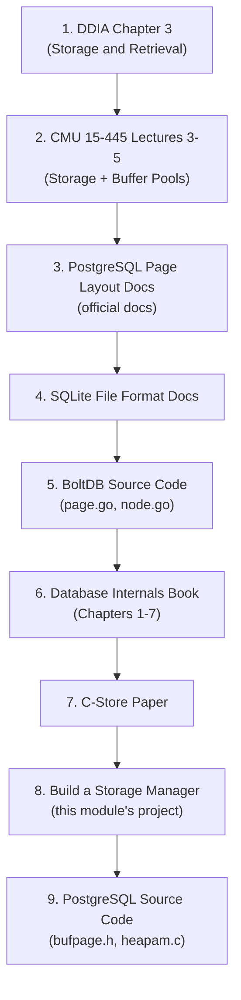

# Module 2: Storage Engines & Disk I/O -- Resources

## Academic Papers

### Foundational

| Paper | Authors | Year | Key Topic |
|-------|---------|------|-----------|
| [The Design and Implementation of a Log-Structured File System](https://people.eecs.berkeley.edu/~brewer/cs262/LFS.pdf) | Rosenblum & Ousterhout | 1991 | Log-structured storage: sequential writes for performance |
| [The Five-Minute Rule for Trading Memory for Disc Accesses](https://www.hpl.hp.com/techreports/tandem/TR-86.1.pdf) | Jim Gray & Franco Putzolu | 1987 | When to cache a page in RAM vs re-read from disk |
| [The Five-Minute Rule 20 Years Later](https://cacm.acm.org/research/the-five-minute-rule-20-years-later/) | Graefe | 2007 | Updated analysis with SSDs |
| [A Case for Redundant Arrays of Inexpensive Disks (RAID)](https://www.cs.cmu.edu/~garth/RAIDpaper/Patterson88.pdf) | Patterson, Gibson, Katz | 1988 | RAID levels and disk redundancy |

### Column Stores and Modern Storage

| Paper | Authors | Year | Key Topic |
|-------|---------|------|-----------|
| [C-Store: A Column-oriented DBMS](https://cs.brown.edu/courses/cs227/archives/2012/papers/rows/cstore.pdf) | Stonebraker et al. | 2005 | The paper that launched the column-store revolution |
| [Column-Stores vs. Row-Stores: How Different Are They Really?](http://www.cs.umd.edu/~abadi/papers/abadi-sigmod08.pdf) | Abadi, Madden, Hachem | 2008 | Rigorous comparison of row vs column storage |
| [Integrating Compression and Execution in Column-Oriented Database Systems](https://db.csail.mit.edu/projects/cstore/abadi-sigmod2006.pdf) | Abadi, Madden, Ferreira | 2006 | Compression techniques for column stores |
| [The Design and Implementation of Modern Column-Oriented Database Systems](https://stratos.seas.harvard.edu/files/stratos/files/columnstoresfntdbs.pdf) | Abadi et al. | 2013 | Comprehensive survey of column store techniques |
| [MonetDB/X100: Hyper-Pipelining Query Execution](http://cidrdb.org/cidr2005/papers/P19.pdf) | Boncz, Zukowski, Nes | 2005 | Vectorized query execution and cache-conscious storage |

### Page Layout and Record Management

| Paper | Authors | Year | Key Topic |
|-------|---------|------|-----------|
| [Data Page Layouts for Relational Databases on Deep Memory Hierarchies](https://research.cs.wisc.edu/multifacet/papers/vldbj02_pax.pdf) | Ailamaki et al. | 2002 | PAX: Partition Attributes Across pages -- hybrid row/column |
| [Weaving Relations for Cache Performance](https://www.vldb.org/conf/2001/P169.pdf) | Ailamaki et al. | 2001 | Cache-conscious record layout |

### Buffer Management and I/O

| Paper | Authors | Year | Key Topic |
|-------|---------|------|-----------|
| [LRU-K: The LRU-K Page Replacement Algorithm for Database Disk Buffering](https://www.cs.cmu.edu/~christos/courses/721-resources/p297-o_neil.pdf) | O'Neil, O'Neil, Weikum | 1993 | LRU-K buffer replacement policy |
| [The Adaptive Radix Tree: ARTful Indexing for Main-Memory Databases](https://db.in.tum.de/~leis/papers/ART.pdf) | Leis et al. | 2013 | Cache-friendly index structure |
| [Managing Non-Volatile Memory in Database Systems](https://db.in.tum.de/people/sites/vanrenen/papers/HyMem.pdf) | van Renen et al. | 2018 | NVM/persistent memory and storage engines |

---

## Books

| Book | Authors | Why Read It |
|------|---------|-------------|
| [Database Internals](https://www.databass.dev/) | Alex Petrov | Excellent coverage of storage engines, B-trees, and distributed systems. Chapters 1-7 cover storage directly. |
| [Designing Data-Intensive Applications](https://dataintensive.net/) | Martin Kleppmann | Chapter 3 (Storage and Retrieval) is the best introduction to storage engine concepts. |
| [Database System Concepts (7th Ed)](https://www.db-book.com/) | Silberschatz, Korth, Sudarshan | Chapters 12-13 cover physical storage, file organization, and indexing in detail. |
| [Architecture of a Database System](https://dsf.berkeley.edu/papers/fntdb07-architecture.pdf) | Hellerstein, Stonebraker, Hamilton | Free paper/monograph. Section 5 covers storage management. |
| [Transaction Processing: Concepts and Techniques](https://www.amazon.com/Transaction-Processing-Concepts-Techniques-Management/dp/1558601902) | Jim Gray & Andreas Reuter | The definitive work on transaction processing, including I/O and storage. |
| [Physical Database Design](https://www.amazon.com/Physical-Database-Design-developers-techniques/dp/0123693896) | Lightstone, Teorey, Nadeau | Focused entirely on physical storage design decisions. |

---

## Blog Posts and Articles

### PostgreSQL Storage Internals

| Resource | Description |
|----------|-------------|
| [PostgreSQL Page Layout](https://www.postgresql.org/docs/current/storage-page-layout.html) | Official PostgreSQL docs on page layout. The authoritative reference. |
| [TOAST in PostgreSQL](https://www.postgresql.org/docs/current/storage-toast.html) | Official TOAST documentation. |
| [PostgreSQL Physical Storage](https://www.postgresql.org/docs/current/storage.html) | How PostgreSQL organizes files on disk. |
| [The Internals of PostgreSQL - Buffer Manager](https://www.interdb.jp/pg/pgsql08.html) | Hironobu Suzuki's excellent deep dive into the buffer manager. |
| [The Internals of PostgreSQL - Heap Tuples](https://www.interdb.jp/pg/pgsql05.html) | How heap tuples are structured and managed. |
| [Understanding PostgreSQL Page Structure](https://blog.jcole.us/2013/01/07/the-physical-structure-of-innodb-index-pages/) | Blog post explaining page internals with diagrams. |

### SQLite Internals

| Resource | Description |
|----------|-------------|
| [SQLite File Format](https://www.sqlite.org/fileformat.html) | Official SQLite file format documentation. Extremely detailed. |
| [Architecture of SQLite](https://www.sqlite.org/arch.html) | How SQLite's components fit together. |
| [How SQLite Is Tested](https://www.sqlite.org/testing.html) | 100% branch coverage -- how a storage engine should be tested. |

### General Storage Engine Concepts

| Resource | Description |
|----------|-------------|
| [Latency Numbers Every Programmer Should Know](https://colin-scott.github.io/personal_website/research/interactive_latency.html) | Interactive visualization of storage latency. Updated over time. |
| [What Every Programmer Should Know About Memory](https://people.freebsd.org/~lstewart/articles/cpumemory.pdf) | Ulrich Drepper's seminal paper on memory hierarchy. |
| [Coding for SSDs](https://codecapsule.com/2014/02/12/coding-for-ssds-part-1-introduction-and-table-of-contents/) | Multi-part series on SSD internals and how to write SSD-friendly code. |
| [Files Are Hard](https://danluu.com/file-consistency/) | Dan Luu on the challenges of file I/O, fsync, and data consistency. |
| [fsync Gate](https://wiki.postgresql.org/wiki/Fsync_Errors) | PostgreSQL wiki on the 2018 fsync error handling bug. |
| [Direct I/O in PostgreSQL](https://anarazel.de/talks/2020-01-31-direct-io-pgconf-eu/direct-io.pdf) | Andres Freund's talk on bringing O_DIRECT to PostgreSQL. |
| [How Databases Handle 10 Million Devices](https://blog.timescale.com/blog/how-postgresql-connects-disks-to-queries/) | TimescaleDB on PostgreSQL storage path from disk to query. |

### Column Stores in Practice

| Resource | Description |
|----------|-------------|
| [How ClickHouse Works](https://clickhouse.com/docs/en/development/architecture) | ClickHouse architecture: a production column store. |
| [DuckDB Internals](https://duckdb.org/internals/overview.html) | DuckDB's in-process columnar engine design. |
| [Parquet Format Specification](https://parquet.apache.org/documentation/latest/) | The widely-used columnar file format. |
| [The Design of the Apache Arrow](https://arrow.apache.org/docs/format/Columnar.html) | In-memory columnar format used by many analytics engines. |

---

## Video Lectures

### CMU Database Group (Andy Pavlo)

These are from the CMU 15-445/645 course, widely considered the best database systems course available online.

| Lecture | Topic | Link |
|---------|-------|------|
| Lecture 03 | Database Storage (Part 1) | [YouTube](https://www.youtube.com/watch?v=df-l2PxUidI) |
| Lecture 04 | Database Storage (Part 2) | [YouTube](https://www.youtube.com/watch?v=2HtfGdsrwqA) |
| Lecture 05 | Buffer Pools | [YouTube](https://www.youtube.com/watch?v=GcDs3all22o) |
| Lecture 06 | Hash Tables | [YouTube](https://www.youtube.com/watch?v=fPleDddPkno) |

> Note: Search for "CMU 15-445 Fall 2023" on YouTube for the latest version of these lectures.

### Other Recommended Videos

| Video | Speaker | Topic |
|-------|---------|-------|
| [How Does a Database Store Data on Disk?](https://www.youtube.com/watch?v=XzKbSaYlWxw) | Hussein Nasser | Accessible introduction to pages and disk storage |
| [PostgreSQL Page Layout](https://www.youtube.com/watch?v=M6VCmR3c9XQ) | Hussein Nasser | Visual walkthrough of PG page internals |
| [Column vs Row Databases](https://www.youtube.com/watch?v=Vw1fCeD06YI) | Hussein Nasser | When to use each storage model |
| [SSD Architecture](https://www.youtube.com/watch?v=5Mh3o886qpg) | Branch Education | Visual explanation of how SSDs work |

---

## Source Code to Study

Reading production source code is one of the best ways to learn storage engine internals.

### PostgreSQL

| File | What to Look For |
|------|-----------------|
| `src/include/storage/bufpage.h` | `PageHeaderData` struct, `ItemIdData`, page macros |
| `src/backend/storage/page/bufpage.c` | `PageInit`, `PageAddItemExtended`, `PageRepairFragmentation` |
| `src/backend/access/heap/heapam.c` | `heap_insert`, `heap_delete`, `heap_update` |
| `src/backend/access/heap/hio.c` | `RelationGetBufferForTuple` (finding space for insertion) |
| `src/backend/storage/freespace/freespace.c` | Free Space Map implementation |
| `src/backend/access/heap/visibilitymap.c` | Visibility Map operations |
| `src/backend/storage/buffer/bufmgr.c` | Buffer pool: `ReadBuffer`, `MarkBufferDirty` |

Repository: [https://github.com/postgres/postgres](https://github.com/postgres/postgres)

### SQLite

| File | What to Look For |
|------|-----------------|
| `src/btree.c` | B-tree page management, cell insertion, overflow |
| `src/pager.c` | Page cache, journaling, fsync |
| `src/os_unix.c` | Unix file I/O, locking, fsync implementation |

Repository: [https://github.com/sqlite/sqlite](https://github.com/sqlite/sqlite)

### BoltDB (Go)

| File | What to Look For |
|------|-----------------|
| `page.go` | Simple, clean page implementation (~200 lines) |
| `node.go` | B+ tree node management |
| `db.go` | Memory-mapped I/O, file management |

Repository: [https://github.com/boltdb/bolt](https://github.com/boltdb/bolt)

> BoltDB is highly recommended for study because its codebase is small (~5000 lines of Go)
> and extremely well-written. It's the best "textbook in code" for understanding storage.

### DuckDB (C++)

| File | What to Look For |
|------|-----------------|
| `src/storage/` | Modern columnar storage implementation |
| `src/common/types/` | Column type system and serialization |
| `src/storage/buffer/` | Buffer manager for columnar data |

Repository: [https://github.com/duckdb/duckdb](https://github.com/duckdb/duckdb)

---

## Hands-On Projects and Tutorials

| Resource | Description |
|----------|-------------|
| [CMU 15-445 Project 1: Buffer Pool Manager](https://15445.courses.cs.cmu.edu/fall2023/project1/) | Build a buffer pool manager in C++. The canonical storage engine project. |
| [Build Your Own Database From Scratch](https://build-your-own.org/database/) | Step-by-step guide to building a database in Go. Covers pages, B-trees, and transactions. |
| [Let's Build a Simple Database](https://cstack.github.io/db_tutorial/) | Build an SQLite clone in C. Covers page management and B-tree pages. |
| [Minidb](https://github.com/utkarsh-extc/minidb) | A minimal database in C for learning purposes. |
| [ToyDB](https://github.com/erikgrinaker/toydb) | A distributed database in Rust. Good reference for storage engine design. |
| [RustDB](https://github.com/nicholasgasior/gostub) | Small embedded database in Rust with page-based storage. |

---

## Tools for Exploration

| Tool | Purpose |
|------|---------|
| `pg_filedump` | Dump PostgreSQL page contents in human-readable format |
| `pageinspect` (PG extension) | SQL-level access to page internals: `SELECT * FROM page_header(get_raw_page('users', 0))` |
| `sqlite3 .dbinfo` | Show SQLite database file information |
| `hexdump -C` | View raw bytes of database files |
| `perf` / `strace` | Trace system calls (pread, pwrite, fsync) to understand I/O patterns |
| `blktrace` / `iowatcher` | Visualize block-level I/O patterns on Linux |
| `fio` | Benchmark disk I/O (IOPS, throughput, latency) |

### Quick Example: Inspecting a PostgreSQL Page

```sql
-- Install the pageinspect extension
CREATE EXTENSION pageinspect;

-- View the header of the first page of a table
SELECT * FROM page_header(get_raw_page('users', 0));

-- View line pointers (slot array)
SELECT * FROM heap_page_item_attrs(get_raw_page('users', 0), 'users'::regclass);

-- View tuple headers
SELECT lp, lp_off, lp_len, t_xmin, t_xmax, t_ctid
FROM heap_page_items(get_raw_page('users', 0));
```

---

## Recommended Reading Order

For someone new to storage engine internals, this is a suggested progression:



1. Start with DDIA Chapter 3 for the conceptual foundation.
2. Watch the CMU lectures for visual explanations.
3. Read the PostgreSQL and SQLite documentation for real-world details.
4. Study BoltDB source code (small, clean, readable).
5. Read the Database Internals book for comprehensive coverage.
6. Read the C-Store paper for column store understanding.
7. Build the storage manager project from this module.
8. Finally, dive into PostgreSQL source code to see production complexity.
