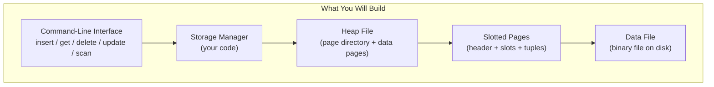
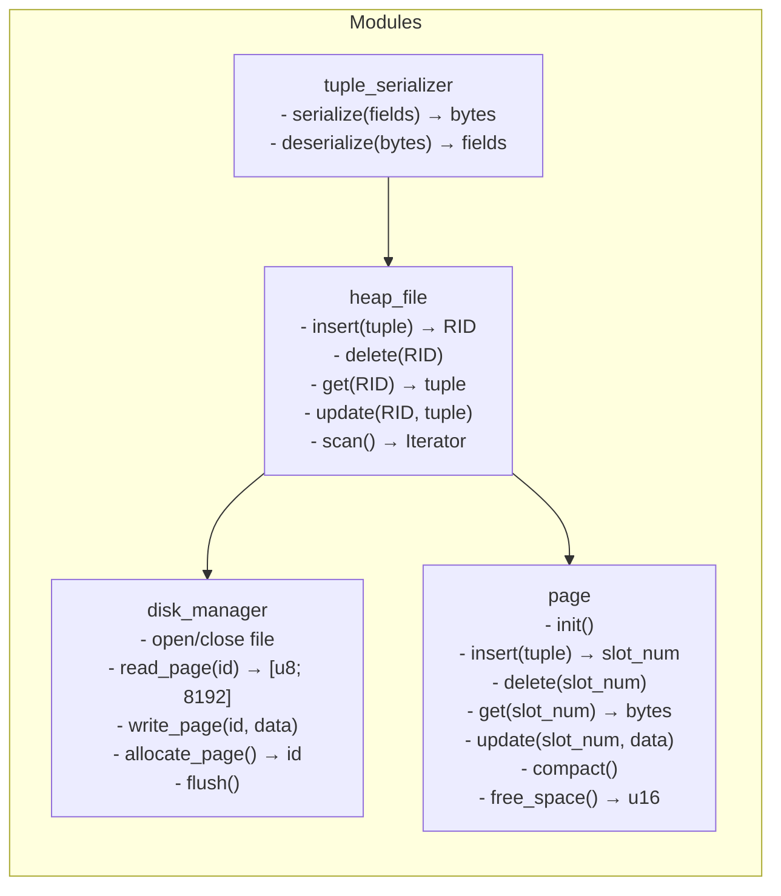
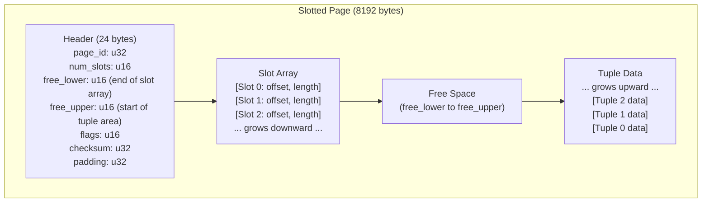
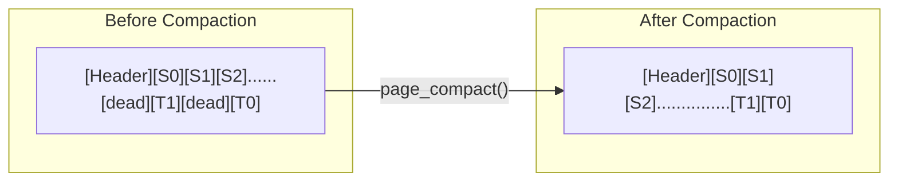
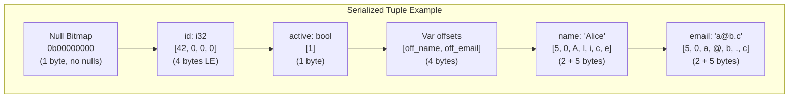
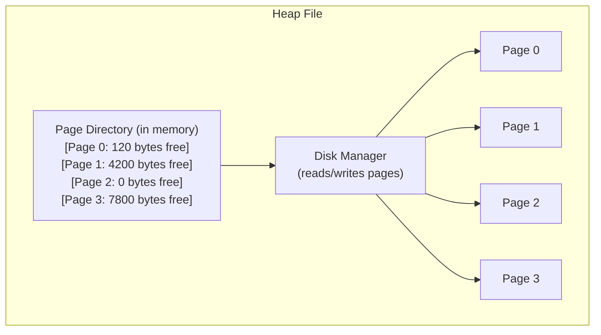
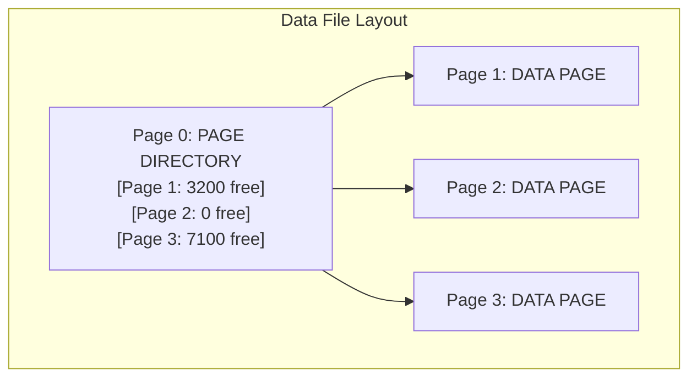
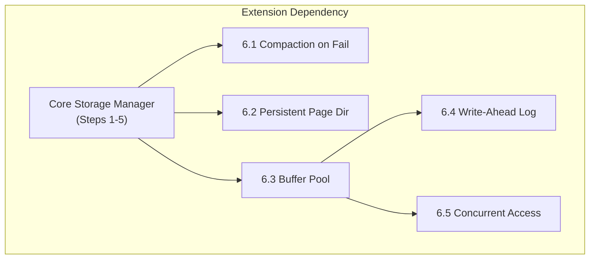

# Module 2: Project -- Build a Page-Based Storage Manager

## Overview

In this project you will build a complete page-based storage manager from scratch. By the
end, you will have a working system that can:

- Create and manage a file of fixed-size pages (8 KB each)
- Use the slotted page format with variable-length records
- Insert, read, update, and delete tuples
- Manage free space using a page directory
- Compact pages to reclaim space from deleted tuples

This is the foundational layer that every database engine sits on.



---

## Architecture



---

## Step 1: Disk Manager

The disk manager is the lowest layer. It handles raw file I/O at the page granularity.

### Specification

```
PAGE_SIZE = 8192 bytes

DiskManager:
    file: File handle
    num_pages: u32

    open(path: str) → DiskManager
        Open or create the data file.
        Calculate num_pages = file_size / PAGE_SIZE.

    read_page(page_id: u32) → [u8; PAGE_SIZE]
        Seek to page_id * PAGE_SIZE.
        Read PAGE_SIZE bytes.
        Return the buffer.

    write_page(page_id: u32, data: &[u8; PAGE_SIZE])
        Seek to page_id * PAGE_SIZE.
        Write PAGE_SIZE bytes.

    allocate_page() → u32
        Extend the file by PAGE_SIZE bytes (write zeros).
        Increment num_pages.
        Return the new page_id.

    flush()
        Call fsync on the file descriptor.
```

### Skeleton (Rust)

```rust
use std::fs::{File, OpenOptions};
use std::io::{Read, Write, Seek, SeekFrom};

pub const PAGE_SIZE: usize = 8192;

pub struct DiskManager {
    file: File,
    num_pages: u32,
}

impl DiskManager {
    pub fn open(path: &str) -> std::io::Result<Self> {
        let file = OpenOptions::new()
            .read(true)
            .write(true)
            .create(true)
            .open(path)?;

        let metadata = file.metadata()?;
        let num_pages = (metadata.len() / PAGE_SIZE as u64) as u32;

        Ok(DiskManager { file, num_pages })
    }

    pub fn read_page(&mut self, page_id: u32) -> std::io::Result<[u8; PAGE_SIZE]> {
        let mut buf = [0u8; PAGE_SIZE];
        let offset = page_id as u64 * PAGE_SIZE as u64;
        self.file.seek(SeekFrom::Start(offset))?;
        self.file.read_exact(&mut buf)?;
        Ok(buf)
    }

    pub fn write_page(&mut self, page_id: u32, data: &[u8; PAGE_SIZE]) -> std::io::Result<()> {
        let offset = page_id as u64 * PAGE_SIZE as u64;
        self.file.seek(SeekFrom::Start(offset))?;
        self.file.write_all(data)?;
        Ok(())
    }

    pub fn allocate_page(&mut self) -> std::io::Result<u32> {
        let page_id = self.num_pages;
        let zeros = [0u8; PAGE_SIZE];
        self.write_page(page_id, &zeros)?;
        self.num_pages += 1;
        Ok(page_id)
    }

    pub fn flush(&mut self) -> std::io::Result<()> {
        self.file.sync_all()
    }
}
```

### Test

```rust
#[test]
fn test_disk_manager() {
    let path = "/tmp/test_dm.db";
    let mut dm = DiskManager::open(path).unwrap();

    // Allocate and write
    let pid = dm.allocate_page().unwrap();
    let mut data = [0u8; PAGE_SIZE];
    data[0] = 0xDE;
    data[1] = 0xAD;
    dm.write_page(pid, &data).unwrap();
    dm.flush().unwrap();

    // Read back
    let buf = dm.read_page(pid).unwrap();
    assert_eq!(buf[0], 0xDE);
    assert_eq!(buf[1], 0xAD);

    std::fs::remove_file(path).unwrap();
}
```

---

## Step 2: Slotted Page

The page module manages the internal layout of a single 8 KB page.

### Page Layout



### Specification

```
HEADER_SIZE = 24
SLOT_SIZE = 4  (2 bytes offset + 2 bytes length)

Page:
    data: [u8; PAGE_SIZE]

    init(page_id: u32)
        Set header fields.
        free_lower = HEADER_SIZE
        free_upper = PAGE_SIZE

    insert(tuple: &[u8]) → Option<u16>
        Need: tuple.len() + SLOT_SIZE bytes of free space.
        1. Check for reusable deleted slots (length == 0).
        2. Write tuple at free_upper - tuple.len().
        3. Update or add slot entry.
        4. Return slot number.

    get(slot_num: u16) → Option<&[u8]>
        Look up slot entry.
        If length == 0, return None (deleted).
        Return slice at [offset..offset+length].

    delete(slot_num: u16) → bool
        Set slot entry length to 0, offset to 0.
        DO NOT move other tuples yet.

    update(slot_num: u16, new_data: &[u8]) → bool
        If new_data fits in old tuple's space, overwrite in place.
        Otherwise, delete old and insert new (may fail if page full).

    compact()
        Move all live tuples to be contiguous at the end of the page.
        Update slot offsets.
        Update free_upper.

    free_space() → u16
        Return free_upper - free_lower.
```

### Key Implementation Details

**Slot Reuse:** When inserting, first scan for a deleted slot (length == 0). If found, reuse
it (no need to extend the slot array). This prevents the slot array from growing unboundedly
when there are many inserts and deletes.

**In-Place Update:** If the new tuple is exactly the same size or smaller, write it directly
at the old offset. This avoids fragmentation and is a common optimization in real databases
(PostgreSQL's HOT updates use a similar idea).

**Compaction Algorithm:**



1. Create a temporary buffer.
2. Walk through all live slots, copy their tuples into the temp buffer packed tightly.
3. Write the packed tuples back to the page.
4. Update each slot's offset to its new position.
5. Update free_upper to reflect the new contiguous free area.

---

## Step 3: Tuple Serializer

Handles converting structured data (fields) to and from raw bytes.

### Schema Definition

```rust
#[derive(Debug, Clone)]
pub enum FieldType {
    Int,        // 4 bytes
    Float,      // 8 bytes
    Bool,       // 1 byte
    Varchar,    // variable length: 2-byte length prefix + data
}

#[derive(Debug, Clone)]
pub enum FieldValue {
    Int(i32),
    Float(f64),
    Bool(bool),
    Varchar(String),
    Null,
}

pub struct Schema {
    pub columns: Vec<(String, FieldType, bool)>,  // (name, type, nullable)
}
```

### Serialization Format

```
+------------------+--------------------+------------------+------------------+
| Null Bitmap      | Fixed Fields       | Var-Length Offset | Var-Length Data   |
| (ceil(N/8) bytes)| (in schema order)  | Array (2B each)  | (sequential)     |
+------------------+--------------------+------------------+------------------+
```



### Skeleton

```rust
impl Schema {
    pub fn serialize(&self, values: &[FieldValue]) -> Vec<u8> {
        assert_eq!(values.len(), self.columns.len());
        let mut buf = Vec::new();

        // 1. Null bitmap
        let bitmap_size = (self.columns.len() + 7) / 8;
        let mut bitmap = vec![0u8; bitmap_size];
        for (i, val) in values.iter().enumerate() {
            if matches!(val, FieldValue::Null) {
                bitmap[i / 8] |= 1 << (i % 8);
            }
        }
        buf.extend_from_slice(&bitmap);

        // 2. Fixed-length fields
        for (i, (_, ftype, _)) in self.columns.iter().enumerate() {
            match (&values[i], ftype) {
                (FieldValue::Int(v), FieldType::Int) => {
                    buf.extend_from_slice(&v.to_le_bytes());
                }
                (FieldValue::Float(v), FieldType::Float) => {
                    buf.extend_from_slice(&v.to_le_bytes());
                }
                (FieldValue::Bool(v), FieldType::Bool) => {
                    buf.push(if *v { 1 } else { 0 });
                }
                (FieldValue::Null, _) => {
                    // Write placeholder zeros for fixed fields
                    let size = match ftype {
                        FieldType::Int => 4,
                        FieldType::Float => 8,
                        FieldType::Bool => 1,
                        FieldType::Varchar => 0, // handled below
                    };
                    buf.extend(std::iter::repeat(0).take(size));
                }
                _ => {} // Varchar handled separately
            }
        }

        // 3. Variable-length fields (length-prefixed)
        for (i, (_, ftype, _)) in self.columns.iter().enumerate() {
            if matches!(ftype, FieldType::Varchar) {
                match &values[i] {
                    FieldValue::Varchar(s) => {
                        let len = s.len() as u16;
                        buf.extend_from_slice(&len.to_le_bytes());
                        buf.extend_from_slice(s.as_bytes());
                    }
                    _ => {
                        buf.extend_from_slice(&0u16.to_le_bytes()); // null or empty
                    }
                }
            }
        }

        buf
    }

    pub fn deserialize(&self, data: &[u8]) -> Vec<FieldValue> {
        let mut values = Vec::new();
        let bitmap_size = (self.columns.len() + 7) / 8;
        let bitmap = &data[..bitmap_size];
        let mut pos = bitmap_size;

        // Fixed fields
        for (i, (_, ftype, _)) in self.columns.iter().enumerate() {
            let is_null = (bitmap[i / 8] >> (i % 8)) & 1 == 1;
            match ftype {
                FieldType::Int => {
                    if is_null {
                        values.push(FieldValue::Null);
                    } else {
                        let v = i32::from_le_bytes(data[pos..pos+4].try_into().unwrap());
                        values.push(FieldValue::Int(v));
                    }
                    pos += 4;
                }
                FieldType::Float => {
                    if is_null {
                        values.push(FieldValue::Null);
                    } else {
                        let v = f64::from_le_bytes(data[pos..pos+8].try_into().unwrap());
                        values.push(FieldValue::Float(v));
                    }
                    pos += 8;
                }
                FieldType::Bool => {
                    if is_null {
                        values.push(FieldValue::Null);
                    } else {
                        values.push(FieldValue::Bool(data[pos] != 0));
                    }
                    pos += 1;
                }
                FieldType::Varchar => {} // handled below
            }
        }

        // Variable fields
        for (i, (_, ftype, _)) in self.columns.iter().enumerate() {
            if matches!(ftype, FieldType::Varchar) {
                let is_null = (bitmap[i / 8] >> (i % 8)) & 1 == 1;
                let len = u16::from_le_bytes(data[pos..pos+2].try_into().unwrap()) as usize;
                pos += 2;
                if is_null || len == 0 {
                    values.push(FieldValue::Null);
                } else {
                    let s = String::from_utf8_lossy(&data[pos..pos+len]).to_string();
                    values.push(FieldValue::Varchar(s));
                    pos += len;
                }
            }
        }

        values
    }
}
```

---

## Step 4: Heap File Manager

The heap file ties everything together: it manages multiple pages and provides a tuple-level
API using Record IDs (RIDs).

### Page Directory

The heap file maintains an in-memory page directory that tracks free space per page:



### Skeleton

```rust
pub struct RecordId {
    pub page_id: u32,
    pub slot_num: u16,
}

struct PageDirEntry {
    page_id: u32,
    free_space: u16,
}

pub struct HeapFile {
    disk_manager: DiskManager,
    page_dir: Vec<PageDirEntry>,
}

impl HeapFile {
    pub fn open(path: &str) -> std::io::Result<Self> {
        let mut dm = DiskManager::open(path)?;
        let mut page_dir = Vec::new();

        // Build page directory by reading each page header
        for i in 0..dm.num_pages {
            let data = dm.read_page(i)?;
            let page = Page::from_bytes(data);
            page_dir.push(PageDirEntry {
                page_id: i,
                free_space: page.free_space(),
            });
        }

        Ok(HeapFile { disk_manager: dm, page_dir })
    }

    pub fn insert(&mut self, tuple: &[u8]) -> std::io::Result<RecordId> {
        let needed = tuple.len() as u16 + 4; // tuple + slot entry

        // Find a page with enough space
        let target = self.page_dir.iter()
            .position(|e| e.free_space >= needed);

        let page_id = match target {
            Some(idx) => self.page_dir[idx].page_id,
            None => {
                // Allocate new page
                let pid = self.disk_manager.allocate_page()?;
                let mut page = Page::new(pid);
                let data = *page.as_bytes();
                self.disk_manager.write_page(pid, &data)?;
                self.page_dir.push(PageDirEntry {
                    page_id: pid,
                    free_space: page.free_space(),
                });
                pid
            }
        };

        // Read page, insert tuple, write back
        let data = self.disk_manager.read_page(page_id)?;
        let mut page = Page::from_bytes(data);
        let slot_num = page.insert(tuple)
            .expect("page should have space");
        self.disk_manager.write_page(page_id, page.as_bytes())?;

        // Update directory
        let entry = self.page_dir.iter_mut()
            .find(|e| e.page_id == page_id).unwrap();
        entry.free_space = page.free_space();

        Ok(RecordId { page_id, slot_num })
    }

    pub fn get(&mut self, rid: &RecordId) -> std::io::Result<Option<Vec<u8>>> {
        let data = self.disk_manager.read_page(rid.page_id)?;
        let page = Page::from_bytes(data);
        Ok(page.get(rid.slot_num).map(|s| s.to_vec()))
    }

    pub fn delete(&mut self, rid: &RecordId) -> std::io::Result<bool> {
        let data = self.disk_manager.read_page(rid.page_id)?;
        let mut page = Page::from_bytes(data);
        let ok = page.delete(rid.slot_num);
        if ok {
            self.disk_manager.write_page(rid.page_id, page.as_bytes())?;
            let entry = self.page_dir.iter_mut()
                .find(|e| e.page_id == rid.page_id).unwrap();
            entry.free_space = page.free_space();
        }
        Ok(ok)
    }

    pub fn update(&mut self, rid: &RecordId, new_tuple: &[u8])
        -> std::io::Result<RecordId>
    {
        let data = self.disk_manager.read_page(rid.page_id)?;
        let mut page = Page::from_bytes(data);

        // Try in-place update
        if let Some(old) = page.get(rid.slot_num) {
            if new_tuple.len() <= old.len() {
                // Fits in place -- overwrite
                // (you would implement page.update_in_place here)
                page.delete(rid.slot_num);
                let slot = page.insert(new_tuple).unwrap();
                self.disk_manager.write_page(rid.page_id, page.as_bytes())?;
                return Ok(RecordId { page_id: rid.page_id, slot_num: slot });
            }
        }

        // Does not fit -- delete and re-insert (possibly on different page)
        page.delete(rid.slot_num);
        self.disk_manager.write_page(rid.page_id, page.as_bytes())?;

        let entry = self.page_dir.iter_mut()
            .find(|e| e.page_id == rid.page_id).unwrap();
        entry.free_space = page.free_space();

        self.insert(new_tuple)
    }

    pub fn scan(&mut self) -> std::io::Result<Vec<(RecordId, Vec<u8>)>> {
        let mut results = Vec::new();
        for entry in &self.page_dir {
            let data = self.disk_manager.read_page(entry.page_id)?;
            let page = Page::from_bytes(data);
            let num_slots = page.num_slots();
            for slot in 0..num_slots {
                if let Some(tuple) = page.get(slot) {
                    results.push((
                        RecordId { page_id: entry.page_id, slot_num: slot },
                        tuple.to_vec(),
                    ));
                }
            }
        }
        Ok(results)
    }

    pub fn flush(&mut self) -> std::io::Result<()> {
        self.disk_manager.flush()
    }
}
```

---

## Step 5: Integration Test

Write a comprehensive test that exercises the full stack:

```rust
#[test]
fn test_full_storage_manager() {
    let path = "/tmp/test_heap.db";
    let _ = std::fs::remove_file(path); // clean slate

    let mut hf = HeapFile::open(path).unwrap();

    // Define schema: (id: INT, name: VARCHAR, active: BOOL)
    let schema = Schema {
        columns: vec![
            ("id".into(), FieldType::Int, false),
            ("name".into(), FieldType::Varchar, false),
            ("active".into(), FieldType::Bool, false),
        ],
    };

    // Insert 100 records
    let mut rids = Vec::new();
    for i in 0..100 {
        let tuple = schema.serialize(&[
            FieldValue::Int(i),
            FieldValue::Varchar(format!("User_{}", i)),
            FieldValue::Bool(i % 2 == 0),
        ]);
        let rid = hf.insert(&tuple).unwrap();
        rids.push(rid);
    }

    // Verify reads
    for (i, rid) in rids.iter().enumerate() {
        let data = hf.get(rid).unwrap().unwrap();
        let fields = schema.deserialize(&data);
        assert!(matches!(&fields[0], FieldValue::Int(v) if *v == i as i32));
    }

    // Delete every other record
    for i in (0..100).step_by(2) {
        assert!(hf.delete(&rids[i]).unwrap());
    }

    // Verify deletions
    for i in (0..100).step_by(2) {
        assert!(hf.get(&rids[i]).unwrap().is_none());
    }

    // Scan should return 50 records
    let all = hf.scan().unwrap();
    assert_eq!(all.len(), 50);

    // Update a record
    let new_tuple = schema.serialize(&[
        FieldValue::Int(999),
        FieldValue::Varchar("Updated_User".into()),
        FieldValue::Bool(true),
    ]);
    let new_rid = hf.update(&rids[1], &new_tuple).unwrap();
    let data = hf.get(&new_rid).unwrap().unwrap();
    let fields = schema.deserialize(&data);
    assert!(matches!(&fields[0], FieldValue::Int(999)));

    hf.flush().unwrap();
    std::fs::remove_file(path).unwrap();
}
```

---

## Step 6: Extensions (Bonus Challenges)

Once you have the core working, try these extensions:

### 6.1 Page Compaction on Insert Failure

Before allocating a new page when insert fails, try compacting the current page first.
This reclaims space from deleted tuples and may make room.

### 6.2 Persistent Page Directory

Currently the page directory is rebuilt by scanning all pages at startup. Instead, store
the page directory as a special page (page 0) in the file itself.



### 6.3 Buffer Pool

Add a buffer pool layer between the heap file and disk manager:
- Keep N pages cached in memory.
- Use an LRU or clock-sweep eviction policy.
- Track dirty pages and flush them on eviction.

### 6.4 WAL (Write-Ahead Log)

Add a simple WAL that logs every insert/delete/update before modifying data pages.
On crash recovery, replay the WAL to restore consistency.

### 6.5 Concurrent Access

Add latch-based (mutex) page-level locking to allow safe concurrent reads and writes.
This is a preview of Module 5 (Concurrency Control).



---

## Evaluation Criteria

| Criterion | Points | Description |
|-----------|--------|-------------|
| Disk Manager | 15 | Correct page read/write/allocate with fsync |
| Slotted Page | 25 | Insert, delete, get with slot array; correct free space tracking |
| Tuple Serializer | 15 | Fixed + variable length fields; null handling |
| Heap File | 25 | Page directory; insert finds correct page; RIDs are stable |
| Update + Compact | 10 | In-place update; compaction reclaims space correctly |
| Tests | 10 | Comprehensive tests covering edge cases |
| **Total** | **100** | |

---

## Tips

1. **Start with the disk manager and page.** Get page insert/get/delete working before
   building the heap file.
2. **Use hex dumps** for debugging. Print pages as hex to verify byte-level layout.
3. **Test with both small and large tuples.** Make sure a tuple that fills most of a page
   works correctly.
4. **Test page boundaries.** What happens when a page is exactly full? When the 79th tuple
   doesn't fit but the 78th did?
5. **Track free space carefully.** Off-by-one errors in free_lower/free_upper are the most
   common bugs.
