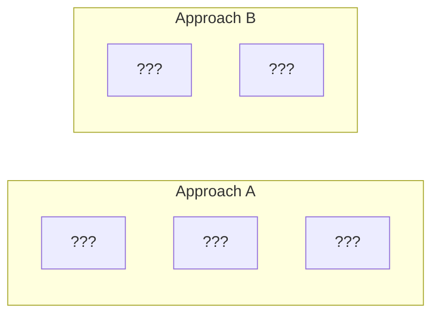

# Module 2: Storage Engines & Disk I/O -- Quiz Questions

## Instructions

Answer each question to the best of your ability. Questions range from factual recall to
design reasoning. Answers are provided at the end of the document.

---

## Section 1: Storage Hierarchy and Disk I/O

### Question 1
What is the approximate latency difference between an L1 cache reference (~1 ns) and a
random HDD read (~5 ms)? Express it as a ratio.

---

### Question 2
Why do database query optimizers primarily count **page accesses** (I/Os) rather than
CPU instructions when estimating query cost?

---

### Question 3
A database has 10 million rows, each 200 bytes, stored on 8 KB pages. Approximately how
many pages does the table occupy? How long would a full table scan take on an HDD with
5 ms random read latency, assuming sequential access at ~100 MB/s?

---

### Question 4
Explain why sequential I/O is dramatically faster than random I/O on HDDs. Is the difference
as significant on SSDs? Why or why not?

---

### Question 5
What does the acronym **IOPS** stand for, and why is it a critical metric for database
workloads? What are typical IOPS values for HDDs vs SSDs?

---

## Section 2: Pages and Page Layout

### Question 6
Why do databases read and write data in fixed-size **pages** rather than individual records?
Give at least three reasons.

---

### Question 7
Draw or describe the layout of a **slotted page**. Label the four main regions and explain
which direction each grows.

---

### Question 8
In a slotted page, what is stored in each **slot entry** (line pointer)? Why is this level
of indirection valuable?

---

### Question 9
A page is 8192 bytes. The header is 24 bytes. Each slot entry is 4 bytes. Each tuple is
exactly 100 bytes. What is the maximum number of tuples that can fit on this page?

**Show your work.**

---

### Question 10
What happens when a tuple is **deleted** from a slotted page? Is the space immediately
reclaimed? What process eventually reclaims it?

---

### Question 11
Explain the difference between `pd_lower` and `pd_upper` in the PostgreSQL page header.
What does it mean when `pd_lower == pd_upper`?

---

## Section 3: Record Formats and Record IDs

### Question 12
What is a **Record ID (RID)**? What two components does it typically consist of? Why is it
important that RIDs remain stable?

---

### Question 13
For a table with the schema `CREATE TABLE t (id INT, name VARCHAR(100), bio TEXT)`:
- Which fields are fixed-length?
- Which fields are variable-length?
- How does the tuple serialization handle variable-length fields?

---

### Question 14
What is a **null bitmap** and why is it needed? How many bytes does it take for a table
with 20 columns?

---

### Question 15
Consider a tuple with 3 fields: `INT (4 bytes)`, `VARCHAR "hello" (5 bytes)`, `FLOAT (8 bytes)`.
How might this tuple be serialized, including any offsets or null bitmap? What is the total
size?

---

## Section 4: File Organization

### Question 16
Compare and contrast the three file organization strategies:
- Heap file
- Sorted file
- Hashed file

For each, state the cost (in number of page reads) for:
1. Equality search on the key
2. Range search on the key
3. Insertion of a new record

Assume B pages total.

---

### Question 17
What are the two approaches to managing free space in heap files? What are the trade-offs
of each?



Fill in the blanks and name each approach.

---

### Question 18
PostgreSQL uses a **Free Space Map (FSM)** to track available space on heap pages. What
data structure does the FSM use internally, and how does it efficiently answer the query
"find a page with at least N bytes free"?

---

## Section 5: Storage Models and Compression

### Question 19
Explain the difference between **row-oriented (NSM)** and **column-oriented (DSM)** storage.
For each of the following queries, which storage model is better and why?

1. `SELECT * FROM orders WHERE order_id = 12345`
2. `SELECT AVG(price) FROM orders WHERE year = 2024`
3. `INSERT INTO orders VALUES (12346, 'Widget', 29.99, 2024)`

---

### Question 20
For the following column of data, apply **dictionary encoding** and then **run-length encoding**.
Show the intermediate and final results.

```
['red', 'red', 'red', 'blue', 'blue', 'green', 'green', 'green', 'green', 'red']
```

---

### Question 21
What is **delta encoding** and when is it most effective? Give an example with timestamps.

---

### Question 22
A column contains values in the range [0, 15]. Normal INT storage uses 4 bytes (32 bits)
per value. With **bit-packing**, how many bits per value are needed? What is the compression
ratio? How many values can be packed into a single 8-byte word?

---

## Section 6: PostgreSQL Internals

### Question 23
Describe the PostgreSQL storage hierarchy from tablespace down to tuple. How does each
level map to the filesystem?

---

### Question 24
What is **TOAST** in PostgreSQL? When does it activate? What are the four TOAST strategies
(PLAIN, EXTENDED, EXTERNAL, MAIN)?

---

### Question 25
What is the **visibility map** in PostgreSQL? Name two operations that benefit from it
and explain how.

---

### Question 26
Explain the **double-buffering problem** when using buffered I/O. How does O_DIRECT solve
it? Why doesn't PostgreSQL use O_DIRECT by default?

---

### Question 27
What does `fsync()` do? What happened in the 2018 PostgreSQL fsync bug, and what was the fix?

---

---

## Answers

### Answer 1
The ratio is approximately **5,000,000:1** (5 ms / 1 ns = 5 x 10^6). If an L1 cache
reference took 1 second, a random HDD read would take about **58 days**.

### Answer 2
Because disk I/O dominates query execution time. A single random page read takes
milliseconds (HDD) or tens of microseconds (SSD), while CPU operations take nanoseconds.
The number of page accesses is the best predictor of actual query latency.

### Answer 3
- Total data: 10M rows x 200 bytes = 2 GB
- Pages: 2 GB / 8 KB = ~256,000 pages
- Sequential scan at 100 MB/s: 2 GB / 100 MB/s = **~20 seconds**
- If random reads instead: 256,000 x 5 ms = **~21 minutes** (showing why sequential matters)

### Answer 4
HDDs have a mechanical read head that must physically seek to the right track and wait for
the platter to rotate to the right sector. Sequential reads avoid seeks (data is on adjacent
sectors). On SSDs, there are no moving parts, so random reads are much faster (~16 us vs
HDD's ~5 ms). However, sequential is still ~4x faster on SSDs due to internal parallelism,
read-ahead buffers, and reduced command overhead.

### Answer 5
IOPS = Input/Output Operations Per Second. It measures how many individual read or write
operations a storage device can handle per second. Typical values:
- HDD: 100-200 IOPS (limited by seek time)
- SSD (SATA): 10,000-100,000 IOPS
- SSD (NVMe): 100,000-1,000,000+ IOPS

### Answer 6
1. **Amortize I/O cost**: Reading 1 byte costs nearly the same as reading 4-16 KB from disk.
2. **Alignment with OS/hardware**: OS memory pages, filesystem blocks, and disk sectors all
   use fixed-size blocks.
3. **Simplified buffer management**: Fixed-size pages make the buffer pool straightforward --
   any frame can hold any page, no fragmentation.

### Answer 7
From top to bottom:
1. **Header** (fixed size, top) -- metadata: page ID, LSN, free space pointers, flags
2. **Slot array** (grows downward from header) -- each entry has (offset, length)
3. **Free space** (middle) -- unused area between slot array and tuple data
4. **Tuple data** (grows upward from bottom) -- actual row data

### Answer 8
Each slot entry stores: **offset** (byte position of the tuple in the page) and **length**
(byte size of the tuple). The indirection is valuable because:
- Tuples can be moved within the page (during compaction) without changing their slot number.
- External references (indexes, RIDs) use slot numbers, which remain stable.

### Answer 9
Available space = 8192 - 24 = 8168 bytes.
Each tuple needs: 100 bytes (data) + 4 bytes (slot entry) = 104 bytes.
Max tuples = floor(8168 / 104) = **78 tuples**.
Verification: 78 x 4 = 312 bytes for slots, 78 x 100 = 7800 bytes for data.
Total = 312 + 7800 = 8112. Remaining free = 8168 - 8112 = 56 bytes (not enough for another tuple).

### Answer 10
The tuple is NOT immediately removed. The slot entry is marked as "dead" (length set to 0
or a dead flag). The tuple data remains in place as a "hole." The space is reclaimed during
**compaction** (called `PageRepairFragmentation` in PostgreSQL or during VACUUM), which
slides all live tuples together and updates slot offsets.

### Answer 11
- `pd_lower` = offset to the end of the slot array (start of free space)
- `pd_upper` = offset to the beginning of the tuple data area (end of free space)
- Free space = pd_upper - pd_lower
- When `pd_lower == pd_upper`, the page is **full** -- no free space remains.

### Answer 12
A RID = **(Page ID, Slot Number)**. The Page ID identifies which page on disk; the slot
number indexes into the page's slot array. Stability matters because indexes store RIDs
to point to heap tuples. If a RID changed every time a tuple moved, all indexes would
need updating.

### Answer 13
- Fixed-length: `id` (INT, 4 bytes)
- Variable-length: `name` (VARCHAR), `bio` (TEXT)
- Variable-length handling: The tuple begins with a null bitmap, followed by an offset array
  (one offset per variable-length field), then fixed fields, then variable-length data
  appended sequentially. Each offset tells where the corresponding variable field's data
  starts within the tuple.

### Answer 14
A null bitmap uses 1 bit per column to indicate whether the value is NULL. For 20 columns:
ceil(20/8) = **3 bytes**. It is needed to distinguish "no value" from "zero" or "empty string."

### Answer 15
```
[null_bitmap: 0x00 (1 byte)] [offset for VARCHAR: 13 (2 bytes)]
[INT: 4 bytes] [FLOAT: 8 bytes] [VARCHAR "hello": 5 bytes]
Total: 1 + 2 + 4 + 8 + 5 = 20 bytes
```
(Exact layout depends on the implementation; the key is that variable-length fields need
offset metadata.)

### Answer 16

| Operation | Heap | Sorted | Hashed |
|-----------|------|--------|--------|
| Equality search | O(B) | O(log B) | O(1) |
| Range search | O(B) | O(log B + matches) | O(B) |
| Insert | O(1) | O(B) worst case | O(1) amortized |

Heap: append anywhere. Sorted: must maintain order. Hashed: hash destroys order.

### Answer 17
- **Approach A: Linked List** -- Free pages linked together. Simple but requires traversal
  to find a page with enough space.
- **Approach B: Page Directory** -- A separate structure mapping page IDs to free space
  amounts. Fast lookup but requires extra metadata maintenance.

### Answer 18
The FSM uses a **binary tree** (max-heap). Each leaf node stores a 1-byte free-space
category for one heap page. Internal nodes store the max of their children. To find a page
with N bytes free, traverse from root, going to whichever child has max >= N. This runs in
O(log pages) time.

### Answer 19
1. **Row store (NSM)** -- Equality search by primary key reads one page containing the full row.
   Column store would need to read from every column file.
2. **Column store (DSM)** -- Only needs to read the `price` and `year` columns, skipping all
   others. Massive I/O savings on wide tables.
3. **Row store (NSM)** -- A single INSERT writes one row to one page. Column store must append
   to every column file separately.

### Answer 20
**Dictionary encoding:**
```
Dictionary: {0: 'red', 1: 'blue', 2: 'green'}
Encoded: [0, 0, 0, 1, 1, 2, 2, 2, 2, 0]
```

**Run-length encoding (applied after dictionary):**
```
[(0, 3), (1, 2), (2, 4), (0, 1)]
```

Original: 10 strings averaging ~4 chars = ~40 bytes.
Final: 4 pairs x ~3 bytes each = ~12 bytes. Plus 3-entry dictionary.

### Answer 21
Delta encoding stores the difference between consecutive values rather than the absolute
values. Most effective when consecutive values are close together (small deltas).

Example with timestamps:
```
Original:    [1700000000, 1700000060, 1700000120, 1700000180]
Delta:       [1700000000, 60, 60, 60]
```
The deltas (60) can be stored in 1 byte instead of 4+ bytes, yielding ~4x compression.

### Answer 22
- Range [0, 15] needs ceil(log2(16)) = **4 bits** per value.
- Normal storage: 32 bits. Compression ratio: 32/4 = **8x**.
- A 64-bit word holds: 64/4 = **16 values**.

### Answer 23
```
Tablespace → directory on filesystem (e.g., $PGDATA/base/)
  Database → subdirectory named by OID (e.g., base/16384/)
    Schema → logical grouping, no filesystem representation
      Table → file(s) named by relfilenode (e.g., 16400, 16400.1, 16400_fsm, 16400_vm)
        Page → 8 KB block at offset page_number * 8192
          Tuple → bytes within a page, located via slot array
```

### Answer 24
TOAST = The Oversized-Attribute Storage Technique. It activates when a tuple exceeds ~2 KB
(roughly 1/4 of the 8 KB page size). Strategies:
- **PLAIN**: Never TOAST. Must fit in page.
- **EXTENDED**: Compress first, then store out-of-line if still too big.
- **EXTERNAL**: Store out-of-line without compression.
- **MAIN**: Compress first; out-of-line only as last resort.

### Answer 25
The visibility map has 2 bits per heap page:
- **All-visible**: all tuples visible to all transactions.
- **All-frozen**: all tuples frozen (no MVCC overhead).

Benefits:
1. **Index-only scans**: skip heap page fetch if all-visible (answer from index alone).
2. **VACUUM**: skip all-frozen pages entirely, reducing VACUUM runtime.

### Answer 26
With buffered I/O, data exists in both the database buffer pool (user space) and the OS page
cache (kernel space) -- two copies of the same data. O_DIRECT bypasses the OS page cache,
eliminating the duplicate. PostgreSQL doesn't use O_DIRECT by default because:
- The OS page cache provides useful read-ahead and write-back.
- O_DIRECT has alignment constraints.
- The second copy acts as a fallback cache after buffer pool eviction.

### Answer 27
`fsync(fd)` forces all dirty pages for file descriptor `fd` to be written to persistent
storage. In 2018, it was discovered that on Linux, if `fsync()` fails with EIO, the kernel
marks the pages as clean and **discards** the dirty data. A subsequent `fsync()` succeeds
even though data is lost. PostgreSQL was retrying `fsync()` on failure, assuming dirty pages
persisted. The fix: PostgreSQL now **panics** on fsync failure and relies on WAL replay
during crash recovery.
