# Module 2: Storage Engines & Disk I/O -- Core Teaching

## 1. The Storage Hierarchy

Every database system is ultimately constrained by the physics of data storage. Understanding the
storage hierarchy is the single most important mental model for database internals work.

### Latency Numbers Every Programmer Should Know

| Operation                        | Latency         | Relative (if L1 = 1s) |
|----------------------------------|-----------------|------------------------|
| L1 cache reference               | ~1 ns           | 1 second               |
| L2 cache reference               | ~4 ns           | 4 seconds              |
| Branch mispredict                | ~5 ns           | 5 seconds              |
| Mutex lock/unlock                | ~25 ns          | 25 seconds             |
| Main memory (RAM) reference      | ~100 ns         | 1.5 minutes            |
| SSD random read (4KB)            | ~16 us          | 4.5 hours              |
| HDD random read (4KB)            | ~2-10 ms        | 1-4 months             |
| Sequential read 1MB from SSD     | ~49 us          | 13.5 hours             |
| Sequential read 1MB from HDD     | ~825 us         | 9.5 days               |
| Disk seek (HDD)                  | ~2-10 ms        | 1-4 months             |
| Round trip within data center    | ~500 us         | 5.8 days               |
| Round trip CA to Netherlands     | ~150 ms         | 4.8 years              |

The key takeaway: RAM is roughly **100,000x faster** than a random HDD read. Even SSDs are
roughly **160x slower** than RAM for random access. This is why disk I/O dominates the cost
of nearly every database operation.

```mermaid
graph TD
    subgraph "Storage Hierarchy (Faster to Slower)"
        R["CPU Registers<br/>~0.3 ns | ~bytes"]
        L1["L1 Cache<br/>~1 ns | 64 KB"]
        L2["L2 Cache<br/>~4 ns | 256 KB - 1 MB"]
        L3["L3 Cache<br/>~10 ns | 2 - 64 MB"]
        RAM["Main Memory (RAM)<br/>~100 ns | 4 - 512 GB"]
        SSD["Solid State Drive<br/>~16 us | 256 GB - 8 TB"]
        HDD["Hard Disk Drive<br/>~2-10 ms | 1 - 20 TB"]
        NET["Network Storage<br/>~0.5 - 150 ms | Unlimited"]
    end

    R --> L1 --> L2 --> L3 --> RAM --> SSD --> HDD --> NET

    style R fill:#ff6b6b,color:#fff
    style L1 fill:#ff8e72,color:#fff
    style L2 fill:#ffa94d,color:#fff
    style L3 fill:#ffd43b,color:#333
    style RAM fill:#69db7c,color:#333
    style SSD fill:#4dabf7,color:#fff
    style HDD fill:#748ffc,color:#fff
    style NET fill:#9775fa,color:#fff
```

### Why Disk I/O Is the Bottleneck

Databases store far more data than fits in RAM. Even with modern servers running 256 GB or
512 GB of memory, production databases frequently hold terabytes of data on disk. This means
the database engine must constantly move data between disk and memory.

The fundamental equation of database performance:

```
Total query cost ~ (Number of disk I/Os) x (cost per I/O) + (CPU cost)
```

In practice, **CPU cost is negligible** compared to disk I/O for most queries. A query that
reads 1000 random pages from an HDD spends ~10 seconds on I/O but only microseconds on CPU.
This is why database query optimizers primarily count **page accesses** (I/Os), not CPU cycles.

**Sequential vs Random I/O:**

- Sequential reads on HDD are ~100x faster than random reads (no seek time).
- SSDs narrow this gap to roughly 4x, but sequential is still faster.
- Database engines exploit this by preferring sequential access patterns: pre-fetching,
  clustering related data, and batching writes.

---

## 2. Pages: The Fundamental Unit of Storage

A **page** (also called a **block**) is the smallest unit of data that a database reads from
or writes to disk. Typical page sizes:

| Database     | Default Page Size |
|-------------|-------------------|
| PostgreSQL  | 8 KB              |
| MySQL/InnoDB| 16 KB             |
| SQLite      | 4 KB              |
| SQL Server  | 8 KB              |
| Oracle      | 8 KB              |

### Why Pages?

1. **Amortize I/O cost:** Reading 1 byte from disk costs nearly the same as reading 4 KB.
   The disk head must seek and the platter must rotate regardless of how much you read.
2. **Align with OS/hardware:** The OS manages memory in pages (usually 4 KB). The filesystem
   reads/writes in blocks. The disk controller transfers data in sectors (512 bytes or 4 KB).
   Database pages align with these boundaries for efficiency.
3. **Simplify buffer management:** The buffer pool manages fixed-size slots. Fixed-size pages
   make allocation, eviction, and replacement straightforward.

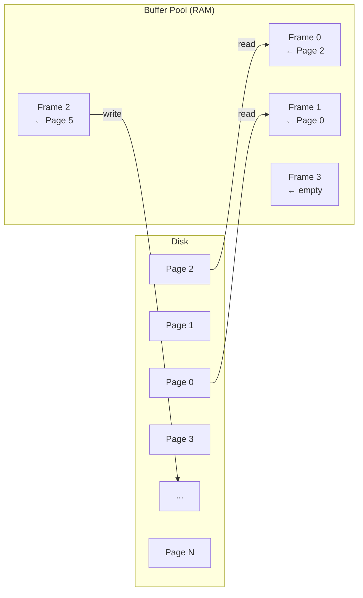

---

## 3. Page Layout

Every database page follows a structured layout. While implementations differ, the general
anatomy is consistent across systems.

### General Page Structure

```
+------------------------------+
|        Page Header           |  (fixed size: ~20-28 bytes)
|  - Page ID / Number          |
|  - LSN (Log Sequence Number) |
|  - Checksum                  |
|  - Free space offset         |
|  - Number of tuples          |
|  - Flags (leaf, internal...) |
+------------------------------+
|      Slot Array (Line        |
|      Pointers / Item IDs)    |  (grows downward)
|  [slot0][slot1][slot2]...    |
+------------------------------+
|                              |
|       Free Space             |
|                              |
+------------------------------+
|      Tuple Data              |  (grows upward from bottom)
|  [tuple2][tuple1][tuple0]    |
+------------------------------+
|        Page Footer           |  (optional, for checksums)
+------------------------------+
```

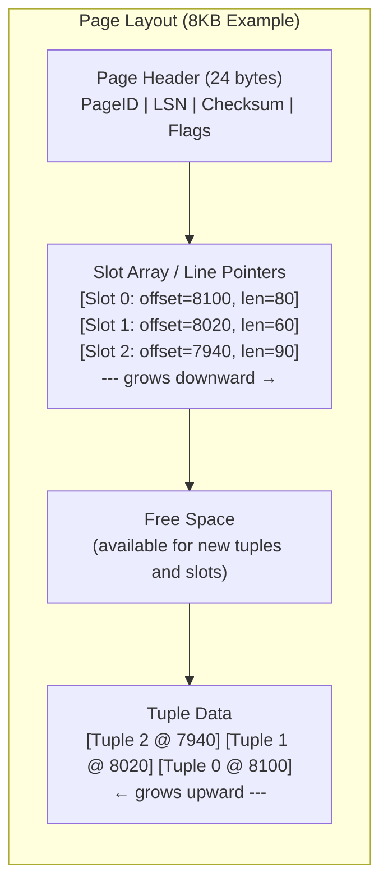

### The Slot Array (Line Pointers)

Each entry in the slot array is a small fixed-size record (typically 4 bytes) containing:

- **Offset**: Where the tuple starts within the page (2 bytes)
- **Length**: How many bytes the tuple occupies (2 bytes, or sometimes packed with flags)

This indirection layer is crucial: it allows tuples to be moved within the page (for
compaction) without invalidating external references. External code refers to a tuple by its
**slot number**, and the slot array maps that to the current physical location.

### Slotted Page Architecture in Detail

The slotted page design solves two problems simultaneously:

1. **Variable-length records**: Tuples can be any size. The slot array provides a level of
   indirection so we don't need fixed-size slots.
2. **Stable record identifiers**: A tuple's Record ID (RID) = (PageID, SlotNumber). Even if
   the tuple moves within the page during compaction, its slot number stays the same.

**Insertion process:**
1. Check if the page has enough free space for the new tuple + a new slot entry.
2. Append the tuple data at the end of the used data area (growing upward from the bottom).
3. Add a new slot entry pointing to the tuple's offset and length.
4. Update the page header's free space pointer.

**Deletion process:**
1. Mark the slot entry as "dead" (set a flag or zero out the offset).
2. The tuple's space is not immediately reclaimed -- it becomes a "hole."
3. Periodic compaction slides all live tuples together and updates slot offsets.

**Update process:**
1. If the new tuple fits in the old tuple's space, overwrite in place.
2. If the new tuple is larger, delete the old one and insert the new one (potentially on a
   different page if this page is full).

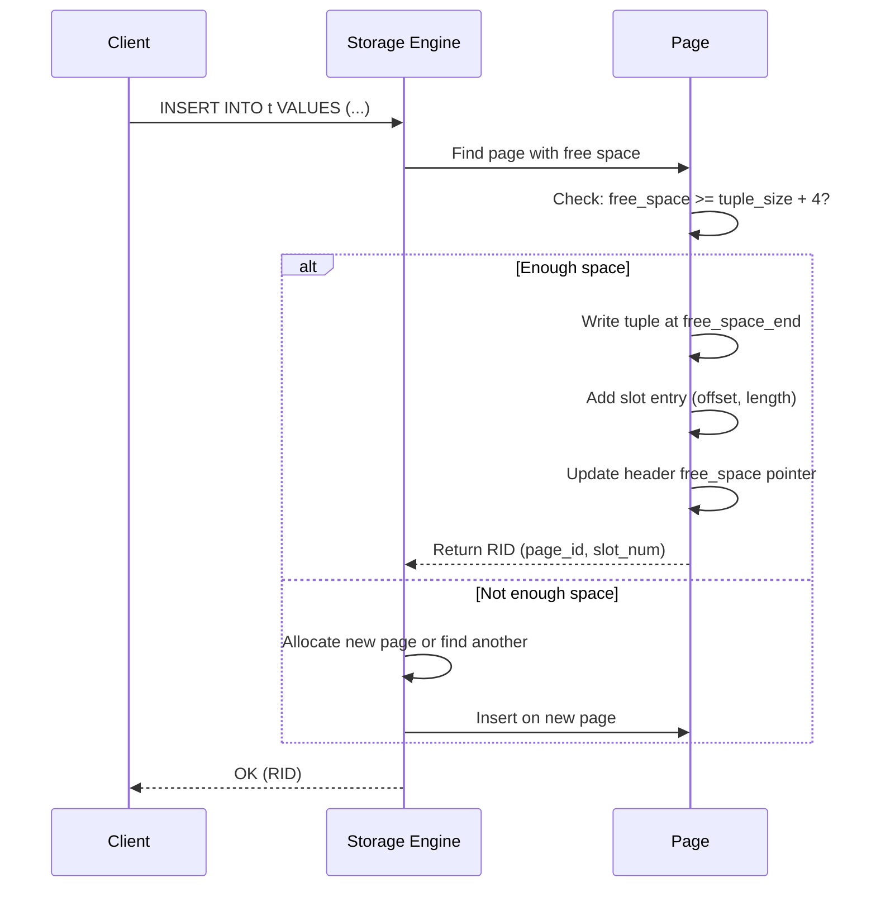

---

## 4. Heap Files

A **heap file** is the simplest file organization: an unordered collection of pages. Tuples
are inserted wherever there is room. There is no sorting, no clustering, no index structure
at the file level.

### Why "Heap"?

The name "heap" comes from the fact that records are piled on top of each other with no
particular order -- like a heap of objects. This is distinct from a "heap" data structure
(priority queue).

### Two Approaches to Managing Heap Files

#### Approach 1: Linked List of Pages

Each page contains a pointer (page number) to the next page. Two linked lists are maintained:

- **Free page list**: pages with available space.
- **Full page list**: pages that are full.

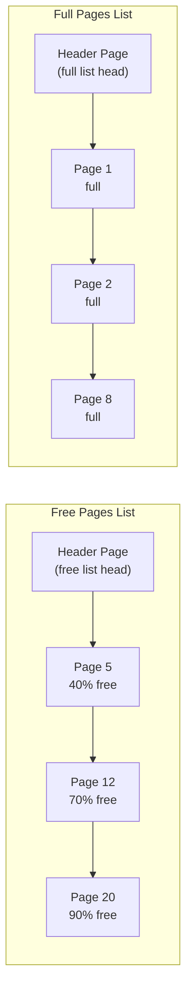

**Pros:** Simple implementation.
**Cons:** To find a page with enough space for a specific tuple, you may need to traverse
many pages in the free list.

#### Approach 2: Page Directory

A separate set of **directory pages** maintain an entry for each data page, storing:
- Page ID
- Free space available on that page

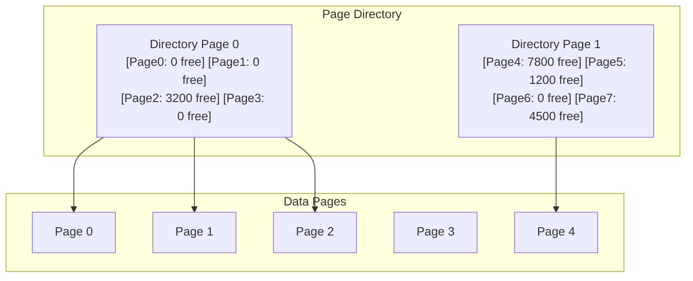

**Pros:** Can quickly find a page with enough free space. Only directory pages need to be
read, not data pages.
**Cons:** Must keep directory in sync with actual page contents. More metadata to manage.

PostgreSQL uses a **Free Space Map (FSM)** which is essentially a page directory approach
optimized with a binary tree structure.

---

## 5. Record Formats

### Fixed-Length Records

When all fields in a record have fixed sizes (e.g., INT, CHAR(20), FLOAT), the record layout
is straightforward:

```
+--------+----------+----------+--------+
| Field1 |  Field2  |  Field3  | Field4 |
| 4 bytes| 20 bytes | 8 bytes  | 4 bytes|
+--------+----------+----------+--------+
         Total: 36 bytes
```

Accessing field N is O(1): just compute the offset as the sum of sizes of fields 0..N-1.

### Variable-Length Records

When fields can be VARCHAR, TEXT, BLOB, etc., the record needs additional metadata:

```
+---------------------------+
| Null Bitmap (1 bit/field) |
+---------------------------+
| Field Offset Array        |  <- offsets to each var-length field
| [off1][off2][off3]...     |
+---------------------------+
| Fixed-length fields       |
+---------------------------+
| Variable-length fields    |
| [data1][data2][data3]     |
+---------------------------+
```

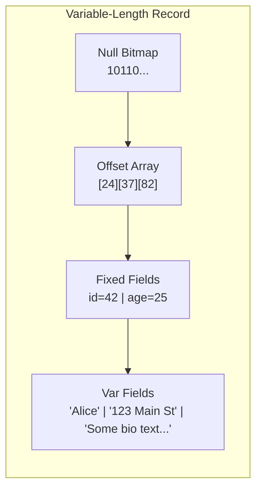

### Record IDs (RIDs)

A **Record ID** uniquely identifies a tuple in the database:

```
RID = (Page ID, Slot Number)
```

- **Page ID** locates the page on disk.
- **Slot Number** indexes into the page's slot array to find the tuple.

RIDs are used by index structures (B-trees, hash indexes) to point to actual tuples.
When an index says "the key 42 maps to RID (page=7, slot=3)," the engine reads page 7,
looks at slot 3 in the slot array, and follows the offset to the actual tuple bytes.

---

## 6. File Organization Strategies

### Heap Files (Unordered)

- Records are inserted in any available space.
- Scans require reading every page.
- Best for: bulk loading, append-heavy workloads, small tables.
- Search cost: O(N) pages.

### Sorted Files

- Records are physically sorted by some key.
- Binary search is possible: O(log N) pages to find a record.
- Insertions are expensive: may need to shift records.
- Best for: range queries on the sort key, read-heavy workloads.

### Hashed Files

- A hash function maps the key to a bucket (page or group of pages).
- Equality lookups are O(1) page reads.
- Range queries require full scan (hash destroys order).
- Must handle bucket overflow (chaining or linear probing).

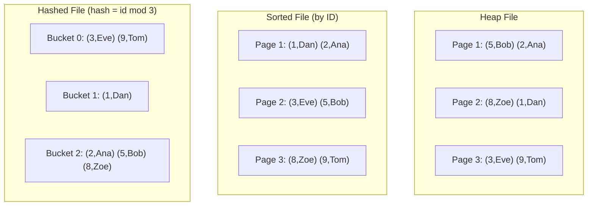

---

## 7. Column-Oriented vs Row-Oriented Storage

### Row-Oriented (N-ary Storage Model / NSM)

Traditional approach. Each page stores complete rows:

```
Page: [Row1: id=1, name='Alice', age=30, city='NYC']
      [Row2: id=2, name='Bob',   age=25, city='LA' ]
      [Row3: id=3, name='Eve',   age=35, city='SF' ]
```

**Advantages:**
- Fast for OLTP: inserting/updating a single row touches one page.
- Easy to reconstruct full rows.

**Disadvantages:**
- Analytical queries that only need a few columns waste I/O reading all columns.
- Poor compression (diverse data types in each page).

### Column-Oriented (Decomposition Storage Model / DSM)

Each page stores values of a single column:

```
ID Page:   [1, 2, 3, 4, 5, ...]
Name Page: ['Alice', 'Bob', 'Eve', ...]
Age Page:  [30, 25, 35, ...]
City Page: ['NYC', 'LA', 'SF', ...]
```

**Advantages:**
- Analytical queries read only the columns they need (massive I/O savings).
- Excellent compression (same data type, correlated values).
- SIMD-friendly: process one column at a time.

**Disadvantages:**
- Tuple reconstruction requires joining columns (need matching offsets or tuple IDs).
- Single-row operations touch many pages (one per column).

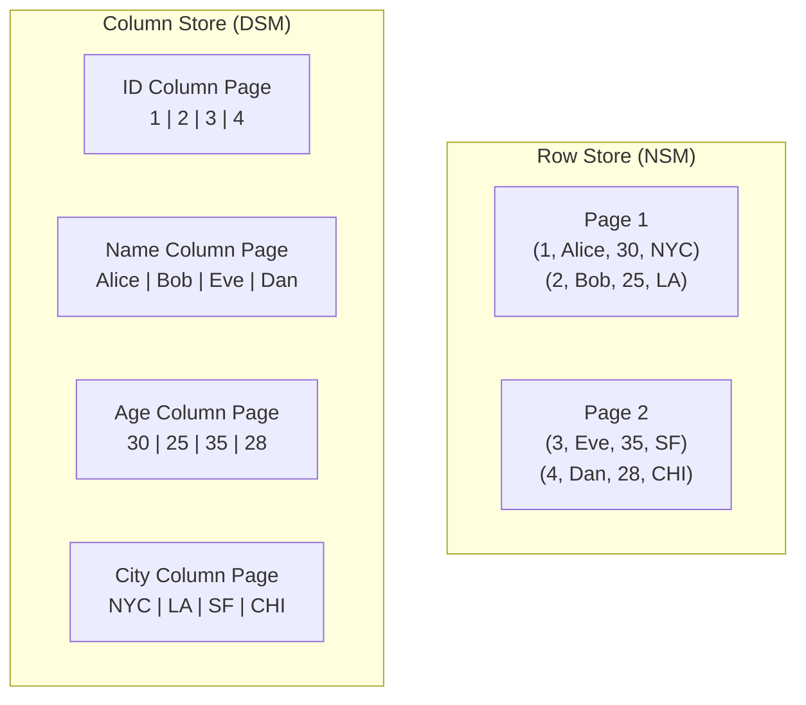

### PAX (Partition Attributes Across)

A hybrid: within each page, data is organized by columns, but across pages, each page
contains all columns for a subset of rows. This gives good cache behavior for both
OLTP and OLAP.

---

## 8. Compression Techniques

Compression reduces storage footprint and I/O volume. Since I/O is the bottleneck,
trading CPU cycles for fewer I/Os is almost always a win.

### Dictionary Encoding

Replace repeated values with short integer codes.

```
Original: ['NYC', 'LA', 'NYC', 'SF', 'NYC', 'LA']
Dictionary: {0: 'NYC', 1: 'LA', 2: 'SF'}
Encoded:   [0, 1, 0, 2, 0, 1]
```

Best for: low-cardinality columns (status, country, city).

### Run-Length Encoding (RLE)

Replace consecutive repeated values with (value, count) pairs.

```
Original: [1, 1, 1, 1, 2, 2, 3, 3, 3]
Encoded:  [(1,4), (2,2), (3,3)]
```

Best for: sorted columns with many repetitions.

### Delta Encoding

Store the difference between consecutive values.

```
Original: [1000, 1002, 1005, 1007, 1010]
Encoded:  [1000, 2, 3, 2, 3]
```

Best for: timestamps, monotonically increasing IDs.

### Bit-Packing

Use only as many bits as needed for the value range.

```
Values range: 0-15 (needs 4 bits, not 32)
Pack 8 values into 4 bytes instead of 32 bytes.
Compression ratio: 8x
```

### Null Compression

Use a bitmap to track null values. Don't store nulls at all in the data area.

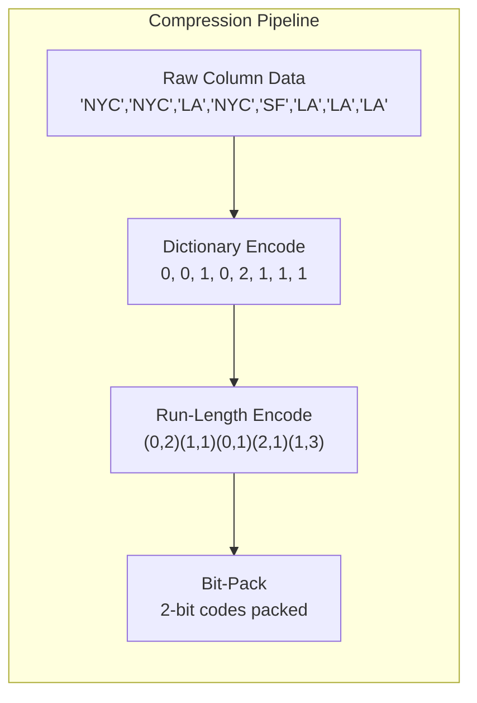

---

## 9. Summary of Key Concepts

| Concept | Key Point |
|---------|-----------|
| Storage hierarchy | RAM is 100,000x faster than HDD random read |
| Pages | Fundamental I/O unit; typically 4KB-16KB |
| Slotted pages | Slot array + data growing toward each other; enables variable-length records |
| Heap files | Unordered page collection; page directory or linked list for free space |
| RIDs | (PageID, SlotNumber) -- stable tuple address |
| Row vs Column store | Row for OLTP, column for OLAP |
| Compression | Dictionary, RLE, delta, bit-packing -- trade CPU for I/O savings |

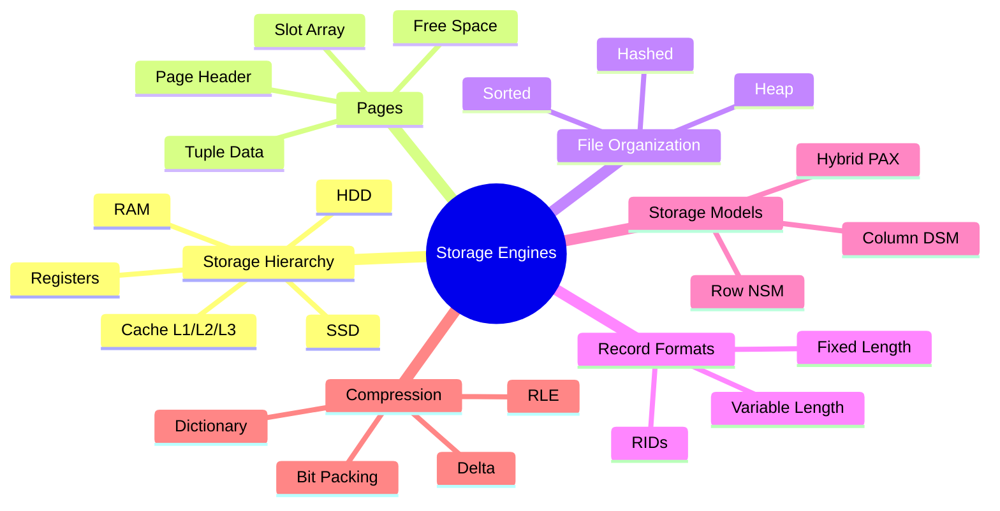
