# Module 3: B-Trees & Indexing -- Deep Dive

## 1. How B+Trees Map to Disk Pages

The fundamental insight behind B+Trees is that **each node corresponds to exactly one disk page**. This alignment is not accidental -- it is the entire reason B+Trees exist.

### Page Size and Fanout

Most databases use 4 KB, 8 KB, or 16 KB pages. Let us calculate the fanout for an 8 KB page:

```
Page layout for an internal node:
- Page header:        24 bytes
- Number of keys:     4 bytes
- Each key:           8 bytes (bigint)
- Each child pointer: 6 bytes (page_id + offset)
- Available space:    8192 - 28 = 8164 bytes

fanout = floor(8164 / (8 + 6)) + 1 = floor(583) + 1 = 584

With fanout 584:
- Height 1:  583 keys
- Height 2:  583 * 584 = 340,472 keys
- Height 3:  ~199 million keys
- Height 4:  ~116 billion keys
```

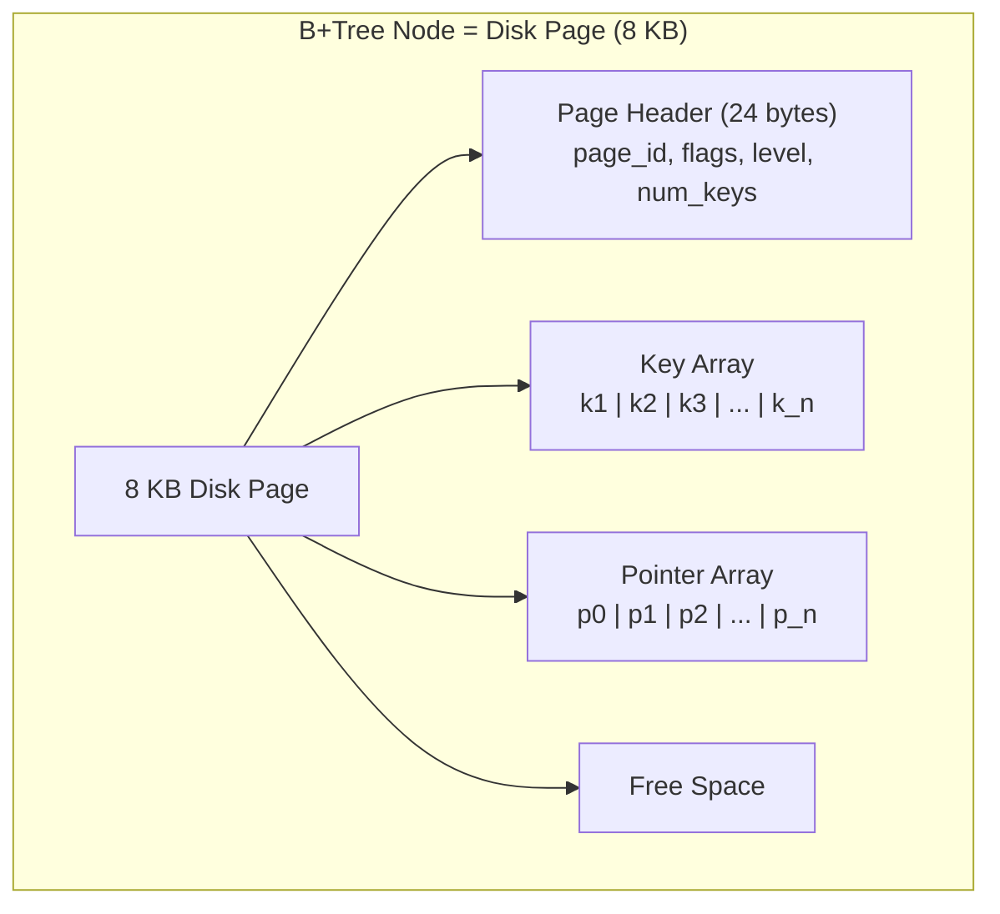

### The I/O Advantage

Because each node is one page, a tree traversal from root to leaf requires exactly `height` I/O operations. The root page is almost always cached in the buffer pool, so practical lookups cost `height - 1` I/Os, typically 2-3.

---

## 2. Node Formats

### 2.1 Internal Node Format

Internal nodes store only **separator keys** and **child page pointers**. They act as a routing table.

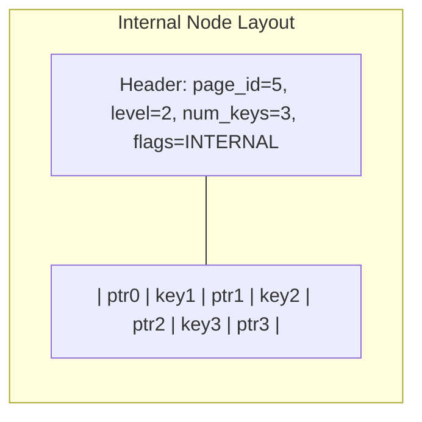

```
Byte offset layout:
[0-23]    Page header
[24-27]   num_keys (uint32)
[28-33]   child_ptr[0]          -- points to children with keys < key[0]
[34-41]   key[0]
[42-47]   child_ptr[1]          -- points to children with key[0] <= keys < key[1]
[48-55]   key[1]
[56-61]   child_ptr[2]          -- points to children with key[1] <= keys < key[2]
...
```

The invariant: `child_ptr[i]` points to a subtree where all keys `K` satisfy `key[i-1] <= K < key[i]`.

### 2.2 Leaf Node Format

Leaf nodes store **keys and values** (either full row data for clustered indexes, or TIDs/primary keys for secondary indexes), plus **sibling pointers**.

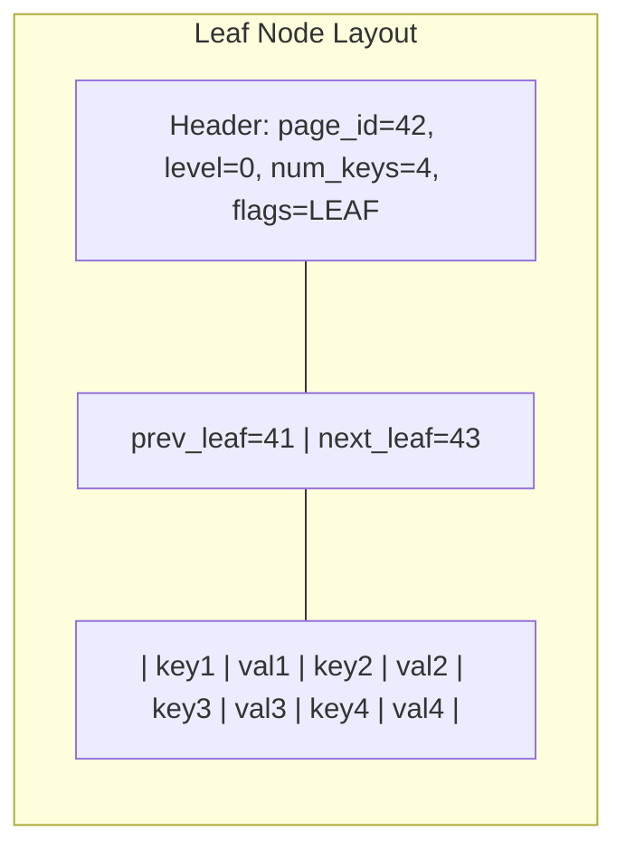

```
Byte offset layout:
[0-23]    Page header
[24-27]   num_keys (uint32)
[28-33]   prev_leaf (page_id)
[34-39]   next_leaf (page_id)
[40-47]   key[0]
[48-53]   value[0] (TID: page + offset)
[54-61]   key[1]
[62-67]   value[1]
...
```

### 2.3 Slotted Page Variant

Many databases (including PostgreSQL) use a **slotted page** layout where an array of slot pointers at the top of the page point to variable-length records at the bottom, growing toward each other:

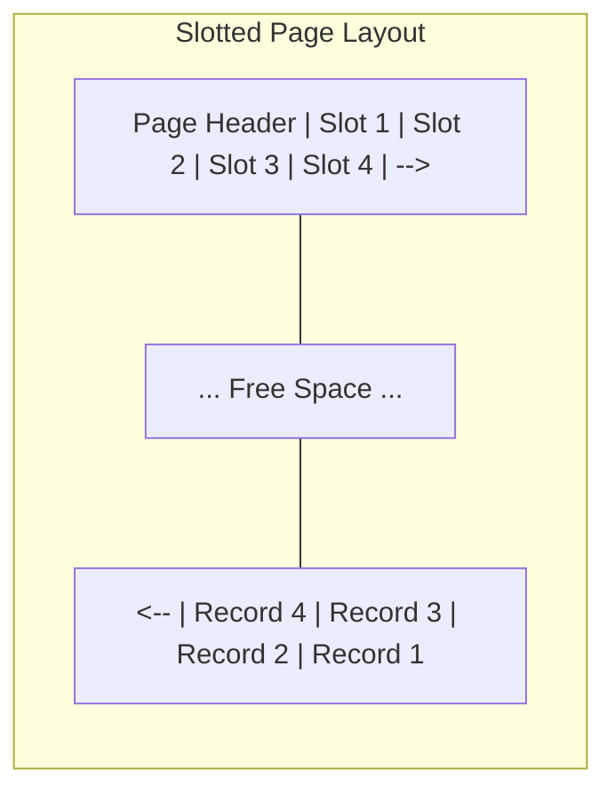

This allows variable-length keys without fragmentation.

---

## 3. Key Compression Techniques

### 3.1 Prefix Compression

Adjacent keys in a sorted index often share a common prefix. **Prefix compression** stores the shared prefix once and only the differing suffixes for subsequent keys.

```
Without prefix compression:
  "database_internals_chapter_01"
  "database_internals_chapter_02"
  "database_internals_chapter_03"

With prefix compression:
  "database_internals_chapter_01"  (full key)
  prefix_len=27, suffix="_02"
  prefix_len=27, suffix="_03"

Savings: ~60% space reduction
```

### 3.2 Suffix Truncation

Internal node keys only need to **separate** the ranges of their children. They do not need to match any actual key exactly. We can truncate them to the shortest distinguishing prefix.

```
Left child max key:   "Johnson"
Right child min key:  "Smith"

Full separator:       "Smith"     (7 bytes)
Truncated separator:  "S"         (1 byte)  -- still correctly separates

Left child max key:   "Smith, Adam"
Right child min key:  "Smith, Bob"

Full separator:       "Smith, Bob"  (10 bytes)
Truncated separator:  "Smith, B"    (8 bytes)
```

This dramatically increases the fanout of internal nodes because separator keys are shorter.

### 3.3 Key Deduplication

PostgreSQL 13+ implements **deduplication** for B-Tree indexes. When multiple index entries have the same key value (common for non-unique indexes), they are stored as one key followed by a list of TIDs:

```
Before deduplication:
  (key="Smith", TID=(5,1))
  (key="Smith", TID=(8,3))
  (key="Smith", TID=(12,7))

After deduplication:
  (key="Smith", TIDs=[(5,1), (8,3), (12,7)])
```

---

## 4. Bulk Loading: Bottom-Up Construction

Inserting keys one by one into a B+Tree causes many page splits and produces a tree that is typically only ~69% full (due to random splits). **Bulk loading** builds the tree bottom-up and produces 100% full pages.

### Algorithm

1. Sort all keys
2. Fill leaf pages sequentially to the desired fill factor
3. Take the first key of each new leaf page and build the parent level
4. Repeat upward until a single root page remains

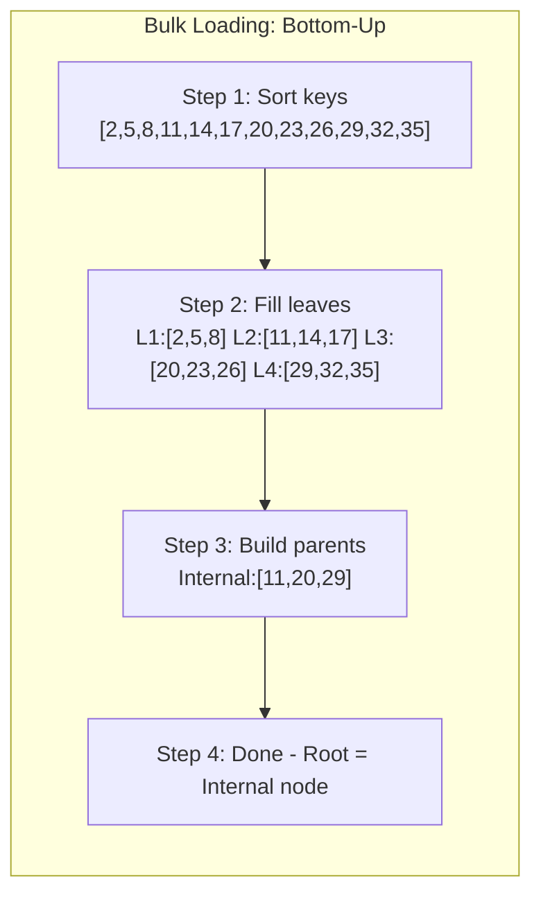

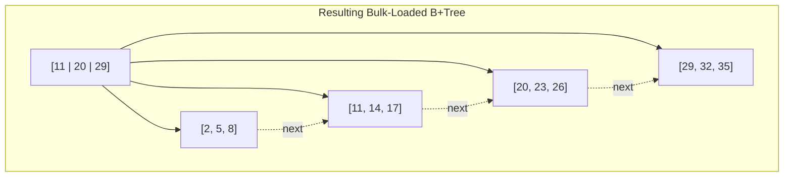

PostgreSQL uses bulk loading when executing `CREATE INDEX` (via `nbtsort.c`). It is significantly faster than inserting one key at a time.

---

## 5. Concurrency in B+Trees

### 5.1 The Problem

Multiple threads may simultaneously:
- Read the tree (searches)
- Modify the tree (inserts, deletes)
- Cause structural changes (splits, merges)

Naive locking (lock the entire tree) destroys concurrency. We need fine-grained locking.

### 5.2 Latch Crabbing / Latch Coupling

The **latch crabbing** (also called latch coupling) protocol uses per-node latches (lightweight locks):

**For Search (read path):**
1. Acquire **shared latch** on root
2. Acquire shared latch on child
3. Release latch on parent
4. Repeat to leaf

**For Insert/Delete (write path):**
1. Acquire **exclusive latch** on root
2. Acquire exclusive latch on child
3. If child is **safe** (will not split/merge), release ALL ancestor latches
4. Repeat to leaf

A node is **safe** if:
- For insert: it has room for one more key (no split needed)
- For delete: it has more than minimum keys (no merge needed)

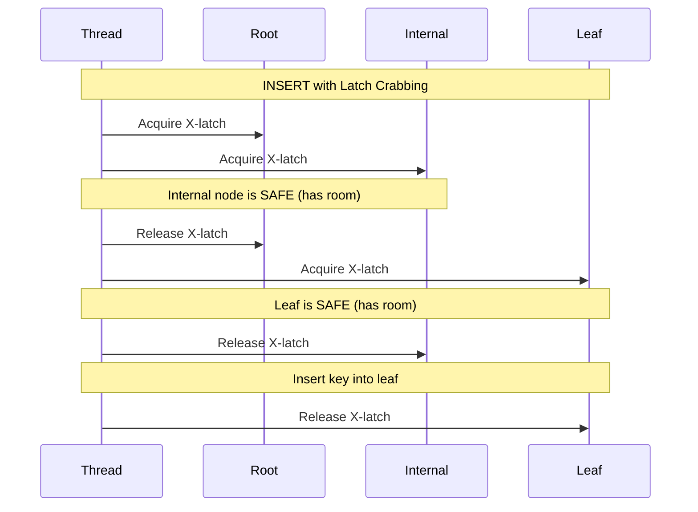

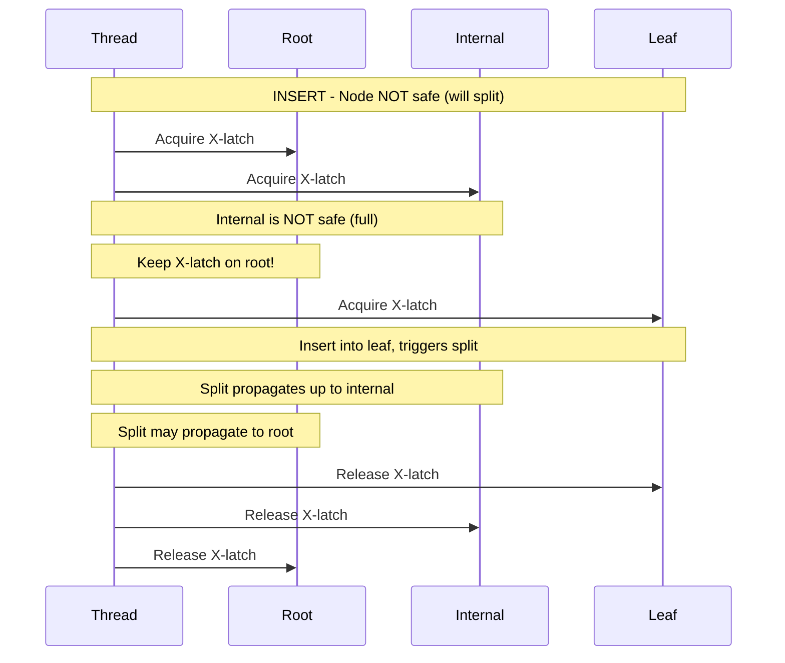

### 5.3 Optimistic Latch Coupling

Standard latch crabbing is pessimistic -- it acquires exclusive latches top-down even when most inserts will not cause splits. **Optimistic latch coupling** improves this:

1. Traverse the tree using **shared latches** (like a search)
2. Acquire an exclusive latch only on the leaf
3. If the leaf is safe, perform the operation
4. If the leaf is NOT safe (split needed), **restart** with pessimistic crabbing

Since >99% of inserts do not cause splits, this dramatically reduces contention on upper levels.

---

## 6. B-link Trees (Lehman-Yao)

The **B-link tree** (1981, Lehman and Yao) adds a **right-link pointer** to every node, enabling even better concurrency.

### Key Additions

1. Every node has a **high key** -- the upper bound of keys it can contain
2. Every node has a **right-link** pointer to its right sibling at the same level

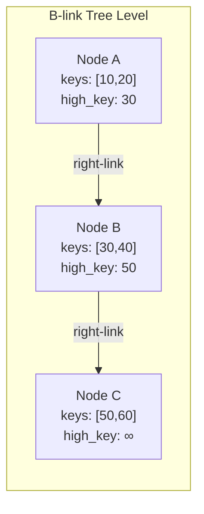

### How It Helps

During a split, the Lehman-Yao protocol:

1. The splitting node keeps its left half
2. A new node is created with the right half
3. The right-link of the old node is set to the new node
4. The parent is updated LATER (not atomically with the split)

If a reader arrives at the old node after the split but before the parent is updated, it simply follows the right-link to find the key in the new node.

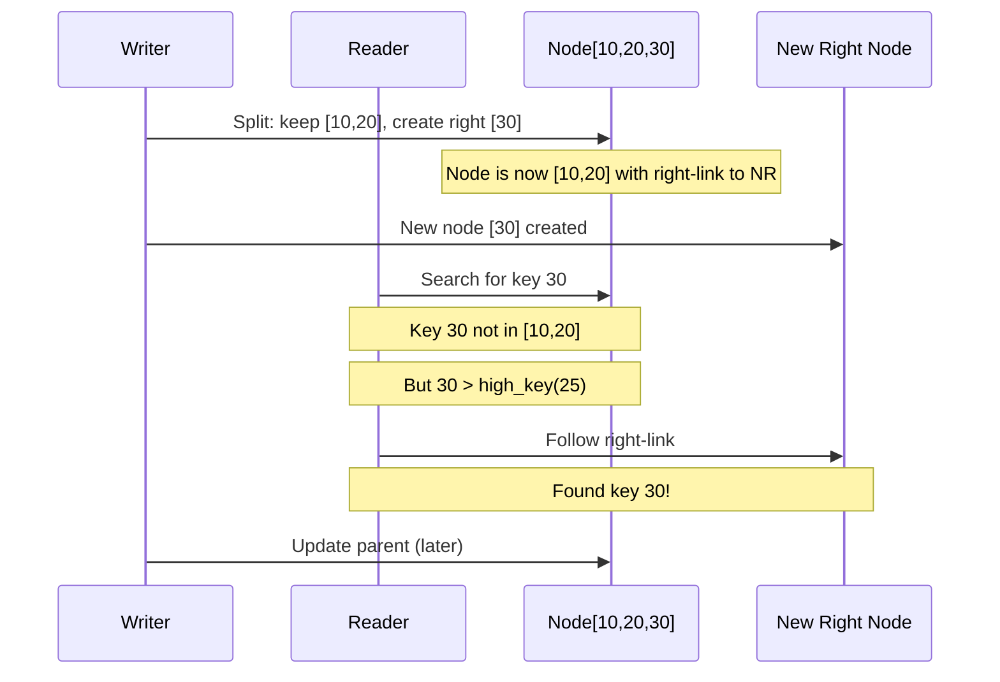

PostgreSQL's nbtree implementation is based on the Lehman-Yao B-link tree design.

---

## 7. How PostgreSQL Implements B-Tree Indexes (nbtree)

PostgreSQL's B-Tree implementation lives in `src/backend/access/nbtree/`. Key source files:

| File | Purpose |
|------|---------|
| `nbtree.c` | Entry points (insert, scan, delete) |
| `nbtsearch.c` | Search and scan logic |
| `nbtinsert.c` | Insertion and page splitting |
| `nbtpage.c` | Page management and initialization |
| `nbtsort.c` | Bulk loading (CREATE INDEX) |
| `nbtutils.c` | Utility functions, scan key processing |
| `nbtdedup.c` | Key deduplication (PostgreSQL 13+) |

### PostgreSQL nbtree Specifics

1. **Lehman-Yao based:** Every page has a right-link and high key
2. **Page format:** Uses standard PostgreSQL slotted pages (8 KB default)
3. **Metapage:** Page 0 stores metadata (root page location, tree height, etc.)
4. **Fast root:** If the true root has only one child, PostgreSQL tracks a "fast root" that skips single-child levels
5. **Kill marking:** During index scans, PostgreSQL marks index tuples as "killed" if they point to dead heap tuples, so future scans skip them
6. **Deduplication:** Since PostgreSQL 13, duplicate keys share a single key entry with a posting list of TIDs

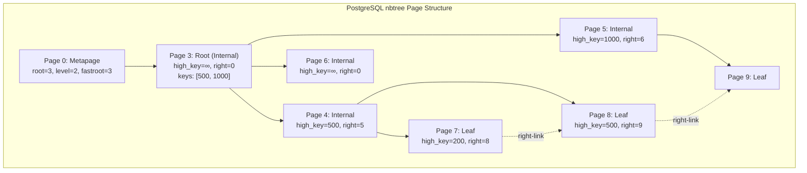

### The nbtree Insert Path

1. `_bt_doinsert()` -- entry point
2. `_bt_search()` -- traverse from root to leaf, latch crabbing
3. `_bt_binsrch()` -- binary search within a page
4. `_bt_insertonpg()` -- insert the tuple into the page
5. If page full: `_bt_split()` -- split the page
6. `_bt_insert_parent()` -- insert separator key into parent

---

## 8. How InnoDB Clustered Index Works

In InnoDB (MySQL), the **primary key index IS the table**. This is called a clustered index or index-organized table.

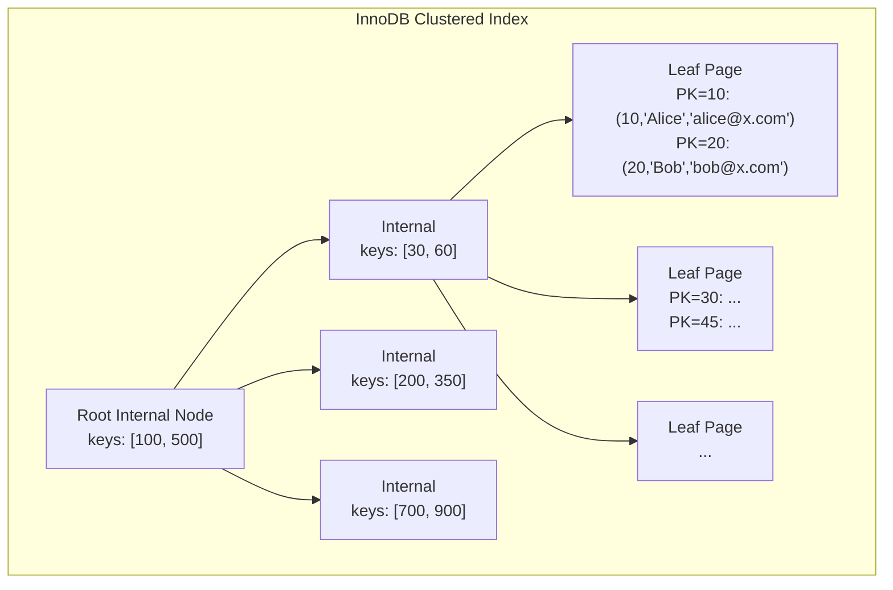

### Secondary Index Lookups in InnoDB

Secondary indexes store the **primary key value** (not a physical row pointer) in their leaf nodes. This means a secondary index lookup requires TWO tree traversals:

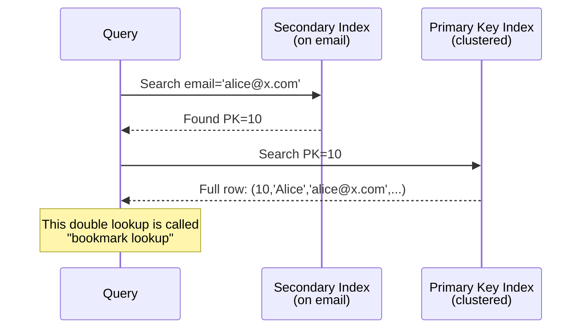

**Why not store physical pointers?** Because when the clustered index pages split or reorganize, all secondary indexes would need updating. Storing the PK value avoids this -- the PK never changes.

---

## 9. Write Amplification in B-Trees

**Write amplification** is the ratio of actual bytes written to disk versus the logical bytes of the write operation.

For a B+Tree insert of a single 100-byte row:

1. Read the leaf page (8 KB) from disk
2. Modify the page in memory
3. Write the entire page (8 KB) back to disk
4. Write a WAL record (~200 bytes)
5. If a split occurs: write 2 new pages + parent update

```
Logical write:  100 bytes
Physical write: 8,192 bytes (page) + 200 bytes (WAL) = ~8,400 bytes
Write amplification: 84x
```

With a split:
```
Physical write: 8,192 * 3 (leaf + new leaf + parent) + WAL = ~25,000 bytes
Write amplification: 250x
```

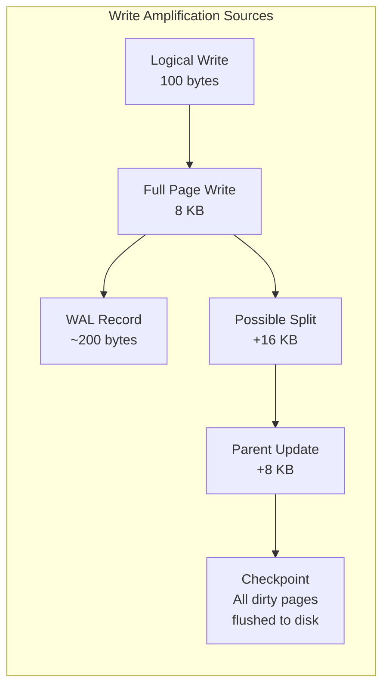

This is why **LSM-Trees** (Module 4) were invented -- they convert random writes into sequential writes, reducing write amplification at the cost of read amplification.

---

## 10. Buffer Tree

A **buffer tree** is a variant of B-Tree designed to reduce I/O for batch workloads. Each internal node has an associated **buffer** that temporarily holds insert/delete operations.

### How It Works

1. Operations are inserted into the root's buffer
2. When a buffer is full, its contents are **flushed** to the appropriate children
3. Operations cascade down the tree in batches
4. Leaf nodes process operations when they arrive

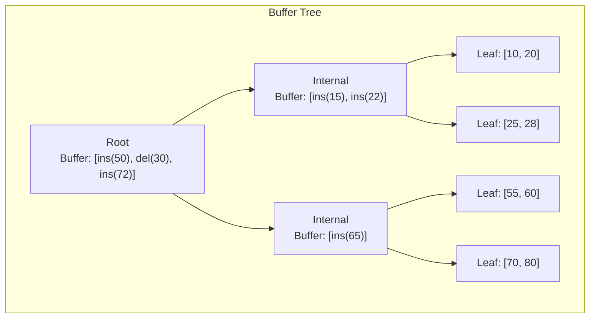

The amortized I/O cost per operation is `O(1/B * log_{M/B}(N/B))` where B is the page size and M is memory size. This is asymptotically better than standard B-Trees for write-heavy workloads.

---

## 11. Fractional Cascading

**Fractional cascading** is a technique to speed up searching the same key across multiple sorted lists (or levels of a B-Tree).

### The Problem

In a standard B+Tree, searching at each level requires a binary search of O(log F) where F is the fanout. Over H levels, the total CPU cost is O(H * log F).

### The Solution

Fractional cascading augments each node with a **fraction** (e.g., every other element) of the keys from the next level. This allows a search at each subsequent level in O(1) amortized time using the position found in the previous level.

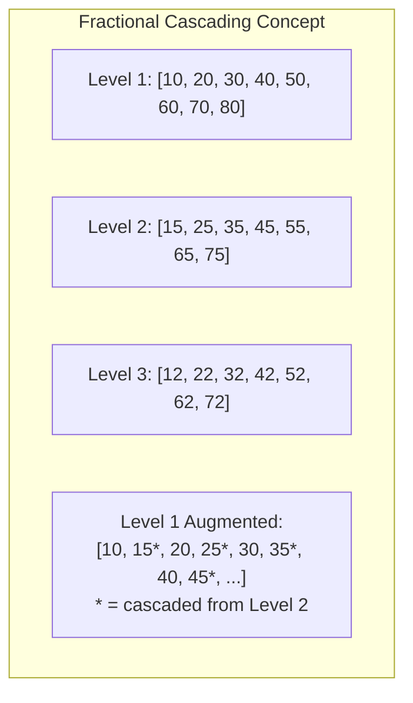

This reduces the total search cost from `O(H * log F)` to `O(log F + H)`. In practice, modern CPUs and cache lines make this less impactful than the theory suggests, so it is rarely implemented in production databases.

---

## 12. Advanced: Copy-on-Write B+Trees

Some databases (like LMDB and CouchDB) use **copy-on-write** (CoW) B+Trees. Instead of modifying pages in place, every write creates new copies of all modified pages from leaf to root.

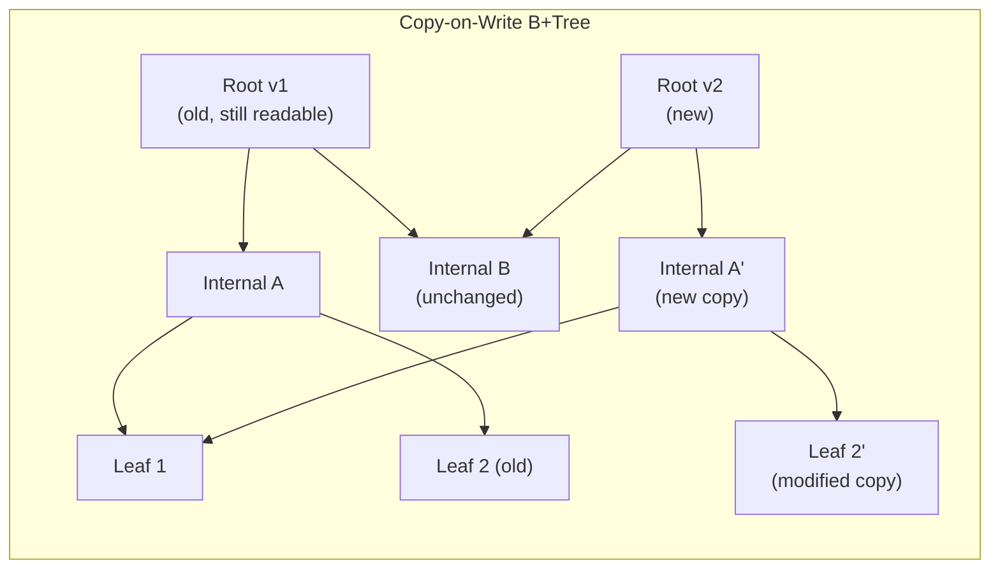

**Advantages:**
- No WAL needed (the old tree is always consistent)
- Readers never block writers (MVCC for free)
- Atomic commits by switching the root pointer

**Disadvantages:**
- Write amplification: every write copies O(H) pages
- Fragmentation: pages are no longer sequential on disk
- Garbage collection of old pages needed

---

## Summary

The B+Tree is not just a textbook data structure -- it is a carefully engineered system optimized for the realities of disk I/O, concurrency, and crash recovery. Understanding how nodes map to pages, how compression reduces tree height, and how latch protocols enable concurrent access is essential for anyone working with database internals.

| Concept | Key Insight |
|---------|------------|
| Node = Page | One I/O reads hundreds of keys |
| Leaf linking | Range scans follow pointers, no tree re-traversal |
| Prefix compression | More keys per page = shorter tree |
| Suffix truncation | Shorter separators = higher internal fanout |
| Latch crabbing | Release parent latch when child is safe |
| B-link tree | Right-links allow non-atomic splits |
| Clustered index | Table data IS the leaf level |
| Write amplification | Single-row write may touch 3+ pages |
| Bulk loading | Bottom-up is 2-3x faster than top-down inserts |
