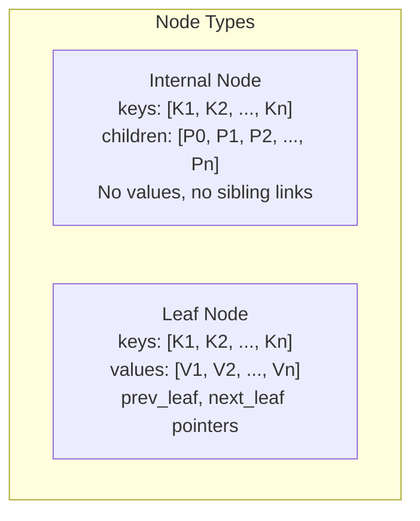
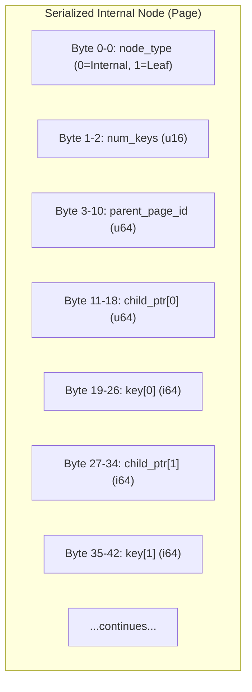
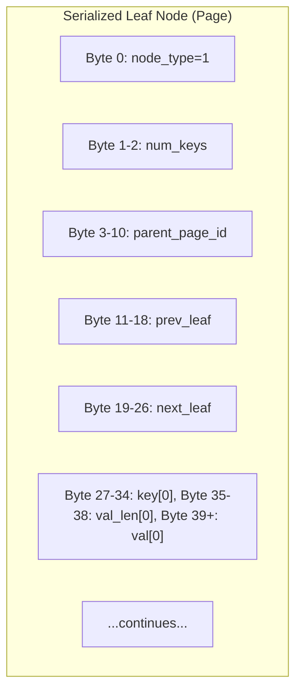
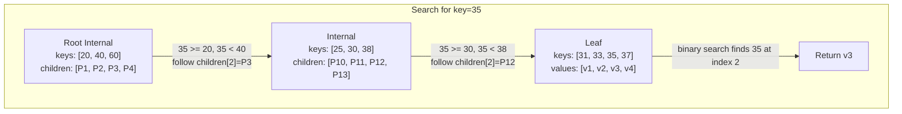
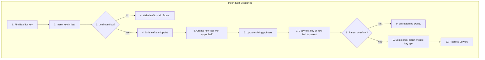
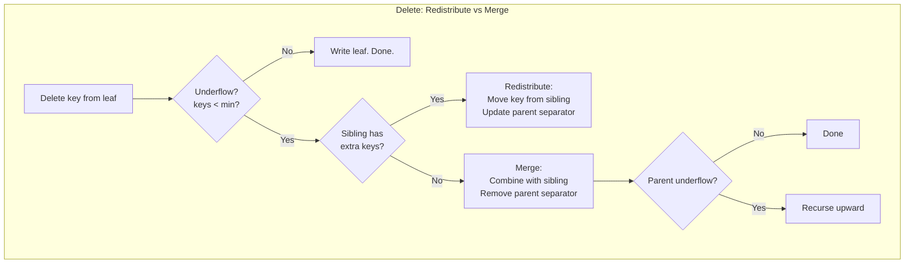
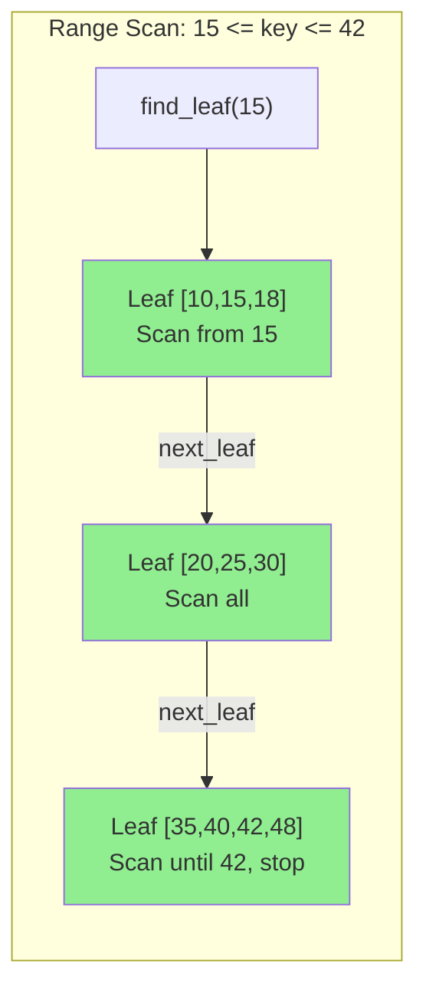
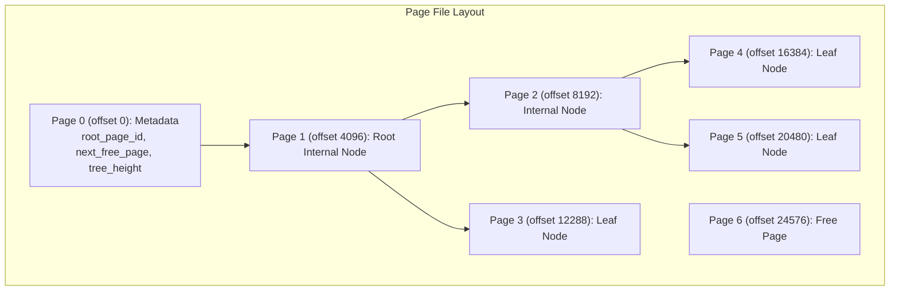
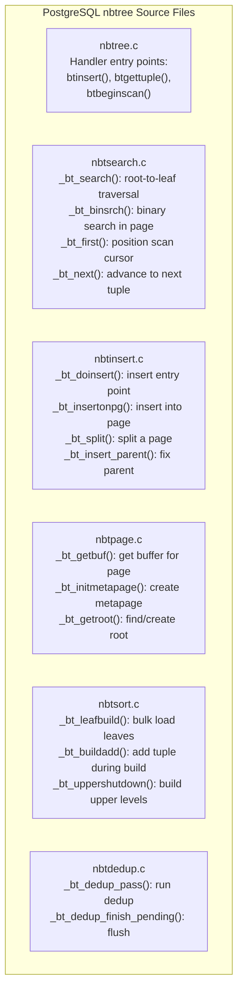
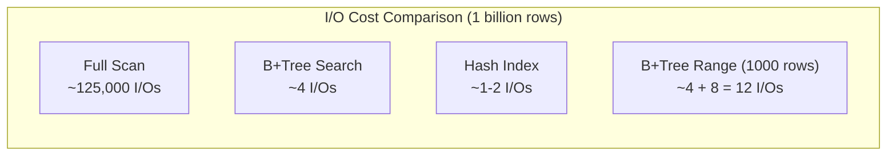

# Module 3: B+Tree Implementation Walkthrough

## Overview

This file walks through implementing a B+Tree from scratch. We will build a complete, working B+Tree with search, insert, delete, range scan, and disk serialization. Code examples are in Rust with equivalent pseudocode.

---

## 1. Node Structure

A B+Tree has two types of nodes: **internal nodes** (routing) and **leaf nodes** (data storage).



### Rust Data Structures

```rust
const ORDER: usize = 4; // Max keys per node (for demonstration; real DBs use 200+)
const MAX_KEYS: usize = ORDER - 1;
const MIN_KEYS: usize = ORDER / 2; // Minimum keys for non-root nodes

type PageId = u64;
type Key = i64;
type Value = Vec<u8>; // Could be a TID, a row, or any payload

/// Represents a pointer to a child page on disk
#[derive(Clone, Debug)]
struct ChildPtr {
    page_id: PageId,
}

/// A B+Tree node (either internal or leaf)
#[derive(Clone, Debug)]
enum Node {
    Internal(InternalNode),
    Leaf(LeafNode),
}

#[derive(Clone, Debug)]
struct InternalNode {
    page_id: PageId,
    keys: Vec<Key>,           // Separator keys
    children: Vec<PageId>,    // Child page IDs; len = keys.len() + 1
    parent: Option<PageId>,
}

#[derive(Clone, Debug)]
struct LeafNode {
    page_id: PageId,
    keys: Vec<Key>,
    values: Vec<Value>,       // Parallel array with keys
    prev_leaf: Option<PageId>,
    next_leaf: Option<PageId>,
    parent: Option<PageId>,
}

/// The B+Tree itself
struct BPlusTree {
    root_page_id: PageId,
    next_page_id: PageId,     // For allocating new pages
    pager: Pager,             // Handles reading/writing pages to disk
}
```

### Memory Layout of a Node on Disk

When serializing a node to a page, we use a fixed layout:





---

## 2. Search Algorithm

### Pseudocode

```
FUNCTION search(tree, key):
    node = read_page(tree.root_page_id)

    WHILE node is Internal:
        i = binary_search(node.keys, key)
        // Find first key > search key, follow that child pointer
        child_page_id = node.children[i]
        node = read_page(child_page_id)

    // node is now a Leaf
    i = binary_search(node.keys, key)
    IF node.keys[i] == key:
        RETURN node.values[i]
    ELSE:
        RETURN NOT_FOUND
```

### Rust Implementation

```rust
impl BPlusTree {
    /// Search for a key, returns the value if found
    pub fn search(&self, key: Key) -> Option<Value> {
        let leaf = self.find_leaf(key);

        // Binary search within the leaf
        match leaf.keys.binary_search(&key) {
            Ok(idx) => Some(leaf.values[idx].clone()),
            Err(_) => None,
        }
    }

    /// Traverse from root to the leaf that should contain the key
    fn find_leaf(&self, key: Key) -> LeafNode {
        let mut current_page_id = self.root_page_id;

        loop {
            let node = self.pager.read_node(current_page_id);
            match node {
                Node::Leaf(leaf) => return leaf,
                Node::Internal(internal) => {
                    // Find the child to descend into
                    let idx = match internal.keys.binary_search(&key) {
                        Ok(i) => i + 1,  // Key found: go right
                        Err(i) => i,     // Key not found: insertion point
                    };
                    current_page_id = internal.children[idx];
                }
            }
        }
    }
}
```



---

## 3. Insert Algorithm

### Pseudocode

```
FUNCTION insert(tree, key, value):
    leaf = find_leaf(key)

    IF key exists in leaf:
        UPDATE leaf.values[position] = value
        write_page(leaf)
        RETURN

    insert key,value into leaf in sorted position

    IF leaf.num_keys <= MAX_KEYS:
        write_page(leaf)
    ELSE:
        split_leaf(tree, leaf)

FUNCTION split_leaf(tree, leaf):
    mid = ceil(num_keys / 2)

    new_leaf = allocate_new_page()
    new_leaf.keys = leaf.keys[mid:]
    new_leaf.values = leaf.values[mid:]
    leaf.keys = leaf.keys[:mid]
    leaf.values = leaf.values[:mid]

    // Update sibling links
    new_leaf.next_leaf = leaf.next_leaf
    new_leaf.prev_leaf = leaf.page_id
    leaf.next_leaf = new_leaf.page_id
    IF new_leaf.next_leaf exists:
        old_next = read_page(new_leaf.next_leaf)
        old_next.prev_leaf = new_leaf.page_id
        write_page(old_next)

    // Copy up the first key of new_leaf to parent
    separator_key = new_leaf.keys[0]
    insert_into_parent(tree, leaf, separator_key, new_leaf)

FUNCTION insert_into_parent(tree, left_node, key, right_node):
    IF left_node is root:
        new_root = allocate_new_page() as Internal
        new_root.keys = [key]
        new_root.children = [left_node.page_id, right_node.page_id]
        tree.root_page_id = new_root.page_id
        write_page(new_root)
        RETURN

    parent = read_page(left_node.parent)
    insert key and right_node.page_id into parent at correct position

    IF parent.num_keys <= MAX_KEYS:
        write_page(parent)
    ELSE:
        split_internal(tree, parent)

FUNCTION split_internal(tree, node):
    mid = num_keys / 2
    push_up_key = node.keys[mid]   // This key moves UP (not copied)

    new_node = allocate_new_page() as Internal
    new_node.keys = node.keys[mid+1:]
    new_node.children = node.children[mid+1:]
    node.keys = node.keys[:mid]
    node.children = node.children[:mid+1]

    insert_into_parent(tree, node, push_up_key, new_node)
```

### Rust Implementation

```rust
impl BPlusTree {
    pub fn insert(&mut self, key: Key, value: Value) {
        // Special case: empty tree
        if self.is_empty() {
            let leaf = LeafNode {
                page_id: self.allocate_page(),
                keys: vec![key],
                values: vec![value],
                prev_leaf: None,
                next_leaf: None,
                parent: None,
            };
            self.root_page_id = leaf.page_id;
            self.pager.write_node(leaf.page_id, &Node::Leaf(leaf));
            return;
        }

        let mut leaf = self.find_leaf(key);

        // Check for duplicate key
        if let Ok(idx) = leaf.keys.binary_search(&key) {
            leaf.values[idx] = value;
            self.pager.write_node(leaf.page_id, &Node::Leaf(leaf));
            return;
        }

        // Insert in sorted position
        let insert_pos = leaf.keys.binary_search(&key).unwrap_err();
        leaf.keys.insert(insert_pos, key);
        leaf.values.insert(insert_pos, value);

        if leaf.keys.len() <= MAX_KEYS {
            self.pager.write_node(leaf.page_id, &Node::Leaf(leaf));
        } else {
            self.split_leaf(leaf);
        }
    }

    fn split_leaf(&mut self, mut leaf: LeafNode) {
        let mid = (leaf.keys.len() + 1) / 2;
        let new_page_id = self.allocate_page();

        let mut new_leaf = LeafNode {
            page_id: new_page_id,
            keys: leaf.keys.split_off(mid),
            values: leaf.values.split_off(mid),
            prev_leaf: Some(leaf.page_id),
            next_leaf: leaf.next_leaf,
            parent: leaf.parent,
        };

        leaf.next_leaf = Some(new_page_id);

        // Update the old next leaf's prev pointer
        if let Some(next_id) = new_leaf.next_leaf {
            if let Node::Leaf(mut next) = self.pager.read_node(next_id) {
                next.prev_leaf = Some(new_page_id);
                self.pager.write_node(next_id, &Node::Leaf(next));
            }
        }

        let separator = new_leaf.keys[0];

        self.pager.write_node(leaf.page_id, &Node::Leaf(leaf.clone()));
        self.pager.write_node(new_page_id, &Node::Leaf(new_leaf));

        self.insert_into_parent(leaf.page_id, separator, new_page_id);
    }

    fn insert_into_parent(&mut self, left_id: PageId, key: Key, right_id: PageId) {
        let left_node = self.pager.read_node(left_id);
        let parent_id = match &left_node {
            Node::Internal(n) => n.parent,
            Node::Leaf(n) => n.parent,
        };

        match parent_id {
            None => {
                // Left node is root; create new root
                let new_root_id = self.allocate_page();
                let new_root = InternalNode {
                    page_id: new_root_id,
                    keys: vec![key],
                    children: vec![left_id, right_id],
                    parent: None,
                };
                self.root_page_id = new_root_id;

                // Update children's parent pointers
                self.set_parent(left_id, new_root_id);
                self.set_parent(right_id, new_root_id);

                self.pager.write_node(new_root_id, &Node::Internal(new_root));
            }
            Some(pid) => {
                if let Node::Internal(mut parent) = self.pager.read_node(pid) {
                    let insert_pos = parent.keys.binary_search(&key).unwrap_err();
                    parent.keys.insert(insert_pos, key);
                    parent.children.insert(insert_pos + 1, right_id);

                    self.set_parent(right_id, pid);

                    if parent.keys.len() <= MAX_KEYS {
                        self.pager.write_node(pid, &Node::Internal(parent));
                    } else {
                        self.split_internal(parent);
                    }
                }
            }
        }
    }
}
```



---

## 4. Delete Algorithm

### Pseudocode

```
FUNCTION delete(tree, key):
    leaf = find_leaf(key)

    IF key NOT in leaf:
        RETURN NOT_FOUND

    remove key and value from leaf

    IF leaf is root OR leaf.num_keys >= MIN_KEYS:
        write_page(leaf)
        RETURN

    // Leaf underflow - try to fix
    IF left_sibling exists AND left_sibling.num_keys > MIN_KEYS:
        redistribute_from_left(leaf, left_sibling)
    ELSE IF right_sibling exists AND right_sibling.num_keys > MIN_KEYS:
        redistribute_from_right(leaf, right_sibling)
    ELSE:
        merge_with_sibling(leaf, sibling)
```

### Rust Implementation

```rust
impl BPlusTree {
    pub fn delete(&mut self, key: Key) -> Option<Value> {
        let mut leaf = self.find_leaf(key);

        let idx = match leaf.keys.binary_search(&key) {
            Ok(i) => i,
            Err(_) => return None,
        };

        let removed_value = leaf.values.remove(idx);
        leaf.keys.remove(idx);

        if leaf.parent.is_none() || leaf.keys.len() >= MIN_KEYS {
            // Root leaf or leaf has enough keys
            self.pager.write_node(leaf.page_id, &Node::Leaf(leaf));
            return Some(removed_value);
        }

        // Underflow: try redistribute or merge
        self.handle_leaf_underflow(leaf);
        Some(removed_value)
    }

    fn handle_leaf_underflow(&mut self, leaf: LeafNode) {
        let parent_id = leaf.parent.unwrap();
        let parent = match self.pager.read_node(parent_id) {
            Node::Internal(n) => n,
            _ => unreachable!(),
        };

        let child_idx = parent.children.iter()
            .position(|&c| c == leaf.page_id)
            .unwrap();

        // Try left sibling
        if child_idx > 0 {
            let left_id = parent.children[child_idx - 1];
            if let Node::Leaf(mut left) = self.pager.read_node(left_id) {
                if left.keys.len() > MIN_KEYS {
                    self.redistribute_leaf_left(&mut left, leaf, &parent, child_idx);
                    return;
                }
                // Merge with left
                self.merge_leaves(left, leaf, parent, child_idx);
                return;
            }
        }

        // Try right sibling
        if child_idx < parent.children.len() - 1 {
            let right_id = parent.children[child_idx + 1];
            if let Node::Leaf(mut right) = self.pager.read_node(right_id) {
                if right.keys.len() > MIN_KEYS {
                    self.redistribute_leaf_right(leaf, &mut right, &parent, child_idx);
                    return;
                }
                self.merge_leaves(leaf, right, parent, child_idx + 1);
                return;
            }
        }
    }

    fn merge_leaves(
        &mut self,
        mut left: LeafNode,
        right: LeafNode,
        mut parent: InternalNode,
        right_child_idx: usize,
    ) {
        // Move all keys/values from right into left
        left.keys.extend(right.keys);
        left.values.extend(right.values);
        left.next_leaf = right.next_leaf;

        // Update the next leaf's prev pointer
        if let Some(next_id) = right.next_leaf {
            if let Node::Leaf(mut next) = self.pager.read_node(next_id) {
                next.prev_leaf = Some(left.page_id);
                self.pager.write_node(next_id, &Node::Leaf(next));
            }
        }

        // Remove separator key and right child from parent
        parent.keys.remove(right_child_idx - 1);
        parent.children.remove(right_child_idx);

        self.pager.write_node(left.page_id, &Node::Leaf(left));
        self.pager.free_page(right.page_id);

        // Check if parent underflows
        if parent.parent.is_none() && parent.children.len() == 1 {
            // Parent is root with one child: child becomes new root
            self.root_page_id = parent.children[0];
            self.set_parent(self.root_page_id, 0); // No parent
            self.pager.free_page(parent.page_id);
        } else if parent.parent.is_some() && parent.keys.len() < MIN_KEYS {
            self.handle_internal_underflow(parent);
        } else {
            self.pager.write_node(parent.page_id, &Node::Internal(parent));
        }
    }
}
```



---

## 5. Range Scan

Range scans leverage the leaf-node linked list:

```rust
impl BPlusTree {
    /// Return all (key, value) pairs where start_key <= key <= end_key
    pub fn range_scan(&self, start_key: Key, end_key: Key) -> Vec<(Key, Value)> {
        let mut results = Vec::new();
        let mut leaf = self.find_leaf(start_key);

        'outer: loop {
            for (i, key) in leaf.keys.iter().enumerate() {
                if *key > end_key {
                    break 'outer;
                }
                if *key >= start_key {
                    results.push((*key, leaf.values[i].clone()));
                }
            }

            // Move to next leaf
            match leaf.next_leaf {
                Some(next_id) => {
                    leaf = match self.pager.read_node(next_id) {
                        Node::Leaf(l) => l,
                        _ => unreachable!(),
                    };
                }
                None => break,
            }
        }

        results
    }
}
```



---

## 6. Serializing Nodes to Disk Pages

### The Pager

The Pager is responsible for reading/writing fixed-size pages from a file.

```rust
const PAGE_SIZE: usize = 4096;

struct Pager {
    file: File,
    cache: HashMap<PageId, Node>, // Simple page cache
}

impl Pager {
    fn read_node(&self, page_id: PageId) -> Node {
        // Check cache first
        if let Some(node) = self.cache.get(&page_id) {
            return node.clone();
        }

        // Read from disk
        let offset = page_id as u64 * PAGE_SIZE as u64;
        let mut buf = vec![0u8; PAGE_SIZE];
        self.file.seek(SeekFrom::Start(offset)).unwrap();
        self.file.read_exact(&mut buf).unwrap();

        let node = deserialize_node(page_id, &buf);
        node
    }

    fn write_node(&mut self, page_id: PageId, node: &Node) {
        let buf = serialize_node(node);
        assert!(buf.len() <= PAGE_SIZE);

        let offset = page_id as u64 * PAGE_SIZE as u64;
        self.file.seek(SeekFrom::Start(offset)).unwrap();
        self.file.write_all(&buf).unwrap();

        self.cache.insert(page_id, node.clone());
    }

    fn free_page(&mut self, page_id: PageId) {
        self.cache.remove(&page_id);
        // In a real implementation: add to free list
    }
}
```

### Serialization Format

```rust
fn serialize_node(node: &Node) -> Vec<u8> {
    let mut buf = vec![0u8; PAGE_SIZE];
    let mut offset = 0;

    match node {
        Node::Internal(n) => {
            buf[offset] = 0; // node_type = Internal
            offset += 1;

            // num_keys
            let nk = n.keys.len() as u16;
            buf[offset..offset+2].copy_from_slice(&nk.to_le_bytes());
            offset += 2;

            // parent page id
            let parent = n.parent.unwrap_or(0);
            buf[offset..offset+8].copy_from_slice(&parent.to_le_bytes());
            offset += 8;

            // Interleave children and keys: c0, k0, c1, k1, ..., cn
            for i in 0..n.keys.len() {
                buf[offset..offset+8].copy_from_slice(&n.children[i].to_le_bytes());
                offset += 8;
                buf[offset..offset+8].copy_from_slice(&n.keys[i].to_le_bytes());
                offset += 8;
            }
            // Last child pointer
            buf[offset..offset+8].copy_from_slice(
                &n.children[n.keys.len()].to_le_bytes()
            );
        }

        Node::Leaf(n) => {
            buf[offset] = 1; // node_type = Leaf
            offset += 1;

            let nk = n.keys.len() as u16;
            buf[offset..offset+2].copy_from_slice(&nk.to_le_bytes());
            offset += 2;

            let parent = n.parent.unwrap_or(0);
            buf[offset..offset+8].copy_from_slice(&parent.to_le_bytes());
            offset += 8;

            let prev = n.prev_leaf.unwrap_or(0);
            buf[offset..offset+8].copy_from_slice(&prev.to_le_bytes());
            offset += 8;

            let next = n.next_leaf.unwrap_or(0);
            buf[offset..offset+8].copy_from_slice(&next.to_le_bytes());
            offset += 8;

            // Keys and fixed-size values
            for i in 0..n.keys.len() {
                buf[offset..offset+8].copy_from_slice(&n.keys[i].to_le_bytes());
                offset += 8;
                // Write value length then value bytes
                let vlen = n.values[i].len() as u16;
                buf[offset..offset+2].copy_from_slice(&vlen.to_le_bytes());
                offset += 2;
                buf[offset..offset+n.values[i].len()]
                    .copy_from_slice(&n.values[i]);
                offset += n.values[i].len();
            }
        }
    }

    buf
}
```



---

## 7. Key PostgreSQL Source Code

Understanding real database B-Tree implementations requires studying the source. Here is a guide to PostgreSQL's nbtree code.

### File Map



### Key Functions Walkthrough

#### `_bt_search()` in nbtsearch.c

```c
/*
 * _bt_search() -- Search for a key in the B-Tree.
 *
 * Descend from the root to the correct leaf page.
 * Uses latch coupling: acquire lock on child before releasing parent.
 * Returns a locked leaf buffer.
 */
BTStack _bt_search(Relation rel, BTScanInsert key, Buffer *bufP, int access) {
    // Start at root
    *bufP = _bt_getroot(rel, access);

    for (;;) {
        Page page = BufferGetPage(*bufP);
        BTPageOpaque opaque = BTPageGetOpaque(page);

        if (P_ISLEAF(opaque))
            break;  // Reached leaf level

        // Binary search for the child to descend into
        OffsetNumber offnum = _bt_binsrch(rel, key, *bufP);

        // Get child page ID from the found offset
        ItemId itemid = PageGetItemId(page, offnum);
        IndexTuple itup = (IndexTuple) PageGetItem(page, itemid);
        BlockNumber child = BTreeTupleGetDownLink(itup);

        // Latch coupling: lock child, then unlock parent
        Buffer child_buf = _bt_getbuf(rel, child, BT_READ);
        _bt_relbuf(rel, *bufP);  // Release parent
        *bufP = child_buf;
    }

    return stack;  // Return stack for potential insert_parent use
}
```

#### `_bt_split()` in nbtinsert.c

```c
/*
 * _bt_split() -- Split a full page into two.
 *
 * The split point is chosen to balance the two pages.
 * For leaf pages: the separator key is COPIED up.
 * For internal pages: the separator key is PUSHED up.
 */
static Buffer _bt_split(Relation rel, BTScanInsert itup_key,
                         Buffer buf, Buffer cbuf,
                         OffsetNumber newitemoff, Size newitemsz,
                         IndexTuple newitem, bool newitemonleft) {
    // ... (simplified)

    // Choose split point
    OffsetNumber firstright = _bt_findsplitloc(rel, buf, ...);

    // Allocate new right page
    Buffer rbuf = _bt_getbuf(rel, P_NEW, BT_WRITE);
    Page rightpage = BufferGetPage(rbuf);

    // Move items from split point onward to right page
    // Keep items before split point on left page

    // Set up page links (Lehman-Yao right-link)
    BTPageOpaque lopaque = BTPageGetOpaque(leftpage);
    BTPageOpaque ropaque = BTPageGetOpaque(rightpage);
    ropaque->btpo_next = lopaque->btpo_next;  // Right inherits old next
    lopaque->btpo_next = BufferGetBlockNumber(rbuf);  // Left -> Right

    // Set high keys
    // Right page high key = old left page high key
    // Left page high key = separator key

    return rbuf;
}
```

---

## 8. Testing the Implementation

A comprehensive test suite for a B+Tree:

```rust
#[cfg(test)]
mod tests {
    use super::*;

    #[test]
    fn test_insert_and_search() {
        let mut tree = BPlusTree::new("test.db");

        // Insert 1000 keys
        for i in 0..1000 {
            tree.insert(i, format!("value_{}", i).into_bytes());
        }

        // Search for each key
        for i in 0..1000 {
            let result = tree.search(i);
            assert!(result.is_some());
            assert_eq!(result.unwrap(), format!("value_{}", i).into_bytes());
        }

        // Search for non-existent key
        assert!(tree.search(9999).is_none());
    }

    #[test]
    fn test_range_scan() {
        let mut tree = BPlusTree::new("test_range.db");
        for i in (0..100).step_by(2) {
            tree.insert(i, vec![i as u8]);
        }

        let results = tree.range_scan(10, 20);
        let keys: Vec<Key> = results.iter().map(|(k, _)| *k).collect();
        assert_eq!(keys, vec![10, 12, 14, 16, 18, 20]);
    }

    #[test]
    fn test_delete() {
        let mut tree = BPlusTree::new("test_delete.db");
        for i in 0..20 {
            tree.insert(i, vec![i as u8]);
        }

        // Delete every other key
        for i in (0..20).step_by(2) {
            assert!(tree.delete(i).is_some());
        }

        // Verify deleted keys are gone
        for i in (0..20).step_by(2) {
            assert!(tree.search(i).is_none());
        }

        // Verify remaining keys exist
        for i in (1..20).step_by(2) {
            assert!(tree.search(i).is_some());
        }
    }

    #[test]
    fn test_persistence() {
        let path = "test_persist.db";

        // Create tree and insert data
        {
            let mut tree = BPlusTree::new(path);
            for i in 0..500 {
                tree.insert(i, vec![]);
            }
        } // Tree dropped, file flushed

        // Reopen and verify
        {
            let tree = BPlusTree::open(path);
            for i in 0..500 {
                assert!(tree.search(i).is_some());
            }
        }
    }
}
```

---

## 9. Complexity Summary

| Operation | Average Case | Worst Case | I/O Operations |
|-----------|-------------|------------|----------------|
| Search | O(log_B N) | O(log_B N) | height (2-4) |
| Insert | O(log_B N) | O(B * log_B N) (cascading splits) | height + splits |
| Delete | O(log_B N) | O(B * log_B N) (cascading merges) | height + merges |
| Range scan (K results) | O(log_B N + K/B) | O(log_B N + K/B) | height + K/B |
| Bulk load | O(N/B * log_B N) | O(N/B * log_B N) | N/B |

Where B is the branching factor (fanout) and N is the number of keys.



---

## Key Implementation Lessons

1. **Node = page alignment** is essential; never let a node span two pages
2. **Leaf linking** must be maintained through all splits and merges -- this is where bugs hide
3. **Split propagation** can cascade to the root; always handle the root-split case
4. **Serialization** must handle both fixed and variable-length keys
5. **The pager** is the abstraction boundary between the tree logic and the disk
6. Study PostgreSQL's `nbtsearch.c` and `nbtinsert.c` for production-grade reference code
