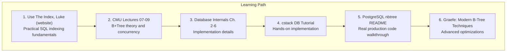

# Module 3: B-Trees & Indexing -- Resources and Links

## Foundational Papers

### The Original B-Tree Paper
- **"Organization and Maintenance of Large Ordered Indexes"** -- Rudolf Bayer, Edward McCreight (1970)
- The paper that started it all. Introduces the B-Tree data structure for efficient disk-based indexing.
- https://infolab.usc.edu/csci585/Spring2010/den_articles/indexing.pdf

### The B+Tree Refinement
- **"The Ubiquitous B-Tree"** -- Douglas Comer (1979)
- Excellent survey of B-Tree variants and their properties. Covers B+Trees, B*-Trees, and practical considerations.
- https://dl.acm.org/doi/10.1145/356770.356776

### Lehman-Yao B-link Trees
- **"Efficient Locking for Concurrent Operations on B-Trees"** -- Philip Lehman, S. Bing Yao (1981)
- Introduces the B-link tree with right-link pointers for improved concurrent access. The basis for PostgreSQL's nbtree implementation.
- https://www.csd.uoc.gr/~hy460/pdf/p650-lehman.pdf

### ARIES Recovery for B-Trees
- **"ARIES/IM: An Efficient and High Concurrency Index Management Method Using Write-Ahead Logging"** -- C. Mohan, Frank Levine (1992)
- How to make B-Tree operations crash-safe using WAL.
- https://dl.acm.org/doi/10.1145/141484.130338

---

## Books

### Database Internals by Alex Petrov
- **Chapters 2-6** cover B-Trees, B+Trees, on-disk structures, and index implementations in depth.
- The single best modern reference for B-Tree implementation details.
- https://www.databass.dev/

### Database System Concepts (Silberschatz, Korth, Sudarshan)
- **Chapter 14: Indexing** -- comprehensive textbook coverage of B+Trees with formal proofs.
- Standard graduate-level reference.

### Designing Data-Intensive Applications by Martin Kleppmann
- **Chapter 3: Storage and Retrieval** -- practical comparison of B-Trees vs LSM-Trees.
- Excellent for understanding trade-offs in real systems.
- https://dataintensive.net/

### The Art of PostgreSQL by Dimitri Fontaine
- Practical guide to PostgreSQL indexing strategies with real-world examples.
- https://theartofpostgresql.com/

---

## Source Code References

### PostgreSQL nbtree Implementation
- **nbtsearch.c** -- Search and scan: https://github.com/postgres/postgres/blob/master/src/backend/access/nbtree/nbtsearch.c
- **nbtinsert.c** -- Insert and split: https://github.com/postgres/postgres/blob/master/src/backend/access/nbtree/nbtinsert.c
- **nbtree.c** -- Handler entry points: https://github.com/postgres/postgres/blob/master/src/backend/access/nbtree/nbtree.c
- **nbtsort.c** -- Bulk loading: https://github.com/postgres/postgres/blob/master/src/backend/access/nbtree/nbtsort.c
- **nbtdedup.c** -- Deduplication (PG 13+): https://github.com/postgres/postgres/blob/master/src/backend/access/nbtree/nbtdedup.c
- **nbtree README** -- Design overview: https://github.com/postgres/postgres/blob/master/src/backend/access/nbtree/README

### SQLite B-Tree Implementation
- SQLite's B-Tree is in a single file (`btree.c`) and is well-documented.
- https://github.com/sqlite/sqlite/blob/master/src/btree.c
- Architecture doc: https://www.sqlite.org/arch.html

### InnoDB B-Tree (MySQL)
- Source code overview of InnoDB's clustered index implementation.
- https://github.com/mysql/mysql-server/tree/trunk/storage/innobase/btr

### LMDB (Lightning Memory-Mapped Database)
- Copy-on-write B+Tree implementation. Single-file, crash-proof, zero-copy reads.
- https://github.com/LMDB/lmdb
- Technical paper: https://www.openldap.org/pub/hyc/mdm-paper.pdf

---

## Video Lectures

### CMU Database Group (Andy Pavlo)
- **Lecture 07: Tree Indexes (Part 1)** -- B+Tree structure, operations, design choices
  - https://www.youtube.com/watch?v=bz_SFnCFmY0
- **Lecture 08: Tree Indexes (Part 2)** -- Concurrency control, latch crabbing, B-link trees
  - https://www.youtube.com/watch?v=c5OpaKqlYN0
- **Lecture 09: Index Concurrency Control** -- Optimistic latch coupling, Bw-Trees
  - https://www.youtube.com/watch?v=keJJfmY1bSY
- Full course: https://15445.courses.cs.cmu.edu/

### MIT 6.830 Database Systems
- **Lecture on B+Trees and Indexing**
- https://ocw.mit.edu/courses/6-830-database-systems-fall-2010/

### UC Berkeley CS186
- **Lecture on B+Trees** by Joe Hellerstein
- Clear explanations with animations of insert/delete operations.
- https://www.youtube.com/playlist?list=PLYp4IGUhNFmw8USiYMJvCUjZe79fvyYge

---

## Blog Posts and Articles

### How Database Indexes Work
- **"How Does a Database Index Work?"** -- Clear introductory explanation with diagrams.
- https://use-the-index-luke.com/

### Use The Index, Luke (Markus Winand)
- Comprehensive guide to SQL indexing and query optimization. Covers B-Tree internals, composite indexes, partial indexes, and query plan analysis across PostgreSQL, MySQL, Oracle, and SQL Server.
- https://use-the-index-luke.com/sql/table-of-contents

### PostgreSQL B-Tree Internals
- **"PostgreSQL B-Tree Index Internals"** -- Deep dive into PostgreSQL's nbtree.
- https://postgrespro.com/blog/pgsql/4161516

### PostgreSQL Index Types
- **"PostgreSQL Index Types"** -- Overview of B-Tree, Hash, GIN, GiST, BRIN with practical examples.
- https://postgrespro.com/blog/pgsql/3994098

### The Morning Paper: B-Tree Papers
- Summaries of key B-Tree research papers with explanations.
- https://blog.acolyer.org/

### B-Tree Visualization
- Interactive B-Tree visualization tool -- insert keys and watch the tree rebalance.
- https://www.cs.usfca.edu/~galles/visualization/BPlusTree.html

---

## Interactive Tools and Visualizations

### B+Tree Visualization (University of San Francisco)
- Insert, delete, and search with animated step-by-step visualization.
- https://www.cs.usfca.edu/~galles/visualization/BPlusTree.html

### B-Tree Visualization (David Galles)
- Standard B-Tree (not B+Tree) visualization for comparison.
- https://www.cs.usfca.edu/~galles/visualization/BTree.html

### Algorithm Visualizer
- General-purpose algorithm visualizer with B-Tree support.
- https://algorithm-visualizer.org/

### DB Fiddle
- Test SQL index performance across PostgreSQL, MySQL, SQLite.
- https://www.db-fiddle.com/

---

## Implementation References and Tutorials

### Build Your Own Database
- **"Let's Build a Simple Database"** (cstack) -- Step-by-step B-Tree implementation in C, modeled after SQLite.
- https://cstack.github.io/db_tutorial/

### Rust B-Tree Implementations
- **sled** -- Modern embedded database in Rust using a B-link tree variant.
- https://github.com/spacejam/sled
- **rust-rocksdb** -- Rust bindings for RocksDB (LSM-Tree, good for comparison).
- https://github.com/rust-rocksdb/rust-rocksdb

### C B+Tree Implementation
- **bpt** -- Clean, educational B+Tree implementation in C.
- https://github.com/amittai/bpt

### Go B+Tree Implementation
- **bbolt** -- Production B+Tree database in Go (used by etcd).
- https://github.com/etcd-io/bbolt

---

## Research Papers (Advanced)

### Modern B-Tree Techniques
- **"Modern B-Tree Techniques"** -- Goetz Graefe (2011)
- Comprehensive 90-page survey of every B-Tree optimization technique used in modern databases.
- https://dl.acm.org/doi/10.1561/1900000028

### Bw-Tree (Lock-Free B-Tree)
- **"The Bw-Tree: A B-tree for New Hardware Platforms"** -- Microsoft Research (2013)
- Lock-free B-Tree design used in SQL Server Hekaton.
- https://www.microsoft.com/en-us/research/wp-content/uploads/2016/02/bw-tree-icde2013-final.pdf

### ART (Adaptive Radix Tree)
- **"The Adaptive Radix Tree"** -- Viktor Leis et al. (2013)
- Alternative to B-Trees for in-memory indexes. Used by HyPer and DuckDB.
- https://db.in.tum.de/~leis/papers/ART.pdf

### FAST (Fast Architecture Sensitive Tree)
- **"FAST: Fast Architecture Sensitive Tree Search on Modern CPUs and GPUs"** -- Changkyu Kim et al. (2010)
- B-Tree variant optimized for SIMD and cache-line sizes.
- https://dl.acm.org/doi/10.1145/1807167.1807206

### Fractal Trees / Buffer Trees
- **"An Introduction to Be-trees and Write-Optimization"** -- Michael Bender et al.
- The theory behind TokuDB's fractal tree indexes.
- https://www.usenix.org/publications/loginonline/introduction-be-trees-and-write-optimization

---

## PostgreSQL Indexing Documentation

### Official Docs
- **Index Types:** https://www.postgresql.org/docs/current/indexes-types.html
- **Multicolumn Indexes:** https://www.postgresql.org/docs/current/indexes-multicolumn.html
- **Index-Only Scans:** https://www.postgresql.org/docs/current/indexes-index-only-scans.html
- **Partial Indexes:** https://www.postgresql.org/docs/current/indexes-partial.html
- **Expression Indexes:** https://www.postgresql.org/docs/current/indexes-expressional.html
- **EXPLAIN output:** https://www.postgresql.org/docs/current/using-explain.html

### MySQL / InnoDB Indexing
- **InnoDB Index Types:** https://dev.mysql.com/doc/refman/8.0/en/innodb-index-types.html
- **Clustered and Secondary Indexes:** https://dev.mysql.com/doc/refman/8.0/en/innodb-index-types.html

---

## Benchmarking and Performance

### Index Performance Testing
- **pgbench** -- PostgreSQL's built-in benchmarking tool.
- https://www.postgresql.org/docs/current/pgbench.html

### Sysbench
- Cross-database benchmarking with index-heavy workloads.
- https://github.com/akopytov/sysbench

### pg_stat_user_indexes
- PostgreSQL view for monitoring index usage (scans, tuples read/fetched).
- https://www.postgresql.org/docs/current/monitoring-stats.html

---

## Summary: Recommended Reading Order

| Level | Resource | Time |
|-------|----------|------|
| Beginner | Use The Index, Luke | 2-3 hours |
| Beginner | CMU Lecture 07 (video) | 1.5 hours |
| Intermediate | Database Internals Ch. 2-4 | 4-6 hours |
| Intermediate | Build your own DB (cstack) | 8-12 hours |
| Advanced | PostgreSQL nbtree source code | 4-8 hours |
| Advanced | Graefe survey paper | 6-10 hours |
| Expert | Lehman-Yao paper | 2-3 hours |
| Expert | Bw-Tree / ART papers | 3-5 hours each |
