# Module 3: Project -- Implement a Persistent B+Tree Index

## Project Overview

Build a **disk-backed B+Tree** that persists data to a file, supporting insert, search, range scan, and delete operations. This is the data structure at the heart of every relational database's index system.

By the end of this project you will have a working persistent index that can:
- Insert millions of key-value pairs
- Search for any key in 3-4 disk reads
- Perform range scans by following leaf-node links
- Delete keys with proper merge/redistribute handling
- Survive process restarts (data persists on disk)

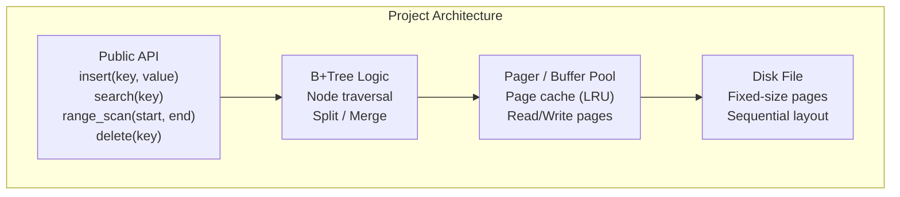

---

## Milestone 1: The Pager (Page I/O Layer)

**Goal:** Build the layer that reads and writes fixed-size pages from a file.

### Specification

```
Page size: 4096 bytes (4 KB)
Page 0: Reserved for metadata (root page ID, tree height, next free page)
Pages 1+: Tree nodes
```

### Tasks

1. **Define the page format:**
   - Page 0 (metadata): magic number, version, root_page_id, next_page_id, tree_height
   - All other pages: raw 4096-byte buffers

2. **Implement basic operations:**
   - `allocate_page() -> PageId` -- returns the next available page ID
   - `read_page(page_id) -> [u8; 4096]` -- reads a page from disk
   - `write_page(page_id, data: [u8; 4096])` -- writes a page to disk
   - `flush()` -- ensures all writes are persisted (fsync)

3. **Add a simple page cache:**
   - LRU cache of recently accessed pages
   - Dirty page tracking
   - Flush dirty pages on eviction or explicit flush

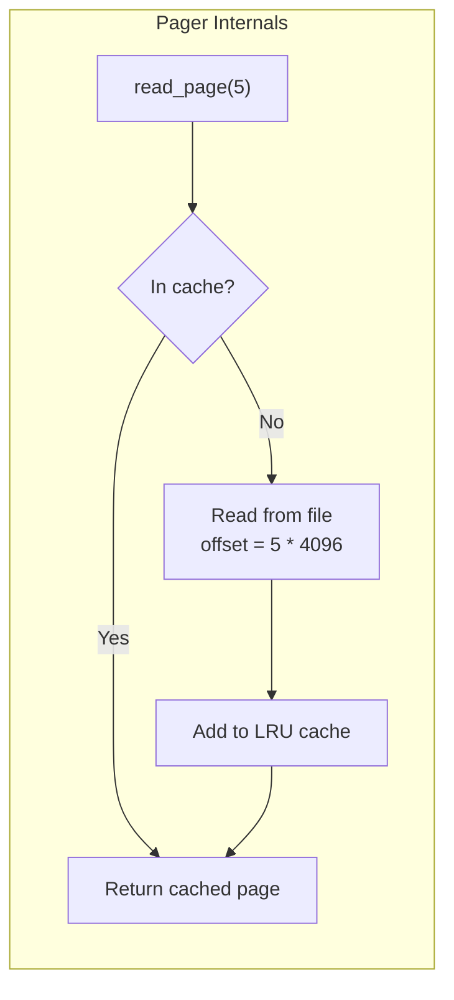

### Suggested Data Structures

```rust
struct Pager {
    file: File,
    page_size: usize,           // 4096
    num_pages: u64,             // Total pages allocated
    cache: LruCache<PageId, CachedPage>,
}

struct CachedPage {
    data: [u8; PAGE_SIZE],
    dirty: bool,
}
```

### Test Checkpoint

```
[x] Can write a page and read it back
[x] Data survives closing and reopening the file
[x] Cache returns same data as disk
[x] allocate_page returns sequential IDs
```

---

## Milestone 2: Node Serialization

**Goal:** Define internal and leaf node structures and serialize/deserialize them to/from pages.

### Node Layouts

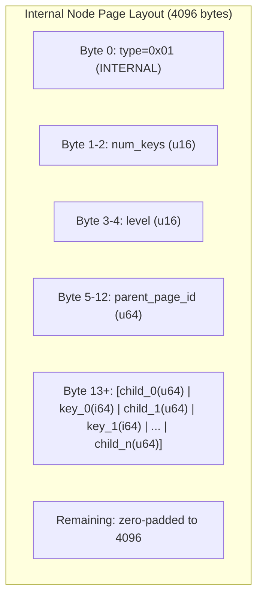

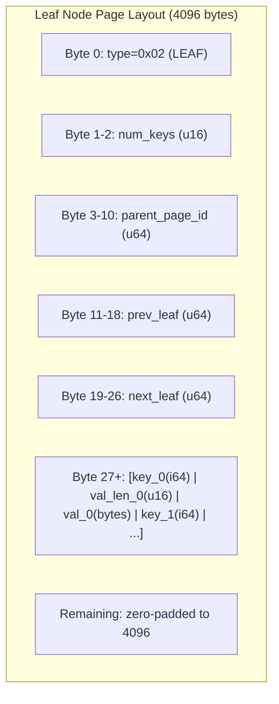

### Tasks

1. **Define node types** (enum: Internal / Leaf)
2. **Implement `serialize_node(node) -> [u8; 4096]`**
3. **Implement `deserialize_node(page_data) -> Node`**
4. **Calculate the maximum order** for your page size and key/value sizes
5. **Handle edge cases:** empty nodes, maximum-size nodes

### Capacity Calculation

```
Internal node capacity:
  Header: 13 bytes
  Available: 4096 - 13 = 4083 bytes
  Per entry: 8 (child) + 8 (key) = 16 bytes, plus one extra child (8 bytes)
  Max keys: floor((4083 - 8) / 16) = 254
  Max children: 255
  ORDER = 255

Leaf node capacity:
  Header: 27 bytes
  Available: 4096 - 27 = 4069 bytes
  Per entry (fixed 8-byte value): 8 (key) + 8 (value) = 16 bytes
  Max keys: floor(4069 / 16) = 254
```

### Test Checkpoint

```
[x] Serialize an internal node and deserialize it back - identical
[x] Serialize a leaf node and deserialize it back - identical
[x] Full node (254 keys) serializes within 4096 bytes
[x] Empty node serializes and deserializes correctly
```

---

## Milestone 3: Search

**Goal:** Implement B+Tree search (point lookup).

### Algorithm

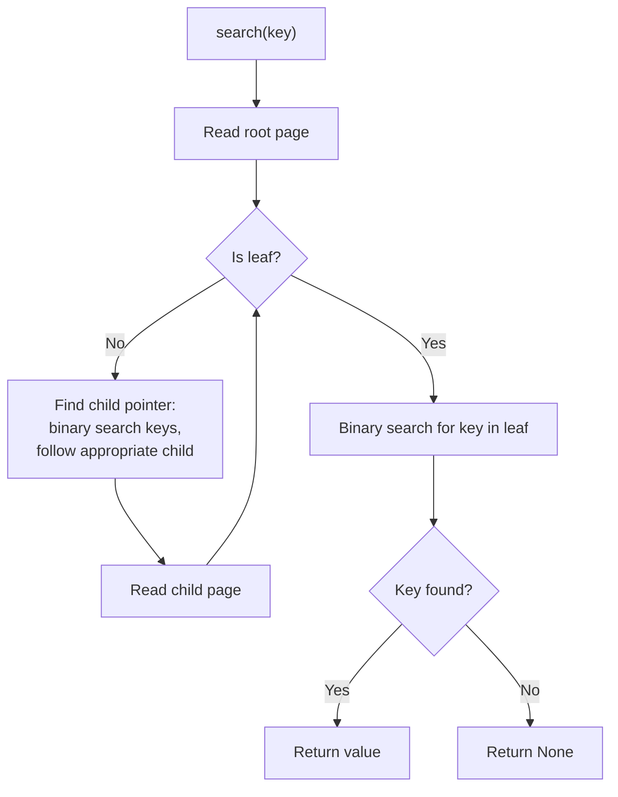

### Tasks

1. **Implement `find_leaf(key) -> LeafNode`** -- traverse from root to correct leaf
2. **Implement `search(key) -> Option<Value>`** -- find_leaf + binary search in leaf
3. **Track pages read** for performance metrics

### Test Checkpoint

```
[x] Search in empty tree returns None
[x] Insert one key, search finds it
[x] Insert 1000 keys, search finds all of them
[x] Search for non-existent key returns None
[x] Verify page read count equals tree height
```

---

## Milestone 4: Insert with Splits

**Goal:** Implement insertion with automatic page splitting.

### Split Procedure

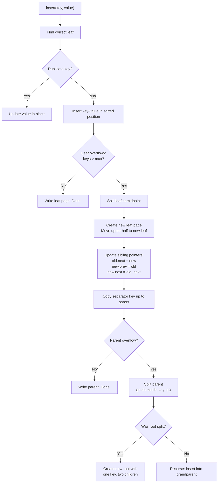

### Important Details

- **Leaf split:** Copy the middle key up (the key exists in both the parent and the new leaf)
- **Internal split:** Push the middle key up (the key moves to the parent and is removed from the splitting node)
- **Root split:** Creates a new root, increasing tree height by 1

### Tasks

1. **Implement leaf split**
2. **Implement internal node split**
3. **Implement root split** (tree grows taller)
4. **Update sibling pointers** during leaf splits
5. **Handle cascading splits** (split propagating up multiple levels)

### Test Checkpoint

```
[x] Insert ORDER keys without split (fill one leaf)
[x] Insert ORDER+1 keys triggers first split
[x] Insert enough keys to trigger root split (tree height increases)
[x] Insert 10,000 random keys, search finds all of them
[x] Verify tree invariants after mass insertion:
    - All leaves at same depth
    - Internal nodes have keys.len() + 1 children
    - Leaf sibling chain covers all keys in order
```

---

## Milestone 5: Range Scan

**Goal:** Implement range queries using the leaf-node linked list.

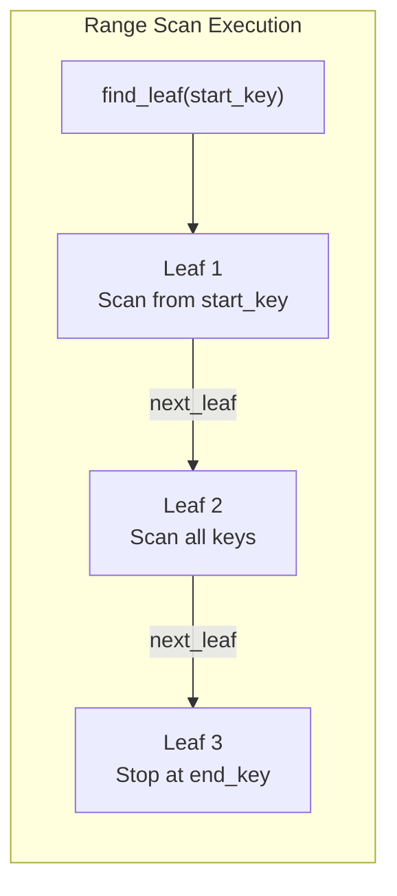

### Tasks

1. **Implement `range_scan(start_key, end_key) -> Vec<(Key, Value)>`**
2. **Implement `scan_all() -> Vec<(Key, Value)>`** (full index scan via leaf chain)
3. **Implement iterator/cursor interface** for streaming large results

### Test Checkpoint

```
[x] Range scan on empty tree returns empty
[x] Range scan returns keys in sorted order
[x] Range scan with start=min, end=max returns all keys
[x] Range scan across multiple leaf pages works
[x] scan_all returns same results as searching every key individually
```

---

## Milestone 6: Delete with Merge/Redistribute

**Goal:** Implement deletion with proper underflow handling.

### Delete Decision Tree

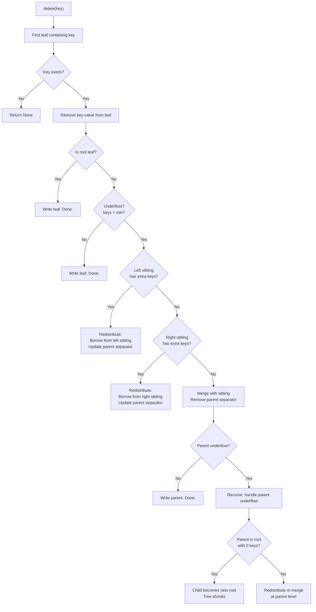

### Tasks

1. **Implement basic delete** (remove from leaf, no underflow handling)
2. **Implement leaf redistribution** (borrow from sibling)
3. **Implement leaf merge** (combine with sibling)
4. **Implement internal node underflow handling** (redistribute/merge at internal level)
5. **Implement tree shrinking** (root with one child -> child becomes root)
6. **Free merged pages** (add to free list for reuse)

### Test Checkpoint

```
[x] Delete from leaf with enough keys (no underflow)
[x] Delete triggering redistribution from left sibling
[x] Delete triggering redistribution from right sibling
[x] Delete triggering merge
[x] Delete triggering cascading merge up to root
[x] Delete all keys from tree, tree becomes empty
[x] Insert, delete, re-insert cycle works correctly
[x] After mass deletion, tree invariants still hold
```

---

## Milestone 7: Benchmarks

**Goal:** Benchmark your B+Tree against linear scan and demonstrate the performance advantage.

### Benchmark Design

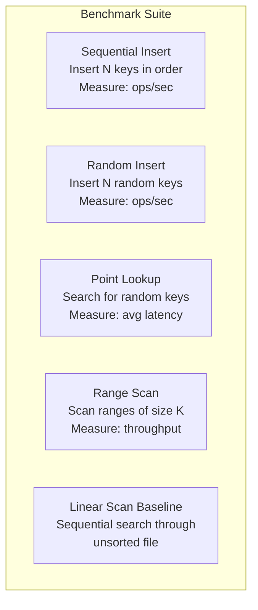

### Tasks

1. **Implement a baseline linear scan** (search through an unsorted flat file)
2. **Benchmark insert throughput** for 10K, 100K, 1M keys
3. **Benchmark search latency:** B+Tree vs linear scan
4. **Benchmark range scan throughput**
5. **Measure and report:**
   - Pages read per operation
   - Tree height at each scale
   - Total file size (index overhead)

### Expected Results

```
| Operation        | N=10,000  | N=100,000  | N=1,000,000 |
|-----------------|-----------|------------|-------------|
| Insert (ops/s)  | ~50,000   | ~30,000    | ~15,000     |
| Search (us)     | ~5        | ~8         | ~12         |
| Linear scan (us)| ~500      | ~5,000     | ~50,000     |
| Range(100) (us) | ~20       | ~25        | ~30         |
| Tree height     | 2         | 3          | 3           |
| Pages read/search| 2        | 3          | 3           |
```

### Test Checkpoint

```
[x] B+Tree search is at least 100x faster than linear scan at N=100,000
[x] Tree height grows logarithmically (height 3 serves up to ~16 million keys)
[x] Range scan throughput is proportional to result size, not table size
```

---

## Milestone 8: Tree Visualization

**Goal:** Print a human-readable visualization of the B+Tree structure.

### Output Format

```
B+Tree (height=3, pages=12, keys=45)
============================================================

Level 0 (Root):
  Page 1: [25 | 50]

Level 1 (Internal):
  Page 2: [10 | 18]  -->  Page 3: [30 | 40]  -->  Page 4: [60 | 75]

Level 2 (Leaves):
  Page 5: [2,5,8] -> Page 6: [10,12,15,18] -> Page 7: [20,22,25] ->
  Page 8: [30,33,35,40] -> Page 9: [42,45,48,50] ->
  Page 10: [55,58,60] -> Page 11: [65,70,75] -> Page 12: [80,85,90]
```

### Tasks

1. **Implement BFS traversal** of the tree
2. **Print each level** with node contents
3. **Show leaf chain** with arrows
4. **Display statistics:** height, total pages, total keys, average fill factor

### Visualization as Mermaid

Optionally, generate Mermaid diagram syntax:

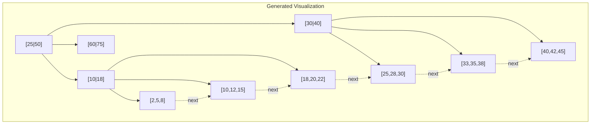

---

## Stretch Goals

### Stretch 1: Variable-Length Keys

Support string keys using a slotted-page layout within each node. Slot pointers at the top of the page, key data growing from the bottom.

### Stretch 2: Free Page Management

Maintain a free list of pages freed by deletes/merges. Allocate from the free list before extending the file.

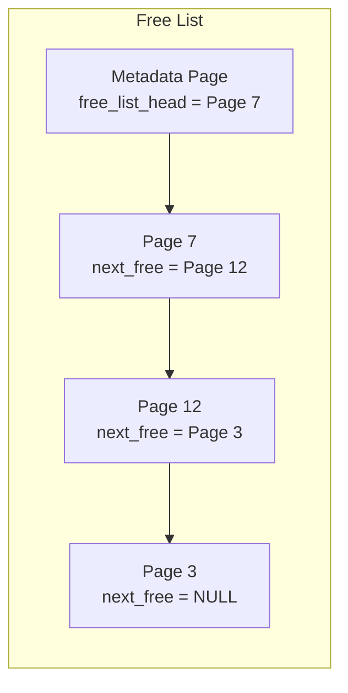

### Stretch 3: WAL (Write-Ahead Log)

Add crash recovery by writing a WAL before modifying pages:
1. Write operation to WAL (append-only sequential I/O)
2. Modify page in buffer pool
3. On restart: replay WAL to recover uncommitted changes

### Stretch 4: Concurrent Access

Add reader-writer latches per page using the latch crabbing protocol. Support concurrent inserts and searches.

### Stretch 5: Bulk Loading

Implement the bottom-up bulk loading algorithm:
1. Sort all key-value pairs
2. Write leaf pages sequentially
3. Build internal levels bottom-up

Compare performance against one-by-one insertion.

---

## Project Structure

```
btree-index/
  src/
    main.rs          -- CLI interface and benchmarks
    pager.rs         -- Page I/O and caching
    node.rs          -- Node types, serialization
    btree.rs         -- B+Tree operations (search, insert, delete)
    range.rs         -- Range scan and iterators
    visualize.rs     -- Tree printing / Mermaid generation
  tests/
    pager_test.rs    -- Pager unit tests
    node_test.rs     -- Serialization round-trip tests
    btree_test.rs    -- Insert/search/delete integration tests
    range_test.rs    -- Range scan tests
    stress_test.rs   -- Large-scale insert/delete/search
  benches/
    benchmark.rs     -- Criterion benchmarks
  Cargo.toml
```

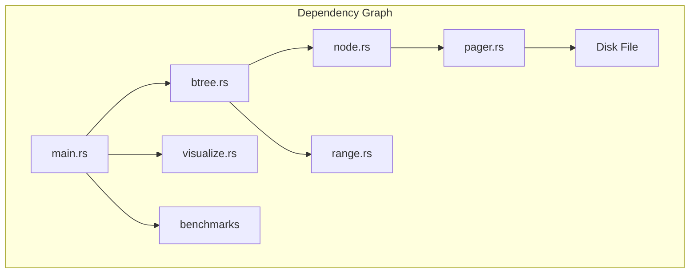

---

## Grading Rubric

| Milestone | Weight | Criteria |
|-----------|--------|----------|
| 1. Pager | 10% | Pages read/write correctly, survive restart |
| 2. Serialization | 10% | Nodes round-trip perfectly |
| 3. Search | 15% | Point lookups work at all scales |
| 4. Insert + Split | 25% | Splits work correctly, tree invariants maintained |
| 5. Range Scan | 10% | Leaf chain traversal works |
| 6. Delete + Merge | 15% | Underflow handling works, tree shrinks |
| 7. Benchmarks | 10% | Comparison with linear scan, measurements reported |
| 8. Visualization | 5% | Readable tree output |

**Total: 100%**

---

## Tips

1. **Start with a small order** (4 or 5) so splits happen frequently and are easy to debug
2. **Write invariant checks** early: all leaves at same depth, keys sorted, child counts correct, sibling chain complete
3. **Test with sequential AND random keys** -- they exercise different code paths
4. **Print the tree** after every operation during debugging
5. **The hardest part is delete** -- get insert and search working perfectly first
6. **Keep the pager simple** initially -- add caching after correctness is verified
