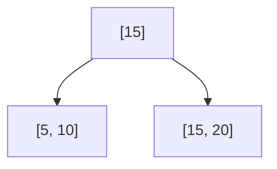
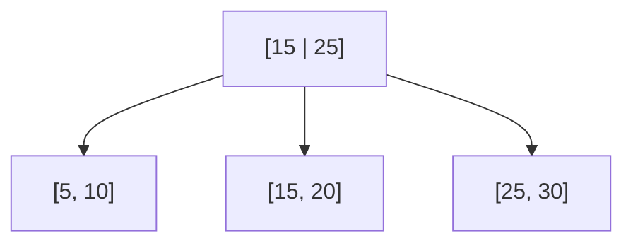
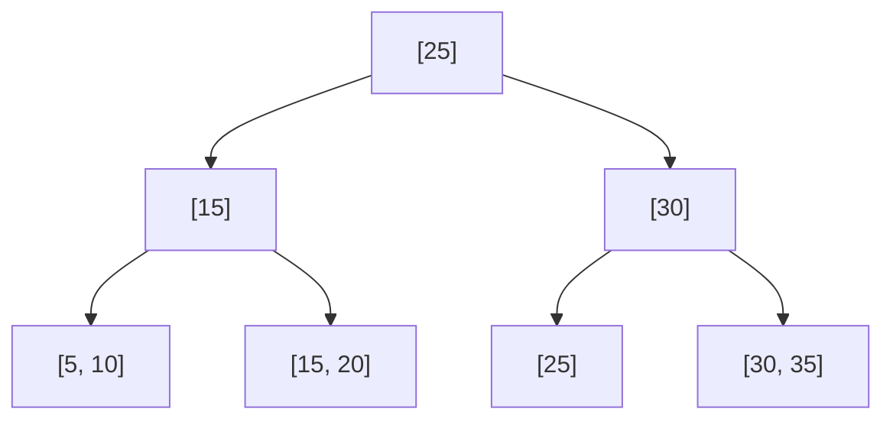
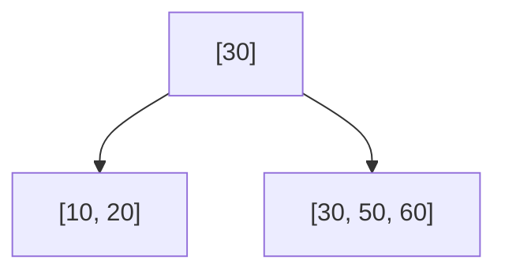

# Module 3: B-Trees & Indexing -- Quiz Questions

## Instructions

This file contains 30 questions covering B+Tree operations, index selection, performance analysis, and concurrency. Answers are hidden in collapsible sections.

---

## Section 1: B+Tree Fundamentals

### Question 1: B-Tree vs B+Tree

What are the two key structural differences between a B-Tree and a B+Tree? Why do databases overwhelmingly prefer B+Trees?

<details>
<summary>Answer</summary>

**Difference 1:** In a B-Tree, values (data pointers or actual data) are stored in both internal and leaf nodes. In a B+Tree, values are stored ONLY in leaf nodes. Internal nodes contain only separator keys and child pointers.

**Difference 2:** In a B+Tree, all leaf nodes are linked together in a doubly-linked list. B-Trees have no such linking.

**Why B+Trees are preferred:**
1. Internal nodes without values have higher fanout (more keys per page), resulting in a shorter tree and fewer I/Os
2. The leaf-node linked list enables efficient range scans without tree re-traversal
3. Full table scans can simply walk the leaf chain
4. All lookups traverse to leaf level, making performance more predictable

</details>

### Question 2: Height Calculation

A B+Tree has a fanout of 200 (each internal node has up to 200 children). How many keys can the tree hold at heights 1, 2, 3, and 4? Approximately how tall would a tree need to be to index 10 billion rows?

<details>
<summary>Answer</summary>

Each internal node holds up to 199 keys and 200 children.

- **Height 1** (root is a leaf): 199 keys
- **Height 2** (root + leaves): 200 * 199 = 39,800 keys
- **Height 3**: 200 * 200 * 199 = ~7.96 million keys
- **Height 4**: 200^3 * 199 = ~1.59 billion keys
- **Height 5**: 200^4 * 199 = ~318 billion keys

For 10 billion rows: height 5 is needed (since height 4 only covers ~1.6 billion).

However, in practice, leaf nodes may hold fewer keys due to value storage, so height 5 is correct.

</details>

### Question 3: Fill Factor

Explain what fill factor means for a B+Tree index. What is the trade-off between a 100% fill factor and a 70% fill factor?

<details>
<summary>Answer</summary>

**Fill factor** is the percentage of each page that is filled with data when the index is initially built (or rebuilt).

**100% fill factor:**
- Pro: Smallest possible index, fewer pages, more cache-friendly
- Con: The very next insert into any page will cause a page split
- Best for: Read-only or append-only tables

**70% fill factor:**
- Pro: 30% free space absorbs inserts without immediate splits, reducing write amplification
- Con: Larger index on disk, more pages to scan for range queries
- Best for: Tables with frequent random inserts/updates

PostgreSQL defaults to 90% fill factor for B-Tree indexes. InnoDB uses a similar concept with its merge threshold.

</details>

### Question 4: Node Capacity

Given a page size of 8192 bytes, a page header of 24 bytes, and 8-byte integer keys with 6-byte child pointers, calculate: (a) the maximum fanout of an internal node, and (b) the maximum number of key-value pairs in a leaf node if each value is a 6-byte TID and leaf nodes also have two 8-byte sibling pointers.

<details>
<summary>Answer</summary>

**(a) Internal node fanout:**
```
Available space = 8192 - 24 = 8168 bytes
Each entry: 8 bytes (key) + 6 bytes (child ptr) = 14 bytes
Plus one extra child pointer: 6 bytes

fanout = floor((8168 - 6) / 14) + 1 = floor(8162 / 14) + 1 = 583 + 1 = 584
Maximum keys = 583
```

**(b) Leaf node capacity:**
```
Available space = 8192 - 24 - 8 (prev ptr) - 8 (next ptr) = 8152 bytes
Each entry: 8 bytes (key) + 6 bytes (TID) = 14 bytes

Maximum key-value pairs = floor(8152 / 14) = 582
```

</details>

---

## Section 2: B+Tree Operations

### Question 5: Insert Sequence

Starting with an empty B+Tree of order 4 (max 3 keys per node), insert the following keys in order: 10, 20, 5, 15, 25, 30, 35. Draw the tree after each split.

<details>
<summary>Answer</summary>

**Insert 10:** `[10]`

**Insert 20:** `[10, 20]`

**Insert 5:** `[5, 10, 20]`

**Insert 15:** Leaf is full. Split at midpoint.



**Insert 25:** Goes into right leaf: `[15, 20, 25]`

**Insert 30:** Right leaf is full. Split.



**Insert 35:** Goes into rightmost leaf: `[25, 30, 35]`... leaf is full. Split. Root is also full (3 keys). Root splits.



Note: The exact split point depends on the implementation. Some implementations split before the key causing overflow, others after. The above uses the convention of splitting when a 4th key is added to a max-3 node.

</details>

### Question 6: Delete with Redistribution

Given the following B+Tree (order 4), delete key 20. Show the redistribution step.

```
        [30]
       /    \
  [10,20]   [30,40,50]
```

<details>
<summary>Answer</summary>

After deleting 20 from the left leaf, it has only 1 key `[10]`. Minimum keys for order 4 is `ceil(4/2) - 1 = 1`, so actually `[10]` is acceptable for order 4 (min 1 key per leaf).

However, if we use the convention that min keys = `ceil((order-1)/2)` = 2, then `[10]` underflows.

**Redistribution from right sibling:**
1. Borrow the leftmost key (30) from the right sibling
2. Update the parent separator key to 40 (the new first key of right sibling)

```
        [40]
       /    \
  [10,30]   [40,50]
```

</details>

### Question 7: Delete with Merge

Given the following B+Tree (order 4), delete key 40. Show the merge step.

```
           [30 | 50]
          /    |    \
    [10,20] [30,40] [50,60]
```

<details>
<summary>Answer</summary>

After deleting 40, the middle leaf becomes `[30]` which has only 1 key.

Check siblings:
- Left sibling `[10,20]` has 2 keys (minimum), cannot redistribute
- Right sibling `[50,60]` has 2 keys (minimum), cannot redistribute

**Merge middle leaf with right sibling:**
1. Combine `[30]` and `[50,60]` into `[30,50,60]`
2. Remove separator key 50 from parent
3. Parent becomes `[30]` with children `[10,20]` and `[30,50,60]`



</details>

### Question 8: Range Query Mechanics

Explain step-by-step how a B+Tree executes: `SELECT * FROM orders WHERE amount BETWEEN 100 AND 500`

<details>
<summary>Answer</summary>

1. **Descend to leaf:** Starting from the root, perform a standard B+Tree search for key 100. At each internal node, binary search for the child pointer where 100 would reside. Follow pointers down to the leaf level.

2. **Position in leaf:** Binary search within the leaf node for the first key >= 100.

3. **Scan forward:** Starting from that position, read all keys in the current leaf that are <= 500.

4. **Follow next-leaf pointer:** When the end of the current leaf is reached, follow the `next_leaf` pointer to the next leaf node.

5. **Continue scanning:** Read keys from subsequent leaf nodes until a key > 500 is encountered or the leaf chain ends.

6. **Fetch rows:** For each matching key, use the associated value (TID or primary key) to fetch the full row from the heap/clustered index.

The I/O cost is: `height` (for the initial descent) + number of leaf pages in the range + number of heap pages accessed.

</details>

---

## Section 3: Index Selection and Design

### Question 9: Composite Index Order

You have the table `orders(id, customer_id, status, created_at, total)` and these queries:

```sql
-- Q1: Most frequent
SELECT * FROM orders WHERE customer_id = ? AND status = 'active' ORDER BY created_at DESC;

-- Q2: Moderate frequency
SELECT * FROM orders WHERE customer_id = ? AND created_at > '2025-01-01';

-- Q3: Rare
SELECT total FROM orders WHERE status = 'active';
```

Design an optimal set of indexes.

<details>
<summary>Answer</summary>

**Best index:** `CREATE INDEX idx_orders_main ON orders(customer_id, status, created_at DESC);`

This single index serves both Q1 and Q2:
- **Q1:** Uses all three columns in order. The `customer_id` equality, `status` equality, and `created_at DESC` for ordering. This is a perfect index -- no sort needed.
- **Q2:** Uses `customer_id` (equality) and `created_at` (range). It skips `status` but still uses the leftmost prefix `(customer_id)` and can range-scan `created_at` within each status value.

For **Q3** (rare), adding an index is questionable. If needed:
`CREATE INDEX idx_orders_status ON orders(status) INCLUDE (total);`
This would be a covering index for Q3, but since it is rare, the cost may not be justified.

**Do NOT create:** `CREATE INDEX idx ON orders(status, customer_id, created_at)` because `status` has low cardinality and should not be the leading column for Q1/Q2.

</details>

### Question 10: Leftmost Prefix Rule

Given a composite index on `(A, B, C, D)`, which of the following WHERE clauses can use the index? Mark each as FULL use, PARTIAL use, or NO use.

1. `WHERE A = 1`
2. `WHERE A = 1 AND B = 2`
3. `WHERE A = 1 AND C = 3`
4. `WHERE B = 2 AND C = 3`
5. `WHERE A = 1 AND B > 5 AND C = 3`
6. `WHERE A = 1 AND B = 2 AND D = 4`
7. `WHERE D = 4`
8. `WHERE A = 1 AND B = 2 AND C = 3 AND D = 4`

<details>
<summary>Answer</summary>

1. `WHERE A = 1` -- **FULL use** (uses prefix A)
2. `WHERE A = 1 AND B = 2` -- **FULL use** (uses prefix A, B)
3. `WHERE A = 1 AND C = 3` -- **PARTIAL use** (uses A only; C cannot be used because B is skipped)
4. `WHERE B = 2 AND C = 3` -- **NO use** (A is missing from the prefix)
5. `WHERE A = 1 AND B > 5 AND C = 3` -- **PARTIAL use** (uses A, B for range; C cannot be used because B is a range predicate, not equality)
6. `WHERE A = 1 AND B = 2 AND D = 4` -- **PARTIAL use** (uses A, B; D cannot be used because C is skipped)
7. `WHERE D = 4` -- **NO use** (A is missing)
8. `WHERE A = 1 AND B = 2 AND C = 3 AND D = 4` -- **FULL use** (uses all four columns)

**Key rule:** The index is used left-to-right. Once a column is used for a range predicate (>, <, BETWEEN) or is skipped, no further columns in the index can be used for filtering.

</details>

### Question 11: Covering Index

Explain why the following query can be served as an "index-only scan" with the given index, and why the second query cannot.

```sql
CREATE INDEX idx ON employees(department_id, salary);

-- Query A (index-only scan possible)
SELECT department_id, salary FROM employees WHERE department_id = 5;

-- Query B (index-only scan NOT possible)
SELECT department_id, salary, name FROM employees WHERE department_id = 5;
```

<details>
<summary>Answer</summary>

**Query A** can use an index-only scan because ALL columns in both the WHERE clause (`department_id`) and the SELECT list (`department_id`, `salary`) are present in the index. The database never needs to access the heap table.

**Query B** cannot use an index-only scan because `name` is in the SELECT list but NOT in the index. The database must look up each matching row in the heap to retrieve the `name` column. This is called a "bookmark lookup" or "heap fetch."

To make Query B use an index-only scan:
```sql
CREATE INDEX idx ON employees(department_id) INCLUDE (salary, name);
```

Note: In PostgreSQL, an index-only scan also requires that the visibility map indicates all tuples on the heap page are visible (to avoid checking heap tuple visibility).

</details>

### Question 12: Hash vs B+Tree

For each scenario, would you choose a Hash index or a B+Tree index? Explain why.

1. Primary key lookups on a user table
2. Range queries on a timestamp column
3. Join on a foreign key with equality
4. ORDER BY queries
5. Unique constraint enforcement

<details>
<summary>Answer</summary>

1. **Primary key lookups:** **B+Tree** (or Hash). Hash is theoretically faster (O(1) vs O(log n)), but B+Tree is more versatile. In PostgreSQL, B+Tree is preferred because it also handles range queries and sorting. InnoDB always uses B+Tree for primary keys (clustered).

2. **Range queries on timestamp:** **B+Tree**. Hash indexes cannot answer range queries at all. B+Trees maintain sorted order and can efficiently scan ranges.

3. **Join on foreign key (equality):** **Either**. Hash is marginally faster for pure equality. B+Tree is more flexible if you ever need range lookups on the FK. In practice, B+Tree is almost always chosen.

4. **ORDER BY queries:** **B+Tree**. Hash indexes have no ordering. B+Trees return results in sorted order, potentially eliminating a sort step entirely.

5. **Unique constraint enforcement:** **B+Tree**. While Hash can check for duplicates, B+Tree is used because unique constraints in PostgreSQL and MySQL are always implemented via B+Tree indexes.

**Bottom line:** B+Tree is nearly always the right choice. Hash indexes are a niche optimization for pure equality lookups on very large tables where the O(1) vs O(log n) difference matters.

</details>

---

## Section 4: Performance Analysis

### Question 13: Index Scan vs Sequential Scan

A table has 1 million rows across 10,000 pages. A query matches 15% of the rows. The table has a B+Tree index on the queried column. Will the optimizer choose an index scan or a sequential scan? Why?

<details>
<summary>Answer</summary>

The optimizer will almost certainly choose a **sequential scan**.

**Why:** 15% of 1 million rows = 150,000 rows. With an unclustered index, each matching row could be on a different heap page, potentially requiring up to 150,000 random I/O operations. A sequential scan reads all 10,000 pages with sequential I/O.

Random I/O is ~50-100x more expensive than sequential I/O on HDDs and ~4-10x on SSDs. At 15%, the random I/O cost of the index scan far exceeds the sequential scan cost.

**Typical crossover point:** Databases switch from index scan to sequential scan when selectivity exceeds roughly 5-15% of the table, depending on:
- Storage type (HDD vs SSD)
- Whether the index is clustered (clustered indexes remain efficient at higher selectivities)
- Available memory for bitmap scans (PostgreSQL can convert random I/O to sequential via bitmap heap scan)

</details>

### Question 14: Write Amplification

You insert a single 200-byte row into a table with 3 B+Tree indexes. The page size is 8 KB. Calculate the worst-case write amplification (assuming all index leaf pages are full and split).

<details>
<summary>Answer</summary>

**Heap write:**
- Read heap page: 8 KB
- Write heap page: 8 KB
- WAL record: ~300 bytes

**Per index (worst case -- split):**
- Read leaf page: 8 KB
- Write original leaf: 8 KB
- Write new leaf (split): 8 KB
- Write parent (new separator): 8 KB
- WAL records for split: ~500 bytes

**Total for 3 indexes with splits:**
```
Heap: 8 KB write + 300 B WAL
Index 1: 24 KB writes + 500 B WAL (split)
Index 2: 24 KB writes + 500 B WAL (split)
Index 3: 24 KB writes + 500 B WAL (split)

Total physical writes: 8 + 24 + 24 + 24 = 80 KB
Total WAL: ~1.8 KB

Logical data written: 200 bytes
Write amplification: 80,000 / 200 = 400x
```

This is the worst case. Average case (no splits) would be ~4 page writes (heap + 3 index leaves) = 32 KB, or 160x amplification.

</details>

### Question 15: Index Selectivity

A `users` table has 1,000,000 rows. Calculate the selectivity and determine if an index would be useful for each column:

1. `id` (primary key, all unique)
2. `country` (200 distinct values)
3. `is_active` (2 distinct values: true/false, 90% true)
4. `email` (999,000 distinct values, some duplicates)
5. `created_year` (5 distinct values)

<details>
<summary>Answer</summary>

Selectivity = distinct values / total rows:

1. **id:** 1,000,000 / 1,000,000 = 1.0 -- **Excellent** for indexing. Each lookup returns 1 row.

2. **country:** 200 / 1,000,000 = 0.0002 -- **Marginal**. Each value matches ~5,000 rows. Useful for queries filtering to small countries, but for large countries (e.g., USA with 200K rows), a sequential scan is faster.

3. **is_active:** 2 / 1,000,000 = 0.000002 -- **Poor** for standard index. 90% of rows are "true", so `WHERE is_active = true` matches 900K rows (sequential scan wins). However, a **partial index** `WHERE is_active = false` is excellent (only 100K rows = 10%).

4. **email:** 999,000 / 1,000,000 = 0.999 -- **Excellent** for indexing. Nearly unique.

5. **created_year:** 5 / 1,000,000 = 0.000005 -- **Poor**. Each value matches ~200K rows. Not useful as a standalone index. Might be useful as part of a composite index.

</details>

---

## Section 5: Concurrency

### Question 16: Latch Crabbing

Two transactions are running concurrently on a B+Tree:
- T1: INSERT key 50
- T2: SEARCH for key 75

Using the latch crabbing protocol, describe the sequence of latch acquisitions and releases. Can T2 proceed while T1 holds latches?

<details>
<summary>Answer</summary>

Assume the tree has: Root -> Internal nodes -> Leaf nodes.

**T1 (INSERT 50):**
1. Acquire X-latch on Root
2. Acquire X-latch on Internal node (child of root where 50 belongs)
3. Internal node is SAFE (has room for potential split propagation) -> Release X-latch on Root
4. Acquire X-latch on Leaf node where 50 belongs
5. Leaf is SAFE (has room) -> Release X-latch on Internal
6. Insert 50 into Leaf
7. Release X-latch on Leaf

**T2 (SEARCH 75) -- running concurrently:**
1. Attempt to acquire S-latch on Root
   - If T1 still holds X-latch on Root: T2 **blocks** (X and S are incompatible)
   - If T1 has already released Root (step 3): T2 **proceeds**
2. Once T2 gets S-latch on Root, it acquires S-latch on the child node for 75
3. Releases S-latch on Root
4. Continues down to leaf level

**Key insight:** T2 can proceed as soon as T1 releases the root latch (which happens quickly if the child is safe). The latches are held very briefly, so concurrency is high in practice.

</details>

### Question 17: Why Not Lock the Whole Tree?

Why is locking the entire B+Tree for every operation unacceptable in a production database?

<details>
<summary>Answer</summary>

1. **Throughput collapse:** A busy OLTP system may perform thousands of index operations per second. A global tree lock serializes all operations, turning the multi-core server into a single-threaded system.

2. **Reader-writer starvation:** Readers block writers and vice versa. Long-running range scans would block all inserts.

3. **Most operations only touch 3-4 pages** out of potentially millions. A global lock protects pages that are not even accessed.

4. **The root is a bottleneck.** Every operation starts at the root. Even with read-write locks, the root becomes a contention point. Latch crabbing releases the root as soon as possible.

5. **Real-world latency:** Under a global lock, the 99th percentile latency for a simple point lookup could be hundreds of milliseconds (waiting for a concurrent long-running scan to finish). With latch crabbing, it is microseconds.

</details>

### Question 18: B-link Tree Advantage

In a standard B+Tree with latch crabbing, a page split requires holding latches on both the splitting page and its parent simultaneously. How does the Lehman-Yao B-link tree avoid this requirement?

<details>
<summary>Answer</summary>

The B-link tree adds two features to each node:
1. A **right-link pointer** to the right sibling at the same level
2. A **high key** indicating the upper bound of keys the node should contain

**Split protocol (no simultaneous parent latch needed):**
1. Lock the full node (X-latch)
2. Create the new right sibling with the upper half of keys
3. Set the right-link of the old node to point to the new sibling
4. Set the high key of the old node to the split key
5. Unlock the old node
6. Later (separately), lock the parent and insert the new separator key

**Why this is safe:** If a concurrent reader arrives at the old node looking for a key that was moved to the new sibling, it notices the key exceeds the node's high key and follows the right-link to find it. The tree is always in a consistent (if temporarily unbalanced) state.

**Benefit:** The split is broken into two independent steps. The parent latch is never held simultaneously with the child latch during a split, eliminating deadlock potential and reducing contention.

</details>

---

## Section 6: Advanced Topics

### Question 19: Clustered vs Secondary Index Lookup Cost

In InnoDB, a table has a clustered index on `id` and a secondary index on `email`. Compare the I/O cost of:
- `SELECT * FROM users WHERE id = 42`
- `SELECT * FROM users WHERE email = 'test@example.com'`

<details>
<summary>Answer</summary>

**Clustered index lookup (`id = 42`):**
- Traverse the primary key B+Tree from root to leaf: ~3-4 page reads
- The leaf page contains the full row data
- **Total: 3-4 I/Os**

**Secondary index lookup (`email = 'test@example.com'`):**
- Traverse the secondary index B+Tree from root to leaf: ~3-4 page reads
- The leaf contains the primary key value (e.g., `id = 42`)
- Now traverse the clustered index to find the full row: ~3-4 page reads
- **Total: 6-8 I/Os (double lookup)**

The secondary index lookup is roughly 2x the cost due to the bookmark lookup into the clustered index. This is why InnoDB covering indexes (which avoid the second lookup) are so important.

</details>

### Question 20: Prefix Compression

Given these consecutive keys in a B+Tree internal node, apply prefix compression and calculate the space savings:

```
"user:profile:alice:settings"
"user:profile:alice:theme"
"user:profile:bob:settings"
"user:profile:bob:theme"
"user:profile:carol:settings"
```

<details>
<summary>Answer</summary>

**Common prefix for all:** `"user:profile:"`  (13 bytes)

**Compressed representation:**
```
Prefix: "user:profile:" (13 bytes, stored once)
Suffixes:
  "alice:settings"  (14 bytes)
  "alice:theme"     (11 bytes)
  "bob:settings"    (12 bytes)
  "bob:theme"       (9 bytes)
  "carol:settings"  (15 bytes)
```

**Space calculation:**
- Uncompressed: 28 + 24 + 25 + 22 + 27 = 126 bytes
- Compressed: 13 (prefix) + 14 + 11 + 12 + 9 + 15 = 74 bytes
- **Savings: 52 bytes = 41%**

In practice, prefix compression can reduce B+Tree index size by 30-60% for keys with common prefixes (URLs, file paths, composite keys).

</details>

### Question 21: Bulk Loading

Why is bulk loading (bottom-up construction) 2-5x faster than inserting keys one at a time into a B+Tree?

<details>
<summary>Answer</summary>

**One-at-a-time insertion problems:**
1. Each insert requires a root-to-leaf traversal: O(log n) I/Os
2. Pages are written multiple times as they fill and split
3. Splits cause cascading writes up the tree
4. Resulting tree is only ~69% full (due to random split points)
5. No sequential I/O benefit -- pages are accessed randomly

**Bulk loading advantages:**
1. Sort all keys first (one sequential pass)
2. Fill leaf pages sequentially to 100% (or desired fill factor) -- purely sequential writes
3. Build parent levels bottom-up -- each page is written exactly once
4. No splits needed at all
5. Resulting tree is 100% full (maximum fanout, minimum height)
6. Sequential I/O throughout: sort is O(N log N) with external merge sort, build is O(N/B)

**PostgreSQL implementation:** `CREATE INDEX` uses the bulk-loading path (`nbtsort.c`). It sorts all tuples, builds leaves left-to-right, then constructs parent levels. This is why `CREATE INDEX` after loading data is much faster than having the index present during the load.

</details>

### Question 22: BRIN vs B+Tree

When would you choose a BRIN index over a B+Tree? Give a concrete scenario.

<details>
<summary>Answer</summary>

**Choose BRIN when:**
1. The table is very large (millions+ rows)
2. The indexed column is naturally correlated with physical row order (i.e., the data is physically sorted or nearly sorted by that column)
3. You need a very small index footprint

**Concrete scenario:** A time-series logging table where rows are always inserted in chronological order:

```sql
CREATE TABLE sensor_readings (
    id BIGSERIAL,
    sensor_id INT,
    reading_time TIMESTAMPTZ,  -- always increasing
    value DOUBLE PRECISION
);

-- BRIN index on reading_time
CREATE INDEX idx_brin_time ON sensor_readings USING brin(reading_time);
```

With 1 billion rows across 10 million pages:
- **B+Tree index size:** ~6 GB
- **BRIN index size:** ~5 MB (stores min/max per range of 128 pages)

The BRIN index is 1000x smaller. For a query like `WHERE reading_time BETWEEN '2025-01-01' AND '2025-01-02'`, the BRIN index quickly identifies which page ranges to scan, skipping the rest.

**Do NOT use BRIN when:** Data is randomly ordered with respect to the indexed column (e.g., indexing `email` on an insertion-ordered table). Every block range would contain the full range of emails, making the index useless.

</details>

### Question 23: GIN Index Internals

How does a GIN (Generalized Inverted Index) differ structurally from a B+Tree? Why is it better for full-text search?

<details>
<summary>Answer</summary>

**Structural difference:**

A B+Tree maps each key to one value (TID). A GIN index maps each key (token/element) to a **posting list** -- a sorted list of all TIDs containing that key.

```
B+Tree:   key -> single TID
GIN:      key -> [TID1, TID2, TID3, ..., TIDn]  (posting list)
```

**Why it is better for full-text search:**

Consider searching for documents containing the word "database":

- **B+Tree on text column:** Cannot help. The key would be the entire text, and you are searching for a substring.
- **GIN on tsvector:** The word "database" is a key in the GIN index, pointing to a posting list of all document TIDs containing that word. Single lookup.

For multi-word queries (`"database" AND "index"`), GIN intersects the posting lists for each word, which is very efficient.

**Trade-off:** GIN indexes are expensive to update because inserting a new document requires adding TIDs to the posting lists of ALL contained tokens. PostgreSQL mitigates this with a "pending list" that batches updates.

</details>

### Question 24: Partial Index Design

Design a partial index for this scenario: An `orders` table has 50 million rows. 99% of orders have `status = 'completed'`. You frequently query for orders with `status = 'pending'` (0.5%) and `status = 'failed'` (0.5%).

<details>
<summary>Answer</summary>

```sql
CREATE INDEX idx_orders_pending ON orders(id, customer_id, created_at)
    WHERE status = 'pending';

CREATE INDEX idx_orders_failed ON orders(id, customer_id, created_at)
    WHERE status = 'failed';
```

**Why this is optimal:**

1. A full index on `status` would be 50 million entries. Since 99% are 'completed', the index is huge and mostly useless (queries for 'completed' would use sequential scan anyway).

2. The partial indexes only contain 250,000 entries each (0.5% of 50M), making them ~200x smaller.

3. Smaller index = fits in memory, faster traversal, faster maintenance.

4. Including `customer_id` and `created_at` enables covering index behavior for common queries on pending/failed orders.

**Note:** Queries must include the partial index predicate for the optimizer to use it:
```sql
-- Uses idx_orders_pending:
SELECT * FROM orders WHERE status = 'pending' AND created_at > '2025-01-01';

-- Does NOT use the partial index:
SELECT * FROM orders WHERE status = 'processing';
```

</details>

### Question 25: Index-Only Scan Visibility

In PostgreSQL, why can an index-only scan sometimes NOT be used even when the index covers all needed columns?

<details>
<summary>Answer</summary>

PostgreSQL uses **MVCC** (Multi-Version Concurrency Control), which means multiple versions of each row can exist. The index entry does not contain visibility information (transaction IDs, xmin/xmax).

To determine if a row is visible to the current transaction, PostgreSQL must check the **heap tuple's** visibility info. This defeats the purpose of an index-only scan.

**The solution: Visibility Map (VM)**

PostgreSQL maintains a visibility map with one bit per heap page. If the bit is set, ALL tuples on that page are visible to all transactions (i.e., the page is "all-visible").

For an index-only scan:
1. Find the matching index entry
2. Check the visibility map for the corresponding heap page
3. If the page is all-visible: skip the heap access (true index-only scan)
4. If the page is NOT all-visible: must fetch the heap tuple to check visibility

**When it fails:**
- Tables with many recent updates/deletes (pages not yet vacuumed)
- VACUUM has not run recently (VM not up-to-date)
- Hot standby replicas where the VM may lag

**Fix:** Run `VACUUM` to mark pages as all-visible in the VM.

</details>

---

## Section 7: Practical Scenarios

### Question 26: Slow Query Diagnosis

A query `SELECT * FROM products WHERE category_id = 5 ORDER BY price LIMIT 10` is slow despite having an index on `category_id`. What is likely happening and how would you fix it?

<details>
<summary>Answer</summary>

**Problem:** The index on `category_id` finds all products in category 5, but then the database must:
1. Fetch all matching rows from the heap
2. Sort them all by price
3. Return only the top 10

If category 5 has 100,000 products, the database fetches and sorts all 100,000 rows just to return 10.

**Fix:** Create a composite index:
```sql
CREATE INDEX idx_cat_price ON products(category_id, price);
```

Now the database can:
1. Seek to `category_id = 5` in the index
2. Read the first 10 entries (already sorted by price!)
3. Stop -- no need to read all 100,000 entries

The query goes from O(N log N) sorting to O(1) with the right index. The `LIMIT` can be pushed into the index scan.

</details>

### Question 27: Too Many Indexes

A table has 15 indexes. What problems does this cause?

<details>
<summary>Answer</summary>

1. **Write amplification:** Every INSERT must update all 15 indexes. Every UPDATE that changes an indexed column must update those indexes. DELETE must remove entries from all 15 indexes.

2. **Storage cost:** 15 indexes may consume 10-20x the space of the table itself.

3. **Planner overhead:** The query optimizer must consider all 15 indexes for every query, increasing planning time.

4. **VACUUM overhead:** Dead tuples must be cleaned from all 15 indexes during VACUUM.

5. **Cache pollution:** Index pages compete for buffer pool space. With 15 indexes, hot pages may be evicted more frequently.

6. **Lock contention:** More index page splits, more latch contention.

7. **Backup and replication:** Larger database = longer backups, more WAL traffic for replication.

**Solution:** Audit indexes regularly. Use `pg_stat_user_indexes` (PostgreSQL) to find unused indexes:
```sql
SELECT indexrelname, idx_scan FROM pg_stat_user_indexes
WHERE idx_scan = 0 ORDER BY pg_relation_size(indexrelid) DESC;
```

Drop indexes with zero scans (after monitoring for a full business cycle).

</details>

### Question 28: Multi-Column Index vs Multiple Single-Column Indexes

For the query `SELECT * FROM t WHERE a = 1 AND b = 2 AND c = 3`, compare a composite index `(a, b, c)` versus three separate indexes on `a`, `b`, and `c`.

<details>
<summary>Answer</summary>

**Composite index `(a, b, c)`:**
- Single B+Tree traversal (3-4 I/Os)
- Directly locates rows matching all three conditions
- Very efficient: O(log N) + result size

**Three separate indexes:**
- The optimizer picks the most selective single index, or uses **bitmap index scan**:
  1. Scan index on `a`: get bitmap of matching TIDs
  2. Scan index on `b`: get bitmap of matching TIDs
  3. AND the bitmaps together
  4. Scan index on `c`: get bitmap, AND again
  5. Fetch matching rows from heap

- **Problems:**
  - 3 separate B+Tree traversals
  - Bitmap operations add CPU overhead
  - More I/O: reading three index structures + heap
  - Cannot do index-only scan

**Composite is ~3-5x faster** for this specific query. The single-column indexes are more flexible (they can serve queries on `a` alone, `b` alone, etc.), but for this combined predicate, the composite index wins decisively.

</details>

### Question 29: Expression Index

A query `SELECT * FROM users WHERE LOWER(email) = 'test@example.com'` is doing a sequential scan despite having an index on `email`. Why? How do you fix it?

<details>
<summary>Answer</summary>

**Why the index is not used:** The index is on the column `email`, but the query applies the function `LOWER()` to the column. The database cannot use a B+Tree index on `email` to satisfy a predicate on `LOWER(email)` because:
- The index is sorted by raw `email` values
- `LOWER(email)` produces different sort order (e.g., 'Alice' and 'alice' are different in the index but identical after LOWER)
- The database would need to apply LOWER to every index entry, which is equivalent to a full scan

**Fix:** Create an expression index:
```sql
CREATE INDEX idx_lower_email ON users(LOWER(email));
```

Now the index is built on the lowercase values. The query `WHERE LOWER(email) = 'test@example.com'` directly matches the index keys.

**Alternative:** If your application always stores emails in lowercase, just index `email` directly and ensure the data is consistent.

</details>

### Question 30: Deadlock in B+Tree Operations

Can a deadlock occur during B+Tree operations? If so, describe a scenario. How do databases prevent this?

<details>
<summary>Answer</summary>

**Yes, deadlocks can occur** in naive B+Tree implementations:

**Scenario:**
1. T1 holds X-latch on leaf page A, needs to split, which requires X-latch on parent P
2. T2 holds X-latch on parent P (inserting into a different child), needs X-latch on leaf page A (to follow right-link after a concurrent split)
3. T1 waits for P, T2 waits for A: **deadlock**

**Prevention strategies:**

1. **Latch ordering:** Always acquire latches top-down (parent before child). Latch crabbing enforces this for normal operations. For splits that need parent access, release child latches first, re-acquire parent, then re-acquire child.

2. **B-link tree (Lehman-Yao):** Splits do not require simultaneous parent + child latches. The right-link allows the parent to be updated separately.

3. **No-wait policy:** If a latch cannot be acquired immediately, abort and retry the operation from the root. No waiting = no deadlock.

4. **Optimistic approach:** Use version numbers on pages. Read without latches, verify the version has not changed, retry if it has.

PostgreSQL uses the Lehman-Yao approach combined with careful latch ordering to prevent deadlocks in its nbtree implementation.

</details>
