# Module 3: B-Trees & Indexing -- Core Teaching

## 1. Why Indexes Exist: The Full Table Scan Problem

Imagine a table with 10 million rows stored across 100,000 disk pages. To find a single row by a non-indexed column, the database must perform a **full table scan** -- reading every single page from disk.

```
Query: SELECT * FROM users WHERE email = 'alice@example.com';

Without index:  Read 100,000 pages  -->  ~100,000 I/O operations
With index:     Read 3-4 pages      -->  ~4 I/O operations
```

The math is brutal. If each page read takes 10ms on a spinning disk:

| Approach | Pages Read | Time |
|----------|-----------|------|
| Full scan | 100,000 | ~16 minutes |
| B+Tree index (height 4) | 4 | ~40 ms |

Indexes are auxiliary data structures that maintain a **sorted mapping** from key values to the locations of the corresponding rows on disk. They trade extra write overhead and storage space for dramatically faster reads.

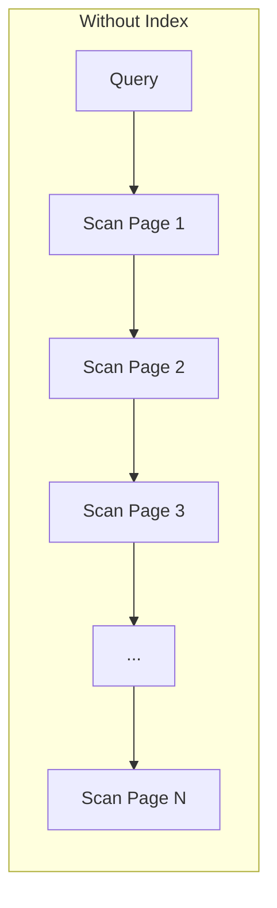

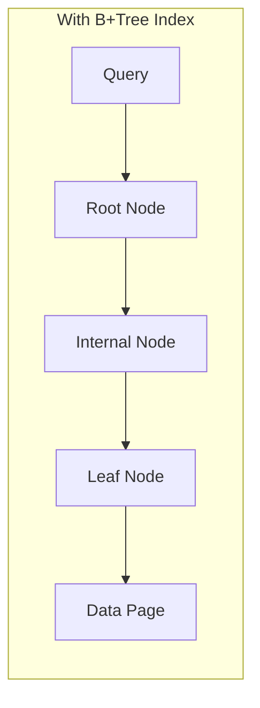

---

## 2. The Evolution: Binary Search Trees to B+Trees

### 2.1 Binary Search Trees (BSTs)

A BST provides O(log n) search by maintaining the invariant: left child < parent < right child. But BSTs have a critical problem -- they can become **unbalanced**, degenerating into a linked list with O(n) search.

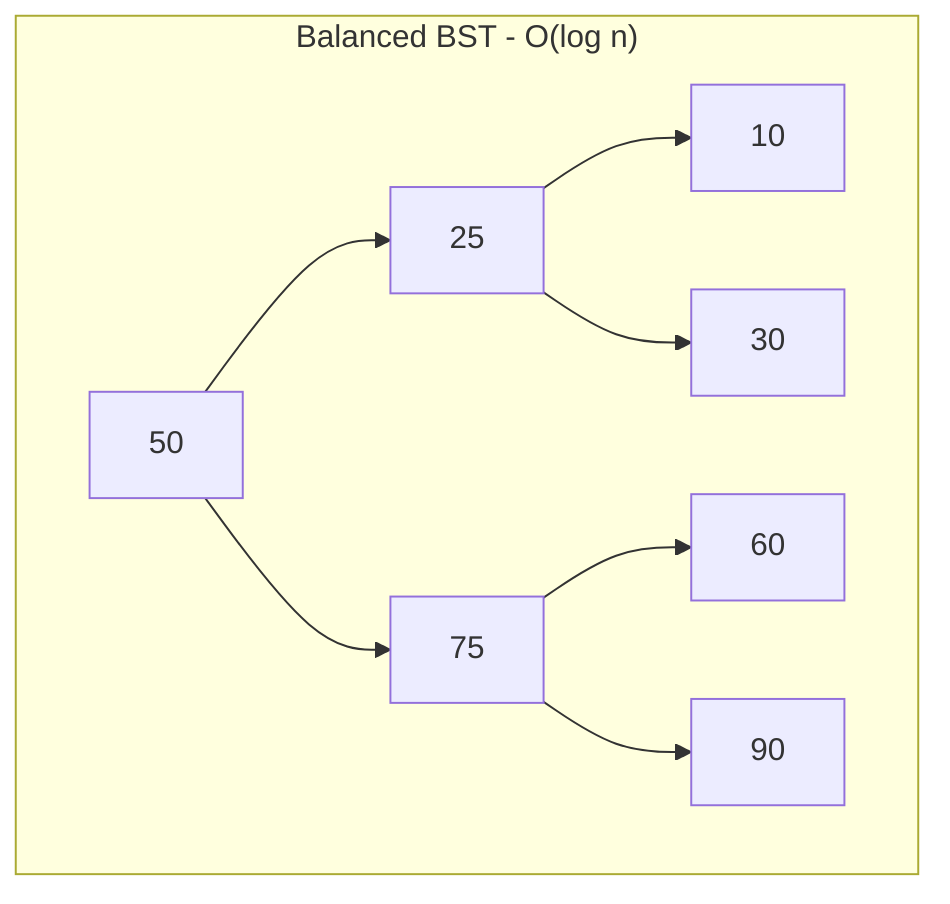

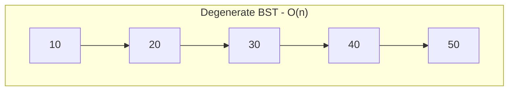

### 2.2 Balanced BSTs (AVL Trees, Red-Black Trees)

Balanced BSTs guarantee O(log n) height by rebalancing after every insert/delete. But they have a fatal flaw for databases: **each node holds one key and has two children**. This means:

- A tree with 1 million keys has height ~20
- Each level requires a separate disk I/O
- 20 random I/Os per lookup is too many

### 2.3 B-Trees

Rudolf Bayer and Edward McCreight invented the B-Tree in 1970 at Boeing Research Labs. The key insight: **make each node large enough to fill an entire disk page**, so one I/O reads hundreds of keys at once.

A B-Tree of order `m` has these properties:
- Each node holds up to `m-1` keys and `m` children
- All leaves are at the same depth
- Each internal node (except root) has at least `ceil(m/2)` children
- The root has at least 2 children (unless it is a leaf)

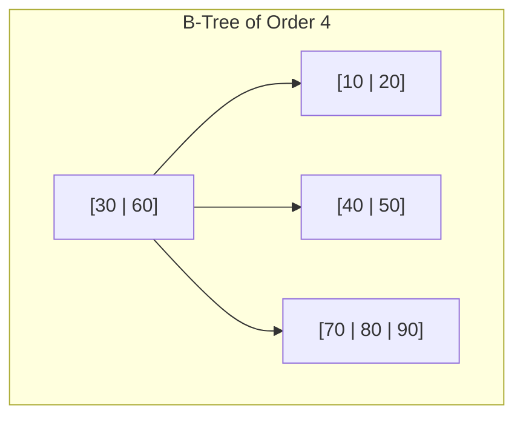

With a page size of 4 KB and 8-byte keys + 8-byte pointers, a single node can hold ~250 keys. A B-Tree of height 3 can index over 15 million keys with just 3 disk reads.

### 2.4 B+Trees: The Database Standard

B+Trees are a variant of B-Trees with two critical improvements:

1. **Only leaf nodes store values** (row pointers or actual data). Internal nodes store only keys and child pointers, maximizing fanout.
2. **Leaf nodes are linked** in a doubly-linked list, enabling efficient range scans.

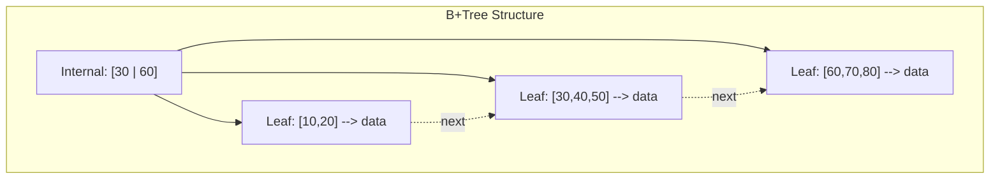

**Why B+Trees dominate:**

| Feature | B-Tree | B+Tree |
|---------|--------|--------|
| Values stored in | All nodes | Leaf nodes only |
| Internal node fanout | Lower (keys+values) | Higher (keys only) |
| Range queries | Require tree traversal | Follow leaf links |
| Full scan | Complex in-order traversal | Scan leaf chain |
| Cache efficiency | Lower | Higher (internal nodes are smaller) |

---

## 3. B+Tree Properties in Depth

### 3.1 Order (Branching Factor)

The **order** `m` of a B+Tree determines:
- Maximum keys per internal node: `m - 1`
- Maximum children per internal node: `m`
- Minimum keys per internal node (non-root): `ceil(m/2) - 1`
- Maximum keys per leaf node: `m - 1` (varies by implementation)

Typical database B+Trees have order 100-500, depending on page size and key size.

### 3.2 Fanout

**Fanout** is the average number of children per internal node. Higher fanout means a shorter tree.

```
Height = ceil(log_fanout(N))

Example: 100 million rows, fanout = 200
Height = ceil(log_200(100,000,000)) = ceil(3.47) = 4
```

Only 4 page reads to find any row among 100 million.

### 3.3 Fill Factor

The **fill factor** controls how full each page is kept during initial index creation:
- 100% fill factor: pages are packed full (good for read-only data)
- 70% fill factor: 30% free space left for future inserts (reduces splits)

PostgreSQL default fill factor for B-Tree indexes is 90%.

### 3.4 Height and Capacity

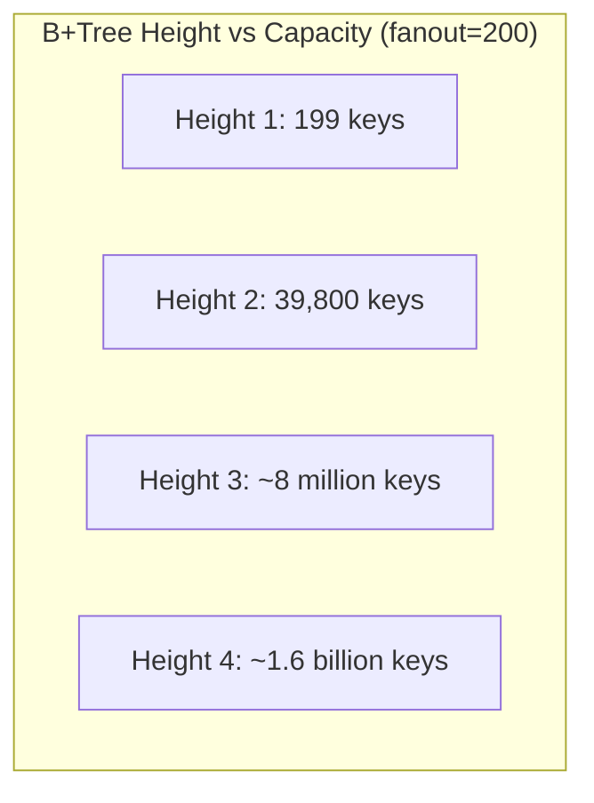

Most production B+Trees are 3-4 levels deep. The root page is almost always cached in the buffer pool, so real-world lookups require only 2-3 disk I/Os.

---

## 4. B+Tree Operations

### 4.1 Search

To search for key `K`:

1. Start at the root node
2. Find the smallest key `Ki` in the node where `K < Ki`
3. Follow the child pointer to the left of `Ki`
4. Repeat until reaching a leaf node
5. Scan the leaf for key `K`

```
SEARCH(node, key):
    if node is leaf:
        binary_search(node.keys, key)
        return node.values[position] or NOT_FOUND
    else:
        find i such that key < node.keys[i]
        return SEARCH(node.children[i], key)
```

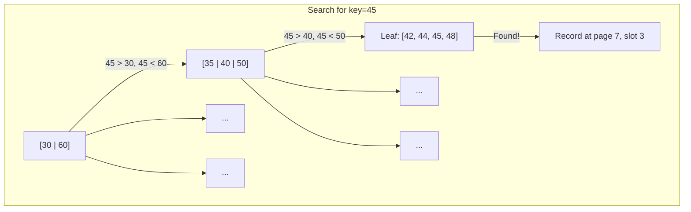

### 4.2 Range Scan

Range scans are where B+Trees truly shine over B-Trees:

1. Search for the start key to find the starting leaf
2. Follow the leaf-node linked list until the end key is reached

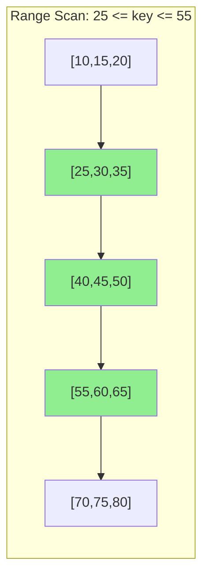

### 4.3 Insert

Inserting key `K`:

1. Search for the leaf node where `K` belongs
2. If the leaf has space, insert `K` in sorted order
3. If the leaf is full, **split** it

**Split algorithm:**

1. Create a new leaf node
2. Move the upper half of keys to the new node
3. Insert the **middle key** (copy) into the parent as a separator
4. If the parent overflows, split it too (recursively up to the root)
5. If the root splits, create a new root (tree grows taller)

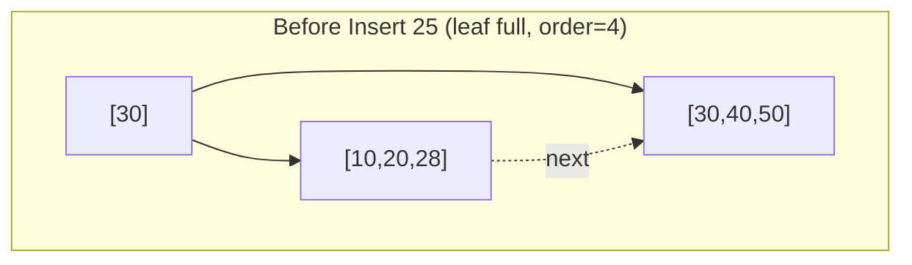

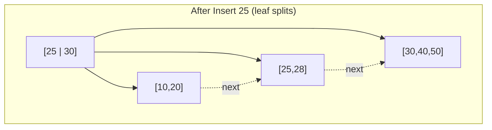

**Step-by-step example -- inserting keys 5, 15, 25, 35, 45 into a B+Tree of order 3:**

**Step 1: Insert 5** -- Tree is empty, create root leaf `[5]`

**Step 2: Insert 15** -- Root leaf has space: `[5, 15]`

**Step 3: Insert 25** -- Root leaf is full. Split:
- Left leaf: `[5]`
- Right leaf: `[15, 25]`
- New root (internal): `[15]`

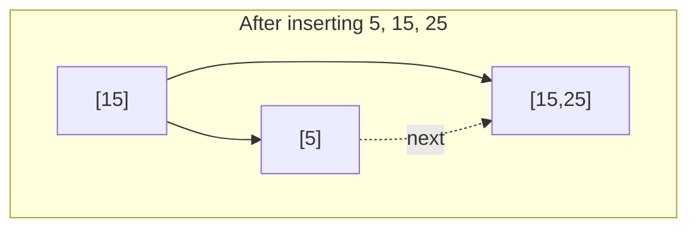

**Step 4: Insert 35** -- Goes to right leaf `[15,25]` which is full. Split:
- Left leaf: `[15]`
- Right leaf: `[25, 35]`
- Push `25` up to root: `[15, 25]`

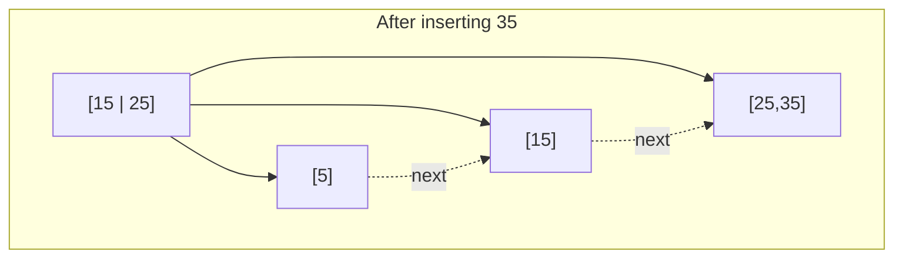

**Step 5: Insert 45** -- Goes to right leaf `[25,35]` which is full. Split:
- Leaf splits: `[25]` and `[35, 45]`
- Push `35` up to root `[15,25]` which is now full
- Root splits: new root `[25]`, children `[15]` and `[25,35]`

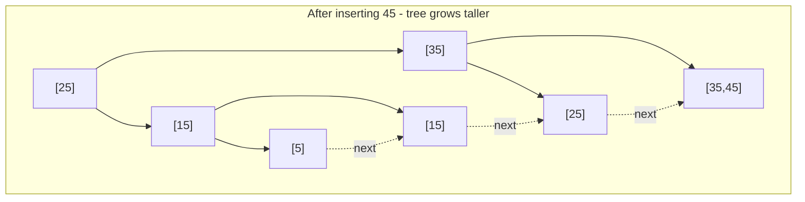

### 4.4 Delete

Deleting key `K`:

1. Search for the leaf containing `K`
2. Remove `K` from the leaf
3. If the leaf has fewer than minimum keys:
   a. **Redistribute** from a sibling if the sibling has extra keys
   b. **Merge** with a sibling if redistribution is not possible
4. If merging, remove the separator key from the parent
5. If the parent underflows, recursively redistribute or merge upward

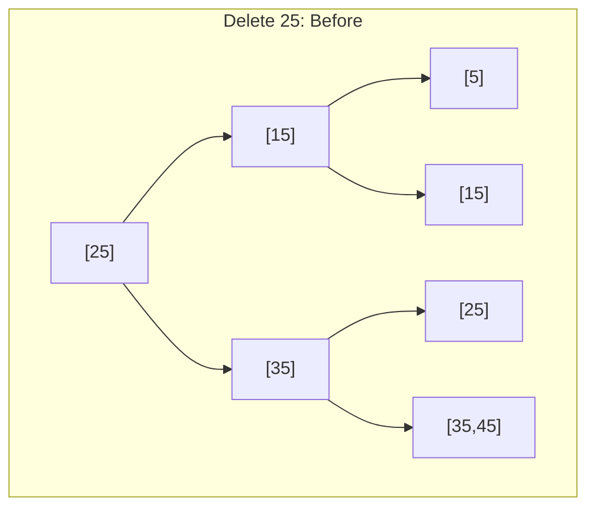

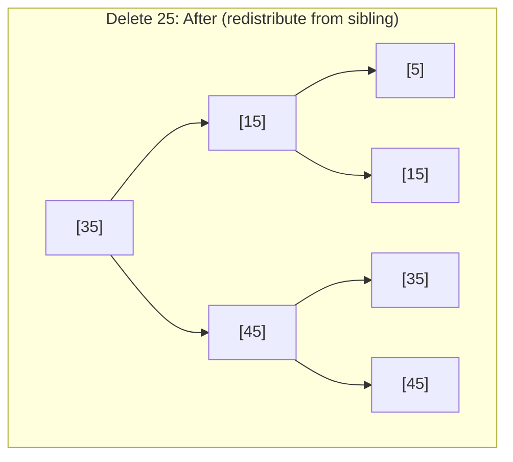

---

## 5. Clustered vs Unclustered Indexes

### Clustered Index

A **clustered index** determines the physical order of data on disk. The table data is stored sorted by the clustered index key. A table can have only ONE clustered index.

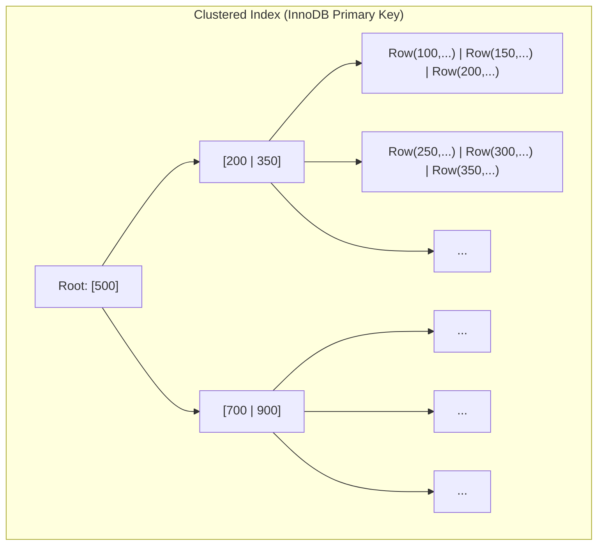

In InnoDB, the primary key IS the clustered index. Leaf nodes contain the **entire row data**.

### Unclustered (Secondary) Index

An **unclustered index** has leaf nodes that store pointers (row IDs or primary key values) back to the actual data, which may be in any order on disk.

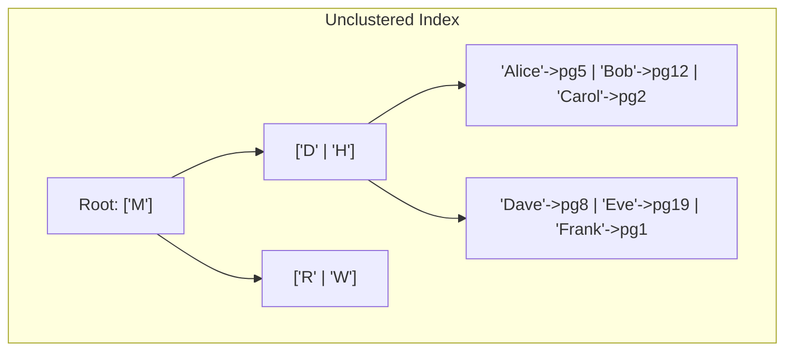

**Key difference:** A range scan on a clustered index reads sequential pages. A range scan on an unclustered index may cause random I/O to many different pages.

---

## 6. Primary vs Secondary Indexes

| Property | Primary Index | Secondary Index |
|----------|--------------|-----------------|
| Number per table | One | Many |
| Key | Usually primary key | Any column(s) |
| Leaf contains | Row data (clustered) or row pointer | Pointer to row (TID or PK) |
| Uniqueness | Enforced | Optional |
| NULL values | Not allowed (PK) | Allowed |

In PostgreSQL, the primary index is NOT clustered by default. The table is a heap and indexes point to it via tuple IDs (TIDs).

In InnoDB (MySQL), the primary index IS always clustered. Secondary indexes store the primary key value, requiring a **double lookup** (index seek + primary key seek) called a "bookmark lookup."

---

## 7. Composite (Compound) Indexes

A composite index is built on multiple columns. The keys are compared lexicographically.

```sql
CREATE INDEX idx_name_age ON users(last_name, first_name, age);
```

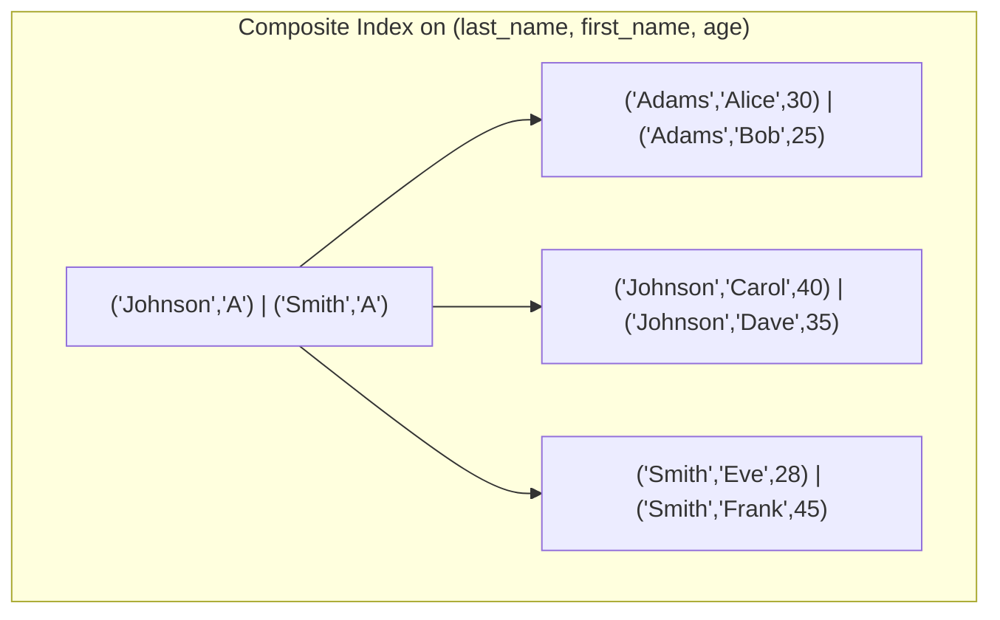

### The Leftmost Prefix Rule

A composite index on `(A, B, C)` can satisfy queries on:
- `A` alone
- `A, B` together
- `A, B, C` together

It **cannot** efficiently satisfy queries on:
- `B` alone
- `C` alone
- `B, C` together

Think of it like a phone book sorted by (last_name, first_name). You can look up all "Smiths" or "Smith, John" but not all "Johns" regardless of last name.

```
Index on (A, B, C):

WHERE A = 1                     -- YES, uses index
WHERE A = 1 AND B = 2           -- YES, uses index
WHERE A = 1 AND B = 2 AND C = 3 -- YES, uses index
WHERE B = 2                     -- NO, cannot use index
WHERE B = 2 AND C = 3           -- NO, cannot use index
WHERE A = 1 AND C = 3           -- PARTIAL: uses index for A only
```

---

## 8. Covering Indexes

A **covering index** contains all columns needed to answer a query, eliminating the need to access the base table at all. This is called an **index-only scan**.

```sql
-- Query:
SELECT last_name, first_name FROM users WHERE last_name = 'Smith';

-- Covering index:
CREATE INDEX idx_cover ON users(last_name, first_name);
```

PostgreSQL uses `INCLUDE` for non-key columns in covering indexes:

```sql
CREATE INDEX idx_cover ON users(last_name) INCLUDE (first_name, email);
```

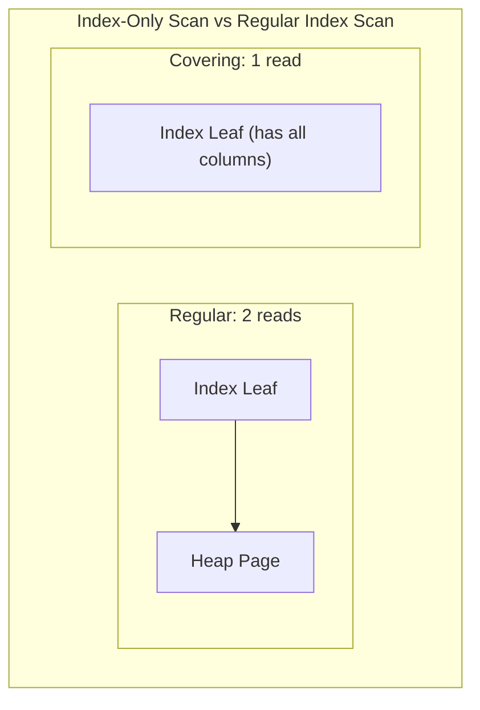

---

## 9. Hash Indexes

Hash indexes use a hash function to map keys directly to buckets.

**When hash indexes are better:**
- Exact equality lookups (`WHERE id = 42`)
- O(1) average lookup time vs O(log n) for B+Tree

**When hash indexes are worse:**
- Range queries (`WHERE age BETWEEN 20 AND 30`) -- completely useless
- Ordering (`ORDER BY`) -- no sorted structure
- Prefix matching (`WHERE name LIKE 'Smi%'`)
- They historically had durability issues (not WAL-logged in older PostgreSQL)

```mermaid
graph TD
    subgraph "Hash Index Structure"
        HF["Hash Function h(key)"]
        HF --> B0["Bucket 0: key=12->TID, key=44->TID"]
        HF --> B1["Bucket 1: key=7->TID, key=31->TID"]
        HF --> B2["Bucket 2: key=18->TID"]
        HF --> B3["Bucket 3: key=5->TID, key=29->TID"]
        B0 --> OV["Overflow page: key=88->TID"]
    end
```

PostgreSQL added crash-safe hash indexes in version 10 (WAL-logged). Before that, hash indexes were rebuilt on crash recovery.

---

## 10. Specialized Index Types

### 10.1 Partial Indexes

A partial index only covers rows matching a predicate. Smaller and more efficient for selective queries.

```sql
-- Only index active users (10% of table)
CREATE INDEX idx_active ON users(email) WHERE active = true;

-- Only index non-null values
CREATE INDEX idx_bio ON users(bio) WHERE bio IS NOT NULL;
```

### 10.2 Expression Indexes

Index on the result of a function or expression.

```sql
CREATE INDEX idx_lower_email ON users(lower(email));

-- Now this query uses the index:
SELECT * FROM users WHERE lower(email) = 'alice@example.com';
```

### 10.3 GIN (Generalized Inverted Index)

GIN indexes are designed for values that contain multiple elements: arrays, JSONB, full-text search vectors.

```mermaid
graph TD
    subgraph "GIN Index (Inverted Index)"
        GR["Root"]
        GR --> GE1["'database'"]
        GR --> GE2["'index'"]
        GR --> GE3["'query'"]
        GE1 --> GP1["Posting list: doc1, doc5, doc12"]
        GE2 --> GP2["Posting list: doc1, doc3, doc5"]
        GE3 --> GP3["Posting list: doc2, doc5, doc8"]
    end
```

```sql
-- Full-text search
CREATE INDEX idx_fts ON articles USING gin(to_tsvector('english', body));

-- JSONB containment
CREATE INDEX idx_jsonb ON events USING gin(payload jsonb_path_ops);
```

### 10.4 GiST (Generalized Search Tree)

GiST indexes support complex data types like geometric shapes, ranges, and full-text search. They work with containment, overlap, and nearest-neighbor queries.

```sql
-- Geometric range query
CREATE INDEX idx_geo ON places USING gist(location);

-- Range type
CREATE INDEX idx_range ON bookings USING gist(during);
```

### 10.5 BRIN (Block Range Index)

BRIN indexes store summary information (min/max) for ranges of physical table blocks. They are tiny but only useful for naturally ordered data (like timestamps in append-only tables).

```sql
CREATE INDEX idx_brin ON logs USING brin(created_at);
```

---

## 11. Index Selectivity and Cardinality

### Selectivity

**Selectivity** is the fraction of rows a predicate matches:

```
Selectivity = Number of distinct values / Total number of rows
```

- High selectivity (close to 1.0): many distinct values (e.g., email) -- good for indexing
- Low selectivity (close to 0): few distinct values (e.g., boolean) -- poor for indexing

### Cardinality

**Cardinality** is the number of distinct values in a column. The query optimizer uses cardinality statistics to decide whether to use an index.

```mermaid
graph LR
    subgraph "Index Usefulness"
        HC["High Cardinality<br/>email: 1M distinct / 1M rows<br/>Selectivity ≈ 1.0<br/>INDEX VERY USEFUL"]
        MC["Medium Cardinality<br/>city: 5000 distinct / 1M rows<br/>Selectivity ≈ 0.005<br/>INDEX USEFUL"]
        LC["Low Cardinality<br/>gender: 3 distinct / 1M rows<br/>Selectivity ≈ 0.000003<br/>INDEX RARELY USEFUL"]
    end
```

**Rule of thumb:** If a query matches more than ~5-15% of the table, the optimizer will prefer a sequential scan over an index scan. Random I/O from index lookups is more expensive than sequential I/O from a full scan beyond that threshold.

---

## 12. Summary: Choosing the Right Index

```mermaid
flowchart TD
    START["What query pattern?"] --> EQ{"Equality only?"}
    EQ -->|Yes| HASH["Consider Hash Index"]
    EQ -->|No| RANGE{"Range / ORDER BY?"}
    RANGE -->|Yes| BTREE["B+Tree Index"]
    RANGE -->|No| CONTAINS{"Containment / Array / FTS?"}
    CONTAINS -->|Yes| GIN["GIN Index"]
    CONTAINS -->|No| GEO{"Geometric / Range types?"}
    GEO -->|Yes| GIST["GiST Index"]
    GEO -->|No| APPEND{"Append-only / Time series?"}
    APPEND -->|Yes| BRIN["BRIN Index"]
    APPEND -->|No| BTREE2["Default: B+Tree Index"]
```

| Index Type | Best For | Limitations |
|-----------|---------|-------------|
| B+Tree | Equality, range, ordering, prefix | Write amplification |
| Hash | Equality only | No range queries |
| GIN | Multi-valued (arrays, JSONB, FTS) | Expensive updates |
| GiST | Geometric, range overlap | Lossy for some ops |
| BRIN | Naturally ordered large tables | Useless for random data |
| Partial | Selective subsets | Only covers predicate |

---

## Key Takeaways

1. B+Trees are the **default and most versatile** index structure in every major database
2. The linked leaf chain enables efficient **range scans** -- the killer feature over B-Trees
3. With fanout of 200+, a B+Tree of height 3-4 can index **billions** of rows
4. **Clustered indexes** store data in index order; each table can have at most one
5. **Composite indexes** follow the leftmost prefix rule -- column order matters
6. **Covering indexes** avoid heap access entirely via index-only scans
7. Choose the right index type for your query pattern -- B+Tree is not always the answer
8. Index selectivity determines whether the optimizer will actually use your index
