# Module 4: Query Processing & Optimization -- Deep Dive

## Introduction

This document goes deeper into query execution models, optimizer internals, cardinality estimation challenges, and modern techniques like JIT compilation and adaptive query processing. While the core teaching covers *what* happens, this document explains *why* systems are designed this way and where the hard problems lie.

---

## 1. Query Execution Models

Once the optimizer produces a physical plan, the executor must actually run it. There are three major execution models, each with distinct performance characteristics.

### 1.1 The Volcano / Iterator Model

The Volcano model (also called the Iterator model or demand-driven model) was introduced by Goetz Graefe in 1994. It is the most widely used execution model in traditional row-oriented databases including PostgreSQL, MySQL, and SQLite.

**Core idea**: Every operator in the plan tree implements a simple interface:

```
open()   -- Initialize the operator
next()   -- Return the next tuple (or EOF)
close()  -- Clean up resources
```

Execution is *pull-based*: the root operator calls `next()` on its child, which calls `next()` on *its* child, and so on down to the leaf scan operators.

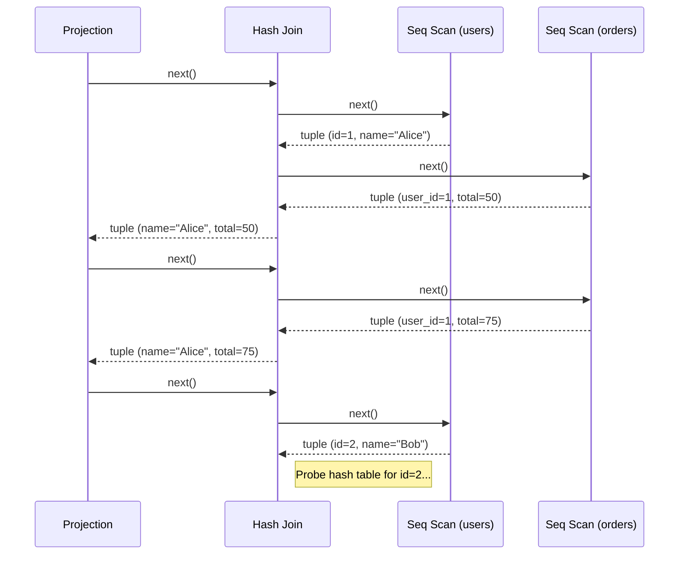

**Advantages**:
- Simple and elegant: each operator is independent and composable.
- Memory-efficient: only one tuple is in flight at a time per pipeline.
- Supports pipelining: no need to materialize intermediate results (in many cases).
- Easy to implement and debug.

**Disadvantages**:
- High per-tuple overhead: virtual function calls for every single tuple.
- Poor CPU cache utilization: processing one tuple at a time means frequent cache misses.
- Branch prediction failures: the `next()` dispatch varies between operators.
- For OLTP with small result sets, the overhead is acceptable. For OLAP scanning millions of rows, it becomes a bottleneck.

### 1.2 The Materialization Model

The materialization model (also called the "push" model) processes one operator at a time, producing the *entire* output before passing it to the parent.

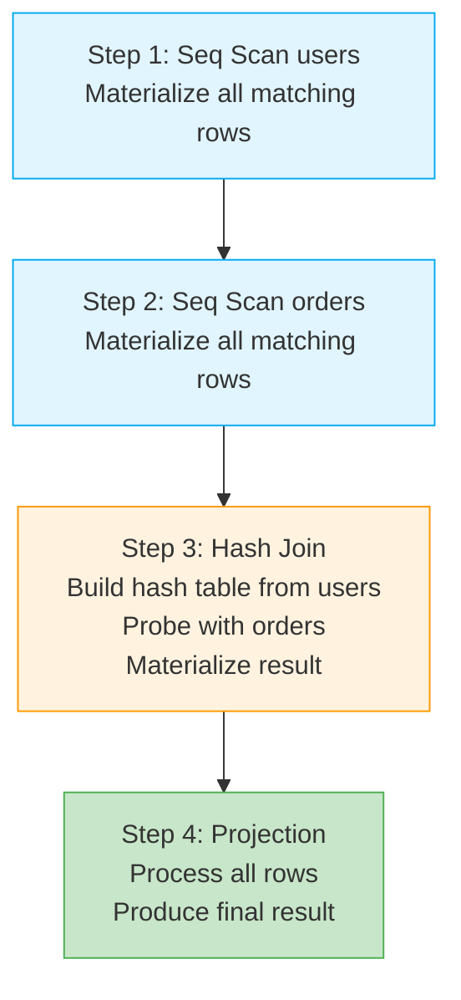

**Advantages**:
- Lower per-tuple overhead: tight loops over arrays of data.
- Better cache locality: processes all data for one operator before moving on.
- Good for in-memory databases where I/O is not the bottleneck.

**Disadvantages**:
- High memory usage: entire intermediate results must be materialized.
- No pipelining: cannot produce output until the entire input is consumed.
- Latency to first row is high.

### 1.3 The Vectorized / Batch Execution Model

The vectorized model is a hybrid that processes data in *batches* (vectors) of typically 1000-4096 tuples rather than one at a time. Pioneered by MonetDB/X100 (now the basis for DuckDB, ClickHouse, and Velox).

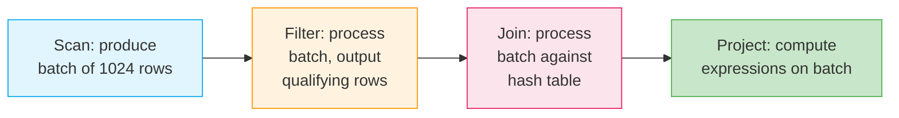

**How it works**:
- Operators still use the iterator interface: `open()`, `next_batch()`, `close()`.
- But `next_batch()` returns a *vector* of tuples rather than a single tuple.
- Within each operator, tight loops process the entire batch.
- Data is typically stored in columnar format within the batch for SIMD-friendly processing.

**Advantages**:
- Amortizes function call overhead over many tuples.
- Enables SIMD (Single Instruction, Multiple Data) processing.
- Excellent cache utilization: data fits in L1/L2 cache within a batch.
- Retains the composability of the iterator model.
- 10-100x faster than tuple-at-a-time for analytical queries.

**Disadvantages**:
- More complex implementation.
- Batch size tuning matters.
- Not as beneficial for point queries (OLTP).

### 1.4 Comparison

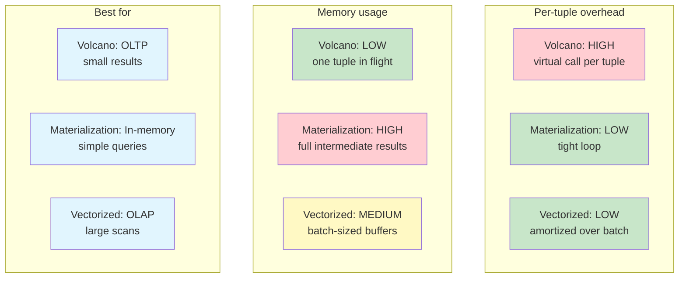

---

## 2. How PostgreSQL's Planner Works

PostgreSQL's optimizer (in `src/backend/optimizer/`) follows a well-defined architecture.

### 2.1 Overview

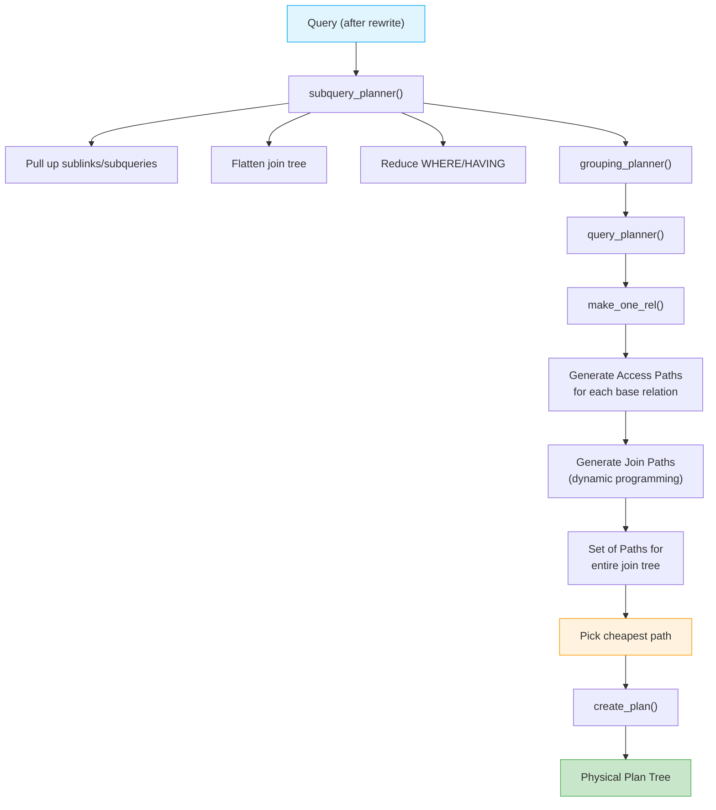

### 2.2 Paths vs Plans

PostgreSQL separates the concepts of **paths** and **plans**:

- A **Path** represents a possible way to compute a relation. It includes the execution strategy and estimated cost, but *not* the full execution details. Multiple paths exist for each relation.
- A **Plan** is the final executable tree, created from the cheapest path. Only one plan is created.

This separation allows the optimizer to explore many alternatives cheaply (paths are lightweight) before committing to the expensive plan construction.

### 2.3 Access Path Generation

For each base relation, PostgreSQL generates multiple access paths:

1. **Sequential scan path**: Always generated.
2. **Index scan paths**: One per usable index with matching WHERE clauses.
3. **Bitmap scan paths**: For conditions matching multiple index entries.
4. **TID scan path**: If the query filters on `ctid`.

Each path has an estimated `startup_cost` and `total_cost`.

### 2.4 Join Path Generation

For each pair (or set) of relations that can be joined, PostgreSQL considers:

- **Nested Loop Join**: Always considered. Best when inner side is small or has a fast index.
- **Hash Join**: Considered when there is an equijoin condition. Best for large unsorted inputs.
- **Merge Join**: Considered when inputs can be sorted on join keys. Best when both sides are large and sorted.

For each join method, PostgreSQL also considers parameterized paths (where the inner scan depends on values from the outer scan).

### 2.5 Join Ordering

- For up to `geqo_threshold` tables (default 12), PostgreSQL uses **dynamic programming** (System R style).
- For more tables, it switches to **GEQO** (Genetic Query Optimization), a genetic algorithm that avoids exponential blowup.

---

## 3. System R Optimizer and Selinger-Style Optimization

The System R optimizer, published in the seminal 1979 paper by Selinger et al., established the framework that most relational optimizers still follow.

### 3.1 Key Innovations

1. **Cost-based optimization**: Use statistics rather than just heuristics.
2. **Dynamic programming for join ordering**: Optimal substructure -- the best plan for {A, B, C} can be constructed from the best plan for {A, B} joined with C (or other decompositions).
3. **Interesting orders**: A plan that produces sorted output may not be the cheapest, but could avoid a later sort. Track "interesting orders" and keep the cheapest plan for each interesting order.

### 3.2 Interesting Orders

Consider:
```sql
SELECT * FROM users u JOIN orders o ON u.id = o.user_id ORDER BY u.id;
```

Plan A: Hash Join (cost 100) + Sort (cost 50) = 150
Plan B: Merge Join (cost 130, output sorted by u.id) = 130

Even though the Hash Join is cheaper in isolation, the Merge Join is better overall because it produces output in the needed order.

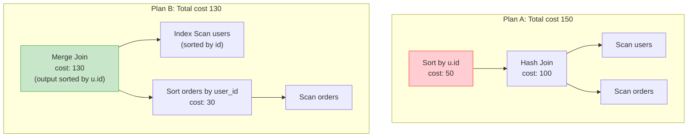

### 3.3 The DP Table

The optimizer maintains a table mapping each *set of relations* to the cheapest plan(s) for that set. For each interesting order, it keeps the cheapest plan producing that order.

```
{users}:
  - any order: SeqScan (cost 10)
  - sorted by id: IndexScan on pk_users (cost 12)

{orders}:
  - any order: SeqScan (cost 20)
  - sorted by user_id: IndexScan on idx_orders_user_id (cost 22)

{users, orders}:
  - any order: HashJoin(SeqScan users, SeqScan orders) (cost 35)
  - sorted by users.id: MergeJoin(IdxScan users, Sort(SeqScan orders)) (cost 40)
```

---

## 4. Cardinality Estimation: The Hard Problem

Cardinality estimation is widely considered the hardest problem in query optimization. Getting it wrong can cause the optimizer to choose catastrophically bad plans.

### 4.1 The Uniformity Assumption

The optimizer assumes values are uniformly distributed unless statistics say otherwise.

For `WHERE age > 25` on a column with range [18, 80]:
- Selectivity = (80 - 25) / (80 - 18) = 0.887

Reality: Age distributions are not uniform. There may be far more 25-35 year olds than 65-80 year olds. Histograms help, but only for single-column predicates.

### 4.2 The Independence Assumption

For multiple predicates, the optimizer assumes they are statistically independent:

```sql
WHERE city = 'San Francisco' AND state = 'California'
```

- sel(city = 'SF') = 0.01
- sel(state = 'CA') = 0.12
- Combined: 0.01 * 0.12 = 0.0012

But in reality, if city is SF then state is *always* CA. The true selectivity is 0.01, not 0.0012. The optimizer underestimates by 8.3x.

### 4.3 Why Estimation Errors Compound

In a plan with multiple joins, estimation errors multiply at each step:

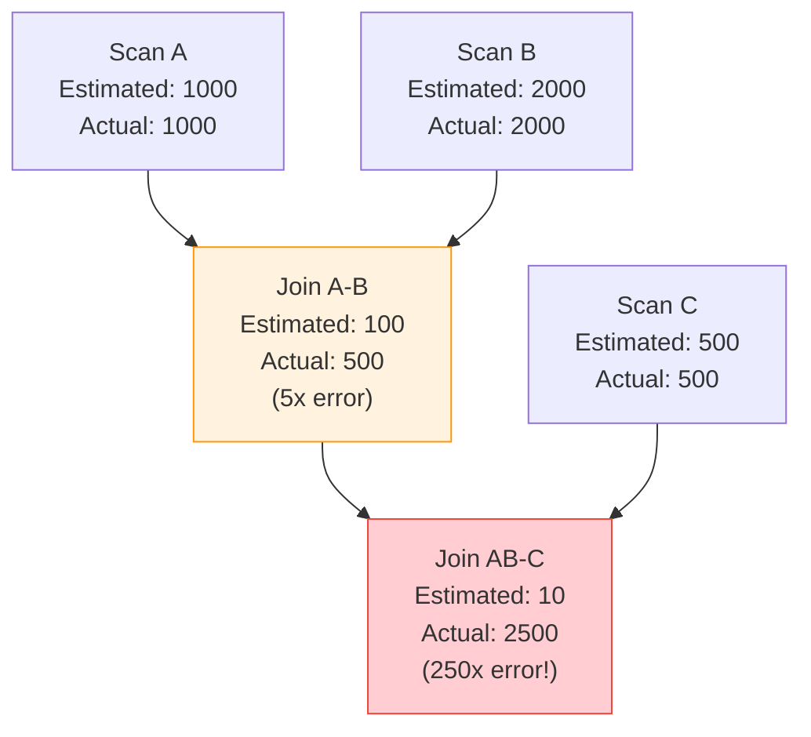

A 5x error at the first join becomes a 250x error at the second join. With such errors, the optimizer may choose nested loop joins where hash joins would be orders of magnitude faster.

### 4.4 Mitigations

- **Multivariate statistics**: PostgreSQL 10+ supports `CREATE STATISTICS` for correlated columns.
- **Join sampling**: Sample from the actual join to estimate cardinality.
- **Bayesian estimation**: Use conditional probabilities rather than independence.
- **Learned cardinality estimation**: Use machine learning models trained on query feedback (active research area).

```sql
-- PostgreSQL extended statistics for correlated columns
CREATE STATISTICS city_state_stats (dependencies) ON city, state FROM addresses;
ANALYZE addresses;
```

---

## 5. Adaptive Query Processing

Traditional optimizers commit to a plan before execution begins. Adaptive techniques adjust *during* execution.

### 5.1 Adaptive Join Methods

If the optimizer estimated 100 rows but sees 100,000 during execution, it could switch from nested loop to hash join mid-query.

### 5.2 Adaptive Cursor Prefetching

Start fetching additional pages when actual cardinality exceeds estimates.

### 5.3 PostgreSQL's Approach

PostgreSQL does not (as of v17) support mid-execution plan changes. However:

- It uses **parameterized paths** that adapt to runtime values.
- **Custom plans vs generic plans** for prepared statements adapt based on observed performance.
- The **Incremental Sort** operator (v13+) adapts sorting strategy based on pre-existing order.

### 5.4 Oracle's Approach

Oracle 12c introduced **Adaptive Plans**:

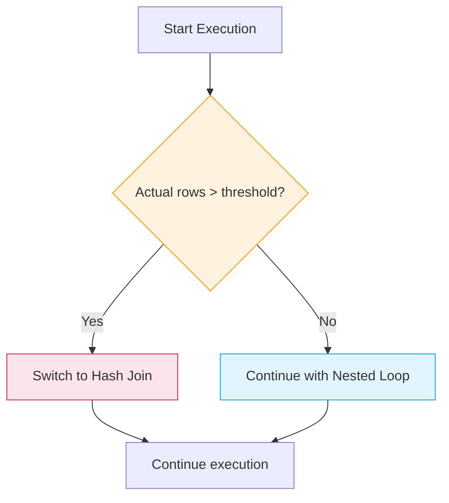

Oracle also has **Adaptive Statistics** that feed information from one execution into future plan choices.

### 5.5 SQL Server's Approach

SQL Server has **Adaptive Joins** (2017+) and **Interleaved Execution** for multi-statement table-valued functions, where it pauses optimization, executes part of the plan to get actual cardinalities, and resumes optimization with better estimates.

---

## 6. Prepared Statements and Plan Caching

### 6.1 The Problem

Planning is expensive -- for a complex query, it can take milliseconds. For OLTP workloads executing the same query thousands of times per second with different parameters, replanning every time is wasteful.

### 6.2 PostgreSQL's Strategy

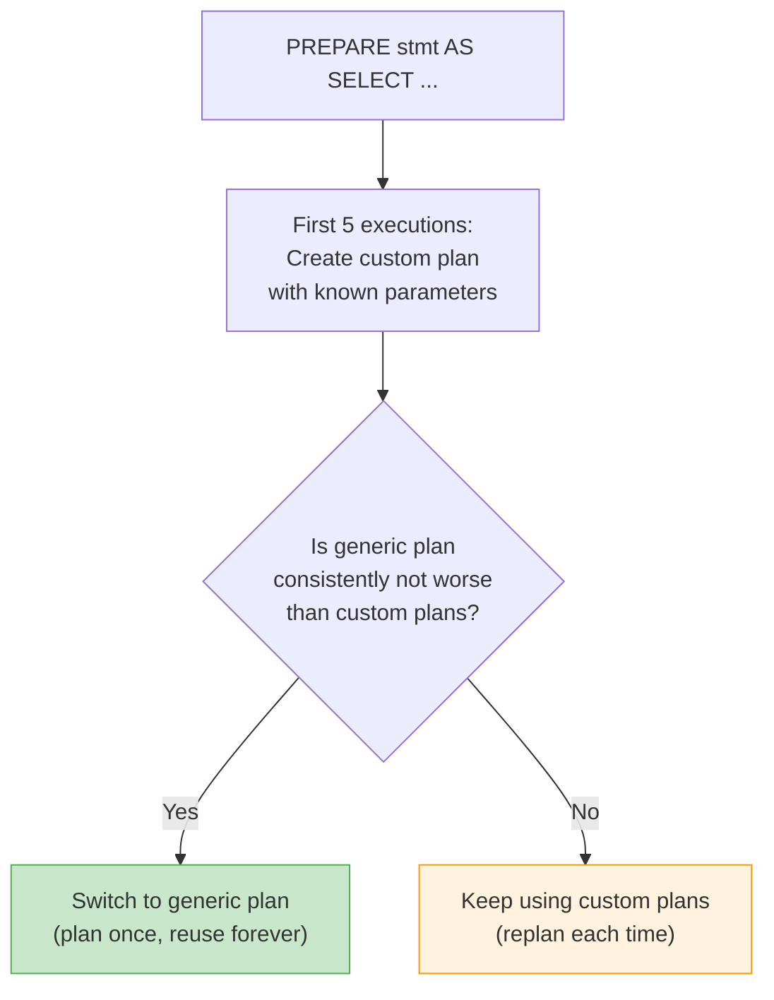

- **Custom plan**: Planned with actual parameter values. Can use value-specific optimizations (e.g., choose index scan for rare values, seq scan for common values).
- **Generic plan**: Planned with unknown parameter values (using average statistics). Reused for all parameter values.

PostgreSQL automatically decides which strategy to use based on comparing estimated costs.

### 6.3 The Plan Cache Problem

Caching plans can cause issues:
- **Parameter sensitivity** ("parameter sniffing" in SQL Server): A plan optimal for one parameter value may be terrible for another.
- **Schema changes**: Cached plans must be invalidated when tables/indexes change.
- **Statistics changes**: After ANALYZE, old cached plans may be suboptimal.

---

## 7. JIT Compilation in Query Engines

### 7.1 The Problem with Interpretation

In the iterator model, executing each tuple involves:
1. Calling virtual functions for each operator.
2. Evaluating expressions via a tree-walking interpreter.
3. Type dispatching for each value.

For analytical queries processing millions of rows, this interpretation overhead dominates.

### 7.2 JIT Compilation Approach

Instead of interpreting the plan, compile it to native machine code:

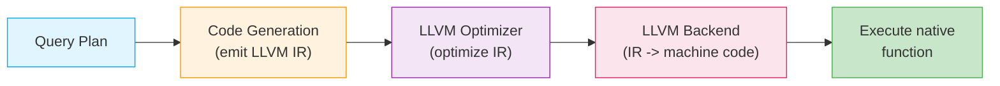

### 7.3 PostgreSQL JIT (v11+)

PostgreSQL uses LLVM for JIT compilation. It JIT-compiles:

- **Expression evaluation**: WHERE clauses, computed columns, aggregations.
- **Tuple deforming**: Extracting column values from heap tuples.
- **Tuple projection**: Constructing output tuples.

It does *not* JIT-compile entire operators (the iterator framework remains interpreted).

Configuration:
```sql
SET jit = on;                    -- Enable JIT (default: on)
SET jit_above_cost = 100000;     -- Cost threshold to trigger JIT
SET jit_inline_above_cost = 500000;  -- Threshold for inlining
SET jit_optimize_above_cost = 500000; -- Threshold for LLVM optimization
```

When to use JIT:
- Beneficial for long-running analytical queries (seconds to minutes).
- Harmful for short OLTP queries (JIT compilation time exceeds query time).

### 7.4 DuckDB's Approach

DuckDB combines vectorized execution with a form of JIT. It uses:
- **Vectorized operators** for data-intensive operations.
- **Compiled pipelines** that fuse multiple operators.
- **Morsel-driven parallelism** for multi-core scaling.

### 7.5 Compilation vs Vectorization

This is an active debate in the database community:

| Aspect | Vectorized | Compiled (JIT) |
|--------|-----------|-----------------|
| Compilation time | None | Can be significant |
| Debugging | Easier (standard code) | Harder (generated code) |
| SIMD usage | Explicit, controlled | Compiler-dependent |
| Code complexity | Lower | Higher |
| Adaptability | Easy to switch strategies | Must recompile |
| Best case | Scan-heavy queries | Expression-heavy queries |

Modern systems increasingly combine both approaches.

---

## 8. Advanced Optimizer Topics

### 8.1 Subquery Optimization

Subqueries come in several forms, each with different optimization strategies:

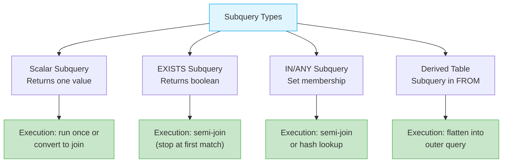

### 8.2 Common Table Expressions (CTEs)

PostgreSQL's CTE optimization has evolved:

- **Pre v12**: CTEs were *always* materialized (optimization fence). A CTE was computed once and its result stored, even if it would be better to inline it.
- **v12+**: CTEs are inlined if they are referenced only once and are not recursive. This allows the optimizer to push predicates into the CTE body.

```sql
-- In v12+, this CTE is inlined and the WHERE predicate is pushed down:
WITH active AS (SELECT * FROM users WHERE active = true)
SELECT * FROM active WHERE age > 25;

-- Effectively becomes:
SELECT * FROM users WHERE active = true AND age > 25;
```

### 8.3 Partition Pruning

For partitioned tables, the optimizer eliminates partitions that cannot contain matching rows:

```sql
-- Table orders is partitioned by order_date (monthly partitions)
SELECT * FROM orders WHERE order_date = '2025-06-15';
-- Only the June 2025 partition is scanned
```

PostgreSQL supports:
- **Static pruning** at plan time (constant values).
- **Dynamic pruning** at execution time (parameterized values, subquery results).

### 8.4 Parallel Query Execution

PostgreSQL can parallelize:
- Sequential scans (Parallel Seq Scan)
- Index scans (Parallel Index Scan)
- Hash Joins (Parallel Hash Join, shared hash table)
- Aggregations (Partial Aggregate + Gather + Finalize Aggregate)
- Sorts (currently limited)

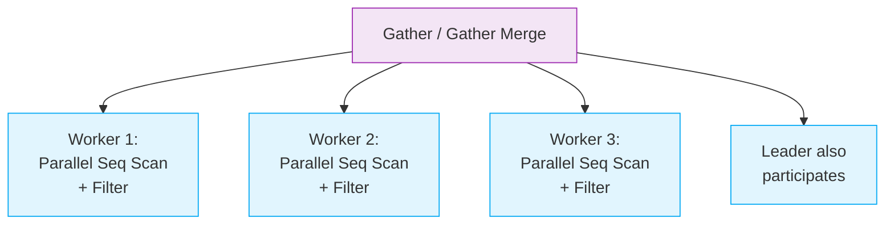

---

## 9. Query Optimization in Distributed Databases

Distributed databases add new dimensions to optimization:

### 9.1 Additional Costs

- **Network transfer cost**: Moving data between nodes.
- **Serialization cost**: Converting data for network transmission.
- **Coordination cost**: Distributed locks, two-phase commit.

### 9.2 Data Placement Awareness

The optimizer must know where data resides:
- **Replicated tables**: Available on all nodes (joins are local).
- **Sharded tables**: Distributed by a shard key. Co-located joins (same shard key) are local; cross-shard joins require data movement.

### 9.3 Strategies

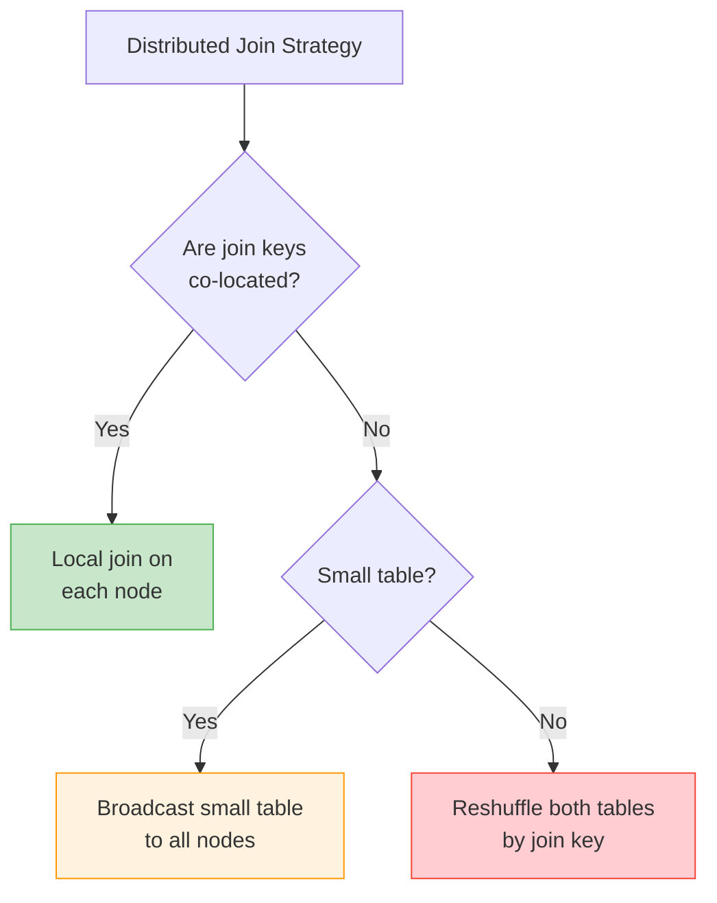

---

## 10. Summary

| Concept | Key Insight |
|---------|------------|
| Volcano model | Simple, composable, but high per-tuple overhead |
| Vectorized execution | Processes batches for cache efficiency and SIMD |
| Materialization | Full intermediate results; good for in-memory |
| System R optimizer | DP for join ordering + interesting orders |
| Cardinality estimation | Independence assumption fails on correlated columns |
| Adaptive processing | Adjusting plans during execution based on actual data |
| Plan caching | Custom vs generic plans tradeoff |
| JIT compilation | Compiles expressions to native code for analytical queries |
| Distributed optimization | Must account for network costs and data placement |

The key theme is that query optimization is fundamentally about making good decisions under uncertainty. Statistics are imperfect, assumptions are violated, and workloads are unpredictable. Modern systems use a combination of careful engineering, statistical methods, and increasingly, machine learning to navigate this uncertainty.
