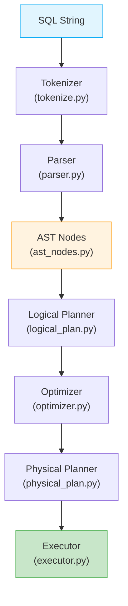
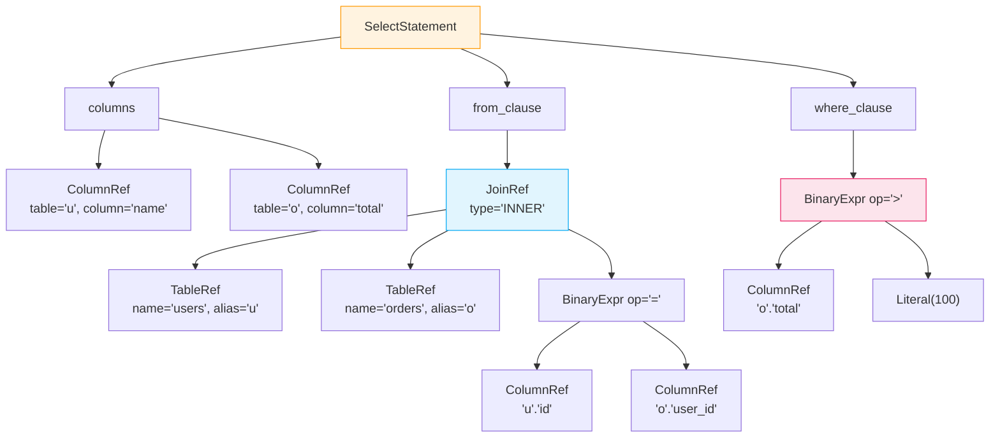
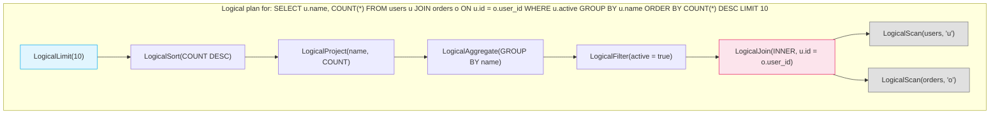
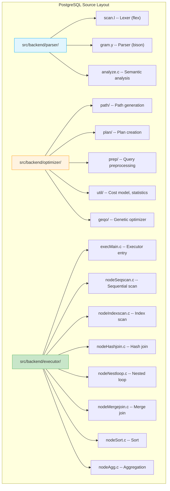

# Module 4: Query Processing & Optimization -- Implementation Walkthrough

## Introduction

This document walks through building key components of a query processing pipeline from scratch: a SQL parser, logical plan generator, optimizer, and physical plan selector. We also explore how PostgreSQL implements these components internally.

---

## 1. Architecture Overview



We will implement each component in Python, keeping things simple but instructive.

---

## 2. The Tokenizer

The tokenizer breaks a SQL string into a sequence of typed tokens.

### 2.1 Token Types

```python
from enum import Enum, auto
from dataclasses import dataclass
from typing import Any

class TokenType(Enum):
    # Keywords
    SELECT = auto()
    FROM = auto()
    WHERE = auto()
    INSERT = auto()
    INTO = auto()
    VALUES = auto()
    CREATE = auto()
    TABLE = auto()
    JOIN = auto()
    INNER = auto()
    LEFT = auto()
    RIGHT = auto()
    ON = auto()
    AND = auto()
    OR = auto()
    NOT = auto()
    AS = auto()
    ORDER = auto()
    BY = auto()
    ASC = auto()
    DESC = auto()
    GROUP = auto()
    HAVING = auto()
    LIMIT = auto()
    NULL = auto()
    INT = auto()
    VARCHAR = auto()
    BOOLEAN = auto()
    PRIMARY = auto()
    KEY = auto()

    # Literals & identifiers
    IDENTIFIER = auto()
    INTEGER_LITERAL = auto()
    FLOAT_LITERAL = auto()
    STRING_LITERAL = auto()

    # Operators
    EQUALS = auto()       # =
    NOT_EQUALS = auto()   # != or <>
    LESS_THAN = auto()    # <
    GREATER_THAN = auto() # >
    LESS_EQ = auto()      # <=
    GREATER_EQ = auto()   # >=
    PLUS = auto()
    MINUS = auto()
    STAR = auto()         # *
    SLASH = auto()

    # Punctuation
    COMMA = auto()
    DOT = auto()
    LPAREN = auto()
    RPAREN = auto()
    SEMICOLON = auto()

    # Special
    EOF = auto()


@dataclass
class Token:
    type: TokenType
    value: Any
    line: int
    column: int

    def __repr__(self):
        return f"Token({self.type.name}, {self.value!r})"
```

### 2.2 Tokenizer Implementation

```python
KEYWORDS = {
    'SELECT': TokenType.SELECT, 'FROM': TokenType.FROM,
    'WHERE': TokenType.WHERE, 'INSERT': TokenType.INSERT,
    'INTO': TokenType.INTO, 'VALUES': TokenType.VALUES,
    'CREATE': TokenType.CREATE, 'TABLE': TokenType.TABLE,
    'JOIN': TokenType.JOIN, 'INNER': TokenType.INNER,
    'LEFT': TokenType.LEFT, 'RIGHT': TokenType.RIGHT,
    'ON': TokenType.ON, 'AND': TokenType.AND,
    'OR': TokenType.OR, 'NOT': TokenType.NOT,
    'AS': TokenType.AS, 'ORDER': TokenType.ORDER,
    'BY': TokenType.BY, 'ASC': TokenType.ASC,
    'DESC': TokenType.DESC, 'GROUP': TokenType.GROUP,
    'HAVING': TokenType.HAVING, 'LIMIT': TokenType.LIMIT,
    'NULL': TokenType.NULL, 'INT': TokenType.INT,
    'VARCHAR': TokenType.VARCHAR, 'BOOLEAN': TokenType.BOOLEAN,
    'PRIMARY': TokenType.PRIMARY, 'KEY': TokenType.KEY,
}

class Tokenizer:
    def __init__(self, sql: str):
        self.sql = sql
        self.pos = 0
        self.line = 1
        self.column = 1

    def peek(self) -> str:
        if self.pos >= len(self.sql):
            return '\0'
        return self.sql[self.pos]

    def advance(self) -> str:
        ch = self.sql[self.pos]
        self.pos += 1
        if ch == '\n':
            self.line += 1
            self.column = 1
        else:
            self.column += 1
        return ch

    def skip_whitespace(self):
        while self.pos < len(self.sql) and self.sql[self.pos].isspace():
            self.advance()

    def read_identifier_or_keyword(self) -> Token:
        start_col = self.column
        chars = []
        while self.pos < len(self.sql) and (self.peek().isalnum() or self.peek() == '_'):
            chars.append(self.advance())
        word = ''.join(chars)
        upper = word.upper()
        if upper in KEYWORDS:
            return Token(KEYWORDS[upper], upper, self.line, start_col)
        return Token(TokenType.IDENTIFIER, word, self.line, start_col)

    def read_number(self) -> Token:
        start_col = self.column
        chars = []
        is_float = False
        while self.pos < len(self.sql) and (self.peek().isdigit() or self.peek() == '.'):
            if self.peek() == '.':
                is_float = True
            chars.append(self.advance())
        value = ''.join(chars)
        if is_float:
            return Token(TokenType.FLOAT_LITERAL, float(value), self.line, start_col)
        return Token(TokenType.INTEGER_LITERAL, int(value), self.line, start_col)

    def read_string(self) -> Token:
        start_col = self.column
        self.advance()  # consume opening quote
        chars = []
        while self.pos < len(self.sql) and self.peek() != "'":
            if self.peek() == '\\':
                self.advance()
            chars.append(self.advance())
        self.advance()  # consume closing quote
        return Token(TokenType.STRING_LITERAL, ''.join(chars), self.line, start_col)

    def tokenize(self) -> list[Token]:
        tokens = []
        while self.pos < len(self.sql):
            self.skip_whitespace()
            if self.pos >= len(self.sql):
                break

            ch = self.peek()
            col = self.column

            if ch.isalpha() or ch == '_':
                tokens.append(self.read_identifier_or_keyword())
            elif ch.isdigit():
                tokens.append(self.read_number())
            elif ch == "'":
                tokens.append(self.read_string())
            elif ch == ',':
                self.advance()
                tokens.append(Token(TokenType.COMMA, ',', self.line, col))
            elif ch == '.':
                self.advance()
                tokens.append(Token(TokenType.DOT, '.', self.line, col))
            elif ch == '(':
                self.advance()
                tokens.append(Token(TokenType.LPAREN, '(', self.line, col))
            elif ch == ')':
                self.advance()
                tokens.append(Token(TokenType.RPAREN, ')', self.line, col))
            elif ch == ';':
                self.advance()
                tokens.append(Token(TokenType.SEMICOLON, ';', self.line, col))
            elif ch == '*':
                self.advance()
                tokens.append(Token(TokenType.STAR, '*', self.line, col))
            elif ch == '+':
                self.advance()
                tokens.append(Token(TokenType.PLUS, '+', self.line, col))
            elif ch == '-':
                self.advance()
                tokens.append(Token(TokenType.MINUS, '-', self.line, col))
            elif ch == '/':
                self.advance()
                tokens.append(Token(TokenType.SLASH, '/', self.line, col))
            elif ch == '=':
                self.advance()
                tokens.append(Token(TokenType.EQUALS, '=', self.line, col))
            elif ch == '<':
                self.advance()
                if self.peek() == '=':
                    self.advance()
                    tokens.append(Token(TokenType.LESS_EQ, '<=', self.line, col))
                elif self.peek() == '>':
                    self.advance()
                    tokens.append(Token(TokenType.NOT_EQUALS, '<>', self.line, col))
                else:
                    tokens.append(Token(TokenType.LESS_THAN, '<', self.line, col))
            elif ch == '>':
                self.advance()
                if self.peek() == '=':
                    self.advance()
                    tokens.append(Token(TokenType.GREATER_EQ, '>=', self.line, col))
                else:
                    tokens.append(Token(TokenType.GREATER_THAN, '>', self.line, col))
            elif ch == '!':
                self.advance()
                if self.peek() == '=':
                    self.advance()
                    tokens.append(Token(TokenType.NOT_EQUALS, '!=', self.line, col))
            else:
                raise SyntaxError(f"Unexpected character: {ch} at {self.line}:{col}")

        tokens.append(Token(TokenType.EOF, None, self.line, self.column))
        return tokens
```

---

## 3. AST Node Types

The parser produces an Abstract Syntax Tree. Here are the node definitions:

```python
from dataclasses import dataclass, field
from typing import Optional

# --- Expressions ---

@dataclass
class ColumnRef:
    """Reference to a column, optionally qualified with table name."""
    table: Optional[str]
    column: str

@dataclass
class Literal:
    """A literal value: integer, float, string, or NULL."""
    value: Any

@dataclass
class BinaryExpr:
    """Binary expression: left op right."""
    left: Any       # Expression node
    op: str         # '=', '<', '>', '<=', '>=', '<>', '+', '-', '*', '/'
    right: Any      # Expression node

@dataclass
class LogicalExpr:
    """Logical expression: left AND/OR right."""
    left: Any
    op: str         # 'AND', 'OR'
    right: Any

@dataclass
class NotExpr:
    """NOT expression."""
    expr: Any

@dataclass
class FunctionCall:
    """Function call: COUNT(*), SUM(col), etc."""
    name: str
    args: list

@dataclass
class StarExpr:
    """SELECT * expression."""
    pass

# --- Table References ---

@dataclass
class TableRef:
    """Simple table reference with optional alias."""
    name: str
    alias: Optional[str] = None

@dataclass
class JoinRef:
    """JOIN clause."""
    left: Any           # TableRef or another JoinRef
    right: Any          # TableRef
    join_type: str      # 'INNER', 'LEFT', 'RIGHT'
    condition: Any      # Expression for ON clause

# --- Column Definition (for CREATE TABLE) ---

@dataclass
class ColumnDef:
    """Column definition in CREATE TABLE."""
    name: str
    data_type: str
    is_primary_key: bool = False
    is_nullable: bool = True

# --- Statements ---

@dataclass
class SelectStatement:
    """SELECT query."""
    columns: list               # List of expressions or StarExpr
    from_clause: Any            # TableRef or JoinRef
    where_clause: Any = None    # Expression or None
    group_by: list = field(default_factory=list)
    having: Any = None
    order_by: list = field(default_factory=list)  # List of (expr, 'ASC'/'DESC')
    limit: Optional[int] = None

@dataclass
class InsertStatement:
    """INSERT INTO ... VALUES ..."""
    table: str
    columns: list[str]
    values: list[list]          # List of row value lists

@dataclass
class CreateTableStatement:
    """CREATE TABLE ..."""
    name: str
    columns: list[ColumnDef]
```

### 3.1 AST Diagram for a Query

For `SELECT u.name, o.total FROM users u JOIN orders o ON u.id = o.user_id WHERE o.total > 100`:



---

## 4. Recursive Descent Parser

A recursive descent parser has one function per grammar rule. Each function consumes tokens and returns an AST node.

```python
class Parser:
    def __init__(self, tokens: list[Token]):
        self.tokens = tokens
        self.pos = 0

    def peek(self) -> Token:
        return self.tokens[self.pos]

    def advance(self) -> Token:
        tok = self.tokens[self.pos]
        self.pos += 1
        return tok

    def expect(self, token_type: TokenType) -> Token:
        tok = self.advance()
        if tok.type != token_type:
            raise SyntaxError(
                f"Expected {token_type.name}, got {tok.type.name} "
                f"('{tok.value}') at {tok.line}:{tok.column}"
            )
        return tok

    def match(self, *types: TokenType) -> Optional[Token]:
        if self.peek().type in types:
            return self.advance()
        return None

    # ---- Top-level parsing ----

    def parse(self):
        """Parse a single SQL statement."""
        tok = self.peek()
        if tok.type == TokenType.SELECT:
            return self.parse_select()
        elif tok.type == TokenType.INSERT:
            return self.parse_insert()
        elif tok.type == TokenType.CREATE:
            return self.parse_create_table()
        else:
            raise SyntaxError(f"Unexpected token: {tok}")

    # ---- SELECT ----

    def parse_select(self) -> SelectStatement:
        self.expect(TokenType.SELECT)

        # Parse column list
        columns = self.parse_select_list()

        # FROM clause
        self.expect(TokenType.FROM)
        from_clause = self.parse_table_ref()

        # Optional JOIN(s)
        while self.peek().type in (TokenType.JOIN, TokenType.INNER,
                                     TokenType.LEFT, TokenType.RIGHT):
            from_clause = self.parse_join(from_clause)

        # Optional WHERE
        where_clause = None
        if self.match(TokenType.WHERE):
            where_clause = self.parse_expression()

        # Optional GROUP BY
        group_by = []
        if self.match(TokenType.GROUP):
            self.expect(TokenType.BY)
            group_by = self.parse_expression_list()

        # Optional HAVING
        having = None
        if self.match(TokenType.HAVING):
            having = self.parse_expression()

        # Optional ORDER BY
        order_by = []
        if self.match(TokenType.ORDER):
            self.expect(TokenType.BY)
            order_by = self.parse_order_list()

        # Optional LIMIT
        limit = None
        if self.match(TokenType.LIMIT):
            limit = self.expect(TokenType.INTEGER_LITERAL).value

        self.match(TokenType.SEMICOLON)
        return SelectStatement(columns, from_clause, where_clause,
                               group_by, having, order_by, limit)

    def parse_select_list(self) -> list:
        if self.peek().type == TokenType.STAR:
            self.advance()
            return [StarExpr()]
        columns = [self.parse_select_expr()]
        while self.match(TokenType.COMMA):
            columns.append(self.parse_select_expr())
        return columns

    def parse_select_expr(self):
        expr = self.parse_expression()
        if self.match(TokenType.AS):
            alias = self.expect(TokenType.IDENTIFIER).value
            # Wrap with alias info (simplified)
            return (expr, alias)
        return expr

    # ---- Table references ----

    def parse_table_ref(self) -> TableRef:
        name = self.expect(TokenType.IDENTIFIER).value
        alias = None
        if self.peek().type == TokenType.IDENTIFIER:
            alias = self.advance().value
        elif self.match(TokenType.AS):
            alias = self.expect(TokenType.IDENTIFIER).value
        return TableRef(name, alias)

    def parse_join(self, left) -> JoinRef:
        join_type = 'INNER'
        if self.match(TokenType.LEFT):
            join_type = 'LEFT'
        elif self.match(TokenType.RIGHT):
            join_type = 'RIGHT'
        elif self.match(TokenType.INNER):
            pass
        self.expect(TokenType.JOIN)
        right = self.parse_table_ref()
        self.expect(TokenType.ON)
        condition = self.parse_expression()
        return JoinRef(left, right, join_type, condition)

    # ---- Expressions (precedence climbing) ----

    def parse_expression(self):
        return self.parse_or_expr()

    def parse_or_expr(self):
        left = self.parse_and_expr()
        while self.match(TokenType.OR):
            right = self.parse_and_expr()
            left = LogicalExpr(left, 'OR', right)
        return left

    def parse_and_expr(self):
        left = self.parse_comparison()
        while self.match(TokenType.AND):
            right = self.parse_comparison()
            left = LogicalExpr(left, 'AND', right)
        return left

    def parse_comparison(self):
        left = self.parse_addition()
        op_map = {
            TokenType.EQUALS: '=', TokenType.NOT_EQUALS: '<>',
            TokenType.LESS_THAN: '<', TokenType.GREATER_THAN: '>',
            TokenType.LESS_EQ: '<=', TokenType.GREATER_EQ: '>=',
        }
        if self.peek().type in op_map:
            tok = self.advance()
            right = self.parse_addition()
            return BinaryExpr(left, op_map[tok.type], right)
        return left

    def parse_addition(self):
        left = self.parse_multiplication()
        while self.peek().type in (TokenType.PLUS, TokenType.MINUS):
            op = '+' if self.advance().type == TokenType.PLUS else '-'
            right = self.parse_multiplication()
            left = BinaryExpr(left, op, right)
        return left

    def parse_multiplication(self):
        left = self.parse_primary()
        while self.peek().type in (TokenType.STAR, TokenType.SLASH):
            op = '*' if self.advance().type == TokenType.STAR else '/'
            right = self.parse_primary()
            left = BinaryExpr(left, op, right)
        return left

    def parse_primary(self):
        tok = self.peek()

        if tok.type == TokenType.INTEGER_LITERAL:
            self.advance()
            return Literal(tok.value)
        elif tok.type == TokenType.FLOAT_LITERAL:
            self.advance()
            return Literal(tok.value)
        elif tok.type == TokenType.STRING_LITERAL:
            self.advance()
            return Literal(tok.value)
        elif tok.type == TokenType.NULL:
            self.advance()
            return Literal(None)
        elif tok.type == TokenType.STAR:
            self.advance()
            return StarExpr()
        elif tok.type == TokenType.LPAREN:
            self.advance()
            expr = self.parse_expression()
            self.expect(TokenType.RPAREN)
            return expr
        elif tok.type == TokenType.IDENTIFIER:
            name = self.advance().value
            # Check for function call: name(...)
            if self.peek().type == TokenType.LPAREN:
                self.advance()
                args = []
                if self.peek().type != TokenType.RPAREN:
                    args = self.parse_expression_list()
                self.expect(TokenType.RPAREN)
                return FunctionCall(name.upper(), args)
            # Check for qualified name: table.column
            if self.match(TokenType.DOT):
                col = self.expect(TokenType.IDENTIFIER).value
                return ColumnRef(name, col)
            return ColumnRef(None, name)
        else:
            raise SyntaxError(f"Unexpected token in expression: {tok}")

    def parse_expression_list(self) -> list:
        exprs = [self.parse_expression()]
        while self.match(TokenType.COMMA):
            exprs.append(self.parse_expression())
        return exprs

    def parse_order_list(self) -> list:
        items = []
        expr = self.parse_expression()
        direction = 'ASC'
        if self.match(TokenType.DESC):
            direction = 'DESC'
        elif self.match(TokenType.ASC):
            direction = 'ASC'
        items.append((expr, direction))
        while self.match(TokenType.COMMA):
            expr = self.parse_expression()
            direction = 'ASC'
            if self.match(TokenType.DESC):
                direction = 'DESC'
            elif self.match(TokenType.ASC):
                direction = 'ASC'
            items.append((expr, direction))
        return items

    # ---- INSERT ----

    def parse_insert(self) -> InsertStatement:
        self.expect(TokenType.INSERT)
        self.expect(TokenType.INTO)
        table = self.expect(TokenType.IDENTIFIER).value
        self.expect(TokenType.LPAREN)
        columns = [self.expect(TokenType.IDENTIFIER).value]
        while self.match(TokenType.COMMA):
            columns.append(self.expect(TokenType.IDENTIFIER).value)
        self.expect(TokenType.RPAREN)
        self.expect(TokenType.VALUES)
        rows = [self.parse_value_row()]
        while self.match(TokenType.COMMA):
            rows.append(self.parse_value_row())
        self.match(TokenType.SEMICOLON)
        return InsertStatement(table, columns, rows)

    def parse_value_row(self) -> list:
        self.expect(TokenType.LPAREN)
        values = [self.parse_expression()]
        while self.match(TokenType.COMMA):
            values.append(self.parse_expression())
        self.expect(TokenType.RPAREN)
        return values

    # ---- CREATE TABLE ----

    def parse_create_table(self) -> CreateTableStatement:
        self.expect(TokenType.CREATE)
        self.expect(TokenType.TABLE)
        name = self.expect(TokenType.IDENTIFIER).value
        self.expect(TokenType.LPAREN)
        columns = [self.parse_column_def()]
        while self.match(TokenType.COMMA):
            columns.append(self.parse_column_def())
        self.expect(TokenType.RPAREN)
        self.match(TokenType.SEMICOLON)
        return CreateTableStatement(name, columns)

    def parse_column_def(self) -> ColumnDef:
        name = self.expect(TokenType.IDENTIFIER).value
        data_type = self.advance().value  # INT, VARCHAR, BOOLEAN
        is_pk = False
        if self.match(TokenType.PRIMARY):
            self.expect(TokenType.KEY)
            is_pk = True
        return ColumnDef(name, data_type, is_pk, not is_pk)
```

---

## 5. Logical Plan Generation

The logical plan is a tree of relational algebra operators, derived from the AST.

### 5.1 Logical Plan Nodes

```python
@dataclass
class LogicalScan:
    table: str
    alias: Optional[str]

@dataclass
class LogicalFilter:
    condition: Any      # Expression
    child: Any          # Child plan node

@dataclass
class LogicalProject:
    expressions: list   # List of expressions to project
    child: Any

@dataclass
class LogicalJoin:
    join_type: str      # 'INNER', 'LEFT', 'RIGHT'
    condition: Any      # Join condition expression
    left: Any           # Left child plan
    right: Any          # Right child plan

@dataclass
class LogicalAggregate:
    group_by: list
    aggregates: list    # List of FunctionCall nodes
    child: Any

@dataclass
class LogicalSort:
    keys: list          # List of (expr, direction)
    child: Any

@dataclass
class LogicalLimit:
    count: int
    child: Any
```

### 5.2 Plan Builder

```python
class LogicalPlanBuilder:
    """Converts an AST SelectStatement into a logical plan tree."""

    def build(self, stmt: SelectStatement):
        # Step 1: Build the FROM / JOIN base
        plan = self._build_from(stmt.from_clause)

        # Step 2: Apply WHERE filter
        if stmt.where_clause:
            plan = LogicalFilter(stmt.where_clause, plan)

        # Step 3: Apply GROUP BY + aggregation
        if stmt.group_by:
            aggs = self._extract_aggregates(stmt.columns)
            plan = LogicalAggregate(stmt.group_by, aggs, plan)

        # Step 4: Apply HAVING
        if stmt.having:
            plan = LogicalFilter(stmt.having, plan)

        # Step 5: Apply projection
        plan = LogicalProject(stmt.columns, plan)

        # Step 6: Apply ORDER BY
        if stmt.order_by:
            plan = LogicalSort(stmt.order_by, plan)

        # Step 7: Apply LIMIT
        if stmt.limit is not None:
            plan = LogicalLimit(stmt.limit, plan)

        return plan

    def _build_from(self, from_clause):
        if isinstance(from_clause, TableRef):
            return LogicalScan(from_clause.name, from_clause.alias)
        elif isinstance(from_clause, JoinRef):
            left = self._build_from(from_clause.left)
            right = self._build_from(from_clause.right)
            return LogicalJoin(from_clause.join_type,
                               from_clause.condition, left, right)

    def _extract_aggregates(self, columns):
        aggs = []
        for col in columns:
            if isinstance(col, FunctionCall):
                aggs.append(col)
            elif isinstance(col, tuple) and isinstance(col[0], FunctionCall):
                aggs.append(col[0])
        return aggs
```

### 5.3 Logical Plan Diagram



---

## 6. Optimization Rules

### 6.1 Predicate Pushdown

The most important optimization: push filters below joins and as close to scans as possible.

```python
class PredicatePushdown:
    """Push filter predicates down through joins."""

    def optimize(self, plan):
        if isinstance(plan, LogicalFilter):
            child = self.optimize(plan.child)
            return self._push_filter(plan.condition, child)
        elif isinstance(plan, LogicalJoin):
            left = self.optimize(plan.left)
            right = self.optimize(plan.right)
            return LogicalJoin(plan.join_type, plan.condition, left, right)
        elif isinstance(plan, LogicalProject):
            return LogicalProject(plan.expressions, self.optimize(plan.child))
        elif isinstance(plan, LogicalSort):
            return LogicalSort(plan.keys, self.optimize(plan.child))
        elif isinstance(plan, LogicalLimit):
            return LogicalLimit(plan.count, self.optimize(plan.child))
        elif isinstance(plan, LogicalAggregate):
            return LogicalAggregate(plan.group_by, plan.aggregates,
                                   self.optimize(plan.child))
        return plan

    def _push_filter(self, condition, child):
        if isinstance(child, LogicalJoin):
            # Determine which tables the predicate references
            tables = self._referenced_tables(condition)
            left_tables = self._get_tables(child.left)
            right_tables = self._get_tables(child.right)

            if tables.issubset(left_tables):
                # Predicate only references left side: push to left
                new_left = LogicalFilter(condition, child.left)
                return LogicalJoin(child.join_type, child.condition,
                                   new_left, child.right)
            elif tables.issubset(right_tables):
                # Predicate only references right side: push to right
                new_right = LogicalFilter(condition, child.right)
                return LogicalJoin(child.join_type, child.condition,
                                   child.left, new_right)
            else:
                # Predicate references both sides: keep above join
                return LogicalFilter(condition, child)
        return LogicalFilter(condition, child)

    def _referenced_tables(self, expr) -> set:
        """Extract all table references from an expression."""
        tables = set()
        if isinstance(expr, ColumnRef) and expr.table:
            tables.add(expr.table)
        elif isinstance(expr, BinaryExpr):
            tables |= self._referenced_tables(expr.left)
            tables |= self._referenced_tables(expr.right)
        elif isinstance(expr, LogicalExpr):
            tables |= self._referenced_tables(expr.left)
            tables |= self._referenced_tables(expr.right)
        return tables

    def _get_tables(self, plan) -> set:
        """Get all table aliases accessible from a plan node."""
        if isinstance(plan, LogicalScan):
            return {plan.alias or plan.table}
        elif isinstance(plan, LogicalJoin):
            return self._get_tables(plan.left) | self._get_tables(plan.right)
        elif isinstance(plan, LogicalFilter):
            return self._get_tables(plan.child)
        return set()
```

### 6.2 Projection Pruning

Remove columns that are not needed by any upstream operator:

```python
class ProjectionPruning:
    """Remove unnecessary columns from intermediate results."""

    def optimize(self, plan):
        needed = self._needed_columns(plan)
        return self._prune(plan, needed)

    def _needed_columns(self, plan) -> set:
        """Collect all columns referenced by the plan and its ancestors."""
        cols = set()
        if isinstance(plan, LogicalProject):
            for expr in plan.expressions:
                cols |= self._expr_columns(expr)
            cols |= self._needed_columns(plan.child)
        elif isinstance(plan, LogicalFilter):
            cols |= self._expr_columns(plan.condition)
            cols |= self._needed_columns(plan.child)
        elif isinstance(plan, LogicalJoin):
            cols |= self._expr_columns(plan.condition)
            cols |= self._needed_columns(plan.left)
            cols |= self._needed_columns(plan.right)
        elif isinstance(plan, LogicalSort):
            for key, _ in plan.keys:
                cols |= self._expr_columns(key)
            cols |= self._needed_columns(plan.child)
        return cols

    def _expr_columns(self, expr) -> set:
        if isinstance(expr, ColumnRef):
            return {(expr.table, expr.column)}
        elif isinstance(expr, BinaryExpr):
            return self._expr_columns(expr.left) | self._expr_columns(expr.right)
        elif isinstance(expr, LogicalExpr):
            return self._expr_columns(expr.left) | self._expr_columns(expr.right)
        elif isinstance(expr, FunctionCall):
            cols = set()
            for arg in expr.args:
                cols |= self._expr_columns(arg)
            return cols
        return set()

    def _prune(self, plan, needed):
        # Implementation would insert Project nodes to discard unneeded columns
        # Simplified for brevity
        return plan
```

---

## 7. Physical Plan Selection

### 7.1 Physical Plan Nodes

```python
@dataclass
class PhysicalSeqScan:
    table: str
    alias: Optional[str]
    filter: Any = None      # Pushed-down filter

@dataclass
class PhysicalIndexScan:
    table: str
    alias: Optional[str]
    index_name: str
    condition: Any          # Index lookup condition

@dataclass
class PhysicalNestedLoopJoin:
    condition: Any
    left: Any
    right: Any

@dataclass
class PhysicalHashJoin:
    condition: Any
    left: Any               # Build side
    right: Any              # Probe side

@dataclass
class PhysicalMergeJoin:
    condition: Any
    left: Any               # Must be sorted
    right: Any              # Must be sorted

@dataclass
class PhysicalSort:
    keys: list
    child: Any

@dataclass
class PhysicalHashAggregate:
    group_by: list
    aggregates: list
    child: Any

@dataclass
class PhysicalLimit:
    count: int
    child: Any
```

### 7.2 Simple Cost Model

```python
@dataclass
class TableStats:
    """Statistics for a table, used by the cost model."""
    row_count: int
    page_count: int
    avg_row_width: int      # bytes
    indexes: dict           # column -> index_name
    distinct_values: dict   # column -> count
    min_values: dict        # column -> min
    max_values: dict        # column -> max

class CostModel:
    SEQ_PAGE_COST = 1.0
    RANDOM_PAGE_COST = 4.0
    CPU_TUPLE_COST = 0.01
    CPU_OPERATOR_COST = 0.0025

    def __init__(self, catalog: dict[str, TableStats]):
        self.catalog = catalog

    def estimate_scan_cost(self, table: str, selectivity: float = 1.0) -> float:
        stats = self.catalog[table]
        io_cost = stats.page_count * self.SEQ_PAGE_COST
        cpu_cost = stats.row_count * self.CPU_TUPLE_COST
        return io_cost + cpu_cost

    def estimate_index_scan_cost(self, table: str, selectivity: float) -> float:
        stats = self.catalog[table]
        matching_rows = int(stats.row_count * selectivity)
        # Estimate pages accessed (rough: each row on a different page)
        pages = min(matching_rows, stats.page_count)
        io_cost = pages * self.RANDOM_PAGE_COST
        cpu_cost = matching_rows * self.CPU_TUPLE_COST
        return io_cost + cpu_cost

    def estimate_hash_join_cost(self, left_rows: int, right_rows: int,
                                 left_pages: int, right_pages: int) -> float:
        # Build hash table from smaller side, probe with larger
        build_cost = left_pages * self.SEQ_PAGE_COST
        probe_cost = right_pages * self.SEQ_PAGE_COST
        cpu_cost = (left_rows + right_rows) * self.CPU_TUPLE_COST
        hash_cost = (left_rows + right_rows) * self.CPU_OPERATOR_COST
        return build_cost + probe_cost + cpu_cost + hash_cost

    def estimate_nl_join_cost(self, outer_rows: int, inner_cost: float) -> float:
        return outer_rows * inner_cost

    def estimate_sort_cost(self, rows: int, pages: int) -> float:
        if pages <= 256:  # Fits in work_mem
            cpu_cost = rows * math.log2(max(rows, 2)) * self.CPU_OPERATOR_COST
            return cpu_cost
        else:
            # External sort: O(N log N) with page I/O
            passes = math.ceil(math.log2(pages / 256))
            io_cost = 2 * pages * passes * self.SEQ_PAGE_COST
            cpu_cost = rows * math.log2(max(rows, 2)) * self.CPU_OPERATOR_COST
            return io_cost + cpu_cost

    def estimate_selectivity(self, table: str, condition) -> float:
        """Estimate the selectivity of a filter condition."""
        if isinstance(condition, BinaryExpr):
            stats = self.catalog.get(table)
            if not stats:
                return 0.5
            col = condition.left
            if isinstance(col, ColumnRef) and isinstance(condition.right, Literal):
                col_name = col.column
                if condition.op == '=':
                    ndistinct = stats.distinct_values.get(col_name, 100)
                    return 1.0 / ndistinct
                elif condition.op in ('<', '<=', '>', '>='):
                    min_val = stats.min_values.get(col_name, 0)
                    max_val = stats.max_values.get(col_name, 1000)
                    val = condition.right.value
                    range_size = max_val - min_val
                    if range_size == 0:
                        return 0.5
                    if condition.op in ('>', '>='):
                        return (max_val - val) / range_size
                    else:
                        return (val - min_val) / range_size
        elif isinstance(condition, LogicalExpr):
            left_sel = self.estimate_selectivity(table, condition.left)
            right_sel = self.estimate_selectivity(table, condition.right)
            if condition.op == 'AND':
                return left_sel * right_sel
            else:
                return left_sel + right_sel - left_sel * right_sel
        return 0.5  # Default
```

### 7.3 Physical Planner

```python
class PhysicalPlanner:
    """Convert a logical plan to a physical plan using cost estimation."""

    def __init__(self, cost_model: CostModel):
        self.cost_model = cost_model

    def plan(self, logical):
        if isinstance(logical, LogicalScan):
            return self._plan_scan(logical)
        elif isinstance(logical, LogicalFilter):
            return self._plan_filter(logical)
        elif isinstance(logical, LogicalJoin):
            return self._plan_join(logical)
        elif isinstance(logical, LogicalProject):
            # Project is handled inline (no separate physical node in simple impl)
            return self.plan(logical.child)
        elif isinstance(logical, LogicalSort):
            child = self.plan(logical.child)
            return PhysicalSort(logical.keys, child)
        elif isinstance(logical, LogicalLimit):
            child = self.plan(logical.child)
            return PhysicalLimit(logical.count, child)
        elif isinstance(logical, LogicalAggregate):
            child = self.plan(logical.child)
            return PhysicalHashAggregate(logical.group_by,
                                         logical.aggregates, child)
        return logical

    def _plan_scan(self, scan: LogicalScan):
        return PhysicalSeqScan(scan.table, scan.alias)

    def _plan_filter(self, filt: LogicalFilter):
        # Check if we can use an index
        child = filt.child
        if isinstance(child, LogicalScan):
            table = child.table
            stats = self.cost_model.catalog.get(table)
            if stats and isinstance(filt.condition, BinaryExpr):
                col = filt.condition.left
                if isinstance(col, ColumnRef):
                    col_name = col.column
                    if col_name in stats.indexes:
                        sel = self.cost_model.estimate_selectivity(
                            table, filt.condition)
                        idx_cost = self.cost_model.estimate_index_scan_cost(
                            table, sel)
                        seq_cost = self.cost_model.estimate_scan_cost(table)
                        if idx_cost < seq_cost:
                            return PhysicalIndexScan(
                                table, child.alias,
                                stats.indexes[col_name], filt.condition)
        # Fall back to seq scan + filter
        child_plan = self.plan(child)
        if isinstance(child_plan, PhysicalSeqScan):
            child_plan.filter = filt.condition
            return child_plan
        return child_plan

    def _plan_join(self, join: LogicalJoin):
        left = self.plan(join.left)
        right = self.plan(join.right)

        left_table = self._get_table(join.left)
        right_table = self._get_table(join.right)
        left_stats = self.cost_model.catalog.get(left_table, None)
        right_stats = self.cost_model.catalog.get(right_table, None)

        if left_stats and right_stats:
            nl_cost = self.cost_model.estimate_nl_join_cost(
                left_stats.row_count,
                self.cost_model.estimate_scan_cost(right_table))
            hash_cost = self.cost_model.estimate_hash_join_cost(
                left_stats.row_count, right_stats.row_count,
                left_stats.page_count, right_stats.page_count)

            if hash_cost < nl_cost:
                return PhysicalHashJoin(join.condition, left, right)
        return PhysicalNestedLoopJoin(join.condition, left, right)

    def _get_table(self, plan):
        if isinstance(plan, LogicalScan):
            return plan.table
        elif isinstance(plan, LogicalFilter):
            return self._get_table(plan.child)
        elif isinstance(plan, LogicalJoin):
            return self._get_table(plan.left)
        return None
```

---

## 8. Key PostgreSQL Source Files

Understanding PostgreSQL's implementation helps ground the concepts:



Key files to study:

| File | Purpose |
|------|---------|
| `src/backend/parser/gram.y` | The SQL grammar (bison). ~15,000 lines defining all SQL syntax. |
| `src/backend/parser/analyze.c` | Semantic analysis: transforming parse trees into query trees. |
| `src/backend/optimizer/path/allpaths.c` | Entry point for generating access paths. `make_one_rel()` is the key function. |
| `src/backend/optimizer/path/joinrels.c` | Join enumeration via dynamic programming. |
| `src/backend/optimizer/path/costsize.c` | The cost model. Contains `cost_seqscan()`, `cost_index()`, `cost_hashjoin()`, etc. |
| `src/backend/optimizer/plan/createplan.c` | Converts cheapest Path into an executable Plan. |
| `src/backend/optimizer/util/relnode.c` | RelOptInfo management (the structure representing a base or join relation). |
| `src/backend/executor/execProcnode.c` | Dispatches `ExecProcNode()` calls to the right operator. |
| `src/backend/commands/explain.c` | EXPLAIN output generation. |

---

## 9. Putting It All Together: End-to-End Example

```python
import math

# 1. Tokenize
sql = "SELECT u.name, o.total FROM users u JOIN orders o ON u.id = o.user_id WHERE o.total > 100;"
tokens = Tokenizer(sql).tokenize()

# 2. Parse
ast = Parser(tokens).parse()
# Result: SelectStatement(columns=[ColumnRef('u','name'), ColumnRef('o','total')],
#          from_clause=JoinRef(...), where_clause=BinaryExpr(...))

# 3. Build logical plan
logical = LogicalPlanBuilder().build(ast)
# Result: LogicalProject -> LogicalFilter -> LogicalJoin -> LogicalScan x 2

# 4. Optimize: push predicates down
optimized = PredicatePushdown().optimize(logical)
# Result: LogicalProject -> LogicalJoin -> (LogicalScan, LogicalFilter -> LogicalScan)

# 5. Build physical plan
catalog = {
    'users': TableStats(10000, 100, 64, {'id': 'pk_users'}, {'id': 10000, 'name': 5000}, {}, {}),
    'orders': TableStats(100000, 1000, 32, {'user_id': 'idx_orders_uid'}, {'total': 10000}, {'total': 0}, {'total': 10000}),
}
cost = CostModel(catalog)
physical = PhysicalPlanner(cost).plan(optimized)
# Result: HashJoin -> (SeqScan users, IndexScan orders WHERE total > 100)

# 6. Print EXPLAIN-style output
def explain(node, indent=0):
    prefix = "  " * indent + "-> " if indent > 0 else ""
    if isinstance(node, PhysicalHashJoin):
        print(f"{prefix}Hash Join")
        explain(node.left, indent + 1)
        explain(node.right, indent + 1)
    elif isinstance(node, PhysicalSeqScan):
        filt = f"  Filter: {node.filter}" if node.filter else ""
        print(f"{prefix}Seq Scan on {node.table}{' ' + node.alias if node.alias else ''}{filt}")
    elif isinstance(node, PhysicalIndexScan):
        print(f"{prefix}Index Scan using {node.index_name} on {node.table}{' ' + node.alias if node.alias else ''}")
    elif isinstance(node, PhysicalSort):
        print(f"{prefix}Sort")
        explain(node.child, indent + 1)
    elif isinstance(node, PhysicalLimit):
        print(f"{prefix}Limit {node.count}")
        explain(node.child, indent + 1)
    elif isinstance(node, PhysicalHashAggregate):
        print(f"{prefix}HashAggregate")
        explain(node.child, indent + 1)

explain(physical)
```

Expected output:
```
Hash Join
  -> Seq Scan on users u
  -> Index Scan using idx_orders_uid on orders o
```

---

## 10. Summary

This implementation walkthrough covered:

1. **Tokenizer**: Breaks SQL text into typed tokens.
2. **Parser**: Recursive descent parser producing an AST.
3. **AST nodes**: Data classes for SELECT, INSERT, CREATE TABLE, expressions.
4. **Logical plan**: Relational algebra tree built from the AST.
5. **Optimization rules**: Predicate pushdown and projection pruning.
6. **Cost model**: I/O and CPU cost estimation using table statistics.
7. **Physical planner**: Selects algorithms (seq scan vs index scan, hash join vs nested loop) based on cost.
8. **PostgreSQL internals**: Key source files for each pipeline stage.

The real implementations in production databases are vastly more complex (PostgreSQL's grammar file alone is 15,000+ lines), but the fundamental architecture follows exactly this pattern.
