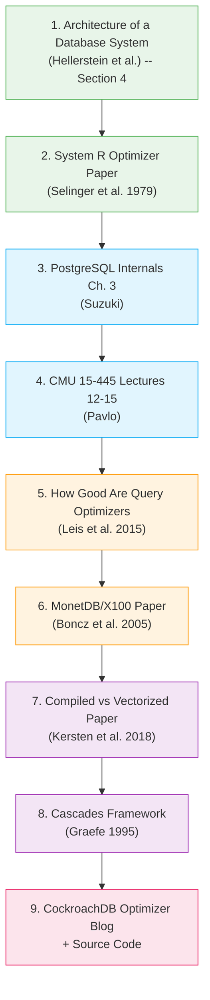

# Module 4: Query Processing & Optimization -- Resources

## Foundational Papers

These are the papers that defined the field. Reading them gives you the vocabulary and mental models that every database engineer uses.

### The System R Optimizer (1979)

**"Access Path Selection in a Relational Database Management System"** by P. Griffiths Selinger, M. M. Astrahan, D. D. Chamberlin, R. A. Lorie, and T. G. Price.

- **Link**: [https://courses.cs.duke.edu/compsci516/cps216/spring03/papers/selinger-etal-1979.pdf](https://courses.cs.duke.edu/compsci516/cps216/spring03/papers/selinger-etal-1979.pdf)
- **Why read it**: This is the foundational paper on cost-based query optimization. It introduced dynamic programming for join ordering, the concept of "interesting orders," and the cost model framework that nearly every relational optimizer still uses. If you read one paper from this list, make it this one.

### The Volcano Optimizer Generator (1993)

**"The Volcano Optimizer Generator: Extensibility and Efficient Search"** by Goetz Graefe.

- **Link**: [https://15721.courses.cs.cmu.edu/spring2024/papers/16-optimizer2/graefe-icde1993.pdf](https://15721.courses.cs.cmu.edu/spring2024/papers/16-optimizer2/graefe-icde1993.pdf)
- **Why read it**: Describes the Volcano/Cascades framework for building extensible query optimizers. This framework is the basis for SQL Server's optimizer and Apache Calcite.

### The Cascades Framework (1995)

**"The Cascades Framework for Query Optimization"** by Goetz Graefe.

- **Link**: [https://15721.courses.cs.cmu.edu/spring2024/papers/16-optimizer2/graefe-ieee1995.pdf](https://15721.courses.cs.cmu.edu/spring2024/papers/16-optimizer2/graefe-ieee1995.pdf)
- **Why read it**: Evolution of Volcano. Used as the basis for SQL Server, CockroachDB, and Greenplum optimizers. Introduces top-down optimization with memoization.

### Volcano: An Extensible and Parallel Query Evaluation System (1994)

**"Volcano -- An Extensible and Parallel Query Evaluation System"** by Goetz Graefe.

- **Link**: [https://paperhub.s3.amazonaws.com/dace52a42c07f7f8348b08dc2b186061.pdf](https://paperhub.s3.amazonaws.com/dace52a42c07f7f8348b08dc2b186061.pdf)
- **Why read it**: Defines the iterator (open/next/close) execution model used by PostgreSQL, MySQL, SQLite, and most row-oriented databases.

### MonetDB/X100: Hyper-Pipelining Query Execution (2005)

**"MonetDB/X100: Hyper-Pipelining Query Execution"** by Peter Boncz, Marcin Zukowski, and Niels Nes.

- **Link**: [https://www.cidrdb.org/cidr2005/papers/P19.pdf](https://www.cidrdb.org/cidr2005/papers/P19.pdf)
- **Why read it**: The paper that introduced vectorized query execution. It shows why tuple-at-a-time is slow on modern CPUs and proposes batch processing. DuckDB is a direct descendant of this work.

### Efficiently Compiling Efficient Query Plans for Modern Hardware (2011)

**"Efficiently Compiling Efficient Query Plans for Modern Hardware"** by Thomas Neumann.

- **Link**: [https://www.vldb.org/pvldb/vol4/p539-neumann.pdf](https://www.vldb.org/pvldb/vol4/p539-neumann.pdf)
- **Why read it**: Introduces the compilation-based (data-centric) execution model used in HyPer (now Tableau Hyper). Contrasts with the vectorized approach and shows how LLVM can be used for query compilation.

### How Good Are Query Optimizers, Really? (2015)

**"How Good Are Query Optimizers, Really?"** by Viktor Leis, Andrey Gubichev, Atanas Mirchev, Peter Boncz, Alfons Kemper, Thomas Neumann.

- **Link**: [https://www.vldb.org/pvldb/vol9/p204-leis.pdf](https://www.vldb.org/pvldb/vol9/p204-leis.pdf)
- **Why read it**: A landmark empirical study showing that cardinality estimation errors are the primary cause of suboptimal query plans. Demonstrates that real-world correlations break the independence assumption catastrophically.

### Adaptive Execution of Compiled Queries (2018)

**"Adaptive Execution of Compiled Queries"** by Andre Kohn, Viktor Leis, Thomas Neumann.

- **Link**: [https://db.in.tum.de/~leis/papers/adaptiveexecution.pdf](https://db.in.tum.de/~leis/papers/adaptiveexecution.pdf)
- **Why read it**: Shows how compiled query engines can adapt their execution strategy at runtime based on actual cardinalities.

---

## University Courses and Lecture Notes

### CMU 15-721: Advanced Database Systems (Andy Pavlo)

- **Link**: [https://15721.courses.cs.cmu.edu/spring2024/](https://15721.courses.cs.cmu.edu/spring2024/)
- **Relevant lectures**:
  - Query Processing (Lecture 11)
  - Query Execution Models (Lecture 12)
  - Query Compilation (Lecture 13)
  - Optimizer Implementation (Lectures 15-16)
- **Why**: Andy Pavlo's lectures are the gold standard for database internals education. Video recordings are freely available on YouTube.

### CMU 15-445: Introduction to Database Systems (Andy Pavlo)

- **Link**: [https://15445.courses.cs.cmu.edu/fall2024/](https://15445.courses.cs.cmu.edu/fall2024/)
- **Relevant lectures**:
  - Query Processing (Lectures 12-13)
  - Query Optimization (Lectures 14-15)
- **Why**: More introductory than 15-721, but covers the fundamentals thoroughly.

### UC Berkeley CS 186: Introduction to Database Systems (Joe Hellerstein)

- **Link**: [https://cs186berkeley.net/](https://cs186berkeley.net/)
- **Why**: Excellent coverage of query processing with assignments that have you implement query operators.

### Stanford CS 346: Database System Implementation

- **Link**: Historical materials available at [https://web.stanford.edu/class/cs346/](https://web.stanford.edu/class/cs346/)
- **Why**: Covers optimizer internals with a focus on implementation.

---

## PostgreSQL-Specific Resources

### PostgreSQL Internals: Query Processing

- **Link**: [https://www.interdb.jp/pg/pgsql03.html](https://www.interdb.jp/pg/pgsql03.html)
- **Why**: Hironobu Suzuki's "The Internals of PostgreSQL" is an exceptionally detailed walkthrough of PostgreSQL's query processing pipeline, with diagrams and source code references.

### Understanding PostgreSQL EXPLAIN

- **Link**: [https://www.postgresql.org/docs/current/using-explain.html](https://www.postgresql.org/docs/current/using-explain.html)
- **Why**: Official documentation on reading EXPLAIN output. Essential reference.

### PostgreSQL Query Planner Internals (Bruce Momjian)

- **Link**: [https://momjian.us/main/writings/pgsql/optimizer.pdf](https://momjian.us/main/writings/pgsql/optimizer.pdf)
- **Why**: A concise tour of the PostgreSQL optimizer by one of the project's core developers.

### Explaining the Postgres Query Optimizer (Bruce Momjian, talk)

- **Link**: [https://www.youtube.com/watch?v=svqQzYFBPIo](https://www.youtube.com/watch?v=svqQzYFBPIo)
- **Why**: Video presentation covering how PostgreSQL generates and evaluates query plans.

### PostgreSQL Source Code: Optimizer README

- **Link**: [https://github.com/postgres/postgres/blob/master/src/backend/optimizer/README](https://github.com/postgres/postgres/blob/master/src/backend/optimizer/README)
- **Why**: The official developer documentation for the PostgreSQL optimizer. Written by Tom Lane, it explains the architecture, data structures, and algorithms used.

### pgMustard / Dalibo explain.depesz.com

- **Link**: [https://explain.depesz.com/](https://explain.depesz.com/)
- **Link**: [https://www.pgmustard.com/](https://www.pgmustard.com/)
- **Why**: Tools for visualizing and understanding PostgreSQL EXPLAIN output. Paste a plan and get an annotated breakdown.

---

## Blog Posts and Articles

### "A Look at How Postgres Executes a Tiny Join" (Pat Shaughnessy)

- **Link**: [https://patshaughnessy.net/2015/11/24/a-look-at-how-postgres-executes-a-tiny-join](https://patshaughnessy.net/2015/11/24/a-look-at-how-postgres-executes-a-tiny-join)
- **Why**: A beginner-friendly deep dive into how PostgreSQL actually executes a simple join query, with visualizations.

### "How We Built a Cost-Based SQL Optimizer" (CockroachDB)

- **Link**: [https://www.cockroachlabs.com/blog/building-cost-based-sql-optimizer/](https://www.cockroachlabs.com/blog/building-cost-based-sql-optimizer/)
- **Why**: A practical account of building a Cascades-style optimizer from scratch. Covers real engineering tradeoffs.

### "Query Optimization in Apache Calcite" (Julian Hyde)

- **Link**: [https://calcite.apache.org/docs/algebra.html](https://calcite.apache.org/docs/algebra.html)
- **Why**: Apache Calcite is a framework for building query optimizers. Understanding its design teaches you about optimizer architecture in general.

### "Query Execution in Column-Oriented Database Systems" (Daniel Abadi, PhD Thesis)

- **Link**: [http://cs-www.cs.yale.edu/homes/dna/papers/abadi-thesis.pdf](http://cs-www.cs.yale.edu/homes/dna/papers/abadi-thesis.pdf)
- **Why**: Comprehensive treatment of how query processing differs in columnar databases. Relevant to understanding modern analytical engines.

### "Everything You Always Wanted to Know About Compiled and Vectorized Queries But Were Afraid to Ask" (2018)

- **Link**: [https://www.vldb.org/pvldb/vol11/p2209-kersten.pdf](https://www.vldb.org/pvldb/vol11/p2209-kersten.pdf)
- **Why**: A systematic comparison of compiled vs vectorized execution models. Settles many debates with empirical data.

### "An Introduction to Join Ordering" (series)

- **Link**: [https://www.querifylabs.com/blog/introduction-to-join-ordering](https://www.querifylabs.com/blog/introduction-to-join-ordering)
- **Why**: A multi-part series covering join ordering algorithms from basic enumeration to modern techniques. Accessible and practical.

---

## Books

### "Database System Concepts" by Silberschatz, Korth, and Sudarshan

- Chapters 15-16 cover query processing and optimization.
- Good for formal treatment of relational algebra, cost models, and optimization algorithms.

### "Database Internals" by Alex Petrov (O'Reilly)

- Covers storage engines and distributed systems. Chapter on query processing provides a concise overview.

### "Architecture of a Database System" by Hellerstein, Stonebraker, and Hamilton

- **Link**: [https://dsf.berkeley.edu/papers/fntdb07-architecture.pdf](https://dsf.berkeley.edu/papers/fntdb07-architecture.pdf)
- Free paper/monograph. Section 4 covers query processing in detail. One of the best concise overviews of the entire query pipeline.

### "Query Processing in Main-Memory Column Stores" by Daniel Abadi

- Relevant for understanding how modern columnar OLAP engines differ from traditional row stores in their query processing approach.

---

## Open-Source Implementations to Study

### PostgreSQL Optimizer

- **Source**: [https://github.com/postgres/postgres/tree/master/src/backend/optimizer](https://github.com/postgres/postgres/tree/master/src/backend/optimizer)
- The most accessible production-quality optimizer to study. Well-commented C code.

### DuckDB

- **Source**: [https://github.com/duckdb/duckdb](https://github.com/duckdb/duckdb)
- Modern vectorized execution engine. The optimizer and executor code is cleaner and more modern than PostgreSQL's.

### Apache Calcite

- **Source**: [https://github.com/apache/calcite](https://github.com/apache/calcite)
- A framework for building query optimizers. Used by Apache Hive, Apache Flink, Apache Druid, and others. Written in Java.

### SQLite Query Planner

- **Source**: [https://www.sqlite.org/queryplanner.html](https://www.sqlite.org/queryplanner.html)
- Documentation of SQLite's query planner. Simpler than PostgreSQL but covers the essential ideas.

### CockroachDB Optimizer

- **Source**: [https://github.com/cockroachdb/cockroach/tree/master/pkg/sql/opt](https://github.com/cockroachdb/cockroach/tree/master/pkg/sql/opt)
- A modern Cascades-style optimizer written in Go. Excellent code quality and documentation.

### sqlparser-rs

- **Source**: [https://github.com/sqlparser-rs/sqlparser-rs](https://github.com/sqlparser-rs/sqlparser-rs)
- A SQL parser written in Rust. Good reference if you are building your own parser.

---

## Video Talks

### "How Query Engines Work" (Andy Pavlo, CMU)

- **Link**: CMU Database Group YouTube channel
- Comprehensive lecture series covering all aspects of query processing.

### "Inside the PostgreSQL Query Optimizer" (Bruce Momjian)

- Available on YouTube from various PostgreSQL conference recordings.
- Practical walkthrough with real EXPLAIN examples.

### "Vectorized and Compiled Execution in Database Systems" (Thomas Neumann, TUM)

- Available from VLDB/SIGMOD conference recordings.
- Direct from the researcher who pioneered compilation-based execution.

### "DuckDB: An Embeddable Analytical Database" (Mark Raasveldt and Hannes Muhleisen)

- Various conference talks available on YouTube.
- Explains the design decisions behind DuckDB's vectorized execution engine.

---

## Tools for Hands-On Practice

| Tool | Purpose | Link |
|------|---------|------|
| PostgreSQL | Run EXPLAIN ANALYZE on real queries | [postgresql.org](https://www.postgresql.org/) |
| DuckDB | Fast in-process analytical database | [duckdb.org](https://duckdb.org/) |
| explain.depesz.com | Visualize PostgreSQL EXPLAIN output | [explain.depesz.com](https://explain.depesz.com/) |
| pgMustard | EXPLAIN plan analysis tool | [pgmustard.com](https://www.pgmustard.com/) |
| PEV2 | PostgreSQL EXPLAIN Visualizer | [github.com/dalibo/pev2](https://github.com/dalibo/pev2) |
| sqlparser-rs playground | Test SQL parsing | [sqlparser-rs](https://github.com/sqlparser-rs/sqlparser-rs) |

---

## Recommended Reading Order

For someone new to query processing, the following order provides a logical progression:

This progression takes you from foundational concepts through practical systems to advanced optimization research.
