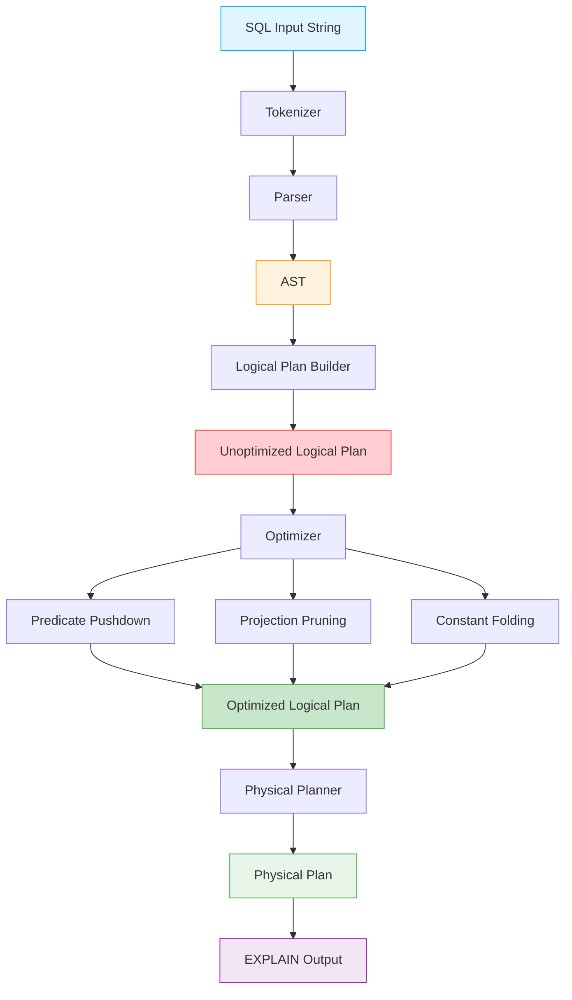
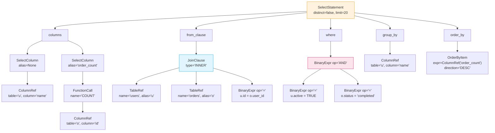
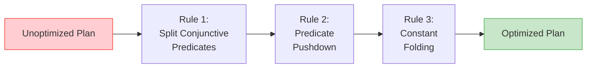
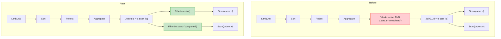
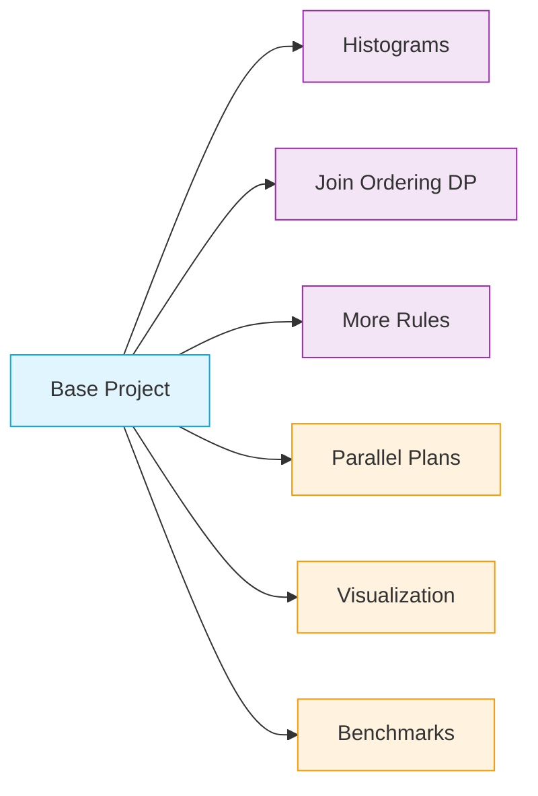

# Module 4: Query Processing & Optimization -- Project

## Project: Build a SQL Query Planner

In this project, you will build a complete SQL query planner that can parse SELECT queries, generate logical plans, apply optimization rules, produce physical plans, and output EXPLAIN-style plan descriptions. By the end, you will have a working system that demonstrates the core concepts of query processing.

---

## Project Architecture



---

## Milestone 1: Project Setup and Token Definitions

### Goal
Create the project structure and define all token types.

### Directory Structure
```
query-planner/
    __init__.py
    tokens.py          # Token types and Token dataclass
    tokenizer.py       # Tokenizer/Lexer
    ast_nodes.py       # AST node definitions
    parser.py          # Recursive descent parser
    logical_plan.py    # Logical plan nodes and builder
    optimizer.py       # Optimization rules
    physical_plan.py   # Physical plan nodes and planner
    catalog.py         # Table metadata and statistics
    explain.py         # EXPLAIN output formatter
    main.py            # CLI entry point
    tests/
        test_tokenizer.py
        test_parser.py
        test_optimizer.py
        test_planner.py
```

### Code: `tokens.py`

```python
from enum import Enum, auto
from dataclasses import dataclass
from typing import Any


class TokenType(Enum):
    # Keywords
    SELECT = auto()
    FROM = auto()
    WHERE = auto()
    JOIN = auto()
    INNER = auto()
    LEFT = auto()
    RIGHT = auto()
    OUTER = auto()
    ON = auto()
    AND = auto()
    OR = auto()
    NOT = auto()
    AS = auto()
    ORDER = auto()
    BY = auto()
    ASC = auto()
    DESC = auto()
    GROUP = auto()
    HAVING = auto()
    LIMIT = auto()
    OFFSET = auto()
    NULL = auto()
    TRUE = auto()
    FALSE = auto()
    IN = auto()
    BETWEEN = auto()
    LIKE = auto()
    IS = auto()
    DISTINCT = auto()
    COUNT = auto()
    SUM = auto()
    AVG = auto()
    MIN = auto()
    MAX = auto()
    CROSS = auto()

    # Identifiers and literals
    IDENTIFIER = auto()
    INTEGER = auto()
    FLOAT = auto()
    STRING = auto()

    # Operators
    EQ = auto()         # =
    NEQ = auto()        # <> or !=
    LT = auto()         # <
    GT = auto()         # >
    LTE = auto()        # <=
    GTE = auto()        # >=
    PLUS = auto()
    MINUS = auto()
    STAR = auto()       # * (multiplication or SELECT *)
    SLASH = auto()

    # Punctuation
    COMMA = auto()
    DOT = auto()
    LPAREN = auto()
    RPAREN = auto()
    SEMICOLON = auto()

    # End of input
    EOF = auto()


@dataclass
class Token:
    type: TokenType
    value: Any
    line: int
    col: int

    def __repr__(self):
        return f"Token({self.type.name}, {self.value!r})"
```

---

## Milestone 2: Tokenizer

### Goal
Build a tokenizer that converts SQL strings to token streams.

### Code: `tokenizer.py`

```python
from tokens import Token, TokenType

KEYWORDS = {
    'SELECT': TokenType.SELECT, 'FROM': TokenType.FROM,
    'WHERE': TokenType.WHERE, 'JOIN': TokenType.JOIN,
    'INNER': TokenType.INNER, 'LEFT': TokenType.LEFT,
    'RIGHT': TokenType.RIGHT, 'OUTER': TokenType.OUTER,
    'ON': TokenType.ON, 'AND': TokenType.AND,
    'OR': TokenType.OR, 'NOT': TokenType.NOT,
    'AS': TokenType.AS, 'ORDER': TokenType.ORDER,
    'BY': TokenType.BY, 'ASC': TokenType.ASC,
    'DESC': TokenType.DESC, 'GROUP': TokenType.GROUP,
    'HAVING': TokenType.HAVING, 'LIMIT': TokenType.LIMIT,
    'OFFSET': TokenType.OFFSET, 'NULL': TokenType.NULL,
    'TRUE': TokenType.TRUE, 'FALSE': TokenType.FALSE,
    'IN': TokenType.IN, 'BETWEEN': TokenType.BETWEEN,
    'LIKE': TokenType.LIKE, 'IS': TokenType.IS,
    'DISTINCT': TokenType.DISTINCT,
    'COUNT': TokenType.COUNT, 'SUM': TokenType.SUM,
    'AVG': TokenType.AVG, 'MIN': TokenType.MIN,
    'MAX': TokenType.MAX, 'CROSS': TokenType.CROSS,
}


class Tokenizer:
    def __init__(self, sql: str):
        self.sql = sql
        self.pos = 0
        self.line = 1
        self.col = 1

    def tokenize(self) -> list[Token]:
        tokens = []
        while self.pos < len(self.sql):
            self._skip_whitespace()
            if self.pos >= len(self.sql):
                break
            ch = self.sql[self.pos]

            if ch.isalpha() or ch == '_':
                tokens.append(self._read_word())
            elif ch.isdigit():
                tokens.append(self._read_number())
            elif ch == "'":
                tokens.append(self._read_string())
            else:
                tokens.append(self._read_symbol())

        tokens.append(Token(TokenType.EOF, None, self.line, self.col))
        return tokens

    def _skip_whitespace(self):
        while self.pos < len(self.sql) and self.sql[self.pos].isspace():
            if self.sql[self.pos] == '\n':
                self.line += 1
                self.col = 1
            else:
                self.col += 1
            self.pos += 1

    def _read_word(self) -> Token:
        start_col = self.col
        start = self.pos
        while self.pos < len(self.sql) and (self.sql[self.pos].isalnum()
                                             or self.sql[self.pos] == '_'):
            self.pos += 1
            self.col += 1
        word = self.sql[start:self.pos]
        upper = word.upper()
        if upper in KEYWORDS:
            return Token(KEYWORDS[upper], upper, self.line, start_col)
        return Token(TokenType.IDENTIFIER, word, self.line, start_col)

    def _read_number(self) -> Token:
        start_col = self.col
        start = self.pos
        has_dot = False
        while self.pos < len(self.sql) and (self.sql[self.pos].isdigit()
                                             or self.sql[self.pos] == '.'):
            if self.sql[self.pos] == '.':
                has_dot = True
            self.pos += 1
            self.col += 1
        text = self.sql[start:self.pos]
        if has_dot:
            return Token(TokenType.FLOAT, float(text), self.line, start_col)
        return Token(TokenType.INTEGER, int(text), self.line, start_col)

    def _read_string(self) -> Token:
        start_col = self.col
        self.pos += 1  # skip opening quote
        self.col += 1
        chars = []
        while self.pos < len(self.sql):
            ch = self.sql[self.pos]
            if ch == "'" and self.pos + 1 < len(self.sql) and self.sql[self.pos + 1] == "'":
                chars.append("'")
                self.pos += 2
                self.col += 2
            elif ch == "'":
                self.pos += 1
                self.col += 1
                break
            else:
                chars.append(ch)
                self.pos += 1
                self.col += 1
        return Token(TokenType.STRING, ''.join(chars), self.line, start_col)

    def _read_symbol(self) -> Token:
        ch = self.sql[self.pos]
        col = self.col
        self.pos += 1
        self.col += 1

        symbol_map = {
            ',': TokenType.COMMA, '.': TokenType.DOT,
            '(': TokenType.LPAREN, ')': TokenType.RPAREN,
            ';': TokenType.SEMICOLON, '+': TokenType.PLUS,
            '-': TokenType.MINUS, '*': TokenType.STAR,
            '/': TokenType.SLASH, '=': TokenType.EQ,
        }

        if ch in symbol_map:
            return Token(symbol_map[ch], ch, self.line, col)

        if ch == '<':
            if self.pos < len(self.sql):
                if self.sql[self.pos] == '=':
                    self.pos += 1; self.col += 1
                    return Token(TokenType.LTE, '<=', self.line, col)
                if self.sql[self.pos] == '>':
                    self.pos += 1; self.col += 1
                    return Token(TokenType.NEQ, '<>', self.line, col)
            return Token(TokenType.LT, '<', self.line, col)

        if ch == '>':
            if self.pos < len(self.sql) and self.sql[self.pos] == '=':
                self.pos += 1; self.col += 1
                return Token(TokenType.GTE, '>=', self.line, col)
            return Token(TokenType.GT, '>', self.line, col)

        if ch == '!':
            if self.pos < len(self.sql) and self.sql[self.pos] == '=':
                self.pos += 1; self.col += 1
                return Token(TokenType.NEQ, '!=', self.line, col)

        raise SyntaxError(f"Unexpected character '{ch}' at line {self.line}, col {col}")
```

### Test: `tests/test_tokenizer.py`

```python
from tokenizer import Tokenizer
from tokens import TokenType

def test_simple_select():
    tokens = Tokenizer("SELECT name FROM users;").tokenize()
    types = [t.type for t in tokens]
    assert types == [
        TokenType.SELECT, TokenType.IDENTIFIER, TokenType.FROM,
        TokenType.IDENTIFIER, TokenType.SEMICOLON, TokenType.EOF
    ]

def test_where_clause():
    tokens = Tokenizer("SELECT * FROM t WHERE age > 25").tokenize()
    assert tokens[0].type == TokenType.SELECT
    assert tokens[1].type == TokenType.STAR
    assert tokens[5].type == TokenType.IDENTIFIER  # age
    assert tokens[6].type == TokenType.GT
    assert tokens[7].type == TokenType.INTEGER
    assert tokens[7].value == 25

def test_string_literal():
    tokens = Tokenizer("WHERE name = 'O''Brien'").tokenize()
    string_tok = [t for t in tokens if t.type == TokenType.STRING][0]
    assert string_tok.value == "O'Brien"
```

---

## Milestone 3: AST Nodes and Parser

### Goal
Define AST node types and build a recursive descent parser for SELECT queries with WHERE, JOIN, ORDER BY, GROUP BY, and LIMIT.

### Code: `ast_nodes.py`

```python
from dataclasses import dataclass, field
from typing import Optional, Any


@dataclass
class ColumnRef:
    table: Optional[str]
    column: str

@dataclass
class Literal:
    value: Any

@dataclass
class StarExpr:
    table: Optional[str] = None  # for t.* syntax

@dataclass
class BinaryExpr:
    left: Any
    op: str
    right: Any

@dataclass
class UnaryExpr:
    op: str  # 'NOT', '-'
    operand: Any

@dataclass
class FunctionCall:
    name: str
    args: list
    distinct: bool = False

@dataclass
class TableRef:
    name: str
    alias: Optional[str] = None

@dataclass
class JoinClause:
    left: Any
    right: Any
    join_type: str  # 'INNER', 'LEFT', 'RIGHT', 'CROSS'
    condition: Optional[Any] = None

@dataclass
class SelectColumn:
    expr: Any
    alias: Optional[str] = None

@dataclass
class OrderByItem:
    expr: Any
    direction: str = 'ASC'

@dataclass
class SelectStatement:
    columns: list
    from_clause: Any
    where: Optional[Any] = None
    group_by: list = field(default_factory=list)
    having: Optional[Any] = None
    order_by: list = field(default_factory=list)
    limit: Optional[int] = None
    offset: Optional[int] = None
    distinct: bool = False
```

### Code: `parser.py` (skeleton -- fill in the implementation)

```python
from tokens import Token, TokenType
from ast_nodes import *
from typing import Optional


class Parser:
    def __init__(self, tokens: list[Token]):
        self.tokens = tokens
        self.pos = 0

    def peek(self) -> Token:
        return self.tokens[self.pos]

    def advance(self) -> Token:
        t = self.tokens[self.pos]
        self.pos += 1
        return t

    def expect(self, tt: TokenType) -> Token:
        t = self.advance()
        if t.type != tt:
            raise SyntaxError(f"Expected {tt.name}, got {t.type.name} at {t.line}:{t.col}")
        return t

    def match(self, *types: TokenType) -> Optional[Token]:
        if self.peek().type in types:
            return self.advance()
        return None

    # ---- Entry point ----
    def parse(self) -> SelectStatement:
        stmt = self.parse_select()
        self.match(TokenType.SEMICOLON)
        return stmt

    def parse_select(self) -> SelectStatement:
        self.expect(TokenType.SELECT)

        # TODO: Check for DISTINCT
        distinct = bool(self.match(TokenType.DISTINCT))

        # TODO: Parse select column list
        columns = self._parse_select_columns()

        # TODO: Parse FROM clause
        self.expect(TokenType.FROM)
        from_clause = self._parse_from()

        # TODO: Parse optional WHERE
        where = None
        if self.match(TokenType.WHERE):
            where = self._parse_expr()

        # TODO: Parse optional GROUP BY
        group_by = []
        if self.match(TokenType.GROUP):
            self.expect(TokenType.BY)
            group_by = self._parse_expr_list()

        # TODO: Parse optional HAVING
        having = None
        if self.match(TokenType.HAVING):
            having = self._parse_expr()

        # TODO: Parse optional ORDER BY
        order_by = []
        if self.match(TokenType.ORDER):
            self.expect(TokenType.BY)
            order_by = self._parse_order_by_list()

        # TODO: Parse optional LIMIT / OFFSET
        limit = None
        offset = None
        if self.match(TokenType.LIMIT):
            limit = self.expect(TokenType.INTEGER).value
        if self.match(TokenType.OFFSET):
            offset = self.expect(TokenType.INTEGER).value

        return SelectStatement(
            columns=columns, from_clause=from_clause,
            where=where, group_by=group_by, having=having,
            order_by=order_by, limit=limit, offset=offset,
            distinct=distinct
        )

    # ---- Implement these methods ----

    def _parse_select_columns(self) -> list:
        """Parse the SELECT column list. Handle *, column refs, expressions, aliases."""
        # YOUR CODE HERE
        pass

    def _parse_from(self):
        """Parse FROM clause including JOINs. Return a TableRef or JoinClause."""
        # YOUR CODE HERE
        pass

    def _parse_expr(self):
        """Parse an expression with proper precedence:
           OR < AND < NOT < comparisons < addition < multiplication < primary
        """
        # YOUR CODE HERE
        pass

    def _parse_expr_list(self) -> list:
        """Parse comma-separated expressions."""
        # YOUR CODE HERE
        pass

    def _parse_order_by_list(self) -> list:
        """Parse ORDER BY items with ASC/DESC."""
        # YOUR CODE HERE
        pass
```

**Hint for implementation**: Follow the precedence climbing / recursive descent pattern shown in the implementation.md file. Start with the lowest-precedence operator (OR) and work up to primary expressions.

### Parse Tree Visualization

When your parser handles this query:
```sql
SELECT u.name, COUNT(o.id) AS order_count
FROM users u
INNER JOIN orders o ON u.id = o.user_id
WHERE u.active = TRUE AND o.status = 'completed'
GROUP BY u.name
ORDER BY order_count DESC
LIMIT 20;
```

It should produce:



---

## Milestone 4: Logical Plan

### Goal
Convert the AST into a logical plan tree using relational algebra operators.

### Code: `logical_plan.py`

```python
from dataclasses import dataclass
from typing import Optional, Any


@dataclass
class Scan:
    table: str
    alias: Optional[str]

    def __str__(self):
        a = f" AS {self.alias}" if self.alias else ""
        return f"Scan({self.table}{a})"

@dataclass
class Filter:
    condition: Any
    child: Any

    def __str__(self):
        return f"Filter({self.condition})"

@dataclass
class Project:
    columns: list
    child: Any

    def __str__(self):
        return f"Project({len(self.columns)} cols)"

@dataclass
class Join:
    join_type: str
    condition: Any
    left: Any
    right: Any

    def __str__(self):
        return f"{self.join_type} Join"

@dataclass
class Aggregate:
    group_by: list
    functions: list
    child: Any

    def __str__(self):
        return f"Aggregate(group_by={len(self.group_by)}, aggs={len(self.functions)})"

@dataclass
class Sort:
    keys: list
    child: Any

    def __str__(self):
        return f"Sort({len(self.keys)} keys)"

@dataclass
class Limit:
    count: int
    offset: int
    child: Any

    def __str__(self):
        return f"Limit({self.count})"


class LogicalPlanBuilder:
    """
    Converts a SelectStatement AST into a tree of logical plan nodes.

    The construction order is:
    1. FROM / JOIN  -> Scan / Join nodes
    2. WHERE        -> Filter node
    3. GROUP BY     -> Aggregate node
    4. HAVING       -> Filter node
    5. SELECT       -> Project node
    6. DISTINCT     -> (handled via Aggregate with no aggregation functions)
    7. ORDER BY     -> Sort node
    8. LIMIT/OFFSET -> Limit node
    """

    def build(self, stmt) -> Any:
        # Step 1: FROM clause
        plan = self._from_clause(stmt.from_clause)

        # Step 2: WHERE
        if stmt.where:
            plan = Filter(condition=stmt.where, child=plan)

        # Step 3: GROUP BY
        if stmt.group_by:
            agg_funcs = self._extract_aggregates(stmt.columns)
            plan = Aggregate(group_by=stmt.group_by, functions=agg_funcs, child=plan)

        # Step 4: HAVING
        if stmt.having:
            plan = Filter(condition=stmt.having, child=plan)

        # Step 5: PROJECT
        plan = Project(columns=stmt.columns, child=plan)

        # Step 6: DISTINCT (adds a deduplication operator)
        if stmt.distinct:
            # Implement as a GROUP BY all projected columns
            plan = Aggregate(group_by=stmt.columns, functions=[], child=plan)

        # Step 7: ORDER BY
        if stmt.order_by:
            plan = Sort(keys=stmt.order_by, child=plan)

        # Step 8: LIMIT / OFFSET
        if stmt.limit is not None:
            plan = Limit(count=stmt.limit, offset=stmt.offset or 0, child=plan)

        return plan

    def _from_clause(self, node):
        # YOUR CODE: handle TableRef and JoinClause
        pass

    def _extract_aggregates(self, columns):
        # YOUR CODE: walk the column expressions to find FunctionCall nodes
        pass


def print_plan(node, indent=0):
    """Pretty-print a logical plan tree."""
    prefix = "  " * indent
    connector = "|-- " if indent > 0 else ""
    print(f"{prefix}{connector}{node}")
    for child_attr in ['child', 'left', 'right']:
        child = getattr(node, child_attr, None)
        if child is not None:
            print_plan(child, indent + 1)
```

### Expected Output

For the query in Milestone 3, `print_plan()` should produce:

```
Limit(20)
  |-- Sort(1 keys)
    |-- Project(2 cols)
      |-- Aggregate(group_by=1, aggs=1)
        |-- Filter(u.active = TRUE AND o.status = 'completed')
          |-- INNER Join
            |-- Scan(users AS u)
            |-- Scan(orders AS o)
```

---

## Milestone 5: Optimizer

### Goal
Implement three optimization rules that transform the logical plan into a more efficient equivalent.



### Code: `optimizer.py`

```python
from logical_plan import *
from ast_nodes import BinaryExpr, Literal, ColumnRef


class Optimizer:
    """Apply optimization rules to a logical plan."""

    def __init__(self):
        self.rules = [
            SplitConjunctivePredicates(),
            PredicatePushdown(),
            ConstantFolding(),
        ]

    def optimize(self, plan):
        for rule in self.rules:
            plan = rule.apply(plan)
        return plan


class SplitConjunctivePredicates:
    """
    Split Filter(A AND B) into Filter(A) -> Filter(B).
    This enables pushing each predicate independently.
    """
    def apply(self, plan):
        if isinstance(plan, Filter):
            child = self.apply(plan.child)
            predicates = self._split_and(plan.condition)
            result = child
            for pred in predicates:
                result = Filter(condition=pred, child=result)
            return result
        # Recurse into children
        return self._recurse(plan)

    def _split_and(self, expr) -> list:
        """Split an AND expression into a list of individual predicates."""
        if isinstance(expr, BinaryExpr) and expr.op == 'AND':
            return self._split_and(expr.left) + self._split_and(expr.right)
        return [expr]

    def _recurse(self, plan):
        # YOUR CODE: recursively apply to all child nodes
        pass


class PredicatePushdown:
    """
    Push Filter nodes below Join nodes when the predicate
    only references columns from one side of the join.
    """
    def apply(self, plan):
        if isinstance(plan, Filter):
            child = self.apply(plan.child)
            if isinstance(child, Join):
                tables = self._referenced_tables(plan.condition)
                left_tables = self._available_tables(child.left)
                right_tables = self._available_tables(child.right)

                if tables and tables.issubset(left_tables):
                    return Join(
                        child.join_type, child.condition,
                        Filter(plan.condition, child.left),
                        child.right
                    )
                elif tables and tables.issubset(right_tables):
                    return Join(
                        child.join_type, child.condition,
                        child.left,
                        Filter(plan.condition, child.right)
                    )
            return Filter(plan.condition, child)
        return self._recurse(plan)

    def _referenced_tables(self, expr) -> set:
        """Collect all table aliases referenced in an expression."""
        # YOUR CODE HERE
        pass

    def _available_tables(self, plan) -> set:
        """Collect all table aliases available from a plan subtree."""
        # YOUR CODE HERE
        pass

    def _recurse(self, plan):
        # YOUR CODE: recursively apply to all child nodes
        pass


class ConstantFolding:
    """
    Evaluate constant expressions at plan time.
    Examples: 5 + 3 -> 8, 'a' = 'a' -> TRUE
    """
    def apply(self, plan):
        if isinstance(plan, Filter):
            folded = self._fold(plan.condition)
            child = self.apply(plan.child)
            # If condition folded to TRUE, eliminate the filter
            if isinstance(folded, Literal) and folded.value is True:
                return child
            # If condition folded to FALSE, this produces no rows
            return Filter(folded, child)
        return self._recurse(plan)

    def _fold(self, expr):
        """Attempt to evaluate constant expressions."""
        if isinstance(expr, BinaryExpr):
            left = self._fold(expr.left)
            right = self._fold(expr.right)
            if isinstance(left, Literal) and isinstance(right, Literal):
                return self._eval_binary(left.value, expr.op, right.value)
            return BinaryExpr(left, expr.op, right)
        return expr

    def _eval_binary(self, left, op, right) -> Literal:
        ops = {
            '+': lambda a, b: a + b,
            '-': lambda a, b: a - b,
            '*': lambda a, b: a * b,
            '=': lambda a, b: a == b,
            '<>': lambda a, b: a != b,
            '<': lambda a, b: a < b,
            '>': lambda a, b: a > b,
        }
        if op in ops:
            return Literal(ops[op](left, right))
        return Literal(None)

    def _recurse(self, plan):
        # YOUR CODE: recursively apply to all child nodes
        pass
```

### Before / After Optimization



---

## Milestone 6: Physical Plan and Cost Model

### Goal
Convert the optimized logical plan to a physical plan by choosing concrete algorithms based on cost estimation.

### Code: `catalog.py`

```python
from dataclasses import dataclass, field


@dataclass
class ColumnStats:
    distinct_count: int
    null_fraction: float = 0.0
    min_value: any = None
    max_value: any = None
    avg_width: int = 8  # bytes


@dataclass
class IndexInfo:
    name: str
    columns: list[str]
    is_unique: bool = False


@dataclass
class TableInfo:
    name: str
    row_count: int
    page_count: int
    avg_row_width: int
    column_stats: dict[str, ColumnStats] = field(default_factory=dict)
    indexes: list[IndexInfo] = field(default_factory=list)


class Catalog:
    """In-memory catalog storing table metadata and statistics."""

    def __init__(self):
        self.tables: dict[str, TableInfo] = {}

    def add_table(self, info: TableInfo):
        self.tables[info.name] = info

    def get_table(self, name: str) -> TableInfo:
        return self.tables.get(name)

    def find_index(self, table: str, column: str) -> IndexInfo | None:
        info = self.tables.get(table)
        if not info:
            return None
        for idx in info.indexes:
            if column in idx.columns:
                return idx
        return None
```

### Code: `physical_plan.py`

```python
from dataclasses import dataclass
from typing import Any, Optional
import math


# ---- Physical Plan Nodes ----

@dataclass
class SeqScan:
    table: str
    alias: Optional[str]
    filter: Any = None
    est_rows: int = 0
    est_cost: float = 0.0

@dataclass
class IndexScan:
    table: str
    alias: Optional[str]
    index: str
    condition: Any
    est_rows: int = 0
    est_cost: float = 0.0

@dataclass
class NestedLoopJoin:
    condition: Any
    left: Any
    right: Any
    est_rows: int = 0
    est_cost: float = 0.0

@dataclass
class HashJoin:
    condition: Any
    build_side: Any  # smaller relation
    probe_side: Any  # larger relation
    est_rows: int = 0
    est_cost: float = 0.0

@dataclass
class MergeJoin:
    condition: Any
    left: Any
    right: Any
    est_rows: int = 0
    est_cost: float = 0.0

@dataclass
class ExternalSort:
    keys: list
    child: Any
    est_rows: int = 0
    est_cost: float = 0.0

@dataclass
class HashAggregate:
    group_by: list
    functions: list
    child: Any
    est_rows: int = 0
    est_cost: float = 0.0

@dataclass
class PhysicalLimit:
    count: int
    offset: int
    child: Any
    est_rows: int = 0
    est_cost: float = 0.0


# ---- Physical Planner ----

class PhysicalPlanner:
    SEQ_PAGE_COST = 1.0
    RANDOM_PAGE_COST = 4.0
    CPU_TUPLE_COST = 0.01
    CPU_OPERATOR_COST = 0.0025

    def __init__(self, catalog):
        self.catalog = catalog

    def plan(self, logical) -> Any:
        """Convert logical plan tree to physical plan tree."""
        # YOUR CODE: implement the conversion
        # Use the catalog to look up table stats and indexes
        # Choose between SeqScan vs IndexScan based on selectivity
        # Choose between HashJoin vs NestedLoopJoin vs MergeJoin based on cost
        pass

    def estimate_selectivity(self, table: str, condition) -> float:
        """Estimate what fraction of rows pass a filter condition."""
        # YOUR CODE: implement using column statistics from catalog
        pass

    def cost_seq_scan(self, table: str) -> float:
        info = self.catalog.get_table(table)
        if not info:
            return 1000.0  # default
        return info.page_count * self.SEQ_PAGE_COST + info.row_count * self.CPU_TUPLE_COST

    def cost_index_scan(self, table: str, selectivity: float) -> float:
        info = self.catalog.get_table(table)
        if not info:
            return 500.0
        matching = int(info.row_count * selectivity)
        pages = min(matching, info.page_count)
        return pages * self.RANDOM_PAGE_COST + matching * self.CPU_TUPLE_COST

    def cost_hash_join(self, left_rows, right_rows, left_pages, right_pages) -> float:
        build = left_pages * self.SEQ_PAGE_COST
        probe = right_pages * self.SEQ_PAGE_COST
        cpu = (left_rows + right_rows) * self.CPU_TUPLE_COST
        hashing = (left_rows + right_rows) * self.CPU_OPERATOR_COST
        return build + probe + cpu + hashing

    def cost_nested_loop(self, outer_rows, inner_cost) -> float:
        return outer_rows * inner_cost + outer_rows * self.CPU_TUPLE_COST
```

---

## Milestone 7: EXPLAIN Output

### Goal
Format the physical plan as a readable EXPLAIN output, similar to PostgreSQL.

### Code: `explain.py`

```python
def explain(node, indent=0, analyze=False) -> str:
    """Generate EXPLAIN output for a physical plan."""
    lines = []
    prefix = "  " * indent
    arrow = "->  " if indent > 0 else ""

    cost_str = f"(cost={node.est_cost:.2f} rows={node.est_rows})"

    if isinstance(node, SeqScan):
        filt = f"\n{prefix}      Filter: {format_expr(node.filter)}" if node.filter else ""
        lines.append(f"{prefix}{arrow}Seq Scan on {node.table}"
                     f"{' ' + node.alias if node.alias else ''} {cost_str}{filt}")

    elif isinstance(node, IndexScan):
        lines.append(f"{prefix}{arrow}Index Scan using {node.index} "
                     f"on {node.table}{' ' + node.alias if node.alias else ''} {cost_str}")
        lines.append(f"{prefix}      Index Cond: {format_expr(node.condition)}")

    elif isinstance(node, HashJoin):
        lines.append(f"{prefix}{arrow}Hash Join {cost_str}")
        lines.append(f"{prefix}      Hash Cond: {format_expr(node.condition)}")
        lines.append(explain(node.build_side, indent + 1, analyze))
        lines.append(explain(node.probe_side, indent + 1, analyze))

    elif isinstance(node, NestedLoopJoin):
        lines.append(f"{prefix}{arrow}Nested Loop {cost_str}")
        lines.append(explain(node.left, indent + 1, analyze))
        lines.append(explain(node.right, indent + 1, analyze))

    elif isinstance(node, MergeJoin):
        lines.append(f"{prefix}{arrow}Merge Join {cost_str}")
        lines.append(f"{prefix}      Merge Cond: {format_expr(node.condition)}")
        lines.append(explain(node.left, indent + 1, analyze))
        lines.append(explain(node.right, indent + 1, analyze))

    elif isinstance(node, ExternalSort):
        lines.append(f"{prefix}{arrow}Sort {cost_str}")
        lines.append(f"{prefix}      Sort Key: {', '.join(str(k) for k in node.keys)}")
        lines.append(explain(node.child, indent + 1, analyze))

    elif isinstance(node, HashAggregate):
        lines.append(f"{prefix}{arrow}HashAggregate {cost_str}")
        lines.append(explain(node.child, indent + 1, analyze))

    elif isinstance(node, PhysicalLimit):
        lines.append(f"{prefix}{arrow}Limit {cost_str}")
        lines.append(explain(node.child, indent + 1, analyze))

    return '\n'.join(lines)


def format_expr(expr) -> str:
    """Format an expression for EXPLAIN display."""
    if expr is None:
        return ""
    if isinstance(expr, ColumnRef):
        if expr.table:
            return f"{expr.table}.{expr.column}"
        return expr.column
    if isinstance(expr, Literal):
        if isinstance(expr.value, str):
            return f"'{expr.value}'"
        return str(expr.value)
    if isinstance(expr, BinaryExpr):
        return f"({format_expr(expr.left)} {expr.op} {format_expr(expr.right)})"
    return str(expr)
```

### Expected EXPLAIN Output

```
Limit (cost=55.23 rows=20)
->  Sort (cost=55.23 rows=150)
      Sort Key: order_count DESC
  ->  HashAggregate (cost=42.10 rows=150)
    ->  Hash Join (cost=35.50 rows=3000)
          Hash Cond: (u.id = o.user_id)
      ->  Seq Scan on users u (cost=10.00 rows=5000)
            Filter: (u.active = true)
      ->  Seq Scan on orders o (cost=25.00 rows=8000)
            Filter: (o.status = 'completed')
```

---

## Milestone 8: CLI and Integration

### Code: `main.py`

```python
from tokenizer import Tokenizer
from parser import Parser
from logical_plan import LogicalPlanBuilder, print_plan
from optimizer import Optimizer
from physical_plan import PhysicalPlanner
from catalog import Catalog, TableInfo, ColumnStats, IndexInfo
from explain import explain


def setup_catalog() -> Catalog:
    """Create a sample catalog with table statistics."""
    catalog = Catalog()

    catalog.add_table(TableInfo(
        name='users', row_count=10000, page_count=100, avg_row_width=64,
        column_stats={
            'id': ColumnStats(distinct_count=10000, min_value=1, max_value=10000),
            'name': ColumnStats(distinct_count=8000),
            'age': ColumnStats(distinct_count=60, min_value=18, max_value=80),
            'active': ColumnStats(distinct_count=2),
        },
        indexes=[
            IndexInfo('pk_users', ['id'], is_unique=True),
            IndexInfo('idx_users_age', ['age']),
        ]
    ))

    catalog.add_table(TableInfo(
        name='orders', row_count=100000, page_count=1000, avg_row_width=48,
        column_stats={
            'id': ColumnStats(distinct_count=100000, min_value=1, max_value=100000),
            'user_id': ColumnStats(distinct_count=10000),
            'total': ColumnStats(distinct_count=5000, min_value=1, max_value=10000),
            'status': ColumnStats(distinct_count=5),
        },
        indexes=[
            IndexInfo('pk_orders', ['id'], is_unique=True),
            IndexInfo('idx_orders_user_id', ['user_id']),
        ]
    ))

    return catalog


def main():
    catalog = setup_catalog()

    print("=== SQL Query Planner ===")
    print("Enter SQL queries (or 'quit' to exit).")
    print("Prefix with EXPLAIN to see the plan.\n")

    while True:
        try:
            sql = input("sql> ").strip()
        except (EOFError, KeyboardInterrupt):
            break

        if sql.lower() in ('quit', 'exit', 'q'):
            break
        if not sql:
            continue

        show_explain = False
        if sql.upper().startswith('EXPLAIN '):
            show_explain = True
            sql = sql[8:]

        try:
            # 1. Tokenize
            tokens = Tokenizer(sql).tokenize()

            # 2. Parse
            ast = Parser(tokens).parse()
            print("\n--- AST ---")
            print(ast)

            # 3. Logical Plan
            logical = LogicalPlanBuilder().build(ast)
            print("\n--- Logical Plan (unoptimized) ---")
            print_plan(logical)

            # 4. Optimize
            optimizer = Optimizer()
            optimized = optimizer.optimize(logical)
            print("\n--- Logical Plan (optimized) ---")
            print_plan(optimized)

            # 5. Physical Plan
            if show_explain:
                planner = PhysicalPlanner(catalog)
                physical = planner.plan(optimized)
                print("\n--- EXPLAIN ---")
                print(explain(physical))

            print()

        except SyntaxError as e:
            print(f"Error: {e}\n")
        except Exception as e:
            print(f"Error: {e}\n")
            import traceback
            traceback.print_exc()


if __name__ == '__main__':
    main()
```

---

## Extension Ideas

Once the base project is working, consider these extensions:

1. **Cardinality estimation with histograms**: Build equi-depth histograms and use them for range predicate selectivity.

2. **Join ordering**: Implement the dynamic programming join enumerator for 2-4 tables.

3. **More optimization rules**: Implement projection pruning, redundant filter elimination, join commutativity.

4. **Parallel plan generation**: Add a Gather node that splits work across simulated workers.

5. **Plan visualization**: Output the plan tree as a Mermaid diagram or DOT graph.

6. **Benchmarking**: Compare plan costs for different query formulations and verify the optimizer picks the right one.



---

## Submission Checklist

- [ ] Tokenizer handles all token types, including string escapes and two-character operators
- [ ] Parser correctly parses SELECT with WHERE, JOIN, GROUP BY, HAVING, ORDER BY, LIMIT
- [ ] Logical plan builder produces the correct tree from any parsed AST
- [ ] Predicate pushdown correctly identifies single-table predicates and pushes them below joins
- [ ] Constant folding evaluates arithmetic and comparison on literals
- [ ] Physical planner selects between seq scan / index scan based on selectivity
- [ ] Physical planner selects between hash join / nested loop based on cost
- [ ] EXPLAIN output is readable and matches the expected format
- [ ] Tests pass for at least 5 different query patterns
- [ ] Code is well-structured with clear separation between pipeline stages
