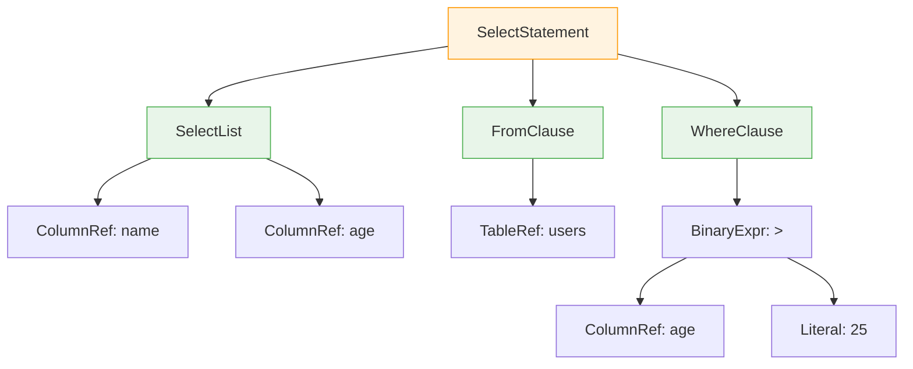
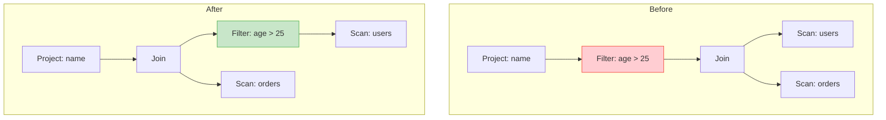
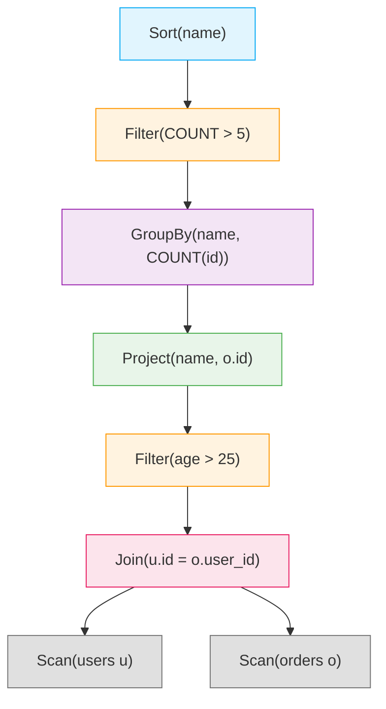
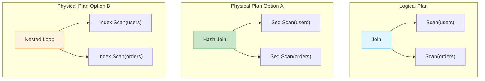
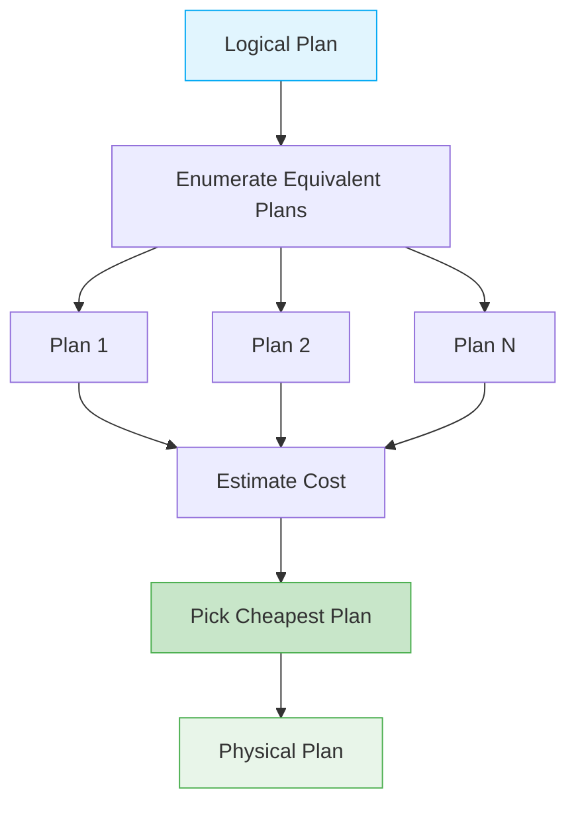
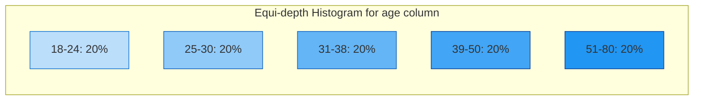
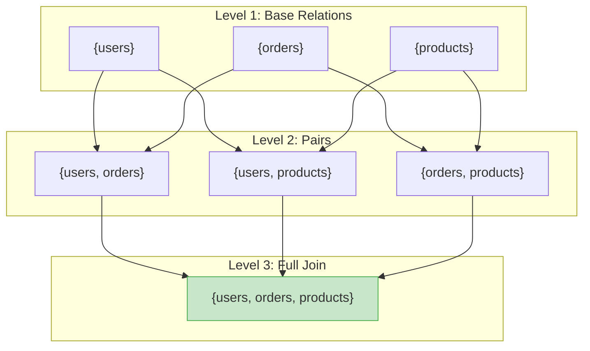
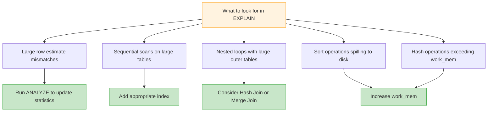
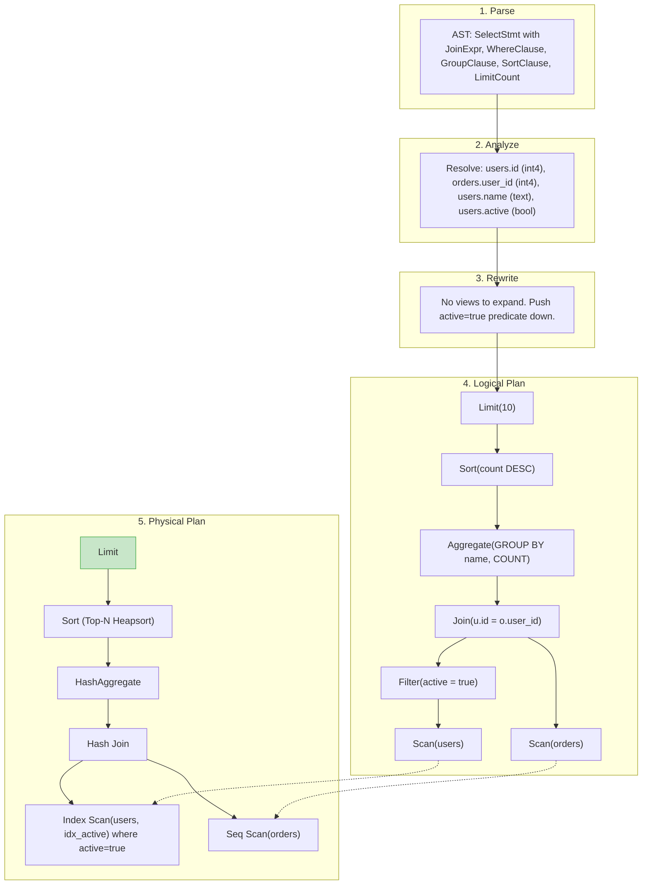

# Module 4: Query Processing & Optimization -- Core Teaching

## Introduction

Every SQL query you write undergoes a complex transformation before any data is actually read from disk. The database takes your declarative SQL statement -- which describes *what* you want -- and converts it into an imperative execution plan that describes *how* to get it. This module covers every stage of that transformation, from raw SQL text to optimized physical execution.

Understanding query processing is essential for writing efficient queries, interpreting EXPLAIN output, and building database systems.

---

## 1. The Query Processing Pipeline

A SQL query passes through a series of well-defined stages before producing results.

```mermaid
flowchart LR
    A["SQL Text"] --> B["Lexer/Tokenizer"]
    B --> C["Parser"]
    C --> D["Semantic Analyzer"]
    D --> E["Query Rewriter"]
    E --> F["Logical Planner"]
    F --> G["Optimizer"]
    G --> H["Physical Planner"]
    H --> I["Executor"]
    I --> J["Result Set"]

    style A fill:#e8f4fd,stroke:#2196F3
    style J fill:#e8f5e9,stroke:#4CAF50
```



Each stage has a specific responsibility:

| Stage | Input | Output | Responsibility |
|-------|-------|--------|----------------|
| Lexer | Raw SQL string | Token stream | Break text into tokens |
| Parser | Token stream | Abstract Syntax Tree (AST) | Validate grammar, build tree |
| Semantic Analyzer | AST | Annotated AST | Resolve names, check types |
| Rewriter | Annotated AST | Rewritten AST | Expand views, simplify |
| Logical Planner | Rewritten AST | Logical plan tree | Map to relational algebra |
| Optimizer | Logical plan | Optimized logical plan | Find best equivalent plan |
| Physical Planner | Optimized logical plan | Physical plan | Choose algorithms, access paths |
| Executor | Physical plan | Result tuples | Actually execute the plan |

---

## 2. Lexing and Parsing

### 2.1 Lexing (Tokenization)

The lexer (also called scanner or tokenizer) reads the raw SQL string character by character and produces a stream of tokens. Each token has a type and a value.

Given the SQL:
```sql
SELECT name, age FROM users WHERE age > 25;
```

The lexer produces:

```
Token(KEYWORD, "SELECT")
Token(IDENTIFIER, "name")
Token(COMMA, ",")
Token(IDENTIFIER, "age")
Token(KEYWORD, "FROM")
Token(IDENTIFIER, "users")
Token(KEYWORD, "WHERE")
Token(IDENTIFIER, "age")
Token(OPERATOR, ">")
Token(INTEGER_LITERAL, "25")
Token(SEMICOLON, ";")
```

Token categories typically include:
- **Keywords**: SELECT, FROM, WHERE, INSERT, CREATE, JOIN, ON, ORDER, BY, GROUP, HAVING, etc.
- **Identifiers**: Table names, column names, aliases
- **Literals**: Integers, floats, strings, booleans, NULL
- **Operators**: =, <>, <, >, <=, >=, +, -, *, /
- **Punctuation**: (, ), ,, ;, .

### 2.2 Parsing (Syntax Analysis)

The parser takes the token stream and produces an Abstract Syntax Tree (AST). It validates that the SQL conforms to the grammar of the language.

SQL grammars are typically specified in BNF (Backus-Naur Form) or variants. A simplified grammar for SELECT:

```
select_stmt   ::= SELECT select_list FROM table_ref
                   [WHERE condition]
                   [GROUP BY expr_list]
                   [HAVING condition]
                   [ORDER BY order_list]
                   [LIMIT integer]

select_list   ::= '*' | column_expr (',' column_expr)*
column_expr   ::= expr [AS alias]
table_ref     ::= table_name [alias]
                 | table_ref JOIN table_ref ON condition
condition     ::= expr comparison_op expr
                 | condition AND condition
                 | condition OR condition
```

### 2.3 AST Construction

The AST is a tree representation of the syntactic structure of the query.



The AST captures the *structure* of the query but does not yet know anything about what the identifiers refer to (which table does "name" belong to? Does "users" exist?).

---

## 3. Semantic Analysis

Semantic analysis walks the AST and resolves meaning. This phase performs:

### 3.1 Name Resolution

- **Table resolution**: Does the table "users" exist in the catalog? Which schema?
- **Column resolution**: Does "name" exist in table "users"? If multiple tables are joined, which table does an unqualified column belong to?
- **Alias resolution**: Track aliases introduced in FROM and SELECT clauses.
- **Ambiguity detection**: If "id" exists in both "users" and "orders" in a join, and the query references unqualified "id", raise an error.

### 3.2 Type Checking

- Verify that operators are applied to compatible types (you cannot do `name > 25` if `name` is VARCHAR and `>` is numeric comparison).
- Insert implicit casts where necessary (e.g., comparing INT to FLOAT).
- Validate function arguments: `SUM(name)` is an error if `name` is not numeric.

### 3.3 Scope Validation

- Ensure GROUP BY columns are valid.
- Ensure that non-aggregated columns in SELECT are in the GROUP BY list (in strict SQL mode).
- Validate that subquery correlations reference valid outer columns.

After semantic analysis, the AST is *annotated* with type information, resolved table OIDs, column positions, and so on.

---

## 4. Query Rewriting

The rewriter transforms the annotated AST into an equivalent but simpler or more optimizable form. This happens *before* the optimizer.

### 4.1 View Expansion

If a query references a view, the rewriter replaces the view reference with the view's defining query:

```sql
-- View definition:
CREATE VIEW active_users AS SELECT * FROM users WHERE active = true;

-- Original query:
SELECT name FROM active_users WHERE age > 25;

-- After view expansion:
SELECT name FROM (SELECT * FROM users WHERE active = true) AS active_users WHERE age > 25;
```

### 4.2 Subquery Flattening (Unnesting)

Correlated subqueries are expensive because they may execute once per outer row. The rewriter tries to convert them into joins:

```sql
-- Before:
SELECT * FROM orders o WHERE o.total > (SELECT AVG(total) FROM orders WHERE user_id = o.user_id);

-- After (conceptual):
SELECT o.* FROM orders o
JOIN (SELECT user_id, AVG(total) AS avg_total FROM orders GROUP BY user_id) AS sub
ON o.user_id = sub.user_id
WHERE o.total > sub.avg_total;
```

### 4.3 Predicate Pushdown (Early Filtering)

Move filter conditions as close to the data source as possible:



### 4.4 Constant Folding

Evaluate constant expressions at plan time:
```sql
-- Before:
WHERE created_at > '2025-01-01'::date + INTERVAL '30 days'
-- After:
WHERE created_at > '2025-01-31'::date
```

### 4.5 Predicate Simplification

```sql
-- Before:
WHERE x > 5 AND x > 10
-- After:
WHERE x > 10

-- Before:
WHERE x = 5 OR TRUE
-- After:
(no WHERE clause needed)
```

---

## 5. Relational Algebra

The logical planner converts the rewritten AST into a tree of *relational algebra* operators. Relational algebra is a formal mathematical framework for describing operations on relations (tables).

### 5.1 Core Operators

| Operator | Symbol | Description |
|----------|--------|-------------|
| Selection (Filter) | sigma | Keep rows matching a predicate |
| Projection | pi | Keep only specified columns |
| Join | bowtie | Combine rows from two relations |
| Union | U | Combine all rows from two relations |
| Difference | - | Rows in first but not second |
| Cartesian Product | x | All combinations of rows |
| Rename | rho | Rename columns or relation |
| Aggregation | G | Group and aggregate |
| Sort | tau | Order rows |

### 5.2 From SQL to Algebra

```sql
SELECT u.name, COUNT(o.id)
FROM users u
JOIN orders o ON u.id = o.user_id
WHERE u.age > 25
GROUP BY u.name
HAVING COUNT(o.id) > 5
ORDER BY u.name;
```

This translates to a tree of relational algebra operations:



---

## 6. Logical vs Physical Operators

A key distinction in query processing is between *logical* and *physical* operators.

**Logical operators** describe *what* to do:
- Scan, Filter, Project, Join, Sort, Aggregate

**Physical operators** describe *how* to do it:

| Logical Operator | Physical Implementations |
|------------------|--------------------------|
| Scan | Sequential Scan, Index Scan, Index-Only Scan, Bitmap Scan |
| Filter | Applied within scan or as separate filter node |
| Join | Nested Loop Join, Hash Join, Sort-Merge Join |
| Sort | In-memory quicksort, External merge sort |
| Aggregate | Hash Aggregate, Sort Aggregate, Plain Aggregate |
| Set Operations | Hash SetOp, Sort SetOp |



---

## 7. Query Plan Trees

A query plan is a tree where:
- **Leaf nodes** are data access operators (scans).
- **Internal nodes** are processing operators (joins, sorts, aggregations).
- **Data flows from leaves to root** (bottom-up).
- The root produces the final result.

### Reading a PostgreSQL EXPLAIN Plan

```sql
EXPLAIN SELECT u.name, o.total
FROM users u
JOIN orders o ON u.id = o.user_id
WHERE u.age > 25 AND o.total > 100;
```

```
Hash Join  (cost=15.00..45.00 rows=50 width=36)
  Hash Cond: (o.user_id = u.id)
  ->  Seq Scan on orders o  (cost=0.00..25.00 rows=200 width=12)
        Filter: (total > 100)
  ->  Hash  (cost=12.50..12.50 rows=200 width=28)
        ->  Seq Scan on users u  (cost=0.00..12.50 rows=200 width=28)
              Filter: (age > 25)
```

Understanding the cost numbers:
- `cost=startup_cost..total_cost`: Estimated cost in arbitrary units (roughly sequential page reads).
- `startup_cost`: Cost before the first row can be produced.
- `total_cost`: Cost to produce all rows.
- `rows`: Estimated number of rows.
- `width`: Average row width in bytes.

---

## 8. Optimization Strategies

### 8.1 Rule-Based Optimization (Heuristic)

Apply transformation rules that are *always* beneficial regardless of data:

1. **Push selections down**: Apply filters as early as possible.
2. **Push projections down**: Discard unneeded columns early to reduce intermediate data.
3. **Eliminate redundant operations**: Remove duplicate sorts, redundant filters.
4. **Merge cascading selections**: `Filter(a) -> Filter(b)` becomes `Filter(a AND b)`.
5. **Commute joins**: Reorder to put smaller relations first.
6. **Convert subqueries to joins**: Joins are usually more efficient.
7. **Remove unnecessary DISTINCT**: If a unique key is already in the projection.

### 8.2 Cost-Based Optimization

Use statistics about the data to estimate the cost of different plans, then pick the cheapest.



---

## 9. The Cost Model

The optimizer needs a cost function to compare plans. Cost models consider:

### 9.1 I/O Cost

The dominant cost in traditional databases. Measured in page reads/writes:

- **Sequential scan cost**: `num_pages * seq_page_cost`
- **Random I/O cost**: `num_pages * random_page_cost` (typically 4x sequential)
- **Index scan cost**: `tree_height * random_page_cost + matching_pages * seq_page_cost`

### 9.2 CPU Cost

Processing cost per tuple:

- **Filter evaluation**: `num_tuples * cpu_tuple_cost`
- **Function evaluation**: `num_tuples * cpu_operator_cost`
- **Hash computation**: `num_tuples * cpu_operator_cost`
- **Comparison (sort)**: `num_tuples * log(num_tuples) * cpu_operator_cost`

### 9.3 Memory Cost

- Hash tables that spill to disk.
- Sort operations that need external sort.
- Determined by `work_mem` in PostgreSQL.

### 9.4 Cardinality Estimation

The most critical part of cost estimation. The optimizer must estimate how many rows each operator produces.

**Selectivity** is the fraction of rows that pass a filter:
- `col = value`: selectivity = `1 / num_distinct(col)`
- `col > value`: selectivity = `(max - value) / (max - min)` (assuming uniform distribution)
- `col IN (v1, v2, v3)`: selectivity = `3 / num_distinct(col)`
- `col1 = val1 AND col2 = val2`: selectivity = `sel(col1) * sel(col2)` (independence assumption)

**Cardinality** = `num_rows * selectivity`

---

## 10. Statistics

Databases maintain statistics about table data to feed the cost model.

### 10.1 Basic Statistics

- **Row count** (`reltuples` in PostgreSQL)
- **Page count** (`relpages`)
- **Distinct value count** per column (`n_distinct`)
- **NULL fraction** per column
- **Average column width**
- **Correlation**: How closely physical ordering matches logical ordering of a column

### 10.2 Histograms

Histograms divide column values into buckets of roughly equal frequency, enabling range selectivity estimation.



For `WHERE age > 35`:
- Bucket 31-38: partially matches, estimate ~(38-35)/(38-31) * 20% = ~8.6%
- Buckets 39-50 and 51-80: fully match, 40%
- Total selectivity: ~48.6%

### 10.3 Most Common Values (MCV)

PostgreSQL stores the most frequently occurring values and their frequencies. For skewed distributions, this dramatically improves estimates:

```
Column: status
MCV values:     ['active', 'pending', 'completed']
MCV frequencies: [0.65,     0.20,      0.10]
-- Remaining values share 5% of rows
```

For `WHERE status = 'active'`, selectivity = 0.65, not 1/num_distinct.

### 10.4 Updating Statistics

```sql
-- PostgreSQL: manual statistics update
ANALYZE users;

-- Update specific columns
ANALYZE users(age, status);

-- View statistics
SELECT * FROM pg_stats WHERE tablename = 'users';
```

PostgreSQL's autovacuum daemon automatically runs ANALYZE on tables after significant changes.

---

## 11. Join Ordering

Join order has a massive impact on performance. For N tables, there are:
- `N!` possible left-deep join trees
- `(2N-2)! / (N-1)!` possible bushy trees (even more)

### 11.1 Dynamic Programming Approach

The System R optimizer (and PostgreSQL) use dynamic programming for small numbers of tables:

1. Find the best way to access each single table (best single-relation plan).
2. Find the best way to join each pair of tables.
3. Find the best way to join each set of 3 tables (by extending the best 2-table plans).
4. Continue until all tables are included.



For each set of relations at level k, the optimizer considers all ways to partition the set into two subsets and picks the cheapest combination.

### 11.2 Greedy / Heuristic Approaches

For large numbers of tables (PostgreSQL uses `geqo_threshold`, default 12), exhaustive enumeration is too expensive. Alternatives include:

- **Greedy**: Start with the smallest or most selective join, keep adding tables.
- **Genetic algorithm** (GEQO in PostgreSQL): Evolutionary approach to search the plan space.
- **Simulated annealing**: Random walk with decreasing randomness.

---

## 12. Heuristic Optimization Rules

Rules that are generally (though not always) beneficial:

1. **Perform selection early** -- reduces the number of tuples flowing through the plan.
2. **Perform projection early** -- reduces tuple width, fewer bytes to process.
3. **Set most restrictive selection/join first** -- produces smallest intermediate results.
4. **Avoid Cartesian products** -- join only when a join condition exists.
5. **Use left-deep trees** -- enables pipelining; intermediate results are never materialized.
6. **Decompose conjunctive selections** -- `Filter(A AND B AND C)` can be pushed down independently.

---

## 13. EXPLAIN and EXPLAIN ANALYZE in PostgreSQL

### 13.1 EXPLAIN

Shows the estimated plan without executing the query:

```sql
EXPLAIN SELECT * FROM users WHERE age > 25;
```
```
Seq Scan on users  (cost=0.00..12.50 rows=333 width=68)
  Filter: (age > 25)
```

### 13.2 EXPLAIN ANALYZE

Executes the query and shows actual vs estimated statistics:

```sql
EXPLAIN ANALYZE SELECT * FROM users WHERE age > 25;
```
```
Seq Scan on users  (cost=0.00..12.50 rows=333 width=68)
                   (actual time=0.015..0.095 rows=287 loops=1)
  Filter: (age > 25)
  Rows Removed by Filter: 713
Planning Time: 0.082 ms
Execution Time: 0.134 ms
```

### 13.3 EXPLAIN Options

```sql
-- Verbose output with column lists
EXPLAIN (VERBOSE) SELECT ...;

-- Output as JSON, YAML, XML, or TEXT
EXPLAIN (FORMAT JSON) SELECT ...;

-- Show buffer usage (cache hits, disk reads)
EXPLAIN (ANALYZE, BUFFERS) SELECT ...;

-- Show WAL usage
EXPLAIN (ANALYZE, WAL) SELECT ...;

-- Combine options
EXPLAIN (ANALYZE, BUFFERS, VERBOSE, FORMAT YAML) SELECT ...;
```

### 13.4 Reading EXPLAIN Output: Key Patterns



---

## 14. Full Pipeline Example

Let us trace a query through the entire pipeline:

```sql
SELECT u.name, COUNT(*)
FROM users u JOIN orders o ON u.id = o.user_id
WHERE u.active = true
GROUP BY u.name
ORDER BY COUNT(*) DESC
LIMIT 10;
```



---

## 15. Summary

Key takeaways:

1. **SQL is declarative** -- the database decides how to execute your query.
2. **Parsing** converts text to an AST; **semantic analysis** resolves names and types.
3. **Rewriting** simplifies the query before optimization (view expansion, subquery flattening).
4. **Relational algebra** provides the formal foundation for logical plans.
5. **Physical operators** implement logical operators with specific algorithms.
6. **Cost-based optimization** uses statistics to estimate and compare plan costs.
7. **Cardinality estimation** is the hardest and most impactful part of optimization.
8. **Join ordering** is the key combinatorial problem; dynamic programming handles small cases.
9. **EXPLAIN ANALYZE** is your best tool for understanding what the database actually does.

---

## Key Terminology

| Term | Definition |
|------|-----------|
| AST | Abstract Syntax Tree -- tree representation of parsed SQL |
| Selectivity | Fraction of rows passing a filter (0 to 1) |
| Cardinality | Estimated number of rows produced by an operator |
| Cost model | Function that estimates execution cost of a plan |
| Physical operator | Concrete algorithm implementing a logical operation |
| Plan tree | Tree of operators describing query execution |
| Predicate pushdown | Moving filters closer to data sources |
| Join ordering | Choosing the sequence in which tables are joined |
