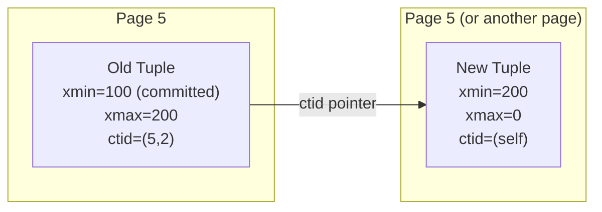
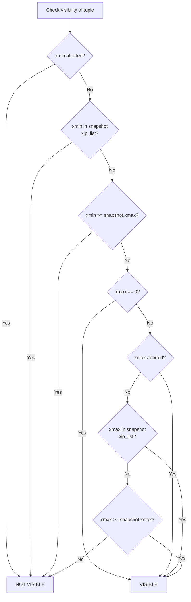
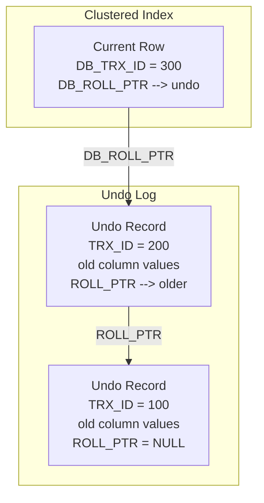
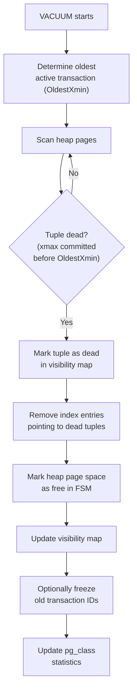
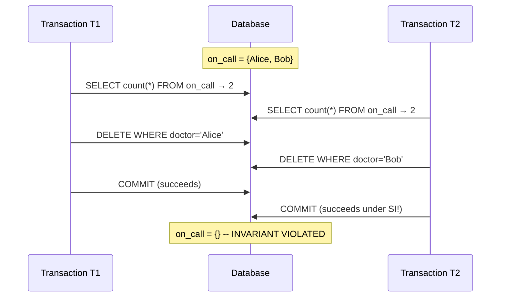
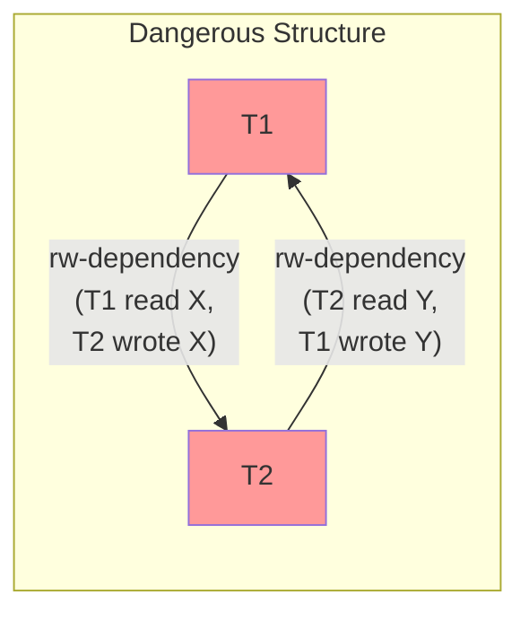
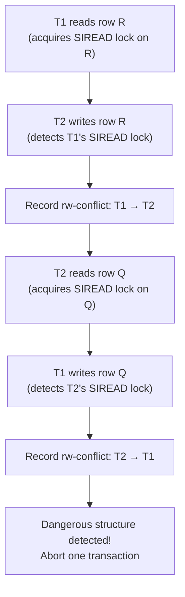
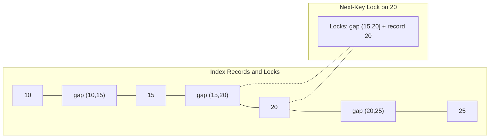
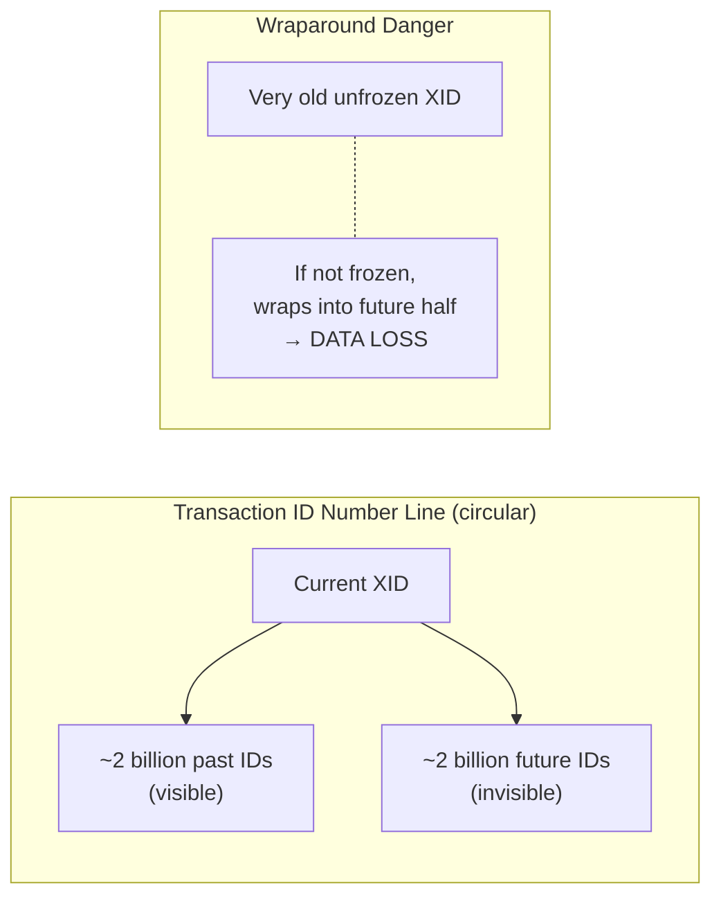
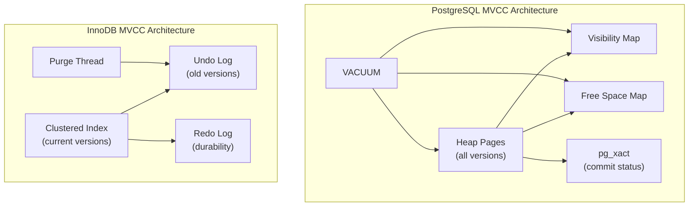

# Module 5: Deep Dive -- MVCC Internals, Advanced Locking, and Serializable Snapshot Isolation

## MVCC in PostgreSQL

PostgreSQL implements MVCC by storing multiple physical versions of each row (called **tuples**) directly in the table's heap pages. Unlike InnoDB, which stores old versions in a separate undo log, PostgreSQL keeps them in-place, which simplifies reads but requires a garbage collector (VACUUM).

### Tuple Header Fields

Every heap tuple carries a header with these concurrency-critical fields:

| Field | Size | Description |
|---|---|---|
| `xmin` | 4 bytes | Transaction ID that **inserted** this tuple version. |
| `xmax` | 4 bytes | Transaction ID that **deleted or updated** this tuple version. Zero if the tuple is live. |
| `cmin`/`cmax` | 4 bytes | Command ID within the transaction (for statement-level visibility within the same transaction). |
| `t_infomask` | 2 bytes | Bit flags indicating commit/abort status of xmin and xmax, lock status, etc. |
| `ctid` | 6 bytes | Physical location (block number + offset) of the **next version** in the update chain, or self-referencing if this is the latest version. |

### How an UPDATE Works

When transaction Tx 200 updates a row:

1. The existing tuple's `xmax` is set to 200.
2. A **new tuple** is created with `xmin = 200` and `xmax = 0`.
3. The old tuple's `ctid` is updated to point to the new tuple.
4. If the new tuple fits on the same page, it goes there (HOT update optimization). Otherwise, it goes to a different page and the old tuple becomes a redirect pointer.



### Transaction Snapshots

When PostgreSQL takes a snapshot (at transaction start for Repeatable Read, at statement start for Read Committed), it records:

- `xmin`: The lowest still-active transaction ID. All transactions below this are known to be committed or aborted.
- `xmax`: One past the highest transaction ID assigned so far. Any transaction ID >= xmax is in the future.
- `xip_list`: The list of transaction IDs that were **in-progress** at snapshot time.

### Visibility Check Algorithm

For a tuple to be visible to snapshot S:

```
visible(tuple, S):
    -- The inserting transaction must be committed and visible
    if tuple.xmin is aborted: return false
    if tuple.xmin is in S.xip_list: return false  -- inserter was in-progress
    if tuple.xmin >= S.xmax: return false          -- inserter is in the future

    -- If not deleted, it's visible
    if tuple.xmax == 0: return true

    -- The deleting transaction must NOT be committed and visible
    if tuple.xmax is aborted: return true           -- delete was rolled back
    if tuple.xmax is in S.xip_list: return true     -- deleter still in-progress
    if tuple.xmax >= S.xmax: return true             -- deleter is in the future

    -- Deleter committed and visible -- tuple is dead to us
    return false
```



### Hint Bits

Checking whether a transaction committed or aborted requires looking up `pg_xact` (formerly `pg_clog`), which is expensive. PostgreSQL caches this result in the tuple's `t_infomask` as **hint bits**:

- `XMIN_COMMITTED`, `XMIN_ABORTED`
- `XMAX_COMMITTED`, `XMAX_ABORTED`

The first transaction to check a tuple's visibility sets these bits, dirtying the page. Subsequent checks are fast.

---

## MVCC in MySQL/InnoDB

InnoDB takes a different architectural approach to MVCC.

### Undo Logs

Instead of storing old versions in the main table, InnoDB stores the **current version** in the clustered index (primary key B-tree) and keeps **previous versions in undo log segments** within the system tablespace or dedicated undo tablespaces.

Each row in the clustered index has hidden columns:
- `DB_TRX_ID`: The transaction ID of the last transaction that modified this row.
- `DB_ROLL_PTR`: A pointer into the undo log where the previous version can be reconstructed.



### Read Views

InnoDB creates a **read view** (equivalent to PostgreSQL's snapshot) that contains:
- `m_low_limit_id`: Transaction IDs >= this are invisible (future).
- `m_up_limit_id`: Transaction IDs < this are visible (all committed).
- `m_ids`: List of active (uncommitted) transaction IDs at the time the read view was created.
- `m_creator_trx_id`: The creating transaction's own ID (its own changes are visible).

### Version Traversal

When a SELECT encounters a row whose `DB_TRX_ID` is not visible according to the read view, InnoDB follows the `DB_ROLL_PTR` chain through the undo log to find the latest version that IS visible. This chain traversal can be expensive if many versions exist.

### Purge Thread

The **purge thread** is InnoDB's garbage collector. It removes undo log records that are no longer needed by any active read view. The purge thread:

1. Finds the oldest active read view.
2. Removes undo records created by transactions that committed before this read view.
3. Reclaims the space in undo log segments.

Long-running transactions prevent purging and cause undo log bloat.

---

## How PostgreSQL's VACUUM Works

Because PostgreSQL stores old tuple versions in-place, dead tuples accumulate in heap pages. VACUUM reclaims this space.

### What Dead Tuples Are

A tuple is **dead** when:
- Its `xmax` is a committed transaction AND
- No active transaction's snapshot could possibly see this tuple

### VACUUM Process



### Regular VACUUM vs VACUUM FULL

| | Regular VACUUM | VACUUM FULL |
|---|---|---|
| **Locking** | Does not block reads or writes (concurrent) | Acquires ACCESS EXCLUSIVE lock (blocks everything) |
| **Space reclamation** | Marks space as reusable within the table file; does NOT shrink the file | Rewrites the entire table into a new file; reclaims disk space |
| **Speed** | Fast for mostly-live tables | Slow; must copy every live tuple |
| **Use case** | Routine maintenance | Table is mostly dead tuples and disk space must be reclaimed |

### Autovacuum

PostgreSQL's **autovacuum** daemon automatically triggers VACUUM when a table accumulates enough dead tuples. Key parameters:

- `autovacuum_vacuum_threshold`: Minimum number of dead tuples before triggering (default 50).
- `autovacuum_vacuum_scale_factor`: Fraction of table size to add to threshold (default 0.2).
- Trigger condition: dead_tuples > threshold + scale_factor * table_size

---

## Snapshot Isolation vs Serializable Snapshot Isolation

### Snapshot Isolation (SI)

Snapshot Isolation provides each transaction with a consistent snapshot taken at transaction start. Key properties:

- **Consistent reads:** All reads see the same snapshot, regardless of concurrent commits.
- **First-committer-wins (FCW):** If two concurrent transactions modify the same row, the first to commit wins; the second is aborted.
- **Not serializable:** SI does **not** prevent write skew.

PostgreSQL's "Repeatable Read" actually provides Snapshot Isolation.

### The Write Skew Problem Under SI



Under SI, both transactions commit because they modified **different rows** -- there is no write-write conflict. But the combined effect violates the constraint that at least one doctor must be on call.

### Serializable Snapshot Isolation (SSI)

SSI, introduced by Cahill, Rohm, and Fekete (2008) and implemented in PostgreSQL 9.1, extends SI to detect and prevent **dangerous structures** that could lead to non-serializable outcomes.

SSI tracks **rw-dependencies** (read-write conflicts): an edge from T1 to T2 means T2 wrote something that T1 read (from an earlier version). A non-serializable execution is characterized by two **consecutive rw-dependency edges** in a cycle:

```
T1 --rw--> T2 --rw--> T3 (where T3 might be T1)
```

This is called a **dangerous structure** or **pivot**. When SSI detects two consecutive rw-dependencies involving a transaction, it aborts one of the transactions.



### PostgreSQL's SSI Implementation

PostgreSQL implements SSI using two key data structures:

1. **SIREAD locks:** Predicate locks that record what each serializable transaction has read. Unlike regular locks, SIREAD locks never block; they only record dependencies.

2. **rw-conflict list:** When a transaction writes a row that another serializable transaction has a SIREAD lock on, an rw-conflict edge is recorded.

When a transaction is involved in two rw-conflicts (one incoming, one outgoing), PostgreSQL aborts it with a serialization failure. The application must retry.



---

## Intent Locks in InnoDB

InnoDB uses a **hierarchical locking** scheme with intent locks to efficiently support both table-level and row-level locking.

| Lock | Purpose |
|---|---|
| **IS (Intent Shared)** | Transaction intends to set S locks on individual rows in the table. |
| **IX (Intent Exclusive)** | Transaction intends to set X locks on individual rows in the table. |
| **S (Shared)** | Shared table lock. |
| **X (Exclusive)** | Exclusive table lock. |

### Compatibility Matrix

|  | X | IX | S | IS |
|---|---|---|---|---|
| **X** | Conflict | Conflict | Conflict | Conflict |
| **IX** | Conflict | Compatible | Conflict | Compatible |
| **S** | Conflict | Conflict | Compatible | Compatible |
| **IS** | Conflict | Compatible | Compatible | Compatible |

Before a transaction can acquire an S lock on a row, it must acquire an IS or stronger lock on the table. Before acquiring an X lock on a row, it must acquire an IX lock on the table.

This allows table-level operations (like `LOCK TABLE ... WRITE`) to quickly check whether any row-level locks exist by checking for conflicting intent locks at the table level.

---

## Gap Locks and Next-Key Locks

InnoDB uses **gap locks** and **next-key locks** to prevent phantom reads at the Repeatable Read isolation level.

### Gap Lock

A gap lock locks the **gap between two index records**, preventing insertions into that gap. A gap lock does not lock the records themselves.

Example: If the index has values 10, 15, 20, a gap lock on the gap (15, 20) prevents any insert of a value between 15 and 20.

### Next-Key Lock

A next-key lock is a combination of a **record lock** on the index record AND a **gap lock** on the gap before the record. It locks the interval `(previous_record, this_record]`.



### Why They Prevent Phantoms

When a query like `SELECT * FROM t WHERE id BETWEEN 15 AND 20 FOR UPDATE` runs:

1. InnoDB acquires next-key locks on the index records in the range.
2. This locks the gaps between and including those records.
3. Any concurrent INSERT with a value in a locked gap will block until the locking transaction commits.

---

## Predicate Locks

Predicate locks are the theoretical ideal for preventing phantoms. Instead of locking specific rows or gaps, a predicate lock locks all rows matching a **logical condition** (predicate).

Example: `LOCK WHERE department = 'Engineering'` prevents any insert, update, or delete that would affect rows in the Engineering department.

In practice, predicate locks are expensive to implement and evaluate (requires checking whether a new row satisfies any active predicate). PostgreSQL's SSI uses **index-range SIREAD locks** as an approximation of predicate locks. InnoDB uses next-key locks as a structural approximation.

---

## Transaction ID Wraparound Problem in PostgreSQL

PostgreSQL uses 32-bit unsigned integers for transaction IDs, giving about 4.2 billion (2^32) possible values. With modular arithmetic, transaction IDs "wrap around": given a current transaction ID, the ~2 billion IDs in the "past" are visible, and the ~2 billion in the "future" are invisible.

### The Problem

If a tuple has an `xmin` that is more than 2 billion transactions in the past relative to the current transaction ID, it falls into the "future" half due to wraparound, making it **invisible** -- the data effectively disappears.

### The Solution: Freezing

VACUUM has a special responsibility: it **freezes** old transaction IDs. When a tuple's `xmin` is old enough (older than `vacuum_freeze_min_age` transactions), VACUUM replaces the `xmin` with a special `FrozenTransactionId` (value 2). This frozen ID is defined to be in the past for all normal transaction IDs.



### Aggressive Anti-Wraparound VACUUM

When a table's oldest unfrozen transaction ID approaches the wraparound danger zone (`autovacuum_freeze_max_age`, default 200 million), PostgreSQL launches an **aggressive autovacuum** that cannot be cancelled. If even this fails, PostgreSQL will **shut down** and refuse to start until manual VACUUM FREEZE is run, to prevent data loss.

Key monitoring query:

```sql
SELECT datname,
       age(datfrozenxid) as xid_age,
       current_setting('autovacuum_freeze_max_age')::int - age(datfrozenxid) as remaining
FROM pg_database
ORDER BY xid_age DESC;
```

---

## Summary

| Concept | PostgreSQL | MySQL/InnoDB |
|---|---|---|
| **MVCC storage** | In-place (heap tuples) | Current in clustered index, old in undo log |
| **Version pointer** | ctid (old to new) | DB_ROLL_PTR (new to old) |
| **GC mechanism** | VACUUM | Purge thread |
| **Phantom prevention** | SIREAD predicate locks (SSI) | Next-key locks |
| **Serializable** | SSI (optimistic) | Strict 2PL + gap locks (pessimistic) |
| **Default isolation** | Read Committed | Repeatable Read |
| **XID wraparound** | Yes (32-bit), needs freezing | No (uses redo log sequence numbers) |


