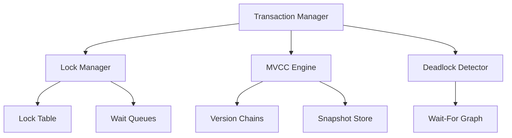
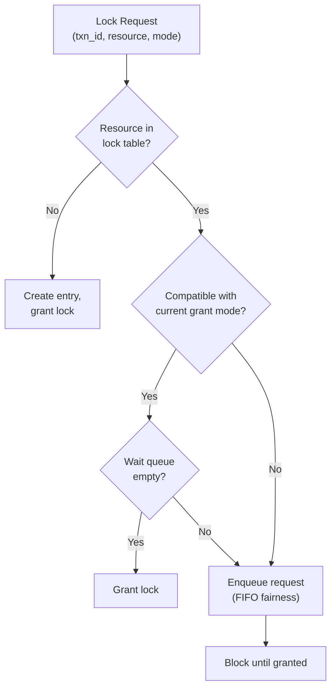
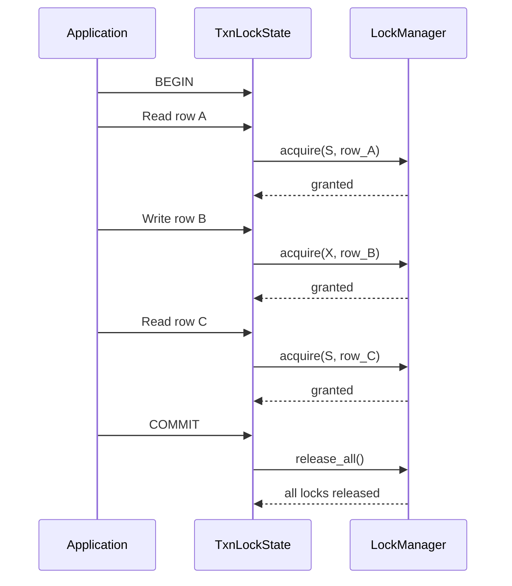
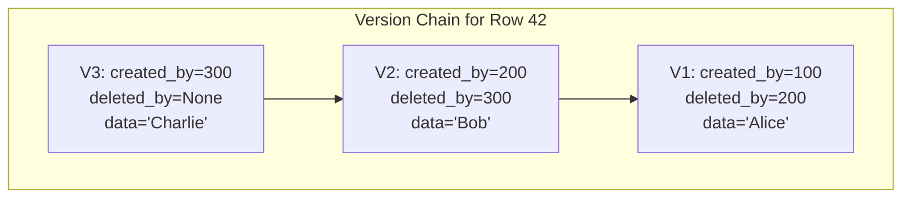
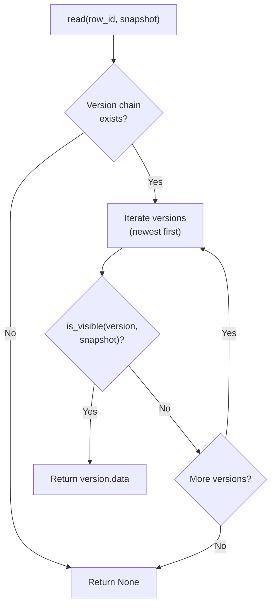
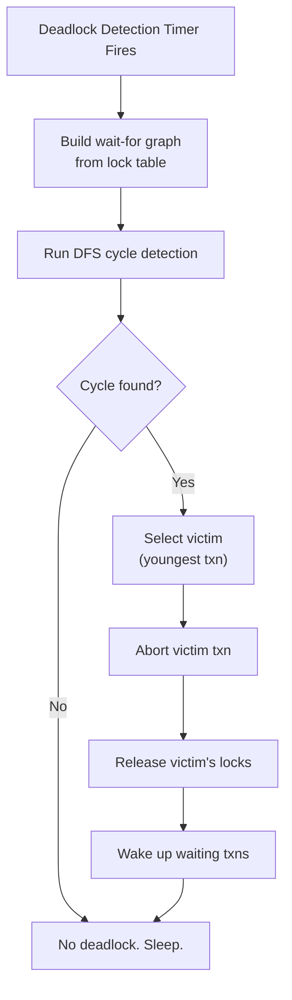
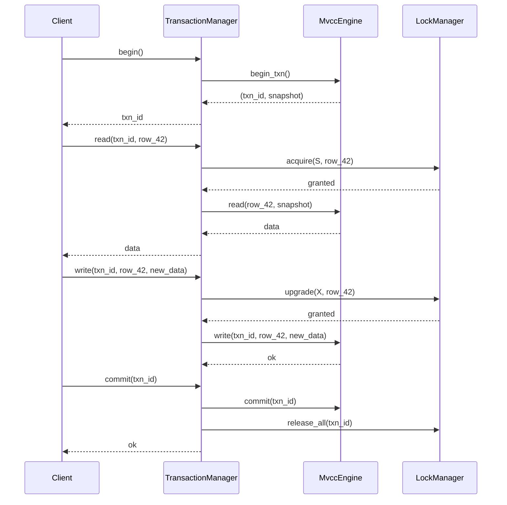
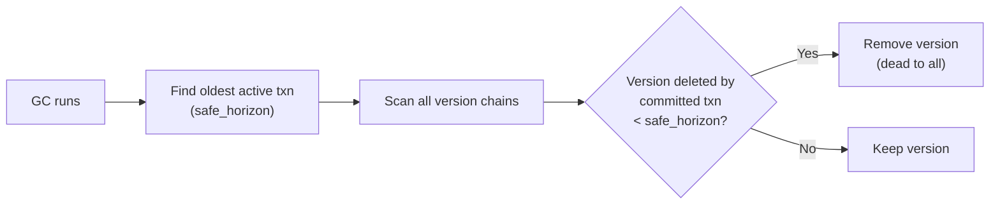

# Module 5: Implementation -- Lock Manager, 2PL, MVCC, and Deadlock Detection

## Overview

This module walks through implementing the core concurrency control components of a database engine:

1. A **lock manager** with a lock table and wait queues
2. The **Two-Phase Locking (2PL)** protocol
3. A basic **MVCC** engine with version chains and snapshot visibility
4. A **deadlock detector** using wait-for graph cycle detection
5. A **transaction manager** tying everything together

All examples are in Rust. We also reference the corresponding PostgreSQL source files.



---

## Part 1: Lock Manager

The lock manager is responsible for granting, queuing, and releasing locks on data items. Each data item (identified by a `ResourceId`) has an entry in the lock table.

### Data Structures

```rust
use std::collections::{HashMap, VecDeque};
use std::sync::{Mutex, Condvar, Arc};

/// Identifies a lockable resource (e.g., table + row id).
#[derive(Hash, Eq, PartialEq, Clone, Debug)]
pub struct ResourceId {
    pub table_id: u32,
    pub row_id: u64,
}

/// Lock modes.
#[derive(Clone, Copy, Debug, PartialEq)]
pub enum LockMode {
    Shared,
    Exclusive,
}

/// A single lock request in the wait queue.
#[derive(Debug)]
struct LockRequest {
    txn_id: u64,
    mode: LockMode,
    granted: bool,
}

/// Per-resource lock state.
struct LockEntry {
    /// Currently granted lock mode (None if no locks held).
    granted_mode: Option<LockMode>,
    /// Count of shared locks currently held.
    shared_count: u32,
    /// Set of transactions holding locks.
    holders: Vec<u64>,
    /// Ordered queue of pending requests.
    wait_queue: VecDeque<LockRequest>,
}

/// The lock table: maps each resource to its lock state.
pub struct LockManager {
    lock_table: Mutex<HashMap<ResourceId, LockEntry>>,
    /// Condition variable for waking up waiting transactions.
    cvar: Condvar,
}
```

### Lock Compatibility Check

```rust
impl LockEntry {
    fn is_compatible(&self, requested_mode: LockMode) -> bool {
        match self.granted_mode {
            None => true,
            Some(LockMode::Shared) => requested_mode == LockMode::Shared,
            Some(LockMode::Exclusive) => false,
        }
    }

    fn new() -> Self {
        LockEntry {
            granted_mode: None,
            shared_count: 0,
            holders: Vec::new(),
            wait_queue: VecDeque::new(),
        }
    }
}
```



### Acquire and Release

```rust
impl LockManager {
    pub fn new() -> Self {
        LockManager {
            lock_table: Mutex::new(HashMap::new()),
            cvar: Condvar::new(),
        }
    }

    /// Acquire a lock. Blocks if the lock cannot be immediately granted.
    pub fn acquire(&self, txn_id: u64, resource: &ResourceId, mode: LockMode) -> bool {
        let mut table = self.lock_table.lock().unwrap();

        let entry = table
            .entry(resource.clone())
            .or_insert_with(LockEntry::new);

        // Check if we can grant immediately (no waiters for fairness).
        if entry.wait_queue.is_empty() && entry.is_compatible(mode) {
            // Grant the lock.
            Self::grant_lock(entry, txn_id, mode);
            return true;
        }

        // Enqueue and wait.
        entry.wait_queue.push_back(LockRequest {
            txn_id,
            mode,
            granted: false,
        });

        // Wait until our request is granted.
        loop {
            table = self.cvar.wait(table).unwrap();
            let entry = table.get(&resource.clone()).unwrap();
            // Find our request in the queue.
            if let Some(req) = entry.wait_queue.iter().find(|r| r.txn_id == txn_id) {
                if req.granted {
                    return true;
                }
            } else {
                // We were removed from the queue (e.g., deadlock victim).
                return false;
            }
        }
    }

    /// Release all locks held by a transaction on a specific resource.
    pub fn release(&self, txn_id: u64, resource: &ResourceId) {
        let mut table = self.lock_table.lock().unwrap();

        if let Some(entry) = table.get_mut(resource) {
            entry.holders.retain(|&id| id != txn_id);
            if entry.holders.is_empty() {
                entry.granted_mode = None;
                entry.shared_count = 0;
            } else if entry.granted_mode == Some(LockMode::Shared) {
                entry.shared_count -= 1;
            }

            // Try to grant queued requests.
            Self::process_wait_queue(entry);

            // Wake up all waiting threads.
            self.cvar.notify_all();
        }
    }

    /// Release ALL locks held by a transaction (used at commit/abort).
    pub fn release_all(&self, txn_id: u64) {
        let mut table = self.lock_table.lock().unwrap();
        let resources: Vec<ResourceId> = table.keys().cloned().collect();

        for resource in resources {
            if let Some(entry) = table.get_mut(&resource) {
                let was_holder = entry.holders.contains(&txn_id);
                entry.holders.retain(|&id| id != txn_id);

                if was_holder {
                    if entry.holders.is_empty() {
                        entry.granted_mode = None;
                        entry.shared_count = 0;
                    }
                    Self::process_wait_queue(entry);
                }

                // Also remove from wait queue if waiting.
                entry.wait_queue.retain(|r| r.txn_id != txn_id);
            }
        }

        self.cvar.notify_all();
    }

    fn grant_lock(entry: &mut LockEntry, txn_id: u64, mode: LockMode) {
        entry.holders.push(txn_id);
        match mode {
            LockMode::Shared => {
                entry.shared_count += 1;
                if entry.granted_mode.is_none() {
                    entry.granted_mode = Some(LockMode::Shared);
                }
            }
            LockMode::Exclusive => {
                entry.granted_mode = Some(LockMode::Exclusive);
            }
        }
    }

    fn process_wait_queue(entry: &mut LockEntry) {
        let mut i = 0;
        while i < entry.wait_queue.len() {
            let req_mode = entry.wait_queue[i].mode;
            if entry.is_compatible(req_mode) {
                let req = &mut entry.wait_queue[i];
                req.granted = true;
                Self::grant_lock(entry, req.txn_id, req_mode);
                i += 1;
            } else {
                break; // Stop at first incompatible request (FIFO fairness).
            }
        }
        // Remove granted requests from queue.
        while entry.wait_queue.front().map_or(false, |r| r.granted) {
            entry.wait_queue.pop_front();
        }
    }
}
```

---

## Part 2: Two-Phase Locking Protocol

The 2PL wrapper ensures transactions follow the protocol: acquire locks as needed, but once any lock is released, no more locks can be acquired. For **Rigorous 2PL** (the practical variant), all locks are held until commit/abort.

```rust
use std::collections::HashSet;

pub struct TwoPhaseLocking {
    lock_manager: Arc<LockManager>,
}

/// Per-transaction lock tracking.
pub struct TxnLockState {
    txn_id: u64,
    held_locks: HashSet<(ResourceId, LockMode)>,
    shrinking: bool, // Only used in basic 2PL.
}

impl TwoPhaseLocking {
    pub fn new(lm: Arc<LockManager>) -> Self {
        TwoPhaseLocking { lock_manager: lm }
    }

    /// Acquire a lock, enforcing the growing phase.
    pub fn acquire(
        &self,
        state: &mut TxnLockState,
        resource: &ResourceId,
        mode: LockMode,
    ) -> Result<(), &'static str> {
        if state.shrinking {
            return Err("Cannot acquire locks in shrinking phase");
        }

        // Check if we already hold a compatible lock.
        if state.held_locks.contains(&(resource.clone(), mode)) {
            return Ok(());
        }

        // Upgrade: if we hold S and need X, release S first, then acquire X.
        if mode == LockMode::Exclusive
            && state.held_locks.contains(&(resource.clone(), LockMode::Shared))
        {
            // Lock upgrade -- release shared, acquire exclusive.
            self.lock_manager.release(state.txn_id, resource);
            state.held_locks.remove(&(resource.clone(), LockMode::Shared));
        }

        if self.lock_manager.acquire(state.txn_id, resource, mode) {
            state.held_locks.insert((resource.clone(), mode));
            Ok(())
        } else {
            Err("Lock acquisition failed (possible deadlock victim)")
        }
    }

    /// Rigorous 2PL: release all locks at commit/abort.
    pub fn release_all(&self, state: &mut TxnLockState) {
        self.lock_manager.release_all(state.txn_id);
        state.held_locks.clear();
    }
}
```



---

## Part 3: MVCC Implementation

### Version Chain

Each row has a chain of versions. The most recent version is at the head.

```rust
use std::collections::HashMap;
use std::sync::atomic::{AtomicU64, Ordering};

/// A single version of a row.
#[derive(Clone, Debug)]
pub struct RowVersion {
    pub created_by: u64,   // Transaction that created this version.
    pub deleted_by: Option<u64>, // Transaction that deleted/superseded this version.
    pub data: Vec<u8>,     // Serialized row data.
}

/// Snapshot for a transaction.
#[derive(Clone, Debug)]
pub struct Snapshot {
    pub txn_id: u64,
    pub active_txns: Vec<u64>, // Transaction IDs that were active at snapshot time.
    pub max_txn_id: u64,       // Highest assigned txn ID at snapshot time.
}

/// Transaction status.
#[derive(Clone, Copy, Debug, PartialEq)]
pub enum TxnStatus {
    Active,
    Committed,
    Aborted,
}

/// The MVCC engine.
pub struct MvccEngine {
    /// Row ID -> version chain (newest first).
    versions: Mutex<HashMap<u64, Vec<RowVersion>>>,
    /// Transaction ID -> status.
    txn_status: Mutex<HashMap<u64, TxnStatus>>,
    /// Next transaction ID.
    next_txn_id: AtomicU64,
}
```



### Snapshot Creation

```rust
impl MvccEngine {
    pub fn new() -> Self {
        MvccEngine {
            versions: Mutex::new(HashMap::new()),
            txn_status: Mutex::new(HashMap::new()),
            next_txn_id: AtomicU64::new(1),
        }
    }

    /// Begin a new transaction and take a snapshot.
    pub fn begin_txn(&self) -> (u64, Snapshot) {
        let txn_id = self.next_txn_id.fetch_add(1, Ordering::SeqCst);

        let mut status = self.txn_status.lock().unwrap();
        status.insert(txn_id, TxnStatus::Active);

        let active_txns: Vec<u64> = status
            .iter()
            .filter(|(_, &s)| s == TxnStatus::Active)
            .map(|(&id, _)| id)
            .collect();

        let snapshot = Snapshot {
            txn_id,
            active_txns,
            max_txn_id: txn_id,
        };

        (txn_id, snapshot)
    }
}
```

### Visibility Check

This is the heart of MVCC. Given a snapshot, determine which version of a row is visible.

```rust
impl MvccEngine {
    /// Check if a specific version is visible to the given snapshot.
    fn is_visible(&self, version: &RowVersion, snapshot: &Snapshot) -> bool {
        let status = self.txn_status.lock().unwrap();

        // Rule 1: The creating transaction must be committed and visible.
        let creator_status = status.get(&version.created_by);
        let creator_visible = match creator_status {
            Some(TxnStatus::Committed) => {
                // Committed, but was it committed before our snapshot?
                version.created_by < snapshot.max_txn_id
                    && !snapshot.active_txns.contains(&version.created_by)
            }
            _ if version.created_by == snapshot.txn_id => true, // Our own write.
            _ => false, // Active or aborted -- not visible.
        };

        if !creator_visible {
            return false;
        }

        // Rule 2: If deleted, the deleting txn must NOT be committed and visible.
        match version.deleted_by {
            None => true, // Not deleted -- visible.
            Some(deleter_id) if deleter_id == snapshot.txn_id => false, // We deleted it.
            Some(deleter_id) => {
                let deleter_status = status.get(&deleter_id);
                match deleter_status {
                    Some(TxnStatus::Committed) => {
                        // If deleter committed and is visible, tuple is dead.
                        if deleter_id < snapshot.max_txn_id
                            && !snapshot.active_txns.contains(&deleter_id)
                        {
                            false // Deleted and visible -- not visible to us.
                        } else {
                            true // Deleter committed but after our snapshot.
                        }
                    }
                    _ => true, // Deleter still active or aborted -- tuple still visible.
                }
            }
        }
    }

    /// Read a row: find the latest visible version.
    pub fn read(&self, row_id: u64, snapshot: &Snapshot) -> Option<Vec<u8>> {
        let versions = self.versions.lock().unwrap();
        if let Some(chain) = versions.get(&row_id) {
            for version in chain.iter() {
                if self.is_visible(version, snapshot) {
                    return Some(version.data.clone());
                }
            }
        }
        None
    }
}
```



### Write and Delete

```rust
impl MvccEngine {
    /// Write (insert or update) a row.
    pub fn write(
        &self,
        txn_id: u64,
        row_id: u64,
        data: Vec<u8>,
        snapshot: &Snapshot,
    ) -> Result<(), &'static str> {
        let mut versions = self.versions.lock().unwrap();
        let chain = versions.entry(row_id).or_insert_with(Vec::new);

        // If updating, mark the current visible version as deleted.
        for version in chain.iter_mut() {
            if self.is_visible(version, snapshot) {
                // First-updater-wins: check if someone else already deleted it.
                if let Some(deleter) = version.deleted_by {
                    if deleter != txn_id {
                        return Err("Write-write conflict (first-updater-wins)");
                    }
                }
                version.deleted_by = Some(txn_id);
                break;
            }
        }

        // Insert new version at the front of the chain.
        chain.insert(
            0,
            RowVersion {
                created_by: txn_id,
                deleted_by: None,
                data,
            },
        );

        Ok(())
    }

    /// Commit a transaction.
    pub fn commit(&self, txn_id: u64) {
        let mut status = self.txn_status.lock().unwrap();
        status.insert(txn_id, TxnStatus::Committed);
    }

    /// Abort a transaction: mark as aborted (versions remain but are invisible).
    pub fn abort(&self, txn_id: u64) {
        let mut status = self.txn_status.lock().unwrap();
        status.insert(txn_id, TxnStatus::Aborted);
    }
}
```

---

## Part 4: Deadlock Detection

The deadlock detector builds a wait-for graph from the lock manager's state and checks for cycles.

```rust
use std::collections::{HashMap, HashSet, VecDeque};

pub struct DeadlockDetector;

impl DeadlockDetector {
    /// Build a wait-for graph: edges from waiting txn -> holding txn.
    pub fn build_wait_for_graph(
        lock_table: &HashMap<ResourceId, LockEntry>,
    ) -> HashMap<u64, Vec<u64>> {
        let mut graph: HashMap<u64, Vec<u64>> = HashMap::new();

        for (_resource, entry) in lock_table.iter() {
            // Every waiter waits for every holder.
            for waiter in entry.wait_queue.iter() {
                if !waiter.granted {
                    for &holder in &entry.holders {
                        if holder != waiter.txn_id {
                            graph
                                .entry(waiter.txn_id)
                                .or_insert_with(Vec::new)
                                .push(holder);
                        }
                    }
                }
            }
        }

        graph
    }

    /// Detect cycles using DFS. Returns the cycle if found.
    pub fn detect_cycle(graph: &HashMap<u64, Vec<u64>>) -> Option<Vec<u64>> {
        let mut visited: HashSet<u64> = HashSet::new();
        let mut on_stack: HashSet<u64> = HashSet::new();
        let mut parent: HashMap<u64, u64> = HashMap::new();

        for &node in graph.keys() {
            if !visited.contains(&node) {
                if let Some(cycle) = Self::dfs(node, graph, &mut visited, &mut on_stack, &mut parent) {
                    return Some(cycle);
                }
            }
        }

        None
    }

    fn dfs(
        node: u64,
        graph: &HashMap<u64, Vec<u64>>,
        visited: &mut HashSet<u64>,
        on_stack: &mut HashSet<u64>,
        parent: &mut HashMap<u64, u64>,
    ) -> Option<Vec<u64>> {
        visited.insert(node);
        on_stack.insert(node);

        if let Some(neighbors) = graph.get(&node) {
            for &neighbor in neighbors {
                if !visited.contains(&neighbor) {
                    parent.insert(neighbor, node);
                    if let Some(cycle) = Self::dfs(neighbor, graph, visited, on_stack, parent) {
                        return Some(cycle);
                    }
                } else if on_stack.contains(&neighbor) {
                    // Found a cycle. Reconstruct it.
                    let mut cycle = vec![neighbor, node];
                    let mut current = node;
                    while let Some(&p) = parent.get(&current) {
                        if p == neighbor {
                            break;
                        }
                        cycle.push(p);
                        current = p;
                    }
                    cycle.reverse();
                    return Some(cycle);
                }
            }
        }

        on_stack.remove(&node);
        None
    }

    /// Select the youngest transaction in the cycle as the victim.
    pub fn select_victim(cycle: &[u64]) -> u64 {
        *cycle.iter().max().unwrap() // Highest txn_id = youngest.
    }
}
```



---

## Part 5: Transaction Manager

The transaction manager ties together the lock manager, MVCC engine, and deadlock detector.

```rust
pub struct TransactionManager {
    mvcc: Arc<MvccEngine>,
    locks: Arc<TwoPhaseLocking>,
    active_txns: Mutex<HashMap<u64, Transaction>>,
}

pub struct Transaction {
    pub txn_id: u64,
    pub snapshot: Snapshot,
    pub lock_state: TxnLockState,
    pub status: TxnStatus,
}

impl TransactionManager {
    pub fn begin(&self) -> u64 {
        let (txn_id, snapshot) = self.mvcc.begin_txn();
        let lock_state = TxnLockState {
            txn_id,
            held_locks: HashSet::new(),
            shrinking: false,
        };

        let txn = Transaction {
            txn_id,
            snapshot,
            lock_state,
            status: TxnStatus::Active,
        };

        self.active_txns.lock().unwrap().insert(txn_id, txn);
        txn_id
    }

    pub fn read(&self, txn_id: u64, row_id: u64) -> Result<Option<Vec<u8>>, &'static str> {
        let mut txns = self.active_txns.lock().unwrap();
        let txn = txns.get_mut(&txn_id).ok_or("Transaction not found")?;

        let resource = ResourceId { table_id: 0, row_id };
        self.locks.acquire(&mut txn.lock_state, &resource, LockMode::Shared)?;

        Ok(self.mvcc.read(row_id, &txn.snapshot))
    }

    pub fn write(&self, txn_id: u64, row_id: u64, data: Vec<u8>) -> Result<(), &'static str> {
        let mut txns = self.active_txns.lock().unwrap();
        let txn = txns.get_mut(&txn_id).ok_or("Transaction not found")?;

        let resource = ResourceId { table_id: 0, row_id };
        self.locks.acquire(&mut txn.lock_state, &resource, LockMode::Exclusive)?;

        self.mvcc.write(txn_id, row_id, data, &txn.snapshot)
    }

    pub fn commit(&self, txn_id: u64) -> Result<(), &'static str> {
        let mut txns = self.active_txns.lock().unwrap();
        let txn = txns.get_mut(&txn_id).ok_or("Transaction not found")?;

        self.mvcc.commit(txn_id);
        self.locks.release_all(&mut txn.lock_state);
        txn.status = TxnStatus::Committed;
        txns.remove(&txn_id);
        Ok(())
    }

    pub fn abort(&self, txn_id: u64) -> Result<(), &'static str> {
        let mut txns = self.active_txns.lock().unwrap();
        let txn = txns.get_mut(&txn_id).ok_or("Transaction not found")?;

        self.mvcc.abort(txn_id);
        self.locks.release_all(&mut txn.lock_state);
        txn.status = TxnStatus::Aborted;
        txns.remove(&txn_id);
        Ok(())
    }
}
```



---

## Part 6: Key PostgreSQL Source Files

Understanding where these mechanisms live in the PostgreSQL codebase:

| Component | Source Directory | Key Files |
|---|---|---|
| **Transaction manager** | `src/backend/access/transam/` | `xact.c` (begin/commit/abort), `xlog.c` (WAL), `varsup.c` (XID allocation) |
| **Lock manager** | `src/backend/storage/lmgr/` | `lock.c` (main lock manager), `proc.c` (wait queues), `deadlock.c` (deadlock detection) |
| **MVCC visibility** | `src/backend/utils/time/` | `tqual.c` (visibility checks - older versions), `snapshot.c` |
| **MVCC heap access** | `src/backend/access/heap/` | `heapam.c` (heap access methods), `heapam_visibility.c` (modern visibility) |
| **VACUUM** | `src/backend/commands/` | `vacuum.c`, `vacuumlazy.c` (lazy vacuum implementation) |
| **SSI** | `src/backend/storage/lmgr/` | `predicate.c` (SIREAD locks and SSI conflict detection) |
| **Snapshot management** | `src/backend/utils/time/` | `snapmgr.c` (snapshot creation, management) |
| **pg_xact (commit log)** | `src/backend/access/transam/` | `clog.c` (transaction commit status storage) |

### Reading `deadlock.c`

PostgreSQL's deadlock detection (`src/backend/storage/lmgr/deadlock.c`) runs when a lock wait exceeds `deadlock_timeout` (default 1 second). Key functions:

- `DeadLockCheck()`: Entry point. Builds the wait-for graph and searches for cycles.
- `FindLockCycle()`: DFS-based cycle detection.
- `DeadLockReport()`: Generates the error message with details of the deadlocked transactions.

The detector tries to find a resolution by checking if reordering the wait queue could break the deadlock before resorting to aborting a transaction.

---

## Garbage Collection (MVCC Cleanup)

A simple garbage collector that removes versions no longer visible to any active snapshot:

```rust
impl MvccEngine {
    /// Remove versions that are invisible to all active transactions.
    pub fn garbage_collect(&self) {
        let status = self.txn_status.lock().unwrap();
        let mut versions = self.versions.lock().unwrap();

        // Find the oldest active transaction.
        let oldest_active: Option<u64> = status
            .iter()
            .filter(|(_, &s)| s == TxnStatus::Active)
            .map(|(&id, _)| id)
            .min();

        let safe_horizon = oldest_active.unwrap_or(u64::MAX);

        for (_row_id, chain) in versions.iter_mut() {
            chain.retain(|version| {
                // Keep if: created by an active or future txn, or not yet superseded
                // by a committed txn visible to all.
                match version.deleted_by {
                    Some(deleter_id) => {
                        // If the deleter committed before the oldest active txn,
                        // this version is dead to everyone.
                        let deleter_committed = status
                            .get(&deleter_id)
                            .map_or(false, |&s| s == TxnStatus::Committed);
                        !(deleter_committed && deleter_id < safe_horizon)
                    }
                    None => true, // Not deleted; keep.
                }
            });
        }
    }
}
```



---

## Testing the Implementation

```rust
#[cfg(test)]
mod tests {
    use super::*;

    #[test]
    fn test_snapshot_isolation() {
        let engine = MvccEngine::new();

        // T1 writes row 1.
        let (t1, snap1) = engine.begin_txn();
        engine.write(t1, 1, b"hello".to_vec(), &snap1).unwrap();
        engine.commit(t1);

        // T2 takes a snapshot, sees "hello".
        let (t2, snap2) = engine.begin_txn();
        assert_eq!(engine.read(1, &snap2), Some(b"hello".to_vec()));

        // T3 updates row 1 to "world" and commits.
        let (t3, snap3) = engine.begin_txn();
        engine.write(t3, 1, b"world".to_vec(), &snap3).unwrap();
        engine.commit(t3);

        // T2 still sees "hello" (snapshot isolation).
        assert_eq!(engine.read(1, &snap2), Some(b"hello".to_vec()));

        // New transaction sees "world".
        let (_t4, snap4) = engine.begin_txn();
        assert_eq!(engine.read(1, &snap4), Some(b"world".to_vec()));
    }

    #[test]
    fn test_write_write_conflict() {
        let engine = MvccEngine::new();

        let (t1, snap1) = engine.begin_txn();
        engine.write(t1, 1, b"v1".to_vec(), &snap1).unwrap();
        engine.commit(t1);

        let (t2, snap2) = engine.begin_txn();
        let (t3, snap3) = engine.begin_txn();

        engine.write(t2, 1, b"v2".to_vec(), &snap2).unwrap();
        // T3 should fail with write-write conflict.
        let result = engine.write(t3, 1, b"v3".to_vec(), &snap3);
        assert!(result.is_err());
    }
}
```
