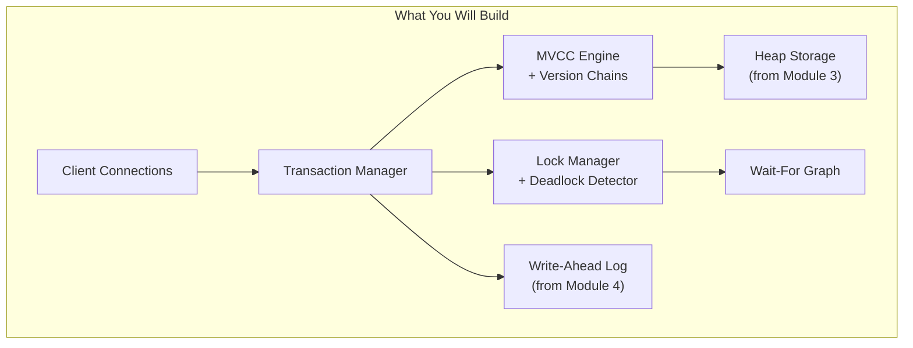
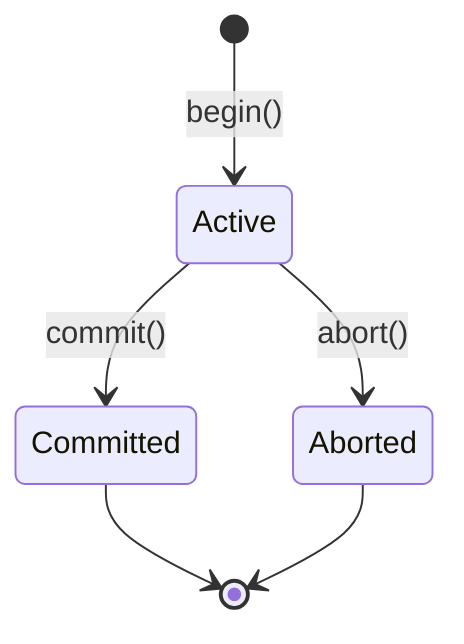
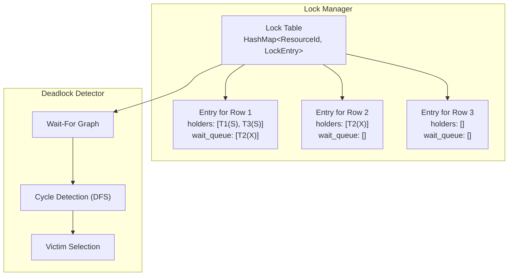
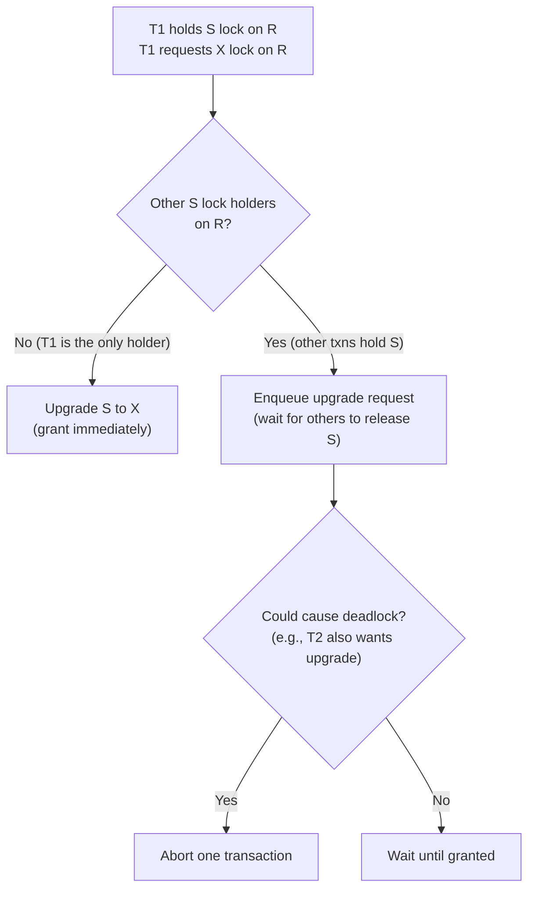
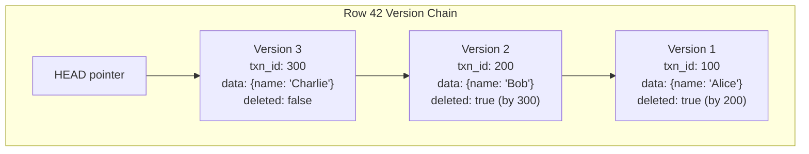
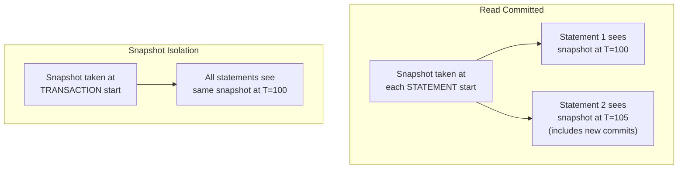
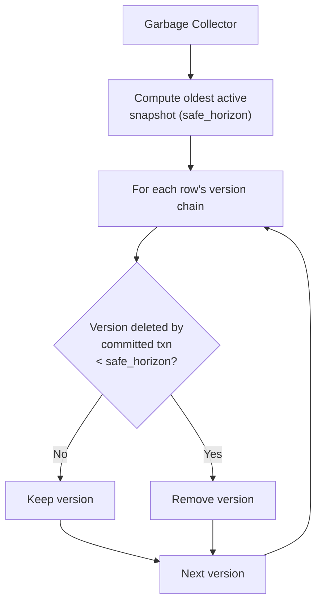
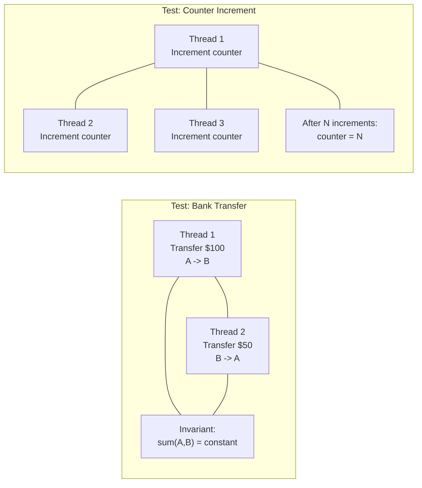
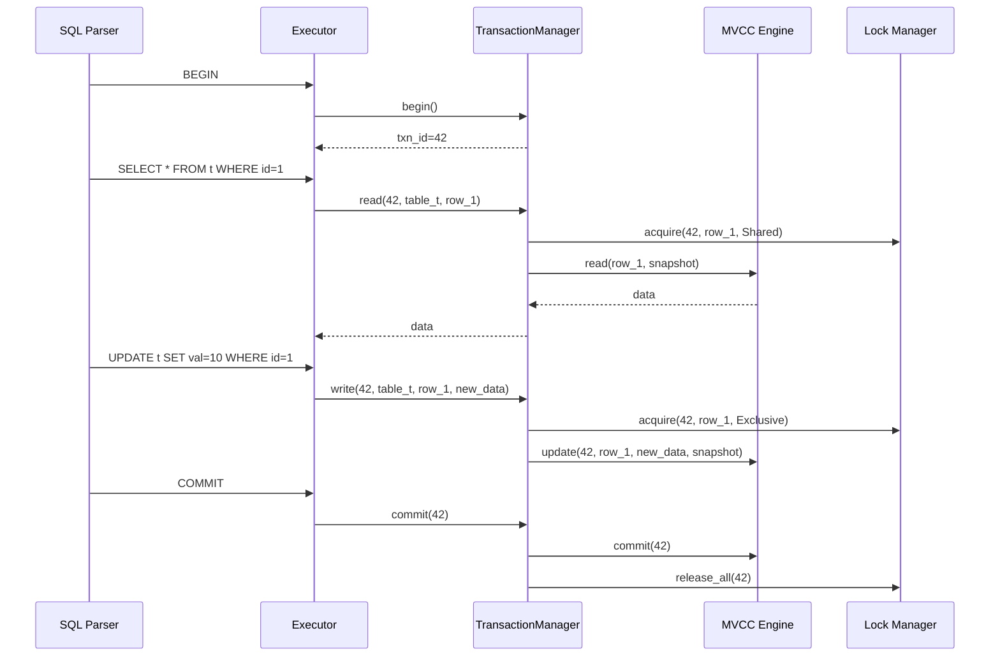
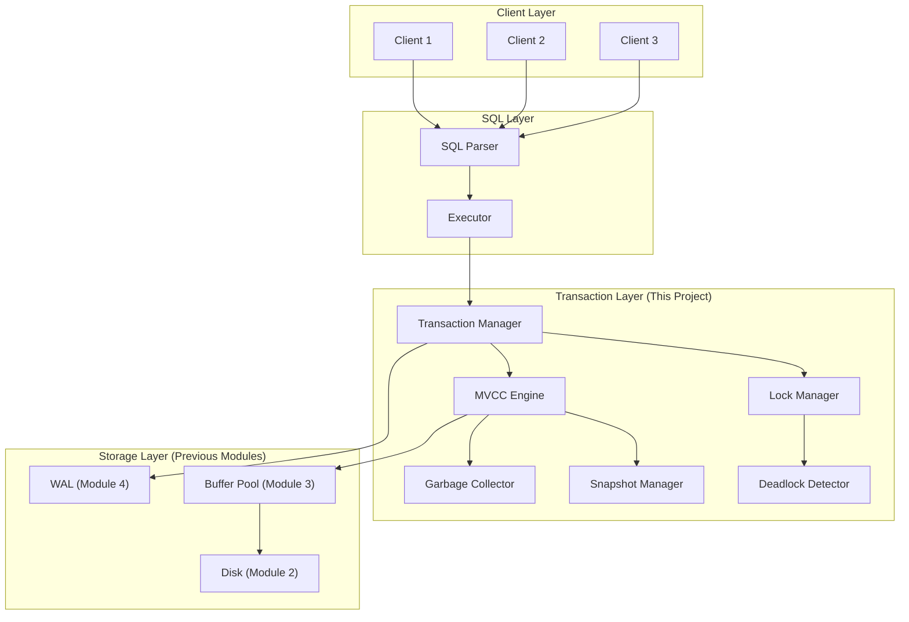

# Module 5: Project -- Add Transaction Support to Your Database

## Project Overview

In this project, you will add a complete transaction layer to your database engine. By the end, your database will support:

1. **Transaction lifecycle**: BEGIN, COMMIT, ABORT
2. **A lock manager** with shared/exclusive locks and deadlock detection
3. **MVCC** with version chains and snapshot-based visibility
4. **Two isolation levels**: Read Committed and Snapshot Isolation
5. **Concurrent workload testing** to verify correctness

This is the most architecturally significant module. Transactions touch almost every component of the database engine.



---

## Milestone 1: Transaction Manager Skeleton

### Goal

Create a `TransactionManager` that can begin, commit, and abort transactions. Each transaction gets a unique, monotonically increasing transaction ID.

### Data Structures

```rust
pub type TxnId = u64;

#[derive(Debug, Clone, Copy, PartialEq)]
pub enum TxnStatus {
    Active,
    Committed,
    Aborted,
}

pub struct Transaction {
    pub id: TxnId,
    pub status: TxnStatus,
    pub start_ts: u64,       // Timestamp or txn ID at start.
    pub snapshot: Snapshot,   // MVCC snapshot.
    pub write_set: Vec<WriteRecord>, // For undo on abort.
}

pub struct WriteRecord {
    pub table_id: u32,
    pub row_id: u64,
    pub old_version: Option<Vec<u8>>, // For rollback.
}

pub struct TransactionManager {
    next_txn_id: AtomicU64,
    active_txns: RwLock<HashMap<TxnId, Transaction>>,
    committed_txns: RwLock<HashSet<TxnId>>,
}
```

### Implementation Steps

1. `begin() -> TxnId`: Allocate a new transaction ID. Create a `Transaction` struct. Take a snapshot (Milestone 3). Store in `active_txns`.

2. `commit(txn_id)`:
   - Mark the transaction as Committed.
   - Move the txn ID to `committed_txns`.
   - Release all locks (Milestone 2).
   - Write a COMMIT record to the WAL.

3. `abort(txn_id)`:
   - Undo all writes in the `write_set` (apply old versions or delete newly inserted versions).
   - Mark the transaction as Aborted.
   - Release all locks.
   - Write an ABORT record to the WAL.

### Testing

```rust
#[test]
fn test_begin_commit() {
    let tm = TransactionManager::new();
    let t1 = tm.begin();
    assert_eq!(tm.get_status(t1), TxnStatus::Active);
    tm.commit(t1);
    assert_eq!(tm.get_status(t1), TxnStatus::Committed);
}

#[test]
fn test_begin_abort() {
    let tm = TransactionManager::new();
    let t1 = tm.begin();
    tm.abort(t1);
    assert_eq!(tm.get_status(t1), TxnStatus::Aborted);
}

#[test]
fn test_unique_ids() {
    let tm = TransactionManager::new();
    let t1 = tm.begin();
    let t2 = tm.begin();
    assert_ne!(t1, t2);
    assert!(t2 > t1);
}
```



---

## Milestone 2: Lock Manager with Deadlock Detection

### Goal

Implement a lock manager that supports shared and exclusive locks at row granularity, with FIFO fairness and cycle-based deadlock detection.

### Architecture



### Implementation Steps

1. **Lock Table**: HashMap from `ResourceId` (table_id, row_id) to `LockEntry`.

2. **LockEntry**: Track current holders (txn_ids and their lock modes), and a FIFO wait queue of pending requests.

3. **acquire(txn_id, resource, mode) -> Result**:
   - If the request is compatible with the current grant mode AND the wait queue is empty, grant immediately.
   - Otherwise, enqueue the request and block the calling thread.
   - Before blocking, run deadlock detection. If a cycle is found involving this transaction, return an error instead of blocking.

4. **release(txn_id, resource)**:
   - Remove the transaction from the holders list.
   - Process the wait queue: grant requests at the head of the queue that are now compatible.
   - Wake up threads whose requests were granted.

5. **Deadlock Detection**:
   - Build a wait-for graph from the lock table.
   - Run DFS to find cycles.
   - If a cycle is found, select the youngest transaction as the victim and abort it.

### Lock Upgrade

Handle the case where a transaction holds a Shared lock and needs to upgrade to Exclusive:



### Testing

```rust
#[test]
fn test_shared_locks_concurrent() {
    let lm = LockManager::new();
    let r = ResourceId { table_id: 0, row_id: 1 };
    assert!(lm.acquire(1, &r, LockMode::Shared).is_ok());
    assert!(lm.acquire(2, &r, LockMode::Shared).is_ok()); // Should succeed.
}

#[test]
fn test_exclusive_blocks_shared() {
    // T1 holds X on R. T2 requests S on R.
    // T2 should block until T1 releases.
    // (Use threads to test blocking behavior.)
}

#[test]
fn test_deadlock_detection() {
    // T1 holds lock on A, requests lock on B.
    // T2 holds lock on B, requests lock on A.
    // Deadlock should be detected; one transaction aborted.
}
```

---

## Milestone 3: MVCC Engine

### Goal

Implement multi-version concurrency control with version chains, snapshot creation, and visibility checks.

### Version Storage



### Implementation Steps

1. **RowVersion struct**: Stores `created_by`, `deleted_by`, `data`, and a pointer/index to the previous version.

2. **Version Store**: A HashMap from row_id to a Vec of RowVersions (newest first).

3. **Snapshot**: Captures `txn_id`, `active_txns` list, and `max_txn_id`.

4. **create_snapshot() -> Snapshot**:
   - Record current txn_id.
   - Copy the list of active transaction IDs.
   - Record the current max assigned txn_id.

5. **is_visible(version, snapshot) -> bool**: The core visibility check (see implementation.md for details).

6. **read(row_id, snapshot) -> Option<Data>**: Walk the version chain, return the first visible version.

7. **insert(txn_id, row_id, data)**: Create a new version at the head of the chain.

8. **update(txn_id, row_id, data, snapshot) -> Result**:
   - Find the currently visible version.
   - Check for write-write conflicts (first-updater-wins).
   - Mark the visible version as deleted by txn_id.
   - Insert a new version at the head.

9. **delete(txn_id, row_id, snapshot) -> Result**:
   - Find the currently visible version.
   - Mark it as deleted by txn_id.

### Isolation Level Differences



**Read Committed**: Create a new snapshot for each statement (each call to read/scan).

**Snapshot Isolation**: Create the snapshot once at `begin()` and reuse it for all operations within the transaction.

### Testing

```rust
#[test]
fn test_insert_and_read() {
    let mvcc = MvccEngine::new();
    let (t1, snap1) = mvcc.begin_txn();
    mvcc.insert(t1, 1, b"hello".to_vec());
    // T1 can see its own insert.
    assert_eq!(mvcc.read(1, &snap1), Some(b"hello".to_vec()));
    mvcc.commit(t1);
}

#[test]
fn test_snapshot_isolation() {
    let mvcc = MvccEngine::new();
    // Setup: insert initial value.
    let (t1, s1) = mvcc.begin_txn();
    mvcc.insert(t1, 1, b"v1".to_vec());
    mvcc.commit(t1);

    // T2 starts and takes a snapshot.
    let (t2, s2) = mvcc.begin_txn();

    // T3 updates and commits.
    let (t3, s3) = mvcc.begin_txn();
    mvcc.update(t3, 1, b"v2".to_vec(), &s3).unwrap();
    mvcc.commit(t3);

    // T2 should still see v1 under snapshot isolation.
    assert_eq!(mvcc.read(1, &s2), Some(b"v1".to_vec()));
}

#[test]
fn test_write_write_conflict() {
    let mvcc = MvccEngine::new();
    let (t1, s1) = mvcc.begin_txn();
    mvcc.insert(t1, 1, b"v1".to_vec());
    mvcc.commit(t1);

    let (t2, s2) = mvcc.begin_txn();
    let (t3, s3) = mvcc.begin_txn();

    mvcc.update(t2, 1, b"v2".to_vec(), &s2).unwrap();
    assert!(mvcc.update(t3, 1, b"v3".to_vec(), &s3).is_err());
}

#[test]
fn test_abort_invisible() {
    let mvcc = MvccEngine::new();
    let (t1, s1) = mvcc.begin_txn();
    mvcc.insert(t1, 1, b"v1".to_vec());
    mvcc.abort(t1);

    let (t2, s2) = mvcc.begin_txn();
    assert_eq!(mvcc.read(1, &s2), None); // Aborted insert is invisible.
}
```

---

## Milestone 4: Garbage Collection

### Goal

Implement a garbage collector that removes old versions no longer visible to any active transaction.

### Implementation Steps



1. **Compute safe horizon**: Find the minimum txn_id among all active transactions' snapshots.

2. **Scan version chains**: For each row, walk the version chain. A version can be removed if:
   - It has a `deleted_by` txn that is committed AND
   - That deleting txn's ID < safe_horizon (meaning all active snapshots are newer, so none can see this version).

3. **Retain at least one version**: Never remove the latest visible version of a row.

4. **Run periodically**: Either on a timer (like autovacuum) or after a threshold of dead versions accumulates.

### Testing

```rust
#[test]
fn test_gc_removes_old_versions() {
    let mvcc = MvccEngine::new();

    // Insert, update, update.
    let (t1, s1) = mvcc.begin_txn();
    mvcc.insert(t1, 1, b"v1".to_vec());
    mvcc.commit(t1);

    let (t2, s2) = mvcc.begin_txn();
    mvcc.update(t2, 1, b"v2".to_vec(), &s2).unwrap();
    mvcc.commit(t2);

    let (t3, s3) = mvcc.begin_txn();
    mvcc.update(t3, 1, b"v3".to_vec(), &s3).unwrap();
    mvcc.commit(t3);

    // No active transactions -- all old versions can be collected.
    mvcc.garbage_collect();

    // Only the latest version should remain.
    assert_eq!(mvcc.version_count(1), 1);
}
```

---

## Milestone 5: Concurrent Workload Testing

### Goal

Verify correctness under concurrent access. Use multiple threads to simulate concurrent transactions and check for anomalies.

### Test Scenarios



#### Test 1: Bank Transfer (No Lost Updates)

```rust
#[test]
fn test_concurrent_transfers() {
    let tm = Arc::new(TransactionManager::new());
    // Initialize: A=1000, B=1000.

    let mut handles = vec![];
    for _ in 0..100 {
        let tm = tm.clone();
        handles.push(thread::spawn(move || {
            loop {
                let txn = tm.begin();
                match tm.transfer(txn, account_a, account_b, 10) {
                    Ok(_) => { tm.commit(txn); break; }
                    Err(_) => { tm.abort(txn); } // Retry on conflict.
                }
            }
        }));
    }

    for h in handles { h.join().unwrap(); }

    // Invariant: A + B should still equal 2000.
    let total = tm.read_balance(account_a) + tm.read_balance(account_b);
    assert_eq!(total, 2000);
}
```

#### Test 2: Dirty Read Prevention

```rust
#[test]
fn test_no_dirty_reads() {
    // T1 writes but does not commit.
    // T2 reads the same row.
    // T2 must NOT see T1's uncommitted write.
}
```

#### Test 3: Snapshot Consistency

```rust
#[test]
fn test_snapshot_consistency() {
    // T1 takes a snapshot.
    // T2 updates and commits.
    // T1 reads the same row again.
    // At Snapshot Isolation, T1 must see the old value both times.
}
```

#### Test 4: Deadlock Recovery

```rust
#[test]
fn test_deadlock_recovery() {
    // Create a deadlock between T1 and T2.
    // Verify that the deadlock detector aborts one transaction.
    // Verify that the other transaction completes successfully.
    // Verify that the aborted transaction can be retried and succeeds.
}
```

---

## Milestone 6: Integration with SQL Layer

### Goal

Wire the transaction manager into your SQL execution engine so that SQL statements respect transaction boundaries.

### SQL Commands to Support

```sql
BEGIN;                          -- Start a transaction
BEGIN ISOLATION LEVEL SNAPSHOT; -- Start with Snapshot Isolation
COMMIT;                        -- Commit the transaction
ROLLBACK;                      -- Abort the transaction

-- These should automatically acquire appropriate locks:
SELECT * FROM t WHERE id = 1;        -- Shared lock (or just MVCC read)
UPDATE t SET val = 10 WHERE id = 1;  -- Exclusive lock + MVCC write
INSERT INTO t VALUES (1, 'hello');   -- Exclusive lock + MVCC insert
DELETE FROM t WHERE id = 1;          -- Exclusive lock + MVCC delete
```



---

## Deliverables Checklist

```
[ ] TransactionManager with begin/commit/abort
[ ] Unique monotonic transaction ID allocation
[ ] Write-set tracking for rollback on abort
[ ] Lock Manager with shared/exclusive locks
[ ] FIFO wait queue for fairness
[ ] Lock upgrade (S -> X)
[ ] Wait-for graph construction
[ ] DFS cycle detection for deadlocks
[ ] Victim selection and abort
[ ] MVCC version chains
[ ] Snapshot creation (per-txn and per-statement)
[ ] Visibility check implementation
[ ] First-updater-wins conflict detection
[ ] Read Committed isolation level
[ ] Snapshot Isolation level
[ ] Garbage collector for old versions
[ ] Concurrent bank transfer test (invariant preserved)
[ ] Concurrent increment test (no lost updates)
[ ] Dirty read prevention test
[ ] Snapshot consistency test
[ ] Deadlock detection and recovery test
[ ] SQL integration (BEGIN/COMMIT/ROLLBACK)
```

---

## Architecture Diagram



---

## Stretch Goals

1. **Serializable Snapshot Isolation (SSI)**: Track rw-dependencies using SIREAD locks. Detect dangerous structures (two consecutive rw-dependencies). Abort one transaction when detected.

2. **Savepoints**: Support `SAVEPOINT name` and `ROLLBACK TO name` for partial rollback within a transaction.

3. **Table-level intent locks**: Add IS/IX locks at the table level to support efficient table-level DDL operations.

4. **Performance benchmarking**: Measure throughput (transactions per second) at different isolation levels and contention levels. Compare lock-based vs MVCC approaches.
