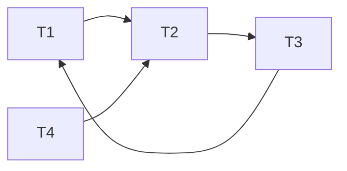

# Module 5: Questions -- Transactions & Concurrency Control

## Instructions

Each question tests your understanding of transactions, isolation levels, locking protocols, MVCC, and concurrency anomalies. Answers are in collapsible sections below each question.

---

## Question 1: Identifying Dirty Read

Consider this schedule:

```
T1: WRITE(A, 100)
T2: READ(A)        -- reads 100
T1: ABORT
T2: COMMIT
```

What concurrency anomaly has occurred? Which isolation level is the minimum required to prevent it?

<details>
<summary>Answer</summary>

This is a **dirty read**. T2 read a value written by T1, but T1 subsequently aborted. T2 has committed a result based on data that never officially existed.

The minimum isolation level to prevent dirty reads is **Read Committed**. At Read Committed, a transaction only sees data committed before the current statement began.
</details>

---

## Question 2: Non-Repeatable Read

```
T1: READ(A)    -- returns 50
T2: WRITE(A, 75)
T2: COMMIT
T1: READ(A)    -- returns 75
T1: COMMIT
```

What anomaly is this? Name two isolation levels that prevent it.

<details>
<summary>Answer</summary>

This is a **non-repeatable read** (also called a fuzzy read). T1 reads the same item A twice within the same transaction and gets different values because T2 modified and committed A between the two reads.

**Repeatable Read** and **Serializable** both prevent this anomaly. At Repeatable Read, T1's snapshot is fixed at transaction start, so it would see 50 for both reads regardless of T2's commit.
</details>

---

## Question 3: Phantom Read

```
T1: SELECT * FROM orders WHERE amount > 100;    -- returns rows {1, 2, 3}
T2: INSERT INTO orders (id, amount) VALUES (4, 200);
T2: COMMIT;
T1: SELECT * FROM orders WHERE amount > 100;    -- returns rows {1, 2, 3, 4}
```

What anomaly is this? How does InnoDB prevent it at Repeatable Read?

<details>
<summary>Answer</summary>

This is a **phantom read**. A new row matching T1's query predicate appeared between T1's two executions of the same query.

InnoDB prevents phantoms at Repeatable Read using **next-key locks**. When T1 executes the range query, InnoDB acquires next-key locks on the index range covering `amount > 100`. This blocks T2's INSERT because the insert would need to place a record in a locked gap.

Note: The SQL standard says phantoms are possible at Repeatable Read, but InnoDB's implementation goes beyond the standard by using gap locking.
</details>

---

## Question 4: Write Skew

Two doctors are on call. Hospital policy requires at least one doctor on call at all times.

```
T1: SELECT count(*) FROM on_call;  -- returns 2
T2: SELECT count(*) FROM on_call;  -- returns 2
T1: DELETE FROM on_call WHERE doctor = 'Alice';
T2: DELETE FROM on_call WHERE doctor = 'Bob';
T1: COMMIT;
T2: COMMIT;
```

What anomaly is this? Why doesn't Snapshot Isolation prevent it? What isolation level does prevent it?

<details>
<summary>Answer</summary>

This is **write skew**. Both transactions read an overlapping data set (the on_call count), make decisions based on it (safe to remove one doctor), and write to disjoint items (Alice vs Bob). The combined effect violates the invariant.

Snapshot Isolation does NOT prevent write skew because there is no write-write conflict -- T1 and T2 modify different rows. SI only detects conflicts when two transactions write the same row.

**Serializable** isolation prevents write skew. PostgreSQL's SSI implementation would detect the rw-dependency cycle: T1 read rows that T2's delete affects, and T2 read rows that T1's delete affects. SSI would abort one of them.
</details>

---

## Question 5: Lock Compatibility

Transaction T1 holds a Shared lock on row R. Transaction T2 requests an Exclusive lock on R. Transaction T3 then requests a Shared lock on R.

In a fair (FIFO) lock manager, what happens to T3's request?

<details>
<summary>Answer</summary>

T3's Shared lock request is **queued behind T2's Exclusive request**, even though a Shared lock is compatible with T1's Shared lock. This is because a fair lock manager uses FIFO ordering -- T2 requested first and is waiting, so T3 must wait behind T2.

If the lock manager did not enforce FIFO fairness, Exclusive lock requests could be **starved** indefinitely by a continuous stream of Shared lock requests.
</details>

---

## Question 6: Two-Phase Locking Violation

```
T1: LOCK_S(A)
T1: READ(A)
T1: UNLOCK(A)      -- shrinking phase begins
T1: LOCK_X(B)      -- !! acquiring after releasing
T1: WRITE(B)
T1: UNLOCK(B)
T1: COMMIT
```

Does this schedule follow 2PL? What could go wrong?

<details>
<summary>Answer</summary>

**No**, this violates 2PL. T1 releases the lock on A (entering the shrinking phase) and then acquires a lock on B. 2PL requires that once any lock is released, no new locks can be acquired.

What could go wrong: Another transaction T2 could acquire a lock on A after T1 releases it, read A, then conflict with T1 on B. This could produce a non-serializable schedule. 2PL's guarantee of serializability depends on the lock point establishing a total order among conflicting transactions; releasing early breaks this ordering.
</details>

---

## Question 7: Strict vs Rigorous 2PL

What is the difference between Strict 2PL and Rigorous 2PL? Which does PostgreSQL effectively use?

<details>
<summary>Answer</summary>

- **Strict 2PL**: Holds all **Exclusive (X) locks** until commit/abort. Shared locks may be released earlier (in the shrinking phase). This prevents cascading aborts.

- **Rigorous 2PL**: Holds **all locks (both S and X)** until commit/abort. This additionally guarantees that the serialization order matches the commit order (commit-order serializability).

PostgreSQL does not use traditional 2PL for reads (it uses MVCC snapshots instead), but for write conflicts and explicit `SELECT ... FOR UPDATE`, it effectively uses Rigorous 2PL -- all locks are held until end of transaction.
</details>

---

## Question 8: Deadlock Detection

Given the following wait-for graph, is there a deadlock? If so, which transaction should be aborted?

```
T1 --> T2
T2 --> T3
T3 --> T1
T4 --> T2
```



<details>
<summary>Answer</summary>

**Yes**, there is a deadlock. The cycle is: T1 -> T2 -> T3 -> T1.

T4 is involved in a wait but is NOT part of the cycle (T4 waits for T2, but no one waits for T4).

Using the "abort youngest" heuristic, the transaction with the highest ID in the cycle (T3) would be selected as the victim and aborted, breaking the cycle.
</details>

---

## Question 9: Wait-Die Protocol

Transaction T1 (timestamp=10) requests a lock held by T2 (timestamp=20). Under the Wait-Die protocol, what happens? What if the roles were reversed?

<details>
<summary>Answer</summary>

**Wait-Die** is non-preemptive:
- If the requestor is **older** (smaller timestamp) than the holder, it **waits**.
- If the requestor is **younger** (larger timestamp) than the holder, it **dies** (aborts).

T1 (ts=10) requests lock held by T2 (ts=20): T1 is older, so T1 **waits**.

If reversed -- T2 (ts=20) requests lock held by T1 (ts=10): T2 is younger, so T2 **dies** (aborts and restarts with the same timestamp).

Key insight: older transactions never abort for younger ones, preventing starvation of long-running transactions.
</details>

---

## Question 10: Wound-Wait Protocol

Same setup: T1 (timestamp=10) requests a lock held by T2 (timestamp=20). Under Wound-Wait, what happens?

<details>
<summary>Answer</summary>

**Wound-Wait** is preemptive:
- If the requestor is **older** than the holder, it **wounds** the holder (forces the holder to abort).
- If the requestor is **younger** than the holder, it **waits**.

T1 (ts=10) requests lock held by T2 (ts=20): T1 is older, so T1 **wounds** T2 -- T2 is forced to abort and release its lock.

If reversed -- T2 (ts=20) requests lock held by T1 (ts=10): T2 is younger, so T2 **waits**.
</details>

---

## Question 11: MVCC Visibility

Given this sequence of events:

```
T100: INSERT row (id=1, name='Alice')   -- COMMITTED
T200: UPDATE row (id=1, name='Bob')     -- COMMITTED
T300: UPDATE row (id=1, name='Charlie') -- IN PROGRESS
```

A new transaction T350 starts with snapshot: `{ txn_id=350, active_txns=[300], max_txn_id=350 }`.

What value of `name` does T350 see for row id=1?

<details>
<summary>Answer</summary>

T350 sees **'Bob'** (the version created by T200).

Reasoning:
- Version created by T300 ('Charlie'): T300 is in `active_txns`, so this version is NOT visible.
- Version created by T200 ('Bob'): T200 < 350, T200 is not in `active_txns`, and T200 is committed. The delete (by T300) is not visible because T300 is in `active_txns`. So this version IS visible.
- T350 returns the first visible version in the chain, which is 'Bob'.
</details>

---

## Question 12: MVCC -- Aborted Transaction

```
T100: INSERT (id=1, val=10)  -- COMMITTED
T200: UPDATE (id=1, val=20)  -- ABORTED
T300: SELECT * FROM t WHERE id=1;
```

What does T300 see?

<details>
<summary>Answer</summary>

T300 sees **val=10** (the version created by T100).

The version created by T200 (val=20) has `xmin=200`, and T200 is aborted. An aborted transaction's writes are never visible to any transaction. The original version (val=10) has `xmax=200`, but since T200 aborted, the delete is effectively rolled back, making the original version visible again.
</details>

---

## Question 13: Serializability of a Schedule

Is this schedule serializable?

```
T1: READ(A)
T2: READ(A)
T2: WRITE(A)
T1: WRITE(A)
T2: READ(B)
T1: READ(B)
T1: WRITE(B)
T2: WRITE(B)
```

<details>
<summary>Answer</summary>

Build the precedence graph from conflicting operations:

Conflicting pairs on A:
- T2.READ(A) before T1.WRITE(A) -> edge T2 -> T1
- T1.READ(A) before T2.WRITE(A) -> edge T1 -> T2

Conflicting pairs on B:
- T2.READ(B) before T1.WRITE(B) -> edge T2 -> T1
- T1.READ(B) before T2.WRITE(B) -> edge T1 -> T2

The precedence graph has a cycle: T1 -> T2 -> T1.

**This schedule is NOT conflict-serializable.** No serial ordering of T1 and T2 can produce the same result.
</details>

---

## Question 14: PostgreSQL xmin/xmax

A tuple has `xmin=150, xmax=200`. Transaction 200 has committed. What does this tell you about the tuple?

<details>
<summary>Answer</summary>

This tuple was **inserted** (or last updated) by transaction 150 and subsequently **deleted or updated** by transaction 200. Since transaction 200 has committed, this tuple version is now **dead** -- it is only visible to transactions whose snapshots were taken before transaction 200 committed. Once no active transaction can see it, VACUUM can remove it.
</details>

---

## Question 15: PostgreSQL VACUUM

A table has 1 million rows. 900,000 have been deleted (their versions are dead). What is the difference between running `VACUUM` and `VACUUM FULL`?

<details>
<summary>Answer</summary>

**VACUUM** (regular):
- Marks the space occupied by 900,000 dead tuples as reusable within the table file.
- Does NOT shrink the table file on disk. The file remains the same size.
- Does not block concurrent reads or writes (only takes a ShareUpdateExclusiveLock).
- Fast and safe for online use.

**VACUUM FULL**:
- Rewrites the entire table into a new, compacted file containing only the 100,000 live rows.
- The table file shrinks significantly on disk.
- Acquires an ACCESS EXCLUSIVE lock, blocking ALL reads and writes for the duration.
- Much slower; must copy every live tuple.
- Use only when you need to reclaim significant disk space.
</details>

---

## Question 16: Gap Locks

In InnoDB, the index has these values: `[10, 20, 30, 40]`. A transaction runs:

```sql
SELECT * FROM t WHERE id BETWEEN 15 AND 25 FOR UPDATE;
```

What gaps are locked?

<details>
<summary>Answer</summary>

InnoDB uses next-key locking. For the range query `id BETWEEN 15 AND 25`:

- Next-key lock on 20: locks the gap (10, 20] and the record 20.
- Next-key lock on 30: locks the gap (20, 30] and the record 30.

Effectively locked: the gap (10, 20), record 20, the gap (20, 30), and record 30. This prevents any INSERT with id in the range 11-30 from another transaction.

Note the lock extends slightly beyond the query range (up to 30) because next-key locks lock up to the next index record.
</details>

---

## Question 17: Snapshot Isolation First-Committer-Wins

```
T1: BEGIN (snapshot at time 1)
T2: BEGIN (snapshot at time 2)
T1: UPDATE accounts SET balance = 500 WHERE id = 1;
T2: UPDATE accounts SET balance = 700 WHERE id = 1;
T1: COMMIT;
T2: COMMIT;
```

What happens under Snapshot Isolation?

<details>
<summary>Answer</summary>

Under Snapshot Isolation with the **first-committer-wins** rule:

1. T1 updates row id=1 and commits successfully.
2. When T2 tries to commit, the system detects that row id=1 was modified by a concurrent transaction (T1) that committed after T2's snapshot was taken.
3. T2 is **aborted** with a serialization error. The application must retry T2.

In PostgreSQL at Repeatable Read: T2 would actually be rejected at the UPDATE step (not at commit) with: `ERROR: could not serialize access due to concurrent update`.
</details>

---

## Question 18: Lost Update Prevention

How does each isolation level handle the lost update anomaly?

<details>
<summary>Answer</summary>

- **Read Uncommitted / Read Committed**: Lost updates ARE possible. Two transactions can both read the old value, compute new values, and overwrite each other. Applications must use explicit locking (`SELECT ... FOR UPDATE`) to prevent this.

- **Repeatable Read (Snapshot Isolation)**: Lost updates are prevented by the first-committer-wins rule. If two transactions update the same row, the second one to commit is aborted.

- **Serializable**: Lost updates are prevented. Either by SSI (detecting the rw-dependency) or by traditional 2PL (the second writer blocks on the first writer's exclusive lock).

Best practice at Read Committed: use `SELECT ... FOR UPDATE` to lock the row before reading, then update.
</details>

---

## Question 19: Transaction ID Wraparound

PostgreSQL uses 32-bit transaction IDs. If a database processes 1,000 transactions per second, how long until wraparound becomes a concern?

<details>
<summary>Answer</summary>

2^31 = 2,147,483,648 (approximately 2.1 billion -- half the 32-bit space, since the other half is "future").

At 1,000 transactions per second:
- 2,147,483,648 / 1,000 = 2,147,483 seconds
- = 35,791 minutes
- = 596 hours
- = approximately **24.8 days**

At this rate, without VACUUM freezing old transaction IDs, the database would hit wraparound in about 25 days. This is why autovacuum and the freeze mechanism are critical. In practice, most databases process fewer transactions, but busy OLTP systems with autovacuum misconfiguration have hit this issue.
</details>

---

## Question 20: Isolation Level Selection

For each scenario, recommend the appropriate isolation level and explain why:

a) A reporting query that reads millions of rows and tolerates slightly stale data.
b) A banking transfer between two accounts.
c) A seat reservation system where double-booking must be prevented.

<details>
<summary>Answer</summary>

**a) Reporting query:** **Read Committed** or **Repeatable Read (Snapshot Isolation)**.
- Read Committed is fine if the report can tolerate seeing a mix of pre-commit and post-commit data across different statements.
- Repeatable Read / Snapshot Isolation gives a consistent point-in-time view, which is usually preferred for reports. It also does not block writers.

**b) Banking transfer:** **Read Committed with explicit locking** or **Serializable**.
- At Read Committed: use `SELECT ... FOR UPDATE` on both accounts to prevent lost updates and ensure the balance check is accurate.
- At Serializable: the database handles conflicts automatically, but the application must be prepared to retry on serialization errors.

**c) Seat reservation:** **Serializable**.
- Double-booking is a write skew scenario (two transactions both see the seat as available, both book it). Only Serializable prevents this automatically. Alternatively, use a unique constraint on (seat, event) which turns the write skew into a constraint violation detectable at any isolation level.
</details>

---

## Question 21: Precedence Graph

Given the schedule:

```
T1: READ(X)
T2: WRITE(X)
T2: READ(Y)
T1: WRITE(Y)
```

Draw the precedence graph. Is the schedule conflict-serializable?

<details>
<summary>Answer</summary>

Conflicting operations:
- T1.READ(X) before T2.WRITE(X): edge T1 -> T2
- T2.READ(Y) before T1.WRITE(Y): edge T2 -> T1

Precedence graph:

```
T1 --> T2
T2 --> T1
```

There is a **cycle** (T1 -> T2 -> T1), so this schedule is **NOT conflict-serializable**.
</details>

---

## Question 22: MVCC Garbage Collection

A database has three active transactions with snapshots at txn IDs 100, 200, and 300. A row has the following version chain:

```
V3: created_by=250, deleted_by=None
V2: created_by=150, deleted_by=250
V1: created_by=50,  deleted_by=150
```

Which versions can the garbage collector safely remove?

<details>
<summary>Answer</summary>

The oldest active snapshot is at txn ID 100. The GC can only remove versions that are dead to ALL active snapshots.

- **V1** (created=50, deleted=150): The deleter (150) committed and is visible to snapshots at 200 and 300. But the snapshot at 100 can still see V1 (150 is in the future for it, so the delete is not visible). **Cannot remove V1** -- the txn at snapshot 100 might need it.

- **V2** (created=150, deleted=250): Visible to snapshot 200 (150 < 200, 250 is in future). Not visible to snapshot 100 (150 is in the future). **Cannot remove V2.**

- **V3** (created=250, deleted=None): Visible to snapshot 300. Not visible to snapshots 100 or 200. **Cannot remove V3.**

**No versions can be removed** while the transaction with snapshot 100 is active. This illustrates why long-running transactions prevent MVCC garbage collection and cause table/undo log bloat.
</details>

---

## Question 23: Intent Locks

Why are intent locks necessary in a hierarchical locking scheme? What would happen without them?

<details>
<summary>Answer</summary>

Intent locks allow a table-level lock request to quickly determine whether any row-level locks exist that would conflict.

**Without intent locks:** If transaction T1 wants an exclusive table lock, it would need to scan every row in the table to check for existing row-level locks. On a table with millions of rows, this would be extremely slow.

**With intent locks:** Before acquiring a row-level X lock, a transaction acquires an IX lock on the table. Now T1 can simply check for IX/IS locks at the table level. If an IX lock exists, T1 knows some transaction holds a row-level lock and must wait. This is an O(1) check instead of O(n).
</details>

---

## Question 24: SSI rw-Dependencies

In PostgreSQL's SSI, what is an "rw-dependency" (also called rw-conflict)? Why do two consecutive rw-dependencies indicate a potential serialization anomaly?

<details>
<summary>Answer</summary>

An **rw-dependency** from T1 to T2 (written T1 -rw-> T2) means: T1 read a version of some data item, and T2 wrote a newer version of that same item. In a serial order, T1 would have to come before T2 (since T1 read the old version, not T2's new version).

Two consecutive rw-dependencies form a **dangerous structure**:

```
T1 -rw-> T2 -rw-> T3 (where T3 might be T1)
```

This means the serial order must be T1 before T2 before T3. But if T3 = T1, we need T1 before T2 before T1, which is a contradiction -- no valid serial order exists. Even when T3 != T1, two consecutive rw-dependencies involving concurrent transactions can indicate that the actual execution is not equivalent to any serial order.

SSI conservatively aborts one transaction when this pattern is detected, even though not all such patterns actually lead to anomalies (some are false positives).
</details>

---

## Question 25: Optimistic vs Pessimistic

A system has 100 concurrent transactions. 95% are read-only. The remaining 5% write to mostly non-overlapping data. Would you use optimistic or pessimistic concurrency control? What if 50% of transactions wrote to the same hot rows?

<details>
<summary>Answer</summary>

**95% reads, 5% writes to non-overlapping data:** **Optimistic** concurrency control (or MVCC with Snapshot Isolation) is ideal. Conflicts are rare, so the overhead of acquiring and managing locks is wasted. OCC/MVCC lets readers proceed without any locking overhead and the rare write conflicts result in few aborts.

**50% writes to the same hot rows:** **Pessimistic** concurrency control (2PL) is better. With high contention on the same data, optimistic approaches would suffer high abort rates -- transactions would do all their work only to discover a conflict at validation time and be forced to retry. Pessimistic locking makes transactions wait upfront, avoiding wasted work. The abort-and-retry loop of OCC under high contention leads to resource waste and potential livelock.
</details>

---

## Question 26: Read Committed vs Repeatable Read

```sql
-- Transaction T1 (Isolation: Read Committed)
BEGIN;
SELECT balance FROM accounts WHERE id = 1;  -- returns 1000
-- (T2 updates balance to 500 and commits here)
SELECT balance FROM accounts WHERE id = 1;  -- what does this return?
COMMIT;
```

What about if T1 uses Repeatable Read?

<details>
<summary>Answer</summary>

**Read Committed:** The second SELECT returns **500**. At Read Committed, each statement gets a fresh snapshot. Since T2 committed between the two SELECTs, the second statement sees T2's committed change.

**Repeatable Read:** The second SELECT returns **1000**. At Repeatable Read, the snapshot is taken at the start of the transaction (or at the first statement). All reads within the transaction see the same snapshot, so T2's commit is invisible to T1.
</details>

---

## Question 27: Deadlock Timeout vs Detection

Compare timeout-based deadlock handling with wait-for graph detection. When would you prefer each?

<details>
<summary>Answer</summary>

**Timeout-based:**
- Pros: Extremely simple to implement. No graph maintenance overhead.
- Cons: Too short a timeout aborts transactions that are just waiting for long operations (false positives). Too long a timeout wastes time on real deadlocks (slow detection). Cannot distinguish real deadlocks from long waits.
- Best for: Simple systems, distributed databases where building a global wait-for graph is expensive.

**Wait-for graph detection:**
- Pros: Accurate -- only aborts transactions that are actually deadlocked. Fast detection when run frequently.
- Cons: Must maintain the graph or rebuild it periodically. DFS cycle detection has overhead. In distributed systems, requires collecting wait information from multiple nodes.
- Best for: Single-node databases where accuracy matters and the overhead is acceptable (PostgreSQL uses this with a default `deadlock_timeout` of 1 second before triggering detection).

PostgreSQL uses a **hybrid approach**: it waits for `deadlock_timeout` (1 second) before running the actual cycle detection algorithm. This avoids the overhead of running cycle detection on every lock wait.
</details>
