# Module 5: Transactions & Concurrency Control

## What Is a Transaction?

A **transaction** is a logical unit of work that groups one or more database operations into an indivisible sequence. Either every operation in the transaction succeeds and the results become permanent, or none of them do. This all-or-nothing guarantee is fundamental to every reliable database system.

Consider a bank transfer: debiting one account and crediting another. If the system crashes after the debit but before the credit, money vanishes. Transactions prevent this.

```sql
BEGIN;
UPDATE accounts SET balance = balance - 500 WHERE id = 1;
UPDATE accounts SET balance = balance + 500 WHERE id = 2;
COMMIT;
```

Without transactions, concurrent users would corrupt each other's work and crashes would leave data in broken, half-updated states.

---

## ACID Properties

The ACID acronym captures four guarantees that every transaction system must provide.

### Atomicity

Atomicity means a transaction is **indivisible**. If any operation within the transaction fails, every operation is rolled back as though none of them ever happened. The database uses an **undo log** (also called a rollback log) to reverse partial changes on abort.

Key mechanisms:
- **Write-ahead logging (WAL):** Every modification is recorded in a log before it reaches the data pages. On crash, the log is replayed to undo incomplete transactions.
- **Shadow paging:** An older technique where modifications go to copies of pages; the original pages are swapped in only on commit.

### Consistency

A transaction takes the database from one **valid state** to another valid state. "Valid" means all declared constraints -- primary keys, foreign keys, CHECK constraints, triggers -- hold after the transaction commits. If a transaction would violate a constraint, the database aborts it.

Note: consistency also depends on application-level correctness. The database enforces declared rules; the application must enforce business rules that cannot be expressed as constraints.

### Isolation

Isolation governs what concurrent transactions can see of each other's uncommitted work. Perfect isolation means every transaction behaves as though it runs alone -- **serializability**. In practice, databases offer weaker levels for better performance.

### Durability

Once a transaction commits, its effects survive any subsequent crash -- power failure, kernel panic, disk failure (with replication). The WAL is the primary durability mechanism: the log is flushed to stable storage before the commit acknowledgement is sent to the client.

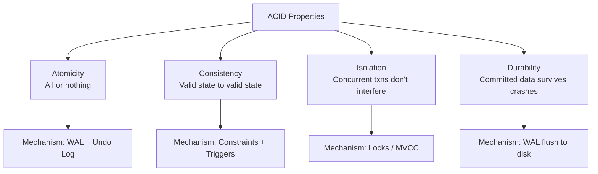

---

## Transaction States

A transaction moves through a well-defined state machine during its lifecycle.

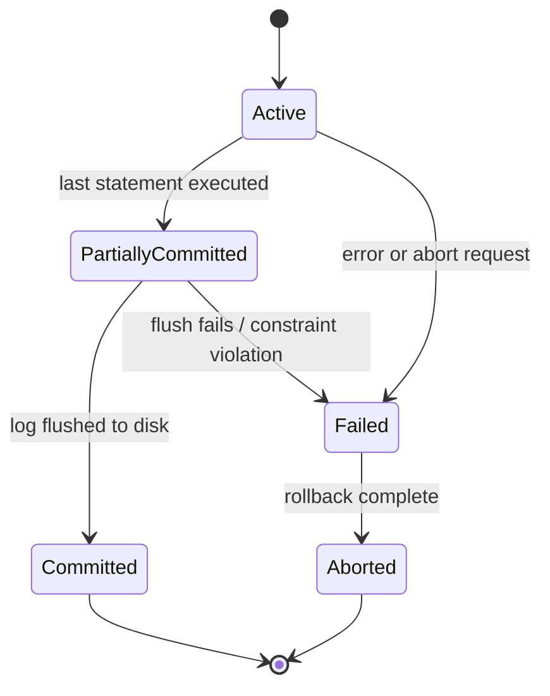

| State | Description |
|---|---|
| **Active** | Transaction is executing operations. |
| **Partially Committed** | The final operation has executed, but the commit record has not yet been flushed to stable storage. |
| **Committed** | The commit log record is on stable storage. Changes are now permanent. |
| **Failed** | An error occurred or the transaction was explicitly aborted. |
| **Aborted** | Rollback is complete. The database is restored to the state before the transaction began. |

After abort, the system can either **restart** the transaction (if the failure was transient) or **kill** it (if the failure is permanent, such as a constraint violation).

---

## Concurrency Anomalies

When transactions run concurrently without proper isolation, several anomalies can occur.

### Dirty Read

A transaction reads data written by another transaction that has **not yet committed**. If the writing transaction aborts, the reader has acted on data that never officially existed.

```
T1: UPDATE accounts SET balance = 0 WHERE id = 1;
T2: SELECT balance FROM accounts WHERE id = 1;  -- reads 0
T1: ROLLBACK;
-- T2 used a value that was never committed
```

### Non-Repeatable Read

A transaction reads the same row twice and gets **different values** because another transaction modified and committed the row between the two reads.

```
T1: SELECT balance FROM accounts WHERE id = 1;  -- reads 1000
T2: UPDATE accounts SET balance = 500 WHERE id = 1; COMMIT;
T1: SELECT balance FROM accounts WHERE id = 1;  -- reads 500
```

### Phantom Read

A transaction re-executes a range query and finds **new rows** that were inserted (and committed) by another transaction since the first execution.

```
T1: SELECT * FROM orders WHERE amount > 100;  -- returns 5 rows
T2: INSERT INTO orders (amount) VALUES (200); COMMIT;
T1: SELECT * FROM orders WHERE amount > 100;  -- returns 6 rows
```

### Lost Update

Two transactions read the same value, compute a new value based on it, and write back. The second write **overwrites** the first, losing T1's update.

```
T1: x = READ(A)       -- x = 100
T2: y = READ(A)       -- y = 100
T1: WRITE(A, x + 10)  -- A = 110
T2: WRITE(A, y + 20)  -- A = 120  (T1's update is lost)
```

### Write Skew

Two transactions each read an overlapping data set, make disjoint updates based on what they read, and both commit. The invariant that holds under serial execution is violated.

Classic example: a hospital requires at least one doctor on call. Two doctors each see there are two on call, each removes themselves. Now zero are on call.

```
T1: SELECT count(*) FROM on_call;  -- 2
T2: SELECT count(*) FROM on_call;  -- 2
T1: DELETE FROM on_call WHERE doctor = 'Alice'; COMMIT;
T2: DELETE FROM on_call WHERE doctor = 'Bob'; COMMIT;
-- Invariant violated: 0 doctors on call
```

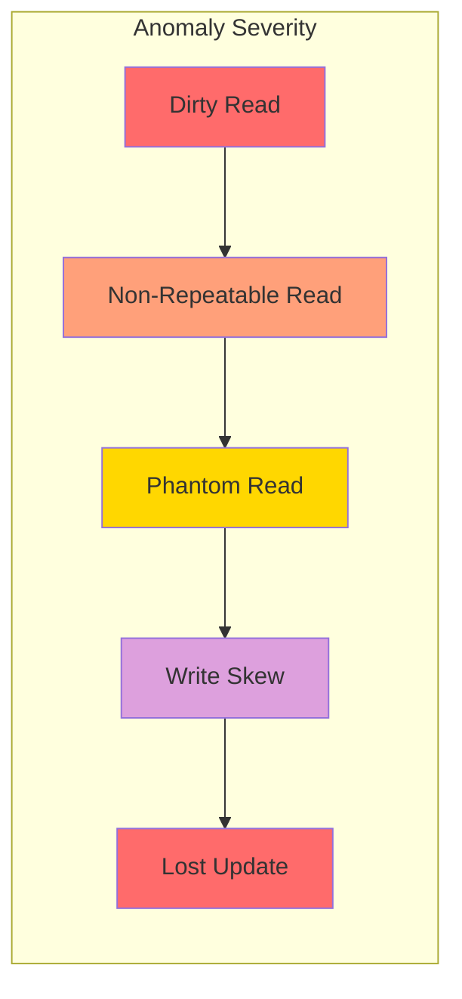

---

## Isolation Levels

The SQL standard defines four isolation levels. Each prevents a subset of anomalies, trading correctness for performance.

| Level | Dirty Read | Non-Repeatable Read | Phantom Read |
|---|---|---|---|
| **Read Uncommitted** | Possible | Possible | Possible |
| **Read Committed** | Prevented | Possible | Possible |
| **Repeatable Read** | Prevented | Prevented | Possible |
| **Serializable** | Prevented | Prevented | Prevented |

### Read Uncommitted

The weakest level. Transactions can see uncommitted changes from other transactions. Rarely used in practice; useful only for approximate aggregates where accuracy does not matter.

### Read Committed

The **default in PostgreSQL** and Oracle. Each statement within a transaction sees only data committed before that statement began. Different statements within the same transaction can see different committed snapshots.

### Repeatable Read

The transaction sees a **snapshot** taken at the start of the transaction. All reads within the transaction return the same data, regardless of concurrent commits. In PostgreSQL, this actually provides Snapshot Isolation. In MySQL/InnoDB, this is the default level and uses next-key locking.

### Serializable

The strongest level. The outcome is guaranteed to be equivalent to some serial ordering of the concurrent transactions. PostgreSQL implements this via Serializable Snapshot Isolation (SSI). MySQL/InnoDB uses strict two-phase locking with gap locks.

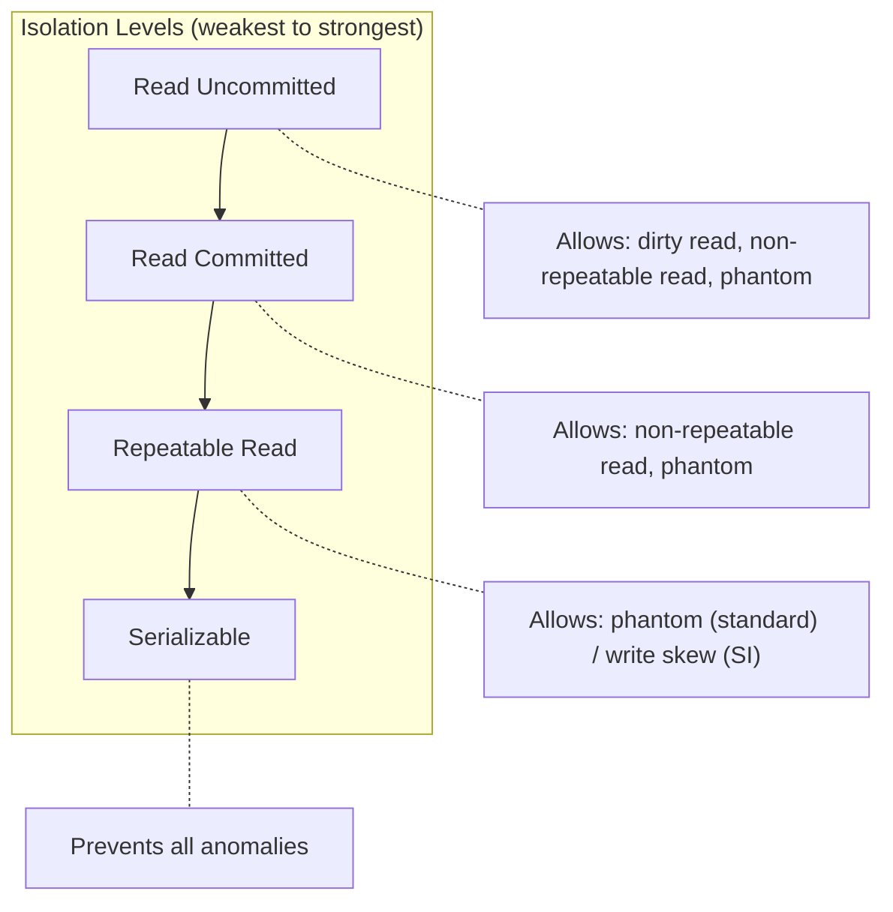

---

## Lock-Based Concurrency Control

Locks are the oldest and most intuitive concurrency control mechanism. A transaction must acquire a lock on a data item before accessing it.

### Lock Types

| Lock Type | Also Called | Purpose |
|---|---|---|
| **Shared (S)** | Read lock | Multiple transactions can hold S locks simultaneously on the same item. |
| **Exclusive (X)** | Write lock | Only one transaction can hold an X lock. No other lock (S or X) is compatible. |

### Lock Compatibility Matrix

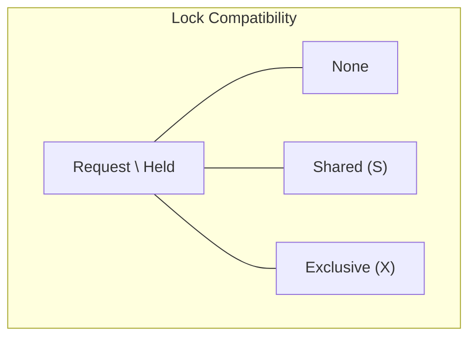

| | None | S Held | X Held |
|---|---|---|---|
| **Request S** | Grant | Grant | Wait |
| **Request X** | Grant | Wait | Wait |

When a lock request cannot be granted, the requesting transaction is placed in a **wait queue** for that data item.

### Lock Granularity

Locks can be acquired at different granularities:

- **Database-level:** Coarsest. Serializes all transactions. Used during schema migrations.
- **Table-level:** Locks the entire table. Simple but limits concurrency.
- **Page-level:** Locks a disk page (typically 8 KB). A middle ground.
- **Row-level:** Finest common granularity. Maximum concurrency. Used by PostgreSQL and InnoDB.
- **Predicate-level:** Locks a logical condition (e.g., "all rows where age > 30"). Prevents phantoms.

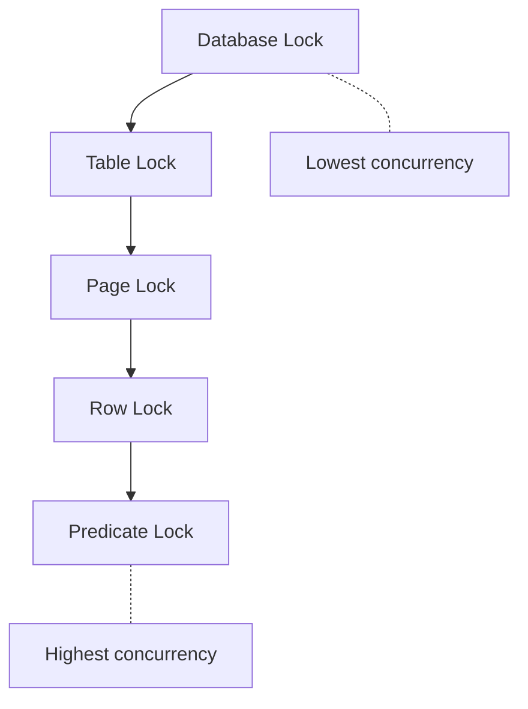

---

## Two-Phase Locking (2PL)

Two-Phase Locking is the classic protocol that guarantees **serializability**. It divides a transaction's execution into two phases:

1. **Growing Phase:** The transaction may acquire locks but must not release any.
2. **Shrinking Phase:** The transaction may release locks but must not acquire any.

The point where the transaction stops acquiring locks and begins releasing them is called the **lock point**.

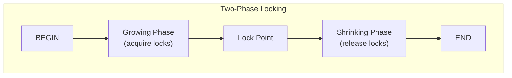

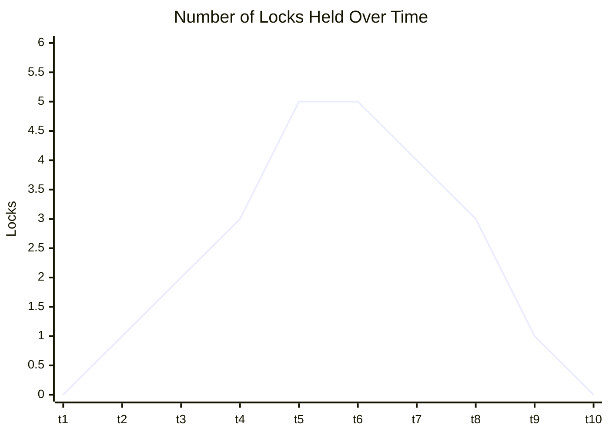

### Why 2PL Guarantees Serializability

If two transactions conflict, the one that reaches its lock point first is serialized before the other. The lock point establishes a total ordering among conflicting transactions that corresponds to a valid serial schedule.

### Strict 2PL

In Strict 2PL, a transaction holds **all exclusive (X) locks until it commits or aborts**. Shared locks may be released during the shrinking phase. This prevents **cascading aborts** -- if T1 aborts, no other transaction has read T1's uncommitted writes because the X lock was held.

### Rigorous 2PL

In Rigorous 2PL, a transaction holds **all locks (S and X) until it commits or aborts**. This is simpler to implement and is what most practical systems use. It guarantees that the serialization order matches the commit order.

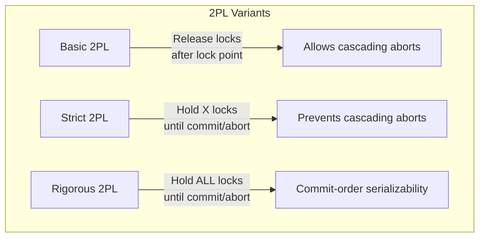

---

## Deadlock Detection and Prevention

### What Is a Deadlock?

A deadlock occurs when two or more transactions are each waiting for a lock held by another transaction in the cycle, so none can proceed.

```
T1 holds lock on A, wants lock on B
T2 holds lock on B, wants lock on A
```

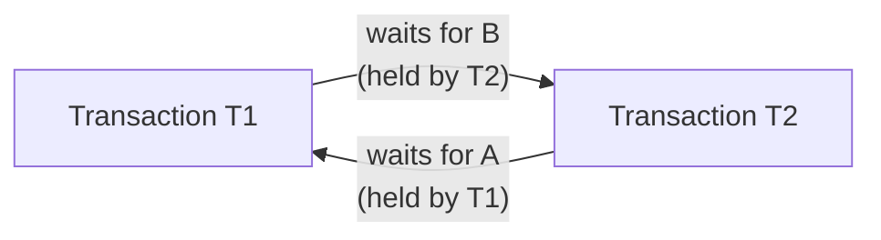

### Wait-For Graph

A wait-for graph has one node per transaction. A directed edge from Ti to Tj means Ti is waiting for a lock held by Tj. A **cycle** in the wait-for graph indicates a deadlock.

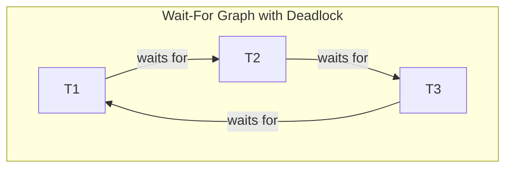

The deadlock detector periodically builds (or maintains incrementally) the wait-for graph and runs a cycle detection algorithm (DFS). When a cycle is found, the system selects a **victim** transaction to abort, breaking the cycle. Victim selection criteria include:

- Transaction age (younger transactions are cheaper to abort)
- Amount of work done
- Number of locks held
- Number of transactions that would cascade-abort

### Prevention: Wait-Die and Wound-Wait

These schemes use **transaction timestamps** (assigned at begin time) to decide what happens when a lock conflict occurs, preventing deadlocks from ever forming.

**Wait-Die (non-preemptive):**
- If Ti is **older** than Tj (Ti has smaller timestamp), Ti **waits**.
- If Ti is **younger** than Tj, Ti **dies** (aborts and restarts with same timestamp).
- Older transactions never abort for younger ones.

**Wound-Wait (preemptive):**
- If Ti is **older** than Tj, Ti **wounds** Tj (forces Tj to abort).
- If Ti is **younger** than Tj, Ti **waits**.
- Younger transactions never force older ones to abort.

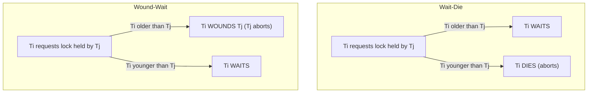

### Timeout-Based Detection

The simplest approach: if a transaction has waited longer than a threshold, assume it is deadlocked and abort it. Simple to implement but imprecise -- may abort transactions that are just waiting for a long operation, and may take too long to detect real deadlocks.

---

## Multi-Version Concurrency Control (MVCC) Overview

MVCC is the dominant concurrency control mechanism in modern databases (PostgreSQL, MySQL/InnoDB, Oracle, SQL Server's RCSI). Instead of blocking readers with locks, MVCC keeps **multiple versions** of each row. Readers see a consistent snapshot without blocking writers, and writers don't block readers.

### Core Idea

When a transaction modifies a row, the database does not overwrite the old version. Instead, it creates a **new version**. Each version is tagged with the transaction ID that created it. Readers use **visibility rules** to determine which version they should see, based on their snapshot.

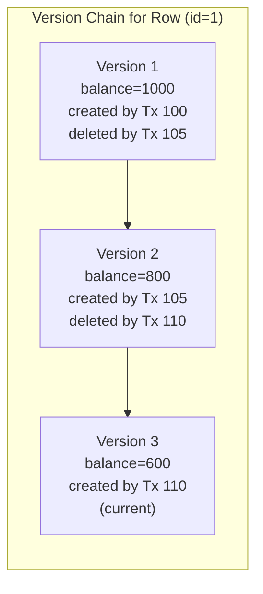

### Snapshot

A snapshot captures the state of the database at a point in time. It consists of:
- The **snapshot transaction ID** (or timestamp)
- The set of **in-progress transaction IDs** at the time the snapshot was taken

A version is visible to a snapshot if:
1. The creating transaction committed before the snapshot was taken.
2. The deleting transaction (if any) had not committed before the snapshot was taken.

### Benefits of MVCC

- **Readers never block writers.** A SELECT never waits for an UPDATE.
- **Writers never block readers.** An UPDATE never waits for a SELECT.
- Writers still block other writers on the same row (first-updater-wins or conflict detection).

### Drawbacks of MVCC

- Old versions accumulate and must be garbage collected (PostgreSQL's VACUUM, InnoDB's purge thread).
- Storage overhead from multiple versions.
- More complex visibility logic compared to simple locking.

---

## Optimistic vs Pessimistic Concurrency Control

### Pessimistic Concurrency Control

Assumes conflicts are **likely**. Acquires locks before accessing data. If a conflict is detected, the transaction waits (or aborts). Lock-based protocols (2PL) are pessimistic.

**Best for:** High-contention workloads where conflicts are frequent.

### Optimistic Concurrency Control (OCC)

Assumes conflicts are **rare**. Transactions execute without acquiring locks, keeping track of their read and write sets. At commit time, the system **validates** that no conflicts occurred. If validation fails, the transaction aborts and retries.

Three phases of OCC:
1. **Read phase:** Execute the transaction, recording reads and writes in a private workspace.
2. **Validation phase:** Check whether any concurrent transaction wrote to data this transaction read.
3. **Write phase:** If validation succeeds, apply the writes to the database.

**Best for:** Low-contention workloads, especially read-heavy.

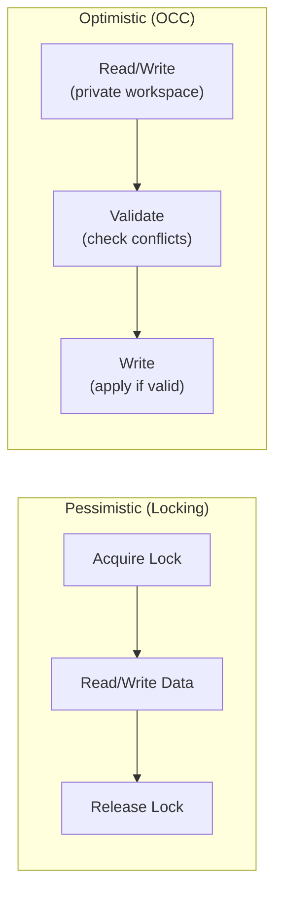

---

## Timestamp Ordering Protocol

Each transaction is assigned a unique timestamp when it begins. The protocol ensures that conflicting operations are executed in timestamp order.

**Rules:**
- **Read rule:** Transaction Ti wants to read item X. If the write timestamp of X (WTS(X)) > TS(Ti), then Ti is trying to read a value written by a future transaction. Ti must abort and restart.
- **Write rule:** Transaction Ti wants to write item X. If the read timestamp of X (RTS(X)) > TS(Ti), then a future transaction has already read the old value. Ti must abort. If WTS(X) > TS(Ti), Ti's write is obsolete -- it can be skipped (**Thomas Write Rule**).

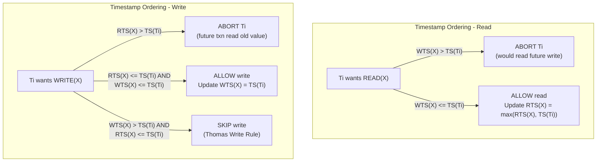

---

## Summary

| Mechanism | Serializability | Readers Block Writers | Writers Block Readers | Deadlock Possible |
|---|---|---|---|---|
| **Basic 2PL** | Yes | Yes | Yes | Yes |
| **Strict 2PL** | Yes | Yes | Yes | Yes |
| **MVCC (SI)** | No (allows write skew) | No | No | No (but write-write conflicts) |
| **MVCC (SSI)** | Yes | No | No | No |
| **OCC** | Yes | No | No | No |
| **Timestamp Ordering** | Yes | No | No | No (but high abort rate) |

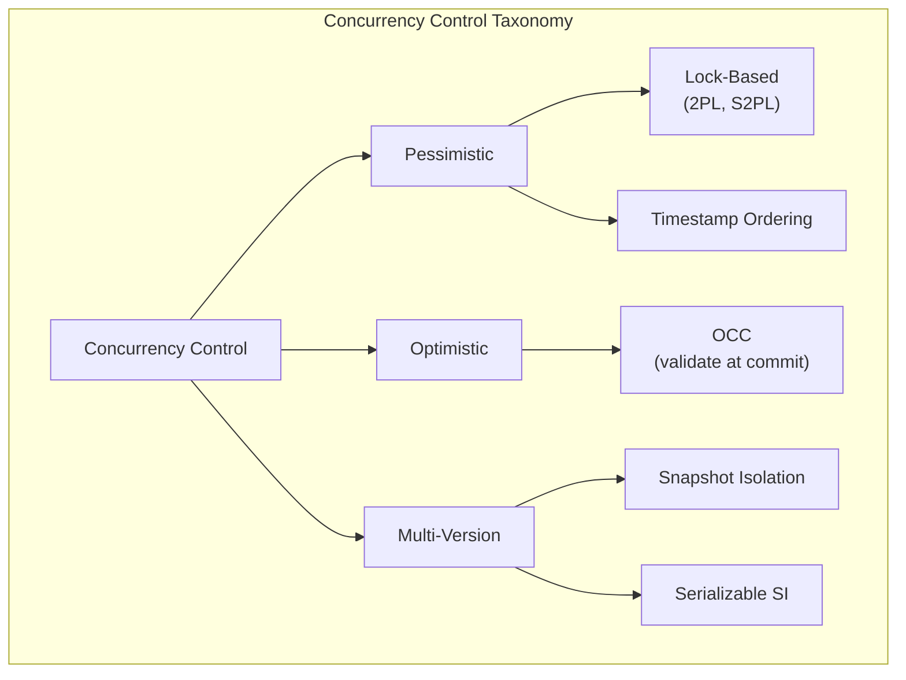
