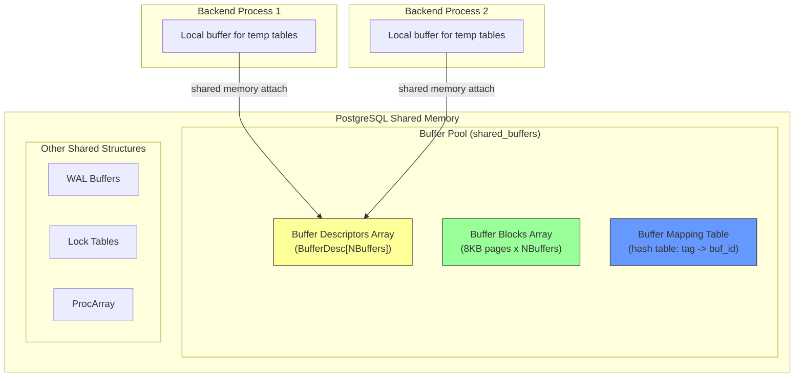
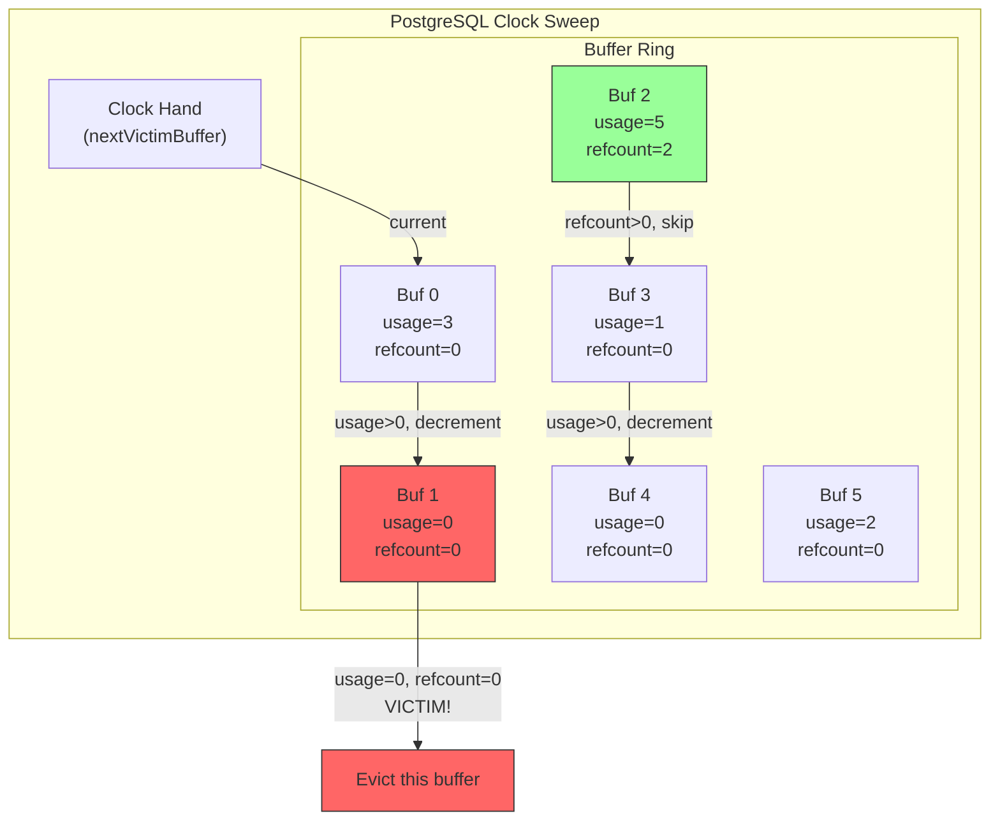
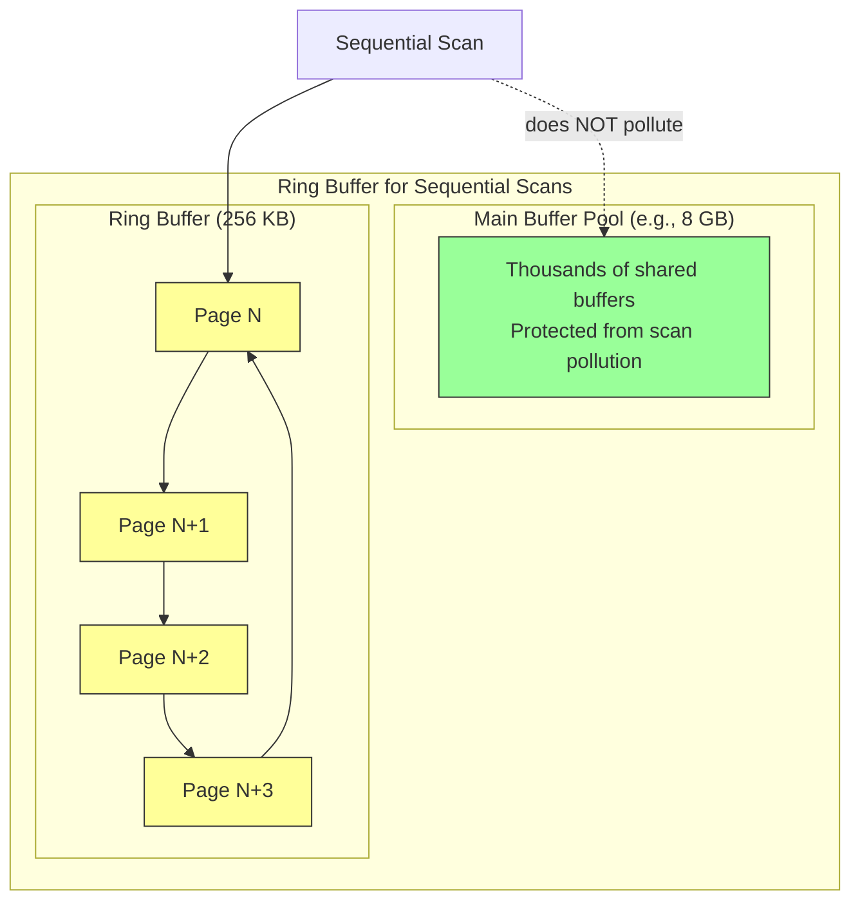
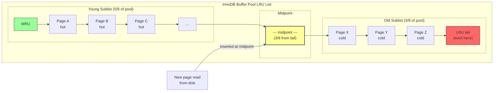
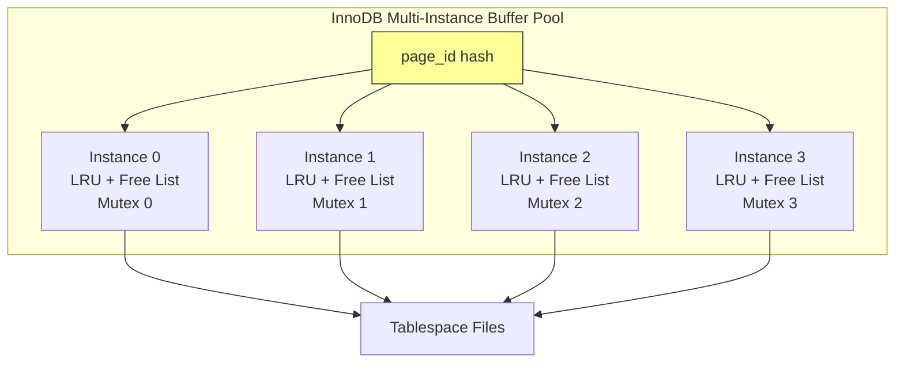
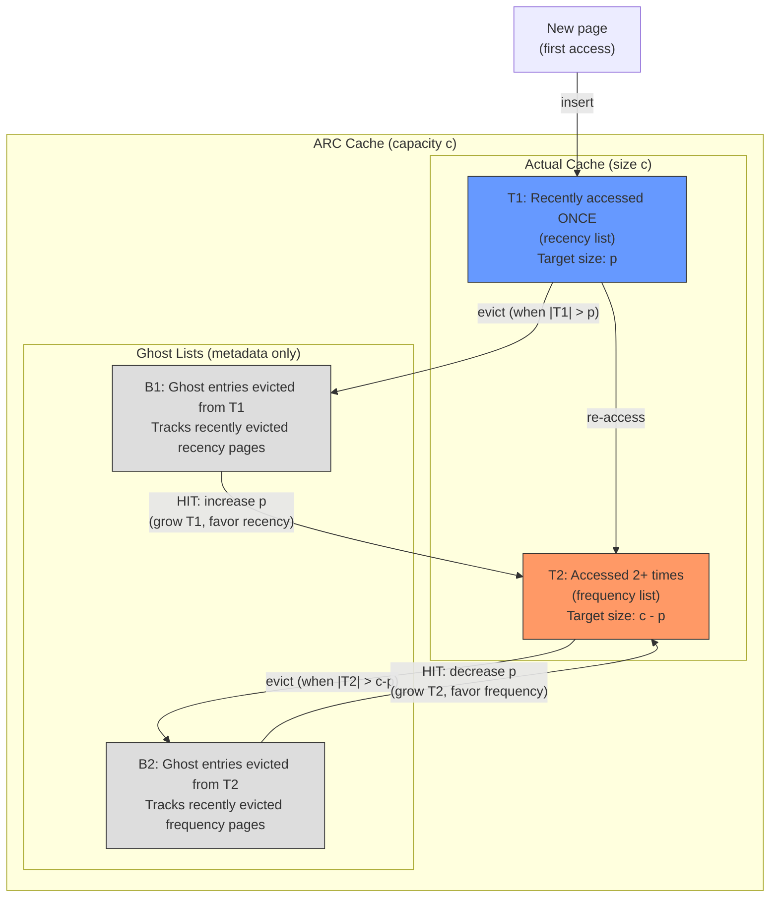
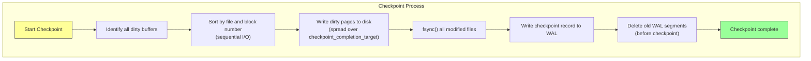
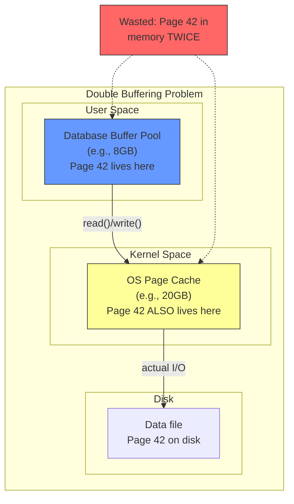
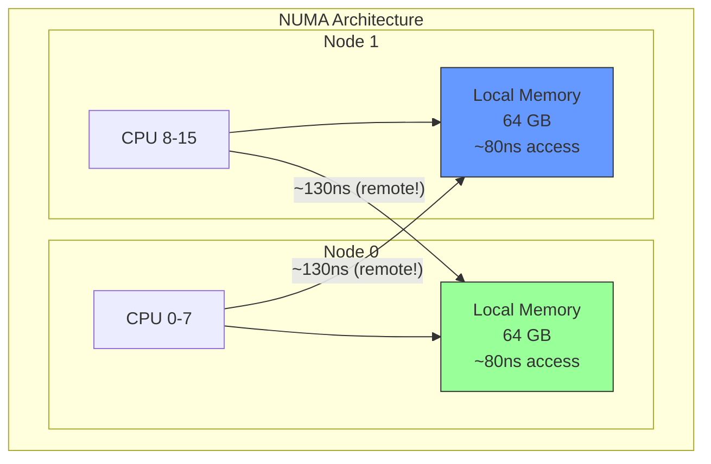

# Module 6: Deep Dive - Buffer Pool Internals in Real Systems

## PostgreSQL shared_buffers: How It Works Internally

PostgreSQL's buffer pool is called **shared_buffers** and lives in System V shared memory (or POSIX shared memory on modern systems). It is shared across all backend processes.

### Architecture



### Buffer Descriptor (BufferDesc)

Each buffer in the pool has a descriptor containing:

```c
typedef struct BufferDesc {
    BufferTag   tag;            // (tablespace, database, relation, forknum, blocknum)
    int         buf_id;         // Index in the buffer array

    /* State bits packed into a single atomic uint32 */
    pg_atomic_uint32 state;     // Contains:
                                //   - reference count (18 bits)
                                //   - usage_count (4 bits, 0-5 for clock sweep)
                                //   - BM_LOCKED
                                //   - BM_DIRTY
                                //   - BM_VALID
                                //   - BM_TAG_VALID
                                //   - BM_IO_IN_PROGRESS
                                //   - BM_IO_ERROR

    int         wait_backend_pgprocno;  // Backend waiting for I/O
    int         freeNext;               // Link in freelist chain
    LWLock      content_lock;           // Lock for reading/writing page contents
} BufferDesc;
```

### The Buffer Mapping Table

PostgreSQL uses a **partitioned hash table** for the page table to reduce lock contention. The hash table is split into 128 partitions (NUM_BUFFER_PARTITIONS), each with its own lightweight lock.

```
Lookup path:

1. Compute BufferTag from (tablespace_oid, db_oid, rel_oid, fork, blocknum)
2. Hash the tag to find the partition: partition = hash(tag) % 128
3. Acquire LWLock on that partition (shared lock for reads)
4. Look up the tag in the hash table
5. Get the buf_id
6. Release the partition lock
7. Pin the buffer (atomically increment refcount)
```

---

## PostgreSQL's Clock Sweep Algorithm

PostgreSQL does NOT use classic LRU. Instead, it uses a **clock sweep** algorithm with a **usage count** (0 to 5). This is a generalization of the basic clock algorithm.

### How It Works



**Algorithm (from freelist.c)**:

```
StrategyGetBuffer():
    loop forever:
        buf = BufferDescriptors[nextVictimBuffer]
        nextVictimBuffer = (nextVictimBuffer + 1) % NBuffers

        // Skip pinned buffers
        if buf.refcount > 0:
            continue

        // Check usage count
        if buf.usage_count > 0:
            buf.usage_count--    // Give it a "second chance"
            continue

        // Found victim: usage_count == 0 and refcount == 0
        return buf
```

**Usage count behavior**:
- When a page is accessed: `usage_count = min(usage_count + 1, 5)`
- Maximum usage count is **BM_MAX_USAGE_COUNT = 5**
- A page with usage_count=5 gets 5 "second chances" before eviction
- This makes frequently accessed pages very sticky

### Ring Buffer Optimization

For large sequential scans, PostgreSQL uses a **ring buffer** -- a small, fixed-size subset of the buffer pool (typically 256 KB = 32 pages). The scan only uses pages within this ring, preventing buffer pool pollution.



Ring buffers are used for:
- Sequential scans (256 KB)
- VACUUM (256 KB)
- Bulk writes / COPY (16 MB)

---

## InnoDB Buffer Pool: LRU with Young/Old Sublists

MySQL's InnoDB uses a modified LRU list split into two sublists: **young** (hot) and **old** (cold).

### Architecture



### How It Works

1. **New pages** are inserted at the **midpoint** (head of old sublist), NOT at the MRU end
2. Pages in the old sublist are only promoted to the young sublist if they are accessed again **after a configurable delay** (`innodb_old_blocks_time`, default 1000ms)
3. This prevents a full table scan from flushing the entire buffer pool
4. Pages in the young sublist are moved to the head only if they are in the bottom 3/4 of the young sublist (to reduce list manipulation overhead)

```
InnoDB LRU Parameters:

innodb_buffer_pool_size     = Total buffer pool size (e.g., 8GB)
innodb_old_blocks_pct       = Percentage for old sublist (default 37, i.e., 3/8)
innodb_old_blocks_time      = Delay in ms before promoting to young (default 1000)
innodb_buffer_pool_instances = Number of buffer pool instances (partitioning)
```

### InnoDB Buffer Pool Instances

InnoDB supports **multiple buffer pool instances** to reduce mutex contention:



Recommended: Set `innodb_buffer_pool_instances` to the number of CPU cores (up to 64) when `innodb_buffer_pool_size` >= 1 GB.

---

## Adaptive Replacement Cache (ARC) - Used in ZFS

ARC, developed at IBM, adaptively tunes itself to favor recency or frequency based on workload patterns. It is used in ZFS (the file system) but not in most databases due to patent restrictions (the patent expired in 2024).

### ARC Data Structures



### The Adaptive Parameter p

The genius of ARC is the parameter `p` that dynamically adjusts:

```
When there's a hit in B1 (a recently evicted recency page is requested again):
  -> We should have kept it! Increase p to make T1 bigger.
  -> p = min(p + max(1, |B2|/|B1|), c)

When there's a hit in B2 (a recently evicted frequency page is requested again):
  -> We should have kept it! Decrease p to make T2 bigger.
  -> p = max(p - max(1, |B1|/|B2|), 0)
```

This makes ARC self-tuning. It automatically adapts to workloads that are recency-heavy (like temporal data) or frequency-heavy (like hot records).

---

## Buffer Pool Sizing: Too Small vs Too Large

### Too Small

```
Symptoms of an undersized buffer pool:
- High buffer cache miss rate
- Excessive disk I/O (high iowait)
- Frequent evictions of hot pages
- In PostgreSQL: low pg_stat_bgwriter.buffers_alloc vs buffers_backend
- In InnoDB: Innodb_buffer_pool_reads >> Innodb_buffer_pool_read_requests
```

### Too Large

```
Symptoms of an oversized buffer pool:
- Wasted memory that could be used by the OS or other processes
- Longer checkpoint times (more dirty pages to write)
- Longer crash recovery (more dirty pages to replay)
- On NUMA systems: cross-node memory access latency
- Reduced OS page cache for WAL files and other I/O
```

### Sizing Guidelines

```
PostgreSQL:
  shared_buffers = 25% of total RAM (starting point)
  Rarely benefits from > 40% of RAM
  Rest goes to OS page cache (which helps with WAL, temp files)

MySQL/InnoDB:
  innodb_buffer_pool_size = 70-80% of total RAM (dedicated server)
  InnoDB relies less on OS page cache than PostgreSQL

General Rule:
  Monitor hit ratio. Target > 99% for OLTP workloads.
  Hit ratio = 1 - (physical_reads / logical_reads)
```

---

## Background Writer and Checkpoint Processes

Dirty pages must eventually be written to disk. Two background processes handle this.

### Background Writer (bgwriter)

Continuously scans the buffer pool and writes dirty pages to disk **before** they are needed for eviction. This ensures that when a backend needs to evict a page, it can find a clean page quickly.

### Checkpointer

Periodically writes ALL dirty pages to disk and records a checkpoint in the WAL. After a checkpoint, the database can recover by replaying WAL from the checkpoint position.

```mermaid
sequenceDiagram
    participant BE as Backend
    participant BP as Buffer Pool
    participant BG as Background Writer
    participant CP as Checkpointer
    participant D as Disk

    Note over BG: Runs continuously

    loop Every bgwriter_delay (200ms default)
        BG->>BP: Scan for dirty, unpinned pages<br/>with low usage_count
        BG->>D: Write selected dirty pages
        BG->>BP: Clear dirty flag
    end

    Note over CP: Runs periodically (checkpoint_timeout)
    CP->>BP: Identify ALL dirty pages
    CP->>D: Write ALL dirty pages (spread over time)
    CP->>D: fsync() all files
    CP->>D: Write checkpoint record to WAL
    Note over CP: Recovery can start from here

    BE->>BP: FetchPage - need to evict
    alt Clean page available
        BE->>BP: Evict clean page (instant)
    else Only dirty pages
        BE->>D: Write dirty page (backend does I/O!)
        Note over BE: This is SLOW - bgwriter should prevent this
    end

    style BG fill:#9f9,stroke:#333
    style CP fill:#69f,stroke:#333
```

### Checkpoint Flow



PostgreSQL configuration:
```
checkpoint_timeout = 5min          # Maximum time between checkpoints
checkpoint_completion_target = 0.9  # Spread writes over 90% of interval
max_wal_size = 1GB                 # Trigger checkpoint when WAL reaches this
```

---

## The Double Buffering Problem

When a database manages its own buffer pool AND the OS maintains a page cache, the same data can exist in memory twice.



### Solutions

**1. O_DIRECT**: Bypass the OS page cache entirely.
```c
fd = open("datafile", O_RDWR | O_DIRECT);
// Reads/writes go directly between user buffer and disk
// No OS page cache involvement
```

Used by: InnoDB (by default), Oracle, and others.

**2. Accept the double buffering**: PostgreSQL takes this approach.
- PostgreSQL does NOT use O_DIRECT by default
- It relies on the OS page cache as a "second level" cache
- The OS cache helps with:
  - WAL file reads during recovery
  - Temp file I/O
  - Providing a safety net for data not in shared_buffers
- Downside: some memory is wasted on duplicate copies

**3. Use mmap**: Some systems (LMDB, early MongoDB) use mmap to avoid double buffering. But this has its own problems (see teach.md).

### Why Some Databases Use O_DIRECT

```
Benefits of O_DIRECT:
+ Eliminates double buffering (saves RAM)
+ Database has full control over write ordering (critical for WAL)
+ Avoids OS readahead that might conflict with DB prefetching
+ More predictable I/O latency

Drawbacks of O_DIRECT:
- Requires aligned buffers (typically 512-byte or 4KB alignment)
- Cannot benefit from OS page cache for the data file
- More complex code
- Some filesystems have bugs with O_DIRECT
```

---

## Huge Pages and TLB Misses

### The TLB Problem

The Translation Lookaside Buffer (TLB) caches virtual-to-physical address mappings. With the default 4 KB page size, a 128 GB buffer pool requires 33 million page table entries. The TLB can only cache a few thousand entries, leading to frequent TLB misses.

```
TLB miss cost: ~10-100 nanoseconds per miss
With 4KB pages and 128GB buffer pool:
  33,554,432 page table entries
  TLB typically holds 1,024-4,096 entries
  TLB miss rate can be very high for random access patterns

With 2MB huge pages:
  65,536 page table entries (512x fewer!)
  TLB can cover much more of the buffer pool
  Significant reduction in TLB misses
```

### Configuring Huge Pages

```
Linux:
  # Reserve huge pages
  echo 4096 > /proc/sys/vm/nr_hugepages  # 4096 x 2MB = 8GB

  # PostgreSQL
  huge_pages = try  # or 'on' to require them

MySQL/InnoDB:
  large-pages = ON  # in my.cnf

  # Grant privileges
  echo "vm.nr_hugepages=4096" >> /etc/sysctl.conf
```

### Transparent Huge Pages (THP) Warning

```
WARNING: Most databases recommend DISABLING Transparent Huge Pages (THP)

Why THP is problematic for databases:
- THP causes allocation stalls when the kernel tries to defragment memory
- Latency spikes of 10-100ms are common
- khugepaged background thread competes for CPU
- Memory bloat: a single byte allocation can consume 2MB

Disable THP:
  echo never > /sys/kernel/mm/transparent_hugepage/enabled
  echo never > /sys/kernel/mm/transparent_hugepage/defrag
```

---

## NUMA-Aware Buffer Management

On multi-socket servers, memory access times are non-uniform. Accessing memory on the local NUMA node is faster than accessing remote memory.



### NUMA Strategies for Databases

```
1. Interleave memory allocation (most common)
   numactl --interleave=all postgres
   - Spreads buffer pool evenly across NUMA nodes
   - Prevents one node from being a bottleneck
   - Average access time is predictable

2. NUMA-aware buffer pool partitioning
   - Assign buffer pool partitions to NUMA nodes
   - Route queries to the node holding their data
   - More complex but better locality

3. Memory binding
   numactl --membind=0 postgres
   - Force all allocation to one node
   - Only useful for small buffer pools on one node
```

### Monitoring NUMA Effects

```bash
# Check NUMA topology
numactl --hardware

# Monitor NUMA statistics
numastat -p $(pidof postgres)

# Watch for remote memory accesses
perf stat -e node-loads,node-load-misses -p $(pidof postgres)
```

---

## Putting It All Together: A Production Buffer Pool Configuration

### PostgreSQL Example (128 GB RAM Server)

```
# Buffer pool
shared_buffers = 32GB              # 25% of RAM
huge_pages = try                   # Use huge pages if available

# Background writer
bgwriter_delay = 200ms             # Wake up every 200ms
bgwriter_lru_maxpages = 100        # Write up to 100 pages per round
bgwriter_lru_multiplier = 2.0      # Write 2x the recent rate

# Checkpoints
checkpoint_timeout = 15min         # Checkpoint every 15 minutes
checkpoint_completion_target = 0.9  # Spread writes over 90% of interval
max_wal_size = 4GB                 # Allow 4GB of WAL before forced checkpoint

# Per-query memory
work_mem = 256MB                   # Per-sort/hash operation
maintenance_work_mem = 2GB         # VACUUM, CREATE INDEX
temp_buffers = 256MB               # Per-session temp table buffer

# OS settings
effective_cache_size = 96GB        # Tell planner about OS cache
```

### MySQL/InnoDB Example (128 GB RAM Server)

```
# Buffer pool
innodb_buffer_pool_size = 96G      # 75% of RAM
innodb_buffer_pool_instances = 16  # Reduce mutex contention
innodb_old_blocks_pct = 37         # Old sublist = 37% of pool
innodb_old_blocks_time = 1000      # 1 second before promoting to young

# Flushing
innodb_flush_method = O_DIRECT     # Bypass OS page cache
innodb_flush_neighbors = 0         # Disable for SSD (useful for HDD)

# Page cleaner
innodb_page_cleaners = 8           # Background page cleaner threads
innodb_lru_scan_depth = 1024       # Pages to scan per cleaner per round

# Huge pages
large-pages = ON
```

---

## Summary Table

| System | Replacement Policy | Key Feature | Double Buffer Strategy |
|--------|-------------------|-------------|----------------------|
| PostgreSQL | Clock sweep (usage_count 0-5) | Ring buffers for scans | Accept it (no O_DIRECT) |
| InnoDB | Modified LRU (young/old) | Midpoint insertion, time delay | O_DIRECT by default |
| Oracle | Touch count LRU | Multiple buffer pools by block size | O_DIRECT (async I/O) |
| SQL Server | Clock with LRU-K(2) | NUMA-aware, lazy writer | No O_DIRECT (uses OS cache strategically) |
| ZFS/ARC | Adaptive (recency+frequency) | Ghost lists, self-tuning p | N/A (filesystem, not DB) |
