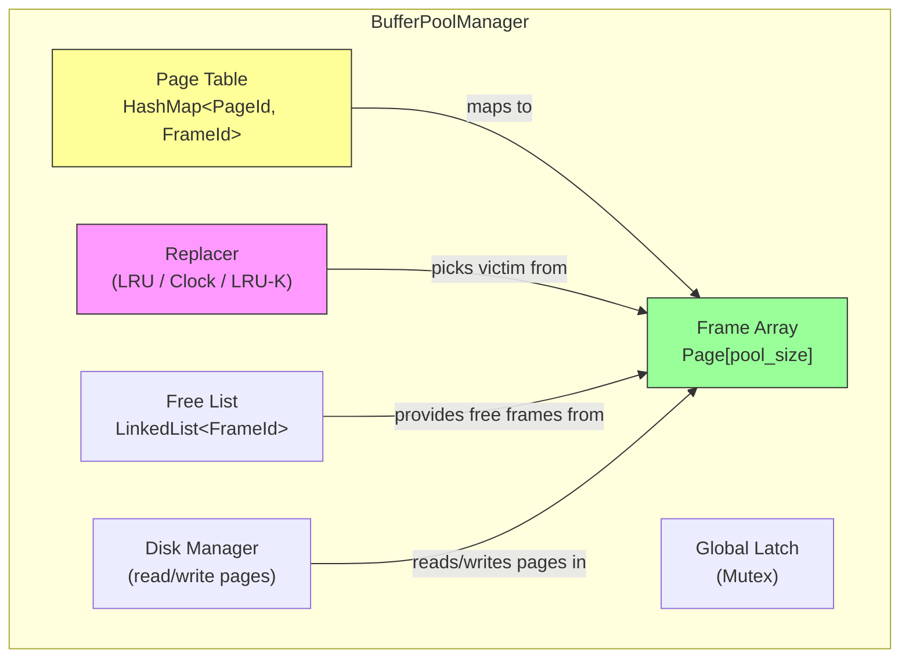
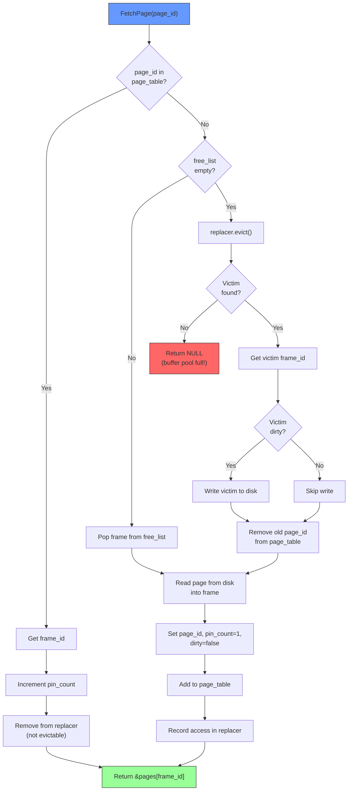
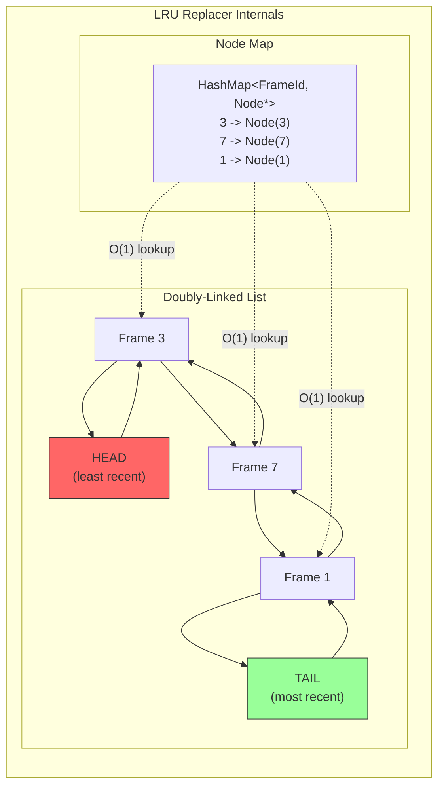
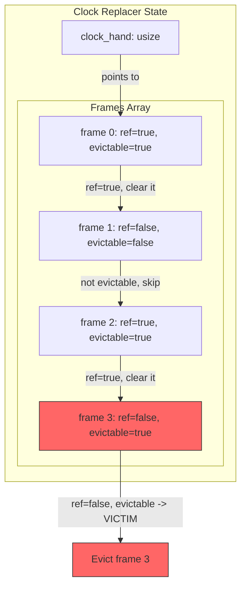
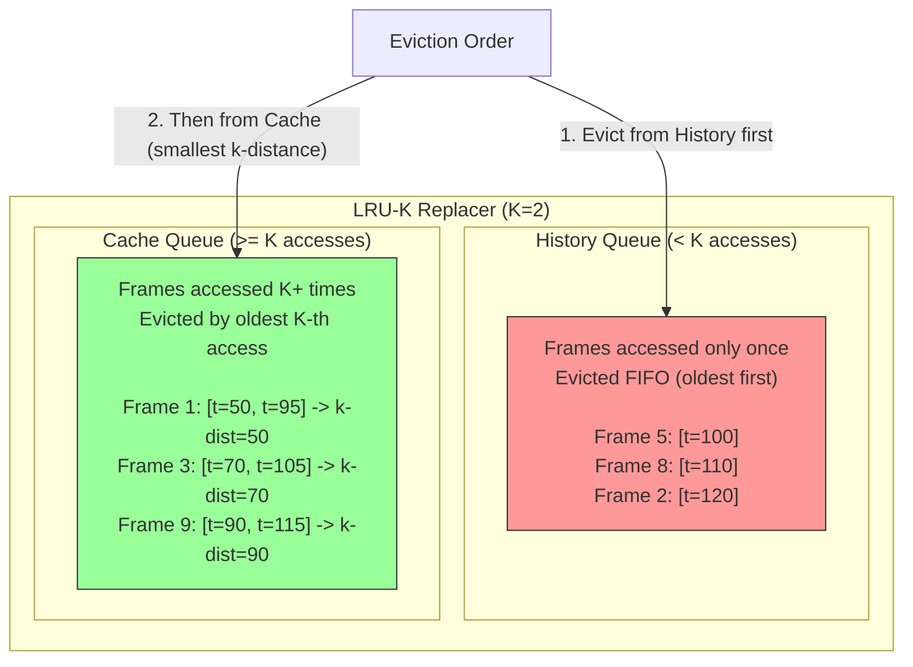
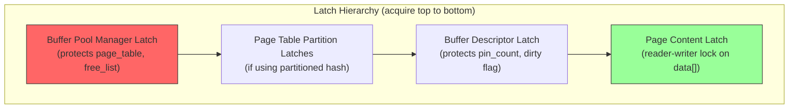
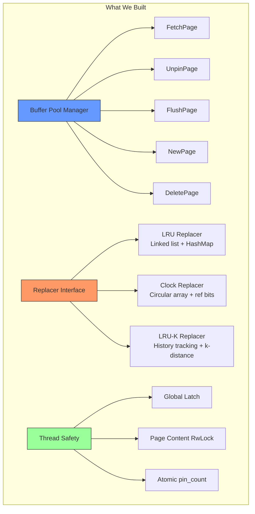

# Module 6: Implementation - Building a Buffer Pool Manager

## Overview

This module walks through the implementation of a complete buffer pool manager from scratch. We implement the core manager, three replacement policies (LRU, Clock, LRU-K), and thread-safe access. Code examples are in C and Rust.

---

## Buffer Pool Manager: Core Data Structures



### Core Structs in C

```c
#include <stdint.h>
#include <stdbool.h>
#include <pthread.h>
#include <string.h>
#include <stdlib.h>

#define PAGE_SIZE 4096
#define INVALID_PAGE_ID -1

typedef int32_t page_id_t;
typedef int32_t frame_id_t;

/* A single page in memory */
typedef struct {
    char data[PAGE_SIZE];
    page_id_t page_id;
    int pin_count;
    bool is_dirty;
    pthread_rwlock_t rwlatch;  /* Reader-writer lock on page contents */
} Page;

/* The buffer pool manager */
typedef struct {
    size_t pool_size;           /* Number of frames */
    Page *pages;                /* Frame array (pool_size pages) */

    /* Page table: page_id -> frame_id */
    /* Using a simple hash map (production code would use a concurrent map) */
    HashMap *page_table;

    /* Free list of available frame IDs */
    LinkedList *free_list;

    /* Replacer (polymorphic - could be LRU, Clock, or LRU-K) */
    Replacer *replacer;

    /* Disk manager for actual I/O */
    DiskManager *disk_manager;

    /* Global latch protecting the buffer pool metadata */
    pthread_mutex_t latch;
} BufferPoolManager;
```

### Core Structs in Rust

```rust
use std::collections::HashMap;
use std::sync::{Arc, Mutex, RwLock};

const PAGE_SIZE: usize = 4096;

type PageId = u32;
type FrameId = u32;

#[derive(Clone)]
struct Page {
    data: [u8; PAGE_SIZE],
    page_id: Option<PageId>,
    pin_count: u32,
    is_dirty: bool,
}

struct BufferPoolManager {
    pool_size: usize,
    pages: Vec<RwLock<Page>>,
    page_table: HashMap<PageId, FrameId>,
    free_list: Vec<FrameId>,
    replacer: Box<dyn Replacer>,
    disk_manager: DiskManager,
}

trait Replacer: Send + Sync {
    /// Record that a frame was accessed.
    fn record_access(&mut self, frame_id: FrameId);
    /// Mark a frame as evictable (unpinned).
    fn set_evictable(&mut self, frame_id: FrameId, evictable: bool);
    /// Choose a victim frame to evict. Returns None if no victim available.
    fn evict(&mut self) -> Option<FrameId>;
    /// Remove a frame from the replacer entirely.
    fn remove(&mut self, frame_id: FrameId);
    /// Number of evictable frames.
    fn size(&self) -> usize;
}
```

---

## Implementing the Core Operations

### FetchPage

The most important operation. Returns a pointer to the requested page, loading it from disk if necessary.



```c
Page* buffer_pool_fetch_page(BufferPoolManager *bpm, page_id_t page_id) {
    pthread_mutex_lock(&bpm->latch);

    /* 1. Check if page is already in buffer pool */
    frame_id_t frame_id;
    if (hashmap_get(bpm->page_table, page_id, &frame_id)) {
        Page *page = &bpm->pages[frame_id];
        page->pin_count++;
        replacer_set_evictable(bpm->replacer, frame_id, false);
        replacer_record_access(bpm->replacer, frame_id);
        pthread_mutex_unlock(&bpm->latch);
        return page;
    }

    /* 2. Page not in buffer pool. Find a frame. */
    if (!find_free_frame(bpm, &frame_id)) {
        pthread_mutex_unlock(&bpm->latch);
        return NULL;  /* No frames available */
    }

    /* 3. Read page from disk into the frame */
    Page *page = &bpm->pages[frame_id];
    disk_manager_read_page(bpm->disk_manager, page_id, page->data);

    /* 4. Update metadata */
    page->page_id = page_id;
    page->pin_count = 1;
    page->is_dirty = false;

    /* 5. Update page table */
    hashmap_put(bpm->page_table, page_id, frame_id);

    /* 6. Update replacer */
    replacer_record_access(bpm->replacer, frame_id);
    replacer_set_evictable(bpm->replacer, frame_id, false);

    pthread_mutex_unlock(&bpm->latch);
    return page;
}

/* Helper: find a free frame (from free list or by eviction) */
static bool find_free_frame(BufferPoolManager *bpm, frame_id_t *frame_id) {
    /* Try the free list first */
    if (linked_list_pop(bpm->free_list, frame_id)) {
        return true;
    }

    /* Free list empty, must evict */
    if (!replacer_evict(bpm->replacer, frame_id)) {
        return false;  /* All frames are pinned */
    }

    /* Write back dirty victim */
    Page *victim = &bpm->pages[*frame_id];
    if (victim->is_dirty) {
        disk_manager_write_page(bpm->disk_manager, victim->page_id, victim->data);
    }

    /* Remove old mapping */
    hashmap_remove(bpm->page_table, victim->page_id);
    replacer_remove(bpm->replacer, *frame_id);

    /* Reset the page */
    victim->page_id = INVALID_PAGE_ID;
    victim->is_dirty = false;
    victim->pin_count = 0;
    memset(victim->data, 0, PAGE_SIZE);

    return true;
}
```

### UnpinPage

```c
bool buffer_pool_unpin_page(BufferPoolManager *bpm, page_id_t page_id, bool is_dirty) {
    pthread_mutex_lock(&bpm->latch);

    frame_id_t frame_id;
    if (!hashmap_get(bpm->page_table, page_id, &frame_id)) {
        pthread_mutex_unlock(&bpm->latch);
        return false;  /* Page not in buffer pool */
    }

    Page *page = &bpm->pages[frame_id];

    if (page->pin_count <= 0) {
        pthread_mutex_unlock(&bpm->latch);
        return false;  /* Already unpinned */
    }

    page->pin_count--;

    /* Set dirty flag (never clear it - once dirty, stays dirty until flushed) */
    if (is_dirty) {
        page->is_dirty = true;
    }

    /* If pin_count drops to 0, page becomes evictable */
    if (page->pin_count == 0) {
        replacer_set_evictable(bpm->replacer, frame_id, true);
    }

    pthread_mutex_unlock(&bpm->latch);
    return true;
}
```

### FlushPage

Force a page to be written to disk (used during checkpoints).

```c
bool buffer_pool_flush_page(BufferPoolManager *bpm, page_id_t page_id) {
    pthread_mutex_lock(&bpm->latch);

    frame_id_t frame_id;
    if (!hashmap_get(bpm->page_table, page_id, &frame_id)) {
        pthread_mutex_unlock(&bpm->latch);
        return false;
    }

    Page *page = &bpm->pages[frame_id];
    disk_manager_write_page(bpm->disk_manager, page->page_id, page->data);
    page->is_dirty = false;

    pthread_mutex_unlock(&bpm->latch);
    return true;
}

/* Flush ALL pages (used during shutdown/checkpoint) */
void buffer_pool_flush_all_pages(BufferPoolManager *bpm) {
    pthread_mutex_lock(&bpm->latch);

    for (size_t i = 0; i < bpm->pool_size; i++) {
        Page *page = &bpm->pages[i];
        if (page->page_id != INVALID_PAGE_ID && page->is_dirty) {
            disk_manager_write_page(bpm->disk_manager, page->page_id, page->data);
            page->is_dirty = false;
        }
    }

    pthread_mutex_unlock(&bpm->latch);
}
```

### NewPage

Allocate a new page on disk and bring it into the buffer pool.

```c
Page* buffer_pool_new_page(BufferPoolManager *bpm, page_id_t *page_id) {
    pthread_mutex_lock(&bpm->latch);

    frame_id_t frame_id;
    if (!find_free_frame(bpm, &frame_id)) {
        pthread_mutex_unlock(&bpm->latch);
        *page_id = INVALID_PAGE_ID;
        return NULL;
    }

    /* Allocate a new page_id from the disk manager */
    *page_id = disk_manager_allocate_page(bpm->disk_manager);

    Page *page = &bpm->pages[frame_id];
    page->page_id = *page_id;
    page->pin_count = 1;
    page->is_dirty = true;  /* New pages are dirty (need to be written) */
    memset(page->data, 0, PAGE_SIZE);

    hashmap_put(bpm->page_table, *page_id, frame_id);
    replacer_record_access(bpm->replacer, frame_id);
    replacer_set_evictable(bpm->replacer, frame_id, false);

    pthread_mutex_unlock(&bpm->latch);
    return page;
}
```

### DeletePage

Remove a page from the buffer pool and deallocate it.

```c
bool buffer_pool_delete_page(BufferPoolManager *bpm, page_id_t page_id) {
    pthread_mutex_lock(&bpm->latch);

    frame_id_t frame_id;
    if (!hashmap_get(bpm->page_table, page_id, &frame_id)) {
        /* Page not in buffer pool - just deallocate on disk */
        disk_manager_deallocate_page(bpm->disk_manager, page_id);
        pthread_mutex_unlock(&bpm->latch);
        return true;
    }

    Page *page = &bpm->pages[frame_id];

    if (page->pin_count > 0) {
        pthread_mutex_unlock(&bpm->latch);
        return false;  /* Cannot delete a pinned page */
    }

    /* Remove from page table and replacer */
    hashmap_remove(bpm->page_table, page_id);
    replacer_remove(bpm->replacer, frame_id);

    /* Return frame to free list */
    page->page_id = INVALID_PAGE_ID;
    page->is_dirty = false;
    page->pin_count = 0;
    memset(page->data, 0, PAGE_SIZE);
    linked_list_push(bpm->free_list, frame_id);

    /* Deallocate on disk */
    disk_manager_deallocate_page(bpm->disk_manager, page_id);

    pthread_mutex_unlock(&bpm->latch);
    return true;
}
```

---

## Implementing the LRU Replacer

The LRU replacer uses a doubly-linked list for O(1) eviction and a hash map for O(1) lookup.



```rust
use std::collections::HashMap;
use std::ptr;

struct LruNode {
    frame_id: FrameId,
    prev: *mut LruNode,
    next: *mut LruNode,
}

struct LruReplacer {
    capacity: usize,
    /// Map from frame_id to node pointer
    node_map: HashMap<FrameId, *mut LruNode>,
    /// Sentinel head and tail nodes
    head: *mut LruNode,
    tail: *mut LruNode,
}

impl LruReplacer {
    fn new(capacity: usize) -> Self {
        let head = Box::into_raw(Box::new(LruNode {
            frame_id: u32::MAX,
            prev: ptr::null_mut(),
            next: ptr::null_mut(),
        }));
        let tail = Box::into_raw(Box::new(LruNode {
            frame_id: u32::MAX,
            prev: head,
            next: ptr::null_mut(),
        }));
        unsafe { (*head).next = tail; }

        LruReplacer {
            capacity,
            node_map: HashMap::new(),
            head,
            tail,
        }
    }

    /// Remove a node from the linked list (does not free it)
    unsafe fn detach(&self, node: *mut LruNode) {
        (*(*node).prev).next = (*node).next;
        (*(*node).next).prev = (*node).prev;
    }

    /// Insert a node right before the tail (most recently used position)
    unsafe fn attach(&self, node: *mut LruNode) {
        (*node).prev = (*self.tail).prev;
        (*node).next = self.tail;
        (*(*self.tail).prev).next = node;
        (*self.tail).prev = node;
    }
}

impl Replacer for LruReplacer {
    fn record_access(&mut self, frame_id: FrameId) {
        unsafe {
            if let Some(&node) = self.node_map.get(&frame_id) {
                // Already tracked: move to most-recent position
                self.detach(node);
                self.attach(node);
            }
            // If not tracked, it will be added when set_evictable(true) is called
        }
    }

    fn set_evictable(&mut self, frame_id: FrameId, evictable: bool) {
        unsafe {
            if evictable {
                if !self.node_map.contains_key(&frame_id) {
                    let node = Box::into_raw(Box::new(LruNode {
                        frame_id,
                        prev: ptr::null_mut(),
                        next: ptr::null_mut(),
                    }));
                    self.attach(node);
                    self.node_map.insert(frame_id, node);
                }
            } else {
                if let Some(node) = self.node_map.remove(&frame_id) {
                    self.detach(node);
                    drop(Box::from_raw(node));
                }
            }
        }
    }

    fn evict(&mut self) -> Option<FrameId> {
        unsafe {
            let victim = (*self.head).next;
            if victim == self.tail {
                return None; // Empty list
            }
            let frame_id = (*victim).frame_id;
            self.detach(victim);
            self.node_map.remove(&frame_id);
            drop(Box::from_raw(victim));
            Some(frame_id)
        }
    }

    fn remove(&mut self, frame_id: FrameId) {
        unsafe {
            if let Some(node) = self.node_map.remove(&frame_id) {
                self.detach(node);
                drop(Box::from_raw(node));
            }
        }
    }

    fn size(&self) -> usize {
        self.node_map.len()
    }
}
```

---

## Implementing the Clock Replacer



```rust
struct ClockReplacer {
    num_frames: usize,
    ref_flag: Vec<bool>,
    evictable: Vec<bool>,
    clock_hand: usize,
    num_evictable: usize,
}

impl ClockReplacer {
    fn new(num_frames: usize) -> Self {
        ClockReplacer {
            num_frames,
            ref_flag: vec![false; num_frames],
            evictable: vec![false; num_frames],
            clock_hand: 0,
            num_evictable: 0,
        }
    }
}

impl Replacer for ClockReplacer {
    fn record_access(&mut self, frame_id: FrameId) {
        self.ref_flag[frame_id as usize] = true;
    }

    fn set_evictable(&mut self, frame_id: FrameId, is_evictable: bool) {
        let fid = frame_id as usize;
        let was_evictable = self.evictable[fid];
        self.evictable[fid] = is_evictable;

        if !was_evictable && is_evictable {
            self.num_evictable += 1;
        } else if was_evictable && !is_evictable {
            self.num_evictable -= 1;
        }
    }

    fn evict(&mut self) -> Option<FrameId> {
        if self.num_evictable == 0 {
            return None;
        }

        // Sweep at most 2 * num_frames (worst case: clear all ref bits, then find victim)
        for _ in 0..(2 * self.num_frames) {
            let fid = self.clock_hand;
            self.clock_hand = (self.clock_hand + 1) % self.num_frames;

            if !self.evictable[fid] {
                continue;
            }

            if self.ref_flag[fid] {
                self.ref_flag[fid] = false;  // Second chance
                continue;
            }

            // Found victim
            self.evictable[fid] = false;
            self.num_evictable -= 1;
            return Some(fid as FrameId);
        }

        None
    }

    fn remove(&mut self, frame_id: FrameId) {
        let fid = frame_id as usize;
        if self.evictable[fid] {
            self.evictable[fid] = false;
            self.ref_flag[fid] = false;
            self.num_evictable -= 1;
        }
    }

    fn size(&self) -> usize {
        self.num_evictable
    }
}
```

---

## Implementing the LRU-K Replacer

The LRU-K replacer tracks the last K access timestamps for each frame. It separates frames with fewer than K accesses from those with K or more.



```rust
use std::collections::{HashMap, VecDeque};

struct FrameHistory {
    timestamps: VecDeque<u64>,  // Last K access timestamps
    evictable: bool,
}

struct LruKReplacer {
    k: usize,
    current_timestamp: u64,
    frames: HashMap<FrameId, FrameHistory>,
}

impl LruKReplacer {
    fn new(k: usize) -> Self {
        LruKReplacer {
            k,
            current_timestamp: 0,
            frames: HashMap::new(),
        }
    }

    /// Compute the "backward k-distance" for a frame.
    /// For frames with < k accesses, returns u64::MAX (evict first).
    /// For frames with >= k accesses, returns the k-th oldest timestamp.
    fn k_distance(&self, frame_id: FrameId) -> u64 {
        if let Some(history) = self.frames.get(&frame_id) {
            if history.timestamps.len() < self.k {
                // Fewer than K accesses -> infinity (evict first)
                // Use earliest timestamp as tiebreaker (FIFO for history queue)
                u64::MAX
            } else {
                // K-th oldest access timestamp
                // timestamps is ordered oldest to newest
                // The k-th from back = timestamps[timestamps.len() - k]
                history.timestamps[history.timestamps.len() - self.k]
            }
        } else {
            u64::MAX
        }
    }
}

impl Replacer for LruKReplacer {
    fn record_access(&mut self, frame_id: FrameId) {
        self.current_timestamp += 1;

        let history = self.frames.entry(frame_id).or_insert(FrameHistory {
            timestamps: VecDeque::new(),
            evictable: false,
        });

        history.timestamps.push_back(self.current_timestamp);

        // Only keep the last K timestamps
        if history.timestamps.len() > self.k {
            history.timestamps.pop_front();
        }
    }

    fn set_evictable(&mut self, frame_id: FrameId, evictable: bool) {
        if let Some(history) = self.frames.get_mut(&frame_id) {
            history.evictable = evictable;
        }
    }

    fn evict(&mut self) -> Option<FrameId> {
        let mut victim: Option<FrameId> = None;
        let mut max_k_dist: u64 = 0;
        let mut earliest_first_access: u64 = u64::MAX;

        for (&frame_id, history) in &self.frames {
            if !history.evictable {
                continue;
            }

            let k_dist = self.k_distance(frame_id);

            if k_dist == u64::MAX {
                // Frame in history queue (< K accesses)
                // Among these, evict the one with the earliest first access (FIFO)
                let first_access = history.timestamps.front().copied().unwrap_or(0);
                if victim.is_none()
                    || max_k_dist != u64::MAX
                    || first_access < earliest_first_access
                {
                    // Prefer history queue entries over cache queue entries
                    if max_k_dist != u64::MAX || first_access < earliest_first_access {
                        victim = Some(frame_id);
                        max_k_dist = u64::MAX;
                        earliest_first_access = first_access;
                    }
                }
            } else if max_k_dist != u64::MAX {
                // Already found a history queue entry, skip cache queue entries
                continue;
            } else {
                // Frame in cache queue (>= K accesses)
                // Evict the one with the smallest (oldest) k-distance
                if k_dist < max_k_dist || victim.is_none() {
                    // CORRECTION: we want the LARGEST k-distance
                    // (furthest in the past) to be evicted
                    // Actually: smallest k-distance = oldest k-th access = evict first
                }
                // Evict frame whose k-th access is furthest in the past
                if victim.is_none() || k_dist < max_k_dist {
                    victim = Some(frame_id);
                    max_k_dist = k_dist;
                }
            }
        }

        if let Some(frame_id) = victim {
            self.frames.remove(&frame_id);
        }

        victim
    }

    fn remove(&mut self, frame_id: FrameId) {
        self.frames.remove(&frame_id);
    }

    fn size(&self) -> usize {
        self.frames.values().filter(|h| h.evictable).count()
    }
}
```

---

## Thread-Safety with Latches

### Latch Hierarchy



### Latch Types

```
Mutex (exclusive latch):
  - Only one holder at a time
  - Used for: page_table modifications, free_list, replacer state

RwLock (reader-writer latch):
  - Multiple readers OR one writer
  - Used for: page content access
  - Readers: SELECT queries reading the page
  - Writers: INSERT/UPDATE modifying the page

SpinLock (busy-wait latch):
  - Very short critical sections
  - Used for: buffer descriptor state changes (pin_count, dirty)
  - PostgreSQL uses atomic operations instead of spinlocks for BufferDesc
```

### Thread-Safe FetchPage Pattern

```c
Page* buffer_pool_fetch_page(BufferPoolManager *bpm, page_id_t page_id) {
    pthread_mutex_lock(&bpm->latch);    /* Acquire BPM latch */

    /* ... find or allocate frame (see earlier code) ... */

    Page *page = &bpm->pages[frame_id];
    page->pin_count++;

    pthread_mutex_unlock(&bpm->latch);  /* Release BPM latch BEFORE returning */

    /* Caller must then acquire page content latch:
     *   pthread_rwlock_rdlock(&page->rwlatch);  // for reading
     *   pthread_rwlock_wrlock(&page->rwlatch);  // for writing
     *
     * And release it when done:
     *   pthread_rwlock_unlock(&page->rwlatch);
     *
     * Then unpin:
     *   buffer_pool_unpin_page(bpm, page_id, is_dirty);
     */

    return page;
}
```

### Avoiding Deadlocks

```
Deadlock prevention rules:

1. Always acquire latches in the defined hierarchy order
   (BPM latch -> page table latch -> descriptor latch -> content latch)

2. Never hold the BPM latch while doing disk I/O
   (optimization: release latch, do I/O, re-acquire)

3. Never hold a page content latch while fetching another page
   (could deadlock if both pages need eviction)

4. Use try-lock with backoff for page content latches in some paths
```

---

## Key PostgreSQL Source Files

Understanding the actual PostgreSQL implementation helps ground the theory.

### storage/buffer/bufmgr.c

The main buffer manager implementation. Key functions:

```
ReadBuffer()              - Main entry point for reading a page
BufferAlloc()             - Allocate a buffer for a page
ReleaseBuffer()           - Unpin a buffer
MarkBufferDirty()         - Mark a buffer as dirty
FlushBuffer()             - Write a dirty buffer to disk
FlushRelationBuffers()    - Flush all buffers for a relation
DropRelationBuffers()     - Invalidate buffers for a dropped relation
```

### storage/buffer/freelist.c

The clock sweep replacement algorithm:

```
StrategyGetBuffer()       - Clock sweep to find a victim buffer
StrategyFreeBuffer()      - Return a buffer to the free list (only at startup)
GetBufferFromRing()       - Get buffer from a ring buffer (for scans)
StrategyRejectBuffer()    - Check if buffer should be confined to ring
```

### storage/buffer/buf_init.c

Buffer pool initialization:

```
InitBufferPool()          - Allocate shared memory for buffer pool
                           Creates BufferDescriptors[] and BufferBlocks[]
```

### include/storage/buf_internals.h

Key data structures:

```c
/* Simplified from PostgreSQL source */
typedef struct BufferDesc {
    BufferTag   tag;           /* ID of page stored in buffer */
    int         buf_id;        /* buffer's index number (0..NBuffers-1) */

    /* state is an atomic variable containing flags + refcount + usagecount */
    pg_atomic_uint32 state;

    int         wait_backend_pgprocno;
    int         freeNext;      /* link in freelist chain */
    LWLock      content_lock;  /* to lock access to buffer contents */
} BufferDesc;

/* Flags packed into 'state' */
#define BM_LOCKED            (1U << 22)
#define BM_DIRTY             (1U << 23)
#define BM_VALID             (1U << 24)
#define BM_TAG_VALID         (1U << 25)
#define BM_IO_IN_PROGRESS    (1U << 26)
#define BM_IO_ERROR          (1U << 27)
#define BUF_REFCOUNT_MASK    0x3FFFF    /* 18 bits for refcount */
#define BUF_USAGECOUNT_MASK  0x003C0000 /* 4 bits for usage count */
#define BM_MAX_USAGE_COUNT   5
```

---

## Complete Rust Buffer Pool Manager

Tying it all together with a complete, compilable implementation.

```rust
use std::collections::HashMap;
use std::sync::{Arc, Mutex, RwLock};
use std::io;

const PAGE_SIZE: usize = 4096;
type PageId = u32;
type FrameId = usize;

struct Page {
    data: [u8; PAGE_SIZE],
    page_id: Option<PageId>,
    pin_count: u32,
    is_dirty: bool,
}

impl Page {
    fn new() -> Self {
        Page {
            data: [0u8; PAGE_SIZE],
            page_id: None,
            pin_count: 0,
            is_dirty: false,
        }
    }
}

struct BufferPoolManager {
    pool_size: usize,
    pages: Vec<RwLock<Page>>,        // Frame array with per-page locks
    page_table: Mutex<HashMap<PageId, FrameId>>,
    free_list: Mutex<Vec<FrameId>>,
    replacer: Mutex<ClockReplacer>,  // Any Replacer implementation
    next_page_id: Mutex<PageId>,
}

impl BufferPoolManager {
    fn new(pool_size: usize) -> Self {
        let pages: Vec<RwLock<Page>> = (0..pool_size)
            .map(|_| RwLock::new(Page::new()))
            .collect();

        let free_list: Vec<FrameId> = (0..pool_size).collect();

        BufferPoolManager {
            pool_size,
            pages,
            page_table: Mutex::new(HashMap::new()),
            free_list: Mutex::new(free_list),
            replacer: Mutex::new(ClockReplacer::new(pool_size)),
            next_page_id: Mutex::new(0),
        }
    }

    fn fetch_page(&self, page_id: PageId) -> Option<FrameId> {
        let mut pt = self.page_table.lock().unwrap();

        // Check if already in buffer pool
        if let Some(&frame_id) = pt.get(&page_id) {
            let mut page = self.pages[frame_id].write().unwrap();
            page.pin_count += 1;

            let mut replacer = self.replacer.lock().unwrap();
            replacer.record_access(frame_id as FrameId);
            replacer.set_evictable(frame_id as FrameId, false);

            return Some(frame_id);
        }

        // Need to find a frame
        let frame_id = self.find_free_frame(&mut pt)?;

        // Read from disk (simulated)
        let mut page = self.pages[frame_id].write().unwrap();
        // disk_manager.read_page(page_id, &mut page.data);
        page.page_id = Some(page_id);
        page.pin_count = 1;
        page.is_dirty = false;

        pt.insert(page_id, frame_id);

        let mut replacer = self.replacer.lock().unwrap();
        replacer.record_access(frame_id as FrameId);
        replacer.set_evictable(frame_id as FrameId, false);

        Some(frame_id)
    }

    fn unpin_page(&self, page_id: PageId, is_dirty: bool) -> bool {
        let pt = self.page_table.lock().unwrap();
        if let Some(&frame_id) = pt.get(&page_id) {
            let mut page = self.pages[frame_id].write().unwrap();
            if page.pin_count == 0 { return false; }
            page.pin_count -= 1;
            if is_dirty { page.is_dirty = true; }
            if page.pin_count == 0 {
                let mut replacer = self.replacer.lock().unwrap();
                replacer.set_evictable(frame_id as FrameId, true);
            }
            true
        } else {
            false
        }
    }

    fn find_free_frame(&self, pt: &mut HashMap<PageId, FrameId>) -> Option<FrameId> {
        // Try free list
        let mut fl = self.free_list.lock().unwrap();
        if let Some(frame_id) = fl.pop() {
            return Some(frame_id);
        }
        drop(fl);

        // Try eviction
        let mut replacer = self.replacer.lock().unwrap();
        let frame_id = replacer.evict()? as usize;

        let mut page = self.pages[frame_id].write().unwrap();
        if page.is_dirty {
            // disk_manager.write_page(page.page_id.unwrap(), &page.data);
        }
        if let Some(old_pid) = page.page_id {
            pt.remove(&old_pid);
        }
        page.page_id = None;
        page.is_dirty = false;
        page.pin_count = 0;
        page.data = [0u8; PAGE_SIZE];

        Some(frame_id)
    }
}
```

---

## Summary



| Component | Time Complexity | Space Complexity |
|-----------|----------------|-----------------|
| FetchPage (cache hit) | O(1) | - |
| FetchPage (cache miss, LRU eviction) | O(1) + disk I/O | - |
| FetchPage (cache miss, Clock eviction) | O(n) worst case, O(1) amortized | - |
| FetchPage (cache miss, LRU-K eviction) | O(n) naive, O(log n) with heap | - |
| UnpinPage | O(1) | - |
| LRU Replacer | O(1) all operations | O(n) |
| Clock Replacer | O(1) amortized | O(n) |
| LRU-K Replacer | O(n) evict, O(1) access | O(n * K) |
