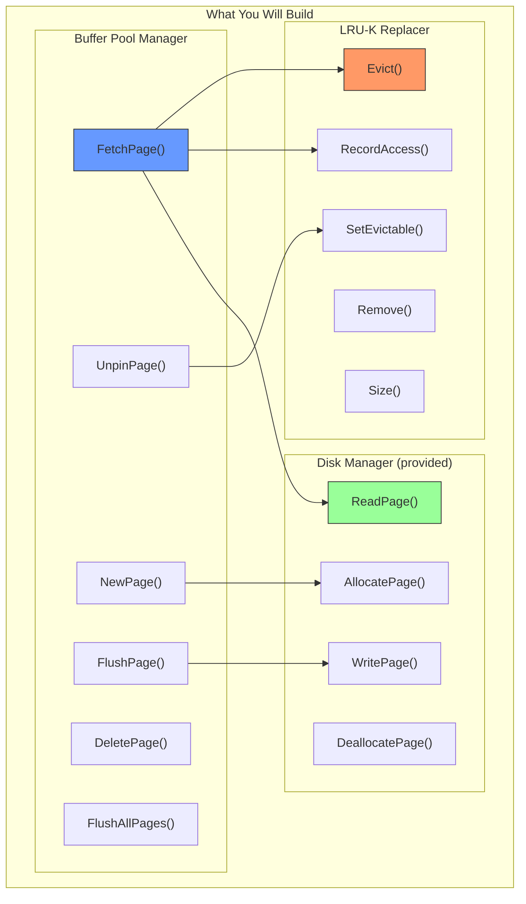
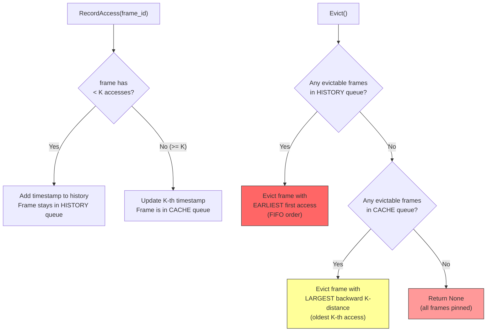
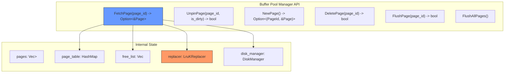
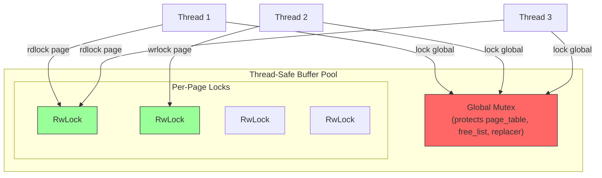
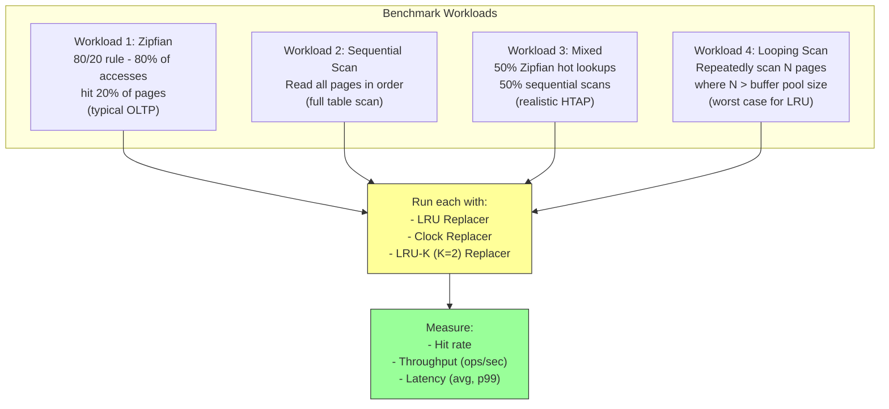
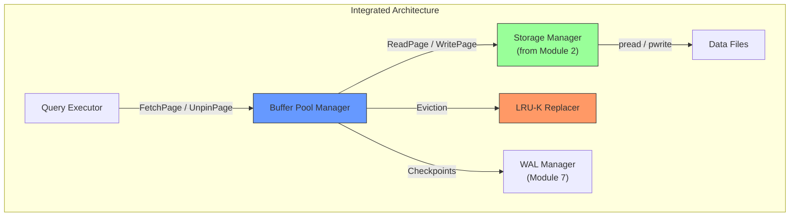

# Module 6: Project - Build a Buffer Pool Manager

## Overview

In this project, you will implement a complete **Buffer Pool Manager** with an **LRU-K page replacement policy**. This is inspired by CMU 15-445 Project 1 and is one of the most important components of a database system.

Your buffer pool manager will:
1. Manage a fixed-size pool of memory frames
2. Load pages from disk on demand
3. Evict pages using LRU-K replacement
4. Support concurrent access with proper locking
5. Track dirty pages and write them back to disk



---

## Part 1: Disk Manager (Provided)

The disk manager handles raw page I/O. You can use this implementation or integrate with the storage manager from Module 2.

```rust
use std::fs::{File, OpenOptions};
use std::io::{Read, Write, Seek, SeekFrom};

const PAGE_SIZE: usize = 4096;
type PageId = u32;

struct DiskManager {
    file: File,
    num_pages: u32,
}

impl DiskManager {
    fn new(filename: &str) -> Self {
        let file = OpenOptions::new()
            .read(true)
            .write(true)
            .create(true)
            .open(filename)
            .expect("Failed to open database file");

        let metadata = file.metadata().unwrap();
        let num_pages = (metadata.len() / PAGE_SIZE as u64) as u32;

        DiskManager { file, num_pages }
    }

    fn read_page(&mut self, page_id: PageId, data: &mut [u8; PAGE_SIZE]) {
        let offset = page_id as u64 * PAGE_SIZE as u64;
        self.file.seek(SeekFrom::Start(offset)).unwrap();
        self.file.read_exact(data).unwrap();
    }

    fn write_page(&mut self, page_id: PageId, data: &[u8; PAGE_SIZE]) {
        let offset = page_id as u64 * PAGE_SIZE as u64;
        self.file.seek(SeekFrom::Start(offset)).unwrap();
        self.file.write_all(data).unwrap();
        self.file.sync_data().unwrap();
    }

    fn allocate_page(&mut self) -> PageId {
        let page_id = self.num_pages;
        self.num_pages += 1;
        // Extend the file
        let offset = self.num_pages as u64 * PAGE_SIZE as u64;
        self.file.set_len(offset).unwrap();
        page_id
    }

    fn deallocate_page(&mut self, _page_id: PageId) {
        // In a real system, this would add the page to a free page list
        // For simplicity, we just leave it as a "hole"
    }
}
```

---

## Part 2: LRU-K Replacer

Implement the LRU-K replacer with the following interface. This is the most intellectually challenging part of the project.

### Requirements



### Interface

```rust
trait Replacer {
    /// Record that the given frame was accessed at the current logical timestamp.
    /// This should be called after a page is pinned in the buffer pool.
    fn record_access(&mut self, frame_id: FrameId);

    /// Mark a frame as evictable or non-evictable.
    /// A frame is evictable when its pin_count drops to 0.
    /// A frame is non-evictable when it is pinned (pin_count > 0).
    fn set_evictable(&mut self, frame_id: FrameId, evictable: bool);

    /// Find a victim frame to evict according to the LRU-K policy.
    ///
    /// Eviction priority:
    /// 1. Frames with fewer than K accesses are evicted FIRST (FIFO order)
    /// 2. Among frames with >= K accesses, evict the one whose K-th most
    ///    recent access is furthest in the past
    ///
    /// Returns None if there are no evictable frames.
    fn evict(&mut self) -> Option<FrameId>;

    /// Remove a frame from the replacer entirely.
    /// Called when a page is deleted from the buffer pool.
    fn remove(&mut self, frame_id: FrameId);

    /// Return the number of evictable frames.
    fn size(&self) -> usize;
}
```

### Skeleton

```rust
use std::collections::{HashMap, VecDeque};

type FrameId = usize;

struct LruKReplacer {
    k: usize,
    current_timestamp: u64,
    max_frames: usize,
    frames: HashMap<FrameId, FrameInfo>,
}

struct FrameInfo {
    /// Timestamps of the last K accesses (oldest first)
    history: VecDeque<u64>,
    /// Whether this frame can be evicted
    evictable: bool,
}

impl LruKReplacer {
    fn new(max_frames: usize, k: usize) -> Self {
        LruKReplacer {
            k,
            current_timestamp: 0,
            max_frames,
            frames: HashMap::new(),
        }
    }

    /// Helper: backward k-distance for a frame.
    /// Returns None for frames with < k accesses (treat as +infinity).
    fn k_distance(&self, info: &FrameInfo) -> Option<u64> {
        if info.history.len() < self.k {
            None  // +infinity (evict these first)
        } else {
            // The k-th most recent access = history[history.len() - k]
            Some(info.history[info.history.len() - self.k])
        }
    }
}

impl Replacer for LruKReplacer {
    fn record_access(&mut self, frame_id: FrameId) {
        self.current_timestamp += 1;
        let info = self.frames.entry(frame_id).or_insert(FrameInfo {
            history: VecDeque::new(),
            evictable: false,
        });
        info.history.push_back(self.current_timestamp);
        // Only keep the last K timestamps
        while info.history.len() > self.k {
            info.history.pop_front();
        }
    }

    fn set_evictable(&mut self, frame_id: FrameId, evictable: bool) {
        // TODO: Implement this
        // Update the evictable flag for the given frame
        todo!()
    }

    fn evict(&mut self) -> Option<FrameId> {
        // TODO: Implement this
        // 1. Among evictable frames, find those with < K accesses (history queue)
        //    - Among these, evict the one with the earliest first access (FIFO)
        // 2. If no history queue frames, find evictable frames with >= K accesses
        //    - Among these, evict the one with the largest backward k-distance
        //      (smallest k-th access timestamp = oldest)
        // 3. Remove the victim from self.frames
        // 4. Return Some(victim_frame_id) or None if no evictable frames
        todo!()
    }

    fn remove(&mut self, frame_id: FrameId) {
        // TODO: Implement this
        // Remove frame from tracking entirely
        // Should throw error if frame is non-evictable and present
        todo!()
    }

    fn size(&self) -> usize {
        // TODO: Implement this
        // Return count of evictable frames
        todo!()
    }
}
```

### Test Cases for LRU-K Replacer

```rust
#[cfg(test)]
mod lru_k_tests {
    use super::*;

    #[test]
    fn test_basic_eviction_k2() {
        let mut replacer = LruKReplacer::new(5, 2);

        // Access frames 0, 1, 2 once each
        replacer.record_access(0);
        replacer.record_access(1);
        replacer.record_access(2);
        replacer.set_evictable(0, true);
        replacer.set_evictable(1, true);
        replacer.set_evictable(2, true);

        // All have < K accesses, so evict FIFO (oldest first)
        assert_eq!(replacer.evict(), Some(0));
        assert_eq!(replacer.evict(), Some(1));
        assert_eq!(replacer.evict(), Some(2));
        assert_eq!(replacer.evict(), None);
    }

    #[test]
    fn test_k_accesses_protect_from_history_eviction() {
        let mut replacer = LruKReplacer::new(5, 2);

        // Frame 0: accessed twice (in cache queue)
        replacer.record_access(0);
        replacer.record_access(0);
        replacer.set_evictable(0, true);

        // Frame 1: accessed once (in history queue)
        replacer.record_access(1);
        replacer.set_evictable(1, true);

        // Frame 1 should be evicted first (history queue evicted before cache)
        assert_eq!(replacer.evict(), Some(1));
        assert_eq!(replacer.evict(), Some(0));
    }

    #[test]
    fn test_cache_queue_eviction_by_k_distance() {
        let mut replacer = LruKReplacer::new(5, 2);

        // Frame 0: accessed at t=1, t=3
        replacer.record_access(0);  // t=1
        replacer.record_access(1);  // t=2
        replacer.record_access(0);  // t=3
        replacer.record_access(1);  // t=4

        // Both have 2 accesses. Frame 0's k-distance = t=1, Frame 1's = t=2
        // Frame 0 has the older k-th access, so evict frame 0 first
        replacer.set_evictable(0, true);
        replacer.set_evictable(1, true);

        assert_eq!(replacer.evict(), Some(0));
        assert_eq!(replacer.evict(), Some(1));
    }

    #[test]
    fn test_pinned_frames_not_evictable() {
        let mut replacer = LruKReplacer::new(5, 2);

        replacer.record_access(0);
        replacer.record_access(1);
        replacer.set_evictable(0, false);  // Pinned!
        replacer.set_evictable(1, true);

        // Frame 0 is pinned, cannot evict
        assert_eq!(replacer.evict(), Some(1));
        assert_eq!(replacer.evict(), None);

        // Unpin frame 0
        replacer.set_evictable(0, true);
        assert_eq!(replacer.evict(), Some(0));
    }

    #[test]
    fn test_size_tracking() {
        let mut replacer = LruKReplacer::new(5, 2);

        replacer.record_access(0);
        replacer.record_access(1);
        replacer.record_access(2);

        assert_eq!(replacer.size(), 0);  // None evictable yet

        replacer.set_evictable(0, true);
        replacer.set_evictable(1, true);
        assert_eq!(replacer.size(), 2);

        replacer.set_evictable(0, false);
        assert_eq!(replacer.size(), 1);
    }

    #[test]
    fn test_sequential_scan_resistance() {
        let mut replacer = LruKReplacer::new(100, 2);

        // Simulate hot pages accessed multiple times
        for _ in 0..5 {
            for page in 0..10 {
                replacer.record_access(page);
            }
        }
        for page in 0..10 {
            replacer.set_evictable(page, true);
        }

        // Simulate sequential scan (each page accessed once)
        for page in 100..200 {
            replacer.record_access(page);
            replacer.set_evictable(page, true);
        }

        // Evictions should come from the scan pages (history queue) first
        for _ in 0..100 {
            let victim = replacer.evict().unwrap();
            assert!(victim >= 100, "Hot page {} was evicted before scan pages!", victim);
        }
    }
}
```

---

## Part 3: Buffer Pool Manager

### Requirements



### Skeleton

```rust
use std::collections::HashMap;
use std::sync::{Mutex, RwLock};

struct BufferPoolManager {
    pool_size: usize,
    pages: Vec<RwLock<Page>>,
    page_table: HashMap<PageId, FrameId>,
    free_list: Vec<FrameId>,
    replacer: LruKReplacer,
    disk_manager: DiskManager,
}

struct Page {
    data: [u8; PAGE_SIZE],
    page_id: Option<PageId>,
    pin_count: u32,
    is_dirty: bool,
}

impl BufferPoolManager {
    fn new(pool_size: usize, k: usize, db_filename: &str) -> Self {
        let pages: Vec<RwLock<Page>> = (0..pool_size)
            .map(|_| RwLock::new(Page {
                data: [0u8; PAGE_SIZE],
                page_id: None,
                pin_count: 0,
                is_dirty: false,
            }))
            .collect();

        let free_list: Vec<FrameId> = (0..pool_size).rev().collect(); // Stack order

        BufferPoolManager {
            pool_size,
            pages,
            page_table: HashMap::new(),
            free_list,
            replacer: LruKReplacer::new(pool_size, k),
            disk_manager: DiskManager::new(db_filename),
        }
    }

    /// Fetch a page from the buffer pool.
    /// If the page is already in memory, pin it and return it.
    /// If not, load it from disk (evicting if necessary).
    fn fetch_page(&mut self, page_id: PageId) -> Option<FrameId> {
        // TODO: Implement
        // 1. Check page_table for page_id
        //    - If found: increment pin_count, record access, set non-evictable, return
        // 2. Find a free frame (free_list or eviction)
        // 3. If evicting: flush dirty victim, remove old mapping
        // 4. Read page from disk into frame
        // 5. Update page_table, metadata, replacer
        // 6. Return frame_id
        todo!()
    }

    /// Unpin a page, decrementing its pin count.
    /// If pin_count reaches 0, the page becomes evictable.
    fn unpin_page(&mut self, page_id: PageId, is_dirty: bool) -> bool {
        // TODO: Implement
        todo!()
    }

    /// Allocate a new page on disk and bring it into the buffer pool.
    fn new_page(&mut self) -> Option<(PageId, FrameId)> {
        // TODO: Implement
        // 1. Find a free frame
        // 2. Allocate a new page_id from disk_manager
        // 3. Initialize the frame (zero data, pin_count=1, dirty=true)
        // 4. Update page_table and replacer
        todo!()
    }

    /// Delete a page from the buffer pool and disk.
    fn delete_page(&mut self, page_id: PageId) -> bool {
        // TODO: Implement
        // 1. If page is in buffer pool and pinned, return false
        // 2. Remove from page_table, replacer
        // 3. Return frame to free_list
        // 4. Deallocate on disk
        todo!()
    }

    /// Write a specific page to disk (regardless of dirty flag).
    fn flush_page(&mut self, page_id: PageId) -> bool {
        // TODO: Implement
        todo!()
    }

    /// Write all dirty pages to disk.
    fn flush_all_pages(&mut self) {
        // TODO: Implement
        todo!()
    }

    /// Helper: find a free frame from the free list or by eviction.
    fn find_free_frame(&mut self) -> Option<FrameId> {
        // TODO: Implement
        // 1. Try popping from free_list
        // 2. If empty, call replacer.evict()
        // 3. If evicting dirty page, write to disk first
        // 4. Clean up old mapping
        todo!()
    }
}
```

### Test Cases for Buffer Pool Manager

```rust
#[cfg(test)]
mod bpm_tests {
    use super::*;
    use std::fs;

    fn setup(pool_size: usize) -> BufferPoolManager {
        let _ = fs::remove_file("/tmp/test_bpm.db");
        BufferPoolManager::new(pool_size, 2, "/tmp/test_bpm.db")
    }

    #[test]
    fn test_new_page() {
        let mut bpm = setup(10);

        // Allocate a new page
        let (page_id, frame_id) = bpm.new_page().unwrap();
        assert_eq!(page_id, 0);

        // Write some data to the page
        {
            let mut page = bpm.pages[frame_id].write().unwrap();
            page.data[0..5].copy_from_slice(b"hello");
        }

        // Unpin and flush
        bpm.unpin_page(page_id, true);
        bpm.flush_page(page_id);

        fs::remove_file("/tmp/test_bpm.db").ok();
    }

    #[test]
    fn test_fetch_page_persists_data() {
        let mut bpm = setup(10);

        // Create page, write data, unpin, flush
        let (page_id, frame_id) = bpm.new_page().unwrap();
        {
            let mut page = bpm.pages[frame_id].write().unwrap();
            page.data[0..5].copy_from_slice(b"world");
        }
        bpm.unpin_page(page_id, true);
        bpm.flush_page(page_id);

        // Fetch the same page - data should be there
        let frame_id2 = bpm.fetch_page(page_id).unwrap();
        {
            let page = bpm.pages[frame_id2].read().unwrap();
            assert_eq!(&page.data[0..5], b"world");
        }
        bpm.unpin_page(page_id, false);

        fs::remove_file("/tmp/test_bpm.db").ok();
    }

    #[test]
    fn test_eviction() {
        let mut bpm = setup(3); // Only 3 frames!

        // Fill all 3 frames
        let (p0, _) = bpm.new_page().unwrap();
        let (p1, _) = bpm.new_page().unwrap();
        let (p2, _) = bpm.new_page().unwrap();

        // Unpin all
        bpm.unpin_page(p0, false);
        bpm.unpin_page(p1, false);
        bpm.unpin_page(p2, false);

        // Allocate a 4th page - must evict one
        let (p3, _) = bpm.new_page().unwrap();
        assert!(bpm.page_table.contains_key(&p3));

        // One of the first 3 pages should have been evicted
        let evicted = !bpm.page_table.contains_key(&p0)
            || !bpm.page_table.contains_key(&p1)
            || !bpm.page_table.contains_key(&p2);
        assert!(evicted, "One page should have been evicted");

        bpm.unpin_page(p3, false);
        fs::remove_file("/tmp/test_bpm.db").ok();
    }

    #[test]
    fn test_dirty_page_written_on_eviction() {
        let mut bpm = setup(1); // Only 1 frame!

        // Create page, write data, mark dirty, unpin
        let (p0, f0) = bpm.new_page().unwrap();
        {
            let mut page = bpm.pages[f0].write().unwrap();
            page.data[0..4].copy_from_slice(b"test");
        }
        bpm.unpin_page(p0, true);

        // Create another page, forcing eviction of p0
        let (_p1, _f1) = bpm.new_page().unwrap();
        bpm.unpin_page(_p1, false);

        // Fetch p0 again - data should have been persisted during eviction
        let f0_new = bpm.fetch_page(p0).unwrap();
        {
            let page = bpm.pages[f0_new].read().unwrap();
            assert_eq!(&page.data[0..4], b"test");
        }
        bpm.unpin_page(p0, false);

        fs::remove_file("/tmp/test_bpm.db").ok();
    }

    #[test]
    fn test_cannot_evict_pinned_pages() {
        let mut bpm = setup(2);

        // Create and keep both pages pinned
        let (p0, _) = bpm.new_page().unwrap();
        let (p1, _) = bpm.new_page().unwrap();
        // Do NOT unpin!

        // Try to create a third page - should fail (no evictable frames)
        let result = bpm.new_page();
        assert!(result.is_none(), "Should not be able to create page when all frames are pinned");

        bpm.unpin_page(p0, false);
        bpm.unpin_page(p1, false);
        fs::remove_file("/tmp/test_bpm.db").ok();
    }

    #[test]
    fn test_delete_page() {
        let mut bpm = setup(10);

        let (p0, _) = bpm.new_page().unwrap();
        bpm.unpin_page(p0, false);

        assert!(bpm.delete_page(p0));
        assert!(!bpm.page_table.contains_key(&p0));

        // Free list should have grown (frame returned)
        assert_eq!(bpm.free_list.len(), 10); // Back to full

        fs::remove_file("/tmp/test_bpm.db").ok();
    }
}
```

---

## Part 4: Thread-Safe Wrapper

Wrap your buffer pool manager with proper synchronization for concurrent access.



```rust
use std::sync::{Arc, Mutex};

struct ConcurrentBufferPoolManager {
    inner: Mutex<BufferPoolManager>,
}

impl ConcurrentBufferPoolManager {
    fn new(pool_size: usize, k: usize, db_filename: &str) -> Self {
        ConcurrentBufferPoolManager {
            inner: Mutex::new(BufferPoolManager::new(pool_size, k, db_filename)),
        }
    }

    fn fetch_page(&self, page_id: PageId) -> Option<FrameId> {
        let mut bpm = self.inner.lock().unwrap();
        bpm.fetch_page(page_id)
    }

    fn unpin_page(&self, page_id: PageId, is_dirty: bool) -> bool {
        let mut bpm = self.inner.lock().unwrap();
        bpm.unpin_page(page_id, is_dirty)
    }

    fn new_page(&self) -> Option<(PageId, FrameId)> {
        let mut bpm = self.inner.lock().unwrap();
        bpm.new_page()
    }

    // ... other methods ...
}
```

### Concurrency Test

```rust
#[test]
fn test_concurrent_access() {
    use std::thread;
    use std::sync::Arc;

    let bpm = Arc::new(ConcurrentBufferPoolManager::new(100, 2, "/tmp/test_concurrent.db"));

    let mut handles = vec![];

    // Spawn 8 threads, each creating and accessing pages
    for thread_id in 0..8 {
        let bpm_clone = Arc::clone(&bpm);
        let handle = thread::spawn(move || {
            for i in 0..100 {
                let page_id = (thread_id * 100 + i) as PageId;

                // Create a page
                if let Some((pid, _fid)) = bpm_clone.new_page() {
                    bpm_clone.unpin_page(pid, true);
                }
            }
        });
        handles.push(handle);
    }

    for handle in handles {
        handle.join().unwrap();
    }

    std::fs::remove_file("/tmp/test_concurrent.db").ok();
}
```

---

## Part 5: Benchmarking Replacement Policies

Compare the performance of different replacement policies.

### Benchmark Setup

```rust
use std::time::Instant;
use rand::Rng;

struct BenchmarkResult {
    policy_name: String,
    total_fetches: u64,
    cache_hits: u64,
    cache_misses: u64,
    hit_rate: f64,
    elapsed_ms: u128,
}

fn benchmark_zipfian_workload(
    pool_size: usize,
    num_pages: usize,
    num_operations: usize,
    skew: f64,  // Zipfian skew (0.0 = uniform, 1.0 = highly skewed)
) -> BenchmarkResult {
    // Generate Zipfian distribution of page accesses
    // Higher skew = more concentrated on a few hot pages
    let mut rng = rand::thread_rng();
    let pages: Vec<PageId> = (0..num_operations)
        .map(|_| {
            // Simple Zipfian approximation
            let r: f64 = rng.gen();
            let page = ((r.powf(skew) * num_pages as f64) as PageId) % num_pages as PageId;
            page
        })
        .collect();

    // TODO: Run workload against buffer pool with different replacers
    // Track hits vs misses
    todo!()
}
```

### Workloads to Benchmark



### Expected Results

| Workload | LRU | Clock | LRU-K (K=2) |
|----------|-----|-------|--------------|
| Zipfian | Good hit rate | Good hit rate | Good hit rate |
| Sequential | 0% (if scan > pool) | 0% (similar) | 0% (scan pages evicted first, but pool still too small) |
| Mixed | Poor (scan pollutes) | Slightly better | Best (scan-resistant) |
| Looping Scan | 0% always | 0% always | 0% always |

---

## Part 6: Integration with Storage Manager

If you completed the storage manager from Module 2, integrate it with your buffer pool.



---

## Deliverables Checklist

```
[ ] LRU-K Replacer
    [ ] RecordAccess - correctly tracks timestamps
    [ ] SetEvictable - correctly toggles evictability
    [ ] Evict - history queue (FIFO) before cache queue (by k-distance)
    [ ] Remove - cleans up frame tracking
    [ ] Size - accurate count of evictable frames
    [ ] All LRU-K test cases pass

[ ] Buffer Pool Manager
    [ ] FetchPage - handles cache hit and cache miss
    [ ] UnpinPage - decrements pin count, sets dirty flag
    [ ] NewPage - allocates new page, brings into pool
    [ ] DeletePage - removes from pool, returns frame to free list
    [ ] FlushPage - writes page to disk
    [ ] FlushAllPages - writes all dirty pages
    [ ] Eviction of dirty pages writes to disk first
    [ ] All BPM test cases pass

[ ] Thread Safety
    [ ] Concurrent FetchPage from multiple threads
    [ ] No data races (run with cargo test under thread sanitizer)
    [ ] No deadlocks

[ ] Benchmarks
    [ ] Implement at least LRU and LRU-K replacers
    [ ] Run Zipfian workload benchmark
    [ ] Run sequential scan benchmark
    [ ] Run mixed workload benchmark
    [ ] Write up results comparing policies

[ ] Stretch Goals
    [ ] Implement Clock replacer
    [ ] Implement ARC replacer
    [ ] Add pre-fetching for sequential scans
    [ ] Add ring buffer optimization for scans
    [ ] Integrate with Module 2 storage manager
```

---

## Grading Rubric

| Component | Points |
|-----------|--------|
| LRU-K Replacer correctness | 25 |
| Buffer Pool Manager correctness | 30 |
| Thread safety | 15 |
| Benchmark implementation and analysis | 15 |
| Code quality and documentation | 10 |
| Stretch goals (bonus) | 5 |
| **Total** | **100** |
