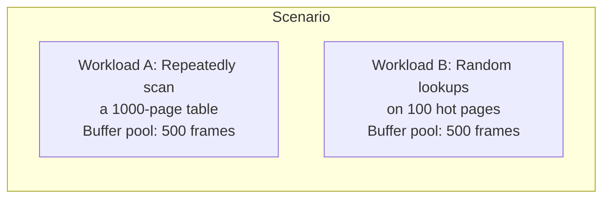
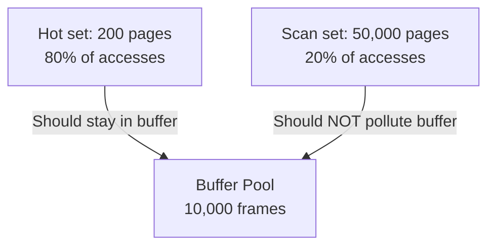

# Module 6: Quiz Questions - Buffer Pool & Memory Management

## Instructions

Test your understanding of buffer pool architecture, page replacement policies, and memory management in database systems. Answers are provided at the end.

---

## Section 1: Buffer Pool Fundamentals

### Question 1
Why do database systems implement their own buffer pool instead of relying on the OS page cache? List at least four reasons.

---

### Question 2
Consider a buffer pool with 4 frames. The following operations occur:

```
FetchPage(1)    -- page 1 loaded into frame 0
FetchPage(2)    -- page 2 loaded into frame 1
FetchPage(3)    -- page 3 loaded into frame 2
FetchPage(4)    -- page 4 loaded into frame 3
UnpinPage(2, dirty=true)
UnpinPage(4, dirty=false)
UnpinPage(1, dirty=false)
FetchPage(5)    -- buffer pool is full, must evict
```

Using LRU replacement, which page is evicted? Is a disk write required before eviction?

---

### Question 3
What happens if a thread calls `FetchPage()` but forgets to call `UnpinPage()`? What is this problem called?

---

### Question 4
Explain the difference between the **page table** in the buffer pool manager and the **page table** managed by the OS/hardware for virtual memory. Why is it important not to confuse them?

---

### Question 5
A page has `pin_count = 3`. What does this mean? Can this page be evicted? Can its dirty flag be `true`?

---

### Question 6
Consider this sequence:

```
Thread A: FetchPage(10)          -> pin_count = 1
Thread B: FetchPage(10)          -> pin_count = 2
Thread A: UnpinPage(10, false)   -> pin_count = 1
Thread B: modify page 10 data
Thread B: UnpinPage(10, true)    -> pin_count = 0, dirty = true
```

Is the dirty flag correctly set to `true` even though Thread A passed `dirty=false`? Explain why.

---

## Section 2: Page Replacement Policies

### Question 7
What is **sequential flooding**? Give a concrete example with a buffer pool of size 3 and a sequential scan reading pages 1 through 10.

---

### Question 8
Explain the Clock algorithm step by step. For the following state, determine which frame is evicted:

```
Buffer pool with 6 frames, clock hand at position 0:

Frame 0: ref=1, evictable=true
Frame 1: ref=0, evictable=false (pinned)
Frame 2: ref=1, evictable=true
Frame 3: ref=0, evictable=true
Frame 4: ref=1, evictable=true
Frame 5: ref=0, evictable=true
```

---

### Question 9
How does LRU-K (with K=2) solve the sequential flooding problem? Compare what happens when a sequential scan reads 100 pages through LRU-1 vs LRU-2.

---

### Question 10
In PostgreSQL's clock sweep, the `usage_count` ranges from 0 to 5. A popular index page might have `usage_count = 5`. How many full clock sweeps must pass before this page can be evicted (assuming no new accesses)?

---

### Question 11
Describe the InnoDB modified LRU algorithm. What is the "midpoint insertion strategy"? Why does InnoDB use `innodb_old_blocks_time`?

---

### Question 12
In ARC (Adaptive Replacement Cache), what are the ghost lists B1 and B2? Why are they necessary? What happens to the adaptive parameter `p` when there is a hit in B1 vs B2?

---

### Question 13


For Workload A, which replacement policy performs best: LRU, Clock, or LRU-K? Explain why. What about Workload B?

---

### Question 14
Explain the 2Q algorithm. How does it differ from LRU-K? What are its advantages?

---

## Section 3: Buffer Pool Optimizations

### Question 15
What are the benefits of using **multiple buffer pool instances**? How does MySQL/InnoDB decide which instance a page belongs to?

---

### Question 16
Explain PostgreSQL's **ring buffer** optimization. When is it used? Why does it help?

---

### Question 17
What is **scan sharing** (synchronized sequential scans)? Consider this scenario:

```
Query Q1 starts scanning table T (100 pages), currently at page 60.
Query Q2 starts scanning the same table T.
```

How does scan sharing work here? In what order does Q2 read pages?

---

### Question 18
What is **pre-fetching** (read-ahead)? How does it differ from the OS's built-in readahead? Why might a database want to implement its own?

---

## Section 4: Memory Management

### Question 19
Explain the **double buffering problem**. Why does PostgreSQL accept double buffering while InnoDB avoids it with `O_DIRECT`?

---

### Question 20
What is the problem with using `mmap()` to manage database pages? List at least three concrete issues that have caused bugs in real database systems.

---

### Question 21
What are **huge pages**? Why do they matter for large buffer pools? Why do most database vendors recommend disabling **Transparent Huge Pages (THP)**?

---

### Question 22
Explain PostgreSQL's **MemoryContext** system. Why is it useful for a database to organize memory allocations in a hierarchy?

---

### Question 23
What is the difference between `shared_buffers` and `work_mem` in PostgreSQL? Which is shared across connections and which is per-operation? What happens if `work_mem` is set too high on a server with many concurrent connections?

---

### Question 24
On a NUMA system, why is `numactl --interleave=all` often recommended for database processes? What would happen if the buffer pool were allocated entirely on one NUMA node?

---

## Section 5: System Design and Tradeoffs

### Question 25
You are designing a buffer pool for an OLAP database that primarily runs large sequential scans with occasional point lookups. Which replacement policy would you choose and why? What optimizations would you add?

---

### Question 26
The checkpointer writes all dirty pages to disk periodically. Why is it important to **spread** checkpoint writes over the checkpoint interval (e.g., PostgreSQL's `checkpoint_completion_target = 0.9`)? What happens if all dirty pages are flushed at once?

---

### Question 27
Consider this scenario:

```
Buffer pool size: 10,000 pages
Page size: 8 KB
Total buffer pool memory: ~80 MB

Workload: 80% of queries access 200 "hot" pages
          20% of queries scan through 50,000 different pages
```



With plain LRU, what would happen to the hot pages? How would LRU-K or 2Q handle this differently?

---

### Question 28
A developer argues: "We should set `shared_buffers` to 100 GB on our 128 GB server to maximize the buffer pool hit ratio." Why is this a bad idea? What should the remaining memory be used for?

---

---

## Answers

### Answer 1
Four key reasons:
1. **Eviction control**: The DB can implement scan-resistant policies (LRU-K, Clock) while the OS uses simple LRU/Clock without understanding DB workloads.
2. **Write ordering**: The DB must enforce WAL protocol -- log records must be written before dirty data pages. The OS can flush pages at any time, violating this.
3. **Prefetching**: The DB knows query plans and can prefetch pages intelligently. The OS only does simple sequential readahead.
4. **Concurrency control**: The DB needs pin/unpin semantics and page-level locking that the OS page cache does not provide.
5. **Error handling**: The DB can handle I/O errors gracefully. With mmap, an I/O error causes SIGBUS.
6. **Avoiding double buffering**: With its own buffer pool, the DB can use O_DIRECT to avoid redundant caching in the OS.

### Answer 2
Pages were unpinned in order: 2, 4, 1. Using LRU, page 2 is the least recently unpinned, so it is evicted. Since page 2 is dirty (`dirty=true`), the buffer pool **must write it to disk** before reusing the frame.

### Answer 3
This is called a **page leak** (or buffer leak). The page's pin_count never reaches 0, so it can never be evicted. Over time, the buffer pool fills with leaked pages and eventually `FetchPage()` returns NULL because no frames are available.

### Answer 4
The **buffer pool page table** is a hash map from `page_id` to `frame_id`, mapping logical disk pages to their location in the buffer pool's frame array. The **OS page table** maps virtual addresses to physical memory frames for the entire process. They are completely different data structures serving different purposes. Confusing them leads to misunderstanding the memory management architecture.

### Answer 5
`pin_count = 3` means three threads/operations currently hold a reference to this page. The page **cannot** be evicted (the replacer must skip it). Its dirty flag **can** be `true` -- a pinned page can certainly be modified. It just cannot be evicted while pinned.

### Answer 6
Yes, the dirty flag is correctly set. The `UnpinPage` function uses OR semantics for the dirty flag: `page.is_dirty = page.is_dirty || is_dirty`. Thread A's `UnpinPage(10, false)` does not clear the flag -- it simply does not set it. Thread B's `UnpinPage(10, true)` sets it to `true`. Once dirty, a page stays dirty until it is flushed to disk.

### Answer 7
Sequential flooding occurs when a sequential scan evicts all useful pages from the buffer pool. With buffer pool size 3:
```
Read page 1: [1, _, _]
Read page 2: [1, 2, _]
Read page 3: [1, 2, 3] -- buffer full
Read page 4: [4, 2, 3] -- evict page 1 (LRU)
Read page 5: [4, 5, 3] -- evict page 2 (LRU)
...
```
Every page causes a cache miss. Worse, if another query needs pages 1-3 (which were hot), they have been evicted by the scan.

### Answer 8
Starting at frame 0:
- Frame 0: ref=1, evictable. Set ref=0, advance.
- Frame 1: not evictable (pinned). Skip, advance.
- Frame 2: ref=1, evictable. Set ref=0, advance.
- Frame 3: ref=0, evictable. **VICTIM! Evict frame 3.**

Clock hand is now at position 4.

### Answer 9
With LRU-1 (plain LRU): Sequential scan pages enter the LRU list at the MRU position. They push hot pages out.

With LRU-2: Sequential scan pages are accessed only once, so they have only 1 timestamp (< K=2). They are placed in the "history" queue and evicted first (before pages with 2+ accesses). Hot pages that are accessed repeatedly have 2+ timestamps and live in the "cache" queue, protected from scan eviction.

### Answer 10
Five sweeps. Each sweep decrements usage_count by 1. So a page with usage_count=5 needs 5 sweeps to reach 0, after which it becomes evictable on the next sweep pass. This makes frequently accessed pages very "sticky."

### Answer 11
InnoDB splits its LRU list into a "young" sublist (front 5/8) and an "old" sublist (back 3/8). New pages are inserted at the **midpoint** (head of old sublist), not at the MRU end. A page is only promoted from old to young if it is re-accessed after `innodb_old_blocks_time` milliseconds (default 1000ms). This prevents a full table scan from flooding the young sublist -- scan pages are inserted into the old sublist and quickly evicted from the tail.

### Answer 12
B1 and B2 are **ghost lists** that store only metadata (page IDs) of recently evicted pages -- no actual data. B1 tracks pages evicted from T1 (recency list), B2 tracks pages evicted from T2 (frequency list).
- Hit in B1: We evicted a page that turned out to be useful. Increase `p` to make T1 larger (favor recency).
- Hit in B2: We evicted a frequent page that was needed. Decrease `p` to make T2 larger (favor frequency).
Ghost lists allow ARC to learn from its eviction mistakes without storing actual page data.

### Answer 13
**Workload A** (repeated scan of 1000 pages, 500 frame pool): No policy works well because the working set (1000 pages) exceeds the buffer pool (500 frames). LRU will achieve 0% hit rate. Clock is similar. LRU-K won't help much either since every page is accessed in each scan. The best approach is a ring buffer (like PostgreSQL uses) to at least avoid polluting the pool.

**Workload B** (random lookups on 100 hot pages, 500 frame pool): All policies work well because the hot set (100 pages) fits easily in the pool (500 frames). LRU, Clock, and LRU-K will all keep the 100 hot pages cached.

### Answer 14
2Q uses two physical queues: A1in (FIFO for first accesses) and Am (LRU for re-accesses). It differs from LRU-K in that it does not track timestamps -- it only tracks which queue a page is in. This makes 2Q simpler (O(1) operations) and cheaper than LRU-K (which may require O(log n) for eviction with K>1). The tradeoff is that 2Q is less precise about access patterns.

### Answer 15
Multiple buffer pool instances reduce latch contention. With a single instance, all threads compete for one mutex. With N instances, contention is divided by N. InnoDB assigns pages to instances using `hash(space_id, page_no) % num_instances`. This is set via `innodb_buffer_pool_instances` (recommended: number of CPU cores, up to 64).

### Answer 16
PostgreSQL's ring buffer is a small, fixed-size circular buffer (e.g., 256 KB) used for sequential scans, VACUUM, and bulk writes. Instead of using pages from the main buffer pool, these operations cycle through their ring buffer. This prevents large scans from evicting hot pages from shared_buffers. It is activated automatically for sequential scans on tables larger than 1/4 of shared_buffers.

### Answer 17
Q2 joins Q1's scan at page 60 instead of starting from page 1. Q2 reads pages 60, 61, ..., 100 (sharing buffers with Q1). After Q1 finishes, Q2 wraps around and reads pages 1, 2, ..., 59. Total: Q2 reads all 100 pages but shares I/O with Q1 for pages 60-100.

### Answer 18
Pre-fetching is reading pages into the buffer pool before they are needed. The OS does basic sequential readahead (e.g., doubling readahead size up to 128 KB). A database can do better because it knows the query plan: index scans can prefetch leaf pages, merge joins can prefetch sorted runs, and the prefetch distance can be tuned per operation.

### Answer 19
Double buffering: a page exists both in the database buffer pool and the OS page cache, wasting memory. PostgreSQL accepts it because the OS cache acts as a useful "second level" cache for WAL files, temp files, and pages not in shared_buffers. InnoDB avoids it with O_DIRECT because it manages a larger buffer pool (70-80% of RAM) and relies less on the OS cache.

### Answer 20
Three issues with mmap:
1. **No write-ordering control**: The OS can flush dirty pages at any time, violating WAL protocol. This caused data corruption in early MongoDB.
2. **SIGBUS on I/O errors**: Instead of returning an error code, the process receives a fatal signal. This crashed LevelDB on I/O errors.
3. **TLB shootdowns**: Invalidating mmap'd pages on multi-core systems is expensive. Each unmap triggers an inter-processor interrupt to flush TLB entries on all cores.

### Answer 21
Huge pages (2 MB instead of 4 KB) reduce TLB misses because each TLB entry covers 512x more memory. For a 64 GB buffer pool: 4 KB pages need 16 million TLB entries; 2 MB huge pages need only 32,768. THP is problematic because the kernel may stall for tens of milliseconds to defragment memory and create huge pages, causing unpredictable latency spikes. Explicit huge pages (reserved at boot) avoid this.

### Answer 22
MemoryContext organizes allocations in a tree. When a query finishes, its entire MemoryContext (and all children) is freed at once. This prevents memory leaks without requiring individual `free()` calls for each allocation. It also enables efficient bulk deallocation and makes it easy to track memory usage per operation.

### Answer 23
`shared_buffers` is shared across all connections (in shared memory). `work_mem` is per-operation (per sort or hash within a query) in the backend's private memory. If `work_mem = 1GB` and you have 100 connections each running queries with 3 sorts, that is up to 300 GB of memory -- far exceeding RAM. This causes OOM kills or heavy swapping.

### Answer 24
`numactl --interleave=all` distributes memory evenly across NUMA nodes. Without it, the buffer pool might be allocated entirely on one node (the node where PostgreSQL starts). Then all backends on the other node(s) must access remote memory (~50% slower). Interleaving gives average access latency across all backends.

### Answer 25
For OLAP with large sequential scans: use Clock or LRU-K with K=2 to resist scan flooding. Add ring buffers for sequential scans (like PostgreSQL). Implement aggressive pre-fetching (read-ahead) since scan patterns are predictable. Consider separate buffer pools for temporary/sort data vs. persistent data.

### Answer 26
Spreading checkpoint writes avoids I/O spikes. If all dirty pages are flushed at once, the disk bandwidth is saturated and normal query I/O stalls. This causes latency spikes visible to users. With `checkpoint_completion_target = 0.9`, PostgreSQL spreads writes over 90% of the checkpoint interval (e.g., 4.5 minutes of a 5-minute interval), producing a steady, manageable I/O rate.

### Answer 27
With plain LRU: The 20% scan queries read 50,000 different pages, constantly cycling through the buffer pool and evicting the 200 hot pages. Hit rate for hot pages drops dramatically. With LRU-K (K=2): Hot pages have 2+ accesses and high k-distance, so they stay in the cache queue. Scan pages are accessed once and stay in the history queue, getting evicted first. The 200 hot pages remain in the buffer pool.

### Answer 28
Setting shared_buffers to 100 GB leaves only 28 GB for:
- OS page cache (needed for WAL files, temp files, non-shared I/O)
- Per-connection memory (work_mem, temp_buffers for each backend)
- OS kernel, other processes
- PostgreSQL shared memory overhead (lock tables, proc array)

This causes the OS to start swapping, dramatically hurting performance. The recommended starting point is 25% of RAM (32 GB), leaving ample memory for the OS cache and per-query operations.
