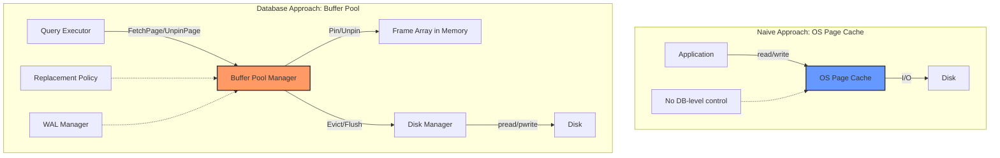
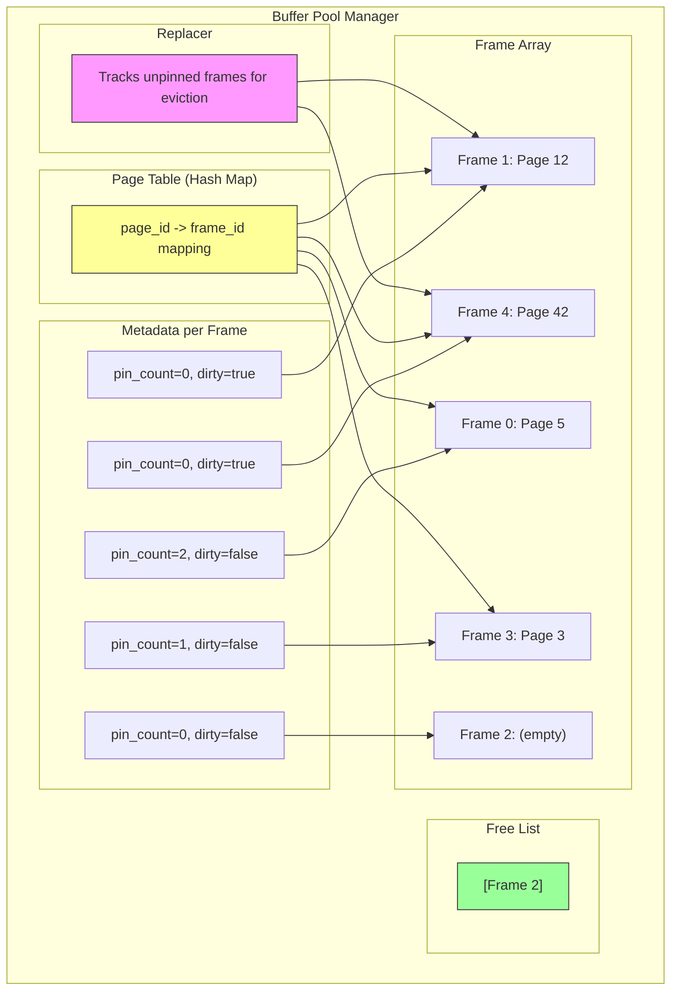
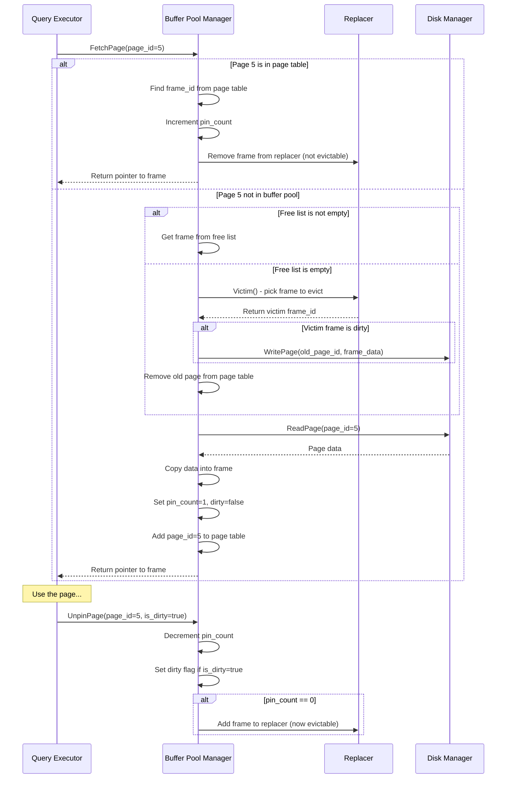
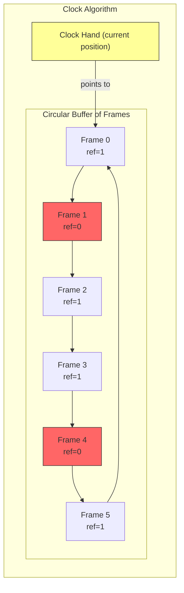
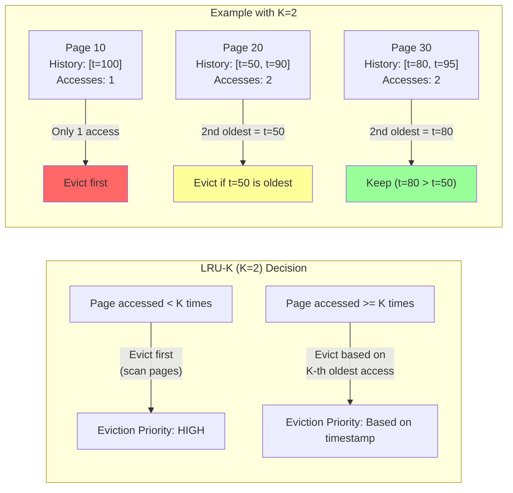
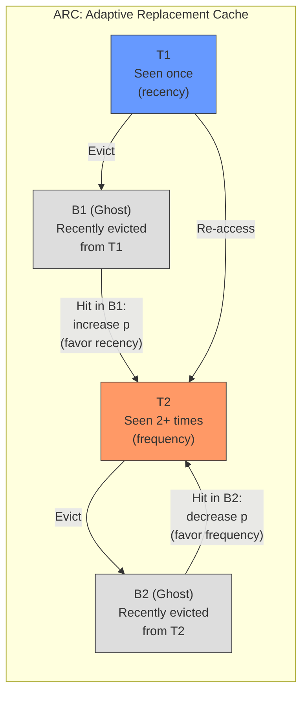
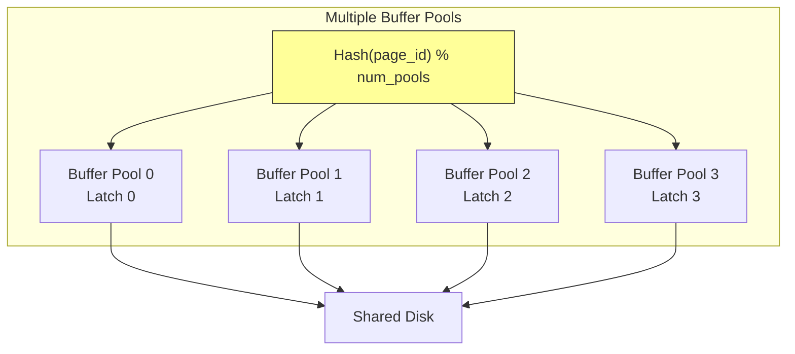
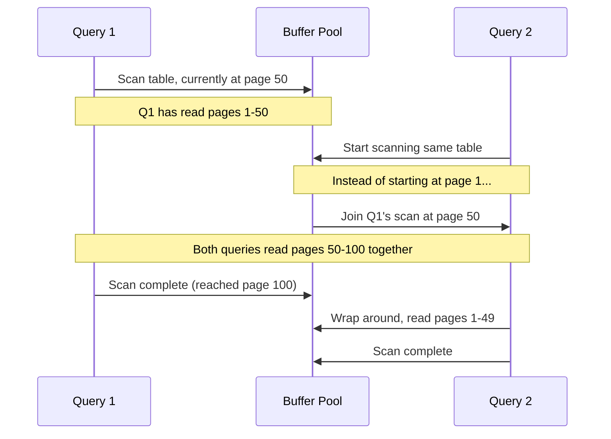
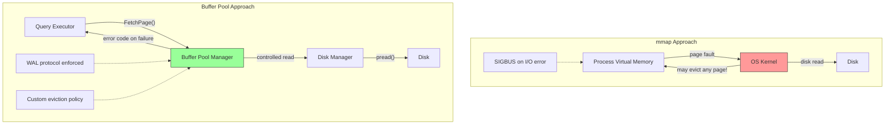
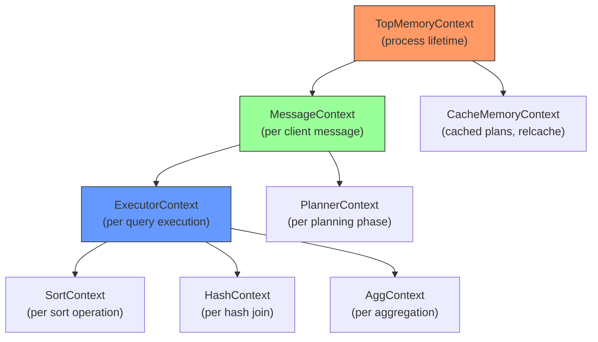

# Module 6: Buffer Pool & Memory Management

## Why Databases Manage Their Own Memory

Every modern database engine implements its own buffer pool rather than relying on the operating system's page cache. This is one of the most fundamental architectural decisions in database design. Understanding **why** is critical.

### The OS Page Cache Problem

The operating system provides a page cache (also called the buffer cache) that transparently caches file data in memory. When you call `read()`, the OS checks if the page is already in its cache. If so, it copies the data to your buffer. If not, it performs disk I/O, caches the result, and then copies it.

So why not just let the OS handle everything?

```
Problems with relying on the OS page cache:

1. No control over eviction    - The OS doesn't know which pages are "hot"
2. No control over write-back  - The OS can flush dirty pages at any time
3. Double buffering             - Data copied from OS cache to user buffer (wasteful)
4. No prefetching intelligence  - The OS uses simple sequential readahead
5. Crash recovery is harder     - fsync() semantics are complex and OS-dependent
6. No page-level locking        - The OS has no concept of database-level concurrency
7. Portability                  - Page cache behavior differs across OSes
```

### The Core Insight

A database knows its own access patterns far better than the OS ever could. It knows:

- Which pages will be needed next (from query plans)
- Which pages are being modified in a transaction
- When it is safe to write dirty pages to disk (WAL protocol)
- Which pages are shared across concurrent queries



---

## Buffer Pool Architecture

The buffer pool is a region of memory organized as an array of fixed-size **frames**. Each frame can hold exactly one disk page. The buffer pool manager tracks which disk pages are currently loaded into which frames.

### Core Components



#### 1. Frame Array

A contiguous block of memory divided into page-sized slots. If your page size is 8 KB and your buffer pool has 1000 frames, the frame array is 8 MB of memory.

```
Frame Array Layout (page_size = 8KB, num_frames = 4):

Address:  0x1000        0x3000        0x5000        0x7000
          +----------+  +----------+  +----------+  +----------+
          | Frame 0  |  | Frame 1  |  | Frame 2  |  | Frame 3  |
          | 8KB      |  | 8KB      |  | 8KB      |  | 8KB      |
          +----------+  +----------+  +----------+  +----------+
```

#### 2. Page Table (Hash Map)

A hash map from `page_id` to `frame_id`. This is NOT the same as a hardware page table or a B-tree page directory. It simply tells us: "If page X is in the buffer pool, it lives in frame Y."

#### 3. Free List

A list of frame IDs that are currently not holding any page. When we need to load a new page, we first check the free list. If it is empty, we must evict a page.

#### 4. Frame Metadata

Each frame tracks:
- **pin_count**: How many threads/queries are currently using this page
- **is_dirty**: Whether the page has been modified since it was read from disk
- **page_id**: Which disk page is stored in this frame

---

## Pin/Unpin Semantics

The pin/unpin protocol is the fundamental interface between the buffer pool and its consumers.

### How It Works



### Pin Count Rules

```
Rule 1: A page with pin_count > 0 MUST NOT be evicted
Rule 2: Every FetchPage must have a matching UnpinPage
Rule 3: Forgetting to UnpinPage causes a "page leak" (the buffer pool fills up)
Rule 4: pin_count tracks the NUMBER of concurrent users, not just pinned/unpinned
```

### The Dirty Flag

When a page is modified in memory, its dirty flag is set to `true`. This tells the buffer pool that the in-memory version differs from the on-disk version. Before evicting a dirty page, we must write it back to disk.

```
Lifecycle of a dirty page:

1. FetchPage(5)        -> pin_count=1, dirty=false
2. Modify page data    -> (in-memory change)
3. UnpinPage(5, true)  -> pin_count=0, dirty=true
4. ... time passes ...
5. Eviction chosen     -> Write page to disk, then reuse frame
                          dirty=false (on disk now matches)
```

---

## Page Replacement Policies

When the buffer pool is full and we need to load a new page, we must choose a **victim** frame to evict. The replacement policy determines which frame to evict.

### LRU (Least Recently Used)

The simplest approach: evict the page that was unpinned longest ago.

**Implementation**: A doubly-linked list + hash map. When a page is unpinned, move it to the tail. Evict from the head.

```
LRU List (head = least recent, tail = most recent):

  HEAD                                           TAIL
  [Page 3] <-> [Page 7] <-> [Page 12] <-> [Page 42]

  Evict Page 3 (least recently used)
```

**The Sequential Flooding Problem**:

LRU has a fatal flaw for databases. Consider a sequential scan of a large table:

```
Buffer pool size: 4 frames
Sequential scan reads pages: 1, 2, 3, 4, 5, 6, 7, 8, ...

After pages 1-4: [1, 2, 3, 4]    (buffer pool full)
Read page 5:     [2, 3, 4, 5]    (evict page 1)
Read page 6:     [3, 4, 5, 6]    (evict page 2)
...

Every single page causes a cache miss!
Meanwhile, a "hot" page being used by another query gets evicted.
```

This is called **sequential flooding** -- a single sequential scan pollutes the entire buffer pool and evicts useful pages.

### Clock Algorithm

An approximation of LRU that is cheaper to implement and avoids some of LRU's overhead. Used by PostgreSQL.



**How it works**:

1. Each frame has a **reference bit** (0 or 1)
2. When a page is accessed, set its reference bit to 1
3. To find a victim, sweep the clock hand around:
   - If reference bit = 1: set it to 0, move to next frame ("second chance")
   - If reference bit = 0: this is the victim, evict it
4. The hand remembers its position between evictions

```
Clock sweep example:

Initial state (hand at frame 0):
  Frame:  [0]  [1]  [2]  [3]  [4]  [5]
  Ref:     1    0    1    1    0    1
  Hand:    ^

Step 1: Frame 0 has ref=1, set to 0, advance
  Frame:  [0]  [1]  [2]  [3]  [4]  [5]
  Ref:     0    0    1    1    0    1
  Hand:         ^

Step 2: Frame 1 has ref=0 -> VICTIM! Evict frame 1
  Hand left at position 2 for next eviction.
```

### LRU-K

Tracks the **last K references** to each page. Evicts the page whose K-th most recent access is furthest in the past. LRU is simply LRU-1.

**LRU-2** is the most common variant. It distinguishes between pages accessed once (during a scan) and pages accessed multiple times (genuinely hot).



**Key insight**: Pages that have been accessed only once (K-1 times) are evicted before pages accessed K or more times. This naturally resists sequential flooding.

### 2Q (Two Queue)

Uses two queues to separate first-time accesses from repeated accesses:

```
2Q Algorithm:

  A1in (FIFO queue) - Pages on their FIRST access
  Am   (LRU queue)  - Pages accessed MORE THAN ONCE

  On first access:  Insert into A1in
  On re-access:     If in A1in, move to Am
                    If in Am, move to MRU position of Am
  On eviction:      Evict from A1in first (FIFO order)
                    If A1in empty, evict LRU of Am
```

### ARC (Adaptive Replacement Cache)

IBM's patented algorithm that adaptively balances between recency and frequency. Used in ZFS.

```
ARC maintains 4 lists:

  T1: Pages seen ONCE recently (recency)
  T2: Pages seen TWICE+ recently (frequency)
  B1: Ghost entries evicted from T1 (tracks recent evictions)
  B2: Ghost entries evicted from T2 (tracks frequent evictions)

  Adaptive parameter p:
    - Hit in B1 -> increase p (favor recency: grow T1)
    - Hit in B2 -> decrease p (favor frequency: grow T2)
```



---

## Comparison of Replacement Policies

| Policy | Scan Resistant? | Overhead | Used By |
|--------|----------------|----------|---------|
| LRU | No | O(1) per op | Many simple systems |
| Clock | Partially | O(1) amortized | PostgreSQL |
| LRU-2 | Yes | O(log n) | Some research DBs |
| LRU-K | Yes | O(log n) | SQL Server (K=2) |
| 2Q | Yes | O(1) | MySQL variant |
| ARC | Yes (adaptive) | O(1) | ZFS, not in DBs (patent) |

---

## Buffer Pool Optimizations

### Multiple Buffer Pools

Instead of one global buffer pool with a single latch, use multiple buffer pools to reduce contention.



**Approaches**:
- **Per-database buffer pool**: Each database gets its own pool (MySQL/InnoDB does this optionally)
- **Hashed partitioning**: `buffer_pool_id = hash(page_id) % num_pools`

### Pre-fetching (Read-Ahead)

When doing a sequential scan, fetch pages ahead of what the query needs right now.

```
Sequential scan of pages [1, 2, 3, 4, 5, 6, 7, 8]:

Without prefetching:
  Query needs page 1 -> disk read -> process
  Query needs page 2 -> disk read -> process
  Query needs page 3 -> disk read -> process
  (each read blocks the query)

With prefetching:
  Query needs page 1 -> disk read pages 1,2,3,4 -> process page 1
  Query needs page 2 -> already in buffer! -> process page 2
  Query needs page 3 -> already in buffer! -> process page 3
  Query needs page 4 -> already in buffer, prefetch 5,6,7,8 -> process page 4
```

### Scan Sharing (Synchronized Scans)

If two queries are scanning the same table, the second query can "piggyback" on the first query's scan instead of starting from the beginning.



PostgreSQL implements this as **synchronized sequential scans**.

---

## Memory Allocation: malloc vs mmap

### The mmap Debate

Some developers suggest using `mmap()` to map database files directly into the process address space, letting the OS handle paging. This is a controversial topic.

**Arguments for mmap**:
- Simpler code (no buffer pool needed)
- Zero-copy access (no memcpy from OS cache)
- OS handles page faults automatically

**Arguments against mmap (and why most databases avoid it)**:
- **No control over eviction**: Cannot implement scan-resistant policies
- **No control over flushing**: Cannot enforce WAL protocol (write log before data)
- **Error handling**: SIGBUS on I/O errors instead of return codes
- **TLB shootdowns**: Costly on multi-core systems
- **Transparent huge pages**: Can cause latency spikes
- **No async I/O**: Page faults are synchronous and block the thread



Andy Pavlo's famous paper "Are You Sure You Want to Use MMAP in Your Database Management System?" (CIDR 2022) documents real bugs in mmap-based systems like MongoDB (pre-WiredTiger), LevelDB, and others.

---

## Shared Buffers vs Private Buffers

### Shared Buffer Pool

The main buffer pool is shared across all backends/connections. In PostgreSQL, this is the **shared_buffers** region in shared memory.

### Private/Local Buffers

Some operations use private memory that is not shared:
- **Sorting**: Memory for sort operations (work_mem in PostgreSQL)
- **Hash tables**: Memory for hash joins and hash aggregations
- **Temp tables**: Private buffer pool for temporary tables

```
PostgreSQL Memory Layout:

  Shared Memory (shared_buffers):
    +---------------------------+
    | Buffer Pool (shared)      |  <- All backends share this
    | WAL Buffers               |
    | Lock Tables               |
    | Proc Array                |
    +---------------------------+

  Per-Backend Memory:
    +---------------------------+
    | work_mem (sort/hash)      |  <- Private per query
    | temp_buffers              |  <- Private temp tables
    | maintenance_work_mem      |  <- VACUUM, CREATE INDEX
    +---------------------------+
```

---

## Memory Contexts in PostgreSQL

PostgreSQL uses a hierarchical memory allocation system called **MemoryContext** to manage per-query and per-transaction memory.



**Key properties**:
- Memory is allocated within a context
- Freeing a context frees ALL memory allocated within it (and its children)
- This prevents memory leaks: when a query finishes, destroy its context
- No need to track individual `free()` calls

```c
// PostgreSQL MemoryContext usage pattern:
MemoryContext oldctx = MemoryContextSwitchTo(ExecutorContext);

// All palloc() calls now allocate in ExecutorContext
Datum *values = palloc(sizeof(Datum) * natts);
// ... do work ...

MemoryContextSwitchTo(oldctx);

// When query is done:
MemoryContextReset(ExecutorContext);  // Frees EVERYTHING at once
```

This design is one of PostgreSQL's most elegant architectural decisions. It makes memory management in a complex codebase tractable.

---

## Summary

| Concept | Key Takeaway |
|---------|-------------|
| Buffer Pool | Database-managed memory region, array of page-sized frames |
| Page Table | Hash map from page_id to frame_id |
| Pin/Unpin | Reference counting for safe concurrent access |
| Dirty Flag | Tracks modified pages that need write-back |
| LRU | Simple but vulnerable to sequential flooding |
| Clock | Cheap LRU approximation using reference bits |
| LRU-K | Scan-resistant by tracking K most recent accesses |
| ARC | Adaptive, balances recency vs frequency |
| Multiple Pools | Reduce latch contention |
| Pre-fetching | Read ahead for sequential scans |
| Scan Sharing | Piggyback on existing scans |
| mmap | Tempting but dangerous for databases |
| MemoryContext | Hierarchical allocation with bulk free |

The buffer pool is the heart of a database's I/O subsystem. Every page read or write flows through it, making its design critical for performance.
