# Module 7: Deep Dive -- ARIES and Recovery Systems

## ARIES: Algorithm for Recovery and Isolation Exploiting Semantics

ARIES is the recovery algorithm invented by C. Mohan et al. at IBM Research in 1992. It
is arguably the most important algorithm in database systems. Every major database engine
(PostgreSQL, MySQL/InnoDB, SQL Server, Oracle, DB2) uses ARIES or a close variant.

ARIES provides:
- **Exact recovery** to the pre-crash state
- **Repeating history** during redo -- even uncommitted work is redone before being undone
- **CLRs** that prevent repeated undo work across multiple crashes
- Support for **STEAL/NO-FORCE** buffer management (best performance)
- Fine-grained locking compatibility (page-level redo, logical undo)

### The Three Phases of ARIES Recovery

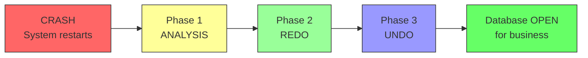

Each phase has a distinct purpose:

| Phase | Direction | Purpose |
|-------|-----------|---------|
| **Analysis** | Forward scan from checkpoint | Determine what needs to be redone and undone |
| **Redo** | Forward scan from oldest recLSN | Repeat history -- reapply ALL logged changes |
| **Undo** | Backward scan | Roll back all uncommitted transactions |

---

## Data Structures: DPT and ATT

ARIES relies on two critical in-memory data structures that are captured during
checkpoints and rebuilt during the analysis phase.

### Dirty Page Table (DPT)

The DPT tracks every page in the buffer pool that has been modified but not yet written
to disk. Each entry contains:

| Field | Description |
|-------|-------------|
| **pageID** | The identifier of the dirty page |
| **recLSN** | The LSN of the FIRST log record that made this page dirty since it was last flushed. This tells recovery the earliest point from which redo might be needed for this page. |

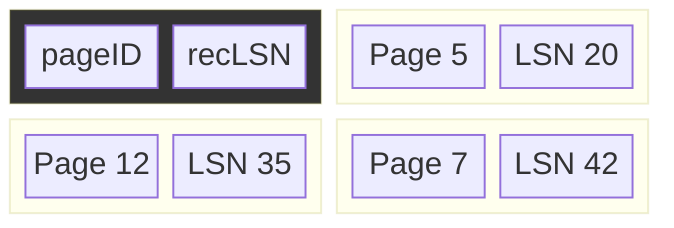

### Active Transaction Table (ATT)

The ATT tracks every transaction that was in progress (not yet committed or fully aborted)
at the time of the checkpoint. Each entry contains:

| Field | Description |
|-------|-------------|
| **transactionID** | The transaction's identifier |
| **status** | Running, Committing, or Aborting |
| **lastLSN** | The LSN of the most recent log record written by this transaction. Used as the starting point for undo. |

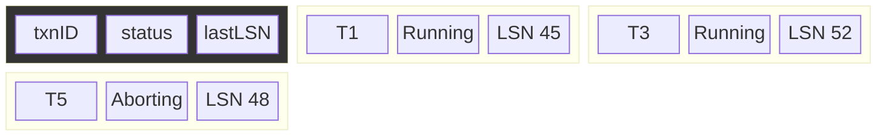

---

## Phase 1: Analysis

The analysis phase determines:
1. Which transactions were active at crash time (need undo)
2. Which pages might be dirty (need redo)
3. The starting LSN for the redo phase

### Algorithm

```
1. Read the last checkpoint record
2. Initialize ATT and DPT from the checkpoint
3. Scan the log FORWARD from the checkpoint to the end:
   For each log record:
     - BEGIN: Add transaction to ATT with status=Running
     - UPDATE/CLR:
         - If page not in DPT, add it with recLSN = current LSN
         - Update transaction's lastLSN in ATT
     - COMMIT:
         - Change transaction status to Committed in ATT
         - Remove transaction from ATT
     - ABORT:
         - Change transaction status to Aborting in ATT
     - END:
         - Remove transaction from ATT
4. At the end of the scan:
   - ATT contains all transactions that need to be undone
   - DPT contains all pages that might need redo
```

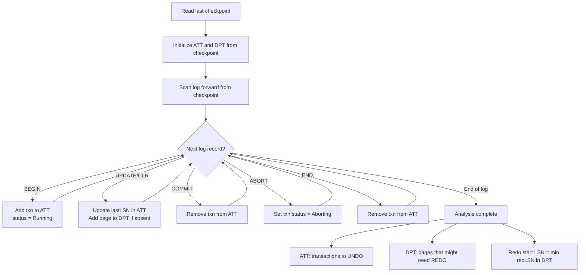

---

## Phase 2: Redo (Repeating History)

The redo phase **repeats history exactly** -- it reapplies every logged update, even those
from transactions that will be undone. Why? Because:

1. It restores the database to its exact pre-crash state
2. It allows undo to work correctly (undo needs the page in the state it was before crash)
3. It ensures CLRs from interrupted undo operations are re-applied

### Algorithm

```
1. Start scanning from the SMALLEST recLSN in the DPT
2. For each UPDATE or CLR record:
   a. If the page is NOT in the DPT, skip (page was already flushed)
   b. If the record's LSN < page's recLSN in DPT, skip
   c. Read the page from disk
   d. If the page's pageLSN >= record's LSN, skip (already applied)
   e. Otherwise, REDO: apply the after-image and set pageLSN = record's LSN
```

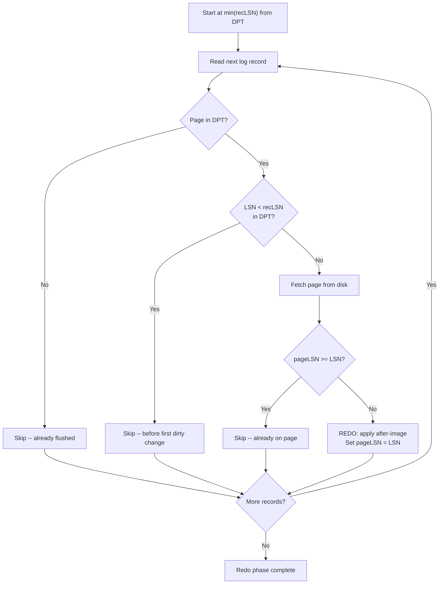

### Why Three Levels of Filtering?

The three checks (DPT membership, recLSN comparison, pageLSN comparison) form a
progressively more expensive filter:

1. **DPT check** -- pure in-memory, O(1) hash lookup
2. **recLSN check** -- pure in-memory comparison
3. **pageLSN check** -- requires reading the page from disk

This layered approach minimizes unnecessary disk I/O during recovery.

---

## Phase 3: Undo

The undo phase rolls back all transactions that were active at crash time (those remaining
in the ATT after analysis).

### Algorithm

```
1. Collect the lastLSN of every transaction in the ATT into a set called "ToUndo"
2. While ToUndo is not empty:
   a. Pick the LARGEST LSN from ToUndo (process in reverse chronological order)
   b. If it is a CLR:
      - If undoNextLSN is null, write END record for this transaction
      - Otherwise, add undoNextLSN to ToUndo
   c. If it is an UPDATE:
      - Undo the update: apply the before-image
      - Write a CLR with undoNextLSN = prevLSN of the update record
      - Add prevLSN of the update record to ToUndo
   d. Remove the current LSN from ToUndo
```

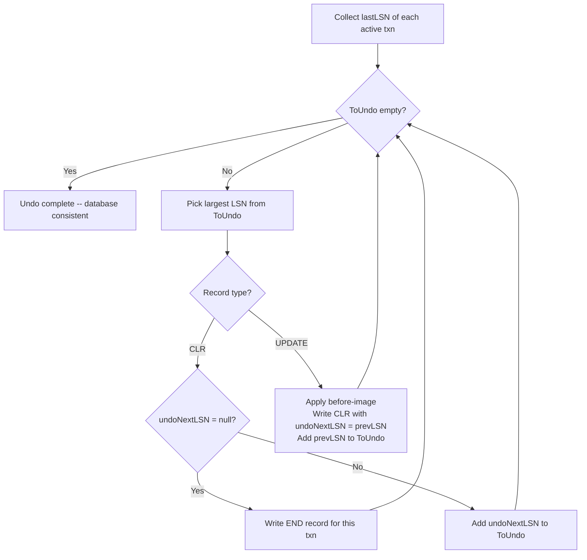

---

## Compensation Log Records (CLRs)

CLRs solve a subtle but critical problem: **what if the system crashes during recovery?**

Without CLRs, the undo phase might partially undo a transaction, crash again, and then
on the next recovery, undo the same operations again -- potentially corrupting data.

### CLR Structure

A CLR looks like a normal log record but has an extra field:

```
LSN=60 | prevLSN=55 | txn=T3 | CLR | page=12 | redo-info=[balance=500]
  undoNextLSN=30
```

The `undoNextLSN` field points to the next record that still needs to be undone. This
creates a "skip list" that ensures no undo action is ever performed twice.

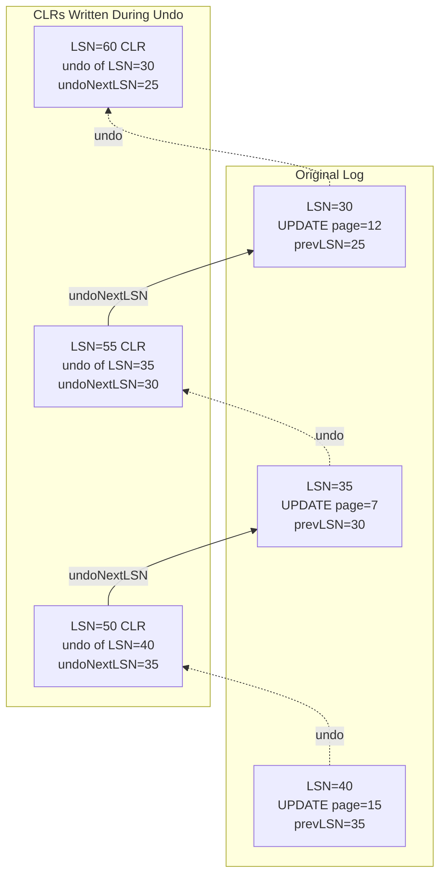

If the system crashes after writing CLR at LSN=55, the next recovery:
1. Redo phase: re-applies the CLRs at LSN=50 and LSN=55
2. Undo phase: finds the transaction's lastLSN = 55 (the CLR)
3. Follows undoNextLSN = 30, continues undo from there
4. Never re-undoes LSN=40 or LSN=35

---

## Nested Top Actions

Some operations (like B-tree structure modifications, index splits) should not be undone
even if the enclosing transaction aborts. These are **nested top actions**.

ARIES handles them by:
1. Logging the operation normally
2. At the end, writing a CLR whose `undoNextLSN` points to the record before the nested
   top action started
3. If the transaction aborts, the undo skips over the nested top action entirely

This is critical for B-tree concurrency -- a page split must persist even if the
inserting transaction rolls back (other transactions may have already used the new page).

---

## How PostgreSQL's WAL Works

PostgreSQL implements a variant of ARIES with some simplifications.

### Architecture

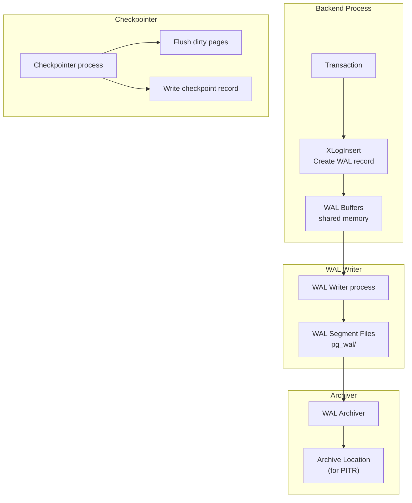

### Key Details

- **WAL segment size**: 16 MB by default (configurable at initdb time)
- **WAL record format**: Uses a resource manager (rmgr) system -- each subsystem (heap,
  btree, hash, etc.) registers its own record types and redo functions
- **Full-page writes (FPW)**: After each checkpoint, the first modification to a page
  logs the entire page image (a "full-page write" or "backup block"). This protects
  against torn pages (partial writes due to crash mid-write)
- **Timeline IDs**: PostgreSQL uses timeline IDs to track recovery branches, enabling
  Point-in-Time Recovery

### PostgreSQL WAL Record Structure

```
XLogRecord header:
  xl_tot_len:    total length of record
  xl_xid:        transaction ID
  xl_prev:       offset of previous record (like prevLSN)
  xl_info:       resource manager specific info
  xl_rmid:       resource manager ID
  xl_crc:        CRC32C checksum

Followed by:
  XLogRecordBlockHeader (per referenced block)
  XLogRecordDataHeader
  Block data / main data
```

### Recovery Process

PostgreSQL's recovery follows the ARIES pattern:
1. Read `pg_control` to find the last checkpoint
2. Read the checkpoint record to get the redo point (analogous to min recLSN)
3. Replay all WAL records from the redo point forward
4. Uncommitted transactions are handled via visibility checks (MVCC) rather than explicit
   undo -- this is a key simplification. PostgreSQL does NOT have an undo phase.

---

## How SQLite's Journal Works

SQLite offers two journaling modes that are fundamentally different.

### Rollback Journal Mode (Default)

Before modifying a page, SQLite copies the **original page** to a separate rollback
journal file. If a crash occurs, the original pages are copied back from the journal.

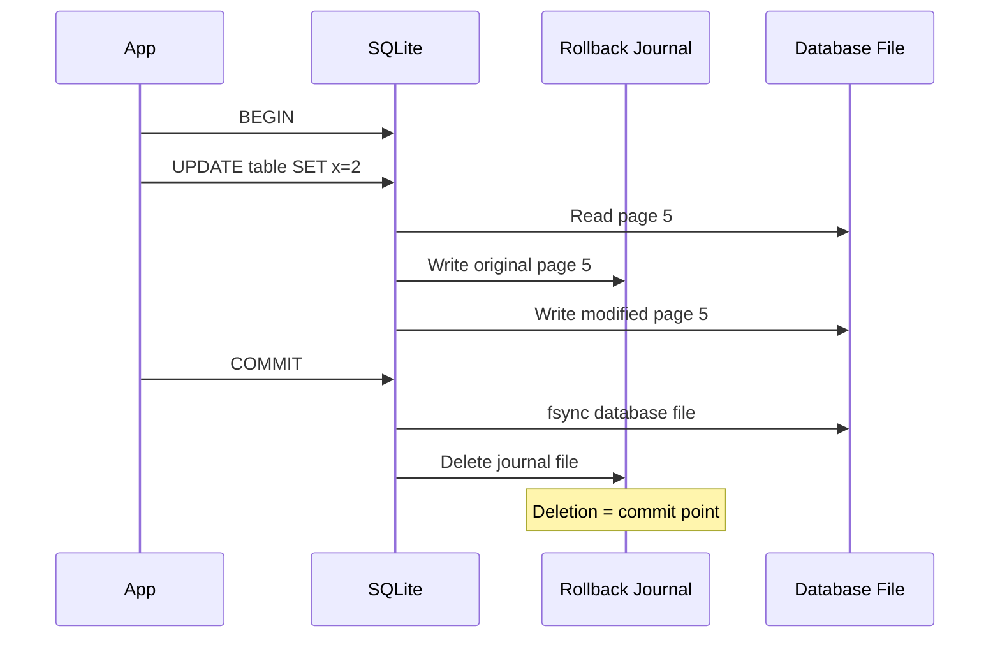

This is essentially an **undo-only** scheme with a **FORCE** policy.

### WAL Mode

SQLite's WAL mode is more like traditional WAL:
- Changes are appended to a separate WAL file
- Readers continue reading the original database file
- A checkpoint operation copies changes from WAL back to the database
- Enables concurrent readers with a single writer

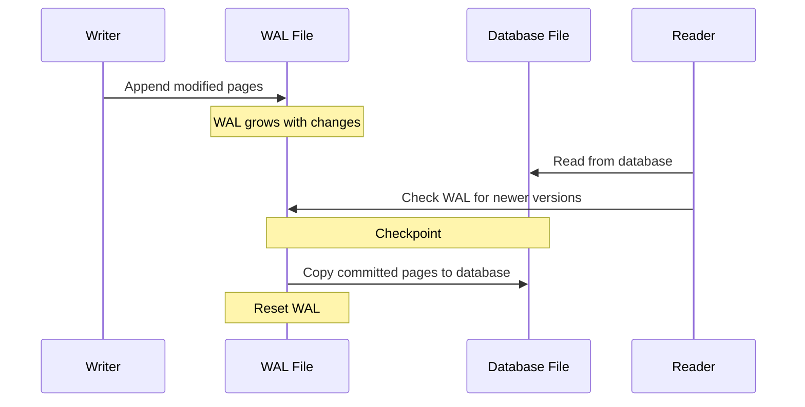

---

## Point-in-Time Recovery (PITR)

PITR allows recovering the database to any specific moment in time, not just the latest
consistent state. This is essential for recovering from logical errors (e.g., accidentally
dropping a table).

### How It Works

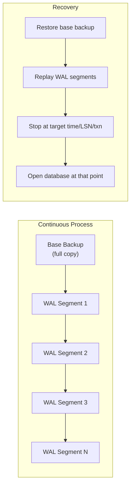

Requirements:
1. A **base backup** (full filesystem copy of the database)
2. All **WAL segments** from the base backup onward
3. A **recovery target** (timestamp, LSN, or transaction ID)

---

## Logical vs Physical vs Physiological Logging

### Physical Logging

Logs the exact bytes changed on the page:

```
page=5, offset=120, before=[0x00 0x03 0xE8], after=[0x00 0x03 0x20]
```

- Pro: Simple redo/undo -- just copy bytes
- Con: Verbose, especially for operations that affect many bytes

### Logical Logging

Logs the operation itself:

```
INSERT INTO accounts VALUES (42, 'Alice', 1000)
```

- Pro: Compact
- Con: Redo may not be deterministic (e.g., where does the row go on the page?)
- Con: Requires the same schema and indexes to replay

### Physiological Logging (What ARIES Uses)

A hybrid approach:
- **Redo is physical** at the page level: "on page 5, at offset 120, write these bytes"
- **Undo is logical** at the operation level: "delete the tuple that was inserted"

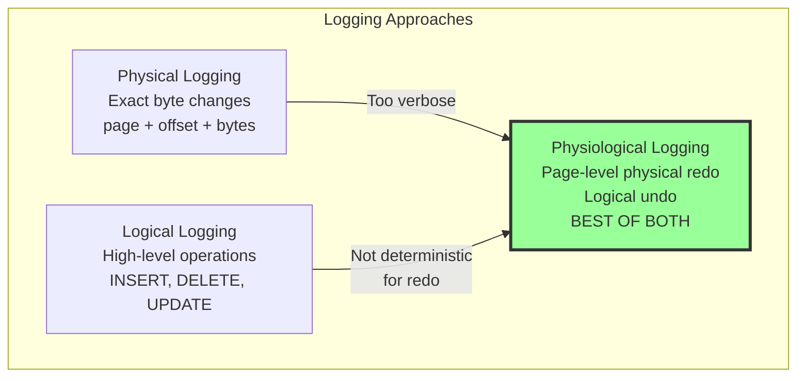

Why physiological?
- **Physical redo** is simple and deterministic (no need to re-execute queries)
- **Logical undo** handles structural changes (e.g., a page split during redo changed
  where a tuple lives, so physical undo would write to the wrong location)

---

## Worked Example: Full ARIES Recovery

Consider this log at crash time:

```
LSN  | Record
-----|------------------------------------------
10   | BEGIN T1
20   | BEGIN T2
30   | T1: UPDATE page=5, A=500->400
40   | T2: UPDATE page=3, B=200->300
50   | CHECKPOINT (ATT: {T1:30, T2:40}, DPT: {page5:30, page3:40})
60   | T2: UPDATE page=5, C=100->150
70   | T1: UPDATE page=8, D=900->850
80   | T2: COMMIT
90   | BEGIN T3
100  | T3: UPDATE page=3, E=300->350
110  | T1: UPDATE page=5, F=400->380
     | *** CRASH ***
```

### Analysis Phase (scan from checkpoint at LSN 50)

Starting ATT: {T1: lastLSN=30, T2: lastLSN=40}
Starting DPT: {page5: recLSN=30, page3: recLSN=40}

| Scan LSN | Action |
|----------|--------|
| 60 | T2 UPDATE page=5 -> ATT: T2.lastLSN=60. Page 5 already in DPT. |
| 70 | T1 UPDATE page=8 -> ATT: T1.lastLSN=70. Add page8 to DPT with recLSN=70. |
| 80 | T2 COMMIT -> Remove T2 from ATT. |
| 90 | BEGIN T3 -> Add T3 to ATT with status=Running. |
| 100 | T3 UPDATE page=3 -> ATT: T3.lastLSN=100. Page 3 already in DPT. |
| 110 | T1 UPDATE page=5 -> ATT: T1.lastLSN=110. Page 5 already in DPT. |

**Result:**
- ATT = {T1: lastLSN=110, T3: lastLSN=100} -- these need UNDO
- DPT = {page5: recLSN=30, page3: recLSN=40, page8: recLSN=70}
- Redo starts at min(recLSN) = **LSN 30**

### Redo Phase (scan from LSN 30 to end)

Redo each UPDATE/CLR, checking pageLSN to skip already-applied changes.

### Undo Phase

ToUndo = {110, 100} (lastLSNs of T1 and T3)

| Step | Process LSN | Action |
|------|-------------|--------|
| 1 | 110 (T1 UPDATE) | Undo: F=380->400. Write CLR(undoNextLSN=70). Add 70 to ToUndo. |
| 2 | 100 (T3 UPDATE) | Undo: E=350->300. Write CLR(undoNextLSN=nil). Write END T3. |
| 3 | 70 (T1 UPDATE) | Undo: D=850->900. Write CLR(undoNextLSN=30). Add 30 to ToUndo. |
| 4 | 30 (T1 UPDATE) | Undo: A=400->500. Write CLR(undoNextLSN=nil). Write END T1. |

Database is now consistent. T2's committed changes are preserved. T1 and T3 are rolled back.

---

## Summary

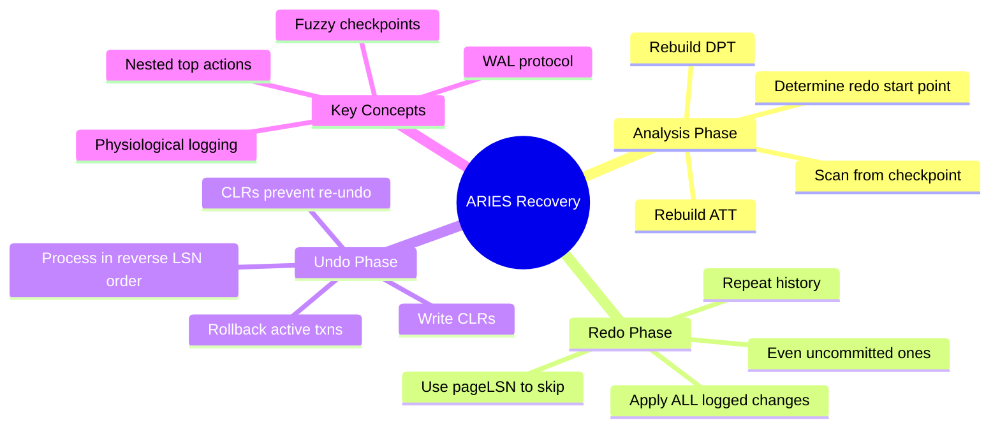
