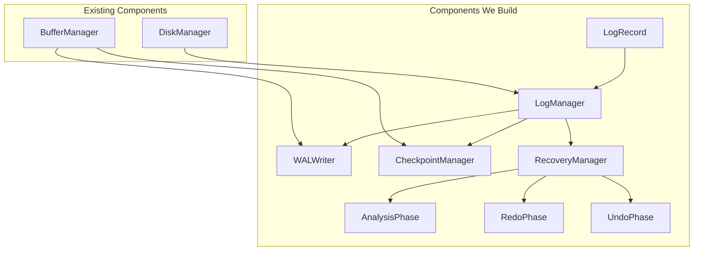
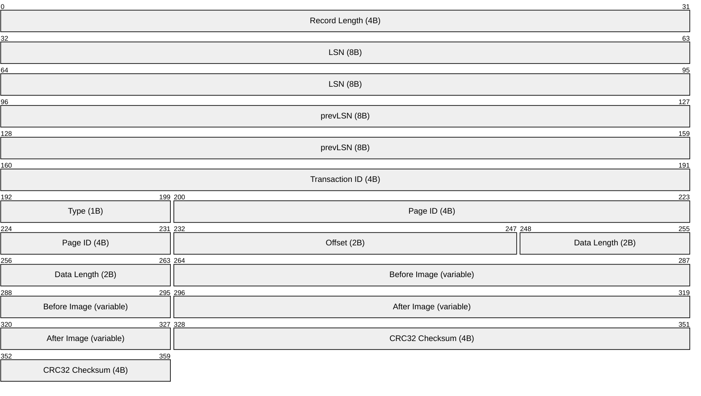
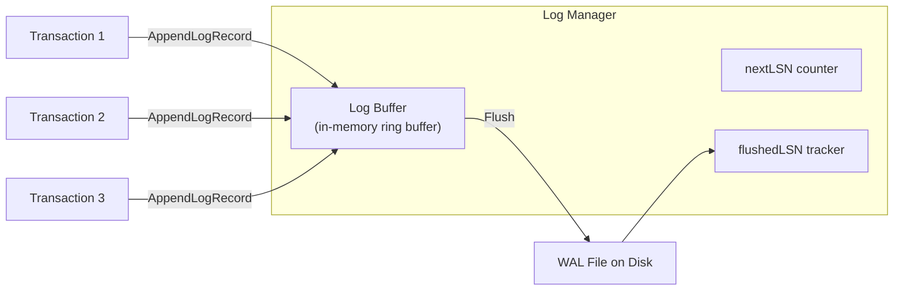
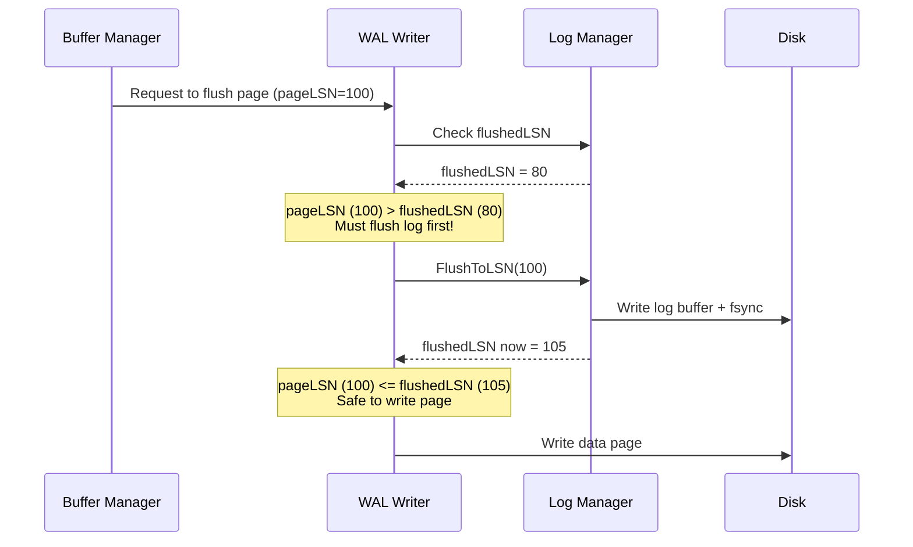
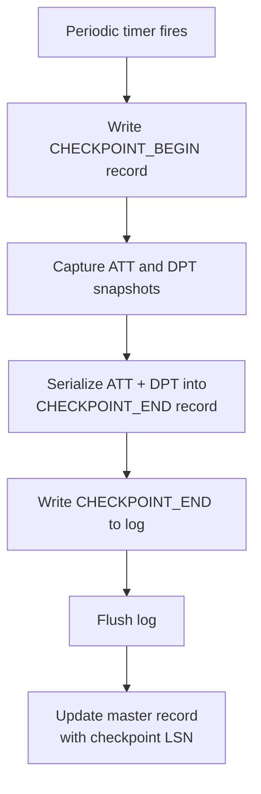
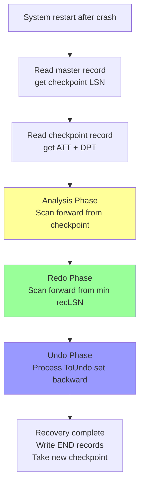
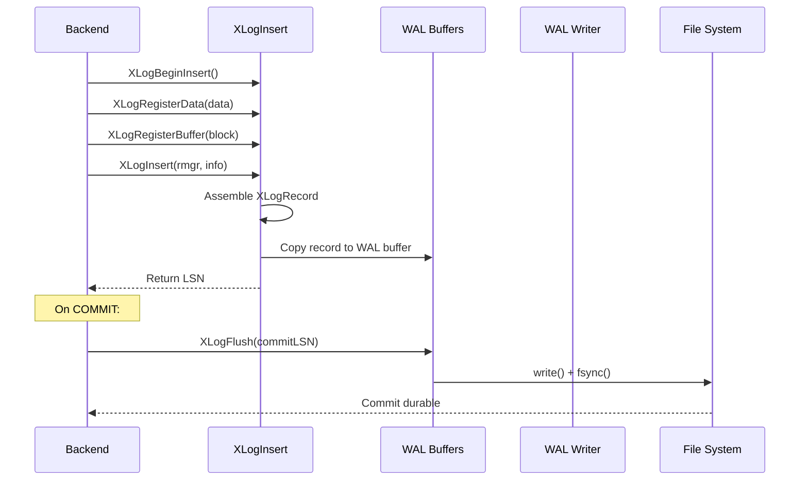
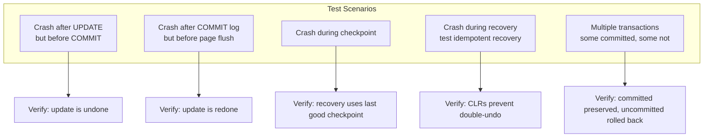
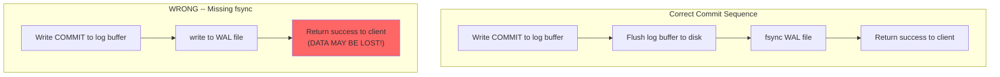

# Module 7: Implementation -- Building a WAL and Recovery Manager

## Overview

This module walks through implementing a Write-Ahead Log and ARIES-based recovery
manager from scratch. We will build:

1. **Log Record** -- the serialization format
2. **Log Manager** -- append records, flush to disk
3. **WAL Writer** -- enforce the WAL protocol
4. **Checkpoint Manager** -- periodic fuzzy checkpoints
5. **Recovery Manager** -- the three ARIES phases



---

## Part 1: Log Record Format

### On-Disk Serialization

Each log record is serialized as a variable-length byte sequence. We use a simple
format with a fixed header and variable-length payload.

```
+--------+--------+--------+--------+--------+--------+--------+--------+
| RecLen |  LSN   |prevLSN | TxnID  | Type   |PageID  |Offset  |DataLen |
| 4 bytes| 8 bytes| 8 bytes| 4 bytes| 1 byte | 4 bytes| 2 bytes| 2 bytes|
+--------+--------+--------+--------+--------+--------+--------+--------+
|           Before Image (DataLen bytes)                                 |
+--------+--------+--------+--------+--------+--------+--------+--------+
|           After Image (DataLen bytes)                                  |
+--------+--------+--------+--------+--------+--------+--------+--------+
| CRC32  |
| 4 bytes|
+--------+
```



### Code: Log Record Definition

```go
package wal

import (
    "encoding/binary"
    "hash/crc32"
)

type LogRecordType uint8

const (
    LogBegin          LogRecordType = 0
    LogUpdate         LogRecordType = 1
    LogCommit         LogRecordType = 2
    LogAbort          LogRecordType = 3
    LogCLR            LogRecordType = 4
    LogCheckpointBegin LogRecordType = 5
    LogCheckpointEnd  LogRecordType = 6
    LogEnd            LogRecordType = 7
)

type LSN uint64

type LogRecord struct {
    LSN           LSN
    PrevLSN       LSN
    TxnID         uint32
    Type          LogRecordType
    PageID        uint32
    Offset        uint16
    BeforeImage   []byte
    AfterImage    []byte
    // CLR-specific
    UndoNextLSN   LSN
}

const HeaderSize = 8 + 8 + 4 + 1 + 4 + 2 + 2 // 29 bytes

// Serialize writes the log record to a byte slice
func (r *LogRecord) Serialize() []byte {
    dataLen := uint16(len(r.BeforeImage))
    totalLen := uint32(HeaderSize + 2*int(dataLen) + 4) // +4 for CRC

    buf := make([]byte, totalLen+4) // +4 for the length prefix

    // Record length prefix (does not include itself)
    binary.LittleEndian.PutUint32(buf[0:4], totalLen)

    offset := 4
    binary.LittleEndian.PutUint64(buf[offset:], uint64(r.LSN))
    offset += 8
    binary.LittleEndian.PutUint64(buf[offset:], uint64(r.PrevLSN))
    offset += 8
    binary.LittleEndian.PutUint32(buf[offset:], r.TxnID)
    offset += 4
    buf[offset] = byte(r.Type)
    offset += 1
    binary.LittleEndian.PutUint32(buf[offset:], r.PageID)
    offset += 4
    binary.LittleEndian.PutUint16(buf[offset:], r.Offset)
    offset += 2
    binary.LittleEndian.PutUint16(buf[offset:], dataLen)
    offset += 2

    copy(buf[offset:], r.BeforeImage)
    offset += int(dataLen)
    copy(buf[offset:], r.AfterImage)
    offset += int(dataLen)

    // CRC32 over everything after the length prefix
    crc := crc32.ChecksumIEEE(buf[4:offset])
    binary.LittleEndian.PutUint32(buf[offset:], crc)

    return buf
}

// Deserialize reads a log record from a byte slice
func Deserialize(data []byte) (*LogRecord, error) {
    r := &LogRecord{}
    offset := 0

    r.LSN = LSN(binary.LittleEndian.Uint64(data[offset:]))
    offset += 8
    r.PrevLSN = LSN(binary.LittleEndian.Uint64(data[offset:]))
    offset += 8
    r.TxnID = binary.LittleEndian.Uint32(data[offset:])
    offset += 4
    r.Type = LogRecordType(data[offset])
    offset += 1
    r.PageID = binary.LittleEndian.Uint32(data[offset:])
    offset += 4
    r.Offset = binary.LittleEndian.Uint16(data[offset:])
    offset += 2
    dataLen := int(binary.LittleEndian.Uint16(data[offset:]))
    offset += 2

    r.BeforeImage = make([]byte, dataLen)
    copy(r.BeforeImage, data[offset:offset+dataLen])
    offset += dataLen

    r.AfterImage = make([]byte, dataLen)
    copy(r.AfterImage, data[offset:offset+dataLen])
    offset += dataLen

    // Verify CRC
    expectedCRC := crc32.ChecksumIEEE(data[:offset])
    actualCRC := binary.LittleEndian.Uint32(data[offset:])
    if expectedCRC != actualCRC {
        return nil, fmt.Errorf("CRC mismatch: expected %x, got %x", expectedCRC, actualCRC)
    }

    return r, nil
}
```

---

## Part 2: Log Manager

The Log Manager is responsible for:
- Assigning LSNs to new log records
- Appending records to the log buffer
- Flushing the log buffer to disk
- Tracking the `flushedLSN`



### Code: Log Manager

```go
package wal

import (
    "os"
    "sync"
)

type LogManager struct {
    mu         sync.Mutex
    logFile    *os.File
    logBuffer  []byte
    bufferPos  int
    nextLSN    LSN
    flushedLSN LSN

    // Per-transaction tracking: txnID -> lastLSN
    txnLastLSN map[uint32]LSN
}

const LogBufferSize = 64 * 1024 // 64 KB log buffer

func NewLogManager(path string) (*LogManager, error) {
    f, err := os.OpenFile(path, os.O_CREATE|os.O_RDWR|os.O_APPEND, 0644)
    if err != nil {
        return nil, err
    }

    // Determine next LSN from file size
    info, _ := f.Stat()
    startLSN := LSN(info.Size())

    return &LogManager{
        logFile:    f,
        logBuffer:  make([]byte, LogBufferSize),
        nextLSN:    startLSN,
        flushedLSN: startLSN,
        txnLastLSN: make(map[uint32]LSN),
    }, nil
}

// AppendLogRecord adds a record to the log buffer and returns its LSN.
// The record is NOT yet durable -- call Flush() to force it to disk.
func (lm *LogManager) AppendLogRecord(rec *LogRecord) LSN {
    lm.mu.Lock()
    defer lm.mu.Unlock()

    // Assign LSN (byte offset in the log file)
    rec.LSN = lm.nextLSN

    // Set prevLSN from per-transaction chain
    if prev, ok := lm.txnLastLSN[rec.TxnID]; ok {
        rec.PrevLSN = prev
    }
    lm.txnLastLSN[rec.TxnID] = rec.LSN

    data := rec.Serialize()

    // If buffer is full, flush first
    if lm.bufferPos+len(data) > LogBufferSize {
        lm.flushLocked()
    }

    copy(lm.logBuffer[lm.bufferPos:], data)
    lm.bufferPos += len(data)
    lm.nextLSN += LSN(len(data))

    return rec.LSN
}

// Flush writes the log buffer to disk and calls fsync.
func (lm *LogManager) Flush() {
    lm.mu.Lock()
    defer lm.mu.Unlock()
    lm.flushLocked()
}

func (lm *LogManager) flushLocked() {
    if lm.bufferPos == 0 {
        return
    }
    lm.logFile.Write(lm.logBuffer[:lm.bufferPos])
    lm.logFile.Sync() // fsync -- critical for durability!
    lm.flushedLSN = lm.nextLSN
    lm.bufferPos = 0
}

// FlushToLSN flushes the log up to the given LSN (inclusive).
func (lm *LogManager) FlushToLSN(lsn LSN) {
    lm.mu.Lock()
    if lsn >= lm.flushedLSN {
        lm.flushLocked()
    }
    lm.mu.Unlock()
}

// FlushedLSN returns the highest LSN that has been flushed to disk.
func (lm *LogManager) FlushedLSN() LSN {
    lm.mu.Lock()
    defer lm.mu.Unlock()
    return lm.flushedLSN
}
```

---

## Part 3: WAL Writer -- Enforcing the Protocol

The WAL Writer sits between the Buffer Manager and the Disk Manager. Before any dirty
page is written to disk, the WAL Writer ensures the WAL protocol is satisfied.



### Code: WAL Writer

```go
// WALWriter enforces the WAL protocol before page writes.
type WALWriter struct {
    logManager *LogManager
}

func NewWALWriter(lm *LogManager) *WALWriter {
    return &WALWriter{logManager: lm}
}

// EnsureLogFlushed guarantees that the log is flushed up to the given pageLSN
// before the page can be safely written to disk.
func (w *WALWriter) EnsureLogFlushed(pageLSN LSN) {
    if pageLSN > w.logManager.FlushedLSN() {
        w.logManager.FlushToLSN(pageLSN)
    }
}

// BeforePageWrite must be called before writing any dirty page to disk.
// It enforces the fundamental WAL rule: log before data.
func (w *WALWriter) BeforePageWrite(pageID uint32, pageLSN LSN) error {
    w.EnsureLogFlushed(pageLSN)
    return nil
}
```

---

## Part 4: Checkpoint Manager

The Checkpoint Manager periodically creates fuzzy checkpoints by capturing the current
ATT and DPT.



### Code: Checkpoint Manager

```go
type DirtyPageEntry struct {
    PageID uint32
    RecLSN LSN
}

type ActiveTxnEntry struct {
    TxnID   uint32
    Status  uint8 // 0=Running, 1=Committing, 2=Aborting
    LastLSN LSN
}

type CheckpointManager struct {
    logManager   *LogManager
    bufferManager *BufferManager // interface to get dirty pages
    txnManager    *TransactionManager // interface to get active txns
}

func (cm *CheckpointManager) CreateCheckpoint() error {
    // Step 1: Write CHECKPOINT_BEGIN
    beginRec := &LogRecord{
        Type: LogCheckpointBegin,
    }
    beginLSN := cm.logManager.AppendLogRecord(beginRec)

    // Step 2: Capture ATT and DPT (no locking needed for fuzzy checkpoint,
    // but we do need a consistent snapshot)
    dpt := cm.bufferManager.GetDirtyPageTable()
    att := cm.txnManager.GetActiveTransactions()

    // Step 3: Serialize ATT + DPT into CHECKPOINT_END record
    endRec := &LogRecord{
        Type:        LogCheckpointEnd,
        BeforeImage: serializeDPT(dpt),     // reuse before-image field
        AfterImage:  serializeATT(att),      // reuse after-image field
    }
    cm.logManager.AppendLogRecord(endRec)

    // Step 4: Flush log to make checkpoint durable
    cm.logManager.Flush()

    // Step 5: Update master record with the begin LSN
    cm.updateMasterRecord(beginLSN)

    return nil
}

func (cm *CheckpointManager) updateMasterRecord(checkpointLSN LSN) {
    // The master record is a small file that stores the LSN of the
    // last successful checkpoint. It is written atomically.
    f, _ := os.Create("master_record.dat")
    binary.Write(f, binary.LittleEndian, uint64(checkpointLSN))
    f.Sync()
    f.Close()
}
```

---

## Part 5: Recovery Manager -- ARIES Implementation

The Recovery Manager implements the three ARIES phases. This is the core of crash
recovery.



### Code: Recovery Manager

```go
type RecoveryManager struct {
    logManager    *LogManager
    bufferManager *BufferManager
    diskManager   *DiskManager
}

// Recover runs the three ARIES phases.
func (rm *RecoveryManager) Recover() error {
    // Read master record to find last checkpoint
    checkpointLSN := rm.readMasterRecord()

    // Read the checkpoint to initialize ATT and DPT
    att, dpt := rm.readCheckpoint(checkpointLSN)

    // Phase 1: Analysis
    att, dpt = rm.analysisPhase(checkpointLSN, att, dpt)

    // Phase 2: Redo
    rm.redoPhase(dpt)

    // Phase 3: Undo
    rm.undoPhase(att)

    return nil
}
```

### Analysis Phase Implementation

```go
func (rm *RecoveryManager) analysisPhase(
    checkpointLSN LSN,
    att map[uint32]*ActiveTxnEntry,
    dpt map[uint32]*DirtyPageEntry,
) (map[uint32]*ActiveTxnEntry, map[uint32]*DirtyPageEntry) {

    scanner := rm.logManager.NewForwardScanner(checkpointLSN)

    for scanner.HasNext() {
        rec := scanner.Next()

        switch rec.Type {
        case LogBegin:
            att[rec.TxnID] = &ActiveTxnEntry{
                TxnID:   rec.TxnID,
                Status:  0, // Running
                LastLSN: rec.LSN,
            }

        case LogUpdate, LogCLR:
            // Update ATT
            if entry, ok := att[rec.TxnID]; ok {
                entry.LastLSN = rec.LSN
            }
            // Update DPT -- add page if not present
            if _, ok := dpt[rec.PageID]; !ok {
                dpt[rec.PageID] = &DirtyPageEntry{
                    PageID: rec.PageID,
                    RecLSN: rec.LSN,
                }
            }

        case LogCommit:
            delete(att, rec.TxnID)

        case LogAbort:
            if entry, ok := att[rec.TxnID]; ok {
                entry.Status = 2 // Aborting
            }

        case LogEnd:
            delete(att, rec.TxnID)
        }
    }

    return att, dpt
}
```

### Redo Phase Implementation

```go
func (rm *RecoveryManager) redoPhase(dpt map[uint32]*DirtyPageEntry) {
    // Find the smallest recLSN in the DPT
    minRecLSN := LSN(^uint64(0)) // max value
    for _, entry := range dpt {
        if entry.RecLSN < minRecLSN {
            minRecLSN = entry.RecLSN
        }
    }

    if minRecLSN == LSN(^uint64(0)) {
        return // Nothing to redo
    }

    scanner := rm.logManager.NewForwardScanner(minRecLSN)

    for scanner.HasNext() {
        rec := scanner.Next()

        if rec.Type != LogUpdate && rec.Type != LogCLR {
            continue
        }

        // Check 1: Is the page in the DPT?
        dptEntry, inDPT := dpt[rec.PageID]
        if !inDPT {
            continue
        }

        // Check 2: Is the record's LSN < recLSN in DPT?
        if rec.LSN < dptEntry.RecLSN {
            continue
        }

        // Check 3: Read the page and check pageLSN
        page := rm.diskManager.ReadPage(rec.PageID)
        pageLSN := page.GetLSN()

        if pageLSN >= rec.LSN {
            continue // Already applied
        }

        // REDO: Apply the after-image
        page.WriteAt(rec.Offset, rec.AfterImage)
        page.SetLSN(rec.LSN)
        rm.diskManager.WritePage(rec.PageID, page)
    }
}
```

### Undo Phase Implementation

```go
func (rm *RecoveryManager) undoPhase(att map[uint32]*ActiveTxnEntry) {
    // Collect all lastLSNs into a max-heap (process largest first)
    toUndo := NewMaxHeap()
    for txnID, entry := range att {
        toUndo.Push(entry.LastLSN, txnID)
    }

    for !toUndo.IsEmpty() {
        lsn, txnID := toUndo.Pop()
        rec := rm.logManager.ReadRecord(lsn)

        switch rec.Type {
        case LogCLR:
            if rec.UndoNextLSN == 0 {
                // Transaction fully undone
                endRec := &LogRecord{
                    TxnID: txnID,
                    Type:  LogEnd,
                }
                rm.logManager.AppendLogRecord(endRec)
            } else {
                toUndo.Push(rec.UndoNextLSN, txnID)
            }

        case LogUpdate:
            // Undo: apply the before-image
            page := rm.diskManager.ReadPage(rec.PageID)
            page.WriteAt(rec.Offset, rec.BeforeImage)

            // Write a CLR
            clr := &LogRecord{
                TxnID:       txnID,
                Type:        LogCLR,
                PageID:      rec.PageID,
                Offset:      rec.Offset,
                AfterImage:  rec.BeforeImage, // CLR's redo = original's undo
                UndoNextLSN: rec.PrevLSN,
            }
            clrLSN := rm.logManager.AppendLogRecord(clr)

            page.SetLSN(clrLSN)
            rm.diskManager.WritePage(rec.PageID, page)

            // Continue undo chain
            if rec.PrevLSN != 0 {
                toUndo.Push(rec.PrevLSN, txnID)
            } else {
                // Beginning of transaction reached
                endRec := &LogRecord{
                    TxnID: txnID,
                    Type:  LogEnd,
                }
                rm.logManager.AppendLogRecord(endRec)
            }
        }
    }

    rm.logManager.Flush()
}
```

---

## Part 6: Key PostgreSQL Source Files

If you want to study a production WAL implementation, PostgreSQL's source code is
well-documented.

| File | Purpose |
|------|---------|
| `src/backend/access/transam/xlog.c` | Core WAL logic: insert, flush, checkpoint, recovery |
| `src/backend/access/transam/xloginsert.c` | WAL record construction and insertion |
| `src/backend/access/transam/xlogrecovery.c` | Recovery (redo) logic |
| `src/backend/access/transam/xlogarchive.c` | WAL archiving for PITR |
| `src/include/access/xlogrecord.h` | WAL record format definitions |
| `src/include/access/xlog_internal.h` | Internal WAL constants and structures |
| `src/backend/storage/buffer/bufmgr.c` | Buffer manager -- enforces WAL protocol before page writes |

### PostgreSQL WAL Insert Flow



---

## Testing Your Implementation

### Crash Simulation Strategy



### Test Template

```go
func TestCrashAfterCommitBeforeFlush(t *testing.T) {
    // Setup
    db := NewDatabase("test.db")
    lm := db.LogManager()

    // Execute a transaction
    txn := db.BeginTransaction()
    txn.Update(pageID, offset, oldVal, newVal)
    txn.Commit() // Writes COMMIT to log and flushes log

    // Simulate crash: dirty page NOT flushed to disk
    // (do not call bufferManager.FlushAllPages())

    // Simulate restart
    db.Close()
    db = OpenDatabase("test.db")

    // Recovery should redo the committed update
    page := db.ReadPage(pageID)
    value := page.ReadAt(offset)
    assert.Equal(t, newVal, value, "committed update should survive crash")
}
```

---

## Common Implementation Pitfalls

1. **Forgetting to fsync the log before acknowledging commit**: Without `fsync()`, the OS
   may buffer the write. A power failure loses the "committed" data.

2. **Not checking pageLSN during redo**: Without this check, redo is not idempotent and
   may apply the same update twice, corrupting data.

3. **Incorrect CRC handling**: Always compute CRC over the entire record excluding the
   CRC field itself. A CRC mismatch during recovery indicates a torn write.

4. **Not writing CLRs during undo**: Without CLRs, a crash during recovery causes the
   same undo to be attempted again, potentially corrupting data.

5. **Holding locks during log flush**: The log flush involves `fsync()`, which can take
   milliseconds. Never hold the log buffer lock during the actual disk write. Use a
   flush-in-progress flag instead.

6. **Log buffer overflow**: When the log buffer fills up before being flushed, you must
   either block the caller or flush synchronously. Never silently drop log records.



---

## Summary

Building a WAL and recovery manager requires careful attention to:

1. **Serialization**: Log records must be self-describing and include CRCs
2. **Ordering**: LSNs must be monotonically increasing and correspond to physical offsets
3. **Flushing**: The log MUST be flushed (with fsync) before data pages
4. **Idempotency**: Redo must be idempotent (pageLSN check)
5. **CLRs**: Undo must write CLRs to prevent repeated work
6. **Checkpoints**: Fuzzy checkpoints bound recovery time without stopping the world

The complete implementation in this module gives you a working ARIES recovery system
suitable for a teaching database engine.
