# Module 7: Project -- Add WAL and Crash Recovery to Your Storage Engine

## Project Overview

In this project, you will add Write-Ahead Logging and ARIES-based crash recovery to the
storage engine you have been building throughout the course. By the end, your database
will survive crashes at any point during operation and recover to a consistent state.

### What You Will Build

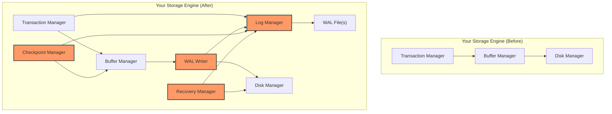

### Learning Objectives

- Implement a log manager with durable log records
- Enforce the WAL protocol (log before data)
- Support STEAL/NO-FORCE buffer management
- Implement fuzzy checkpointing
- Implement full ARIES recovery (Analysis, Redo, Undo)
- Test recovery by simulating crashes at every critical point

---

## Part 1: Log Manager (Estimated: 3-4 hours)

### 1.1 Log Record Structure

Define your log record types and serialization format.

**Requirements:**
- Support these record types: `BEGIN`, `UPDATE`, `COMMIT`, `ABORT`, `CLR`,
  `CHECKPOINT_BEGIN`, `CHECKPOINT_END`, `END`
- Each record must include: LSN, prevLSN, transactionID, type
- UPDATE records must include: pageID, offset, beforeImage, afterImage
- CLR records must include: pageID, offset, redoInfo, undoNextLSN
- Add a CRC32 checksum for integrity verification
- Record length must be stored to enable forward/backward scanning

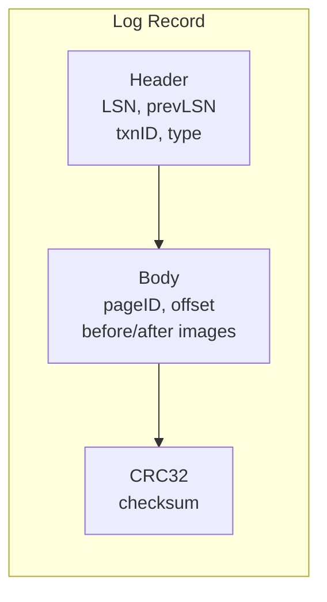

**Test:**
```
- Serialize a log record to bytes
- Deserialize it back
- Verify all fields match
- Corrupt one byte and verify CRC check fails
```

### 1.2 Log Buffer and Flush

Implement the in-memory log buffer and disk flushing.

**Requirements:**
- In-memory log buffer (e.g., 64KB)
- `AppendLogRecord(record)` -- adds a record to the buffer, returns LSN
- `Flush()` -- writes buffer to WAL file and calls `fsync()`
- `FlushToLSN(lsn)` -- flushes only if needed (lsn > flushedLSN)
- Thread-safe (multiple transactions append concurrently)
- Automatic flush when buffer is full
- Track `nextLSN` and `flushedLSN`

**Key design decision:** LSN assignment. The simplest approach is to use the byte offset
in the WAL file as the LSN. This gives you O(1) lookup of any record by seeking to the
byte offset.

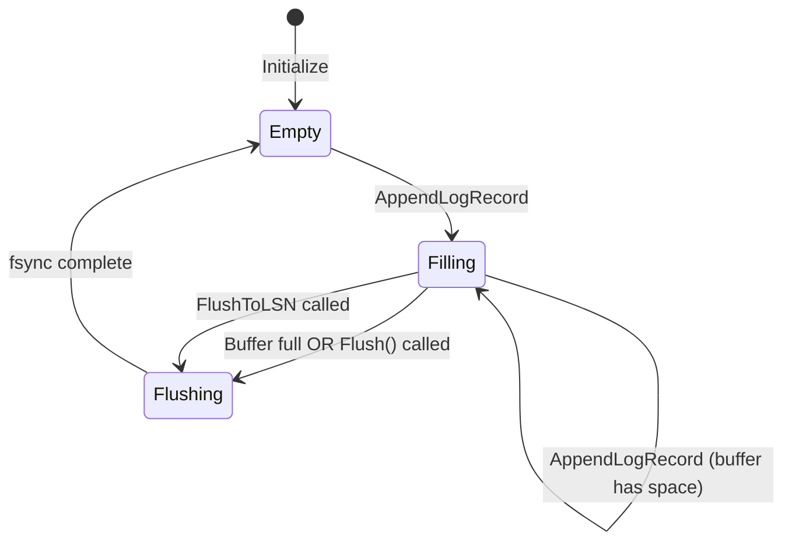

**Test:**
```
- Append 100 records, flush, read them back from the file
- Verify LSNs are monotonically increasing
- Verify flushedLSN updates correctly
- Concurrent test: 4 threads each appending 1000 records
```

### 1.3 Log Scanner

Implement forward and backward scanning of the log file.

**Requirements:**
- `NewForwardScanner(startLSN)` -- returns an iterator that reads records forward
- `NewBackwardScanner(startLSN)` -- returns an iterator that reads records backward
- `ReadRecord(lsn)` -- reads a single record at the given LSN
- Handle reaching end of file gracefully
- Verify CRC on each record read

**Test:**
```
- Write 50 records, scan forward, verify you get all 50 in order
- Scan backward from the last record, verify reverse order
- ReadRecord on a specific LSN, verify correct record returned
```

---

## Part 2: WAL Protocol Enforcement (Estimated: 2-3 hours)

### 2.1 Integrate WAL with Buffer Manager

Modify your buffer manager to enforce the WAL protocol.

**Requirements:**
- Every page must have a `pageLSN` field in its header
- Before writing a dirty page to disk: `assert(pageLSN <= flushedLSN)`
- If the assertion would fail, flush the log first
- When a page is modified, update its `pageLSN`

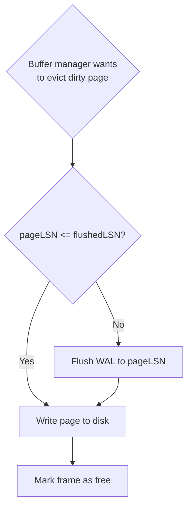

### 2.2 Integrate WAL with Transaction Manager

Modify your transaction manager to write log records.

**Requirements:**
- `BEGIN`: write a BEGIN log record
- Every page modification: write an UPDATE log record with before/after images
- `COMMIT`: write a COMMIT log record, then `FlushToLSN(commitLSN)` -- this is the
  commit point and MUST complete before acknowledging the commit
- `ABORT`: write an ABORT log record, then call the undo logic
- Track per-transaction prevLSN chain

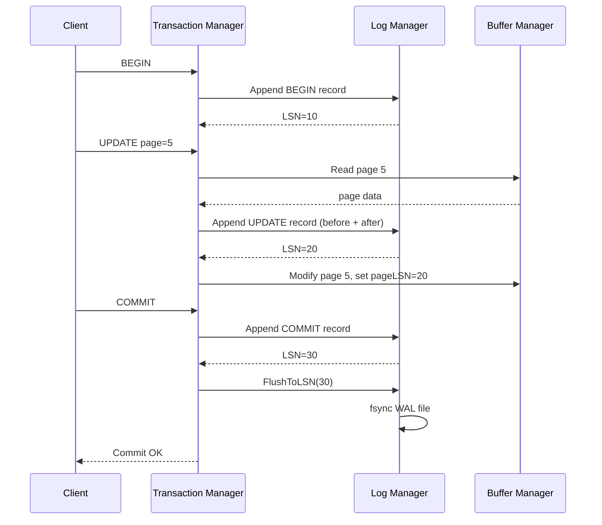

### 2.3 Support STEAL/NO-FORCE

Ensure your buffer manager supports the STEAL/NO-FORCE policy.

**STEAL support:**
- The buffer manager can evict dirty pages from uncommitted transactions
- Before evicting: enforce WAL protocol (flush log first)

**NO-FORCE support:**
- At commit time, do NOT flush dirty pages to disk
- Only flush the log (COMMIT record)
- Dirty pages are flushed later by the background writer or checkpointer

**Test:**
```
- Transaction T1 modifies pages A and B
- Force buffer manager to evict page A (STEAL)
- Verify log was flushed before the page write
- T1 commits
- Verify page B is NOT immediately written to disk (NO-FORCE)
- Simulate crash after commit
- Verify recovery restores both pages correctly
```

---

## Part 3: Fuzzy Checkpointing (Estimated: 2 hours)

### 3.1 Dirty Page Table

Maintain a DPT in the buffer manager.

**Requirements:**
- Track every dirty page and its `recLSN` (the LSN of the FIRST modification since
  last flush)
- When a clean page is first modified, add it to DPT with recLSN = current LSN
- When a dirty page is flushed to disk, remove it from DPT
- `GetDirtyPageTable()` returns a snapshot of the DPT

### 3.2 Active Transaction Table

Maintain an ATT in the transaction manager.

**Requirements:**
- Track every active transaction: txnID, status (Running/Committing/Aborting), lastLSN
- Add entry on BEGIN, update lastLSN on every log record, remove on END
- `GetActiveTransactions()` returns a snapshot of the ATT

### 3.3 Checkpoint Writer

Implement the fuzzy checkpoint procedure.

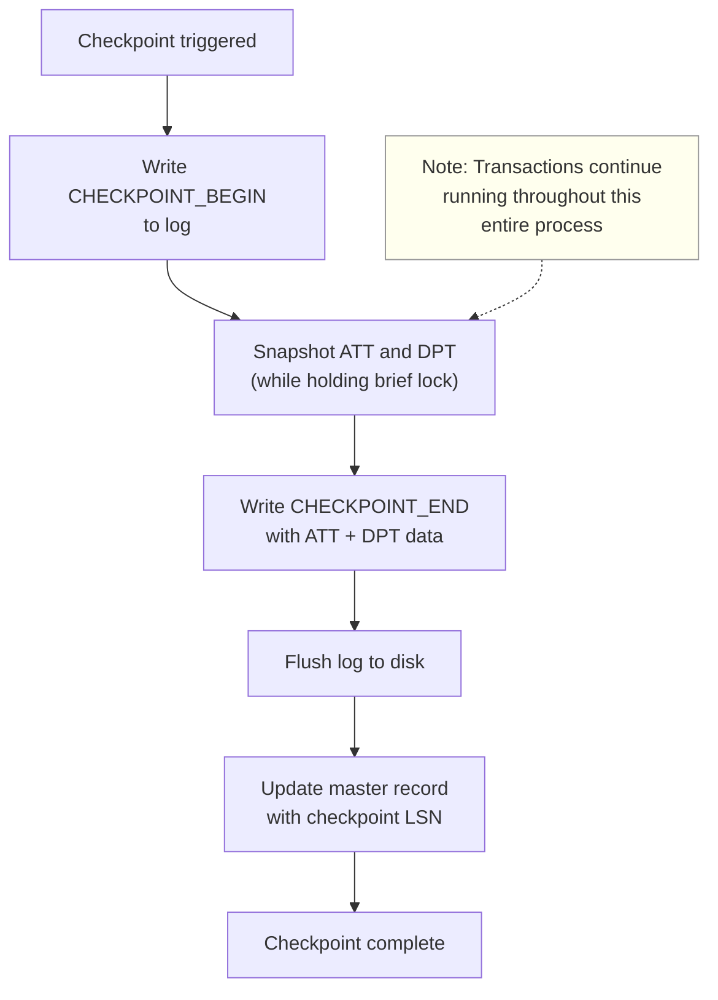

**Requirements:**
- Write CHECKPOINT_BEGIN record
- Capture ATT and DPT snapshots (minimize lock duration)
- Serialize ATT and DPT into the CHECKPOINT_END record
- Flush the log
- Atomically update a master record file with the checkpoint LSN
- Trigger checkpoints periodically (e.g., every N log records or M bytes of WAL)

**Test:**
```
- Run 3 transactions (T1 committed, T2 running, T3 aborted)
- Take a checkpoint
- Read back the checkpoint record
- Verify ATT contains T2 (not T1 or T3)
- Verify DPT contains all dirty pages
```

---

## Part 4: ARIES Recovery (Estimated: 5-6 hours)

This is the most complex part of the project. Implement all three ARIES phases.

### 4.1 Analysis Phase

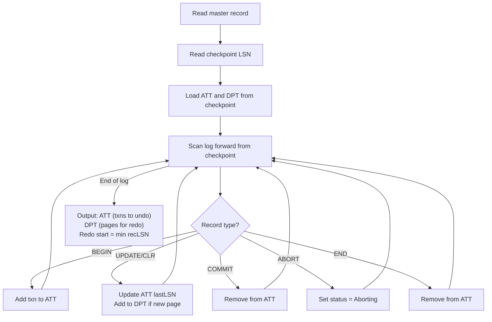

**Requirements:**
- Read the master record to find the last checkpoint
- Initialize ATT and DPT from the checkpoint record
- Scan forward through the log, updating ATT and DPT
- Output: final ATT (transactions needing undo), final DPT, and redo start LSN

### 4.2 Redo Phase

**Requirements:**
- Start scanning from `min(recLSN)` across all DPT entries
- For each UPDATE or CLR record:
  1. Skip if page not in DPT
  2. Skip if `LSN < recLSN` for that page in DPT
  3. Read the page from disk; skip if `pageLSN >= LSN`
  4. Otherwise: apply the after-image, set pageLSN = LSN, write page back

**Important:** Redo both committed AND uncommitted transactions. This is the "repeating
history" principle.

### 4.3 Undo Phase

**Requirements:**
- Initialize ToUndo with the lastLSN of each transaction in the ATT
- Process in reverse LSN order (use a max-heap or sorted list)
- For UPDATE records: apply before-image, write a CLR, add prevLSN to ToUndo
- For CLR records: follow undoNextLSN (or write END if null)
- Write END record when a transaction is fully undone

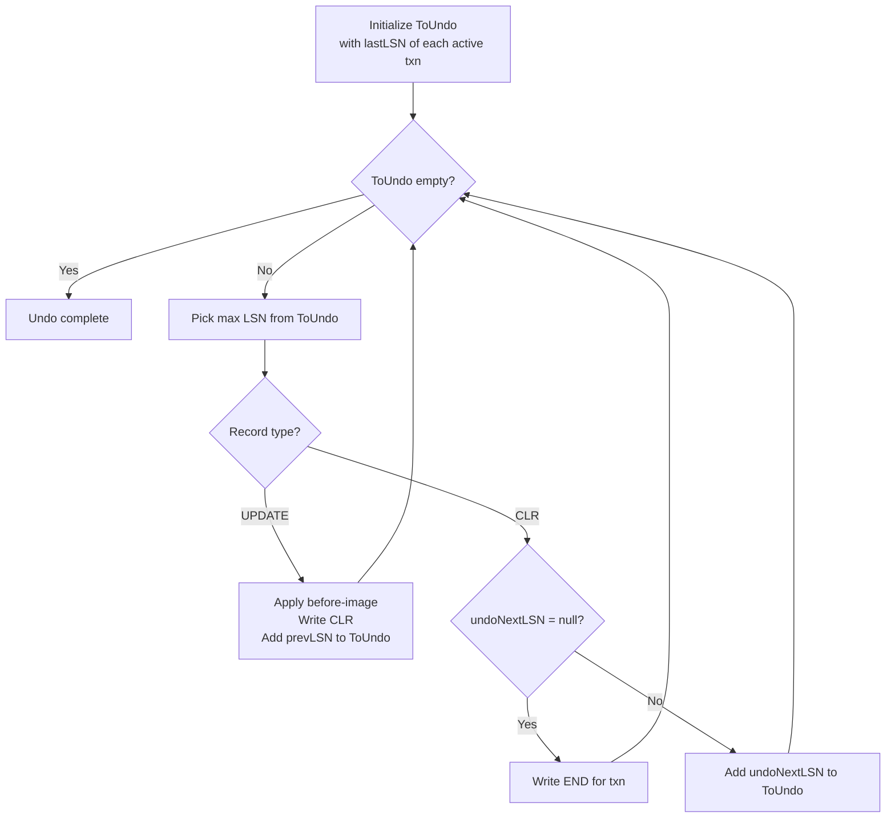

### 4.4 Recovery Entry Point

Wire everything together:

```
func (db *Database) Recover() error {
    // 1. Analysis
    att, dpt := db.recoveryManager.AnalysisPhase()

    // 2. Redo
    db.recoveryManager.RedoPhase(dpt)

    // 3. Undo
    db.recoveryManager.UndoPhase(att)

    // 4. Take a fresh checkpoint
    db.checkpointManager.CreateCheckpoint()

    return nil
}
```

---

## Part 5: Crash Testing (Estimated: 3-4 hours)

The most important part of any WAL implementation is testing. You need to simulate crashes
at every critical point and verify recovery produces the correct result.

### 5.1 Crash Injection Framework

Build a mechanism to inject crashes (process termination) at specific points.

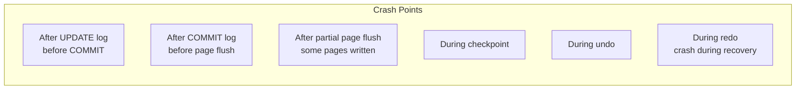

**Implementation approach:**

```go
type CrashInjector struct {
    crashPoints map[string]bool
    crashAfter  map[string]int // crash after N occurrences
    counts      map[string]int
}

func (ci *CrashInjector) MaybeCrash(point string) {
    ci.counts[point]++
    if ci.crashPoints[point] || ci.counts[point] == ci.crashAfter[point] {
        // Simulate crash by NOT flushing anything and closing files
        panic("SIMULATED CRASH at " + point)
    }
}

// Usage in log manager:
func (lm *LogManager) AppendLogRecord(rec *LogRecord) LSN {
    lsn := lm.appendInternal(rec)
    lm.crashInjector.MaybeCrash("after_append_" + rec.Type.String())
    return lsn
}
```

### 5.2 Test Scenarios

Implement each of these test scenarios:

#### Scenario 1: Crash After Update, Before Commit

```
T1: BEGIN -> UPDATE page=5 (A: 100->200) -> CRASH
Expected after recovery: page 5 has A=100 (update undone)
```

#### Scenario 2: Crash After Commit, Before Page Flush

```
T1: BEGIN -> UPDATE page=5 (A: 100->200) -> COMMIT -> CRASH (page not flushed)
Expected after recovery: page 5 has A=200 (committed update redone)
```

#### Scenario 3: Mixed Committed and Uncommitted

```
T1: BEGIN -> UPDATE page=5 (A: 100->200) -> COMMIT
T2: BEGIN -> UPDATE page=7 (B: 300->400)
T3: BEGIN -> UPDATE page=5 (C: 50->75) -> COMMIT
CRASH
Expected: page 5 has A=200 and C=75 (T1, T3 committed)
          page 7 has B=300 (T2 uncommitted, undone)
```

#### Scenario 4: Crash During Recovery (Double Crash)

```
T1: BEGIN -> UPDATE page=5 -> UPDATE page=7 -> CRASH
Recovery starts, undoes page=7, writes CLR... CRASH AGAIN
Second recovery should complete correctly:
  - CLR from first recovery is redone
  - page=7 undo is NOT repeated (CLR prevents it)
  - page=5 undo completes
```

#### Scenario 5: Crash After Checkpoint

```
T1: BEGIN -> UPDATE page=5
CHECKPOINT (ATT has T1, DPT has page=5)
T1: UPDATE page=7
T2: BEGIN -> UPDATE page=3
T1: COMMIT
CRASH
Expected: T1 committed (redo both updates)
          T2 uncommitted (undo page=3 change)
```

### 5.3 Verification

For each scenario, verify:

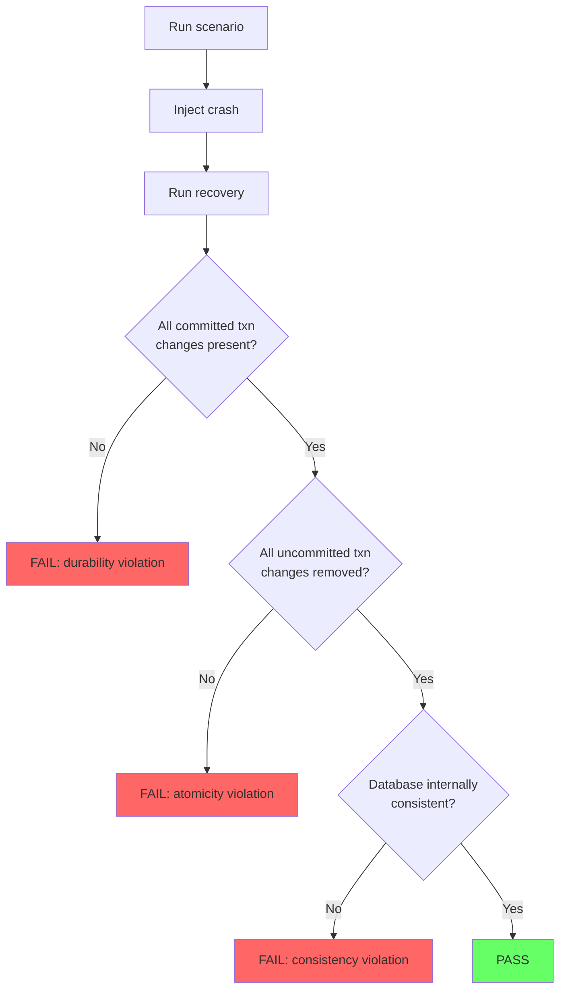

---

## Part 6: Performance Optimizations (Bonus)

### 6.1 Group Commit

Implement group commit to batch multiple transaction commits into a single fsync.

**Requirements:**
- When a transaction commits, add it to a "pending commit" queue
- A dedicated flush thread wakes up periodically (e.g., every 1ms) or when the queue
  reaches a threshold
- Flush the log once and notify all pending transactions

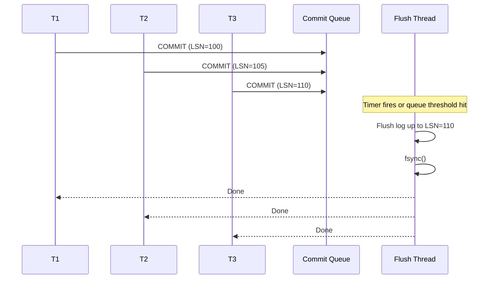

### 6.2 WAL Segmentation

Split the WAL into fixed-size segment files.

**Requirements:**
- Each segment is a fixed size (e.g., 16 MB)
- When a segment is full, create a new one
- Track which segments are needed for recovery (after checkpoint)
- Recycle old segments instead of deleting and creating new files

### 6.3 Background Page Writer

Implement a background thread that flushes dirty pages to disk.

**Requirements:**
- Periodically scan the buffer pool for dirty pages
- Flush dirty pages in LSN order (ensures WAL protocol is satisfied)
- Rate-limit to avoid overwhelming disk I/O
- Update the DPT when pages are flushed

---

## Deliverables Checklist

```
[ ] Log record serialization with CRC
[ ] Log manager with append, flush, and scan
[ ] WAL protocol enforced in buffer manager
[ ] Transaction manager writes BEGIN, UPDATE, COMMIT, ABORT records
[ ] STEAL/NO-FORCE buffer management
[ ] Dirty Page Table maintained
[ ] Active Transaction Table maintained
[ ] Fuzzy checkpoint writer
[ ] Master record file
[ ] ARIES Analysis phase
[ ] ARIES Redo phase with pageLSN checks
[ ] ARIES Undo phase with CLR generation
[ ] Crash test: uncommitted transaction undone
[ ] Crash test: committed transaction redone
[ ] Crash test: mixed committed/uncommitted
[ ] Crash test: crash during recovery (double crash)
[ ] Crash test: crash after checkpoint

Bonus:
[ ] Group commit
[ ] WAL segmentation
[ ] Background page writer
```

---

## Architecture Summary

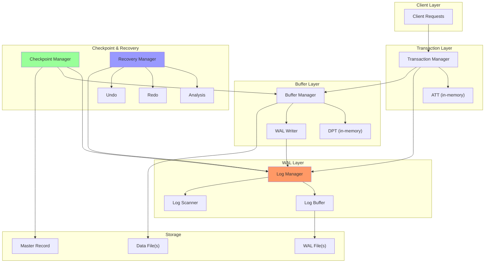
