# Module 7: Write-Ahead Logging & Crash Recovery

## The Durability Problem

Every database makes a fundamental promise: once a transaction commits, its changes survive
any failure -- power loss, OS crash, hardware fault. This is the **D** in ACID. But how do
you honor that promise when writes go through volatile RAM before reaching stable storage?

Consider what happens during a simple bank transfer:

1. Read Account A balance (1000)
2. Write Account A balance (800) -- debit 200
3. Read Account B balance (500)
4. Write Account B balance (700) -- credit 200
5. COMMIT

If the system crashes between steps 2 and 4, Account A has lost $200 that Account B never
received. The database is now inconsistent. If the system crashes after step 5 but before
dirty pages are flushed to disk, the committed transaction is lost -- violating durability.

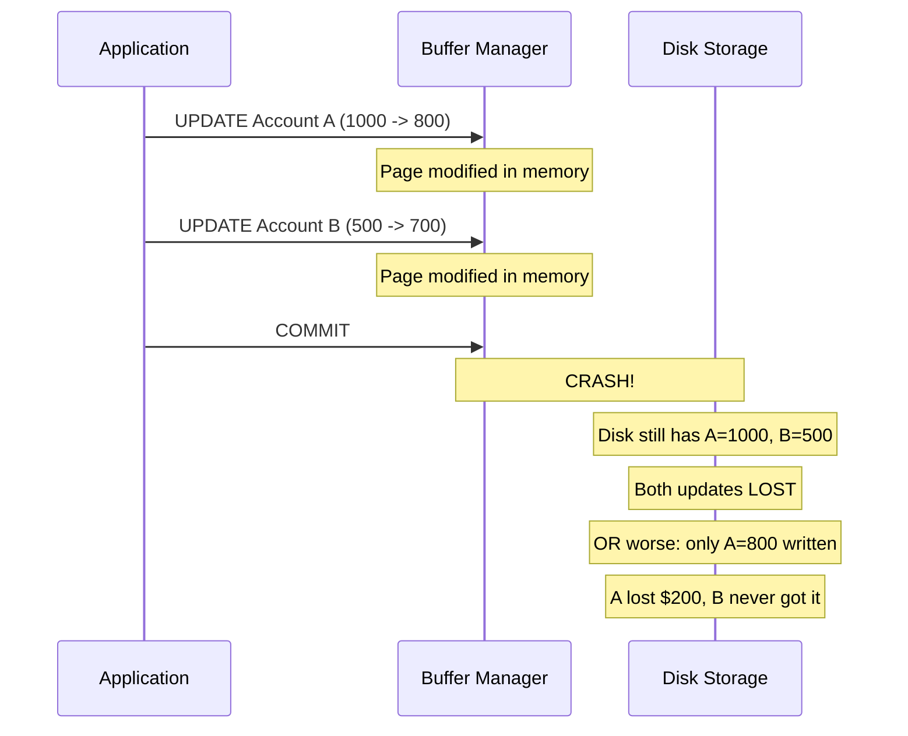

### The Core Tension

There is a fundamental tension between **performance** and **durability**:

- Writing every change directly to disk on every operation is **safe but slow**
- Buffering changes in memory and writing lazily is **fast but unsafe**

Write-Ahead Logging resolves this tension elegantly.

---

## Write-Ahead Logging (WAL): The Fundamental Rule

The WAL protocol has one golden rule:

> **Before any change is written to the database on disk, the log record describing
> that change must first be written to stable storage.**

This is the "write-ahead" part -- the log is always ahead of the data. If we crash,
we can always reconstruct what happened by replaying the log.

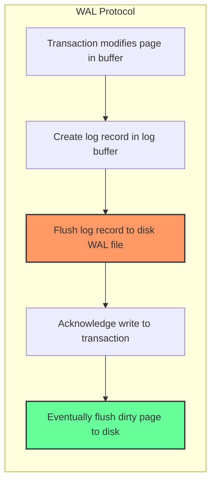

### Why Logging Works

Logging is effective because of a key insight about I/O patterns:

| Property | Database Pages | Log Records |
|----------|---------------|-------------|
| I/O Pattern | Random writes across disk | Sequential append-only |
| Write Size | Full pages (4KB-16KB) | Small records (tens of bytes) |
| Throughput | Low (random I/O) | High (sequential I/O) |
| Must write on commit? | No (can defer) | Yes (must flush) |

Sequential writes to the log are **10-100x faster** than random writes to data pages.
By forcing only the log to disk at commit time, we get both durability AND performance.

---

## Log Record Structure

Every modification to the database generates a log record. Each record contains enough
information to either **redo** or **undo** the operation.

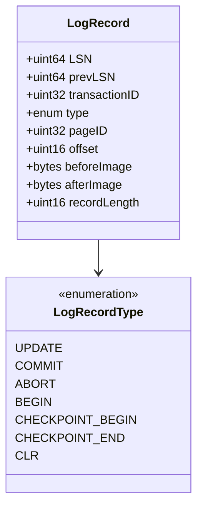

### Field-by-Field Breakdown

| Field | Size | Purpose |
|-------|------|---------|
| **LSN** (Log Sequence Number) | 8 bytes | Unique, monotonically increasing identifier for this record |
| **prevLSN** | 8 bytes | LSN of the previous log record by the same transaction (forms a per-transaction chain) |
| **transactionID** | 4 bytes | Which transaction generated this record |
| **type** | 1 byte | UPDATE, COMMIT, ABORT, CLR, CHECKPOINT, etc. |
| **pageID** | 4 bytes | Which page was modified (for UPDATE/CLR) |
| **offset** | 2 bytes | Byte offset within the page |
| **beforeImage** | variable | Old value before the change (needed for UNDO) |
| **afterImage** | variable | New value after the change (needed for REDO) |
| **recordLength** | 2 bytes | Total length of this record (for scanning) |

### The prevLSN Chain

Each transaction's log records form a linked list via `prevLSN`. This allows efficient
undo -- you follow the chain backwards to undo all of a transaction's changes without
scanning the entire log.

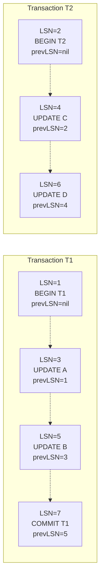

---

## Types of Log Records

### UPDATE Records

The most common type. Created whenever a transaction modifies a data page. Contains both
before-image (for undo) and after-image (for redo).

```
LSN=42 | prevLSN=38 | txn=T5 | UPDATE | page=17 | offset=120
  before: [balance=1000] | after: [balance=800]
```

### COMMIT Records

Written when a transaction commits. Once this record is flushed to stable storage, the
transaction is considered durable. Contains no before/after images.

```
LSN=50 | prevLSN=48 | txn=T5 | COMMIT
```

### ABORT Records

Written when a transaction aborts. Signals the start of the undo process.

### CHECKPOINT Records

Periodic snapshots of the system state that limit how far back recovery must scan. Contains
the active transaction table and dirty page table.

### CLR (Compensation Log Records)

Written during undo operations. A CLR describes the undo of a previous update and contains
a special `undoNextLSN` field that points to the next record to undo, preventing the same
undo from being performed twice during repeated crashes.

```
LSN=60 | prevLSN=58 | txn=T5 | CLR | page=17 | offset=120
  redo: [balance=1000] | undoNextLSN=36
```

---

## Undo Logging vs Redo Logging vs ARIES (Undo/Redo)

### Undo-Only Logging

- Log records contain only **before-images**
- Dirty pages **must** be flushed to disk **before** the COMMIT record is written
- Recovery: undo all uncommitted transactions
- Problem: forces page writes before commit (poor performance)

### Redo-Only Logging

- Log records contain only **after-images**
- Dirty pages must **not** be flushed until after COMMIT
- Recovery: redo all committed transactions
- Problem: must pin all dirty pages in buffer pool until commit (memory pressure)

### ARIES: Undo/Redo Logging (The Winner)

- Log records contain **both** before-images and after-images
- Dirty pages can be flushed at any time (maximum flexibility)
- Recovery: redo everything, then undo uncommitted work
- This is what virtually all production databases use

```mermaid
flowchart TB
    subgraph "Undo-Only"
        U1[Log before-image] --> U2[Flush dirty page to disk]
        U2 --> U3[Write COMMIT to log]
        U3 --> U4[Flush COMMIT log record]
    end

    subgraph "Redo-Only"
        R1[Log after-image] --> R2[Write COMMIT to log]
        R2 --> R3[Flush COMMIT log record]
        R3 --> R4[Now flush dirty pages]
    end

    subgraph "ARIES Undo/Redo"
        A1[Log both before + after images] --> A2[Write COMMIT to log]
        A2 --> A3[Flush COMMIT log record]
        A3 --> A4[Flush dirty pages whenever convenient]
    end

    style A1 fill:#9f6,stroke:#333
    style A2 fill:#9f6,stroke:#333
    style A3 fill:#9f6,stroke:#333
    style A4 fill:#9f6,stroke:#333
```

---

## Buffer Management Policies: Steal/Force

The buffer manager's page replacement policy interacts critically with the logging scheme.
Two independent binary choices define four possible policies:

### STEAL vs NO-STEAL

- **STEAL**: The buffer manager **can** flush a dirty page to disk before the transaction
  that modified it commits. This "steals" the frame from the transaction.
- **NO-STEAL**: Dirty pages are **pinned** in the buffer pool until their transaction
  commits. No uncommitted data ever reaches disk.

### FORCE vs NO-FORCE

- **FORCE**: All dirty pages modified by a transaction are forced to disk **at commit time**.
  After commit, the data is guaranteed on disk.
- **NO-FORCE**: Dirty pages are **not** forced to disk at commit time. Only the log records
  must be flushed.

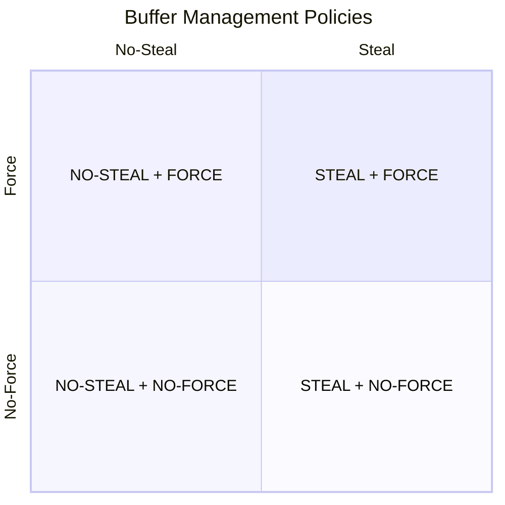

| Policy | Needs UNDO? | Needs REDO? | Performance | Used By |
|--------|------------|------------|-------------|---------|
| **No-Steal + Force** | No | No | Terrible | Toy systems |
| **No-Steal + No-Force** | No | Yes | Poor (memory pressure) | Some simple DBs |
| **Steal + Force** | Yes | No | Poor (commit latency) | Few systems |
| **Steal + No-Force** | Yes | Yes | Best | PostgreSQL, MySQL, Oracle, SQL Server |

### Why STEAL/NO-FORCE Wins

- **STEAL** allows the buffer manager maximum flexibility in page replacement. Without it,
  a long-running transaction could pin so many pages that the buffer pool runs out of frames.
- **NO-FORCE** means commit only requires a sequential log flush (fast), not random page
  writes (slow). Dirty pages are written lazily in the background.
- The cost: we need both UNDO (because stolen pages may have uncommitted data on disk) and
  REDO (because committed data may not be on disk yet). ARIES handles both.

---

## Checkpointing

Without checkpoints, recovery would need to replay the **entire** log from the beginning
of time. Checkpoints establish a known-good point from which recovery can start.

### Sharp (Consistent) Checkpoints

1. Stop all new transactions
2. Wait for all active transactions to complete
3. Flush all dirty pages to disk
4. Write a CHECKPOINT record to the log
5. Resume transactions

This is simple but requires freezing the entire system -- unacceptable for production.

### Fuzzy Checkpoints (What Production Systems Use)

1. Write a `CHECKPOINT_BEGIN` record with the current Active Transaction Table (ATT)
   and Dirty Page Table (DPT)
2. Continue processing transactions normally
3. Write a `CHECKPOINT_END` record when done
4. Update the master record to point to this checkpoint

No transactions are paused. No pages are forced to disk. Recovery uses the checkpoint's
ATT and DPT as starting points and refines them by scanning the log forward.

```mermaid
gantt
    title Checkpoint Timeline
    dateFormat X
    axisFormat %s

    section Sharp Checkpoint
    Stop all transactions     :crit, s1, 0, 2
    Flush all dirty pages     :crit, s2, 2, 6
    Write CHECKPOINT record   :s3, 6, 7
    Resume transactions       :s4, 7, 10

    section Fuzzy Checkpoint
    Write BEGIN_CHECKPOINT    :f1, 0, 1
    Record ATT + DPT          :f2, 1, 2
    Write END_CHECKPOINT      :f3, 2, 3
    Transactions continue     :active, f4, 0, 10
```

---

## Log Sequence Numbers (LSN)

The LSN is the most important concept in WAL. It serves as:

1. **Unique identifier** for each log record
2. **Ordering mechanism** -- higher LSN = later in time
3. **Physical address** -- often the byte offset in the log file

### PageLSN

Every data page has a `pageLSN` field in its header -- the LSN of the most recent log
record that modified this page. This is critical during recovery:

- If `pageLSN >= log record's LSN`, the update is already on the page (skip redo)
- If `pageLSN < log record's LSN`, the update is missing (must redo)

### FlushedLSN

The WAL manager tracks the `flushedLSN` -- the highest LSN that has been flushed to
stable storage. Before the buffer manager can write a dirty page to disk, it must ensure:

```
pageLSN <= flushedLSN
```

This enforces the WAL protocol: the log record must be on disk before the data page.

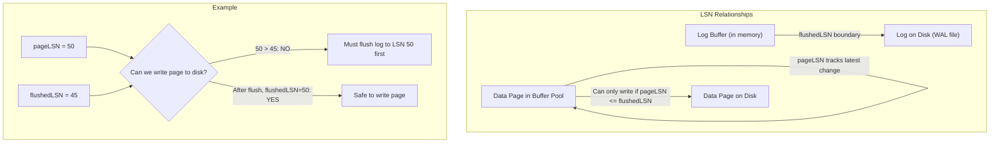

---

## WAL Segment Files

The WAL is not a single ever-growing file. It is split into **segment files** of fixed
size (e.g., 16 MB in PostgreSQL).

```
pg_wal/
  000000010000000000000001   (16 MB)
  000000010000000000000002   (16 MB)
  000000010000000000000003   (16 MB)
  ...
```

Benefits of segmentation:
- Old segments can be recycled or archived after checkpoint
- Easier to manage than one massive file
- Enables WAL archiving for Point-in-Time Recovery (PITR)
- Parallel I/O across segments

### Segment Lifecycle

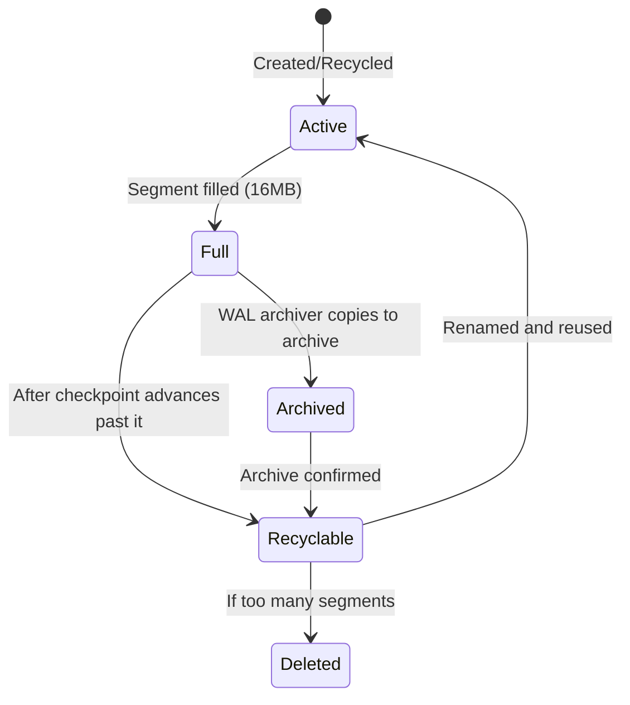

---

## Group Commit Optimization

Flushing the log to disk on every single commit is expensive -- even sequential I/O has
latency due to `fsync()`. **Group commit** batches multiple transactions' commit records
into a single flush.

### How It Works

1. Transaction T1 commits -- its COMMIT record goes to the log buffer
2. Before the flush completes, T2 and T3 also commit
3. A single `fsync()` flushes all three COMMIT records to disk
4. All three transactions are notified of successful commit

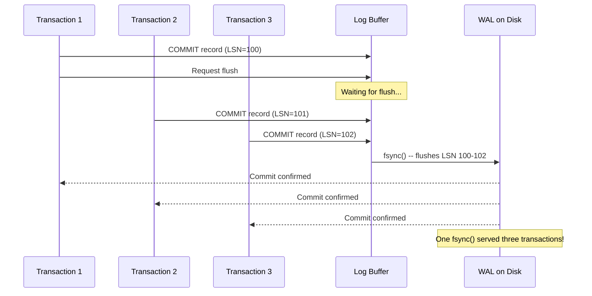

### Performance Impact

Without group commit: 1 fsync per commit, ~200 commits/sec with 5ms disk latency.

With group commit: 1 fsync per batch (e.g., 10 commits), ~2000 commits/sec.

Group commit is universally used in production databases. PostgreSQL controls it with
`commit_delay` and `commit_siblings` settings.

---

## Putting It All Together

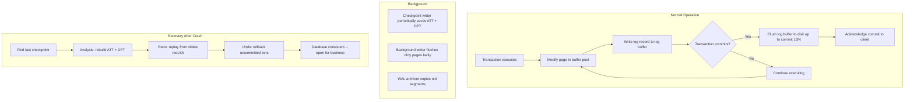

### Key Takeaways

1. **WAL is the foundation of durability** -- without it, crashes corrupt data
2. **Log before data** -- the one rule you never break
3. **STEAL/NO-FORCE** gives the best performance but requires both redo and undo
4. **Fuzzy checkpoints** avoid freezing the system
5. **Group commit** amortizes the cost of fsync across many transactions
6. **LSNs** are the glue that connects log records, pages, and recovery
7. **ARIES** is the gold-standard recovery algorithm (covered in depth in explanation.md)
