# Module 8: Join Algorithms & Query Execution -- Deep Dive

## 1. The Volcano/Iterator Model in Detail

The Volcano model, published by Goetz Graefe in 1994, is the most widely implemented execution model in production databases. PostgreSQL, MySQL, SQLite, Oracle, and SQL Server all use variants of it.

### 1.1 The Three-Method Interface

Every operator (node in the query plan tree) implements exactly three methods:

```
interface Operator {
    Open()   -- Initialize state, allocate resources, recursively open children
    Next()   -- Return the next tuple, or NULL/EOF if exhausted
    Close()  -- Release resources, recursively close children
}
```

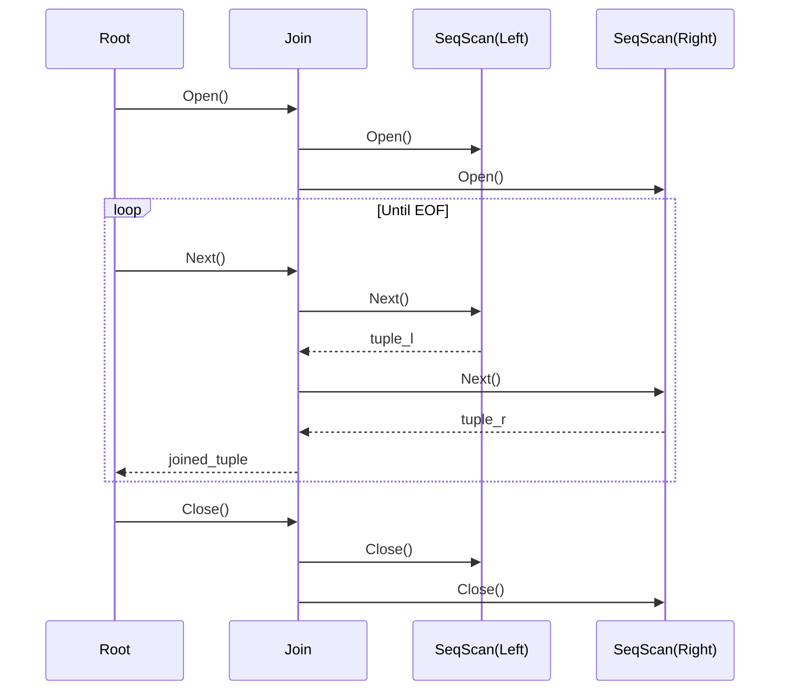

### 1.2 Composition and Pipeline

The beauty of the iterator model is **composability**. Any operator can sit above or below any other operator. A hash join's probe side can feed into a sort, which feeds into a merge join, which feeds into a projection -- all connected through the same `Next()` interface.

A pipeline is a chain of operators where each `Next()` call propagates downward and a tuple propagates upward without intermediate storage:

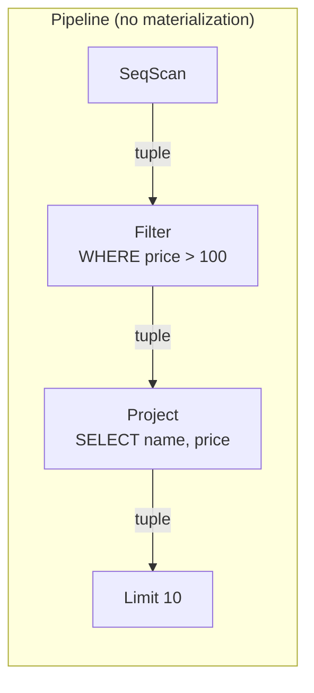

### 1.3 Why Iterator Model Has Poor Cache Performance

The iterator model processes **one tuple at a time**, which leads to several CPU-level inefficiencies:

1. **Virtual function call overhead**: Each `Next()` is a virtual/indirect function call. Modern CPUs rely on branch prediction, and indirect calls through vtables are hard to predict.

2. **Instruction cache thrashing**: Each `Next()` call switches between different operator code paths. The instruction cache constantly evicts and reloads code for different operators.

3. **Data cache misses**: Processing one tuple at a time means the CPU data cache holds a single tuple's worth of useful data. The cache lines loaded for one tuple are evicted before the next call.

4. **Branch misprediction**: The tight loop of "call Next(), check for EOF, process tuple, repeat" causes frequent branch mispredictions at each operator boundary.

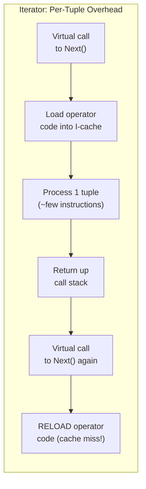

Benchmarks show that in a pure iterator model, **only 10-20% of CPU cycles** are spent on actual data processing. The rest is overhead from function calls, cache misses, and branch mispredictions.

---

## 2. Vectorized Execution

### 2.1 The Core Idea

Instead of passing one tuple through `Next()`, pass a **vector (batch)** of tuples. Each operator processes the entire batch with a tight inner loop, enabling:

- **Loop-based processing**: Tight `for` loops over arrays of values are highly optimizable by the compiler
- **SIMD utilization**: Operations on arrays of integers or floats can use SSE/AVX instructions
- **Cache-friendly access**: A batch of column values fits neatly in L1/L2 cache
- **Amortized call overhead**: One virtual function call per 1024 tuples instead of per tuple

### 2.2 Columnar Batches

In vectorized engines (DuckDB, Velox, ClickHouse), a batch is stored in **columnar format**:

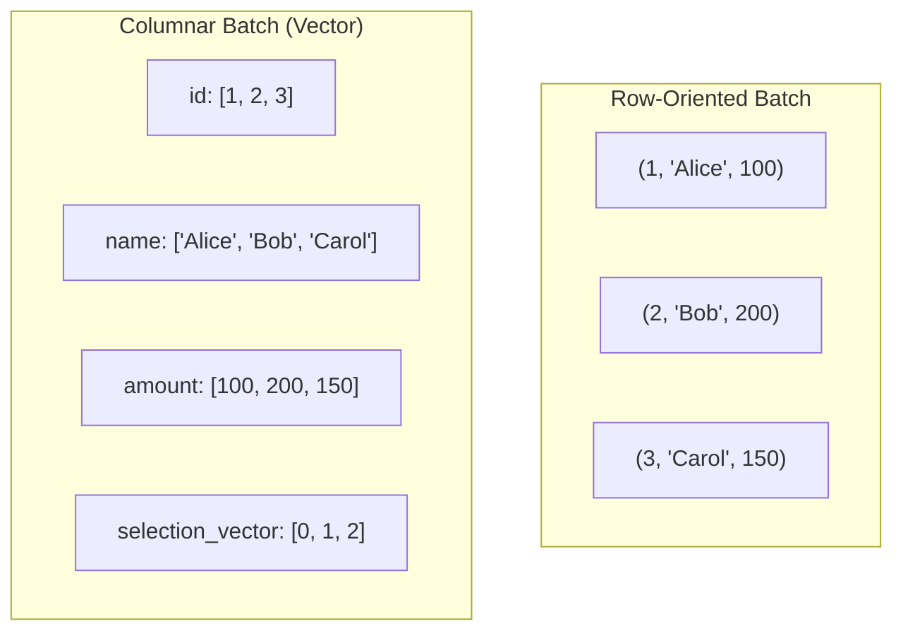

A filter operation on `amount > 120` does not copy data; it simply updates the **selection vector**:

```
selection_vector: [0, 1, 2]  -->  [1, 2]  (only Bob and Carol pass)
```

### 2.3 Processing Example: Filter + Aggregate

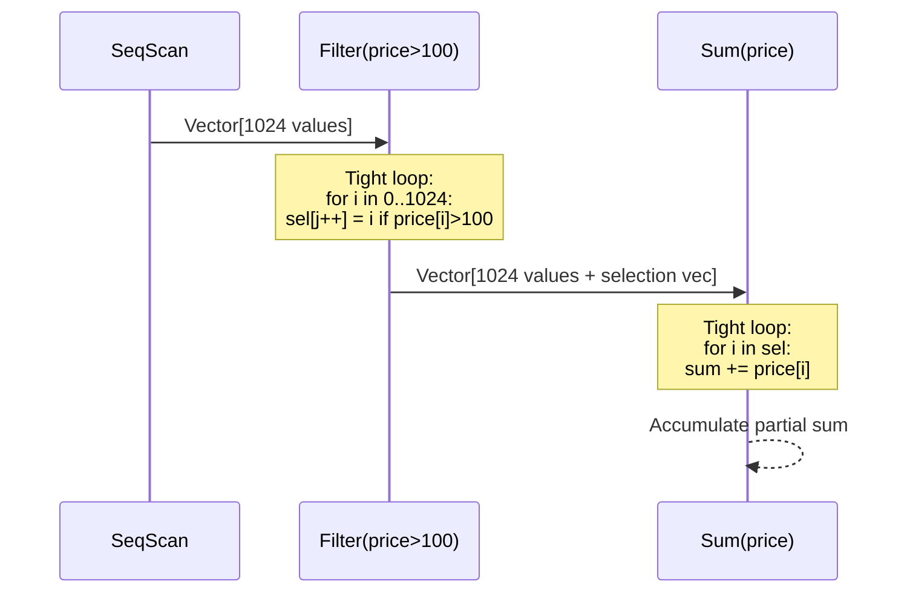

Each operator's inner loop processes **only one column at a time** in a tight loop. This is fundamentally different from the iterator model where each operator handles all columns of one tuple.

### 2.4 Vectorized vs. Compiled (JIT)

Modern engines take two approaches to high-performance execution:

| Aspect | Vectorized | Compiled/JIT |
|--------|-----------|--------------|
| Approach | Batch processing with interpreted operators | Generate native code for the entire query |
| Example systems | DuckDB, Velox, ClickHouse | HyPer, Spark (Tungsten), PostgreSQL JIT |
| Startup cost | Low | High (compilation time) |
| Steady-state performance | Good | Potentially better |
| Complexity | Medium | High |
| Debugging | Easier | Harder |

DuckDB and DataFusion demonstrate that vectorized execution can match or exceed JIT compilation for most analytical workloads.

---

## 3. Morsel-Driven Parallelism

### 3.1 The Problem with Traditional Parallelism

Traditional parallel query execution partitions data across threads at the **operator level**: each operator is assigned to a thread or set of threads. This creates load balancing problems and pipeline stalls.

### 3.2 Morsel-Driven Model (HyPer)

The morsel-driven model, introduced by the HyPer system (Leis et al., 2014), divides work into **morsels** -- small chunks of data (typically 10K-100K tuples) that are dynamically assigned to worker threads.

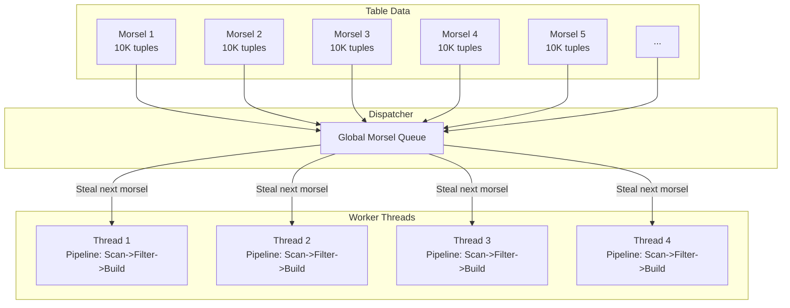

**Key properties:**

1. **Work-stealing**: When a thread finishes its morsel, it grabs the next available one. This naturally balances load across cores.

2. **NUMA-aware**: Morsels are preferentially assigned to threads on the same NUMA node as the data, minimizing cross-socket memory access.

3. **Pipeline-at-a-time**: All threads process the same pipeline until it is complete, then move to the next pipeline.

4. **Minimal synchronization**: Each thread has thread-local state (e.g., partial hash table). Only at pipeline boundaries do threads synchronize (e.g., merging partial hash tables).

---

## 4. Push-Based vs. Pull-Based Execution

### 4.1 Pull-Based (Iterator/Volcano)

The root operator "pulls" tuples by calling `Next()` on children. Data flows **upward** on demand.

### 4.2 Push-Based

The leaf operators "push" tuples to their parent operators. The scan operator reads tuples and pushes them through a pipeline of callbacks.

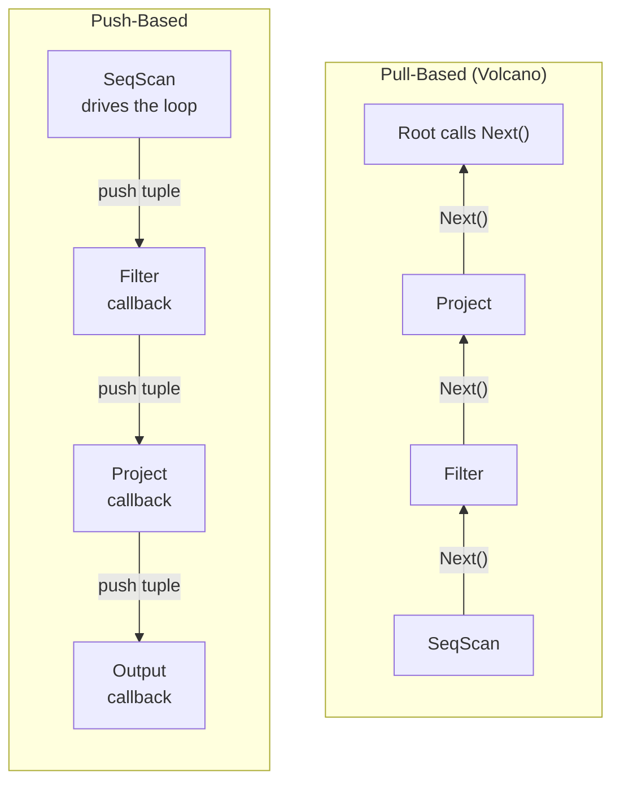

**Push-based advantages:**
- Better suited for compiled/JIT execution -- the entire pipeline becomes a single loop
- No virtual function call overhead per tuple
- The scan operator controls the loop, enabling better prefetching
- Natural fit for morsel-driven parallelism

**Push-based disadvantages:**
- Harder to implement LIMIT/early termination (need a cancel mechanism)
- More complex control flow
- Operators cannot easily "pull" from multiple children

HyPer, Peloton, and Umbra use push-based execution. DuckDB uses a hybrid pull-based vectorized model.

---

## 5. Parallel Hash Join

### 5.1 Partitioned (Independent) Hash Join

Each thread gets a subset of partitions and builds/probes independently:

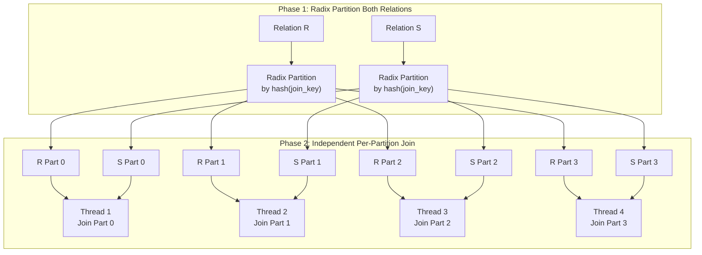

**Pros:** Zero synchronization during build/probe. Perfect cache locality if partitions fit in L2/L3 cache.

**Cons:** Partitioning itself is expensive (random writes). Does not handle skew well.

### 5.2 Shared Hash Table Hash Join

All threads build into a **single shared hash table** using atomic operations (CAS -- compare-and-swap):

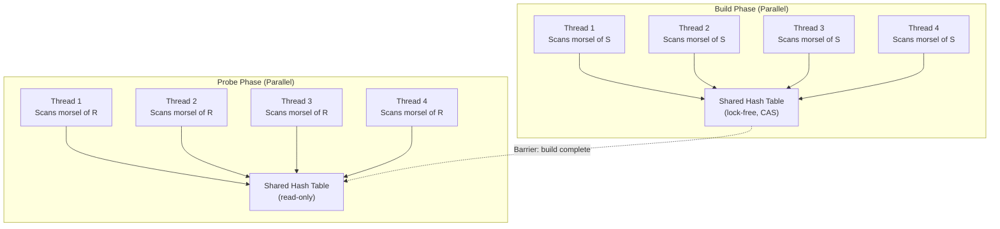

**Pros:** No partitioning overhead. Works well with morsel-driven execution. Handles skew naturally.

**Cons:** Atomic operations have overhead. Cache line contention during build phase. The probe phase is read-only and scales perfectly.

---

## 6. Bloom Filter Optimization for Hash Joins

### 6.1 The Problem

In a hash join pipeline like `Scan(R) -> HashJoin(S) -> HashJoin(T)`, tuples from R that do not match in S still flow through the pipeline until they reach the join operator. This wastes CPU on filtering, hashing, and probing for tuples that will ultimately be discarded.

### 6.2 Bloom Filter Solution

After building the hash table for a join, construct a **Bloom filter** -- a compact probabilistic data structure. Push the Bloom filter down to the scan operator (or an early filter). Tuples that definitely have no match are eliminated early.

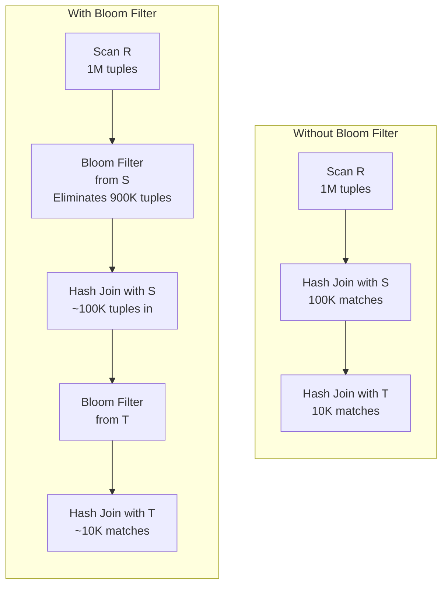

A Bloom filter uses only ~10 bits per element for a 1% false positive rate. For 100K elements, that is about 125KB -- fits entirely in L2 cache.

### 6.3 Sideways Information Passing (SIP)

Bloom filter optimization is an instance of a broader technique called **sideways information passing**. The idea is to pass summary information about one side of a join to pre-filter the other side.

Other SIP techniques include:
- **Min/max range filters**: If the build side has join keys in range [100, 500], skip probe tuples outside that range
- **Semi-join reducers**: In distributed settings, send the distinct join keys from one node to another to pre-filter before shipping data
- **Zone maps / column statistics**: Use per-chunk statistics to skip entire data chunks

---

## 7. How PostgreSQL Chooses Join Strategies

PostgreSQL's optimizer uses cost-based optimization to choose between three join methods: nested loop, hash join, and merge join. The choice depends on estimated costs computed from table statistics.

### 7.1 Cost Model Parameters

```sql
-- These GUCs enable/disable join strategies
SET enable_nestloop = on;     -- default: on
SET enable_hashjoin = on;     -- default: on
SET enable_mergejoin = on;    -- default: on
SET enable_material = on;     -- allows materializing inner of NLJ

-- Cost parameters that influence the choice
SET random_page_cost = 4.0;   -- cost of a random I/O
SET seq_page_cost = 1.0;      -- cost of a sequential I/O
SET cpu_tuple_cost = 0.01;    -- cost of processing one tuple
SET cpu_operator_cost = 0.0025; -- cost of one operator evaluation
SET effective_cache_size = '4GB'; -- planner's assumption about cache
```

### 7.2 Decision Logic (Simplified)

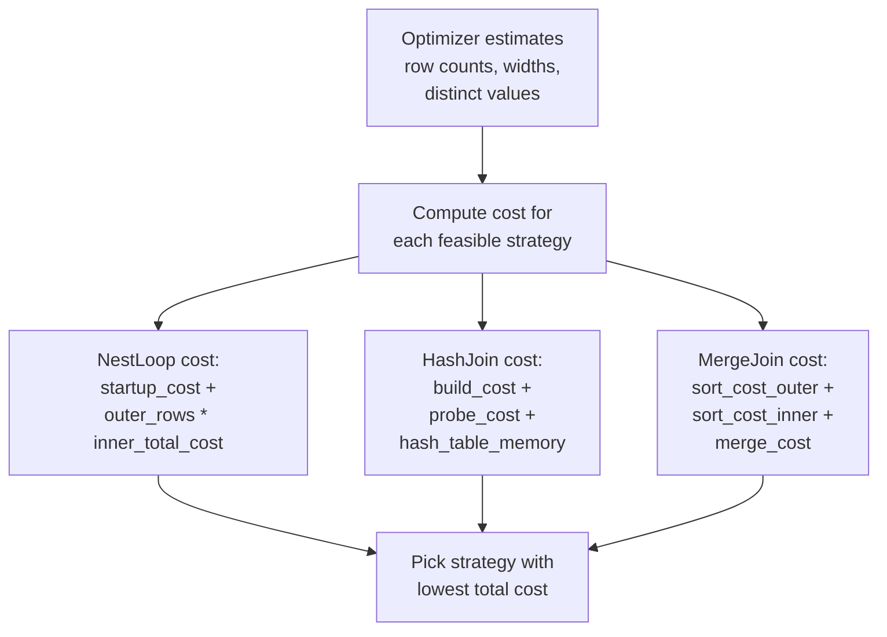

### 7.3 When PostgreSQL Prefers Each Strategy

**Nested Loop:**
- Very small outer relation (< few hundred rows)
- Inner relation has an index on the join key
- Parameterized index scan makes inner cost low per outer tuple
- Very selective WHERE clause on outer relation

**Hash Join:**
- Large relations without useful indexes
- Equi-join predicates only
- Inner (build) relation fits in work_mem
- Default choice for OLAP-style queries

**Merge Join:**
- Both inputs already sorted (e.g., index scans on join key)
- Result must be sorted on join key
- Can handle range predicates (e.g., `a.x BETWEEN b.lo AND b.hi` -- partially)
- Good when work_mem is insufficient for a hash table

### 7.4 EXPLAIN Example

```sql
EXPLAIN (ANALYZE, BUFFERS)
SELECT c.name, SUM(o.amount)
FROM customers c
JOIN orders o ON c.id = o.customer_id
GROUP BY c.name;

-- Possible plans:
-- 1) Hash Join (most likely for large tables)
--    Hash Join (cost=... rows=...)
--      -> Seq Scan on orders
--      -> Hash
--           -> Seq Scan on customers
--
-- 2) Merge Join (if both have indexes)
--    Merge Join (cost=...)
--      -> Index Scan on customers_pkey
--      -> Sort (or Index Scan on orders_customer_id_idx)
--
-- 3) Nested Loop (if customers is tiny)
--    Nested Loop (cost=...)
--      -> Seq Scan on customers (very few rows after filter)
--      -> Index Scan on orders_customer_id_idx
```

---

## 8. Adaptive Joins

### 8.1 The Problem with Static Decisions

The optimizer chooses a join strategy based on **estimated** cardinalities. If estimates are wrong (which is common for complex predicates, correlated columns, or missing statistics), the chosen strategy may be catastrophically suboptimal.

### 8.2 Adaptive Approaches

**Strategy 1: Runtime re-optimization**
After executing part of the plan, check actual row counts against estimates. If they diverge significantly, re-optimize the remaining plan. (SQL Server's Adaptive Joins, Oracle's Adaptive Plans)

**Strategy 2: Adaptive hash/nested-loop switch**
SQL Server 2017+ can start executing a join as a nested loop and switch to hash join if the actual number of rows exceeds a threshold.

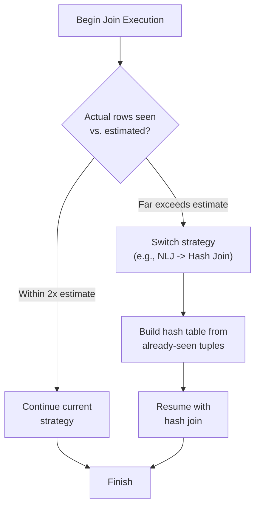

**Strategy 3: Parametric query optimization**
Pre-compute optimal plans for different cardinality ranges. At runtime, pick the plan matching the actual parameters.

---

## 9. Sort-Based vs. Hash-Based Grouping and Aggregation

### 9.1 Hash-Based Aggregation

Build a hash table keyed on the GROUP BY columns. For each input tuple, probe the hash table; if the group exists, update the running aggregate; otherwise, create a new entry.

```
hash_table = {}
for each tuple t:
    key = (t.group_col1, t.group_col2, ...)
    if key in hash_table:
        hash_table[key].update(t)   -- e.g., sum += t.value
    else:
        hash_table[key] = new_aggregate(t)
emit all entries in hash_table
```

**Cost:** O(N) time, O(G) space where G = number of groups.

### 9.2 Sort-Based Aggregation

Sort the input on the GROUP BY columns. Then scan sequentially -- consecutive tuples with the same key belong to the same group.

```
sort input by (group_col1, group_col2, ...)
current_group = null
for each tuple t in sorted input:
    if t.key != current_group:
        if current_group != null:
            emit current_group result
        current_group = t.key
        initialize new aggregate
    update aggregate with t
emit final group
```

**Cost:** O(N log N) for sorting + O(N) for the scan. O(1) space for aggregation (after sort).

### 9.3 Comparison

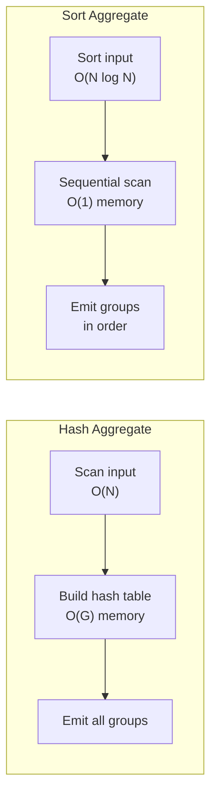

| Factor | Hash Aggregate | Sort Aggregate |
|--------|---------------|----------------|
| Time complexity | O(N) | O(N log N) |
| Memory | O(G) -- can be large | O(1) after sort |
| Ordered output | No | Yes (by group key) |
| Handles spill | External hash table | External sort |
| Pre-sorted input | Still O(N) | O(N) -- skip sort |
| Many groups | May exceed memory | Always works |

PostgreSQL uses **HashAggregate** by default and falls back to **GroupAggregate** (sort-based) when `work_mem` is insufficient for the hash table, or when the output must be ordered.

---

## 10. Advanced Topics

### 10.1 Join Ordering

For N tables, the number of possible join trees grows super-exponentially:

| Tables | Left-Deep Trees | All Trees (Bushy) |
|--------|----------------|-------------------|
| 2 | 2 | 2 |
| 4 | 24 | 120 |
| 6 | 720 | 30,240 |
| 8 | 40,320 | 17,297,280 |
| 10 | 3,628,800 | ~17.6 billion |

PostgreSQL uses dynamic programming for up to `join_collapse_limit` tables (default 8) and falls back to the Genetic Query Optimizer (GEQO) for more.

### 10.2 Interesting Orders

An **interesting order** is a sort order that is useful for a later operation (merge join, GROUP BY, ORDER BY, DISTINCT). The optimizer tracks interesting orders throughout plan enumeration and may choose a more expensive plan that produces a useful order, avoiding a later sort.

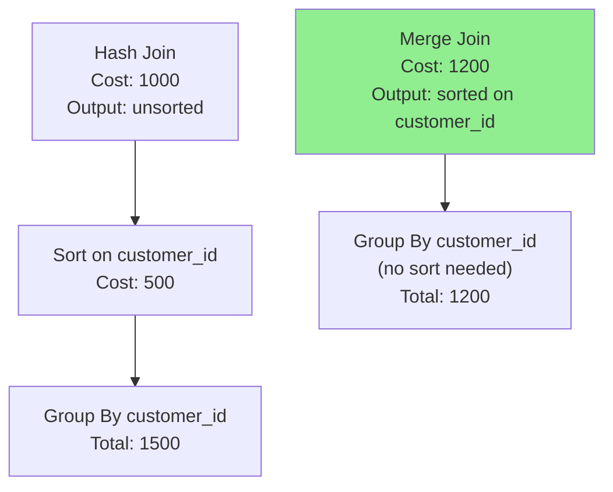

### 10.3 Factorized Joins

Traditional join algorithms materialize the full Cartesian product of matching groups. **Factorized joins** (from the database theory community) represent the result compactly by avoiding redundant repetition.

For a join where one customer has 100 orders and 5 addresses, the traditional result has 500 rows. A factorized representation stores the customer once, the 100 orders once, and the 5 addresses once -- total 106 entries instead of 500.

This matters enormously for multi-way joins with large intermediate results.

---

## Key Takeaways

1. The iterator model is elegant and universal but pays a heavy per-tuple overhead tax. Vectorized execution amortizes this by processing batches.

2. Morsel-driven parallelism provides dynamic load balancing and NUMA-awareness without complex operator-level partitioning.

3. Bloom filters can dramatically reduce the number of tuples flowing through join pipelines by eliminating non-matching tuples early.

4. PostgreSQL's join strategy selection is driven by cost estimates that depend heavily on accurate statistics. Use `ANALYZE` and monitor `EXPLAIN ANALYZE` to catch bad estimates.

5. Hash-based and sort-based aggregation have complementary strengths. Hash is faster for in-memory workloads; sort is more robust for large group counts and produces ordered output.
