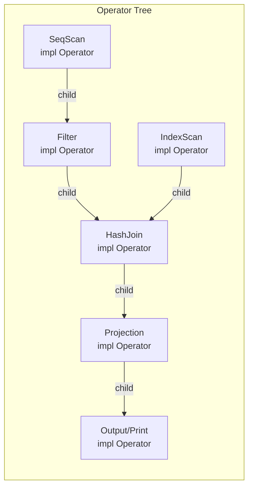
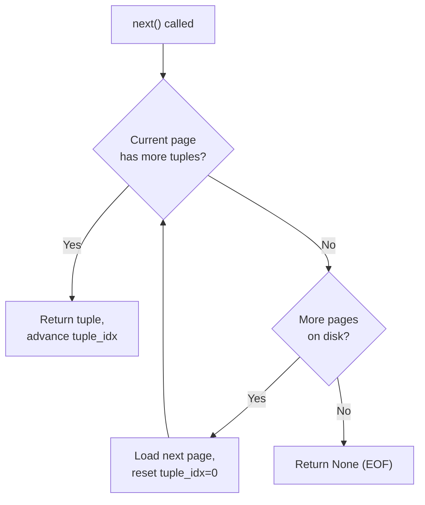
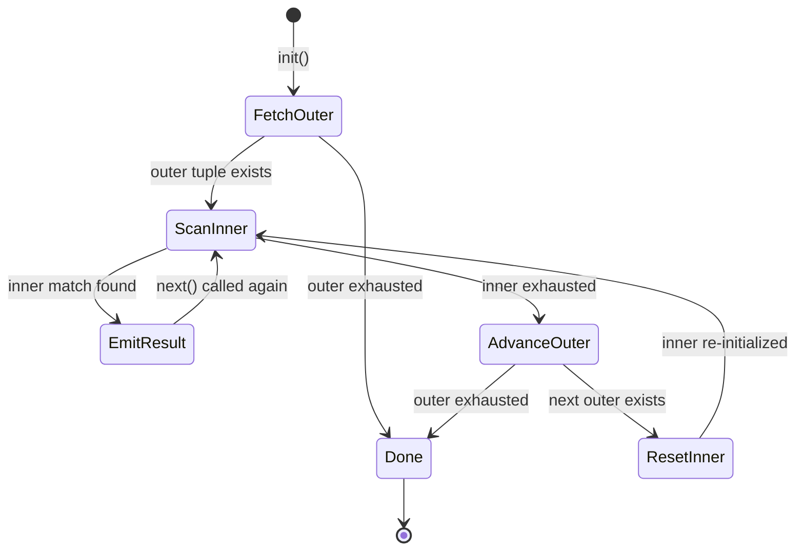
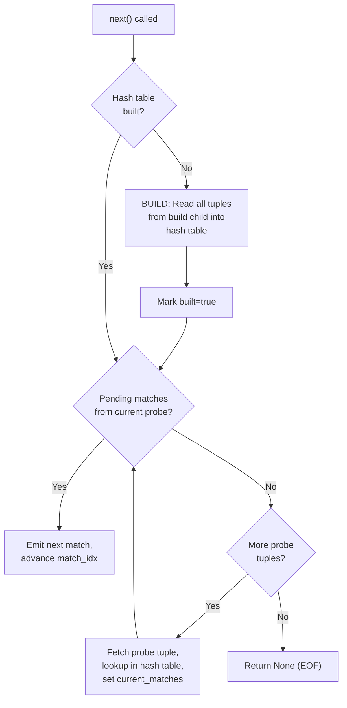
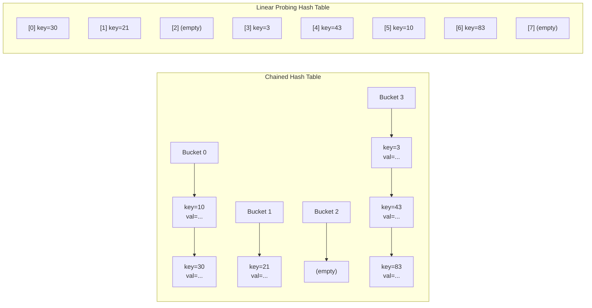
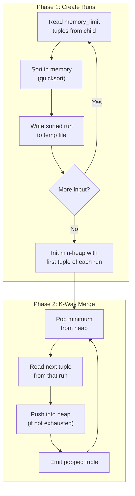
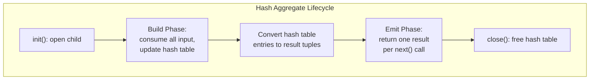
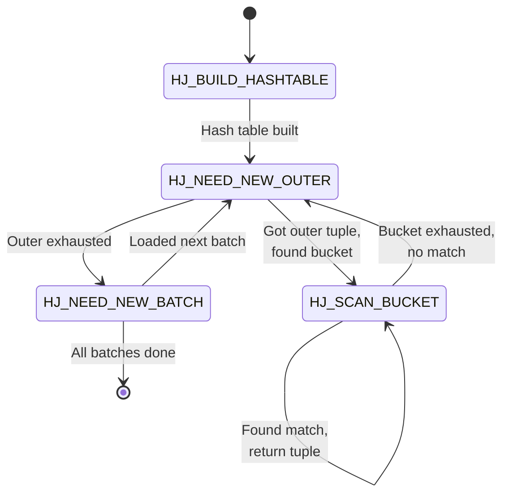
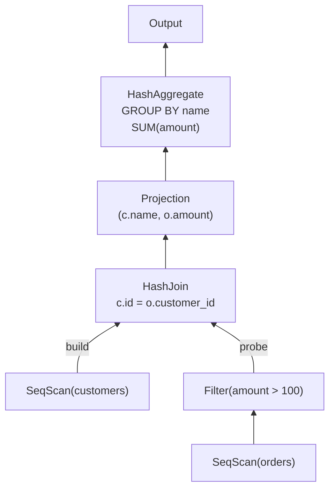

# Module 8: Join Algorithms & Query Execution -- Implementation Guide

## 1. The Iterator Interface

Every query operator implements the same three-method interface. This is the foundation of the entire execution engine.

### 1.1 Base Interface (Rust)

```rust
/// A single tuple: a vector of typed values
type Tuple = Vec<Value>;

/// Every query operator implements this trait
trait Operator {
    /// Initialize the operator. Called once before any Next() calls.
    fn init(&mut self) -> Result<()>;

    /// Return the next output tuple, or None if exhausted.
    fn next(&mut self) -> Result<Option<Tuple>>;

    /// Clean up resources. Called once after all processing.
    fn close(&mut self) -> Result<()>;

    /// Return the output schema (column names and types).
    fn schema(&self) -> &Schema;
}
```

### 1.2 Operator Pipeline Architecture



### 1.3 The Execution Loop

```rust
fn execute_query(mut root: Box<dyn Operator>) -> Result<Vec<Tuple>> {
    let mut results = Vec::new();
    root.init()?;
    while let Some(tuple) = root.next()? {
        results.push(tuple);
    }
    root.close()?;
    Ok(results)
}
```

---

## 2. SeqScan Operator

The sequential scan reads all tuples from a table, one page at a time.

```rust
struct SeqScan {
    table: TableRef,         // reference to the heap file
    schema: Schema,
    page_iter: Option<PageIterator>,
    current_page: Option<Page>,
    tuple_idx: usize,
}

impl Operator for SeqScan {
    fn init(&mut self) -> Result<()> {
        self.page_iter = Some(self.table.page_iterator());
        self.current_page = None;
        self.tuple_idx = 0;
        Ok(())
    }

    fn next(&mut self) -> Result<Option<Tuple>> {
        loop {
            // If we have a current page, try the next tuple on it
            if let Some(ref page) = self.current_page {
                if self.tuple_idx < page.tuple_count() {
                    let tuple = page.get_tuple(self.tuple_idx);
                    self.tuple_idx += 1;
                    return Ok(Some(tuple));
                }
            }
            // Current page exhausted -- fetch next page
            let iter = self.page_iter.as_mut().unwrap();
            match iter.next_page()? {
                Some(page) => {
                    self.current_page = Some(page);
                    self.tuple_idx = 0;
                    // Loop back to read first tuple on new page
                }
                None => return Ok(None), // No more pages -- EOF
            }
        }
    }

    fn close(&mut self) -> Result<()> {
        self.page_iter = None;
        self.current_page = None;
        Ok(())
    }

    fn schema(&self) -> &Schema {
        &self.schema
    }
}
```



---

## 3. Filter Operator

The filter operator wraps a child operator and only emits tuples that satisfy a predicate.

```rust
struct Filter {
    child: Box<dyn Operator>,
    predicate: Box<dyn Fn(&Tuple) -> bool>,
    schema: Schema,
}

impl Operator for Filter {
    fn init(&mut self) -> Result<()> {
        self.child.init()
    }

    fn next(&mut self) -> Result<Option<Tuple>> {
        // Keep pulling from child until we find a matching tuple or EOF
        while let Some(tuple) = self.child.next()? {
            if (self.predicate)(&tuple) {
                return Ok(Some(tuple));
            }
            // Tuple doesn't match predicate -- skip it, try next
        }
        Ok(None)
    }

    fn close(&mut self) -> Result<()> {
        self.child.close()
    }

    fn schema(&self) -> &Schema {
        &self.schema
    }
}
```

The filter is a **pipeline operator** -- it never materializes intermediate results. It simply passes through tuples that match the predicate.

---

## 4. Projection Operator

The projection operator selects and/or computes a subset of columns.

```rust
struct Projection {
    child: Box<dyn Operator>,
    /// Each expression computes one output column from the input tuple.
    /// Could be a column reference (e.g., col[2]) or an expression (col[1] + col[3]).
    expressions: Vec<Box<dyn Fn(&Tuple) -> Value>>,
    schema: Schema,
}

impl Operator for Projection {
    fn init(&mut self) -> Result<()> {
        self.child.init()
    }

    fn next(&mut self) -> Result<Option<Tuple>> {
        match self.child.next()? {
            Some(input_tuple) => {
                let output: Tuple = self.expressions
                    .iter()
                    .map(|expr| expr(&input_tuple))
                    .collect();
                Ok(Some(output))
            }
            None => Ok(None),
        }
    }

    fn close(&mut self) -> Result<()> {
        self.child.close()
    }

    fn schema(&self) -> &Schema {
        &self.schema
    }
}
```

---

## 5. Nested Loop Join Operator

The nested loop join operator iterates over the outer child and, for each outer tuple, scans the entire inner child for matches.

```rust
struct NestedLoopJoin {
    outer: Box<dyn Operator>,
    inner: Box<dyn Operator>,       // Must support re-init (re-scan)
    predicate: Box<dyn Fn(&Tuple, &Tuple) -> bool>,
    current_outer: Option<Tuple>,
    schema: Schema,
}

impl Operator for NestedLoopJoin {
    fn init(&mut self) -> Result<()> {
        self.outer.init()?;
        self.inner.init()?;
        // Fetch the first outer tuple
        self.current_outer = self.outer.next()?;
        Ok(())
    }

    fn next(&mut self) -> Result<Option<Tuple>> {
        loop {
            // If no current outer tuple, we are done
            let outer_tuple = match &self.current_outer {
                Some(t) => t.clone(),
                None => return Ok(None),
            };

            // Try to find a matching inner tuple
            while let Some(inner_tuple) = self.inner.next()? {
                if (self.predicate)(&outer_tuple, &inner_tuple) {
                    // Concatenate outer and inner tuples
                    let mut result = outer_tuple.clone();
                    result.extend(inner_tuple);
                    return Ok(Some(result));
                }
            }

            // Inner exhausted for this outer tuple
            // Advance to next outer tuple and re-scan inner
            self.current_outer = self.outer.next()?;
            if self.current_outer.is_some() {
                self.inner.close()?;
                self.inner.init()?; // Re-scan inner from the beginning
            }
        }
    }

    fn close(&mut self) -> Result<()> {
        self.outer.close()?;
        self.inner.close()
    }

    fn schema(&self) -> &Schema {
        &self.schema
    }
}
```



---

## 6. Hash Join Operator

The hash join has two phases: **build** (during `init` or first `next` call) and **probe** (during subsequent `next` calls).

```rust
use std::collections::HashMap;

struct HashJoin {
    build_child: Box<dyn Operator>,    // Inner/build side (smaller)
    probe_child: Box<dyn Operator>,    // Outer/probe side (larger)
    build_key_idx: usize,              // Column index of join key in build side
    probe_key_idx: usize,              // Column index of join key in probe side
    hash_table: HashMap<Value, Vec<Tuple>>,
    // State for iteration
    current_probe: Option<Tuple>,
    current_matches: Vec<Tuple>,
    match_idx: usize,
    built: bool,
    schema: Schema,
}

impl Operator for HashJoin {
    fn init(&mut self) -> Result<()> {
        self.build_child.init()?;
        self.probe_child.init()?;
        self.hash_table.clear();
        self.built = false;
        self.current_probe = None;
        self.current_matches.clear();
        self.match_idx = 0;
        Ok(())
    }

    fn next(&mut self) -> Result<Option<Tuple>> {
        // BUILD PHASE: Build hash table on first call
        if !self.built {
            while let Some(tuple) = self.build_child.next()? {
                let key = tuple[self.build_key_idx].clone();
                self.hash_table
                    .entry(key)
                    .or_insert_with(Vec::new)
                    .push(tuple);
            }
            self.built = true;
        }

        // PROBE PHASE
        loop {
            // If we have pending matches from the current probe tuple, emit them
            if self.match_idx < self.current_matches.len() {
                let build_tuple = &self.current_matches[self.match_idx];
                let probe_tuple = self.current_probe.as_ref().unwrap();
                self.match_idx += 1;

                let mut result = probe_tuple.clone();
                result.extend(build_tuple.clone());
                return Ok(Some(result));
            }

            // Fetch next probe tuple
            match self.probe_child.next()? {
                Some(probe_tuple) => {
                    let key = &probe_tuple[self.probe_key_idx];
                    self.current_matches = self.hash_table
                        .get(key)
                        .cloned()
                        .unwrap_or_default();
                    self.match_idx = 0;
                    self.current_probe = Some(probe_tuple);
                    // Loop back to check matches
                }
                None => return Ok(None), // Probe side exhausted
            }
        }
    }

    fn close(&mut self) -> Result<()> {
        self.hash_table.clear();
        self.build_child.close()?;
        self.probe_child.close()
    }

    fn schema(&self) -> &Schema {
        &self.schema
    }
}
```



### 6.1 Hash Table Design Considerations

The hash table is the most performance-critical data structure in a hash join. Key design decisions:

**Open addressing vs. chaining:**
- **Chaining** (linked lists per bucket): Simple, handles variable-length keys well, but poor cache locality due to pointer chasing
- **Open addressing** (linear probing): Better cache locality, but requires careful load factor management. Robin Hood hashing provides good worst-case performance.

**Hash functions:**
- Use a fast, high-quality hash function like xxHash, MurmurHash3, or CRC32c (hardware-accelerated on modern CPUs)
- For partitioned hash join, use two different hash functions: h1 for partitioning, h2 for the in-memory hash table



---

## 7. Sort-Merge Join Operator

### 7.1 External Sort Implementation

```rust
struct ExternalSort {
    child: Box<dyn Operator>,
    sort_key_idx: usize,
    ascending: bool,
    memory_limit: usize,       // Maximum tuples in memory
    sorted_runs: Vec<TempFile>, // On-disk sorted runs
    merge_heap: BinaryHeap<HeapEntry>,
    schema: Schema,
    initialized: bool,
}

struct HeapEntry {
    tuple: Tuple,
    run_idx: usize,
}

impl Operator for ExternalSort {
    fn init(&mut self) -> Result<()> {
        self.child.init()?;
        self.sorted_runs.clear();
        self.initialized = false;
        Ok(())
    }

    fn next(&mut self) -> Result<Option<Tuple>> {
        if !self.initialized {
            self.create_sorted_runs()?;
            self.initialize_merge()?;
            self.initialized = true;
        }

        // Pop the smallest element from the merge heap
        match self.merge_heap.pop() {
            Some(entry) => {
                // Refill from the same run
                if let Some(next_tuple) = self.sorted_runs[entry.run_idx].read_next()? {
                    self.merge_heap.push(HeapEntry {
                        tuple: next_tuple,
                        run_idx: entry.run_idx,
                    });
                }
                Ok(Some(entry.tuple))
            }
            None => Ok(None),
        }
    }

    fn close(&mut self) -> Result<()> {
        for run in &mut self.sorted_runs {
            run.delete()?;
        }
        self.child.close()
    }

    fn schema(&self) -> &Schema {
        &self.schema
    }
}

impl ExternalSort {
    fn create_sorted_runs(&mut self) -> Result<()> {
        let mut buffer = Vec::with_capacity(self.memory_limit);

        while let Some(tuple) = self.child.next()? {
            buffer.push(tuple);
            if buffer.len() >= self.memory_limit {
                // Sort in memory and write to disk
                buffer.sort_by(|a, b| a[self.sort_key_idx].cmp(&b[self.sort_key_idx]));
                let run = TempFile::write_sorted_run(&buffer)?;
                self.sorted_runs.push(run);
                buffer.clear();
            }
        }

        // Handle remaining tuples
        if !buffer.is_empty() {
            buffer.sort_by(|a, b| a[self.sort_key_idx].cmp(&b[self.sort_key_idx]));
            let run = TempFile::write_sorted_run(&buffer)?;
            self.sorted_runs.push(run);
        }
        Ok(())
    }

    fn initialize_merge(&mut self) -> Result<()> {
        self.merge_heap = BinaryHeap::new();
        for (i, run) in self.sorted_runs.iter_mut().enumerate() {
            if let Some(tuple) = run.read_next()? {
                self.merge_heap.push(HeapEntry {
                    tuple,
                    run_idx: i,
                });
            }
        }
        Ok(())
    }
}
```



### 7.2 Sort-Merge Join Implementation

```rust
struct SortMergeJoin {
    left: Box<dyn Operator>,    // Must produce sorted output on join key
    right: Box<dyn Operator>,   // Must produce sorted output on join key
    left_key_idx: usize,
    right_key_idx: usize,
    // State
    left_tuple: Option<Tuple>,
    right_tuple: Option<Tuple>,
    right_group: Vec<Tuple>,    // All right tuples with current join key
    right_group_idx: usize,
    schema: Schema,
}

impl Operator for SortMergeJoin {
    fn init(&mut self) -> Result<()> {
        self.left.init()?;
        self.right.init()?;
        self.left_tuple = self.left.next()?;
        self.right_tuple = self.right.next()?;
        self.right_group.clear();
        self.right_group_idx = 0;
        Ok(())
    }

    fn next(&mut self) -> Result<Option<Tuple>> {
        loop {
            // If we are iterating through a right group for the current left tuple
            if self.right_group_idx < self.right_group.len() {
                let left = self.left_tuple.as_ref().unwrap();
                let right = &self.right_group[self.right_group_idx];
                self.right_group_idx += 1;

                let mut result = left.clone();
                result.extend(right.clone());
                return Ok(Some(result));
            }

            // Advance left tuple
            if !self.right_group.is_empty() {
                // We just finished a group -- advance left
                self.left_tuple = self.left.next()?;
                if let Some(ref lt) = self.left_tuple {
                    // If next left tuple has same key, reuse the group
                    if lt[self.left_key_idx] == self.right_group[0][self.right_key_idx] {
                        self.right_group_idx = 0;
                        continue;
                    }
                }
            }

            let (left, right) = match (&self.left_tuple, &self.right_tuple) {
                (Some(l), Some(r)) => (l.clone(), r.clone()),
                _ => return Ok(None), // One side exhausted
            };

            let left_key = &left[self.left_key_idx];
            let right_key = &right[self.right_key_idx];

            match left_key.cmp(right_key) {
                std::cmp::Ordering::Less => {
                    // Left key < right key: advance left
                    self.left_tuple = self.left.next()?;
                    self.right_group.clear();
                }
                std::cmp::Ordering::Greater => {
                    // Left key > right key: advance right
                    self.right_tuple = self.right.next()?;
                    self.right_group.clear();
                }
                std::cmp::Ordering::Equal => {
                    // Keys match! Collect all right tuples with this key
                    self.right_group.clear();
                    let match_key = right_key.clone();
                    while let Some(ref rt) = self.right_tuple {
                        if rt[self.right_key_idx] == match_key {
                            self.right_group.push(rt.clone());
                            self.right_tuple = self.right.next()?;
                        } else {
                            break;
                        }
                    }
                    self.right_group_idx = 0;
                    // Loop back to emit matches
                }
            }
        }
    }

    fn close(&mut self) -> Result<()> {
        self.left.close()?;
        self.right.close()
    }

    fn schema(&self) -> &Schema {
        &self.schema
    }
}
```

---

## 8. Aggregation Operators

### 8.1 Hash Aggregate

```rust
struct HashAggregate {
    child: Box<dyn Operator>,
    group_key_indices: Vec<usize>,
    agg_specs: Vec<AggSpec>,          // e.g., SUM(col3), COUNT(*), AVG(col5)
    hash_table: HashMap<Vec<Value>, Vec<Accumulator>>,
    result_iter: Option<std::vec::IntoIter<Tuple>>,
    schema: Schema,
    built: bool,
}

enum AggSpec {
    Sum(usize),       // column index
    Count,
    Avg(usize),
    Min(usize),
    Max(usize),
}

struct Accumulator {
    sum: f64,
    count: i64,
    min: Option<Value>,
    max: Option<Value>,
}

impl Operator for HashAggregate {
    fn init(&mut self) -> Result<()> {
        self.child.init()?;
        self.hash_table.clear();
        self.result_iter = None;
        self.built = false;
        Ok(())
    }

    fn next(&mut self) -> Result<Option<Tuple>> {
        // Build phase: consume all input and populate hash table
        if !self.built {
            while let Some(tuple) = self.child.next()? {
                let group_key: Vec<Value> = self.group_key_indices
                    .iter()
                    .map(|&i| tuple[i].clone())
                    .collect();

                let accumulators = self.hash_table
                    .entry(group_key)
                    .or_insert_with(|| {
                        self.agg_specs.iter().map(|_| Accumulator::new()).collect()
                    });

                // Update each accumulator
                for (acc, spec) in accumulators.iter_mut().zip(&self.agg_specs) {
                    match spec {
                        AggSpec::Sum(col) => acc.sum += tuple[*col].as_f64(),
                        AggSpec::Count => acc.count += 1,
                        AggSpec::Avg(col) => {
                            acc.sum += tuple[*col].as_f64();
                            acc.count += 1;
                        }
                        AggSpec::Min(col) => acc.update_min(&tuple[*col]),
                        AggSpec::Max(col) => acc.update_max(&tuple[*col]),
                    }
                }
            }

            // Convert hash table to result tuples
            let results: Vec<Tuple> = self.hash_table.drain()
                .map(|(key, accs)| {
                    let mut tuple = key;
                    for (acc, spec) in accs.iter().zip(&self.agg_specs) {
                        tuple.push(acc.finalize(spec));
                    }
                    tuple
                })
                .collect();

            self.result_iter = Some(results.into_iter());
            self.built = true;
        }

        // Emit phase: return results one at a time
        Ok(self.result_iter.as_mut().unwrap().next())
    }

    fn close(&mut self) -> Result<()> {
        self.hash_table.clear();
        self.child.close()
    }

    fn schema(&self) -> &Schema {
        &self.schema
    }
}
```



### 8.2 Sort-Based Aggregate

```rust
struct SortAggregate {
    child: Box<dyn Operator>,        // Must produce sorted output on group key
    group_key_indices: Vec<usize>,
    agg_specs: Vec<AggSpec>,
    current_key: Option<Vec<Value>>,
    current_accumulators: Vec<Accumulator>,
    pending_tuple: Option<Tuple>,     // Next tuple (already read, different key)
    exhausted: bool,
    schema: Schema,
}

impl Operator for SortAggregate {
    fn init(&mut self) -> Result<()> {
        self.child.init()?;
        self.current_key = None;
        self.pending_tuple = None;
        self.exhausted = false;
        Ok(())
    }

    fn next(&mut self) -> Result<Option<Tuple>> {
        if self.exhausted {
            return Ok(None);
        }

        // Start a new group
        let first_tuple = match self.pending_tuple.take() {
            Some(t) => t,
            None => match self.child.next()? {
                Some(t) => t,
                None => { self.exhausted = true; return Ok(None); }
            }
        };

        let group_key: Vec<Value> = self.group_key_indices
            .iter()
            .map(|&i| first_tuple[i].clone())
            .collect();

        let mut accumulators: Vec<Accumulator> = self.agg_specs
            .iter()
            .map(|_| Accumulator::new())
            .collect();

        // Process first tuple
        Self::update_accumulators(&mut accumulators, &self.agg_specs, &first_tuple);

        // Keep reading tuples with the same key
        loop {
            match self.child.next()? {
                Some(tuple) => {
                    let key: Vec<Value> = self.group_key_indices
                        .iter()
                        .map(|&i| tuple[i].clone())
                        .collect();

                    if key == group_key {
                        Self::update_accumulators(&mut accumulators, &self.agg_specs, &tuple);
                    } else {
                        // Different key -- save for next group
                        self.pending_tuple = Some(tuple);
                        break;
                    }
                }
                None => {
                    self.exhausted = true;
                    break;
                }
            }
        }

        // Emit the completed group
        let mut result = group_key;
        for (acc, spec) in accumulators.iter().zip(&self.agg_specs) {
            result.push(acc.finalize(spec));
        }
        Ok(Some(result))
    }

    fn close(&mut self) -> Result<()> {
        self.child.close()
    }

    fn schema(&self) -> &Schema {
        &self.schema
    }
}
```

---

## 9. Key PostgreSQL Source Files

Understanding how a production database implements these operators is invaluable. Here are the key PostgreSQL source files:

| File | Purpose |
|------|---------|
| `src/backend/executor/nodeSeqscan.c` | Sequential scan operator |
| `src/backend/executor/nodeIndexscan.c` | Index scan (B-tree, hash, GiST, etc.) |
| `src/backend/executor/nodeNestloop.c` | Nested loop join -- handles all join types (inner, left, semi, anti) |
| `src/backend/executor/nodeHashjoin.c` | Hash join -- build and probe phases, batch management |
| `src/backend/executor/nodeHash.c` | Hash table construction for hash join and hash aggregate |
| `src/backend/executor/nodeMergejoin.c` | Merge join -- complex state machine for sorted merge |
| `src/backend/executor/nodeAgg.c` | Aggregation -- both hash and sort-based strategies |
| `src/backend/executor/nodeSort.c` | Sort operator using tuplesort |
| `src/backend/utils/sort/tuplesort.c` | External sort implementation (replacement selection + polyphase merge) |
| `src/backend/executor/execProcnode.c` | Dispatcher: `ExecProcNode()` calls the right operator |

### 9.1 PostgreSQL's ExecProcNode Pattern

PostgreSQL uses a function pointer table rather than virtual methods:

```c
/* Simplified from execProcnode.c */
TupleTableSlot *
ExecProcNode(PlanState *node)
{
    /* Each node type registers its ExecProcNode function */
    return node->ExecProcNode(node);
}

/* For a sequential scan: */
static TupleTableSlot *
ExecSeqScan(PlanState *pstate)
{
    SeqScanState *node = castNode(SeqScanState, pstate);
    return ExecScan(&node->ss,
                    (ExecScanAccessMtd) SeqNext,
                    (ExecScanRecheckMtd) SeqRecheck);
}
```

### 9.2 PostgreSQL Hash Join State Machine

The hash join in PostgreSQL uses an explicit state machine, not recursive calls:

```c
/* From nodeHashjoin.c -- simplified */
typedef enum {
    HJ_BUILD_HASHTABLE,
    HJ_NEED_NEW_OUTER,
    HJ_SCAN_BUCKET,
    HJ_FILL_OUTER_TUPLE,
    HJ_FILL_INNER_TUPLES,
    HJ_NEED_NEW_BATCH,
} HashJoinState;
```



---

## 10. Building a Query Plan

### 10.1 Composing Operators

Here is how you would build and execute a query plan for:

```sql
SELECT c.name, SUM(o.amount)
FROM customers c
JOIN orders o ON c.id = o.customer_id
WHERE o.amount > 100
GROUP BY c.name;
```

```rust
fn build_query_plan(db: &Database) -> Box<dyn Operator> {
    // Leaf: scan orders
    let scan_orders = Box::new(SeqScan::new(db.table("orders")));

    // Filter: amount > 100
    let filter = Box::new(Filter::new(
        scan_orders,
        |tuple| tuple[2].as_f64() > 100.0,  // col 2 = amount
    ));

    // Leaf: scan customers
    let scan_customers = Box::new(SeqScan::new(db.table("customers")));

    // Hash Join: customers.id = orders.customer_id
    let join = Box::new(HashJoin::new(
        scan_customers,  // build side (smaller)
        filter,          // probe side (larger, filtered)
        0,               // customers.id is col 0
        1,               // orders.customer_id is col 1
    ));

    // Projection: extract (name, amount) for aggregation
    let project = Box::new(Projection::new(
        join,
        vec![
            Box::new(|t: &Tuple| t[1].clone()),  // c.name
            Box::new(|t: &Tuple| t[5].clone()),  // o.amount
        ],
    ));

    // Aggregate: GROUP BY name, SUM(amount)
    let aggregate = Box::new(HashAggregate::new(
        project,
        vec![0],                        // group by col 0 (name)
        vec![AggSpec::Sum(1)],          // SUM of col 1 (amount)
    ));

    aggregate
}
```



---

## 11. Testing Your Implementation

### 11.1 Correctness Tests

```rust
#[test]
fn test_hash_join_basic() {
    // Create two in-memory tables
    let left = vec![
        vec![Value::Int(1), Value::Str("Alice".into())],
        vec![Value::Int(2), Value::Str("Bob".into())],
        vec![Value::Int(3), Value::Str("Carol".into())],
    ];
    let right = vec![
        vec![Value::Int(1), Value::Int(100)],
        vec![Value::Int(1), Value::Int(200)],
        vec![Value::Int(3), Value::Int(300)],
    ];

    let scan_left = Box::new(MemoryScan::new(left));
    let scan_right = Box::new(MemoryScan::new(right));
    let mut join = HashJoin::new(scan_left, scan_right, 0, 0);

    let results = execute_all(&mut join);

    assert_eq!(results.len(), 3); // (1,Alice,100), (1,Alice,200), (3,Carol,300)
    // Verify all expected tuples are present
}

#[test]
fn test_sort_merge_join_equals_hash_join() {
    // Property test: for the same input, both algorithms produce the same result set
    let left = generate_random_tuples(1000);
    let right = generate_random_tuples(500);

    let hash_result = run_hash_join(&left, &right);
    let merge_result = run_sort_merge_join(&left, &right);

    assert_eq!(
        sorted(hash_result),
        sorted(merge_result),
    );
}
```

### 11.2 Performance Tests

```rust
#[bench]
fn bench_join_algorithms(b: &mut Bencher) {
    let sizes = [100, 1000, 10_000, 100_000];
    for &n in &sizes {
        let left = generate_random_tuples(n);
        let right = generate_random_tuples(n / 2);

        // Benchmark each algorithm
        let nlj_time = time(|| run_nested_loop_join(&left, &right));
        let hj_time = time(|| run_hash_join(&left, &right));
        let smj_time = time(|| run_sort_merge_join(&left, &right));

        println!("n={}: NLJ={}ms, HJ={}ms, SMJ={}ms", n, nlj_time, hj_time, smj_time);
    }
}
```

---

## Key Implementation Takeaways

1. **The iterator interface is deceptively simple.** The `init/next/close` pattern makes composition easy, but managing state correctly (especially for joins with groups of matching tuples) requires careful attention.

2. **The hash join build phase is a pipeline breaker.** All build-side tuples must be consumed before any probe-side tuples can be processed. This fundamentally limits parallelism within a single pipeline.

3. **External sort is essential** for sort-merge join and sort-based aggregation on data larger than memory. The two-phase multiway merge is the standard implementation.

4. **PostgreSQL uses explicit state machines** rather than recursive calls in its join operators. This avoids deep call stacks and makes it easier to handle complex join types (outer, semi, anti).

5. **Always test by comparing algorithms.** Hash join and sort-merge join must produce the same results for the same inputs. Use this as a correctness oracle.
