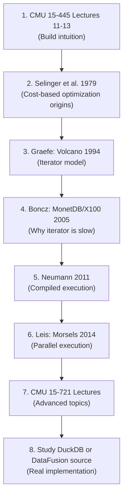

# Module 8: Join Algorithms & Query Execution -- Resources

## Foundational Papers

### Execution Models

1. **Volcano -- An Extensible and Parallel Query Evaluation System** (Graefe, 1994)
   - https://paperhub.s3.amazonaws.com/dace52a42c07f7f8348b08dc2b186061.pdf
   - The original paper defining the iterator (Open/Next/Close) execution model
   - Introduced the concept of exchange operators for parallelism
   - Every major RDBMS today uses some variant of this model

2. **MonetDB/X100: Hyper-Pipelining Query Execution** (Boncz, Zukowski, Nes, 2005)
   - https://www.cidrdb.org/cidr2005/papers/P19.pdf
   - The paper that introduced vectorized query execution
   - Showed that the iterator model wastes 90%+ of CPU cycles on overhead
   - Demonstrated 10-100x speedup using vectorized processing with columnar batches
   - Direct ancestor of DuckDB's execution engine

3. **Efficiently Compiling Efficient Query Plans for Modern Hardware** (Neumann, 2011)
   - https://www.vldb.org/pvldb/vol4/p539-neumann.pdf
   - Thomas Neumann's paper on data-centric code generation in HyPer
   - Introduced push-based, compiled query execution
   - Achieves near-hand-written-code performance through LLVM JIT compilation

4. **Morsel-Driven Parallelism: A NUMA-Aware Query Evaluation Framework** (Leis et al., 2014)
   - https://db.in.tum.de/~leis/papers/morsels.pdf
   - The definitive paper on modern parallel query execution
   - Introduced morsel-driven scheduling: work-stealing with NUMA awareness
   - Shows how to parallelize all operator types without explicit partitioning
   - Implemented in HyPer, influenced DuckDB, Velox, and Umbra

### Join Algorithms

5. **An Overview of Query Optimization in Relational Systems** (Chaudhuri, 1998)
   - https://web.stanford.edu/class/cs345d-01/rl/chaudhuri98.pdf
   - Comprehensive overview of query optimization including join algorithm selection
   - Covers cost models, search strategies, and interesting orders

6. **Main-Memory Hash Joins on Multi-Core CPUs: Tuning to the Underlying Hardware** (Balkesen et al., 2013)
   - https://www.systems.ethz.ch/sites/default/files/file/icde2013-hashjoins.pdf
   - Detailed comparison of partitioned vs. shared-nothing hash join on modern hardware
   - Shows that radix partitioning improves cache locality but has diminishing returns
   - Includes hardware-conscious hash join variants

7. **Multi-Core, Main-Memory Joins: Sort vs. Hash Revisited** (Balkesen et al., 2013)
   - https://15721.courses.cs.cmu.edu/spring2016/papers/balkesen-vldb2013.pdf
   - Revisits the sort-merge vs. hash join debate on modern hardware
   - Finds that sort-merge join is competitive with hash join on modern multi-core CPUs
   - SIMD-accelerated sorting narrows the gap significantly

8. **Access Path Selection in a Relational Database Management System** (Selinger et al., 1979)
   - https://courses.cs.duke.edu/compsci516/cps216/spring03/papers/selinger-etal-1979.pdf
   - The System R paper that introduced cost-based query optimization
   - First description of dynamic programming for join ordering
   - Introduced the concept of "interesting orders"
   - One of the most influential database papers ever written

### Bloom Filters and Semi-Join Optimization

9. **Space/Time Trade-offs in Hash Coding with Allowable Errors** (Bloom, 1970)
   - https://dl.acm.org/doi/10.1145/362686.362692
   - The original Bloom filter paper
   - Describes the probabilistic data structure used to accelerate hash joins

10. **Sideways Information Passing for Push-Based Query Processing** (Neumann and Radke, 2018)
    - Describes advanced techniques for passing summary information between operators
    - Covers Bloom filter pushdown, min/max propagation, and semi-join reducers

---

## Textbook References

11. **Database System Concepts** (Silberschatz, Korth, Sudarshan) -- Chapter 15: Query Processing
    - Comprehensive coverage of all join algorithms with cost formulas
    - External sorting algorithms
    - Evaluation of expressions and pipelining

12. **Database Management Systems** (Ramakrishnan, Gehrke) -- Chapter 14: A Typical Query Optimizer
    - Cost estimation and statistics
    - System R style optimization
    - Practical implementation guidance

13. **Database Internals** (Petrov) -- Chapter 16: Query Processing
    - Modern perspective on execution models
    - Covers vectorized and compiled execution
    - Good treatment of parallel query execution

14. **Readings in Database Systems (Red Book)** (Bailis, Hellerstein, Stonebraker)
    - http://www.redbook.io/
    - Curated collection of the most important database papers
    - Chapter 2 covers query processing and optimization

---

## Video Lectures and Talks

15. **CMU 15-721: Advanced Database Systems** (Andy Pavlo)
    - https://15721.courses.cs.cmu.edu/spring2024/
    - Lecture 11: Join Algorithms
    - Lecture 12: Query Execution (Part I) -- Iterator & Vectorized Models
    - Lecture 13: Query Execution (Part II) -- Compilation & Parallelism
    - World-class lectures with detailed slides and recordings

16. **CMU 15-445: Introduction to Database Systems** (Andy Pavlo)
    - https://15445.courses.cs.cmu.edu/fall2024/
    - Lecture 11: Joins
    - Lecture 12: Query Execution I
    - Lecture 13: Query Execution II
    - More introductory level, excellent for building intuition

17. **DuckDB: An Embeddable Analytical Database** (Mark Raasveldt, CppCon 2019)
    - https://www.youtube.com/watch?v=PFUZlNQIndo
    - How DuckDB implements vectorized execution
    - Practical discussion of columnar batch processing

18. **Push vs. Pull-Based Loop Fusion in Query Engines** (Shaikhha et al.)
    - Explains the tradeoffs between push-based and pull-based execution
    - Practical implications for JIT compilation

19. **Inside PostgreSQL: The Query Executor** (Bruce Momjian)
    - https://momjian.us/main/writings/pgsql/optimizer.pdf
    - How PostgreSQL's executor actually works
    - Includes code walkthroughs of nodeHashjoin.c and nodeMergejoin.c

---

## Blog Posts and Articles

20. **How We Built a Vectorized Execution Engine** (DuckDB Blog)
    - https://duckdb.org/2021/05/14/selection-pushdown.html
    - Practical insights into implementing vectorized execution
    - Selection vector optimization and filter pushdown

21. **Join Ordering Problem** (Use The Index, Luke)
    - https://use-the-index-luke.com/sql/join/nested-loops-join-n1-problem
    - Practical explanation of join algorithms from a performance perspective
    - Shows EXPLAIN output and real-world examples

22. **Hash Join Internals** (PostgreSQL Wiki)
    - https://wiki.postgresql.org/wiki/Hash_join
    - How PostgreSQL implements hash join including batch processing
    - Explains work_mem interaction and multi-batch hash join

23. **Understanding Hash Joins** (Lukas Eder / jOOQ Blog)
    - https://blog.jooq.org/say-no-to-venn-diagrams-when-explaining-joins/
    - Clear explanation of join types with correct diagrams (not Venn diagrams)

24. **Adaptive Query Processing** (Oracle Documentation)
    - https://docs.oracle.com/en/database/oracle/oracle-database/19/tgsql/query-transformations.html
    - How Oracle implements adaptive joins and runtime plan switching

---

## Source Code to Study

25. **PostgreSQL Executor Source**
    - `src/backend/executor/nodeHashjoin.c` -- Hash join state machine
    - `src/backend/executor/nodeMergejoin.c` -- Merge join state machine
    - `src/backend/executor/nodeNestloop.c` -- Nested loop join
    - `src/backend/executor/nodeAgg.c` -- Aggregation (hash and sort)
    - `src/backend/utils/sort/tuplesort.c` -- External sort
    - https://github.com/postgres/postgres/tree/master/src/backend/executor

26. **DuckDB Execution Engine**
    - https://github.com/duckdb/duckdb/tree/main/src/execution
    - Vectorized execution model implementation
    - Parallel hash join with morsel-driven scheduling
    - Columnar batch processing throughout

27. **Apache DataFusion**
    - https://github.com/apache/datafusion
    - Rust-based vectorized query engine
    - Clean, readable implementation of hash join, merge join, and sort
    - Good model for the project in this module

28. **SQLite Query Planner**
    - https://www.sqlite.org/queryplanner.html
    - Simple, well-documented query execution implementation
    - Uses nested loop join exclusively (no hash join or merge join)
    - Good starting point for understanding iterator model basics

29. **Velox (Meta)**
    - https://github.com/facebookincubator/velox
    - C++ vectorized execution engine
    - Used in production at Meta (Presto, Spark integration)
    - Advanced features: adaptive filter ordering, Bloom filter pushdown

---

## Benchmarks and Datasets

30. **TPC-H Benchmark**
    - https://www.tpc.org/tpch/
    - Standard benchmark for analytical query processing
    - 22 queries covering various join patterns, aggregations, and sorts
    - Use `dbgen` to generate data at various scale factors

31. **Join Order Benchmark (JOB)**
    - https://github.com/gregrahn/join-order-benchmark
    - 113 queries over the IMDB dataset
    - Specifically designed to stress-test join ordering decisions
    - Real-world data with complex correlations that break optimizer estimates

32. **Star Schema Benchmark (SSB)**
    - https://www.cs.umb.edu/~poneil/StarSchemaB.PDF
    - Derived from TPC-H, focused on star schema queries
    - Good for testing Bloom filter and semi-join optimizations

---

## Related Systems and Projects

33. **BustTub** (CMU Educational Database)
    - https://github.com/cmu-db/bustub
    - Teaching database system used in CMU 15-445
    - Implements iterator-based execution with hash join and nested loop join
    - C++ codebase with well-structured assignments

34. **RisingLight**
    - https://github.com/risinglightdb/risinglight
    - Educational database written in Rust
    - Implements vectorized execution, hash join, and sort-merge join
    - Clean, readable codebase -- good reference for the project

35. **miniob** (OceanBase Educational DB)
    - https://github.com/oceanbase/miniob
    - Simple relational database for learning
    - Includes iterator-based execution engine

---

## Summary: Recommended Reading Order

For a focused study path through this material:

| Priority | Resource | Time Investment |
|----------|----------|-----------------|
| Essential | CMU 15-445 Join & Execution lectures | 3-4 hours |
| Essential | Selinger et al. (System R optimizer) | 2 hours |
| Essential | MonetDB/X100 paper | 2 hours |
| Important | Volcano paper (Graefe 1994) | 2 hours |
| Important | Morsels paper (Leis 2014) | 2 hours |
| Important | PostgreSQL executor source code | 3-4 hours |
| Useful | Neumann 2011 (compiled execution) | 2 hours |
| Useful | Balkesen hash join papers | 2 hours |
| Bonus | DuckDB / DataFusion source code | 4+ hours |
| Bonus | Join Order Benchmark experiments | 4+ hours |
