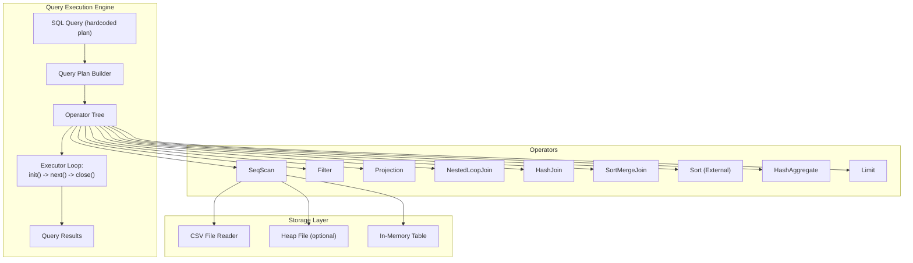
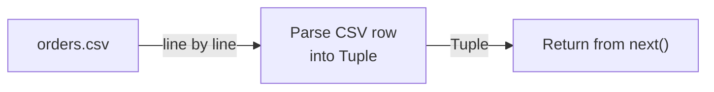
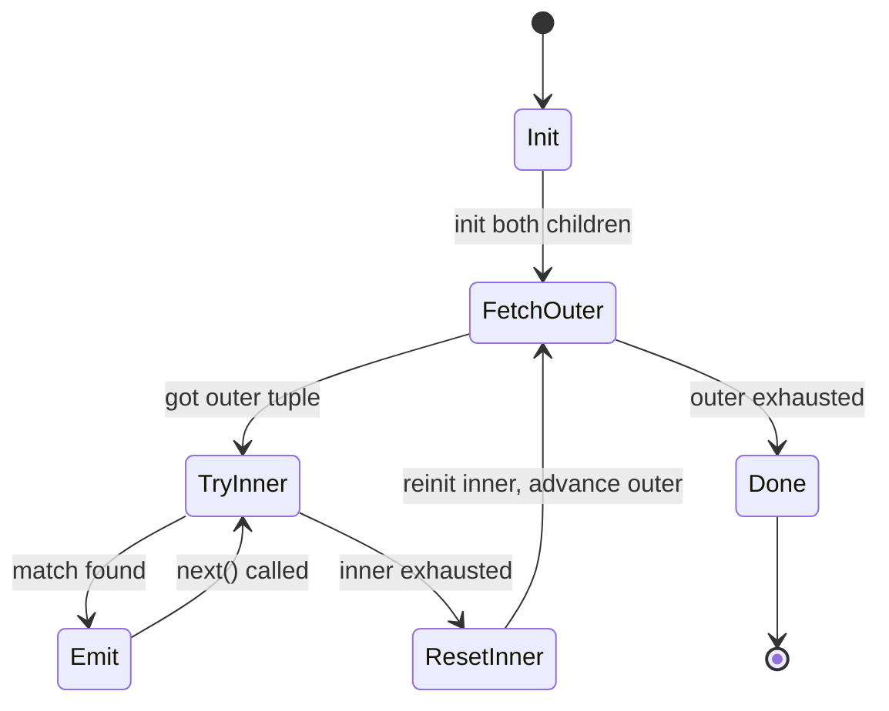
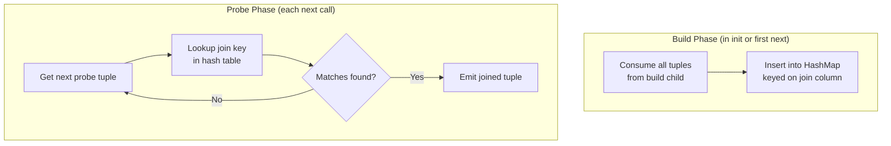
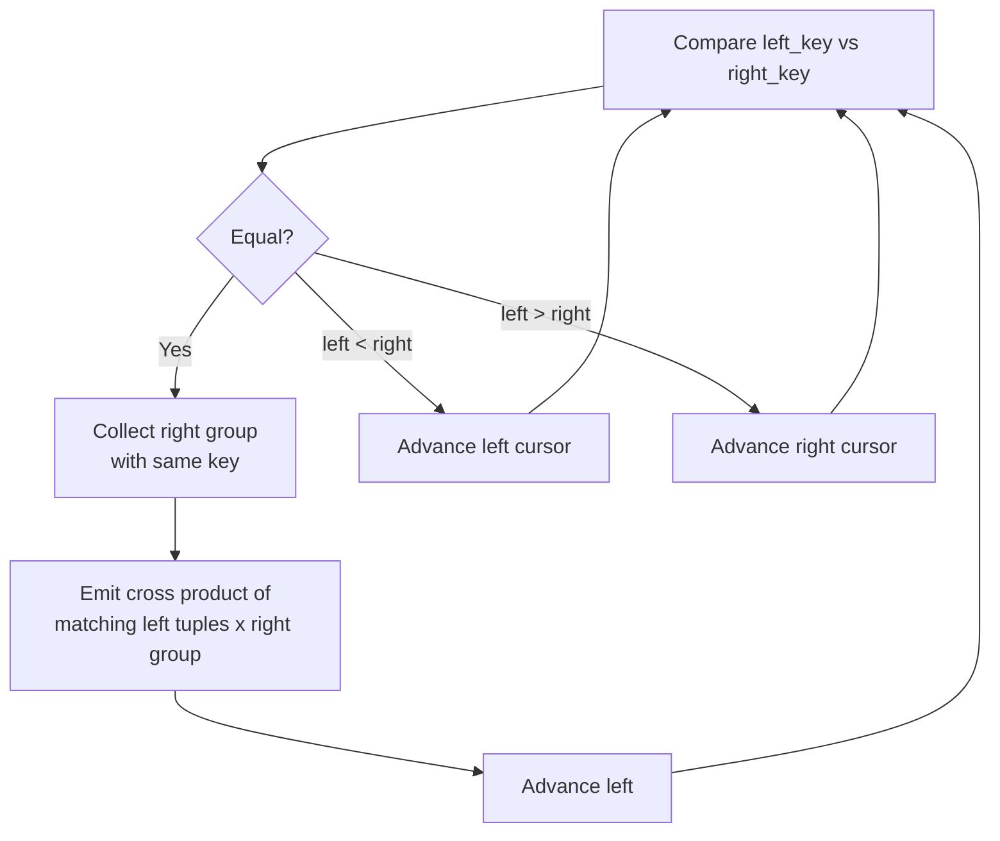
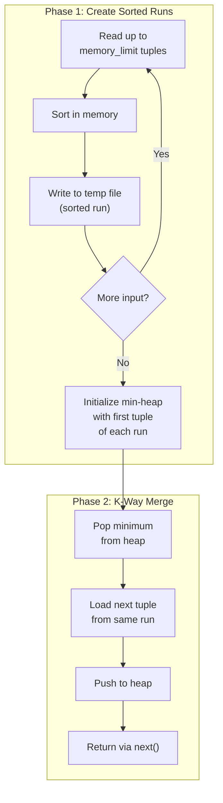
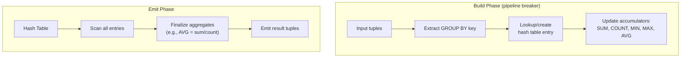
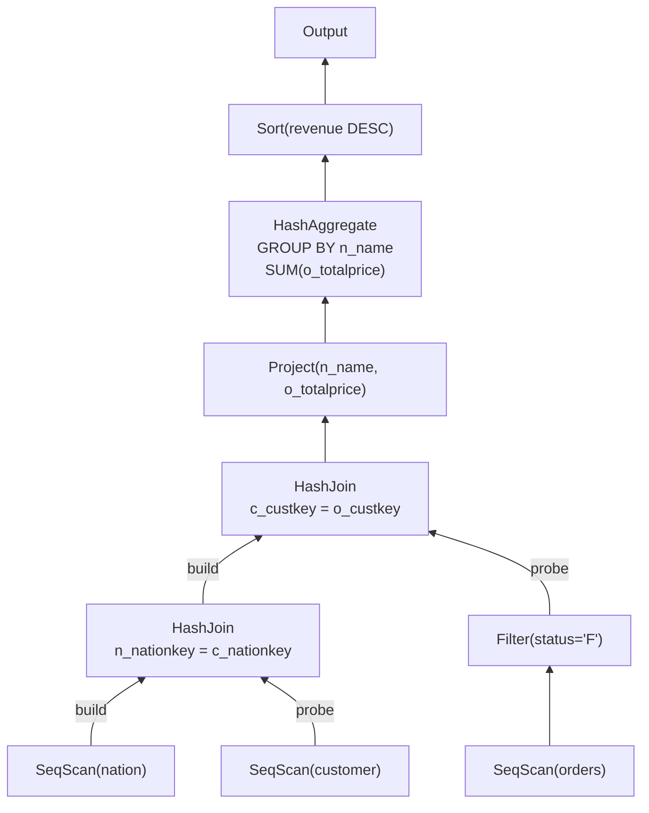
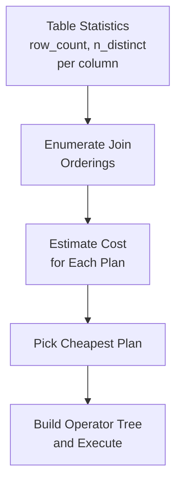

# Module 8: Join Algorithms & Query Execution -- Project

## Project: Build a Query Execution Engine

In this project, you will build a complete query execution engine that supports multiple join algorithms, aggregation, sorting, and the iterator execution model. By the end, you will be able to run TPC-H-style queries through your engine and benchmark different join strategies against each other.

---

## Architecture Overview



---

## Phase 1: Foundation -- The Operator Interface and Data Types

### 1.1 Define Core Data Types

```rust
/// Supported value types
#[derive(Clone, Debug, PartialEq, PartialOrd)]
enum Value {
    Int(i64),
    Float(f64),
    Str(String),
    Bool(bool),
    Null,
}

/// A tuple is a vector of values
type Tuple = Vec<Value>;

/// Schema describes the columns of a relation
struct Schema {
    columns: Vec<ColumnDef>,
}

struct ColumnDef {
    name: String,
    data_type: DataType,
}

enum DataType {
    Integer,
    Float,
    Text,
    Boolean,
}
```

### 1.2 The Operator Trait

```rust
trait Operator {
    fn init(&mut self) -> Result<()>;
    fn next(&mut self) -> Result<Option<Tuple>>;
    fn close(&mut self) -> Result<()>;
    fn schema(&self) -> &Schema;
}
```

### 1.3 The Executor

```rust
fn execute(mut root: Box<dyn Operator>) -> Result<Vec<Tuple>> {
    let mut results = Vec::new();
    root.init()?;
    while let Some(tuple) = root.next()? {
        results.push(tuple);
    }
    root.close()?;
    Ok(results)
}

fn execute_and_print(mut root: Box<dyn Operator>) -> Result<()> {
    let schema = root.schema().clone();
    // Print header
    for col in &schema.columns {
        print!("{:<20}", col.name);
    }
    println!();
    println!("{}", "-".repeat(20 * schema.columns.len()));

    root.init()?;
    let mut count = 0;
    while let Some(tuple) = root.next()? {
        for val in &tuple {
            print!("{:<20}", val);
        }
        println!();
        count += 1;
    }
    root.close()?;
    println!("\n({} rows)", count);
    Ok(())
}
```

**Deliverable:** Core types compile. You can create Value instances, build schemas, and the executor loop compiles.

---

## Phase 2: Leaf and Unary Operators

### 2.1 SeqScan -- Reading from CSV Files

Build a sequential scan operator that reads tuples from a CSV file:



Implementation checklist:
- [ ] Open CSV file in `init()`
- [ ] Parse one line per `next()` call, converting strings to typed Values
- [ ] Return `None` when EOF is reached
- [ ] Close file handle in `close()`
- [ ] Support type inference from schema or header hints

### 2.2 MemoryScan -- Reading from In-Memory Data

For testing, implement a scan over a `Vec<Tuple>`:

```rust
struct MemoryScan {
    data: Vec<Tuple>,
    cursor: usize,
    schema: Schema,
}
```

This is trivial but essential for unit testing.

### 2.3 Filter Operator


Implementation checklist:
- [ ] Accept a predicate function `Fn(&Tuple) -> bool`
- [ ] In `next()`, pull from child until a matching tuple or EOF
- [ ] Support compound predicates (AND, OR, NOT)
- [ ] Test with various selectivities (0%, 50%, 100%)

### 2.4 Projection Operator

Implementation checklist:
- [ ] Accept a list of expressions (column indices or computed expressions)
- [ ] Transform each input tuple into an output tuple with the projected columns
- [ ] Update the schema to reflect the output columns
- [ ] Support simple expressions: column reference, arithmetic, string concatenation

**Deliverable:** You can execute `SELECT name, price FROM products WHERE price > 100` by composing SeqScan -> Filter -> Projection.

---

## Phase 3: Join Operators

This is the core of the project. Implement all three join algorithms.

### 3.1 Nested Loop Join



Implementation checklist:
- [ ] Support arbitrary join predicates (not just equi-join)
- [ ] Inner child must support re-initialization (re-scan)
- [ ] Handle the case where multiple inner tuples match one outer tuple
- [ ] Concatenate outer and inner tuples in the output
- [ ] Test with empty tables, single-row tables, and many-to-many joins

### 3.2 Hash Join



Implementation checklist:
- [ ] Build the hash table lazily (on first `next()` call)
- [ ] Use `HashMap<Value, Vec<Tuple>>` for the hash table
- [ ] Handle multiple matches per probe tuple (iterate through the vector)
- [ ] Only support equi-join predicates
- [ ] Track and report hash table size (memory usage)
- [ ] Test with duplicate keys, null keys, and empty build sides

**Stretch goal:** Implement Grace Hash Join with on-disk partitions for data larger than a configurable memory limit.

### 3.3 Sort-Merge Join

Implementation checklist:
- [ ] Require sorted inputs (compose with Sort operator)
- [ ] Handle the "group" case: multiple tuples with the same join key on both sides
- [ ] Advance cursors correctly: advance the side with the smaller key
- [ ] Handle the "backup" case when multiple outer tuples match the same inner group
- [ ] Test with unique keys, many duplicates, and disjoint key ranges



**Deliverable:** You can run a two-table equi-join using all three algorithms and verify they produce identical results.

---

## Phase 4: Sort Operator

### 4.1 In-Memory Sort

Start with a simple in-memory sort:

```rust
struct Sort {
    child: Box<dyn Operator>,
    sort_keys: Vec<(usize, SortOrder)>,  // (column_index, ASC/DESC)
    buffer: Vec<Tuple>,
    cursor: usize,
    sorted: bool,
    schema: Schema,
}
```

### 4.2 External Sort (Two-Phase Multiway Merge)



Implementation checklist:
- [ ] Configurable memory limit (number of tuples or bytes)
- [ ] Phase 1: read chunks, sort in memory, write to temporary files
- [ ] Phase 2: use a min-heap (BinaryHeap) to merge K sorted runs
- [ ] Serialize/deserialize tuples to/from temp files
- [ ] Clean up temp files in `close()`
- [ ] Test with data smaller than memory (trivial case) and larger than memory

**Deliverable:** You can sort a 1-million-row CSV file with a 100K-tuple memory limit.

---

## Phase 5: Aggregation

### 5.1 HashAggregate



Implementation checklist:
- [ ] Support GROUP BY on one or more columns
- [ ] Implement accumulators for SUM, COUNT, AVG, MIN, MAX
- [ ] Handle COUNT(*) (no specific column)
- [ ] Emit one tuple per group after all input is consumed
- [ ] Test with 0 groups (empty input), 1 group (no GROUP BY), many groups

### 5.2 Sort-Based Aggregate (Bonus)

If the input is sorted on the GROUP BY columns, aggregation can be done in O(1) memory:
- Read tuples sequentially
- When the group key changes, emit the completed group and start a new one

**Deliverable:** You can run `SELECT department, COUNT(*), AVG(salary) FROM employees GROUP BY department`.

---

## Phase 6: Limit Operator

A simple but important operator:

```rust
struct Limit {
    child: Box<dyn Operator>,
    max_rows: usize,
    returned: usize,
    schema: Schema,
}

impl Operator for Limit {
    fn next(&mut self) -> Result<Option<Tuple>> {
        if self.returned >= self.max_rows {
            return Ok(None);
        }
        let tuple = self.child.next()?;
        if tuple.is_some() {
            self.returned += 1;
        }
        Ok(tuple)
    }
}
```

---

## Phase 7: TPC-H Style Queries

Now put it all together by running complex queries. Create test data that mirrors the TPC-H schema:

### 7.1 Test Data Generation

Generate CSV files for:
- `customer.csv`: (c_custkey, c_name, c_nationkey, c_acctbal)
- `orders.csv`: (o_orderkey, o_custkey, o_orderstatus, o_totalprice, o_orderdate)
- `lineitem.csv`: (l_orderkey, l_partkey, l_suppkey, l_quantity, l_extendedprice, l_discount)
- `nation.csv`: (n_nationkey, n_name, n_regionkey)
- `supplier.csv`: (s_suppkey, s_name, s_nationkey)

Generate at least 100K orders and 600K line items for meaningful benchmarks.

### 7.2 Query Examples

**Query 1: Revenue by nation (3-way join + aggregate)**

```sql
SELECT n.n_name, SUM(o.o_totalprice) as revenue
FROM nation n
JOIN customer c ON n.n_nationkey = c.c_nationkey
JOIN orders o ON c.c_custkey = o.o_custkey
WHERE o.o_orderstatus = 'F'
GROUP BY n.n_name
ORDER BY revenue DESC;
```

Build the plan:



**Query 2: Top customers by order count (2-way join + aggregate + sort + limit)**

```sql
SELECT c.c_name, COUNT(*) as order_count
FROM customer c
JOIN orders o ON c.c_custkey = o.o_custkey
GROUP BY c.c_name
ORDER BY order_count DESC
LIMIT 10;
```

**Query 3: Supplier parts pricing (3-way join with filter)**

```sql
SELECT s.s_name, SUM(l.l_extendedprice * (1 - l.l_discount)) as revenue
FROM supplier s
JOIN lineitem l ON s.s_suppkey = l.l_suppkey
JOIN orders o ON l.l_orderkey = o.o_orderkey
WHERE o.o_orderdate >= '1995-01-01'
GROUP BY s.s_name
ORDER BY revenue DESC
LIMIT 20;
```

---

## Phase 8: Benchmarking Join Strategies

### 8.1 Benchmark Framework

For each query, run it three times with each join algorithm and measure:
- Total execution time (wall clock)
- Number of tuples processed at each operator
- Memory usage (peak hash table size)
- Number of comparisons

```rust
struct BenchmarkResult {
    algorithm: String,
    query: String,
    execution_time_ms: f64,
    tuples_processed: usize,
    peak_memory_bytes: usize,
    result_count: usize,
}
```

### 8.2 Experiments to Run

```mermaid
flowchart TD
    subgraph "Experiment 1: Scale Factor"
        E1["Vary data size:<br>10K, 50K, 100K, 500K, 1M rows"]
        E1 --> E1R["Measure time for each<br>join algorithm"]
    end
    subgraph "Experiment 2: Selectivity"
        E2["Vary filter selectivity:<br>1%, 10%, 50%, 100%"]
        E2 --> E2R["Measure which join<br>benefits most from<br>selective filters"]
    end
    subgraph "Experiment 3: Key Distribution"
        E3["Vary key distribution:<br>uniform, zipfian,<br>single-value"]
        E3 --> E3R["Measure impact of<br>skew on hash join<br>vs sort-merge"]
    end
    subgraph "Experiment 4: Memory Limit"
        E4["Vary memory limit:<br>1K, 10K, 100K tuples"]
        E4 --> E4R["Measure external sort<br>overhead and hash<br>join spill behavior"]
    end
```



**Expected results:**

| Scenario | Winner |
|----------|--------|
| Large tables, equi-join, uniform keys | Hash Join |
| Pre-sorted data (via index) | Sort-Merge Join |
| Small outer table + indexed inner | Index Nested Loop Join |
| Highly skewed keys | Sort-Merge Join |
| Very small tables (< 100 rows) | Nested Loop Join |
| Query needs ORDER BY on join key | Sort-Merge Join |

### 8.3 Visualization

Generate a results CSV and plot:
- Execution time vs. data size (log-log plot) for each algorithm
- Execution time vs. selectivity for each algorithm
- Memory usage vs. data size for hash join

---

## Stretch Goals

### S1: Vectorized Execution

Modify the operator interface to process batches of 1024 tuples:

```rust
trait VectorizedOperator {
    fn init(&mut self) -> Result<()>;
    fn next_batch(&mut self) -> Result<Option<Batch>>;
    fn close(&mut self) -> Result<()>;
}

struct Batch {
    columns: Vec<ColumnVector>,
    selection: Vec<usize>,
    len: usize,
}

enum ColumnVector {
    Int(Vec<i64>),
    Float(Vec<f64>),
    Str(Vec<String>),
}
```

Compare performance of iterator vs. vectorized execution on aggregation-heavy queries.

### S2: Parallel Hash Join

Implement a parallel hash join using threads:
- Partition the build relation across N threads
- Each thread builds a thread-local hash table
- Merge hash tables (or use a shared concurrent hash table)
- Partition the probe relation and probe in parallel

### S3: Bloom Filter Optimization

Add Bloom filter construction after the hash join build phase. Push the filter down to the scan operator. Measure the reduction in tuples processed.

### S4: Query Plan Optimizer

Build a simple cost-based optimizer that:
- Enumerates join orderings for 2-4 tables
- Estimates cardinalities using simple statistics (row count, distinct values)
- Picks the cheapest plan



---

## Grading Rubric

| Component | Points | Criteria |
|-----------|--------|----------|
| Operator interface + SeqScan | 10 | Correctly reads data, init/next/close lifecycle |
| Filter + Projection | 10 | Correct predicate evaluation, schema transformation |
| Nested Loop Join | 15 | Handles all cases (empty, 1-1, 1-many, many-many) |
| Hash Join | 20 | Correct build/probe, handles duplicates and nulls |
| Sort-Merge Join | 20 | Correct merge with groups, handles duplicates |
| External Sort | 10 | Works for data larger than configured memory limit |
| Hash Aggregate | 10 | Correct SUM, COUNT, AVG with GROUP BY |
| TPC-H queries | 15 | At least 2 multi-join queries execute correctly |
| Benchmarks | 10 | Comparative timing of at least 2 join algorithms |
| Code quality | 10 | Clean code, tests, documentation |
| **Stretch goals** | **+20** | Each stretch goal is worth +5 points |
| **Total** | **130+** | |

---

## Suggested Timeline

| Week | Milestone |
|------|-----------|
| 1 | Core types, SeqScan, Filter, Projection working |
| 2 | Nested Loop Join + Hash Join implemented and tested |
| 3 | Sort-Merge Join + External Sort |
| 4 | HashAggregate + Limit + TPC-H queries |
| 5 | Benchmarking + stretch goals + final report |

---

## Tips

1. **Start with MemoryScan for testing.** CSV parsing is tedious. Get your operators working with in-memory data first, then add CSV support.

2. **Test join algorithms against each other.** For the same input, NLJ, Hash Join, and Sort-Merge Join must produce the same result set (possibly in different order). Use this as your primary correctness check.

3. **Print operator statistics.** Add counters for tuples read, tuples emitted, and comparisons made. This helps debug correctness issues and provides data for benchmarking.

4. **Handle edge cases early.** Empty tables, single-row tables, tables with all-matching keys, and tables with no matching keys are all important test cases.

5. **Use Rust's `BinaryHeap` for the external sort merge.** It provides an efficient min-heap (use `Reverse` wrapper for min-heap behavior).
