# Module 8: Join Algorithms & Query Execution -- Core Teaching Content

## 1. Why Join Implementation Matters

Joins are the **most expensive operation** in relational query processing. A simple two-table join on tables with 1 million rows each can produce up to 10^12 intermediate tuples in the worst case (Cartesian product). The choice of join algorithm can mean the difference between a query completing in milliseconds or hours.

Consider this innocent-looking SQL:

```sql
SELECT o.order_id, c.name, p.product_name
FROM orders o
JOIN customers c ON o.customer_id = c.id
JOIN products p ON o.product_id = p.id
WHERE o.order_date > '2025-01-01';
```

If `orders` has 10M rows, `customers` has 1M rows, and `products` has 100K rows, the query optimizer must decide:

- Which **join algorithm** to use for each join
- What **join order** to evaluate (left-deep, right-deep, bushy)
- Whether to use **indexes** to accelerate the join
- How to **pipeline** results between operators

The number of possible join orderings grows factorially -- for *n* tables, there are *n!* possible left-deep orderings alone. This module focuses on the **physical join algorithms** that the executor uses once the optimizer has chosen a plan.

---

## 2. Nested Loop Join

The nested loop join (NLJ) is the simplest and most general join algorithm. It works for **any join predicate**, including inequality joins, theta joins, and even arbitrary boolean expressions -- not just equi-joins.

### 2.1 Simple (Naive) Nested Loop Join

```
for each tuple r in R:           -- outer relation
    for each tuple s in S:       -- inner relation
        if theta(r, s):          -- evaluate join predicate
            emit (r, s)
```

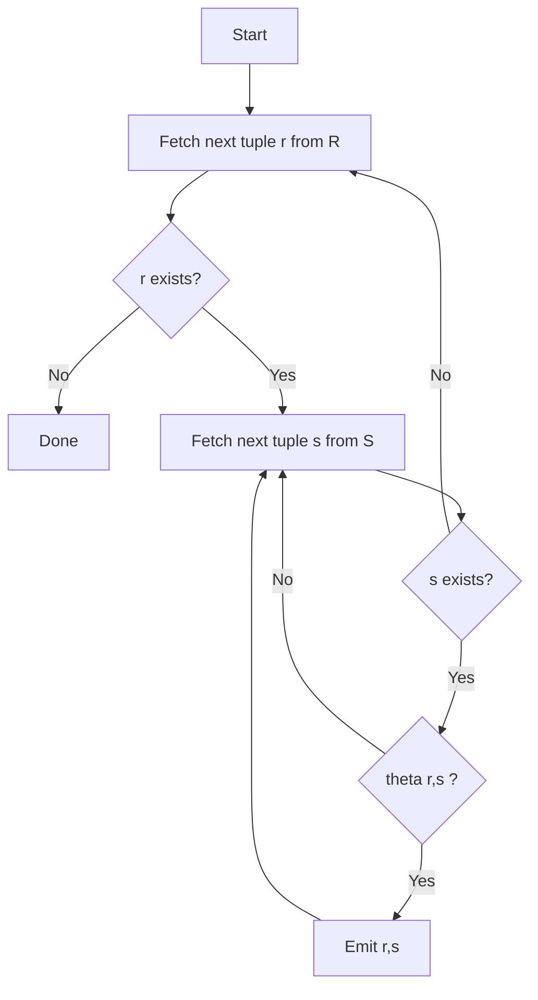

**Cost analysis:**

| Component | I/O Cost |
|-----------|----------|
| Scan outer R | M pages |
| Scan inner S (once per R tuple) | p_R * N pages |
| **Total** | **M + p_R * N** |

Where:
- M = number of pages in R
- N = number of pages in S
- p_R = number of tuples in R

If R has 1000 pages with 100 tuples/page (100K tuples) and S has 500 pages, the cost is:

`1000 + 100,000 * 500 = 50,001,000 I/Os`

At 0.1ms per random I/O, that is **5000 seconds** -- clearly unacceptable.

### 2.2 Block (Page) Nested Loop Join

Instead of iterating tuple-by-tuple over the outer relation, we iterate **page-by-page**:

```
for each page P_r in R:
    for each page P_s in S:
        for each tuple r in P_r:
            for each tuple s in P_s:
                if theta(r, s):
                    emit (r, s)
```

**Cost: M + M * N**

Using the same numbers: `1000 + 1000 * 500 = 501,000 I/Os` -- a **100x improvement**.

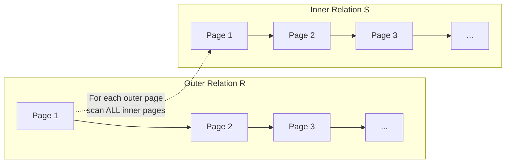

### 2.3 Block Nested Loop Join (with B buffer pages)

If we have B buffer pages available, we can use B-2 pages for the outer relation, 1 page for the inner, and 1 page for output:

```
for each chunk of (B-2) pages from R:
    for each page P_s in S:
        for each tuple r in the chunk:
            for each tuple s in P_s:
                if theta(r, s):
                    emit (r, s)
```

**Cost: M + ceil(M / (B-2)) * N**

With B=102 buffer pages: `1000 + ceil(1000/100) * 500 = 1000 + 5000 = 6000 I/Os`

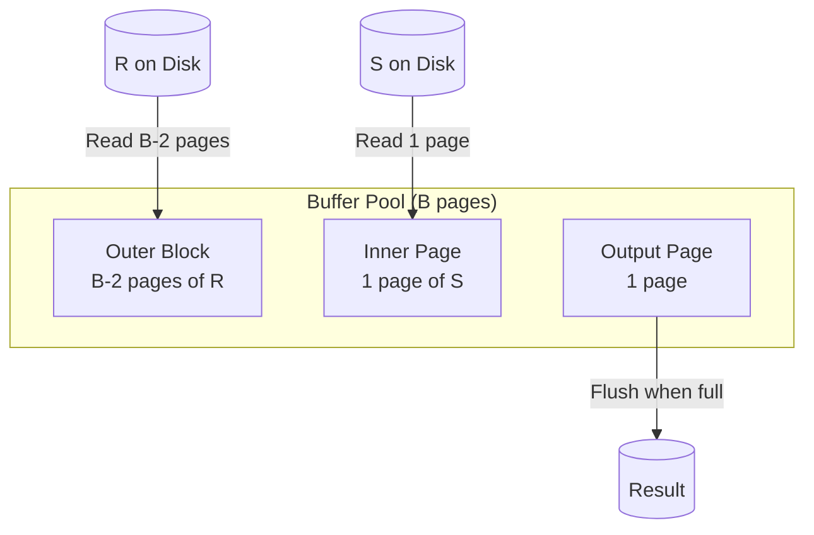

**Key insight:** Always make the **smaller relation** the outer relation. If R has 1000 pages and S has 500 pages with B=102:
- R outer: `1000 + 10 * 500 = 6,000`
- S outer: `500 + 5 * 1000 = 5,500` -- better!

### 2.4 Index Nested Loop Join

If an index exists on the join attribute of the inner relation, we can replace the linear scan with an index lookup:

```
for each tuple r in R:
    for each tuple s in Index_S(r.join_attr):
        emit (r, s)
```

**Cost: M + p_R * C** where C is the cost of one index lookup (typically 2-4 I/Os for a B+ tree).

Using our example: `1000 + 100,000 * 3 = 301,000 I/Os` -- far better than simple NLJ, competitive with block NLJ for selective joins.

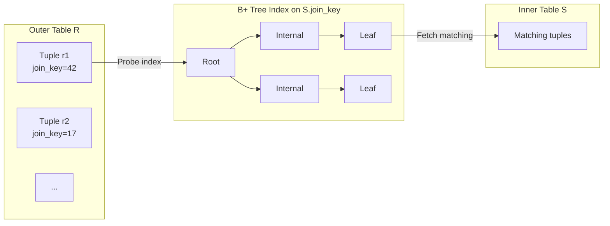

---

## 3. Sort-Merge Join

Sort-merge join exploits the fact that **sorted data can be merged in linear time**. It is the algorithm of choice when:
- One or both inputs are already sorted (e.g., from an index scan or a preceding ORDER BY)
- The result must be sorted on the join key
- The join is an equi-join or a range join

### 3.1 Algorithm

**Phase 1: Sort** both relations on the join attribute.

**Phase 2: Merge** the sorted relations.

```
Sort R on join attribute
Sort S on join attribute
r = first tuple of R
s = first tuple of S
while r != EOF and s != EOF:
    if r.key < s.key:
        advance r
    elif r.key > s.key:
        advance s
    else:  -- r.key == s.key
        -- Collect all tuples in S with the same key
        mark s_start = s
        while s != EOF and s.key == r.key:
            emit(r, s)
            advance s
        -- Check next r tuples with the same key
        if next r has same key:
            reset s to s_start
        advance r
```

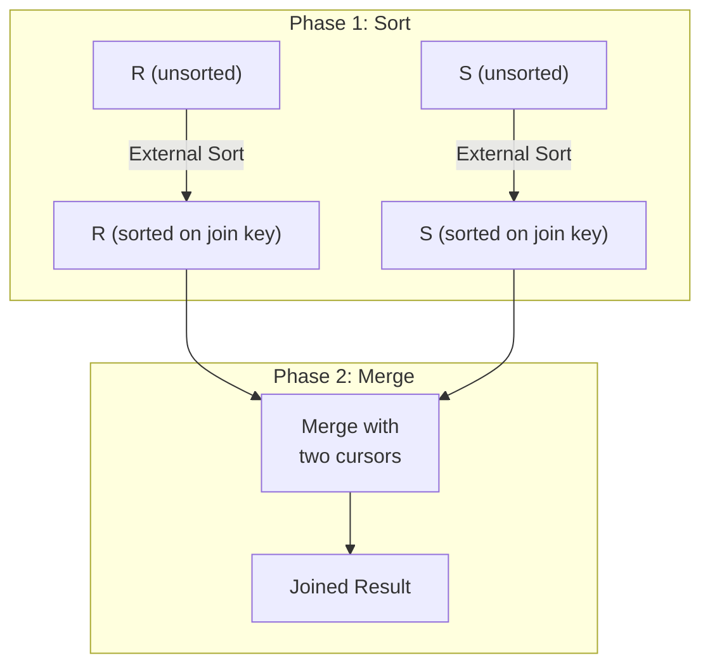

### 3.2 External Sort (Two-Phase Multiway Merge Sort)

When data does not fit in memory, we use **external sorting**:

**Phase 1 -- Create sorted runs:**
1. Read B pages of data into memory
2. Sort them in memory (e.g., quicksort)
3. Write the sorted run to disk
4. Repeat until all data is processed

This creates ceil(N/B) sorted runs.

**Phase 2 -- Merge runs:**
1. Allocate 1 input buffer page per run + 1 output buffer page
2. Load the first page of each run into its buffer
3. Repeatedly pick the smallest key across all runs, write to output
4. When an input buffer is exhausted, load the next page of that run

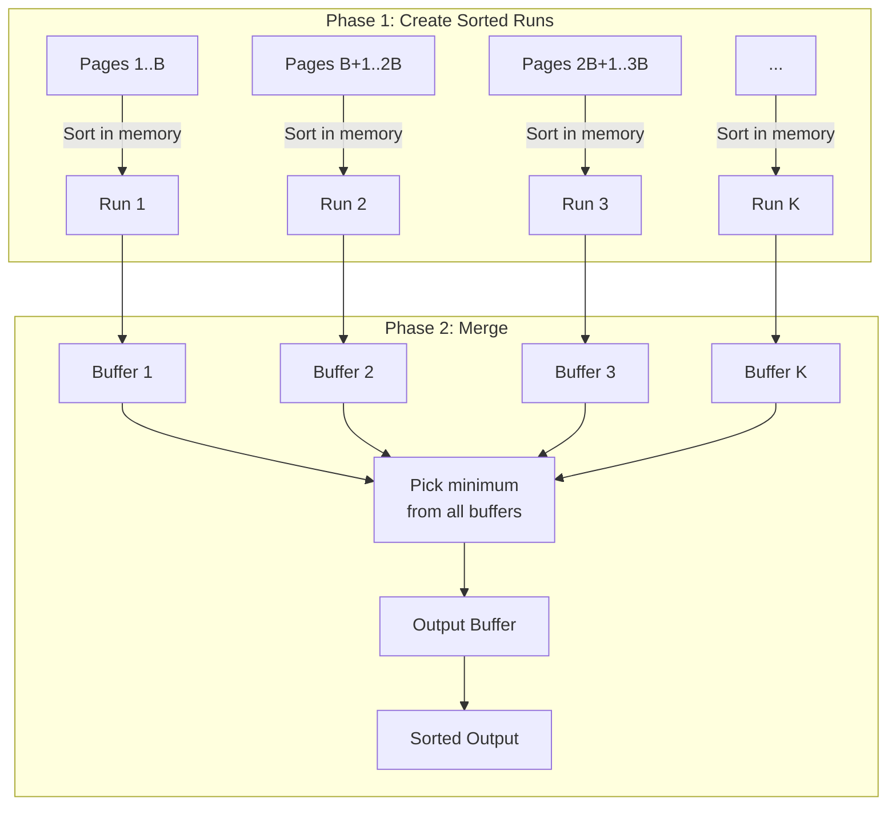

**Constraint:** We need B >= K+1 where K = ceil(N/B). So we can sort files of up to B*(B-1) pages in two passes.

With B=101 buffer pages, we can sort up to 101*100 = 10,100 pages in two passes, or about 80MB at 8KB pages.

For larger files, we need **multi-pass** external sort (ceil(N/B) > B-1), where each pass reduces the number of runs by a factor of (B-1).

### 3.3 Sort-Merge Join Cost

| Component | I/O Cost |
|-----------|----------|
| Sort R (2-pass) | 2 * 2 * M = 4M |
| Sort S (2-pass) | 2 * 2 * N = 4N |
| Merge phase | M + N |
| **Total** | **5M + 5N** (with 2-pass sort) |

General formula with P-pass sort: **(2P+1)(M+N)**

For our running example (M=1000, N=500): `5*1000 + 5*500 = 7,500 I/Os`

This is significantly better than nested loop join for large relations and comparable to block NLJ with generous buffers.

---

## 4. Hash Join

Hash join is the workhorse for **equi-joins** in modern database systems. It only works when the join predicate is an equality comparison.

### 4.1 Simple (In-Memory) Hash Join

**Build phase:** Scan the smaller relation (build side) and insert each tuple into an in-memory hash table, keyed on the join attribute.

**Probe phase:** Scan the larger relation (probe side) and for each tuple, probe the hash table for matching tuples.

```
-- Build Phase
hash_table = {}
for each tuple s in S:  -- S is smaller (build side)
    hash_table.insert(h(s.join_key), s)

-- Probe Phase
for each tuple r in R:  -- R is larger (probe side)
    for each tuple s in hash_table.lookup(h(r.join_key)):
        if r.join_key == s.join_key:
            emit(r, s)
```

**Cost: M + N** (just reading both relations once) -- but only works if the smaller relation fits in memory.

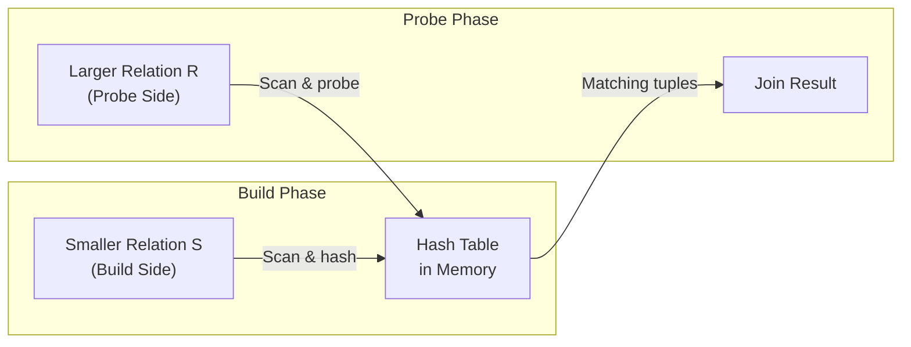

### 4.2 Grace Hash Join (Partition-Based)

When neither relation fits in memory, we use **Grace Hash Join** (named after the GRACE database machine, 1985):

**Phase 1 -- Partition:** Use a hash function h1 to partition **both** relations into B-1 buckets. Tuples with the same join key will end up in the same partition.

**Phase 2 -- Build & Probe per partition:** For each partition i, build a hash table from S_i (using a **different** hash function h2) and probe with R_i.

```
-- Partition Phase
for each tuple r in R:
    write r to partition h1(r.join_key) % (B-1)
for each tuple s in S:
    write s to partition h1(s.join_key) % (B-1)

-- Build & Probe Phase
for i in 0..B-2:
    build hash table from S_i using h2
    for each tuple r in R_i:
        probe hash table with h2(r.join_key)
        for each match:
            emit(r, s)
```

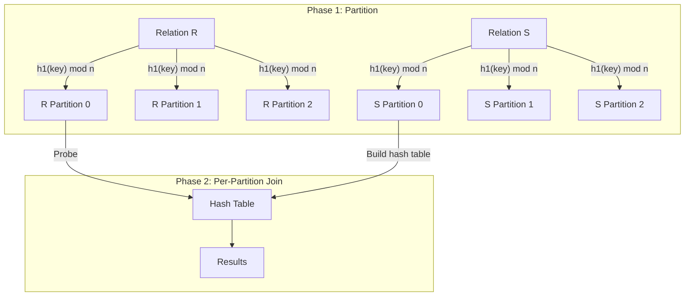

**Cost: 3(M + N)** -- each relation is read once (partition), written once (to partition files), and read once more (build/probe).

For our example: `3 * (1000 + 500) = 4,500 I/Os` -- the best so far.

**Requirement:** Each partition of the smaller relation S must fit in memory: each S_i must be <= B-2 pages. So we need `B > sqrt(N_S) + 1` where N_S is the number of pages in S (assuming uniform distribution).

### 4.3 Hybrid Hash Join

Hybrid hash join is an optimization over Grace hash join. The insight: if we have enough memory, we can keep **one partition of S in memory** during the partition phase and immediately join it with matching R tuples -- saving one read and one write for that partition.

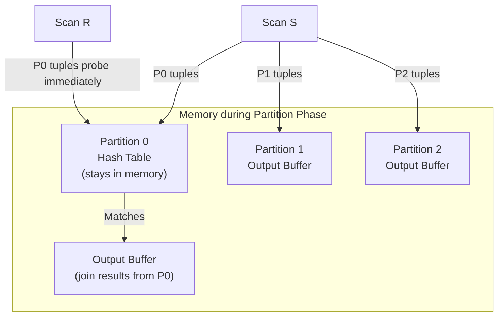

If we can keep fraction *f* of S in memory, the cost is:

**Cost = (M + N) + 2(1-f)(M + N) = (3 - 2f)(M + N)**

When f=0, this degenerates to Grace Hash Join (3(M+N)). When f=1, it becomes simple hash join (M+N).

### 4.4 Recursive Partitioning

If a partition is still too large to fit in memory after the first partitioning pass, we **recursively partition** it using a different hash function. This handles extreme data skew.

---

## 5. Cost Comparison Summary

| Algorithm | I/O Cost | Memory Req. | Join Types |
|-----------|----------|-------------|------------|
| Simple NLJ | M + p_R * N | 3 pages | Any |
| Page NLJ | M + M * N | 3 pages | Any |
| Block NLJ (B buffers) | M + ceil(M/(B-2)) * N | B pages | Any |
| Index NLJ | M + p_R * C | 3 pages + index | Any (with index) |
| Sort-Merge (2-pass) | 5(M + N) | sqrt(M)+sqrt(N) | Equi/Range |
| Grace Hash | 3(M + N) | sqrt(N_S) | Equi only |
| Hybrid Hash | (3-2f)(M+N) | > sqrt(N_S) | Equi only |

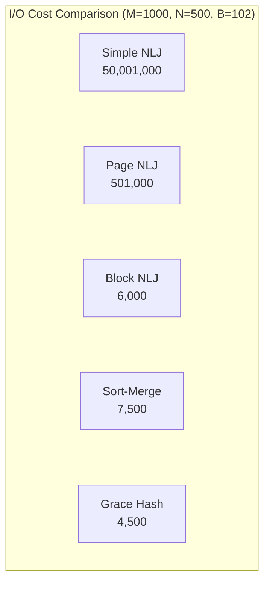

---

## 6. When to Use Which Join Algorithm

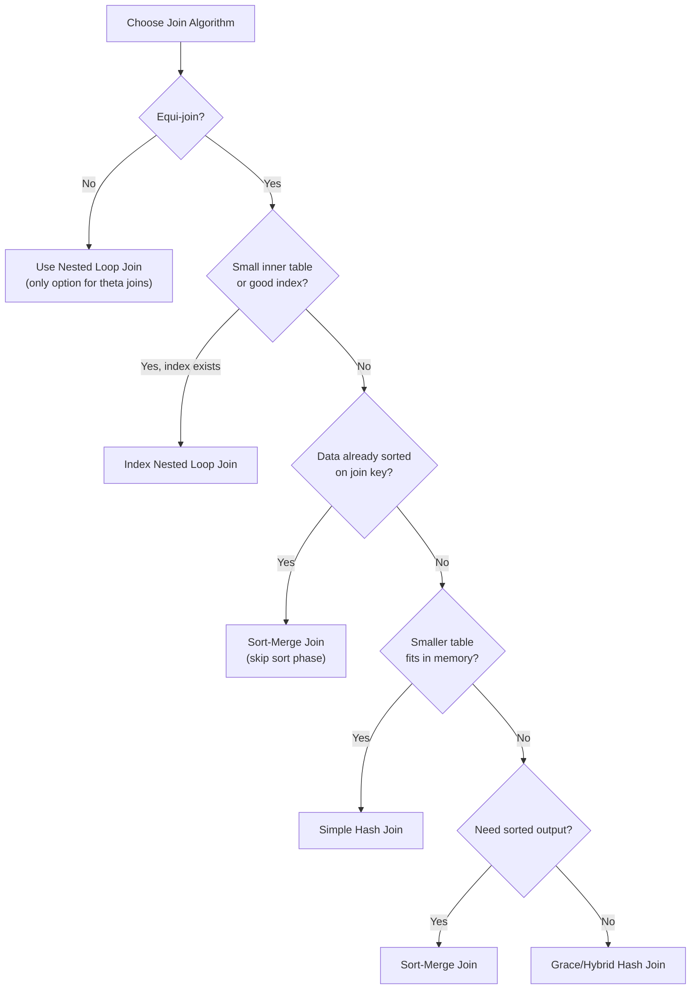

### Practical guidelines:

1. **Hash join** is the default choice for equi-joins in OLAP workloads. PostgreSQL, MySQL 8+, Oracle, and SQL Server all favor hash join for large unsorted data.

2. **Sort-merge join** wins when inputs are pre-sorted (index scans) or when the result must be sorted (ORDER BY on join key).

3. **Index nested loop join** excels when the outer relation is small and a selective index exists on the inner relation. This is the typical OLTP join pattern.

4. **Block nested loop join** is the fallback when no index exists and the join is not equi-join.

---

## 7. Semi-Joins, Anti-Joins, and Outer Joins

### 7.1 Semi-Join

A semi-join returns tuples from the left relation that have **at least one match** in the right relation. It corresponds to `EXISTS` or `IN` subqueries:

```sql
SELECT * FROM orders o WHERE EXISTS (
    SELECT 1 FROM returns r WHERE r.order_id = o.id
);
```

Key optimization: once a match is found, **stop probing** for that outer tuple. This makes hash semi-join significantly faster than full hash join for high-cardinality matches.

### 7.2 Anti-Join

Anti-join returns tuples from the left relation that have **no match** in the right relation (`NOT EXISTS`, `NOT IN`):

```sql
SELECT * FROM customers c WHERE NOT EXISTS (
    SELECT 1 FROM orders o WHERE o.customer_id = c.id
);
```

### 7.3 Outer Joins

Outer joins must also emit non-matching tuples (with NULLs). This affects algorithm choice:

- **Left outer join**: Any algorithm works by tracking whether each outer tuple found a match
- **Full outer join**: Hash join and sort-merge join handle this well; NLJ is awkward
- Sort-merge is natural for full outer join -- non-matching tuples from either side are easy to detect


---

## 8. Query Execution Models

Once the optimizer produces a query plan, the **executor** must run it. There are three major execution models.

### 8.1 Iterator (Volcano) Model

Proposed by Goetz Graefe in the Volcano/Cascades system. Every operator implements three methods:

- **Open()**: Initialize the operator (allocate hash tables, open files)
- **Next()**: Return the next output tuple (or EOF)
- **Close()**: Clean up resources

Operators form a tree. The root calls `Next()` which cascades down -- each operator calls `Next()` on its children to get input tuples. Tuples flow **up** the tree one at a time.

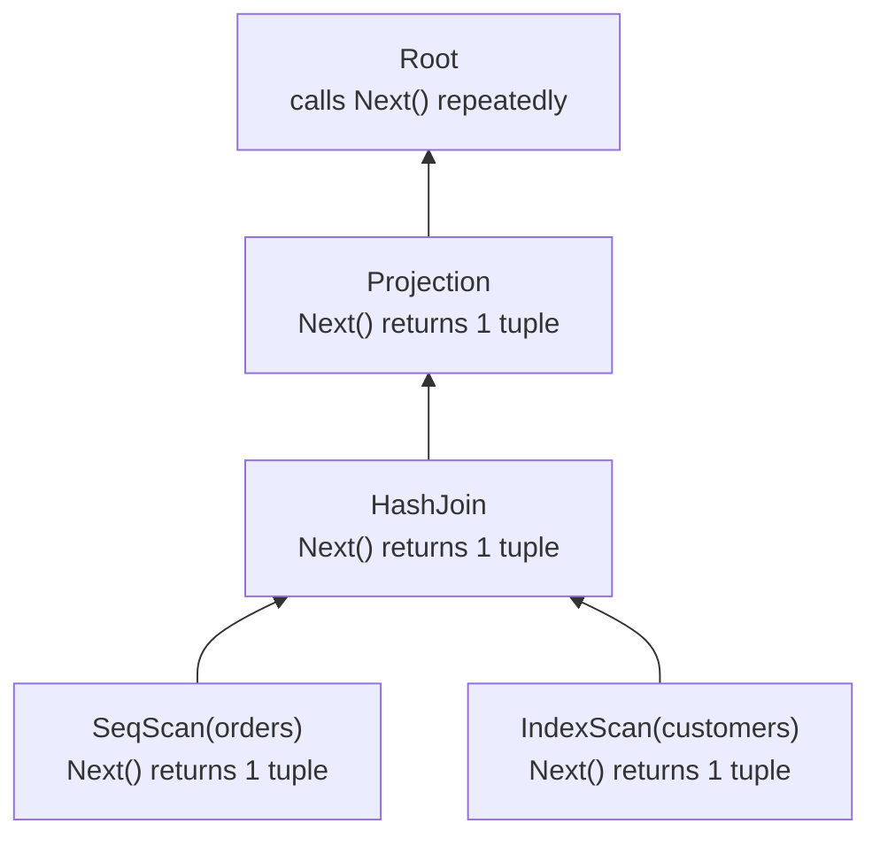

**Advantages:**
- Simple, elegant, composable
- Easy to implement new operators
- Natural pipelining -- no intermediate materialization
- Can stop early (LIMIT)

**Disadvantages:**
- Virtual function call overhead per tuple
- Poor CPU cache utilization (one tuple at a time)
- Branch mispredictions in the tight Next() loop

### 8.2 Materialization Model

Each operator processes its **entire input** and produces its **entire output** as a materialized result:

```
result = HashJoin(SeqScan(orders), IndexScan(customers))
final = Projection(result)
```

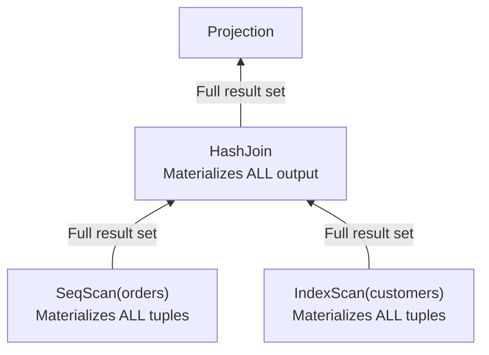

**Advantages:**
- Fewer function calls
- Can optimize each operator's inner loop

**Disadvantages:**
- Requires large intermediate storage
- Cannot pipeline -- must wait for full child output
- Bad for OLTP (many small queries)

### 8.3 Vectorized (Batch) Model

A hybrid of iterator and materialization. Each `Next()` call returns a **batch (vector) of tuples** instead of one. Batch sizes are typically 1024-4096 tuples.

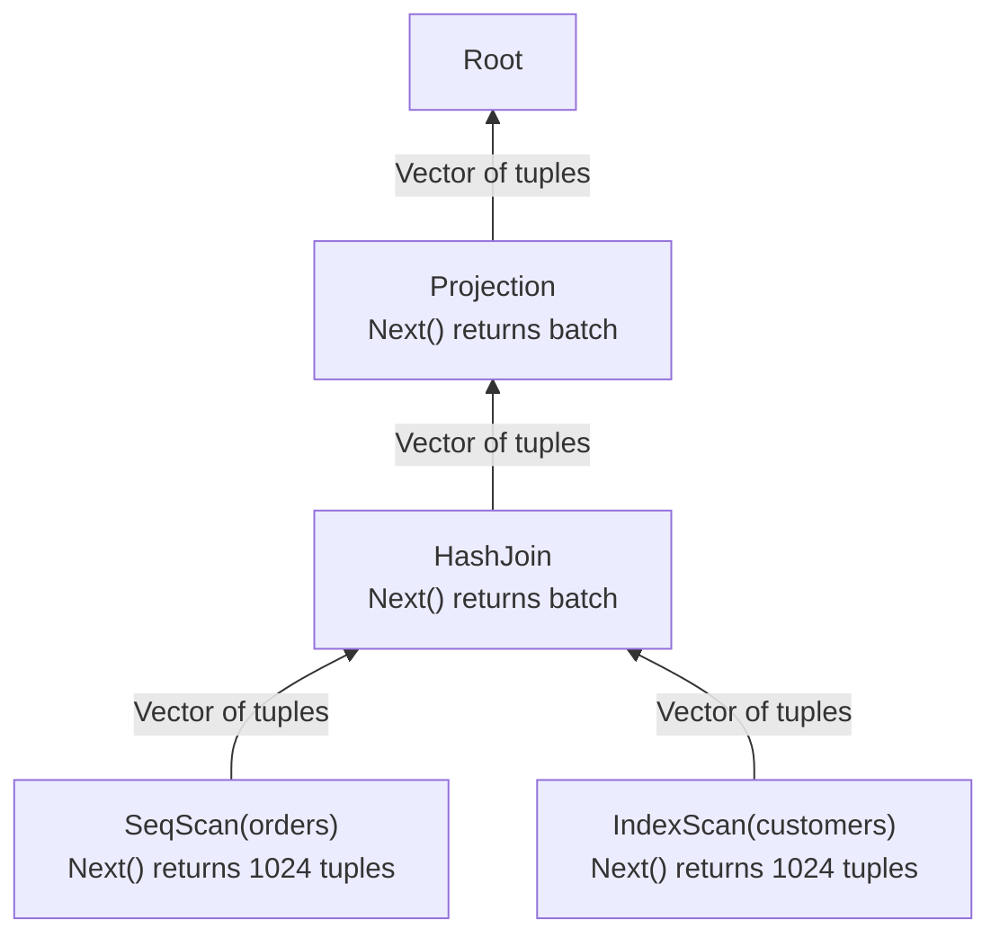

**Advantages:**
- Amortizes function call overhead over many tuples
- Enables SIMD processing on columnar data within batches
- Much better cache utilization
- Used by DuckDB, Velox, ClickHouse, DataFusion

**Disadvantages:**
- More complex operator implementation
- Must handle partial batches
- Batch size tuning

### 8.4 Comparison

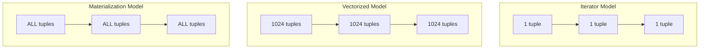

---

## 9. Pipeline Breakers

A **pipeline breaker** (or blocking operator) is an operator that must consume all of its input before producing any output. Pipeline breakers define the boundaries of execution pipelines.

**Common pipeline breakers:**
- **Sort**: Must read all input before producing sorted output
- **Hash Join (build side)**: Must build the complete hash table before probing
- **Hash Aggregate**: Must process all groups before emitting results
- **Set operations** (UNION, INTERSECT, EXCEPT with dedup)

**Non-blocking (pipelinable) operators:**
- Filter (WHERE)
- Projection
- Nested Loop Join (outer side)
- Hash Join (probe side, after build is complete)

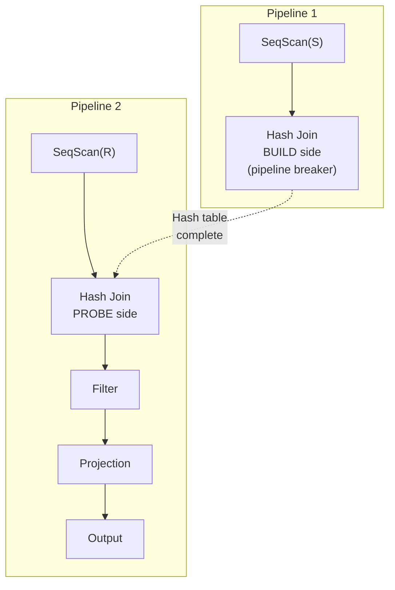

The query plan is split into pipelines at each breaker. Tuples flow through a pipeline without materialization, but at breaker boundaries, data must be fully materialized.

---

## 10. Putting It All Together

A real query plan combines multiple operators with different join algorithms, execution models, and pipeline stages:

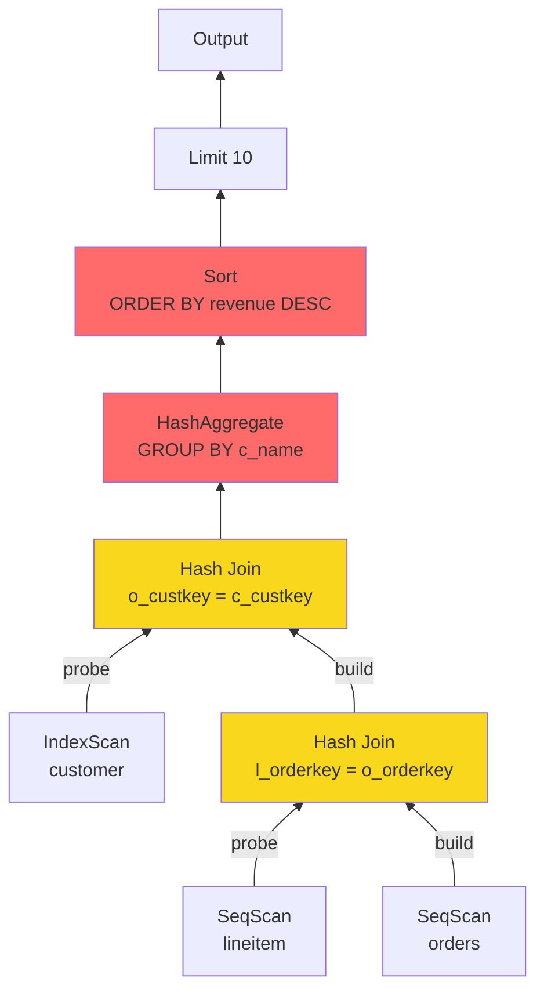

Yellow nodes are join operators; red nodes are pipeline breakers (aggregation and sort). The executor breaks this into pipelines and processes them according to the chosen execution model.

---

## Key Takeaways

1. **Nested loop join** is simple and general but expensive for large relations. Use it for small tables or when an index makes it cheap.

2. **Sort-merge join** shines when data is pre-sorted or when sorted output is needed. Cost is linear in the size of both relations (after sorting).

3. **Hash join** is the fastest general-purpose equi-join algorithm but only works for equality predicates. Grace and hybrid variants handle data larger than memory.

4. **The execution model** (iterator vs. vectorized vs. materialization) determines how tuples flow between operators. Modern analytical engines overwhelmingly prefer vectorized execution.

5. **Pipeline breakers** force materialization and define the boundaries of processing pipelines. Understanding breakers is essential for predicting query performance.
