# Module 9: LSM Trees & Log-Structured Storage -- Deep Dive

## 1. LevelDB Architecture in Detail

LevelDB is Google's foundational LSM-Tree implementation, written in C++ by Jeff Dean and Sanjay Ghemawat (the same pair behind MapReduce, Bigtable, and many other core Google systems). It is a single-node, embedded key-value store -- not a database server, but a library you link into your application.

### Core components

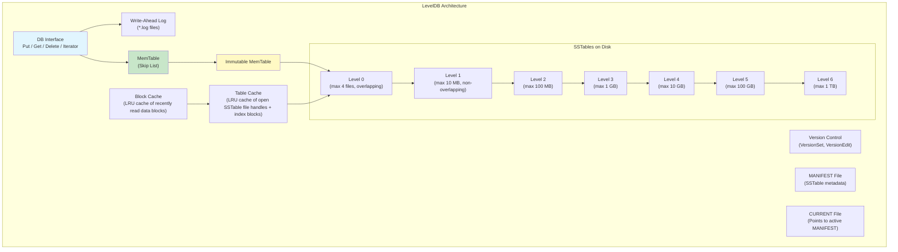

### Key files on disk

A LevelDB database directory typically contains:

| File | Purpose |
|---|---|
| `000003.log` | Current WAL (write-ahead log) |
| `000004.ldb` | SSTable file (Level 0--6) |
| `MANIFEST-000002` | Metadata: which SSTables exist, at which level, with what key ranges |
| `CURRENT` | Text file containing the name of the active MANIFEST |
| `LOCK` | File lock preventing concurrent access by multiple processes |
| `LOG` | Human-readable operational log (compaction events, etc.) |

### Version control in LevelDB

LevelDB uses a clever **versioning** system to manage concurrent reads and compaction:

- A `Version` is a snapshot of the LSM state: which SSTables exist at each level.
- A `VersionEdit` describes a change: "add SSTable X to Level 2, remove SSTable Y from Level 1."
- The `VersionSet` maintains the current Version and applies VersionEdits.
- Readers hold a reference to a Version, so they can read from a consistent snapshot even while compaction modifies the file set.

This is essentially **MVCC for the LSM metadata itself**.

---

## 2. RocksDB Enhancements over LevelDB

RocksDB started as Facebook's fork of LevelDB in 2012. It has since diverged significantly, adding many features for production workloads.

```mermaid
graph TD
    subgraph "RocksDB Enhancements"
        direction TB
        MT["Multiple MemTable<br/>Types"]
        CF["Column Families"]
        CC["Configurable<br/>Compaction Strategies"]
        PP["Parallel Compaction<br/>& Sub-compaction"]
        MO["Merge Operator"]
        RD["Range Deletions"]
        RateLim["Rate Limiter"]
        Stats["Statistics &<br/>Perf Context"]
        TTL["TTL Support"]
        BF["Pluggable<br/>Bloom Filters"]
        Comp["Pluggable<br/>Compression"]
        DIO["Direct I/O Support"]
        TX["Transactions<br/>(Optimistic & Pessimistic)"]
        BC["Block-Based &<br/>Plain Table Format"]
        WBM["Write Buffer<br/>Manager"]
    end

    style MT fill:#c8e6c9
    style CF fill:#c8e6c9
    style CC fill:#e1f5fe
    style PP fill:#e1f5fe
    style MO fill:#fff9c4
    style TX fill:#fff9c4
```

### Key differences from LevelDB

| Feature | LevelDB | RocksDB |
|---|---|---|
| Compaction strategies | Leveled only | Leveled, Universal, FIFO |
| Column families | No | Yes |
| Concurrent compaction | Single thread | Multiple threads + sub-compaction |
| Merge operator | No | Yes (read-modify-write without read) |
| Transactions | No | Optimistic + Pessimistic |
| Compression | Snappy only | Snappy, LZ4, Zstd, Zlib, BZip2 (per-level) |
| Bloom filter | Basic | Full filter, partitioned filter, ribbon filter |
| Rate limiting | No | Yes (smooths I/O spikes) |
| Statistics | Minimal | Extensive (500+ metrics) |
| Range deletions | No | Yes (efficient bulk deletes) |
| Backup/Checkpoint | No | Built-in |

---

## 3. Leveled Compaction Deep Dive

Leveled compaction is the default in both LevelDB and RocksDB. Understanding its mechanics is critical for tuning LSM-based systems.

### How files move between levels

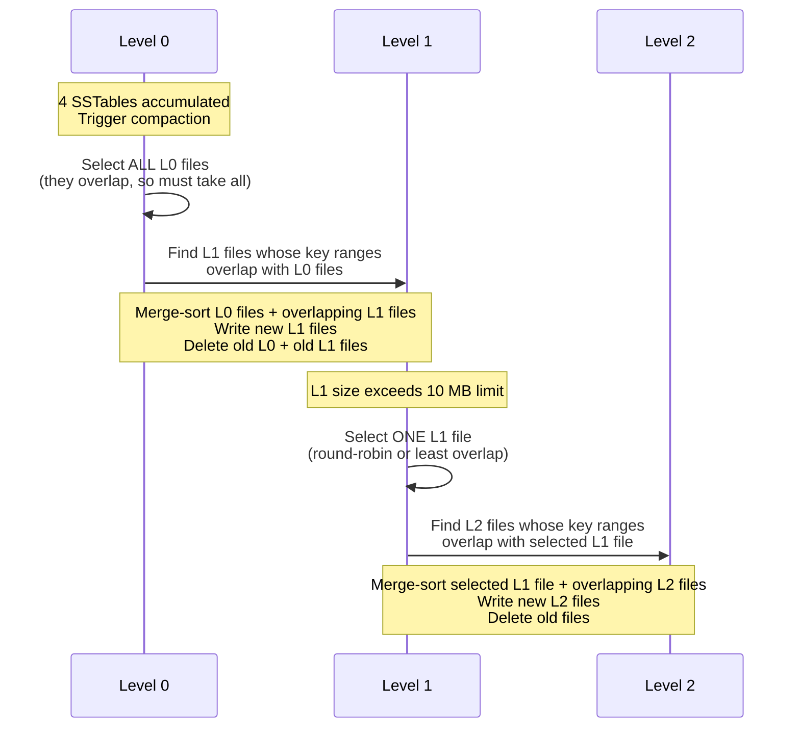

### Level size ratios

The **size ratio** between adjacent levels is a critical parameter (called `max_bytes_for_level_multiplier` in RocksDB, default 10).

With a base level size of 10 MB and a multiplier of 10:

| Level | Max Size | Max Files (at 2 MB each) |
|---|---|---|
| L0 | 4 files | 4 |
| L1 | 10 MB | 5 |
| L2 | 100 MB | 50 |
| L3 | 1 GB | 500 |
| L4 | 10 GB | 5,000 |
| L5 | 100 GB | 50,000 |
| L6 | 1 TB | 500,000 |

### Write amplification analysis

In the worst case with leveled compaction and a size ratio of R:

- Data written to Level 0: 1x (the original write).
- Compaction from Level N to Level N+1: in the worst case, a single file at Level N overlaps with R files at Level N+1, so the merge reads and writes R+1 files.
- With L levels, total write amplification is approximately: 1 + L * R.
- With R=10 and L=6: write amplification up to 61x.

In practice, the write amplification is lower because:
- Not every L_N file overlaps with R files at L_(N+1).
- L0 compaction takes all L0 files at once.
- Tombstones and overwrites reduce the data that reaches deeper levels.

RocksDB reports write amplification is typically **10--30x** for leveled compaction.

### File picking strategy

When Level N exceeds its size limit, which file to compact?

1. **Round-robin** (LevelDB): cycle through files by key range to ensure even coverage.
2. **Minimize overlap** (RocksDB option): pick the L_N file that overlaps with the fewest L_(N+1) files, to minimize the work per compaction.
3. **Coldest file** (RocksDB option): pick the least recently updated file, pushing cold data deeper faster.

---

## 4. Size-Tiered Compaction (STCS)

Size-tiered compaction groups SSTables by size and merges groups of similarly-sized files.

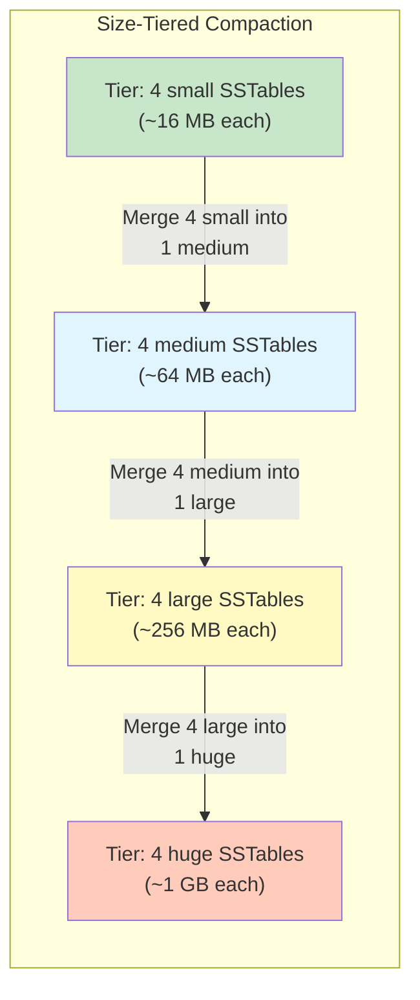

### When to use STCS

- **Write-heavy workloads**: STCS has much lower write amplification than leveled compaction. Each key is rewritten approximately log_T(N) times (where T is the tier size, typically 4, and N is total data size).
- **Bulk loading**: ingesting large datasets quickly.
- **Time-series data**: where reads mostly access recent data.

### STCS trade-offs

| Metric | STCS | Leveled |
|---|---|---|
| Write amplification | ~4--8x | ~10--30x |
| Read amplification | High (many files to check) | Low (one file per level) |
| Space amplification | Up to 2x (during compaction, need space for input + output) | ~1.1x |
| Temporary space spike | Can double disk usage | Controlled |

Cassandra defaults to STCS and it is one of the reasons Cassandra excels at write throughput. However, read-heavy workloads on Cassandra often benefit from switching to Leveled Compaction Strategy (LCS).

---

## 5. Universal Compaction in RocksDB

Universal compaction is RocksDB's size-tiered variant with additional controls to bound space amplification.

### Rules

Universal compaction uses a set of heuristic rules to decide when and what to compact:

1. **Space amplification trigger**: if total_size / last_sorted_run_size > max_size_amplification_percent, compact everything.
2. **Size ratio trigger**: if the ratio of the first (newest) sorted run to the second exceeds size_ratio, merge them. Extend greedily to include more runs.
3. **Sorted runs count trigger**: if the number of sorted runs exceeds level0_file_num_compaction_trigger, compact.

This gives tunable knobs between pure size-tiered (low write amp) and leveled-like (low space amp) behavior.

---

## 6. FIFO Compaction for TTL Data

FIFO compaction is the simplest strategy: when total data size exceeds a threshold, drop the oldest SSTable entirely.

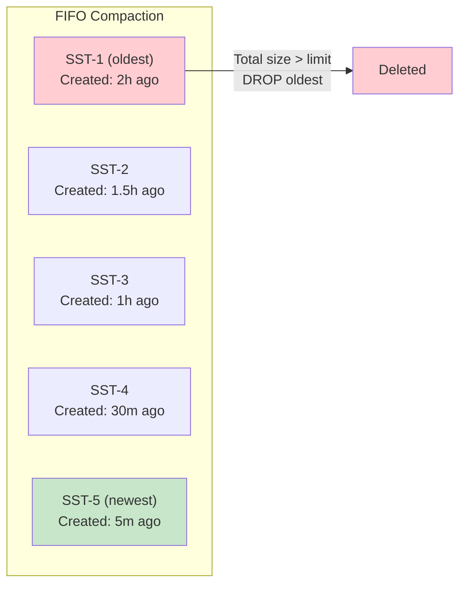

**Use cases**:
- Time-series data with a fixed retention window.
- Cache-like workloads (recent data only).
- Monitoring/metrics data.

**Advantages**: Near-zero write amplification, no merge overhead.
**Disadvantages**: Cannot handle updates or deletes. No deduplication of keys. Read amplification is unbounded.

---

## 7. Bloom Filter Math

Bloom filters are so critical to LSM performance that understanding their math helps with capacity planning.

### Structure

A Bloom filter consists of:
- A bit array of `m` bits, all initially 0.
- `k` independent hash functions, each mapping a key to one of `m` positions.

### Insert operation

To insert key X: compute h_1(X), h_2(X), ..., h_k(X) and set those bit positions to 1.

### Query operation

To check if key X is in the set: compute h_1(X), h_2(X), ..., h_k(X). If ALL corresponding bits are 1, return "probably yes." If ANY bit is 0, return "definitely no."

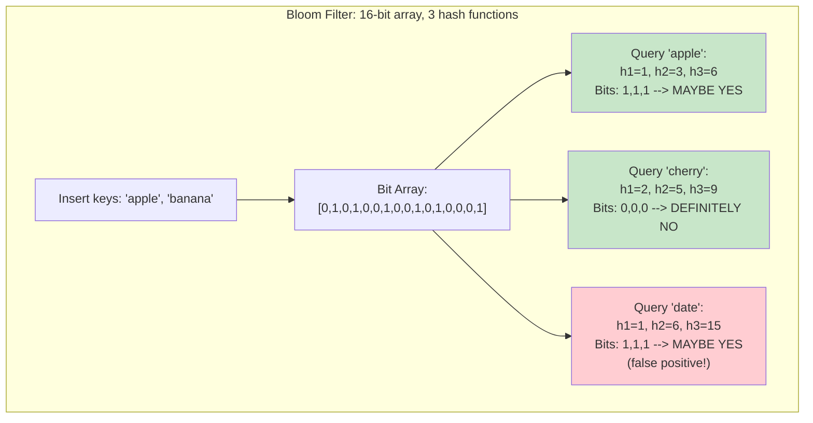

### False positive rate formula

After inserting `n` keys into an `m`-bit filter with `k` hash functions:

```
FPR = (1 - (1 - 1/m)^(kn))^k approximately (1 - e^(-kn/m))^k
```

### Optimal hash function count

For a given `m/n` (bits per key), the FPR is minimized when:

```
k = (m/n) * ln(2) approximately 0.693 * (m/n)
```

### Practical sizing guide

| Bits per key (m/n) | Optimal k | False Positive Rate |
|---|---|---|
| 5 | 3 | 9.18% |
| 8 | 6 | 2.16% |
| 10 | 7 | 0.82% |
| 12 | 8 | 0.31% |
| 15 | 10 | 0.07% |
| 20 | 14 | 0.0009% |

RocksDB defaults to **10 bits per key** with 7 hash functions, giving approximately a **1% false positive rate**. This is an excellent trade-off: 10 bits (1.25 bytes) per key is cheap, and eliminating 99% of unnecessary SSTable reads is huge.

For 1 billion keys at 10 bits/key, the Bloom filter requires only ~1.25 GB of memory.

### Full filter vs. partitioned filter

- **Full filter** (LevelDB, RocksDB default before 7.0): one Bloom filter per SSTable. The entire filter must be loaded into memory.
- **Partitioned filter** (RocksDB): the Bloom filter is split into partitions, each corresponding to a range of data blocks. Only the relevant partition needs to be loaded. Reduces memory pressure for large SSTables.
- **Ribbon filter** (RocksDB 7.0+): a more space-efficient alternative to Bloom filters using XOR-based techniques. ~30% less space for the same FPR.

---

## 8. Block Cache vs. Row Cache

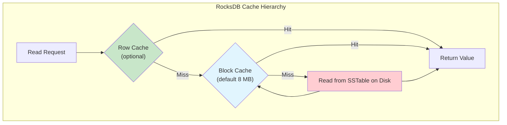

### Block cache

- Caches uncompressed **data blocks** from SSTables.
- Shared across all column families by default.
- LRU eviction (or LRU with clock-based approximation).
- Also caches index blocks and filter blocks (configurable).
- Default size: 8 MB (far too small for production -- typically set to 30--50% of available RAM).

### Row cache

- Caches individual **key-value pairs** (the logical row).
- Only effective for point lookups (not range scans).
- Higher hit rate for hot-key workloads but higher memory overhead per entry (each entry has cache metadata).
- Not commonly used -- block cache is usually sufficient.

---

## 9. Write Stalls and Rate Limiting

One of the biggest operational challenges with LSM Trees is **write stalls** -- the system temporarily slows or stops accepting writes because compaction cannot keep up.

### Stall triggers in RocksDB

| Condition | Action |
|---|---|
| L0 file count >= `level0_slowdown_writes_trigger` (default 20) | Slow down writes |
| L0 file count >= `level0_stop_writes_trigger` (default 36) | Stop writes entirely |
| Pending compaction bytes >= `soft_pending_compaction_bytes_limit` | Slow down writes |
| Pending compaction bytes >= `hard_pending_compaction_bytes_limit` | Stop writes |
| Too many MemTables (write buffer count exceeded) | Stop writes |

### Rate limiter

RocksDB's rate limiter smooths I/O by capping the total bytes/sec that compaction and flush can write to disk. This prevents compaction from saturating the disk and starving foreground reads/writes.

```
options.rate_limiter.reset(NewGenericRateLimiter(
    100 * 1024 * 1024,  // 100 MB/s rate limit
    100 * 1000,          // refill period (100ms)
    10                   // fairness factor
));
```

---

## 10. Compression: Per-Block with Snappy/LZ4/Zstd

SSTables in RocksDB support per-data-block compression. This is critical because it reduces disk I/O (fewer bytes to read) at the cost of CPU cycles for decompression.

### Compression algorithms comparison

| Algorithm | Compression Ratio | Compress Speed | Decompress Speed | Use Case |
|---|---|---|---|---|
| None | 1.0x | - | - | In-memory / SSD with spare space |
| Snappy | 1.5--1.8x | ~500 MB/s | ~500 MB/s | Default for speed |
| LZ4 | 1.5--2.0x | ~400 MB/s | ~800 MB/s | Good default choice |
| Zstd | 2.0--3.0x | ~150 MB/s | ~400 MB/s | Best ratio with acceptable speed |
| Zlib | 2.0--2.5x | ~50 MB/s | ~300 MB/s | Legacy, avoid |

### Per-level compression

RocksDB allows different compression algorithms per level:

```cpp
options.compression_per_level = {
    kNoCompression,       // L0: no compression (fast flush)
    kNoCompression,       // L1: no compression
    kLZ4Compression,      // L2: LZ4
    kLZ4Compression,      // L3: LZ4
    kZSTD,                // L4: Zstd (deeper levels = more compression)
    kZSTD,                // L5: Zstd
    kZSTD                 // L6: Zstd
};
```

The rationale: L0 and L1 are frequently read and rewritten during compaction, so speed matters more. L5 and L6 hold the vast majority of data and are read less often, so higher compression saves significant disk space.

---

## 11. Column Families in RocksDB

Column families allow logically separating different types of data within a single RocksDB instance while sharing the WAL and block cache.

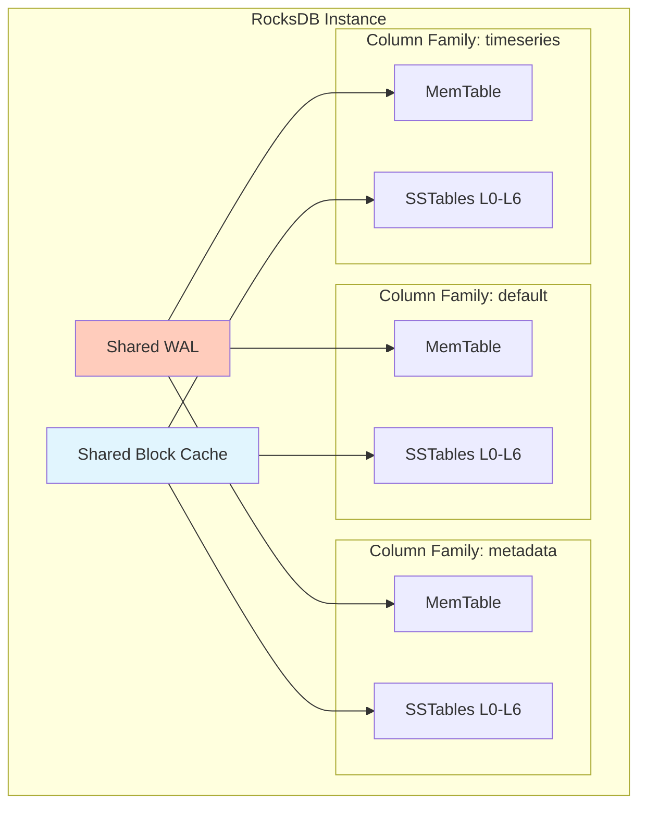

### Benefits

- **Different tuning per data type**: metadata might use leveled compaction with 10 bits/key Bloom filters, while timeseries uses FIFO compaction with no Bloom filters.
- **Atomic writes across column families**: a WriteBatch can atomically write to multiple CFs.
- **Independent compaction**: each CF compacts independently.
- **Shared resources**: WAL, block cache, and rate limiter are shared, reducing overhead vs. separate DB instances.

### Use case: CockroachDB

CockroachDB uses multiple column families to separate SQL row data from MVCC metadata, allowing different compaction tuning for each.

---

## 12. Tombstones and Delete Handling

Deletes in an LSM Tree cannot simply remove data from an immutable SSTable. Instead, a special marker called a **tombstone** is written.

### How tombstones work

1. `Delete(key)` writes a tombstone record: `(key, TOMBSTONE)` to the MemTable and WAL.
2. Reads encountering a tombstone return "key not found" even if older SSTables contain the key.
3. During compaction, when a tombstone meets the actual key-value pair, both are dropped (if no older data exists at deeper levels).

### The tombstone problem

Tombstones can accumulate and cause performance issues:

- **Space**: tombstones occupy space until compacted away.
- **Read amplification**: a range scan must skip over tombstones, potentially reading many dead entries.
- **Compaction delay**: a tombstone at Level 0 cannot be dropped until it is pushed to the deepest level where the corresponding key might exist.

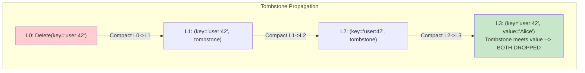

### Mitigation strategies

- **Compaction filters**: RocksDB allows custom logic to drop entries during compaction (e.g., drop keys older than a TTL).
- **Bottom-level tombstone dropping**: tombstones at the bottom level can always be dropped because there are no deeper levels.
- **Delete-triggered compaction**: RocksDB can be configured to trigger compaction when too many tombstones exist in a key range.

---

## 13. Range Deletions

Deleting millions of keys one-by-one with point tombstones is extremely expensive. RocksDB's **range deletion** feature allows efficiently deleting an entire key range.

### How range deletions work

Instead of writing one tombstone per key, a single range tombstone is written:

```
DeleteRange(start_key, end_key)
```

This writes a single record: `(start_key, end_key, RANGE_TOMBSTONE)`.

During reads, the system checks if the queried key falls within any range tombstone. During compaction, any key within the range is dropped.

### Implementation

Range tombstones are stored in a separate **range deletion block** within each SSTable (not in the data blocks). This prevents them from interfering with point lookup performance.

---

## 14. Merge Operator in RocksDB

The merge operator is one of RocksDB's most powerful features. It enables **read-modify-write without the read**.

### The problem

Consider incrementing a counter:

```
val = db.Get("counter")         // Read from disk
val = val + 1                   // Modify
db.Put("counter", val)          // Write back
```

This requires a read before the write, negating the LSM write advantage.

### The solution: Merge

```
db.Merge("counter", "+1")
```

This writes a merge operand `+1` to the MemTable without reading the current value. During compaction (or when reading), the merge operator combines operands:

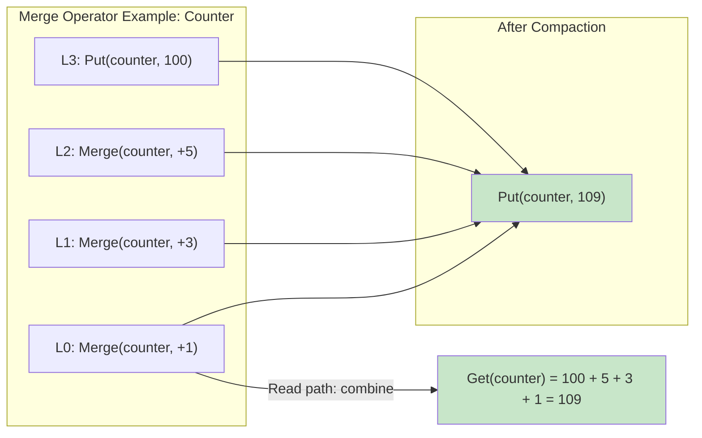

### Use cases

- **Counters**: increment/decrement without reading.
- **Append to list**: append elements to a list value without reading the full list.
- **Aggregation**: partial aggregates that are combined during compaction.
- **JSON patching**: apply JSON merge patches without reading the full document.

The merge operator must be **associative** (grouping does not matter): `merge(merge(a, b), c) == merge(a, merge(b, c))`.

---

## 15. Compaction Strategies Comparison

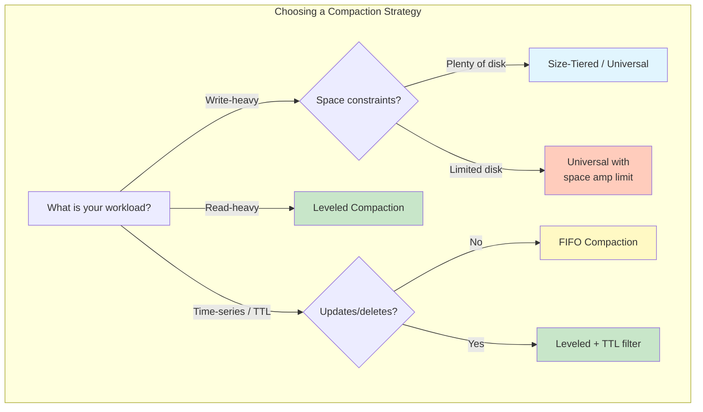

### Summary table

| Strategy | Write Amp | Read Amp | Space Amp | Best For |
|---|---|---|---|---|
| Leveled | High (10-30x) | Low (1-2 files/level) | Low (~1.1x) | Read-heavy, OLTP |
| Size-Tiered | Low (4-8x) | High (many files) | High (up to 2x) | Write-heavy, bulk load |
| Universal | Tunable | Tunable | Tunable | Flexible workloads |
| FIFO | ~0 | Very High | 1x (no redundancy) | TTL/time-series, caches |

---

## 16. Advanced: Write Buffer Manager

When multiple column families exist, each has its own MemTable. Without coordination, memory usage can spike unpredictably. The **Write Buffer Manager** sets a global memory budget across all MemTables.

When total MemTable memory exceeds the budget:
1. The largest MemTable (across all CFs) is switched to immutable and scheduled for flush.
2. If memory still exceeds the budget, additional MemTables are flushed.

This prevents OOM situations in applications with many column families.

---

## 17. Key Operational Metrics to Monitor

For any production LSM-based system, these metrics are essential:

| Metric | What It Tells You |
|---|---|
| `rocksdb.num-files-at-level{N}` | File count per level -- imbalance indicates compaction lag |
| `rocksdb.compaction-pending` | Whether compaction is falling behind |
| `rocksdb.actual-delayed-write-rate` | Current write throttling rate |
| `rocksdb.is-write-stopped` | Whether writes are completely stalled |
| `rocksdb.estimate-pending-compaction-bytes` | How much compaction work is queued |
| `rocksdb.mem-table-flush-pending` | Whether a MemTable flush is pending |
| `rocksdb.block-cache-usage` | How much of the block cache is used |
| `rocksdb.bloom-filter-useful` | How many reads were avoided by Bloom filters |

Monitoring these metrics with Prometheus/Grafana is standard practice for systems like TiKV, CockroachDB, and any RocksDB-based deployment.
