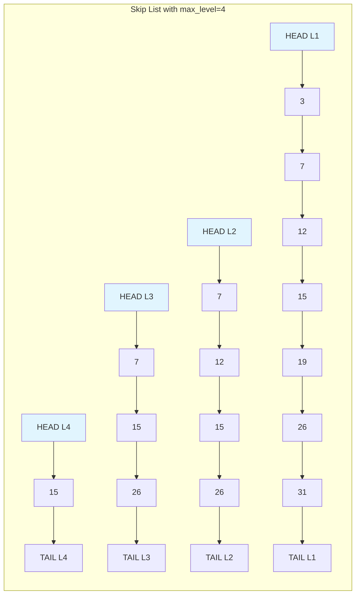
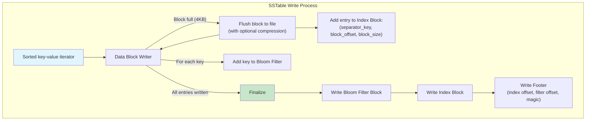
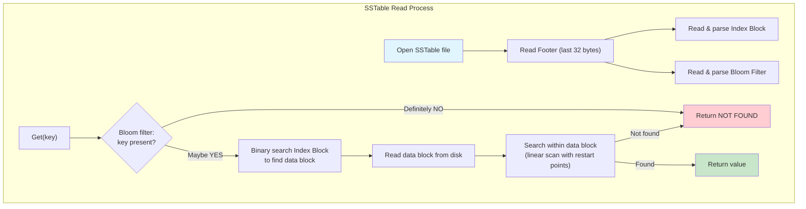
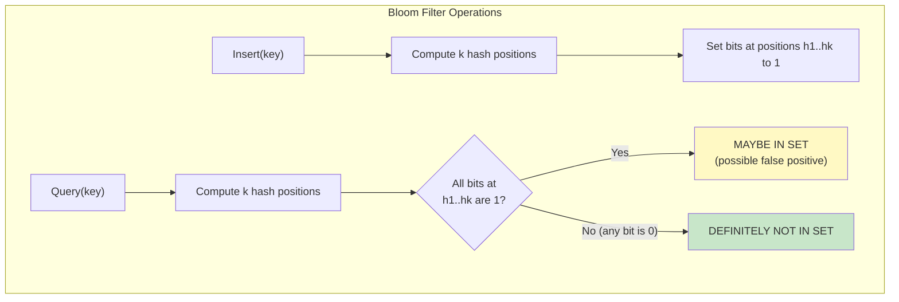
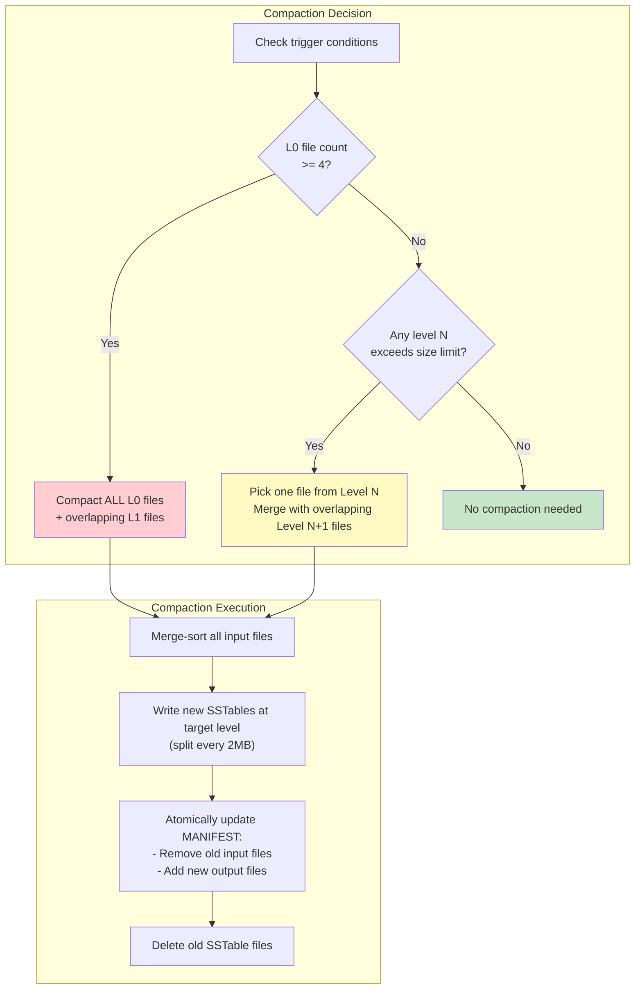
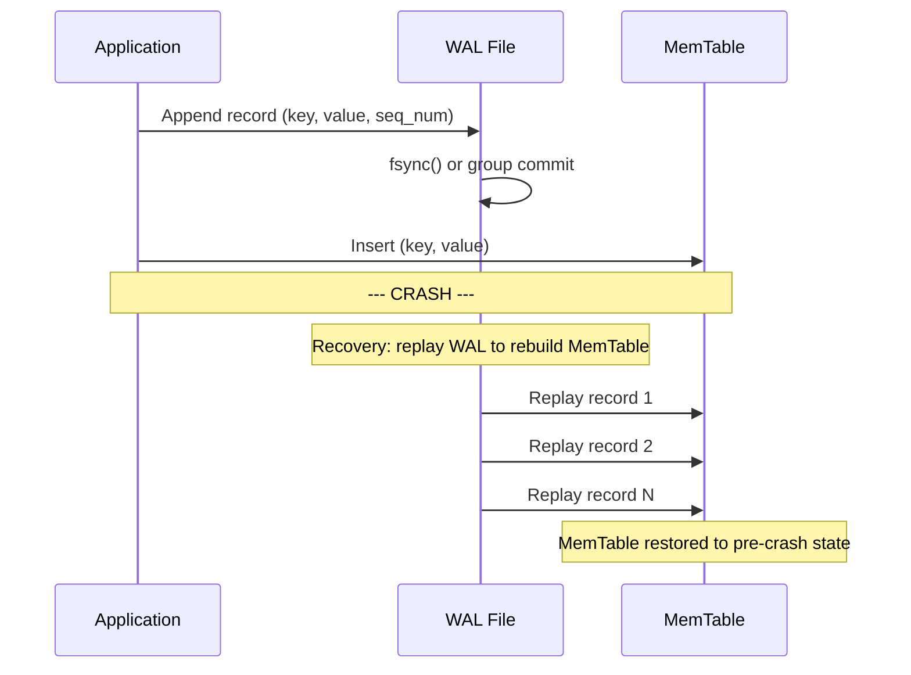
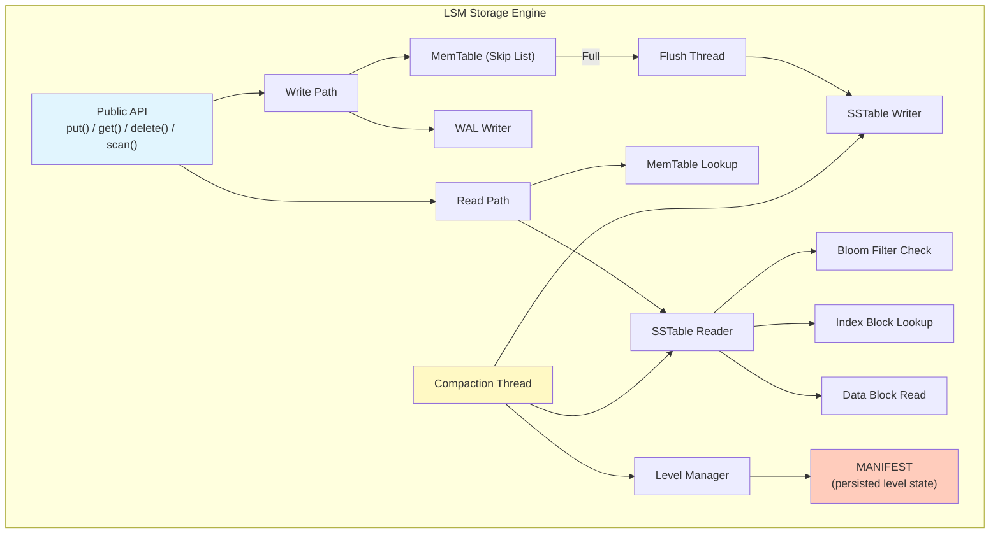

# Module 9: LSM Trees & Log-Structured Storage -- Implementation

## 1. Implementing a MemTable with Skip List

The MemTable is the first component to build. We use a skip list because it offers O(log N) insert/search with good cache locality and is straightforward to implement.

### Skip List Theory

A skip list is a layered linked list where each node is promoted to higher levels with probability p (typically 0.5 or 0.25). Higher levels act as "express lanes" for faster traversal.



### Skip List Implementation in Rust

```rust
use std::cmp::Ordering;
use rand::Rng;

const MAX_LEVEL: usize = 12;
const BRANCHING_FACTOR: u32 = 4; // 1/4 probability of promotion

/// A single node in the skip list.
struct Node {
    key: Vec<u8>,
    value: Vec<u8>,
    /// Forward pointers for each level this node participates in.
    forward: Vec<Option<*mut Node>>,
}

impl Node {
    fn new(key: Vec<u8>, value: Vec<u8>, level: usize) -> Self {
        Node {
            key,
            value,
            forward: vec![None; level + 1],
        }
    }
}

/// A skip list serving as the MemTable.
pub struct SkipListMemTable {
    head: *mut Node,
    level: usize,        // Current max level in use
    size: usize,         // Number of entries
    memory_usage: usize, // Approximate bytes used
}

impl SkipListMemTable {
    pub fn new() -> Self {
        let head = Box::into_raw(Box::new(Node::new(vec![], vec![], MAX_LEVEL)));
        SkipListMemTable {
            head,
            level: 0,
            size: 0,
            memory_usage: 0,
        }
    }

    /// Generate a random level for a new node.
    fn random_level(&self) -> usize {
        let mut lvl = 0;
        let mut rng = rand::thread_rng();
        while lvl < MAX_LEVEL && rng.gen_range(0..BRANCHING_FACTOR) == 0 {
            lvl += 1;
        }
        lvl
    }

    /// Insert a key-value pair. If the key exists, update the value.
    pub fn put(&mut self, key: Vec<u8>, value: Vec<u8>) {
        let mut update: Vec<*mut Node> = vec![self.head; MAX_LEVEL + 1];
        let mut current = self.head;

        // Traverse from the highest level down to level 0
        unsafe {
            for i in (0..=self.level).rev() {
                while let Some(next) = (*current).forward[i] {
                    match (*next).key.cmp(&key) {
                        Ordering::Less => current = next,
                        Ordering::Equal => {
                            // Key exists -- update value in place
                            let old_size = (*next).value.len();
                            (*next).value = value.clone();
                            self.memory_usage =
                                self.memory_usage - old_size + value.len();
                            return;
                        }
                        Ordering::Greater => break,
                    }
                }
                update[i] = current;
            }
        }

        // Insert new node
        let new_level = self.random_level();
        if new_level > self.level {
            for i in (self.level + 1)..=new_level {
                update[i] = self.head;
            }
            self.level = new_level;
        }

        let entry_size = key.len() + value.len() + 64; // 64 bytes overhead estimate
        let new_node = Box::into_raw(Box::new(Node::new(key, value, new_level)));

        unsafe {
            for i in 0..=new_level {
                (*new_node).forward[i] = (*update[i]).forward[i];
                (*update[i]).forward[i] = Some(new_node);
            }
        }

        self.size += 1;
        self.memory_usage += entry_size;
    }

    /// Look up a key. Returns Some(value) or None.
    pub fn get(&self, key: &[u8]) -> Option<&[u8]> {
        let mut current = self.head;

        unsafe {
            for i in (0..=self.level).rev() {
                while let Some(next) = (*current).forward[i] {
                    match (*next).key.as_slice().cmp(key) {
                        Ordering::Less => current = next,
                        Ordering::Equal => return Some(&(*next).value),
                        Ordering::Greater => break,
                    }
                }
            }
        }
        None
    }

    /// Return an iterator over all entries in sorted order.
    pub fn iter(&self) -> SkipListIterator {
        unsafe {
            SkipListIterator {
                current: (*self.head).forward[0],
            }
        }
    }

    /// Approximate memory usage in bytes.
    pub fn approximate_memory_usage(&self) -> usize {
        self.memory_usage
    }
}

pub struct SkipListIterator {
    current: Option<*mut Node>,
}

impl Iterator for SkipListIterator {
    type Item = (Vec<u8>, Vec<u8>);

    fn next(&mut self) -> Option<Self::Item> {
        unsafe {
            if let Some(node) = self.current {
                let result = ((*node).key.clone(), (*node).value.clone());
                self.current = (*node).forward[0];
                Some(result)
            } else {
                None
            }
        }
    }
}
```

---

## 2. Implementing SSTable Writer

The SSTable writer takes sorted key-value pairs (from a MemTable flush or compaction merge) and produces an SSTable file.



### SSTable Writer in Rust

```rust
use std::fs::File;
use std::io::{BufWriter, Write, Seek, SeekFrom};

const BLOCK_SIZE: usize = 4096;
const RESTART_INTERVAL: usize = 16;

/// An entry in the index block.
struct IndexEntry {
    /// A key >= last key in this block and <= first key in next block.
    separator_key: Vec<u8>,
    /// Byte offset of the data block in the file.
    offset: u64,
    /// Size of the data block in bytes.
    size: u32,
}

/// Builds a single data block with prefix compression.
struct BlockBuilder {
    buffer: Vec<u8>,
    restarts: Vec<u32>,    // Offsets of restart points
    entry_count: usize,
    last_key: Vec<u8>,
}

impl BlockBuilder {
    fn new() -> Self {
        BlockBuilder {
            buffer: Vec::with_capacity(BLOCK_SIZE),
            restarts: vec![0], // First entry is always a restart
            entry_count: 0,
            last_key: Vec::new(),
        }
    }

    fn add(&mut self, key: &[u8], value: &[u8]) {
        // Calculate shared prefix length with last key
        let shared = if self.entry_count % RESTART_INTERVAL == 0 {
            self.restarts.push(self.buffer.len() as u32);
            0 // Restart point: no prefix sharing
        } else {
            shared_prefix_len(&self.last_key, key)
        };

        let non_shared = key.len() - shared;

        // Encode: shared_len (varint) | non_shared_len (varint)
        //       | value_len (varint) | non_shared_key | value
        encode_varint(&mut self.buffer, shared as u64);
        encode_varint(&mut self.buffer, non_shared as u64);
        encode_varint(&mut self.buffer, value.len() as u64);
        self.buffer.extend_from_slice(&key[shared..]);
        self.buffer.extend_from_slice(value);

        self.last_key = key.to_vec();
        self.entry_count += 1;
    }

    fn estimated_size(&self) -> usize {
        self.buffer.len() + self.restarts.len() * 4 + 4
    }

    /// Finalize and return the block bytes.
    fn finish(mut self) -> Vec<u8> {
        // Append restart point offsets
        for restart in &self.restarts {
            self.buffer.extend_from_slice(&restart.to_le_bytes());
        }
        // Append number of restarts
        self.buffer
            .extend_from_slice(&(self.restarts.len() as u32).to_le_bytes());
        self.buffer
    }

    fn is_empty(&self) -> bool {
        self.entry_count == 0
    }

    fn reset(&mut self) {
        self.buffer.clear();
        self.restarts.clear();
        self.restarts.push(0);
        self.entry_count = 0;
        self.last_key.clear();
    }
}

/// Writes a complete SSTable file.
pub struct SSTableWriter {
    writer: BufWriter<File>,
    block_builder: BlockBuilder,
    index_entries: Vec<IndexEntry>,
    bloom_filter: BloomFilter,
    current_offset: u64,
    first_key: Option<Vec<u8>>,
    last_key: Option<Vec<u8>>,
}

impl SSTableWriter {
    pub fn new(path: &str, expected_keys: usize) -> std::io::Result<Self> {
        let file = File::create(path)?;
        Ok(SSTableWriter {
            writer: BufWriter::new(file),
            block_builder: BlockBuilder::new(),
            index_entries: Vec::new(),
            bloom_filter: BloomFilter::new(expected_keys, 10), // 10 bits/key
            current_offset: 0,
            first_key: None,
            last_key: None,
        })
    }

    /// Add a key-value pair. MUST be called in sorted key order.
    pub fn add(&mut self, key: &[u8], value: &[u8]) -> std::io::Result<()> {
        if self.first_key.is_none() {
            self.first_key = Some(key.to_vec());
        }
        self.last_key = Some(key.to_vec());

        // Add key to bloom filter
        self.bloom_filter.insert(key);

        // Add to current block
        self.block_builder.add(key, value);

        // Flush block if it exceeds target size
        if self.block_builder.estimated_size() >= BLOCK_SIZE {
            self.flush_data_block()?;
        }

        Ok(())
    }

    fn flush_data_block(&mut self) -> std::io::Result<()> {
        if self.block_builder.is_empty() {
            return Ok(());
        }

        let last_key = self.block_builder.last_key.clone();
        let block_data = std::mem::replace(
            &mut self.block_builder,
            BlockBuilder::new(),
        )
        .finish();

        let offset = self.current_offset;
        let size = block_data.len() as u32;

        self.writer.write_all(&block_data)?;
        self.current_offset += size as u64;

        self.index_entries.push(IndexEntry {
            separator_key: last_key,
            offset,
            size,
        });

        Ok(())
    }

    /// Finalize the SSTable: write filter block, index block, and footer.
    pub fn finish(mut self) -> std::io::Result<()> {
        // Flush any remaining data block
        self.flush_data_block()?;

        // Write bloom filter block
        let filter_offset = self.current_offset;
        let filter_data = self.bloom_filter.to_bytes();
        self.writer.write_all(&filter_data)?;
        let filter_size = filter_data.len() as u32;
        self.current_offset += filter_size as u64;

        // Write index block
        let index_offset = self.current_offset;
        let mut index_data = Vec::new();
        for entry in &self.index_entries {
            encode_varint(&mut index_data, entry.separator_key.len() as u64);
            index_data.extend_from_slice(&entry.separator_key);
            index_data.extend_from_slice(&entry.offset.to_le_bytes());
            index_data.extend_from_slice(&entry.size.to_le_bytes());
        }
        self.writer.write_all(&index_data)?;
        let index_size = index_data.len() as u32;
        self.current_offset += index_size as u64;

        // Write footer (fixed 32 bytes)
        let footer = Footer {
            filter_offset,
            filter_size,
            index_offset,
            index_size,
            magic: 0x88888888_DEADBEEF,
        };
        self.writer.write_all(&footer.to_bytes())?;

        self.writer.flush()?;
        Ok(())
    }
}

struct Footer {
    filter_offset: u64,
    filter_size: u32,
    index_offset: u64,
    index_size: u32,
    magic: u64,
}

impl Footer {
    fn to_bytes(&self) -> [u8; 32] {
        let mut buf = [0u8; 32];
        buf[0..8].copy_from_slice(&self.filter_offset.to_le_bytes());
        buf[8..12].copy_from_slice(&self.filter_size.to_le_bytes());
        buf[12..20].copy_from_slice(&self.index_offset.to_le_bytes());
        buf[20..24].copy_from_slice(&self.index_size.to_le_bytes());
        buf[24..32].copy_from_slice(&self.magic.to_le_bytes());
        buf
    }
}

fn shared_prefix_len(a: &[u8], b: &[u8]) -> usize {
    a.iter().zip(b.iter()).take_while(|(x, y)| x == y).count()
}

fn encode_varint(buf: &mut Vec<u8>, mut val: u64) {
    while val >= 0x80 {
        buf.push((val as u8) | 0x80);
        val >>= 7;
    }
    buf.push(val as u8);
}
```

---

## 3. Implementing SSTable Reader

The SSTable reader opens a file, reads the footer to locate the index and filter blocks, and supports point lookups and range iteration.



### SSTable Reader in Rust

```rust
use std::fs::File;
use std::io::{Read, Seek, SeekFrom, BufReader};

pub struct SSTableReader {
    file: BufReader<File>,
    index: Vec<IndexEntry>,
    bloom_filter: BloomFilter,
    file_size: u64,
}

impl SSTableReader {
    pub fn open(path: &str) -> std::io::Result<Self> {
        let mut file = BufReader::new(File::open(path)?);
        let file_size = file.get_ref().metadata()?.len();

        // Read footer (last 32 bytes)
        file.seek(SeekFrom::End(-32))?;
        let mut footer_buf = [0u8; 32];
        file.read_exact(&mut footer_buf)?;
        let footer = Footer::from_bytes(&footer_buf);

        assert_eq!(footer.magic, 0x88888888_DEADBEEF, "Invalid SSTable magic");

        // Read bloom filter
        file.seek(SeekFrom::Start(footer.filter_offset))?;
        let mut filter_buf = vec![0u8; footer.filter_size as usize];
        file.read_exact(&mut filter_buf)?;
        let bloom_filter = BloomFilter::from_bytes(&filter_buf);

        // Read index block
        file.seek(SeekFrom::Start(footer.index_offset))?;
        let mut index_buf = vec![0u8; footer.index_size as usize];
        file.read_exact(&mut index_buf)?;
        let index = parse_index_block(&index_buf);

        Ok(SSTableReader {
            file,
            index,
            bloom_filter,
            file_size,
        })
    }

    /// Point lookup. Returns Some(value) if found, None otherwise.
    pub fn get(&mut self, key: &[u8]) -> std::io::Result<Option<Vec<u8>>> {
        // Step 1: Check bloom filter
        if !self.bloom_filter.may_contain(key) {
            return Ok(None); // Definitely not in this SSTable
        }

        // Step 2: Binary search the index to find the right data block
        let block_idx = match self
            .index
            .binary_search_by(|entry| entry.separator_key.as_slice().cmp(key))
        {
            Ok(i) => i,
            Err(i) => {
                if i >= self.index.len() {
                    return Ok(None);
                }
                i
            }
        };

        let entry = &self.index[block_idx];

        // Step 3: Read the data block
        self.file.seek(SeekFrom::Start(entry.offset))?;
        let mut block_data = vec![0u8; entry.size as usize];
        self.file.read_exact(&mut block_data)?;

        // Step 4: Search within the data block
        search_block(&block_data, key)
    }
}

/// Search for a key within a data block.
/// Uses restart points for binary search, then linear scan.
fn search_block(block_data: &[u8], target: &[u8]) -> std::io::Result<Option<Vec<u8>>> {
    let block_len = block_data.len();
    if block_len < 4 {
        return Ok(None);
    }

    // Read number of restart points (last 4 bytes)
    let num_restarts = u32::from_le_bytes(
        block_data[block_len - 4..block_len].try_into().unwrap(),
    ) as usize;

    let restarts_offset = block_len - 4 - num_restarts * 4;

    // Parse restart point offsets
    let mut restart_offsets = Vec::with_capacity(num_restarts);
    for i in 0..num_restarts {
        let off = restarts_offset + i * 4;
        let restart = u32::from_le_bytes(
            block_data[off..off + 4].try_into().unwrap(),
        ) as usize;
        restart_offsets.push(restart);
    }

    // Linear scan through entries (simplified -- production would use
    // restart points for binary search first)
    let mut pos = 0;
    let mut last_key = Vec::new();

    while pos < restarts_offset {
        let (shared, bytes1) = decode_varint(&block_data[pos..]);
        pos += bytes1;
        let (non_shared, bytes2) = decode_varint(&block_data[pos..]);
        pos += bytes2;
        let (val_len, bytes3) = decode_varint(&block_data[pos..]);
        pos += bytes3;

        // Reconstruct key
        last_key.truncate(shared as usize);
        last_key.extend_from_slice(&block_data[pos..pos + non_shared as usize]);
        pos += non_shared as usize;

        let value = &block_data[pos..pos + val_len as usize];
        pos += val_len as usize;

        match last_key.as_slice().cmp(target) {
            std::cmp::Ordering::Equal => return Ok(Some(value.to_vec())),
            std::cmp::Ordering::Greater => return Ok(None),
            _ => {}
        }
    }

    Ok(None)
}

fn decode_varint(data: &[u8]) -> (u64, usize) {
    let mut result: u64 = 0;
    let mut shift = 0;
    for (i, &byte) in data.iter().enumerate() {
        result |= ((byte & 0x7F) as u64) << shift;
        if byte & 0x80 == 0 {
            return (result, i + 1);
        }
        shift += 7;
    }
    (result, data.len())
}
```

---

## 4. Implementing a Bloom Filter



### Bloom Filter in Rust

```rust
use std::hash::{Hash, Hasher};
use std::collections::hash_map::DefaultHasher;

pub struct BloomFilter {
    bits: Vec<u8>,       // Bit array stored as bytes
    num_bits: usize,     // Total number of bits
    num_hashes: usize,   // Number of hash functions (k)
}

impl BloomFilter {
    /// Create a new bloom filter sized for `expected_keys` with
    /// `bits_per_key` bits per key.
    pub fn new(expected_keys: usize, bits_per_key: usize) -> Self {
        let num_bits = expected_keys * bits_per_key;
        let num_bits = std::cmp::max(num_bits, 64); // minimum 64 bits
        let num_hashes = (bits_per_key as f64 * 0.693) as usize; // ln(2)
        let num_hashes = std::cmp::max(1, std::cmp::min(num_hashes, 30));

        BloomFilter {
            bits: vec![0; (num_bits + 7) / 8],
            num_bits,
            num_hashes,
        }
    }

    /// Insert a key into the bloom filter.
    pub fn insert(&mut self, key: &[u8]) {
        let (h1, h2) = self.hash_pair(key);
        for i in 0..self.num_hashes {
            let pos = self.nth_hash(i, h1, h2);
            self.bits[pos / 8] |= 1 << (pos % 8);
        }
    }

    /// Check if a key may be in the set.
    /// Returns false if definitely not present.
    /// Returns true if possibly present (may be false positive).
    pub fn may_contain(&self, key: &[u8]) -> bool {
        let (h1, h2) = self.hash_pair(key);
        for i in 0..self.num_hashes {
            let pos = self.nth_hash(i, h1, h2);
            if self.bits[pos / 8] & (1 << (pos % 8)) == 0 {
                return false;
            }
        }
        true
    }

    /// Double hashing technique: h(i) = h1 + i * h2
    /// This avoids computing k independent hash functions.
    fn nth_hash(&self, i: usize, h1: u64, h2: u64) -> usize {
        (h1.wrapping_add((i as u64).wrapping_mul(h2)) % self.num_bits as u64) as usize
    }

    fn hash_pair(&self, key: &[u8]) -> (u64, u64) {
        let mut hasher1 = DefaultHasher::new();
        key.hash(&mut hasher1);
        let h1 = hasher1.finish();

        // Second hash: use the first hash as a seed variant
        let mut hasher2 = DefaultHasher::new();
        h1.hash(&mut hasher2);
        key.hash(&mut hasher2);
        let h2 = hasher2.finish();

        (h1, h2)
    }

    /// Serialize the bloom filter to bytes.
    pub fn to_bytes(&self) -> Vec<u8> {
        let mut result = Vec::new();
        result.extend_from_slice(&(self.num_bits as u32).to_le_bytes());
        result.extend_from_slice(&(self.num_hashes as u32).to_le_bytes());
        result.extend_from_slice(&self.bits);
        result
    }

    /// Deserialize a bloom filter from bytes.
    pub fn from_bytes(data: &[u8]) -> Self {
        let num_bits = u32::from_le_bytes(data[0..4].try_into().unwrap()) as usize;
        let num_hashes = u32::from_le_bytes(data[4..8].try_into().unwrap()) as usize;
        let bits = data[8..].to_vec();

        BloomFilter {
            bits,
            num_bits,
            num_hashes,
        }
    }
}

#[cfg(test)]
mod tests {
    use super::*;

    #[test]
    fn test_bloom_filter_basic() {
        let mut bf = BloomFilter::new(1000, 10);

        // Insert some keys
        for i in 0..1000 {
            bf.insert(format!("key_{}", i).as_bytes());
        }

        // All inserted keys should be found
        for i in 0..1000 {
            assert!(bf.may_contain(format!("key_{}", i).as_bytes()));
        }

        // Check false positive rate for non-existent keys
        let mut false_positives = 0;
        for i in 1000..2000 {
            if bf.may_contain(format!("key_{}", i).as_bytes()) {
                false_positives += 1;
            }
        }

        let fpr = false_positives as f64 / 1000.0;
        println!("False positive rate: {:.2}%", fpr * 100.0);
        assert!(fpr < 0.05, "FPR should be under 5% with 10 bits/key");
    }
}
```

---

## 5. Implementing Leveled Compaction

Compaction is the most complex part of an LSM-Tree implementation. Here is a simplified version of leveled compaction.



### Compaction Engine in Rust (Simplified)

```rust
use std::path::{Path, PathBuf};

/// Metadata for a single SSTable file.
#[derive(Clone, Debug)]
pub struct FileMetadata {
    pub file_number: u64,
    pub file_size: u64,
    pub smallest_key: Vec<u8>,
    pub largest_key: Vec<u8>,
    pub level: usize,
}

/// The LSM-Tree level manager.
pub struct LevelManager {
    /// SSTables organized by level.
    levels: Vec<Vec<FileMetadata>>,
    /// Maximum size (bytes) for each level.
    level_max_bytes: Vec<u64>,
    /// Directory for SSTable files.
    db_path: PathBuf,
    /// Next file number to assign.
    next_file_number: u64,
}

const MAX_LEVELS: usize = 7;
const L1_MAX_BYTES: u64 = 10 * 1024 * 1024; // 10 MB
const LEVEL_SIZE_MULTIPLIER: u64 = 10;
const TARGET_FILE_SIZE: u64 = 2 * 1024 * 1024; // 2 MB
const L0_COMPACTION_TRIGGER: usize = 4;

impl LevelManager {
    pub fn new(db_path: PathBuf) -> Self {
        let mut level_max_bytes = Vec::with_capacity(MAX_LEVELS);
        level_max_bytes.push(0); // L0 is count-based, not size-based
        let mut size = L1_MAX_BYTES;
        for _ in 1..MAX_LEVELS {
            level_max_bytes.push(size);
            size *= LEVEL_SIZE_MULTIPLIER;
        }

        LevelManager {
            levels: vec![Vec::new(); MAX_LEVELS],
            level_max_bytes,
            db_path,
            next_file_number: 1,
        }
    }

    /// Check if compaction is needed and return the compaction task.
    pub fn pick_compaction(&self) -> Option<CompactionTask> {
        // Priority 1: L0 compaction
        if self.levels[0].len() >= L0_COMPACTION_TRIGGER {
            return Some(self.build_l0_compaction());
        }

        // Priority 2: Level N exceeding size limit
        for level in 1..MAX_LEVELS - 1 {
            let total_size: u64 =
                self.levels[level].iter().map(|f| f.file_size).sum();
            if total_size > self.level_max_bytes[level] {
                return Some(self.build_level_compaction(level));
            }
        }

        None
    }

    fn build_l0_compaction(&self) -> CompactionTask {
        // Take ALL L0 files (they may overlap)
        let l0_files = self.levels[0].clone();

        // Find the key range spanned by all L0 files
        let smallest = l0_files
            .iter()
            .map(|f| f.smallest_key.as_slice())
            .min()
            .unwrap()
            .to_vec();
        let largest = l0_files
            .iter()
            .map(|f| f.largest_key.as_slice())
            .max()
            .unwrap()
            .to_vec();

        // Find overlapping L1 files
        let l1_files = self.find_overlapping_files(1, &smallest, &largest);

        CompactionTask {
            input_level: 0,
            output_level: 1,
            input_files: l0_files,
            overlap_files: l1_files,
        }
    }

    fn build_level_compaction(&self, level: usize) -> CompactionTask {
        // Pick the file with the least overlap with the next level
        // (simplified: just pick the first file)
        let file = self.levels[level][0].clone();

        let overlap = self.find_overlapping_files(
            level + 1,
            &file.smallest_key,
            &file.largest_key,
        );

        CompactionTask {
            input_level: level,
            output_level: level + 1,
            input_files: vec![file],
            overlap_files: overlap,
        }
    }

    /// Find files at `level` that overlap with [smallest, largest].
    fn find_overlapping_files(
        &self,
        level: usize,
        smallest: &[u8],
        largest: &[u8],
    ) -> Vec<FileMetadata> {
        self.levels[level]
            .iter()
            .filter(|f| {
                // Overlap if not (f.largest < smallest || f.smallest > largest)
                !(f.largest_key.as_slice() < smallest
                    || f.smallest_key.as_slice() > largest)
            })
            .cloned()
            .collect()
    }

    /// Execute compaction: merge-sort input files, write output files.
    pub fn execute_compaction(
        &mut self,
        task: &CompactionTask,
    ) -> std::io::Result<Vec<FileMetadata>> {
        // 1. Open readers for all input files
        // 2. Create a merge iterator over all readers
        // 3. Write output SSTables, splitting at TARGET_FILE_SIZE
        // 4. For duplicate keys, keep only the newest version
        // 5. Drop tombstones if at the bottom level

        // (Conceptual -- actual implementation would use SSTableReader
        //  and SSTableWriter from above)

        let mut output_files = Vec::new();
        // ... merge-sort and write logic ...
        Ok(output_files)
    }
}

pub struct CompactionTask {
    pub input_level: usize,
    pub output_level: usize,
    pub input_files: Vec<FileMetadata>,
    pub overlap_files: Vec<FileMetadata>,
}
```

---

## 6. WAL for Crash Recovery

The Write-Ahead Log ensures that data in the MemTable (which is in volatile memory) can be recovered after a crash.



### WAL Implementation in Rust

```rust
use std::fs::{File, OpenOptions};
use std::io::{BufWriter, Write, BufReader, Read};

const WAL_RECORD_HEADER_SIZE: usize = 12; // 4 (crc) + 4 (key_len) + 4 (val_len)

/// Record types in the WAL.
#[repr(u8)]
enum RecordType {
    Put = 1,
    Delete = 2,
}

pub struct WALWriter {
    writer: BufWriter<File>,
    sequence_number: u64,
}

impl WALWriter {
    pub fn new(path: &str) -> std::io::Result<Self> {
        let file = OpenOptions::new()
            .create(true)
            .append(true)
            .open(path)?;
        Ok(WALWriter {
            writer: BufWriter::new(file),
            sequence_number: 0,
        })
    }

    pub fn append_put(&mut self, key: &[u8], value: &[u8]) -> std::io::Result<u64> {
        self.sequence_number += 1;
        let seq = self.sequence_number;

        // Write record: type | seq_num | key_len | val_len | key | value | crc32
        self.writer.write_all(&[RecordType::Put as u8])?;
        self.writer.write_all(&seq.to_le_bytes())?;
        self.writer
            .write_all(&(key.len() as u32).to_le_bytes())?;
        self.writer
            .write_all(&(value.len() as u32).to_le_bytes())?;
        self.writer.write_all(key)?;
        self.writer.write_all(value)?;

        // CRC32 of the entire record for integrity verification
        let crc = crc32_of(&[
            &[RecordType::Put as u8],
            &seq.to_le_bytes(),
            &(key.len() as u32).to_le_bytes(),
            &(value.len() as u32).to_le_bytes(),
            key,
            value,
        ]);
        self.writer.write_all(&crc.to_le_bytes())?;

        Ok(seq)
    }

    pub fn append_delete(&mut self, key: &[u8]) -> std::io::Result<u64> {
        self.sequence_number += 1;
        let seq = self.sequence_number;

        self.writer.write_all(&[RecordType::Delete as u8])?;
        self.writer.write_all(&seq.to_le_bytes())?;
        self.writer
            .write_all(&(key.len() as u32).to_le_bytes())?;
        self.writer.write_all(&0u32.to_le_bytes())?; // no value
        self.writer.write_all(key)?;

        let crc = crc32_of(&[
            &[RecordType::Delete as u8],
            &seq.to_le_bytes(),
            &(key.len() as u32).to_le_bytes(),
            &0u32.to_le_bytes(),
            key,
        ]);
        self.writer.write_all(&crc.to_le_bytes())?;

        Ok(seq)
    }

    /// Force data to disk.
    pub fn sync(&mut self) -> std::io::Result<()> {
        self.writer.flush()?;
        self.writer.get_ref().sync_data()
    }
}

/// Replay a WAL file and apply records to a MemTable.
pub fn replay_wal(
    path: &str,
    memtable: &mut SkipListMemTable,
) -> std::io::Result<u64> {
    let file = File::open(path)?;
    let mut reader = BufReader::new(file);
    let mut max_seq = 0u64;

    loop {
        // Read record type
        let mut type_buf = [0u8; 1];
        if reader.read_exact(&mut type_buf).is_err() {
            break; // End of file
        }

        // Read sequence number
        let mut seq_buf = [0u8; 8];
        reader.read_exact(&mut seq_buf)?;
        let seq = u64::from_le_bytes(seq_buf);
        max_seq = max_seq.max(seq);

        // Read key length and value length
        let mut key_len_buf = [0u8; 4];
        reader.read_exact(&mut key_len_buf)?;
        let key_len = u32::from_le_bytes(key_len_buf) as usize;

        let mut val_len_buf = [0u8; 4];
        reader.read_exact(&mut val_len_buf)?;
        let val_len = u32::from_le_bytes(val_len_buf) as usize;

        // Read key
        let mut key = vec![0u8; key_len];
        reader.read_exact(&mut key)?;

        // Read value (if any)
        let mut value = vec![0u8; val_len];
        if val_len > 0 {
            reader.read_exact(&mut value)?;
        }

        // Read and verify CRC (simplified: skip verification here)
        let mut crc_buf = [0u8; 4];
        reader.read_exact(&mut crc_buf)?;

        // Apply to memtable
        match type_buf[0] {
            1 => memtable.put(key, value),         // Put
            2 => memtable.put(key, vec![]),         // Delete (tombstone)
            _ => {} // Unknown record type, skip
        }
    }

    Ok(max_seq)
}

fn crc32_of(slices: &[&[u8]]) -> u32 {
    // Simplified CRC32 placeholder
    let mut hash: u32 = 0;
    for slice in slices {
        for &byte in *slice {
            hash = hash.wrapping_mul(31).wrapping_add(byte as u32);
        }
    }
    hash
}
```

---

## 7. Key RocksDB / LevelDB Source Files

Understanding where to look in the actual codebase is invaluable for deeper learning.

### LevelDB (github.com/google/leveldb)

| File | What It Contains |
|---|---|
| `db/db_impl.cc` | Core database logic: Put, Get, CompactMemTable, BackgroundCompaction |
| `db/version_set.cc` | Level management, picking compaction inputs, MANIFEST handling |
| `db/memtable.cc` | MemTable wrapper around the skip list |
| `db/skiplist.h` | Lock-free skip list implementation (header-only, templated) |
| `table/table_builder.cc` | SSTable writer |
| `table/table.cc` | SSTable reader |
| `table/block_builder.cc` | Data/index block encoding with prefix compression |
| `table/block.cc` | Data/index block decoding and iteration |
| `table/filter_block.cc` | Bloom filter block builder and reader |
| `util/bloom.cc` | Bloom filter hash computation |
| `db/log_writer.cc` | WAL writer |
| `db/log_reader.cc` | WAL reader (for recovery) |
| `include/leveldb/db.h` | Public API header |

### RocksDB (github.com/facebook/rocksdb)

| File | What It Contains |
|---|---|
| `db/db_impl/db_impl.cc` | Core database operations |
| `db/db_impl/db_impl_compaction_flush.cc` | Compaction and flush orchestration |
| `db/compaction/compaction_picker_level.cc` | Leveled compaction file picking |
| `db/compaction/compaction_picker_universal.cc` | Universal compaction logic |
| `db/compaction/compaction_job.cc` | Compaction execution |
| `memtable/skiplistrep.cc` | Skip list MemTable implementation |
| `table/block_based/block_based_table_builder.cc` | SSTable writer |
| `table/block_based/block_based_table_reader.cc` | SSTable reader |
| `util/bloom_impl.h` | Full and partitioned Bloom filter |
| `util/ribbon_impl.h` | Ribbon filter (newer, more space-efficient) |
| `db/merge_helper.cc` | Merge operator support |
| `db/write_batch.cc` | Atomic write batches |

---

## 8. Putting It All Together: The Full LSM Engine



This architecture shows how all the components interconnect. The write path (WAL + MemTable + flush) feeds SSTables into the level structure. The compaction thread continuously reorganizes SSTables across levels. The read path consults the MemTable first, then SSTables level by level with Bloom filter optimization. The MANIFEST file persists the current level state for crash recovery.
