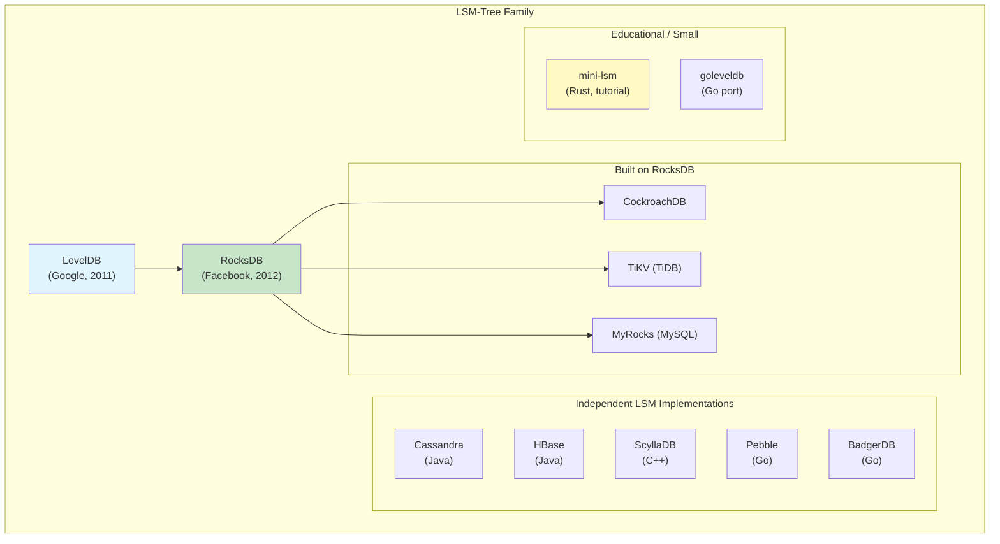

# Module 9: LSM Trees & Log-Structured Storage -- Resources & Links

## Foundational Papers

### The Original LSM-Tree Paper
- **"The Log-Structured Merge-Tree (LSM-Tree)"** -- Patrick O'Neil, Edward Cheng, Dieter Gawlick, Elizabeth O'Neil (1996)
- https://www.cs.umb.edu/~poneil/lsmtree.pdf
- The paper that started it all. Introduces the concept of buffering writes in memory and flushing to sorted runs on disk. Surprisingly readable for a 1996 paper.

### The RUM Conjecture
- **"Designing Access Methods: The RUM Conjecture"** -- Manos Athanassoulis, Michael S. Kester, Lukas M. Maas, Stratos Idreos (2016)
- https://stratos.seas.harvard.edu/files/stratos/files/rum.pdf
- Formalizes the trade-off between Read, Update, and Memory overhead. Essential reading for understanding why no single data structure can be optimal for all workloads.

### Dostoevsky: Better Trade-offs for LSM Trees
- **"Dostoevsky: Better Space-Time Trade-Offs for LSM-Tree Based Key-Value Stores"** -- Niv Dayan, Stratos Idreos (2018)
- https://scholar.harvard.edu/files/stratos/files/dostoevskykv.pdf
- Proposes "Lazy Leveling" -- a hybrid between tiered and leveled compaction that offers superior trade-offs.

### Monkey: Optimal Bloom Filters for LSM Trees
- **"Monkey: Optimal Navigable Key-Value Store"** -- Niv Dayan, Manos Athanassoulis, Stratos Idreos (2017)
- https://stratos.seas.harvard.edu/files/stratos/files/monkeykeyvaluestore.pdf
- Shows how to optimally allocate Bloom filter memory across levels (allocating more bits to deeper levels).

### WiscKey: Separating Keys from Values
- **"WiscKey: Separating Keys from Values in SSD-Conscious Storage"** -- Lanyue Lu, Thanumalayan S. Pillai, Andrea C. Arpaci-Dusseau, Remzi H. Arpaci-Dusseau (2016)
- https://www.usenix.org/system/files/conference/fast16/fast16-papers-lu.pdf
- Proposes storing values separately from keys in a value log, dramatically reducing write amplification. Inspired BadgerDB (Go) and Titan (RocksDB plugin).

---

## Official Documentation

### LevelDB
- **LevelDB Source Code**: https://github.com/google/leveldb
- **LevelDB Implementation Notes** (by Jeff Dean and Sanjay Ghemawat): https://github.com/google/leveldb/blob/main/doc/impl.md
- **LevelDB Table Format**: https://github.com/google/leveldb/blob/main/doc/table_format.md
- **LevelDB Log Format**: https://github.com/google/leveldb/blob/main/doc/log_format.md
- Exceptionally clean C++ codebase. Reading the source is one of the best ways to understand LSM internals.

### RocksDB
- **RocksDB GitHub**: https://github.com/facebook/rocksdb
- **RocksDB Wiki** (comprehensive): https://github.com/facebook/rocksdb/wiki
- **RocksDB Tuning Guide**: https://github.com/facebook/rocksdb/wiki/RocksDB-Tuning-Guide
- **Leveled Compaction**: https://github.com/facebook/rocksdb/wiki/Leveled-Compaction
- **Universal Compaction**: https://github.com/facebook/rocksdb/wiki/Universal-Compaction
- **RocksDB Bloom Filter**: https://github.com/facebook/rocksdb/wiki/RocksDB-Bloom-Filter
- **Column Families**: https://github.com/facebook/rocksdb/wiki/Column-Families
- **Write Stalls**: https://github.com/facebook/rocksdb/wiki/Write-Stalls
- **Merge Operator**: https://github.com/facebook/rocksdb/wiki/Merge-Operator-Implementation
- **RocksDB FAQ**: https://github.com/facebook/rocksdb/wiki/RocksDB-FAQ

### Other LSM Implementations
- **Pebble** (Go, CockroachDB): https://github.com/cockroachdb/pebble
- **BadgerDB** (Go, WiscKey-inspired): https://github.com/dgraph-io/badger
- **sled** (Rust): https://github.com/spacejam/sled
- **TiKV** (Rust, uses RocksDB): https://github.com/tikv/tikv
- **mini-lsm** (Rust, educational): https://github.com/skyzh/mini-lsm -- Excellent hands-on tutorial for building an LSM tree step by step.

---

## Blog Posts & Articles

### Architecture Deep Dives
- **"The Secret Lives of Data: LSM Trees"** -- Ben Johnson
  - Visual, intuitive explanation of how LSM Trees work.

- **"How RocksDB Works"** -- Artem Krylysov
  - https://artem.krylysov.com/blog/2023/04/19/how-rocksdb-works/
  - Clear walkthrough of RocksDB architecture with diagrams.

- **"LSM Trees: the Go-To Data Structure for Databases, Search Engines, and More"** -- Alex Petrov
  - Deep dive into the data structure from the author of "Database Internals."

- **"Leveled Compaction in Apache Cassandra"** -- DataStax blog
  - https://www.datastax.com/blog/leveled-compaction-apache-cassandra
  - Practical insights from Cassandra's compaction implementation.

### Compaction and Tuning
- **"Scylla's Compaction Strategies"** -- ScyllaDB blog
  - https://www.scylladb.com/2018/01/31/compaction-series-space-amplification/
  - Excellent multi-part series on compaction strategies and their trade-offs.

- **"RocksDB Tuning Guide"** -- Facebook Engineering
  - Practical advice on tuning RocksDB for production workloads.

- **"Compaction Analysis of RocksDB"** -- Mark Callaghan
  - http://smalldatum.blogspot.com/
  - In-depth blog series from a RocksDB contributor analyzing compaction behavior.

### Bloom Filters
- **"Bloom Filters by Example"** -- Jason Davies
  - https://llimllib.github.io/bloomfilter-tutorial/
  - Interactive visualization of Bloom filter operations.

- **"When Bloom Filters Don't Bloom"** -- Cloudflare blog
  - https://blog.cloudflare.com/when-bloom-filters-dont-bloom/
  - Real-world performance analysis showing when Bloom filters help and when they do not.

### Write Amplification
- **"Write Amplification Analysis in Flash-Based Solid State Drives"**
  - Academic analysis of how write amplification affects SSD lifetime.

- **"The Five-Minute Rule"** -- Jim Gray, Goetz Graefe
  - Classic paper on the economics of caching vs. I/O, relevant to understanding why LSM Trees buffer writes.

---

## Books

### Database Internals by Alex Petrov (O'Reilly, 2019)
- **Chapters 7 & 8**: Comprehensive coverage of LSM Trees, SSTables, and compaction.
- The best modern book on storage engine internals. Highly recommended.
- https://www.databass.dev/

### Designing Data-Intensive Applications by Martin Kleppmann (O'Reilly, 2017)
- **Chapter 3: Storage and Retrieval**: covers LSM Trees and B-Trees side by side with excellent clarity.
- The most widely recommended book for understanding data system trade-offs.
- https://dataintensive.net/

### Database Design and Implementation by Edward Sciore (Springer, 2020)
- Hands-on textbook with code for building a database from scratch, including LSM-style storage.

---

## Conference Talks & Videos

### Must-Watch Talks
- **"The Log-Structured Merge-Tree" -- Ben Stopford** (Devoxx)
  - Clear 40-minute introduction to LSM Trees with visualizations.

- **"RocksDB Internals" -- Siying Dong** (Facebook Engineering)
  - https://www.youtube.com/watch?v=jGCv4r8CJEI
  - Deep dive from one of RocksDB's lead developers.

- **"Building a Database in Rust" -- Alex Chi (CMU Database Group)**
  - Walkthrough of building mini-lsm, an educational LSM-tree in Rust.
  - Companion to the mini-lsm GitHub project.

- **"The Internals of Compaction" -- Mark Callaghan** (Percona Live)
  - Detailed analysis of compaction behavior and tuning.

- **"LSM-based Storage Techniques: A Survey" -- Chen Luo, Michael Carey**
  - https://arxiv.org/abs/1812.07527
  - Comprehensive academic survey of LSM variations and optimizations.

### University Lectures
- **CMU 15-445/645: Database Systems** -- Andy Pavlo
  - https://15445.courses.cs.cmu.edu/
  - Lecture on storage engines covers LSM Trees. Full lectures available on YouTube.

- **MIT 6.830/6.814: Database Systems**
  - Covers LSM Trees in the context of log-structured storage.

---

## Interactive Tools & Visualizations

- **LSM Tree Visualizer**
  - https://ysn123.itch.io/lsm-tree-visualizer
  - Interactive visualization of writes, reads, and compaction in an LSM Tree.

- **Bloom Filter Interactive Demo**
  - https://llimllib.github.io/bloomfilter-tutorial/
  - Step through insertions and queries to see how Bloom filters work.

- **Skip List Visualization**
  - https://www.cs.usfca.edu/~galles/visualization/SkipList.html
  - Animate insertions and searches in a skip list.

---

## Benchmarking Tools

- **db_bench** (RocksDB's built-in benchmark)
  - https://github.com/facebook/rocksdb/wiki/Benchmarking-tools
  - The standard tool for benchmarking RocksDB with various workloads.

- **YCSB (Yahoo! Cloud Serving Benchmark)**
  - https://github.com/brianfrankcooper/YCSB
  - Industry-standard benchmark for key-value stores. Supports RocksDB, LevelDB, Cassandra, and many others.

- **go-ycsb** (Go implementation of YCSB)
  - https://github.com/pingcap/go-ycsb
  - From PingCAP (TiDB). Supports BadgerDB, Pebble, and other Go-based stores.

---

## Related Systems to Study

### Study Recommendations (in order)

1. **Start with mini-lsm** (https://github.com/skyzh/mini-lsm): Build an LSM tree step-by-step in Rust with guided exercises.
2. **Read LevelDB source**: Clean, well-documented ~12K lines of C++. Start with `db/db_impl.cc`.
3. **Read the RocksDB wiki**: Understand the production-grade enhancements.
4. **Study Pebble**: CockroachDB's Go implementation of a LevelDB-inspired engine. Well-documented.
5. **Explore Cassandra's compaction**: See how LSM principles apply at distributed scale.

---

## Newsletters & Communities

- **RocksDB Users Google Group**: https://groups.google.com/g/rocksdb
- **Database Internals Newsletter**: https://www.databass.dev/
- **r/databasedevelopment** (Reddit): Community for database engine developers.
- **Hacker News**: Search for "LSM tree" or "RocksDB" for frequently updated discussions.
