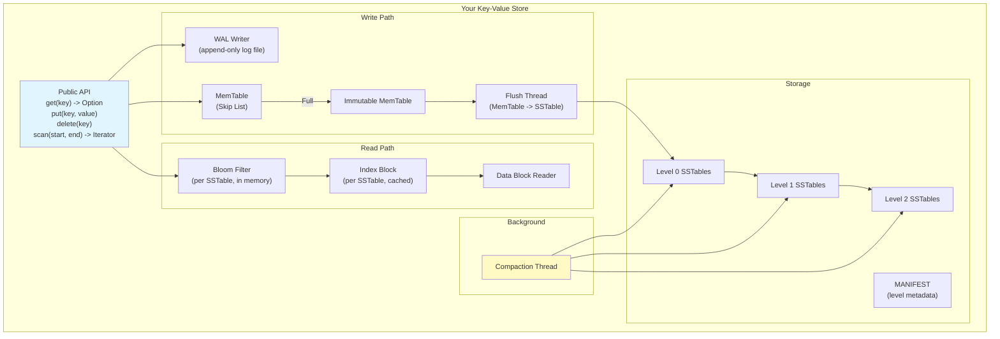
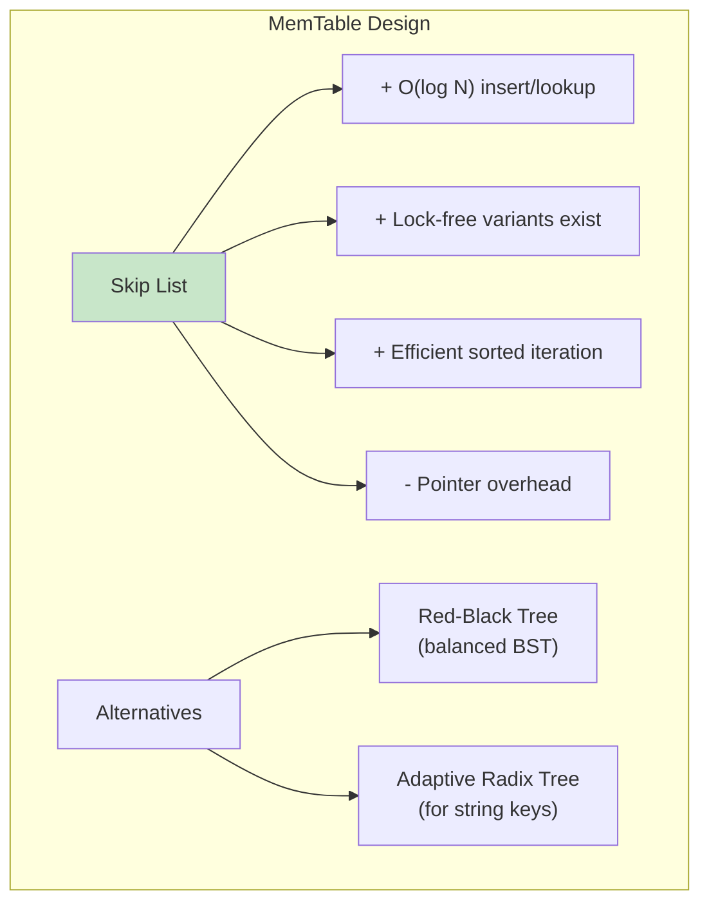
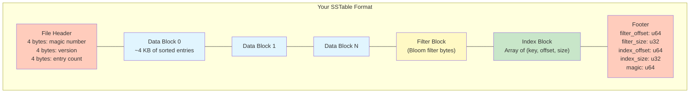
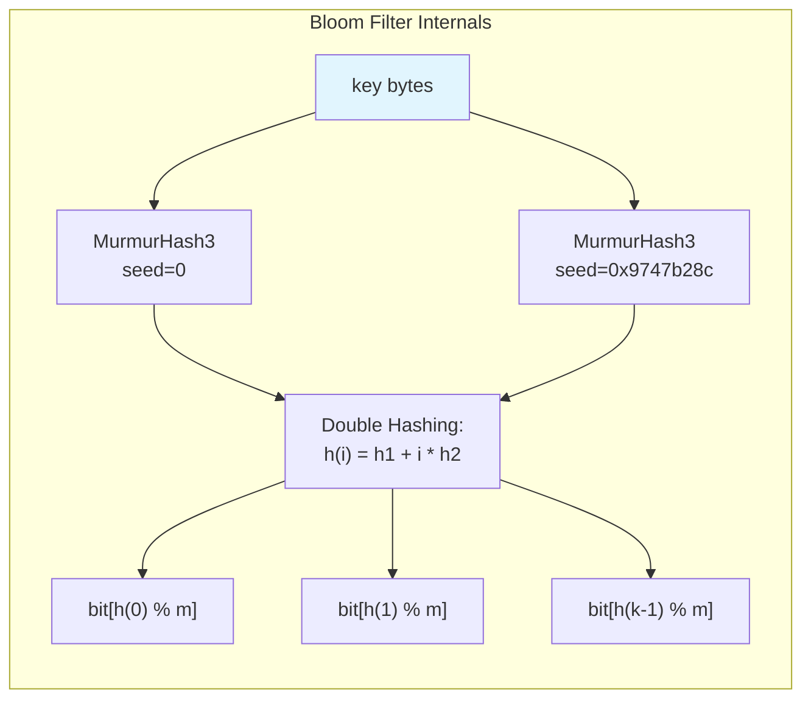
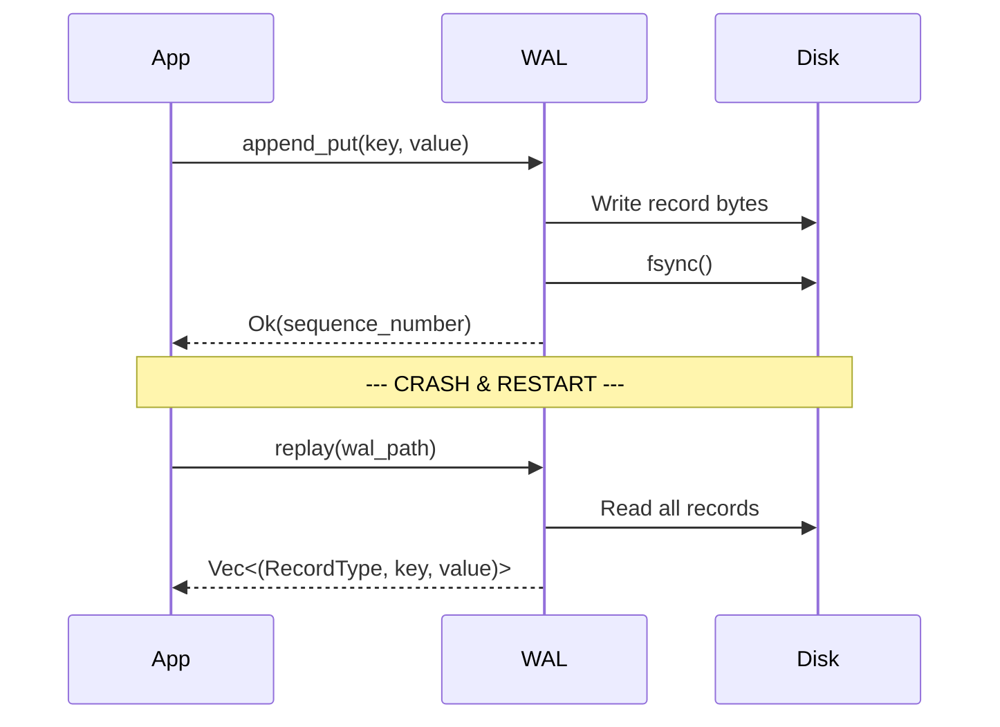
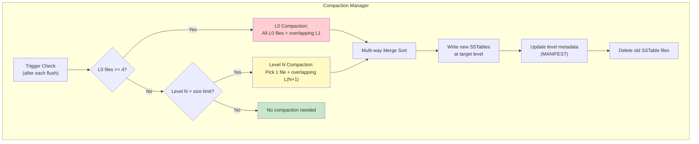
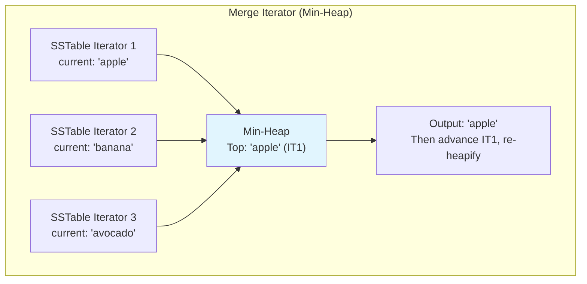
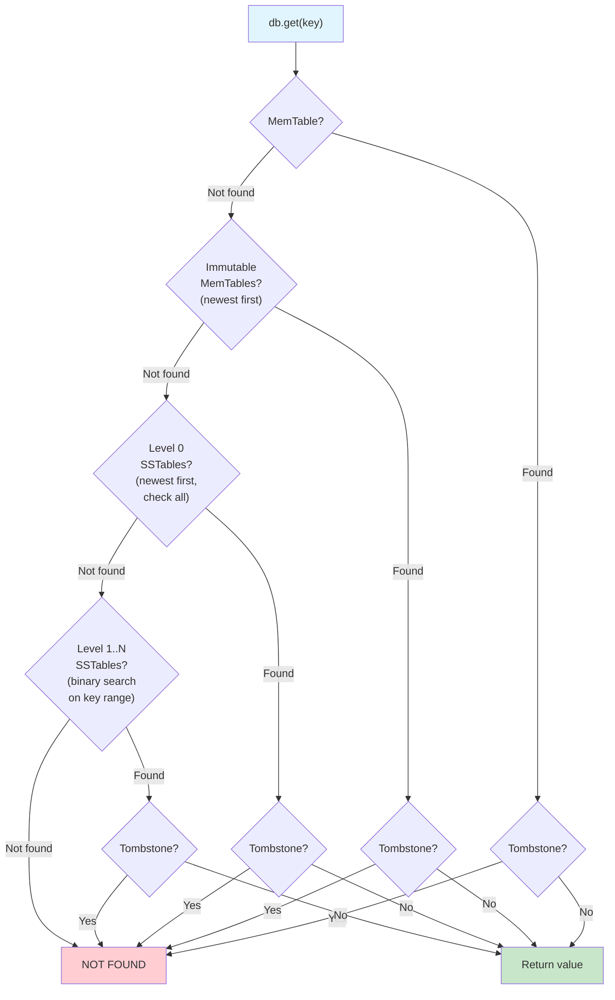
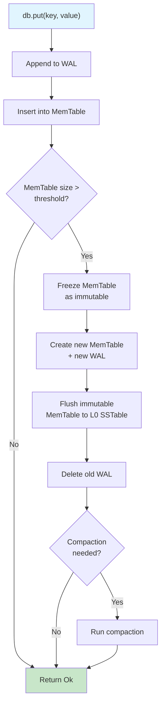
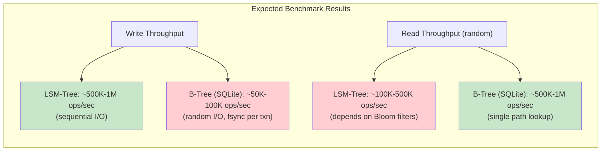

# Module 9: LSM Trees & Log-Structured Storage -- Project

## Project: Build a Key-Value Store with LSM-Tree

In this project, you will build a fully functional key-value store from scratch using LSM-Tree architecture. By the end, you will have a working storage engine that supports Get, Put, Delete, and Range Scan operations with crash recovery via WAL.

### Learning Objectives

- Implement each layer of an LSM-Tree from memory to disk.
- Understand the trade-offs between read amplification, write amplification, and space amplification.
- Build a working Bloom filter and observe its impact on read performance.
- Implement leveled compaction and understand why it is necessary.
- Benchmark write throughput and compare against a B-Tree approach.

---

## Architecture Overview



---

## Phase 1: MemTable with Skip List

### Requirements

Build a sorted in-memory data structure that supports:
- `put(key: &[u8], value: &[u8])`: Insert or update a key-value pair.
- `get(key: &[u8]) -> Option<&[u8]>`: Look up a key.
- `delete(key: &[u8])`: Mark a key as deleted (insert a tombstone marker).
- `iter() -> Iterator`: Iterate over all entries in sorted key order.
- `approximate_memory_usage() -> usize`: Track memory consumption.

### Design Decisions



### Implementation Steps

1. Define the `SkipListNode` struct with key, value, and a vector of forward pointers.
2. Implement the random level generator: each node is promoted to the next level with probability 1/4 (branching factor 4).
3. Implement `put`: traverse from the highest level, recording "update" nodes at each level, then insert the new node and splice it into each level.
4. Implement `get`: traverse from the highest level, descending when the next node's key is greater than the target.
5. Implement `delete`: insert a special tombstone value (e.g., an empty byte array with a flag).
6. Implement `iter`: walk the bottom level (level 0) from head to tail.
7. Track `approximate_memory_usage` by adding key.len() + value.len() + overhead per insert.

### Test Cases

```
put("apple", "red")
put("banana", "yellow")
put("cherry", "red")
assert get("banana") == Some("yellow")
assert get("grape") == None
delete("banana")
assert get("banana") == None  // tombstone
iter() should yield: apple, banana(tombstone), cherry
```

---

## Phase 2: SSTable Format (Write + Read)

### SSTable File Layout



### SSTable Writer

Implement a writer that:
1. Accepts key-value pairs in sorted order (assertion or panic if out of order).
2. Accumulates entries into a data block buffer.
3. When the block reaches ~4 KB, flushes it to the file and records an index entry.
4. For each key, adds it to a Bloom filter.
5. After all entries: writes the filter block, index block, and footer.

### Data Block Entry Format

```
For each entry:
  [shared_prefix_len: varint]
  [unshared_key_len: varint]
  [value_len: varint]
  [unshared_key_bytes: bytes]
  [value_bytes: bytes]

At end of block:
  [restart_point_offsets: u32 array]
  [num_restart_points: u32]
```

Use prefix compression with restart points every 16 entries.

### SSTable Reader

Implement a reader that:
1. Opens the file, reads the footer to locate the index and filter blocks.
2. Parses and caches the index block and Bloom filter in memory.
3. For `get(key)`:
   - Check Bloom filter first.
   - Binary search the index block to find the right data block.
   - Read and decompress the data block.
   - Linear scan (or binary search via restart points) within the block.
4. For iteration: implement a `SSTableIterator` that reads blocks sequentially.

### Test Cases

```
// Write an SSTable
writer = SSTableWriter::new("test.sst", 1000)
writer.add("aardvark", "animal")
writer.add("apple", "fruit")
writer.add("banana", "fruit")
// ... add 997 more entries ...
writer.finish()

// Read it back
reader = SSTableReader::open("test.sst")
assert reader.get("apple") == Some("fruit")
assert reader.get("missing") == None
assert reader.get("banana") == Some("fruit")
```

---

## Phase 3: Bloom Filter

### Requirements

- `new(expected_keys: usize, bits_per_key: usize)`: create a filter.
- `insert(key: &[u8])`: add a key.
- `may_contain(key: &[u8]) -> bool`: query membership.
- `to_bytes() / from_bytes()`: serialize/deserialize for SSTable storage.

### Implementation Details



Use the **double hashing** technique: instead of k independent hash functions, compute two hashes h1 and h2, then derive k positions as `h(i) = h1 + i * h2`. This is mathematically proven to have the same false positive rate as k independent hashes.

### Verification

Write a test that:
1. Inserts 10,000 keys.
2. Verifies zero false negatives (all inserted keys return true).
3. Checks 10,000 non-existent keys and measures the false positive rate.
4. With 10 bits/key, the FPR should be approximately 1%.

---

## Phase 4: Write-Ahead Log (WAL)

### Requirements



### WAL Record Format

```
[record_type: u8]       // 1=Put, 2=Delete
[sequence_number: u64]  // Monotonically increasing
[key_length: u32]
[value_length: u32]
[key: bytes]
[value: bytes]
[crc32: u32]            // Integrity check
```

### Implementation Steps

1. **WALWriter**: append records to a file with buffered I/O, call fsync after each write (or batch for performance).
2. **WALReader**: read records sequentially, verify CRC32, yield `(type, seq, key, value)`.
3. **Recovery**: replay all records into a fresh MemTable.

### Crash Recovery Test

```
// Write some data
db.put("a", "1")
db.put("b", "2")
db.put("c", "3")
// Simulate crash (drop the DB without flushing MemTable)
drop(db)

// Reopen
db = DB::open(path)
assert db.get("a") == Some("1")
assert db.get("b") == Some("2")
assert db.get("c") == Some("3")
```

---

## Phase 5: Leveled Compaction

### Design



### Multi-Way Merge Sort

The core of compaction is merging multiple sorted SSTable iterators into one sorted stream.



### Implementation Steps

1. Implement `MergeIterator` using a binary min-heap of SSTable iterators.
2. When multiple iterators have the same key, output only the newest version (from the file with the highest sequence number).
3. Drop tombstones if the merge includes the bottom level.
4. Split output into new SSTables at TARGET_FILE_SIZE (2 MB).
5. Update the MANIFEST file atomically.

### Level Size Configuration

```
const L0_COMPACTION_TRIGGER: usize = 4;
const L1_MAX_BYTES: u64 = 64 * 1024 * 1024;     // 64 MB
const LEVEL_SIZE_MULTIPLIER: u64 = 10;
const TARGET_FILE_SIZE: u64 = 2 * 1024 * 1024;   // 2 MB
const MAX_LEVELS: usize = 7;
```

---

## Phase 6: Full API Integration

### The DB Struct

```rust
pub struct DB {
    // Write path
    wal: WALWriter,
    memtable: SkipListMemTable,
    immutable_memtables: Vec<SkipListMemTable>,

    // Read/write path
    levels: LevelManager,

    // Configuration
    config: DBConfig,

    // Concurrency
    // (simplified: single-threaded for this project)
}

impl DB {
    pub fn open(path: &str) -> Result<Self> { /* ... */ }
    pub fn put(&mut self, key: &[u8], value: &[u8]) -> Result<()> { /* ... */ }
    pub fn get(&self, key: &[u8]) -> Result<Option<Vec<u8>>> { /* ... */ }
    pub fn delete(&mut self, key: &[u8]) -> Result<()> { /* ... */ }
    pub fn scan(&self, start: &[u8], end: &[u8]) -> Result<ScanIterator> { /* ... */ }
    fn maybe_flush(&mut self) -> Result<()> { /* ... */ }
    fn maybe_compact(&mut self) -> Result<()> { /* ... */ }
}
```

### Complete Read Path



### Complete Write Path



---

## Phase 7: Benchmarking

### Write Throughput Benchmark

```rust
fn benchmark_write_throughput(db: &mut DB, num_keys: usize) {
    let start = Instant::now();

    for i in 0..num_keys {
        let key = format!("key_{:010}", i);
        let value = format!("value_{:0100}", i); // 100-byte values
        db.put(key.as_bytes(), value.as_bytes()).unwrap();
    }

    let elapsed = start.elapsed();
    let ops_per_sec = num_keys as f64 / elapsed.as_secs_f64();
    let mb_per_sec = (num_keys * 110) as f64 / elapsed.as_secs_f64() / 1_000_000.0;

    println!("Write throughput: {:.0} ops/sec, {:.1} MB/s", ops_per_sec, mb_per_sec);
}
```

### Read Throughput Benchmark

```rust
fn benchmark_read_throughput(db: &DB, num_keys: usize) {
    let start = Instant::now();

    for i in 0..num_keys {
        let key = format!("key_{:010}", i);
        let _ = db.get(key.as_bytes());
    }

    let elapsed = start.elapsed();
    let ops_per_sec = num_keys as f64 / elapsed.as_secs_f64();
    println!("Read throughput: {:.0} ops/sec", ops_per_sec);
}
```

### Expected Results



### Metrics to Measure

| Metric | How to Measure |
|---|---|
| Write throughput (ops/sec) | Time N sequential puts |
| Read throughput (ops/sec) | Time N random gets |
| Read throughput (missing keys) | Time N gets for non-existent keys |
| Write amplification | Total bytes written to disk / total bytes of user data |
| Space amplification | Total SSTable size / logical data size |
| Bloom filter effectiveness | Count of Bloom filter hits (avoided disk reads) vs. misses |
| Compaction time | Time spent in compaction vs. total runtime |
| P50/P99 read latency | Histogram of individual read latencies |

---

## Stretch Goals

### 1. Concurrent Read/Write Support
Add a `RwLock` around the MemTable and use reference counting (Arc) for immutable SSTables. Allow multiple concurrent readers while a single writer modifies the MemTable.

### 2. Configurable Compaction Strategies
Implement size-tiered compaction as an alternative. Allow switching between leveled and size-tiered at startup. Compare write amplification between the two.

### 3. Block Compression
Add LZ4 or Snappy compression to data blocks. Measure the trade-off between compression ratio and read throughput.

### 4. Range Deletion Support
Implement `delete_range(start, end)` using range tombstones. Store them in a separate block within the SSTable.

### 5. TTL Support
Add a TTL (time-to-live) parameter to `put`. During compaction, drop entries whose TTL has expired. This is useful for cache-like workloads.

### 6. MANIFEST File
Persist the current level state (which SSTables exist at which level) to a MANIFEST file. On startup, read the MANIFEST to reconstruct the level manager state instead of scanning the directory.

---

## Project Structure

```
lsm-kvstore/
  src/
    lib.rs              // Public API (DB struct)
    memtable.rs         // Skip list MemTable
    sstable/
      writer.rs         // SSTable writer
      reader.rs         // SSTable reader
      block.rs          // Data block builder/reader
      filter.rs         // Bloom filter
    wal.rs              // Write-ahead log
    compaction.rs       // Leveled compaction
    manifest.rs         // Level metadata persistence
    merge_iterator.rs   // Multi-way merge iterator
    types.rs            // Common types (ValueType, InternalKey)
  tests/
    memtable_test.rs
    sstable_test.rs
    bloom_test.rs
    wal_test.rs
    compaction_test.rs
    db_test.rs          // End-to-end integration tests
  benches/
    throughput.rs       // Write/read benchmarks
  Cargo.toml
```

---

## Deliverables Checklist

- [ ] MemTable with skip list: put, get, delete, iterate
- [ ] SSTable writer with data blocks, index block, filter block, footer
- [ ] SSTable reader with Bloom filter check, index binary search, block read
- [ ] Bloom filter with configurable bits-per-key and verified FPR
- [ ] WAL writer and reader with CRC32 integrity checks
- [ ] WAL-based crash recovery (write data, simulate crash, reopen, verify data)
- [ ] Leveled compaction with L0 trigger and level size limits
- [ ] Full DB API: get, put, delete, scan
- [ ] Write throughput benchmark (target: 100K+ ops/sec)
- [ ] Read throughput benchmark with Bloom filter effectiveness report
- [ ] Comparison with SQLite or similar B-Tree store
