# Module 9: LSM Trees & Log-Structured Storage -- Core Teaching Content

## 1. The Write Amplification Problem with B-Trees

B-Trees are the workhorse of traditional databases -- PostgreSQL, MySQL/InnoDB, and Oracle all rely on them. They provide excellent **read** performance with O(log N) lookups. But they have a fundamental problem for write-heavy workloads: **write amplification**.

### What is write amplification?

Write amplification is the ratio of the actual bytes written to disk versus the logical bytes the application intended to write. When you update a single 100-byte row in a B-Tree:

1. The database reads the entire 4 KB--16 KB page containing that row.
2. It modifies the row in memory.
3. It writes the **entire page** back to disk.
4. It may also write a WAL record.
5. If the page splits, two new pages are written plus updates to the parent.

A 100-byte logical write can easily become 32 KB or more of physical I/O. That is a write amplification factor of 320x.

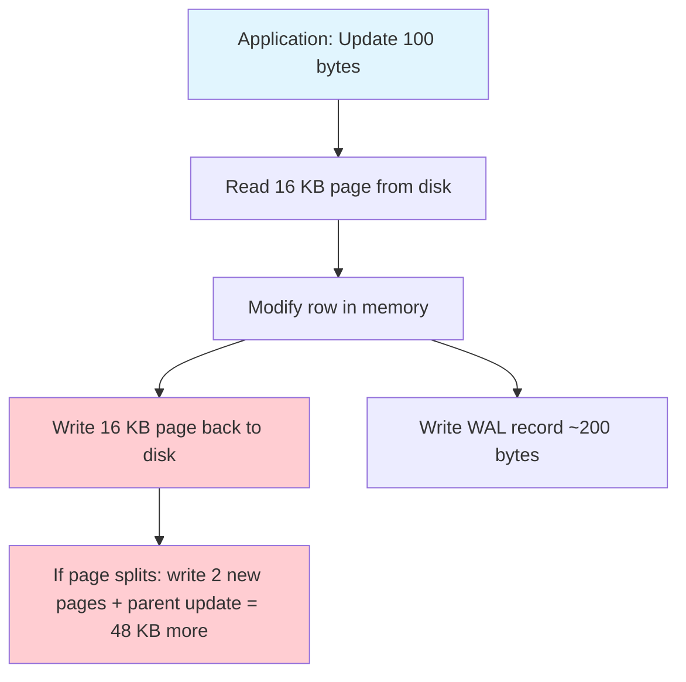

### Why this matters

On SSDs, write amplification has three costs:

- **Throughput**: every unnecessary write byte consumes I/O bandwidth.
- **Latency**: random writes to B-Tree pages cannot be fully parallelized.
- **Device lifetime**: SSDs have a finite number of program/erase cycles per cell. Excessive writes wear out the drive faster.

On HDDs, the situation is even worse because random writes require physical head seeks, making each B-Tree page write extremely expensive.

---

## 2. The Big Idea: Turn Random Writes into Sequential Writes

The key insight behind Log-Structured Merge Trees (LSM Trees) is deceptively simple:

> **Never modify data in place. Instead, always append new data sequentially, and reorganize it in the background.**

Sequential writes are dramatically faster than random writes on all storage media:

| Storage Type | Random Write (4 KB) | Sequential Write (4 KB) | Ratio |
|---|---|---|---|
| HDD (7200 RPM) | ~100 IOPS | ~50 MB/s (~12,800 IOPS equiv.) | 128x |
| SATA SSD | ~30,000 IOPS | ~500 MB/s | ~16x |
| NVMe SSD | ~200,000 IOPS | ~3 GB/s | ~15x |

LSM Trees exploit this gap. Instead of updating pages in-place like B-Trees, they:

1. Buffer writes in memory (fast).
2. Flush the buffer to disk as a sorted, immutable file (sequential write).
3. Merge and reorganize files in the background (sequential reads + writes).

Patrick O'Neil et al. introduced this idea in the 1996 paper *"The Log-Structured Merge-Tree (LSM-Tree)."*

---

## 3. LSM-Tree Architecture Overview

An LSM-Tree organizes data across multiple layers, from fast memory to slower disk. Each layer is larger than the previous one, typically by a factor of 10.

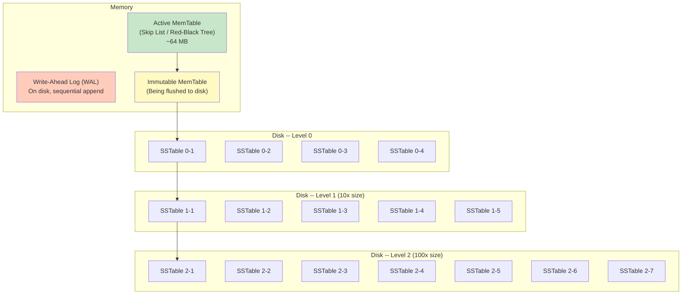

### The layers explained

| Component | Location | Sorted? | Mutable? | Typical Size |
|---|---|---|---|---|
| WAL | Disk (sequential) | No (append-only) | Append-only | Same as MemTable |
| Active MemTable | Memory | Yes | Yes | 64--256 MB |
| Immutable MemTable | Memory | Yes | No | 64--256 MB |
| Level 0 SSTables | Disk | Yes (within file), overlapping between files | No | ~256 MB total |
| Level 1 SSTables | Disk | Yes, non-overlapping | No | ~2.56 GB total |
| Level 2 SSTables | Disk | Yes, non-overlapping | No | ~25.6 GB total |
| Level N SSTables | Disk | Yes, non-overlapping | No | 10^N * Level0 |

**Critical property**: At Level 1 and beyond, SSTables within the same level have **non-overlapping key ranges**. Level 0 is the exception -- its files can have overlapping ranges because they are direct flushes from MemTables.

---

## 4. MemTable: The In-Memory Buffer

The MemTable is an in-memory sorted data structure that buffers recent writes. It must support:

- **O(log N) insert**: fast writes
- **O(log N) point lookup**: find a key
- **O(N) ordered iteration**: for flushing to an SSTable in sorted order

### Common MemTable implementations

**Skip List** (used by LevelDB, RocksDB default):
- Probabilistic data structure that provides O(log N) average for insert, delete, and lookup.
- Lock-free variants exist for concurrent access (RocksDB uses a lock-free skip list).
- Cache-friendly due to sequential node traversal.

**Red-Black Tree**:
- Self-balancing BST with O(log N) worst-case for all operations.
- Used in some implementations but less common due to pointer-heavy structure.

**Hash Skip List** (RocksDB option):
- Optimized for prefix-based lookups.

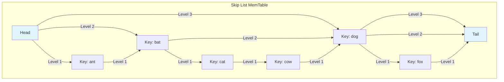

---

## 5. The Write Path

Writing to an LSM-Tree is a two-step process that is intentionally simple and fast.

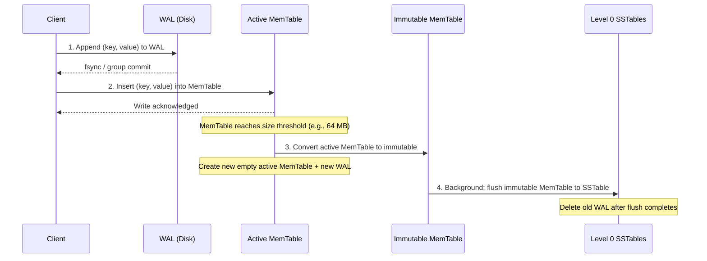

### Step by step

1. **Write to WAL**: The key-value pair is appended to the Write-Ahead Log on disk. This is a sequential append, so it is very fast. The WAL ensures durability -- if the process crashes, the MemTable can be rebuilt by replaying the WAL.

2. **Insert into MemTable**: The key-value pair is inserted into the in-memory sorted structure. This is an O(log N) operation.

3. **MemTable rotation**: When the active MemTable reaches a size threshold (typically 64 MB), it is marked as **immutable** (no more writes accepted), and a new empty MemTable + WAL is created. The application continues writing to the new MemTable without blocking.

4. **Flush to SSTable**: A background thread writes the immutable MemTable to disk as a new Level 0 SSTable. Since the MemTable is already sorted, this is a simple sequential write. Once the flush is complete, the corresponding WAL file is deleted.

**Write performance**: Steps 1 and 2 are all that the client waits for. A WAL append + memory insert is dramatically faster than a B-Tree page read-modify-write cycle. This is why LSM Trees excel at write-heavy workloads.

---

## 6. The Read Path

Reading from an LSM-Tree is more complex than reading from a B-Tree because data may be spread across multiple levels.

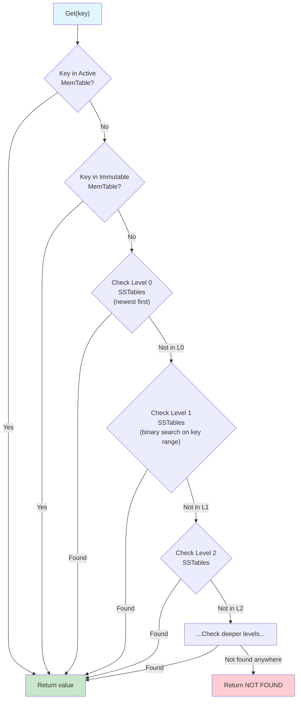

### Read path details

1. **Check Active MemTable**: O(log N) lookup in the skip list. If found, return immediately.

2. **Check Immutable MemTable(s)**: Same as above. There may be 0--2 immutable MemTables awaiting flush.

3. **Check Level 0**: Each L0 SSTable may contain the key (their ranges overlap). Check each one from newest to oldest. For each SSTable:
   - Check the **Bloom filter** first (if key is definitely not present, skip this file).
   - If Bloom filter says "maybe," look up the **index block** to find the data block.
   - Read and search the data block.

4. **Check Level 1+**: Since SSTables at these levels have non-overlapping key ranges, binary search determines which single SSTable could contain the key. Then check its Bloom filter and index.

5. **Return the first match found** (from the newest source), or NOT FOUND.

### Why reads can be slow

In the worst case (key does not exist), the read path must check every level. With 7 levels, this could mean checking 7+ files. This is the fundamental trade-off of LSM Trees: **writes are fast, reads can be slower**.

Bloom filters are critical for mitigating this. A Bloom filter can tell you with certainty that a key is **not** in an SSTable, avoiding unnecessary disk reads.

---

## 7. SSTable (Sorted String Table) Format

An SSTable is an immutable file containing a sorted sequence of key-value pairs. The format is designed for efficient sequential writes and efficient point/range reads.

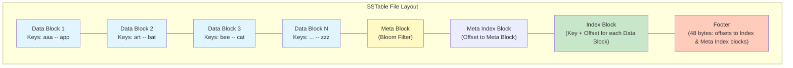

### Data Block

Each data block (typically 4 KB) contains a sorted sequence of key-value entries using **prefix compression** (also called delta encoding):

```
| Shared key length | Unshared key length | Value length | Unshared key bytes | Value bytes |
```

For example, if consecutive keys are "application" and "approximate":
- Shared prefix: "app" (3 bytes)
- Entry for "approximate": shared=3, unshared=8, key="roximate"

Every N entries (the **restart interval**, typically 16), a full key is stored without prefix compression to allow binary search within the block.

### Index Block

The index block contains one entry per data block. Each entry holds:
- A key >= the last key in the corresponding data block and < the first key in the next block.
- The offset and size of the data block.

This enables binary search across data blocks.

### Filter Block (Bloom Filter)

Contains a Bloom filter for the keys in this SSTable. This allows quickly rejecting point lookups for keys that are not present without reading any data blocks.

### Footer

A fixed-size (48 bytes in LevelDB) structure at the end of the file containing:
- The offset and size of the meta index block.
- The offset and size of the index block.
- A magic number for format verification.

---

## 8. Compaction: Why and What

Over time, the LSM Tree accumulates many SSTables. Without maintenance:
- **Read amplification** increases (more files to check).
- **Space amplification** increases (old versions of updated/deleted keys waste space).
- Level 0 can grow without bound.

**Compaction** is the background process that merges SSTables, removes obsolete entries, and pushes data to deeper levels.

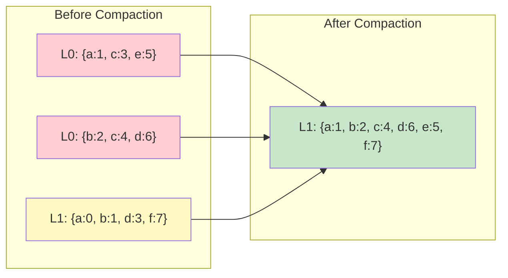

### What compaction does

1. **Selects input files**: chooses SSTables from one or two adjacent levels.
2. **Merge-sorts**: reads all selected files in key order, producing a single sorted stream.
3. **Drops obsolete entries**: if multiple versions of a key exist, keeps only the newest. If a tombstone (delete marker) exists and all older versions are in the merge, drops the key entirely.
4. **Writes new SSTables**: outputs sorted, non-overlapping SSTables at the target level.
5. **Atomically swaps**: updates the LSM metadata (MANIFEST file) to point to the new files and deletes the old input files.

---

## 9. Compaction Strategies

Different compaction strategies optimize for different workload characteristics. The choice of strategy is one of the most impactful configuration decisions for an LSM-based system.

### 9.1 Leveled Compaction (LCS)

Used by LevelDB and RocksDB (default). Each level has a size limit. When a level exceeds its limit, one SSTable is picked and merged with overlapping SSTables in the next level.

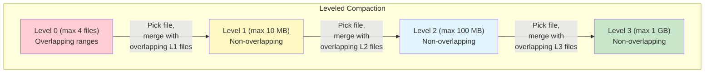

**Properties**:
- Low space amplification (~1.1x).
- Low read amplification (at most one file per level to check).
- High write amplification (a key may be rewritten 10x per level transition).
- Best for: read-heavy workloads, limited disk space.

### 9.2 Size-Tiered Compaction (STCS)

Used by Cassandra (default), HBase, and ScyllaDB. SSTables of similar size are grouped and merged together.

**Properties**:
- Low write amplification.
- Higher space amplification (up to 2x during compaction).
- Higher read amplification (more files to check).
- Best for: write-heavy workloads.

### 9.3 FIFO Compaction

Simply drops the oldest SSTable when total size exceeds a threshold. No merge is performed.

**Properties**:
- Minimal write amplification (almost zero -- data is written once and deleted).
- Only suitable for time-series/TTL data where old data is worthless.

### 9.4 Universal Compaction (RocksDB)

A hybrid between size-tiered and leveled. It tries to minimize write amplification while bounding space amplification. It considers the ratio of sizes between adjacent sorted runs and merges when the ratio is too large.

---

## 10. Bloom Filters: Probabilistic Membership Testing

A Bloom filter is a space-efficient probabilistic data structure that answers the question: "Is element X in this set?"

- If the Bloom filter says **NO**: the element is definitely not in the set. (No false negatives.)
- If the Bloom filter says **YES**: the element is *probably* in the set. (Possible false positives.)

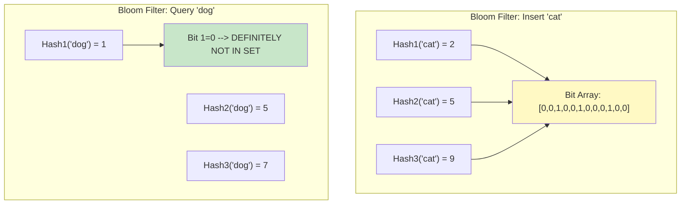

### Why Bloom filters are essential for LSM Trees

Without Bloom filters, a point lookup for a non-existent key would require reading the index block (and potentially data blocks) of every SSTable at every level. With Bloom filters:

- Each SSTable has its own Bloom filter (typically loaded into memory).
- Before reading any data from an SSTable, check its Bloom filter.
- With a 1% false positive rate (10 bits per key), 99% of unnecessary SSTable reads are eliminated.

### The math

For a Bloom filter with:
- `m` bits in the array
- `n` keys inserted
- `k` hash functions

The false positive probability is approximately:

```
FPR = (1 - e^(-kn/m))^k
```

The optimal number of hash functions is:

```
k_opt = (m/n) * ln(2) ~ 0.693 * (m/n)
```

With **10 bits per key** and 7 hash functions, the FPR is approximately **0.82%** (~1%).

---

## 11. Amplification Factors: The LSM Trade-off Triangle

Every storage engine must contend with three types of amplification:

| Amplification Type | Definition | B-Tree | LSM (Leveled) | LSM (Size-Tiered) |
|---|---|---|---|---|
| **Write** | bytes written to disk / bytes written by app | 10--30x | 10--30x | 3--5x |
| **Read** | bytes read from disk / bytes requested by app | 1x | 1--2x | 5--20x |
| **Space** | bytes on disk / bytes of actual data | 1--1.5x | 1.1x | 2--3x |

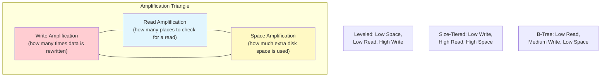

---

## 12. The RUM Conjecture

The **RUM Conjecture** (Athanassoulis et al., 2016) formalizes the fundamental trade-off:

> An access method that provides optimal performance for any two of **R**ead overhead, **U**pdate (write) overhead, and **M**emory (space) overhead must be sub-optimal for the third.

This is analogous to the CAP theorem for distributed systems, but for storage engine design:

- **Optimize Read + Memory** (minimize reads and space) --> B-Trees. Writes are expensive (in-place updates, page splits).
- **Optimize Update + Memory** (minimize writes and space) --> Leveled LSM. Reads must check multiple levels.
- **Optimize Read + Update** (minimize reads and writes) --> Size-tiered LSM or in-memory stores. Space usage is high (multiple copies of data).

No single data structure can be optimal on all three axes.

---

## 13. LSM Trees vs. B-Trees: A Comprehensive Comparison

| Dimension | B-Tree | LSM-Tree |
|---|---|---|
| **Write throughput** | Lower (random I/O, page splits) | Higher (sequential I/O, memory buffering) |
| **Read latency** | Lower, predictable (single path from root to leaf) | Higher, variable (check multiple levels) |
| **Write amplification** | 10--30x (page rewrites) | 10--30x (leveled) or 3--5x (tiered) |
| **Space efficiency** | ~60--70% page utilization | Near 100% after compaction |
| **Concurrency** | Complex latch protocols | Simpler (immutable SSTables, only MemTable needs sync) |
| **Range scans** | Excellent (leaves are linked) | Good after compaction, poor if many levels |
| **Deletes** | Immediate (mark + reclaim) | Deferred (tombstones, reclaimed during compaction) |
| **Predictability** | Steady-state I/O | Compaction spikes can cause latency jitter |
| **Use cases** | OLTP, read-heavy, point lookups | Write-heavy, time-series, logging, analytics ingest |

### Who uses what?

**B-Tree based**: PostgreSQL, MySQL/InnoDB, SQL Server, Oracle, SQLite.

**LSM-Tree based**: RocksDB, LevelDB, Cassandra, HBase, CockroachDB (on top of RocksDB/Pebble), TiKV (TiDB's storage engine), InfluxDB, ScyllaDB, BadgerDB (Go), Pebble (Go, CockroachDB).

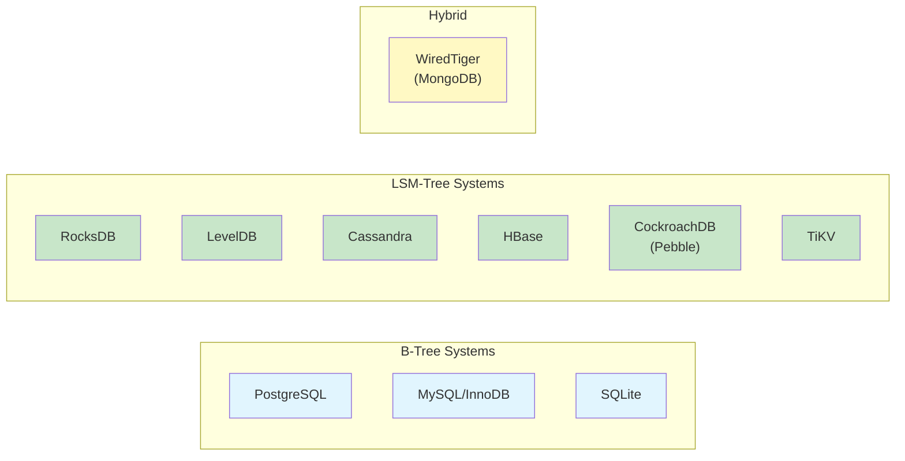

---

## 14. Key Takeaways

1. **LSM Trees trade read performance for write performance** by converting random writes into sequential writes.
2. The **MemTable** buffers writes in memory; the **WAL** ensures durability before flushing.
3. **SSTables** are immutable, sorted files on disk. They are organized into levels.
4. **Compaction** merges SSTables to reclaim space, remove obsolete data, and reduce read amplification.
5. **Leveled compaction** minimizes space and read amplification at the cost of higher write amplification.
6. **Size-tiered compaction** minimizes write amplification at the cost of higher space and read amplification.
7. **Bloom filters** are essential for reducing read amplification by avoiding unnecessary SSTable reads.
8. The **RUM Conjecture** tells us no data structure can be optimal for reads, writes, and memory simultaneously.
9. **Choose B-Trees** when reads dominate and latency predictability matters.
10. **Choose LSM Trees** when writes dominate and you can tolerate occasional compaction-induced latency spikes.

---

## 15. Summary Diagram: Complete LSM-Tree Data Flow

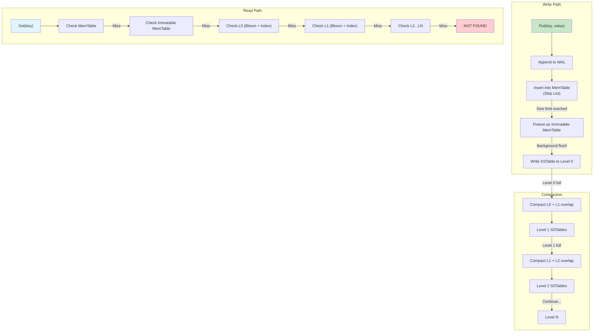
