# Module 10: Distributed Databases & Consensus - Deep Dive Explanations

## Raft Consensus Deep Dive

Raft is designed for understandability, but its edge cases are where the real complexity lies. Let us walk through every major scenario.

### Term and Leader Lifecycle

```mermaid
gantt
    title Raft Terms Over Time
    dateFormat X
    axisFormat %s

    section Term 1
    Leader A active       :a1, 0, 5
    section Term 2
    Election (A fails)    :crit, e1, 5, 6
    Leader B active       :a2, 6, 12
    section Term 3
    Election (split vote) :crit, e2, 12, 13
    No leader elected     :done, n1, 13, 14
    section Term 4
    Leader C active       :a3, 14, 20
```

A **term** is a logical clock that increases monotonically. Each term begins with an election. If the election succeeds, a leader serves for the rest of the term. If it fails (split vote), the term ends without a leader and a new term begins immediately.

**Critical rule:** If a node ever receives an RPC with a higher term than its own, it immediately updates its term and reverts to follower state. This ensures stale leaders step down.

### Log Replication: Commitment Rules

An entry is **committed** when the leader has replicated it to a majority of nodes. But there is a subtlety: **a leader must not commit entries from previous terms by counting replicas alone.**

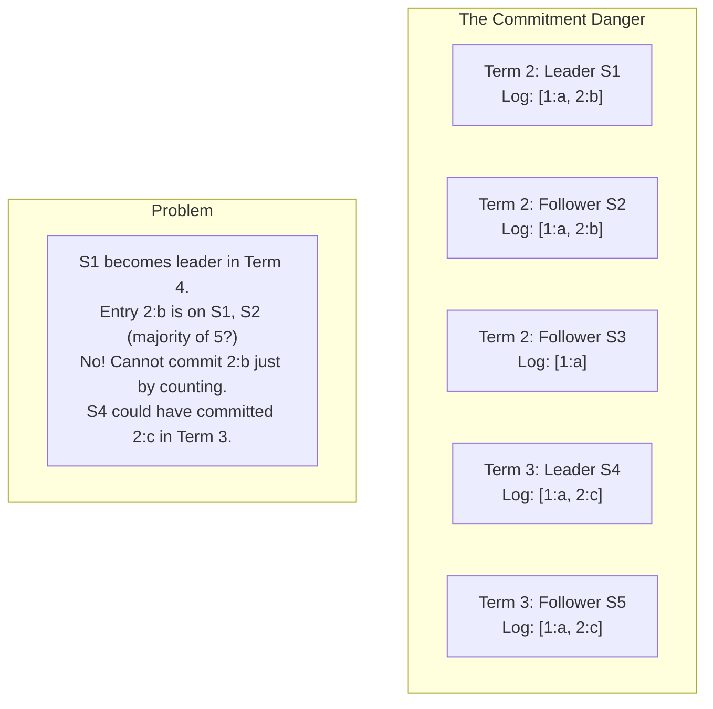

**Raft's rule:** A leader commits an entry from a previous term only by committing a **new entry from its current term** that comes after it. Once the current-term entry is committed (replicated to a majority), all preceding entries are implicitly committed.

### Term Changes and Log Conflicts

When a new leader is elected, followers may have divergent logs. The leader forces followers to match its log:

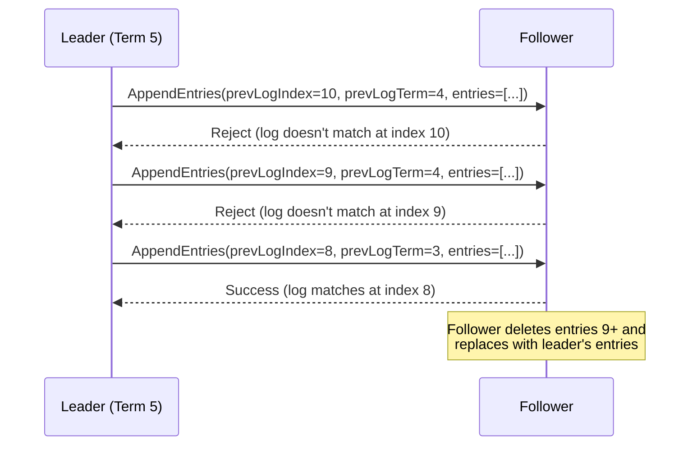

The leader maintains a `nextIndex` for each follower. On rejection, it decrements `nextIndex` and retries. This is an O(n) process in the worst case, but optimizations exist (follower can include the conflicting term's first index in its rejection).

### Membership Changes: Joint Consensus

Changing the cluster membership (adding/removing nodes) is dangerous because different nodes may observe the membership change at different times, creating two disjoint majorities.

**Raft's solution: Joint Consensus.**

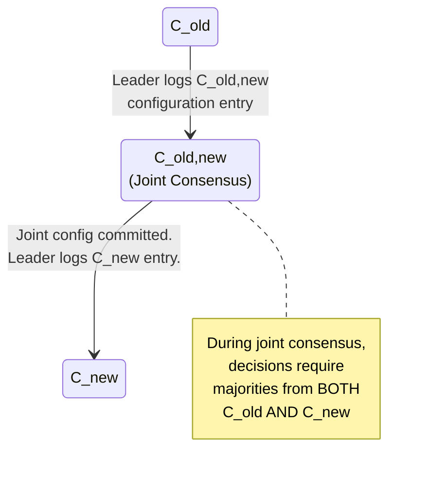

**Steps:**
1. Leader creates a `C_old,new` configuration entry that includes both old and new members.
2. Once `C_old,new` is committed, any decision requires majorities from **both** the old and new configurations.
3. Leader then creates a `C_new` configuration entry with only the new members.
4. Once `C_new` is committed, old members not in `C_new` can be shut down.

**Single-server changes (simplified):** Raft's later refinement allows adding or removing one server at a time without joint consensus. Since any two majorities of configurations differing by one node must overlap, safety is maintained.

---

## Multi-Raft: Scaling Consensus

A single Raft group handles one state machine. But a database has many ranges/regions. **Multi-Raft** runs many independent Raft groups, each managing a subset of the data.

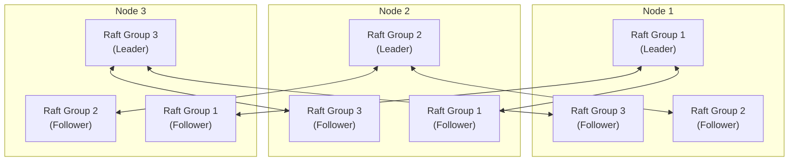

### How CockroachDB Uses Multi-Raft

CockroachDB divides the key space into **ranges** (default 512 MB each). Each range is a Raft group with three replicas (by default). Key features:

- **Range splits:** When a range exceeds the size limit, it splits into two ranges, each becoming its own Raft group.
- **Range merges:** Small adjacent ranges can merge.
- **Lease holder:** Each range has a lease holder (usually the Raft leader) that serves reads without going through Raft, reducing latency.
- **Raft message batching:** Messages between the same pair of nodes across all Raft groups are batched into single RPCs.

### How TiKV Uses Multi-Raft

TiKV (the storage layer of TiDB) similarly uses Multi-Raft with **Regions** (default 96 MB):

- **Placement Driver (PD):** A central metadata service that manages region metadata, scheduling, and timestamp allocation.
- **Region split/merge:** Automatic, managed by PD.
- **Raftstore:** TiKV's Raft implementation processes Raft messages in a batch reactor pattern for efficiency.

---

## Distributed Transactions: The Percolator Model

Google's Percolator (2010) is a distributed transaction protocol built on top of Bigtable. TiDB uses a refined version.

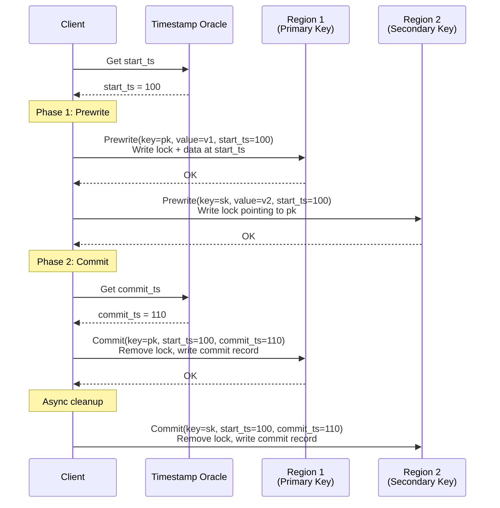

### Percolator Key Concepts

**Column families:** Each key has three column families:
- `data`: Stores the actual value, keyed by `start_ts`.
- `lock`: Stores lock information during transactions.
- `write`: Stores commit records mapping `commit_ts` to `start_ts`.

**Primary key:** One key is designated as the primary. The transaction's commit status is determined solely by the primary key's lock/write status.

**Reading:** A reader encountering a lock checks the primary key. If the primary's lock is gone and a write record exists, the transaction committed. If the primary's lock still exists, the transaction is in progress. If enough time has passed, the reader can roll back the stale transaction.

**Conflict detection:** During prewrite, if a lock or write record exists with a timestamp after `start_ts`, the transaction aborts (write-write conflict).

---

## Spanner's Externally Consistent Transactions

Google Spanner achieves **external consistency** (equivalent to strict serializability): if transaction T1 commits before transaction T2 starts, T1's commit timestamp is less than T2's.

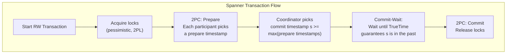

**Why this works:**
- Each participant's prepare timestamp is after all previously committed transactions it has seen.
- The coordinator picks `s >= all prepare timestamps`.
- Commit-wait ensures that `s` is definitely in the past before any subsequent transaction can start.
- Therefore, any subsequent transaction gets a higher timestamp.

**Read-only transactions** in Spanner:
- Pick a read timestamp.
- Read from any replica that is sufficiently up to date (no locking, no 2PC).
- This makes read-only transactions very fast and fully consistent.

---

## Calvin: Deterministic Database Protocol

Calvin (2012, Yale) takes a fundamentally different approach to distributed transactions. Instead of coordinating during execution, Calvin **orders all transactions up front**.

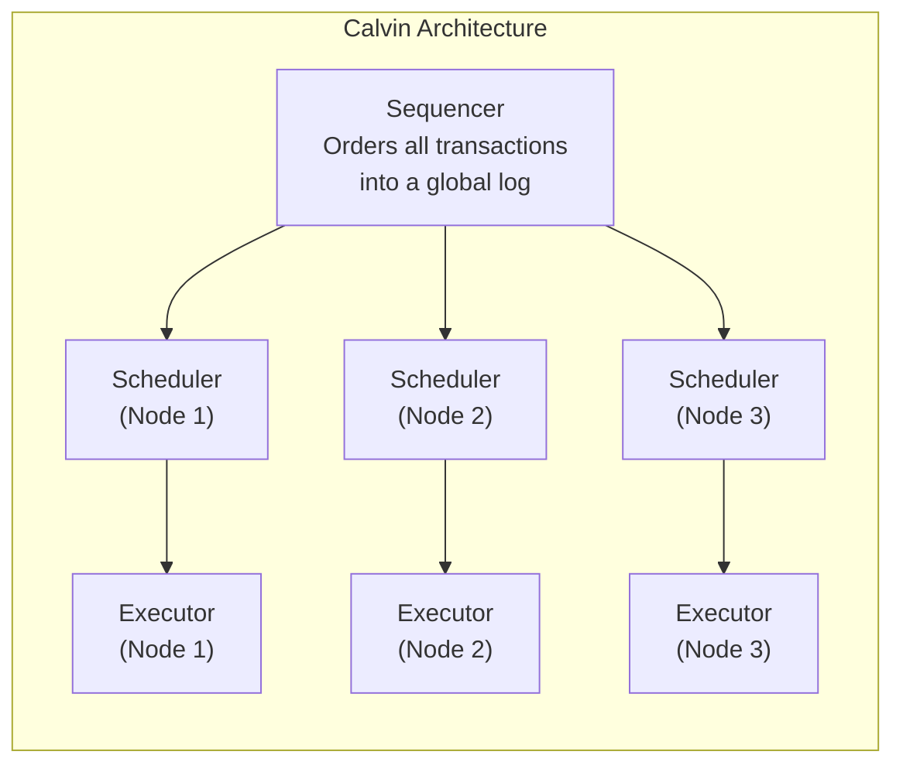

**How it works:**
1. All transactions are submitted to a **sequencer** that orders them into 10ms batches.
2. The ordered batch is replicated (via Paxos) to all nodes.
3. Each node's **scheduler** deterministically executes transactions in the agreed order.
4. Since all nodes execute the same transactions in the same order, they reach the same state without coordination during execution.
5. No 2PC needed for multi-partition transactions.

**Trade-offs:**
- Requires knowing the read/write set before execution (or using reconnaissance queries).
- Aborts are expensive (must be deterministically agreed upon).
- Well-suited for known workloads, less flexible for ad-hoc queries.

**Used by:** FaunaDB (now Fauna).

---

## Gossip Protocols

Gossip (epidemic) protocols spread information through a cluster the way rumors spread in a population. Used for membership, failure detection, and metadata propagation.

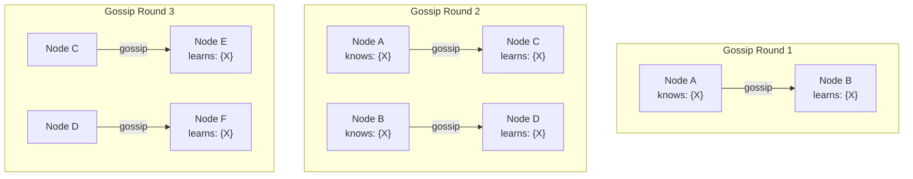

**Properties:**
- Information reaches all N nodes in O(log N) rounds.
- Tolerant of node failures (if a gossip target is down, pick another).
- Eventually consistent by nature.
- Scalable: each node only communicates with a few others per round.

### Failure Detection with Gossip

**SWIM (Scalable Weakly-consistent Infection-style Membership):**
1. Each node periodically pings a random other node.
2. If no response, ask K other nodes to ping the suspect (indirect probing).
3. If still no response, mark the node as suspect.
4. If the suspect does not refute within a timeout, declare it dead.
5. Membership changes are piggybacked on gossip messages.

**Used by:** Cassandra (modified gossip), Consul (SWIM), Memberlist (HashiCorp).

---

## Anti-Entropy and Read Repair

In leaderless replication systems, replicas can diverge. Two mechanisms fix this:

### Read Repair

When a client reads from multiple replicas (quorum read) and detects stale data on some replicas, it writes the latest value back to the stale replicas.

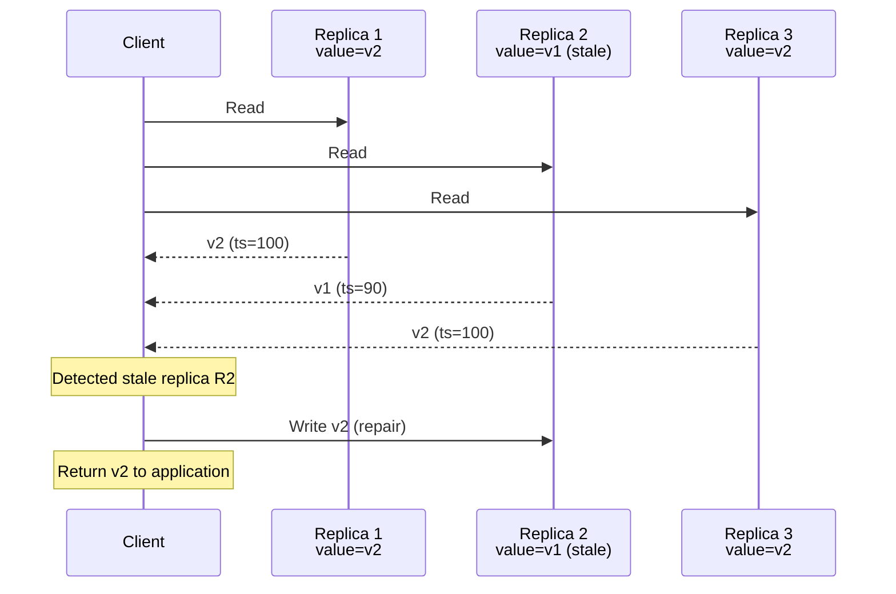

### Anti-Entropy (Merkle Trees)

A background process compares data between replicas using **Merkle trees** (hash trees). Only the differing ranges need to be transferred.

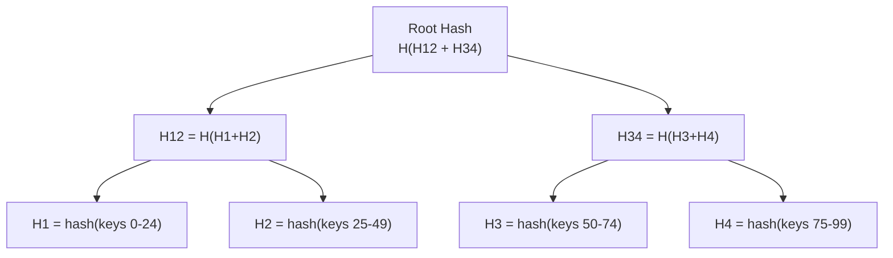

Two replicas compare root hashes. If they differ, descend into children. Only leaf nodes that differ need data transfer. This makes synchronization efficient even for large datasets.

---

## Sloppy Quorums and Hinted Handoff (Dynamo)

Amazon's Dynamo (2007) introduced **sloppy quorums** for higher availability.

**Strict quorum:** Write to W of the N designated replicas. If fewer than W are available, the write fails.

**Sloppy quorum:** If some of the N designated replicas are unavailable, write to other nodes instead (any reachable node in the cluster).

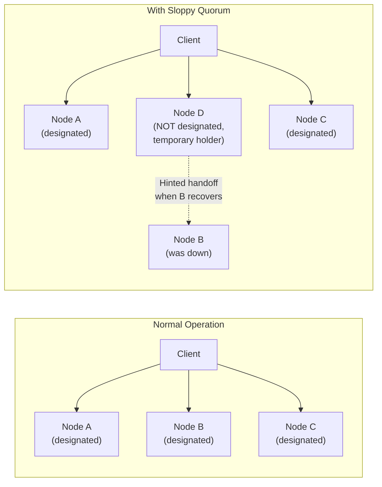

**Hinted Handoff:** The temporary node stores the write with a "hint" indicating the intended recipient. When the intended node recovers, the hint is replayed and the data is transferred.

**Trade-off:** Sloppy quorums improve write availability but weaken consistency guarantees. A read quorum may not overlap with the sloppy write quorum, so you could read stale data even with W + R > N.

---

## Change Data Capture (CDC) and Log-Based Messaging

CDC captures changes to a database and streams them to other systems.

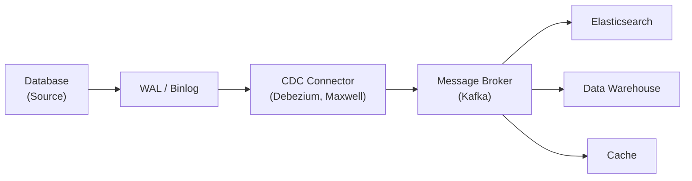

**Approaches:**
- **Log-based CDC:** Read the database's WAL/binlog. Non-intrusive, captures all changes. (Debezium, Maxwell, pg_logical)
- **Trigger-based CDC:** Database triggers record changes to a change table. More overhead.
- **Polling-based CDC:** Periodically query for changes. Misses deletes, high latency.

**Log-based messaging** treats the database's transaction log as the source of truth. Downstream consumers maintain materialized views that are eventually consistent with the source.

---

## CockroachDB Architecture Overview

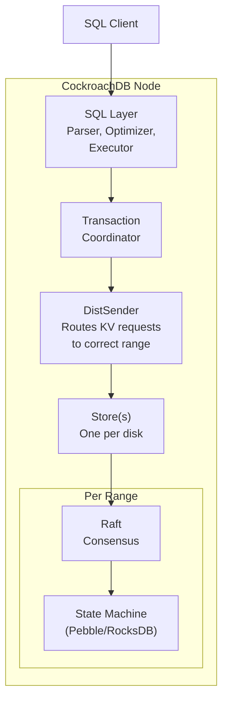

**Key architectural decisions:**
- **Sorted key-value store:** All SQL data is encoded into a sorted key-value map. Tables, indexes, and system metadata all live in the same key space.
- **Range-based sharding:** The key space is divided into 512 MB ranges.
- **Multi-Raft:** Each range is a Raft group with 3 replicas (configurable).
- **Leaseholder reads:** The range leaseholder can serve consistent reads without Raft, using lease expiry for correctness.
- **Transaction model:** Serializable isolation using MVCC + optimistic/pessimistic locking. Parallel commits optimization reduces commit latency.
- **Hybrid Logical Clocks (HLC):** Combines physical time with logical counters for causal ordering without specialized hardware.
- **Closed timestamps:** Each node periodically "closes" a timestamp, guaranteeing no future writes below it. Enables consistent follower reads.

---

## TiDB Architecture Overview

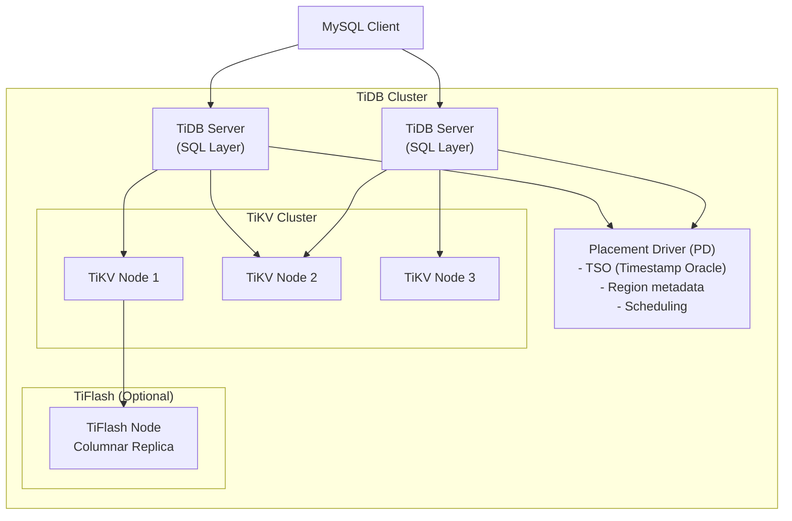

**Key components:**
- **TiDB Server:** Stateless SQL layer. Parses SQL, optimizes queries, coordinates transactions. Horizontally scalable.
- **TiKV:** Distributed key-value store. Uses Multi-Raft with regions. Stores data in RocksDB. Handles MVCC and Percolator-style transactions.
- **PD (Placement Driver):** Cluster metadata, timestamp allocation (TSO), scheduling (region balancing, leader transfer).
- **TiFlash:** Columnar storage for analytical queries. Raft-based replication from TiKV. Enables HTAP (Hybrid Transactional/Analytical Processing).

**Transaction model:** Percolator-based optimistic transactions with pessimistic mode available. TSO provides globally unique, monotonically increasing timestamps.

---

## YugabyteDB Architecture Overview

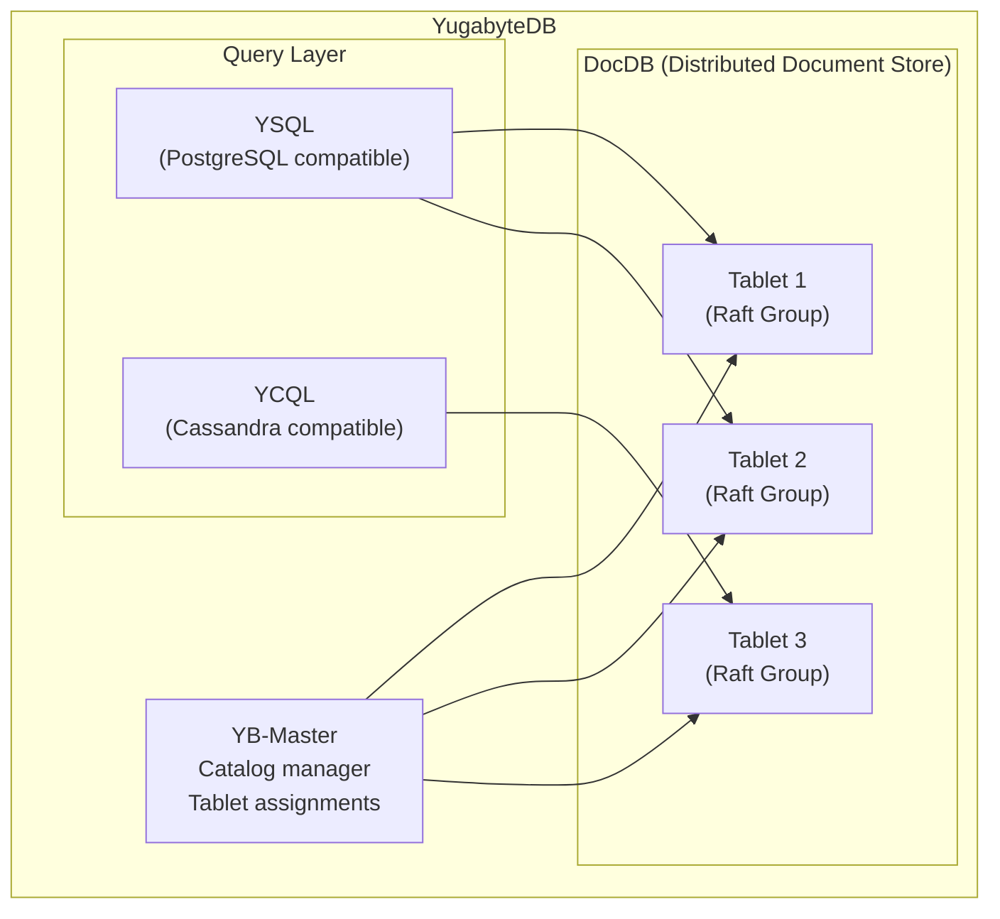

**Key features:**
- **DocDB:** The core storage layer. Uses Raft consensus per tablet (similar to CockroachDB's ranges).
- **YSQL:** Wire-compatible with PostgreSQL. Reuses PostgreSQL's query layer.
- **YCQL:** Wire-compatible with Cassandra Query Language. Supports document and wide-column models.
- **Hybrid clock:** Uses HLC for transaction ordering (similar to CockroachDB, no specialized hardware like Spanner).
- **Tablet splitting:** Automatic tablet splitting when a tablet exceeds a size threshold.
- **Geo-partitioning:** Supports pinning data to specific geographic regions for compliance and latency.

---

## Comparison: CockroachDB vs TiDB vs YugabyteDB

| Feature | CockroachDB | TiDB | YugabyteDB |
|---------|------------|------|------------|
| SQL Compatibility | PostgreSQL wire protocol | MySQL wire protocol | PostgreSQL (YSQL) + Cassandra (YCQL) |
| Storage Engine | Pebble (Go) | RocksDB (via TiKV, Rust) | DocDB (C++, RocksDB-based) |
| Consensus | Multi-Raft | Multi-Raft | Multi-Raft |
| Clock | HLC | TSO (centralized) | HLC |
| Transaction Model | Serializable, MVCC | Percolator (optimistic + pessimistic) | Snapshot + serializable |
| HTAP | No | Yes (TiFlash) | No |
| License | BSL (source available) | Apache 2.0 | Apache 2.0 |
| Written In | Go | Go (TiDB) + Rust (TiKV) | C++ (DocDB) + C (PostgreSQL) |

---

## Key Insights

1. **Multi-Raft is the standard architecture** for modern distributed SQL databases. It provides fine-grained replication and load balancing.
2. **Percolator's design** (timestamps + locks in the storage layer) is elegant and widely adopted beyond Google.
3. **Calvin shows that determinism can eliminate coordination**, but requires knowing the access pattern upfront.
4. **Gossip protocols scale logarithmically**, making them ideal for large clusters where centralized membership would be a bottleneck.
5. **CDC enables event-driven architectures** by turning a database into a stream source, decoupling producers from consumers.
6. **All three major NewSQL databases** (CockroachDB, TiDB, YugabyteDB) converged on Multi-Raft as the core consensus mechanism, validating the architecture.
