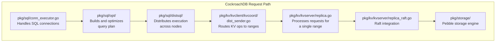
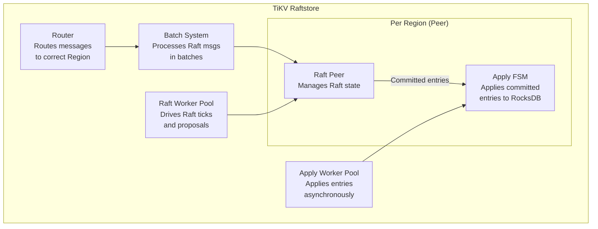
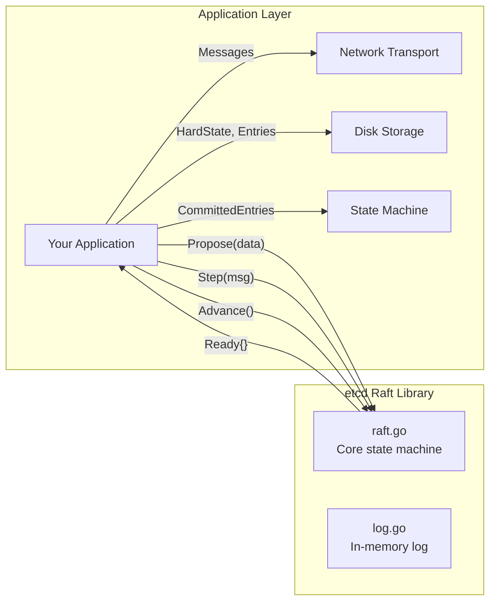
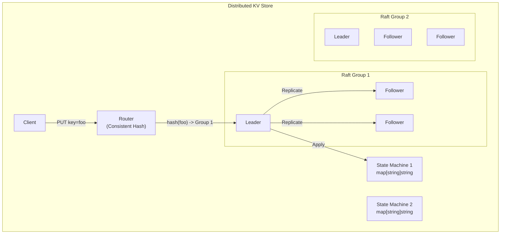
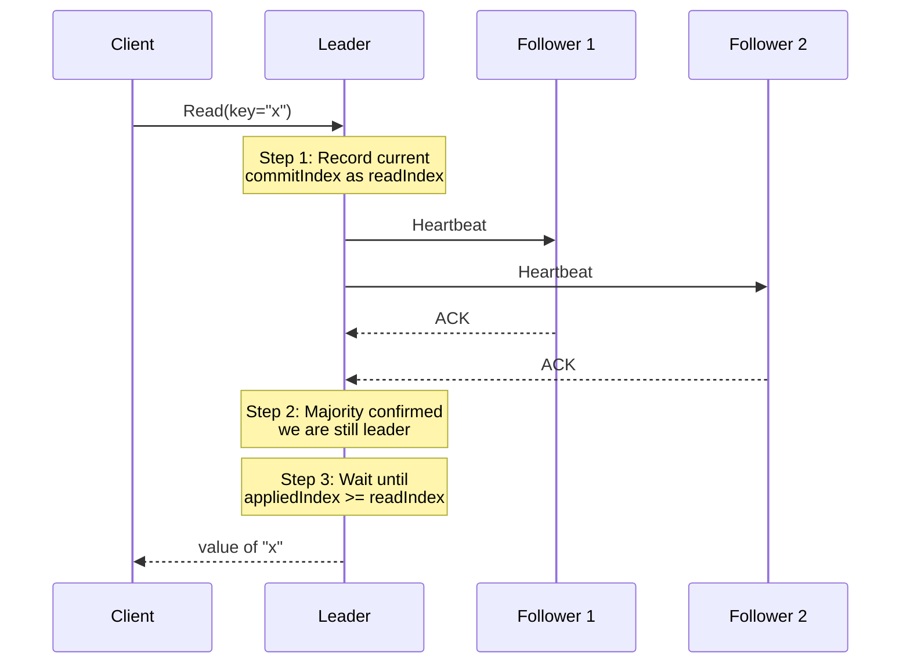
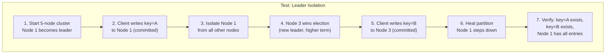

# Module 10: Distributed Databases & Consensus - Implementation Walkthrough

## Overview

This module walks through how consensus and distributed storage are implemented in real systems. We examine source code structure of CockroachDB, TiKV, and etcd, then build simplified implementations.

---

## Understanding CockroachDB Source Code Structure

CockroachDB is written in Go. The repository is organized as follows:

```
cockroachdb/cockroach/
├── pkg/
│   ├── sql/           # SQL layer: parser, optimizer, executor
│   │   ├── parser/    # SQL parser (uses yacc)
│   │   ├── opt/       # Cost-based optimizer (Cascades framework)
│   │   ├── sem/       # Semantic analysis
│   │   └── execinfra/ # Distributed execution infrastructure
│   ├── kv/            # Key-Value layer
│   │   ├── kvserver/  # Range management, Raft integration
│   │   ├── kvclient/  # Client-side KV operations
│   │   └── kvpb/      # KV protobuf definitions
│   ├── storage/       # Storage engine (Pebble)
│   ├── roachpb/       # Core protobuf definitions
│   └── raft/          # Raft implementation (forked from etcd)
```

### Key Source Files



### CockroachDB Raft Integration

CockroachDB uses a fork of etcd's Raft library. The key integration point is in `replica_raft.go`:

```go
// Simplified from pkg/kv/kvserver/replica_raft.go

// proposeRaftCommandLocked proposes a command to the Raft group.
func (r *Replica) proposeRaftCommandLocked(
    ctx context.Context, ba *kvpb.BatchRequest,
) (*ProposalData, error) {
    // 1. Serialize the command
    cmd := encodeRaftCommand(ba)

    // 2. Assign a lease applied index
    proposal := &ProposalData{
        command:    cmd,
        doneCh:     make(chan proposalResult, 1),
    }

    // 3. Propose through Raft
    err := r.mu.internalRaftGroup.Propose(cmd)
    if err != nil {
        return nil, err
    }

    // 4. Register the proposal to be notified when committed
    r.mu.proposals[proposal.idKey] = proposal
    return proposal, nil
}

// handleRaftReady processes committed Raft entries.
func (r *Replica) handleRaftReady(rd raft.Ready) {
    // 1. Persist new entries to stable storage
    r.store.engine.WriteEntries(rd.Entries)

    // 2. Send messages to other replicas
    r.sendRaftMessages(rd.Messages)

    // 3. Apply committed entries to the state machine
    for _, entry := range rd.CommittedEntries {
        r.applyCommittedEntry(entry)
    }

    // 4. Advance the Raft state
    r.mu.internalRaftGroup.Advance(rd)
}
```

---

## Understanding TiKV Source Code

TiKV is written in Rust. Its key modules:

```
tikv/tikv/
├── src/
│   ├── server/        # gRPC server, connection handling
│   ├── raftstore/     # Multi-Raft implementation
│   │   ├── store/     # Raft store, peer management
│   │   └── router/    # Message routing between regions
│   ├── storage/       # Transaction layer (MVCC, Percolator)
│   │   ├── mvcc/      # MVCC read/write operations
│   │   └── txn/       # Transaction commands (prewrite, commit)
│   └── coprocessor/   # Push-down computation
├── components/
│   ├── raft/          # Raft library (port of etcd's Raft)
│   ├── engine_rocks/  # RocksDB binding
│   └── pd_client/     # Placement Driver client
```

### TiKV Raftstore Architecture



**Key design:** TiKV separates Raft processing from apply processing. The Raft worker handles proposals and message passing, while the Apply worker asynchronously applies committed entries to RocksDB. This pipeline improves throughput.

### TiKV Transaction Flow (Percolator)

```rust
// Simplified from src/storage/txn/commands/prewrite.rs

pub fn prewrite(
    reader: &mut MvccReader,
    txn: &mut MvccTxn,
    mutation: Mutation,
    primary: &[u8],
    start_ts: TimeStamp,
) -> Result<()> {
    // 1. Check for write conflicts
    // Look for any writes after start_ts
    if let Some(write) = reader.seek_write(key, TimeStamp::max())? {
        if write.commit_ts > start_ts {
            return Err(Error::WriteConflict);
        }
    }

    // 2. Check for existing locks
    if let Some(lock) = reader.load_lock(key)? {
        if lock.ts != start_ts {
            return Err(Error::KeyIsLocked(lock));
        }
    }

    // 3. Write the lock
    let lock = Lock::new(
        LockType::Put,
        primary.to_vec(),
        start_ts,
        /* ttl */ 3000,
    );
    txn.put_lock(key, &lock);

    // 4. Write the value
    txn.put_value(key, start_ts, value);

    Ok(())
}
```

---

## How etcd Implements Raft

etcd's Raft library is the most widely used Raft implementation. It is used by etcd, CockroachDB, TiKV (ported to Rust), and many others.

### etcd Raft Design Philosophy

The library is intentionally **minimal**. It does NOT handle:
- Network transport (you send messages)
- Disk persistence (you write entries)
- State machine application (you apply committed entries)

This design lets the embedding application optimize these layers.



### The Ready Struct

The core interface between the Raft library and the application:

```go
// From go.etcd.io/raft/v3/node.go

type Ready struct {
    // SoftState: leader changes (no need to persist)
    *SoftState

    // HardState: voted for, current term, commit index (MUST persist)
    pb.HardState

    // Entries: new log entries to persist BEFORE sending messages
    Entries []pb.Entry

    // Snapshot: snapshot to persist
    Snapshot pb.Snapshot

    // CommittedEntries: entries committed and ready to apply
    CommittedEntries []pb.Entry

    // Messages: messages to send to other nodes AFTER persisting entries
    Messages []pb.Message
}
```

### Application Event Loop

```go
// Simplified etcd Raft application loop

func (s *Server) run() {
    ticker := time.NewTicker(100 * time.Millisecond)
    defer ticker.Stop()

    for {
        select {
        case <-ticker.C:
            s.raftNode.Tick()

        case rd := <-s.raftNode.Ready():
            // 1. Persist hard state and entries to WAL
            s.wal.Save(rd.HardState, rd.Entries)

            // 2. Apply snapshot if any
            if !raft.IsEmptySnap(rd.Snapshot) {
                s.snapshotter.SaveSnap(rd.Snapshot)
                s.store.ApplySnapshot(rd.Snapshot)
            }

            // 3. Append entries to Raft log storage
            s.raftStorage.Append(rd.Entries)

            // 4. Send messages to peers
            s.transport.Send(rd.Messages)

            // 5. Apply committed entries to state machine
            for _, entry := range rd.CommittedEntries {
                s.applyEntry(entry)
            }

            // 6. Signal Raft that Ready has been processed
            s.raftNode.Advance(rd)

        case msg := <-s.transport.Recv():
            s.raftNode.Step(msg)
        }
    }
}
```

---

## Implementing a Simple Raft Leader Election (Go)

Let us build a simplified Raft leader election from scratch.

```go
package raft

import (
    "math/rand"
    "sync"
    "time"
)

type NodeState int

const (
    Follower NodeState = iota
    Candidate
    Leader
)

type RaftNode struct {
    mu sync.Mutex

    id        int
    peers     []int        // IDs of other nodes
    state     NodeState
    currentTerm int
    votedFor    int         // -1 if none
    log         []LogEntry

    // Leader state
    commitIndex int
    lastApplied int
    nextIndex   map[int]int  // for each peer
    matchIndex  map[int]int  // for each peer

    // Channels for communication
    voteCh      chan VoteRequest
    voteRespCh  chan VoteResponse
    appendCh    chan AppendEntriesRequest
    appendRespCh chan AppendEntriesResponse

    // Timer
    electionTimeout time.Duration
    heartbeatTicker *time.Ticker
    resetTimerCh    chan struct{}
}

type LogEntry struct {
    Term    int
    Index   int
    Command interface{}
}

type VoteRequest struct {
    Term         int
    CandidateID  int
    LastLogIndex int
    LastLogTerm  int
}

type VoteResponse struct {
    Term        int
    VoteGranted bool
}

func NewRaftNode(id int, peers []int) *RaftNode {
    return &RaftNode{
        id:          id,
        peers:       peers,
        state:       Follower,
        currentTerm: 0,
        votedFor:    -1,
        nextIndex:   make(map[int]int),
        matchIndex:  make(map[int]int),
        voteCh:      make(chan VoteRequest, 100),
        voteRespCh:  make(chan VoteResponse, 100),
        appendCh:    make(chan AppendEntriesRequest, 100),
        appendRespCh: make(chan AppendEntriesResponse, 100),
        resetTimerCh: make(chan struct{}, 1),
    }
}

// randomElectionTimeout returns a random duration between 150-300ms
func randomElectionTimeout() time.Duration {
    return time.Duration(150+rand.Intn(150)) * time.Millisecond
}

// Run starts the Raft node's main loop
func (rn *RaftNode) Run() {
    rn.electionTimeout = randomElectionTimeout()
    electionTimer := time.NewTimer(rn.electionTimeout)

    for {
        switch rn.state {
        case Follower:
            rn.runFollower(electionTimer)
        case Candidate:
            rn.runCandidate(electionTimer)
        case Leader:
            rn.runLeader()
        }
    }
}

func (rn *RaftNode) runFollower(timer *time.Timer) {
    select {
    case <-timer.C:
        // Election timeout: become candidate
        rn.mu.Lock()
        rn.state = Candidate
        rn.mu.Unlock()
        timer.Reset(randomElectionTimeout())

    case req := <-rn.voteCh:
        rn.handleVoteRequest(req)
        timer.Reset(randomElectionTimeout())

    case req := <-rn.appendCh:
        rn.handleAppendEntries(req)
        timer.Reset(randomElectionTimeout())
    }
}

func (rn *RaftNode) runCandidate(timer *time.Timer) {
    rn.mu.Lock()
    rn.currentTerm++
    rn.votedFor = rn.id
    currentTerm := rn.currentTerm
    rn.mu.Unlock()

    // Request votes from all peers
    votesReceived := 1 // voted for self
    votesNeeded := (len(rn.peers)+1)/2 + 1

    lastLogIndex, lastLogTerm := rn.lastLogInfo()

    for _, peer := range rn.peers {
        go rn.sendVoteRequest(peer, VoteRequest{
            Term:         currentTerm,
            CandidateID:  rn.id,
            LastLogIndex: lastLogIndex,
            LastLogTerm:  lastLogTerm,
        })
    }

    // Wait for responses
    for {
        select {
        case <-timer.C:
            // Election timeout: start new election
            timer.Reset(randomElectionTimeout())
            return

        case resp := <-rn.voteRespCh:
            if resp.Term > currentTerm {
                rn.mu.Lock()
                rn.currentTerm = resp.Term
                rn.state = Follower
                rn.votedFor = -1
                rn.mu.Unlock()
                timer.Reset(randomElectionTimeout())
                return
            }
            if resp.VoteGranted {
                votesReceived++
                if votesReceived >= votesNeeded {
                    rn.mu.Lock()
                    rn.state = Leader
                    // Initialize nextIndex and matchIndex
                    for _, peer := range rn.peers {
                        rn.nextIndex[peer] = len(rn.log)
                        rn.matchIndex[peer] = 0
                    }
                    rn.mu.Unlock()
                    return
                }
            }

        case req := <-rn.appendCh:
            // Another leader exists
            rn.handleAppendEntries(req)
            rn.mu.Lock()
            rn.state = Follower
            rn.mu.Unlock()
            timer.Reset(randomElectionTimeout())
            return
        }
    }
}

func (rn *RaftNode) handleVoteRequest(req VoteRequest) {
    rn.mu.Lock()
    defer rn.mu.Unlock()

    // Rule: if request term > current term, update term
    if req.Term > rn.currentTerm {
        rn.currentTerm = req.Term
        rn.state = Follower
        rn.votedFor = -1
    }

    granted := false
    if req.Term >= rn.currentTerm &&
        (rn.votedFor == -1 || rn.votedFor == req.CandidateID) &&
        rn.isLogUpToDate(req.LastLogIndex, req.LastLogTerm) {
        granted = true
        rn.votedFor = req.CandidateID
    }

    rn.voteRespCh <- VoteResponse{
        Term:        rn.currentTerm,
        VoteGranted: granted,
    }
}

func (rn *RaftNode) isLogUpToDate(lastIndex, lastTerm int) bool {
    myLastIndex, myLastTerm := rn.lastLogInfo()
    if lastTerm != myLastTerm {
        return lastTerm > myLastTerm
    }
    return lastIndex >= myLastIndex
}

func (rn *RaftNode) lastLogInfo() (int, int) {
    if len(rn.log) == 0 {
        return 0, 0
    }
    last := rn.log[len(rn.log)-1]
    return last.Index, last.Term
}
```

---

## Implementing Log Replication

Building on the leader election above, here is the log replication mechanism:

```go
type AppendEntriesRequest struct {
    Term         int
    LeaderID     int
    PrevLogIndex int
    PrevLogTerm  int
    Entries      []LogEntry
    LeaderCommit int
}

type AppendEntriesResponse struct {
    Term    int
    Success bool
    // Optimization: conflict info for fast backup
    ConflictTerm  int
    ConflictIndex int
}

func (rn *RaftNode) runLeader() {
    // Send initial heartbeats
    rn.broadcastAppendEntries()

    heartbeat := time.NewTicker(50 * time.Millisecond)
    defer heartbeat.Stop()

    for rn.state == Leader {
        select {
        case <-heartbeat.C:
            rn.broadcastAppendEntries()

        case resp := <-rn.appendRespCh:
            rn.handleAppendResponse(resp)

        case req := <-rn.appendCh:
            // Received AppendEntries from another leader
            if req.Term > rn.currentTerm {
                rn.mu.Lock()
                rn.currentTerm = req.Term
                rn.state = Follower
                rn.votedFor = -1
                rn.mu.Unlock()
                return
            }
        }
    }
}

func (rn *RaftNode) broadcastAppendEntries() {
    rn.mu.Lock()
    defer rn.mu.Unlock()

    for _, peer := range rn.peers {
        nextIdx := rn.nextIndex[peer]
        prevLogIndex := nextIdx - 1
        prevLogTerm := 0
        if prevLogIndex > 0 && prevLogIndex <= len(rn.log) {
            prevLogTerm = rn.log[prevLogIndex-1].Term
        }

        // Entries to send
        var entries []LogEntry
        if nextIdx <= len(rn.log) {
            entries = rn.log[nextIdx-1:]
        }

        go rn.sendAppendEntries(peer, AppendEntriesRequest{
            Term:         rn.currentTerm,
            LeaderID:     rn.id,
            PrevLogIndex: prevLogIndex,
            PrevLogTerm:  prevLogTerm,
            Entries:      entries,
            LeaderCommit: rn.commitIndex,
        })
    }
}

func (rn *RaftNode) handleAppendEntries(req AppendEntriesRequest) {
    rn.mu.Lock()
    defer rn.mu.Unlock()

    // Rule 1: Reply false if term < currentTerm
    if req.Term < rn.currentTerm {
        rn.appendRespCh <- AppendEntriesResponse{
            Term:    rn.currentTerm,
            Success: false,
        }
        return
    }

    // Update term if needed
    if req.Term > rn.currentTerm {
        rn.currentTerm = req.Term
        rn.votedFor = -1
    }
    rn.state = Follower

    // Rule 2: Reply false if log doesn't contain entry at
    // prevLogIndex with prevLogTerm
    if req.PrevLogIndex > 0 {
        if req.PrevLogIndex > len(rn.log) {
            rn.appendRespCh <- AppendEntriesResponse{
                Term:          rn.currentTerm,
                Success:       false,
                ConflictIndex: len(rn.log),
            }
            return
        }
        if rn.log[req.PrevLogIndex-1].Term != req.PrevLogTerm {
            conflictTerm := rn.log[req.PrevLogIndex-1].Term
            // Find first index of conflicting term
            conflictIndex := req.PrevLogIndex
            for conflictIndex > 1 && rn.log[conflictIndex-2].Term == conflictTerm {
                conflictIndex--
            }
            rn.appendRespCh <- AppendEntriesResponse{
                Term:          rn.currentTerm,
                Success:       false,
                ConflictTerm:  conflictTerm,
                ConflictIndex: conflictIndex,
            }
            return
        }
    }

    // Rule 3: Delete conflicting entries and append new ones
    for i, entry := range req.Entries {
        idx := req.PrevLogIndex + i + 1
        if idx <= len(rn.log) {
            if rn.log[idx-1].Term != entry.Term {
                // Delete this and all following entries
                rn.log = rn.log[:idx-1]
                rn.log = append(rn.log, req.Entries[i:]...)
                break
            }
        } else {
            rn.log = append(rn.log, req.Entries[i:]...)
            break
        }
    }

    // Rule 4: Update commit index
    if req.LeaderCommit > rn.commitIndex {
        lastNewIndex := req.PrevLogIndex + len(req.Entries)
        if req.LeaderCommit < lastNewIndex {
            rn.commitIndex = req.LeaderCommit
        } else {
            rn.commitIndex = lastNewIndex
        }
        // Apply committed entries
        rn.applyCommitted()
    }

    rn.appendRespCh <- AppendEntriesResponse{
        Term:    rn.currentTerm,
        Success: true,
    }
}

func (rn *RaftNode) applyCommitted() {
    for rn.lastApplied < rn.commitIndex {
        rn.lastApplied++
        entry := rn.log[rn.lastApplied-1]
        // Apply entry.Command to state machine
        rn.applyToStateMachine(entry)
    }
}
```

---

## Implementing a Distributed Key-Value Store Routing Layer

The routing layer maps keys to the correct Raft group/partition:

```go
package routing

import (
    "hash/crc32"
    "sort"
    "sync"
)

// ConsistentHash implements consistent hashing with virtual nodes
type ConsistentHash struct {
    mu       sync.RWMutex
    ring     []uint32          // sorted hash values
    nodes    map[uint32]string // hash -> node ID
    vnodes   int               // virtual nodes per physical node
}

func NewConsistentHash(vnodes int) *ConsistentHash {
    return &ConsistentHash{
        nodes:  make(map[uint32]string),
        vnodes: vnodes,
    }
}

func (ch *ConsistentHash) hash(key string) uint32 {
    return crc32.ChecksumIEEE([]byte(key))
}

func (ch *ConsistentHash) AddNode(nodeID string) {
    ch.mu.Lock()
    defer ch.mu.Unlock()

    for i := 0; i < ch.vnodes; i++ {
        vkey := fmt.Sprintf("%s-vnode-%d", nodeID, i)
        h := ch.hash(vkey)
        ch.ring = append(ch.ring, h)
        ch.nodes[h] = nodeID
    }
    sort.Slice(ch.ring, func(i, j int) bool {
        return ch.ring[i] < ch.ring[j]
    })
}

func (ch *ConsistentHash) RemoveNode(nodeID string) {
    ch.mu.Lock()
    defer ch.mu.Unlock()

    newRing := make([]uint32, 0)
    for _, h := range ch.ring {
        if ch.nodes[h] != nodeID {
            newRing = append(newRing, h)
        } else {
            delete(ch.nodes, h)
        }
    }
    ch.ring = newRing
}

func (ch *ConsistentHash) GetNode(key string) string {
    ch.mu.RLock()
    defer ch.mu.RUnlock()

    if len(ch.ring) == 0 {
        return ""
    }

    h := ch.hash(key)

    // Binary search for the first node with hash >= h
    idx := sort.Search(len(ch.ring), func(i int) bool {
        return ch.ring[i] >= h
    })

    // Wrap around
    if idx == len(ch.ring) {
        idx = 0
    }

    return ch.nodes[ch.ring[idx]]
}

// GetNodes returns n distinct nodes for replication
func (ch *ConsistentHash) GetNodes(key string, n int) []string {
    ch.mu.RLock()
    defer ch.mu.RUnlock()

    if len(ch.ring) == 0 {
        return nil
    }

    h := ch.hash(key)
    idx := sort.Search(len(ch.ring), func(i int) bool {
        return ch.ring[i] >= h
    })
    if idx == len(ch.ring) {
        idx = 0
    }

    seen := make(map[string]bool)
    var result []string

    for len(result) < n && len(seen) < len(ch.nodes) {
        node := ch.nodes[ch.ring[idx]]
        if !seen[node] {
            seen[node] = true
            result = append(result, node)
        }
        idx = (idx + 1) % len(ch.ring)
    }

    return result
}
```

### KV Store on Top of Raft



```go
// KVStore wraps a Raft node with a key-value state machine
type KVStore struct {
    mu   sync.RWMutex
    data map[string]string
    raft *RaftNode
}

type KVCommand struct {
    Op    string // "put", "get", "delete"
    Key   string
    Value string
}

func (kv *KVStore) Put(key, value string) error {
    cmd := KVCommand{Op: "put", Key: key, Value: value}
    return kv.raft.Propose(cmd)
}

func (kv *KVStore) Get(key string) (string, error) {
    // For linearizable reads, we must go through Raft
    // Option 1: ReadIndex - ask leader to confirm it's still leader
    // Option 2: Lease-based reads (leader holds a time-based lease)

    readIndex, err := kv.raft.ReadIndex()
    if err != nil {
        return "", err
    }

    // Wait until we've applied up to readIndex
    kv.raft.WaitForApply(readIndex)

    kv.mu.RLock()
    defer kv.mu.RUnlock()
    return kv.data[key], nil
}

// applyToStateMachine is called by the Raft layer for committed entries
func (kv *KVStore) applyToStateMachine(entry LogEntry) {
    cmd := entry.Command.(KVCommand)

    kv.mu.Lock()
    defer kv.mu.Unlock()

    switch cmd.Op {
    case "put":
        kv.data[cmd.Key] = cmd.Value
    case "delete":
        delete(kv.data, cmd.Key)
    }
}
```

---

## Linearizable Reads: ReadIndex Protocol



**Why this is needed:** Without ReadIndex, a leader that has been partitioned away (but does not know it yet) could serve stale reads. The heartbeat round confirms it is still the legitimate leader.

---

## Key Source Files in Real Distributed Databases

### etcd Raft Library
| File | Purpose |
|------|---------|
| `raft.go` | Core Raft state machine |
| `log.go` | In-memory log management |
| `log_unstable.go` | Entries not yet persisted |
| `rawnode.go` | Application-facing API |
| `tracker/progress.go` | Per-follower replication progress |
| `confchange/` | Membership change logic |

### CockroachDB
| File | Purpose |
|------|---------|
| `pkg/kv/kvserver/replica.go` | Central range/replica management |
| `pkg/kv/kvserver/replica_raft.go` | Raft proposal and apply |
| `pkg/kv/kvserver/store.go` | Manages all replicas on a node |
| `pkg/kv/kvserver/batcheval/` | Evaluates KV operations |
| `pkg/kv/kvclient/kvcoord/dist_sender.go` | Routes KV requests to ranges |
| `pkg/sql/opt/` | Query optimizer |

### TiKV
| File | Purpose |
|------|---------|
| `src/raftstore/store/peer.rs` | Per-region Raft peer |
| `src/raftstore/store/fsm/apply.rs` | Apply committed entries |
| `src/storage/mvcc/reader.rs` | MVCC read operations |
| `src/storage/txn/commands/prewrite.rs` | Percolator prewrite |
| `src/storage/txn/commands/commit.rs` | Percolator commit |
| `components/raft/src/raft.rs` | Raft state machine (Rust port) |

---

## Testing Distributed Systems

### Simulating Network Partitions

```go
// NetworkSimulator allows testing partition scenarios
type NetworkSimulator struct {
    mu        sync.Mutex
    partitions map[int]map[int]bool // partitions[a][b] = true means a cannot reach b
}

func NewNetworkSimulator() *NetworkSimulator {
    return &NetworkSimulator{
        partitions: make(map[int]map[int]bool),
    }
}

func (ns *NetworkSimulator) Partition(nodeA, nodeB int) {
    ns.mu.Lock()
    defer ns.mu.Unlock()
    if ns.partitions[nodeA] == nil {
        ns.partitions[nodeA] = make(map[int]bool)
    }
    if ns.partitions[nodeB] == nil {
        ns.partitions[nodeB] = make(map[int]bool)
    }
    ns.partitions[nodeA][nodeB] = true
    ns.partitions[nodeB][nodeA] = true
}

func (ns *NetworkSimulator) Heal(nodeA, nodeB int) {
    ns.mu.Lock()
    defer ns.mu.Unlock()
    delete(ns.partitions[nodeA], nodeB)
    delete(ns.partitions[nodeB], nodeA)
}

func (ns *NetworkSimulator) CanReach(from, to int) bool {
    ns.mu.Lock()
    defer ns.mu.Unlock()
    if ns.partitions[from] == nil {
        return true
    }
    return !ns.partitions[from][to]
}

// IsolateNode creates a partition between a node and all others
func (ns *NetworkSimulator) IsolateNode(node int, allNodes []int) {
    for _, other := range allNodes {
        if other != node {
            ns.Partition(node, other)
        }
    }
}
```



---

## Summary

The implementation patterns across CockroachDB, TiKV, and etcd share common themes:

1. **Separation of Raft library from application** - The Raft state machine is a pure library; persistence, networking, and state machine application are the caller's responsibility.
2. **Batch processing** - Both CockroachDB and TiKV batch Raft messages for efficiency.
3. **Pipelined apply** - Separating Raft log replication from state machine application improves throughput.
4. **ReadIndex for linearizable reads** - Avoids routing all reads through Raft log replication.
5. **Consistent hashing for routing** - Maps keys to Raft groups with minimal disruption during membership changes.
